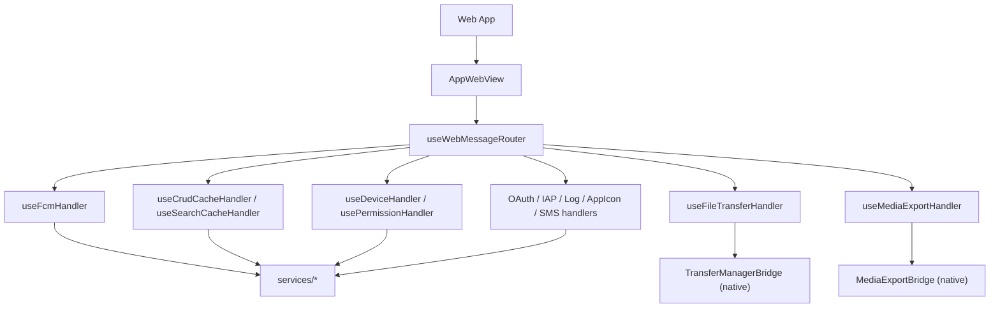
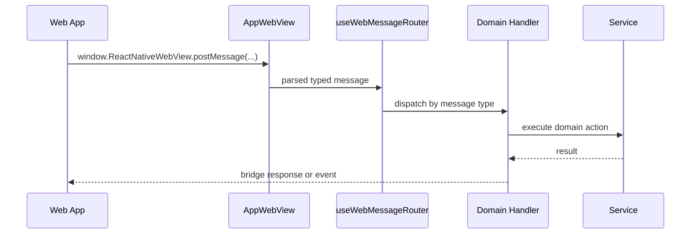

# WebView

The WebView is the message boundary between the web client and the native shell: the web posts a
typed message, and a handler hook answers it through a service.

> To inspect webview console output and errors at the code level (Safari Web Inspector /
> `chrome://inspect`), see [webview-debugging.md](./webview-debugging.md).

## Key files

| File                                           | Role                                                                          |
| ---------------------------------------------- | ----------------------------------------------------------------------------- |
| `src/app/webview/AppWebView.tsx`               | Renders the `WebView`, wires the injected runtime scripts, tracks ready state |
| `src/app/webview/hooks/useBaseBridge.ts`       | Builds the `AppBridgeHost` (`@chatic/bridges`) and its `onMessage` handler    |
| `src/app/webview/hooks/useAppBridge.ts`        | Thin wrapper exposing `{ bridge, onMessage }` to `MainScreen`                 |
| `src/app/webview/hooks/useWebMessageRouter.ts` | Central message router; dispatches to 29 handler hooks                        |
| `src/app/webview/hooks/*Handler.ts`            | 29 domain handlers, one per capability group                                  |
| `src/app/webview/utils/injectionScripts.ts`    | Builds the scripts injected before the WebView loads                          |

`webview/core/bridge.ts` (`createBridge`, `postAppMessage`, `receiveWebMessage`) has no importer
anywhere in `apps/mobile/src` — the bridge actually in use is `AppBridgeHost` from `@chatic/bridges`,
assembled in `useBaseBridge.ts`.

```bash
grep -rln "from '.*core/bridge'" apps/mobile/src
```

## Trust boundary

Only the web the WebView was pointed at may reach native features. `useBaseBridge`'s `onMessage` drops
a message — with a `BRIDGE` warning in the log and no reply — unless its page URL is on the origin of
the resolved base URL (release web, debug override, or custom-zip server) or on one of the app's own
web hosts (`DEEP_LINK_DOMAINS`). A new web host the base URL redirects to has to be added there, or the
bridge goes silent. The check lives in `webview/utils/urlTrust.ts` and parses origins by hand, because
React Native's `URL.origin` keeps userinfo, query and fragment while Jest's does not.

`OpenURL` opens only `http`, `https`, `mailto`, `tel`, `sms` and the app schemes (`chatic`,
`chatic-dev`); anything else answers `LINK_NOT_ALLOWED` without reaching the OS.

The page is always served over http(s), so file-URL pages get no extra reach
(`allowFileAccessFromFileURLs` / `allowUniversalAccessFromFileURLs` are off). `originWhitelist`,
navigation and `mixedContentMode` are still open: narrowing them needs a device pass over sign-in,
payment and the http-served images.

## Structure


```mermaid
flowchart TD
    WebApp["Web App"] --> RNWebView["AppWebView"]
    RNWebView --> Router["useWebMessageRouter"]
    Router --> FCM["useFcmHandler"]
    Router --> Transfer["useFileTransferHandler"]
    Router --> Media["useMediaExportHandler"]
    Router --> Cache["useCrudCacheHandler / useSearchCacheHandler"]
    Router --> Device["useDeviceHandler / usePermissionHandler"]
    Router --> Other["OAuth / IAP / Log / AppIcon / SMS handlers"]
    FCM --> Services["services/*"]
    Transfer --> Native["TransferManagerBridge (native)"]
    Media --> Export["MediaExportBridge (native)"]
    Cache --> Services
    Device --> Services
    Other --> Services
```

## Message flow


```mermaid
sequenceDiagram
    participant Web as Web App
    participant WV as AppWebView
    participant Router as useWebMessageRouter
    participant Handler as Domain Handler
    participant Service as Service

    Web->>WV: window.ReactNativeWebView.postMessage(...)
    WV->>Router: parsed typed message
    Router->>Handler: dispatch by message type
    Handler->>Service: execute domain action
    Service-->>Handler: result
    Handler-->>Web: bridge response or event
```

Messages are not queued. `useBaseBridge` hands each one to `AppBridgeHost.handleMessage` without
waiting for the previous one, so handlers run concurrently and a slow one holds up nothing else.
Some rely on that: `ShareFile` on iOS answers only when the share sheet closes, minutes later if the
user lingers — see [../native/media-export.md](../native/media-export.md). Two requests of the same
kind can therefore finish out of order; a handler that needs ordering has to provide it itself.

A message is registered only where this build can answer it. The photo-library messages are added to
the routing map only when the native `PhotoLibrary` module exists, so a JS bundle run over a native
build without it leaves them unregistered and `AppBridgeHost` answers `NOT_FOUND` — the answer the
web falls back to its file input on ([../native/photo-library.md](../native/photo-library.md)). A
handler that exists but fails would take that fallback away.

## The WebAppReady handshake

`WebAppReady` is not one of the routed messages — `AppBridgeHost` (`@chatic/bridges`) answers it
internally, inside `handleMessage`, before a message ever reaches `useWebMessageRouter`. It is a
capability handshake, not a plain ready ping: the reply reports the app's local-cache schema version
and supported cache types (read from the SQLite install, warmed in parallel with the WebView's bundle
load) so a web build newer than this app can route unsupported cache domains to its own storage
instead of a silent void. `useBaseBridge.ts` passes an `onAppReady` callback into `AppBridgeHost`;
`MainScreen` uses it to mark the `bootMetricsService` `web-app-ready` timestamp and to hand the
web's declaration to `bootSplashService` — a web build that does not declare `holdsBootSplash` is
revealed on the handshake itself, since it will never send `FirstScreenReady`. `DismissResumeOverlay`, by contrast, is a normal
routed message — `useAppStateHandler` answers it like any other handler — that fires when the web's
own repaint animation after a resume has finished, and is what actually hides `ResumeOverlay`.

| Message                          | What it does                                                                                                                                                   |
| -------------------------------- | -------------------------------------------------------------------------------------------------------------------------------------------------------------- |
| `WebAppReady`                    | Handshake, answered inside `@chatic/bridges`; buffers and flushes any push events queued before it                                                             |
| `DismissResumeOverlay`           | Routed handler (`useAppStateHandler`); clears the resume overlay after the web's repaint                                                                       |
| `FirstScreenReady`               | Routed handler (`useBootSplashHandler`); lifts the launch splash and the crash-reload cover — see [../boot/boot-splash.md](../boot/boot-splash.md)             |
| `SavePreference` with `theme`    | Routed handler (`usePreferenceCacheHandler`); updates the native theme store — see [../system/theme.md](../system/theme.md)                                    |
| `SavePreference` with `language` | Routed handler (`usePreferenceCacheHandler`); validates `system`/`ko`/`en` and updates the language store — see [../system/language.md](../system/language.md) |

## Injection

Before the WebView loads, `injectionScripts.ts` assembles one script (`getSyncInjectionScript`) that
sets these globals, guarded so a runtime failure reports itself through `SendLog` (tag `INJECTION`)
instead of surfacing as an opaque "Script error.":

- safe-area insets and keyboard height, as CSS variables — and `AppWebView` injects them again
  whenever either changes, which is how a keyboard opening reaches the web. `--keyboard-height` is
  how far the keyboard reaches up from the WebView's bottom edge, which is the screen edge on both
  platforms (Android runs edge-to-edge). Android's `Keyboard` event reports the height with the navigation bar subtracted,
  so `useKeyboardHeight` adds the safe-area bottom back there — without it, anything padded by the
  variable (the chat composer) sits behind the keyboard by exactly the navigation bar.
- device info: run id, platform, stage, app/OS version, build number, language, device model
- `CHATIC_APP_CONSOLE_ENABLED` — whether relaying `debug` logs to native is worth it in this build.
  The legacy `__console__` relay script it replaced is gone; `SendLog` is now the only web→native log
  channel (ADR-0097).
- device identity: `CHATIC_APP_UNIQUE_DEVICE_ID` (raw device id) and
  `CHATIC_APP_FIREBASE_INSTALLATION_ID` (empty until the async Firebase lookup resolves), plus two
  `@deprecated` globals kept for older web bundles — `CHATIC_APP_DEVICE_ID`
  (`uniqueDeviceId:firebaseInstallId`, built by
  [`buildInjectedUniqueId.ts`](../../src/app/webview/utils/buildInjectedUniqueId.ts)) and
  `CHATIC_APP_INSTALLATION_ID` (confusingly named — it is the bare device id, not a Firebase id)
- the persisted theme (`CHATIC_APP_THEME`), read by the web's pre-paint script — see
  [../system/theme.md](../system/theme.md)
- `CHATIC_APP_CONFIG_BAG` — `@chatic/config`'s shell-lane KV bag, so `config.init()` can hydrate
  synchronously before the web's first paint

All string values are `JSON.stringify`-interpolated rather than quoted directly: an unescaped quote
or backslash from native data (a localized app name, an odd Android device-model string) would
otherwise break out of the literal and throw inside a script with no `<script src>` to attribute the
error to.

## Device contacts

`GetContacts` is answered by `useDeviceHandler` through `DeviceService.getContacts`, which returns
the list together with `permission` (`granted` or `denied`) so the web can tell a refusal from an
empty address book. The list is read **without photos**: with them iOS writes a PNG into Caches for
every contact that has one, and the web shows none of them.

The two platforms settle the permission at different moments:

- **Android** checks, then requests, `READ_CONTACTS` before reading; a refusal returns an empty
  `denied` result without touching the provider.
- **iOS** reads first and lets the read raise the system prompt. It never calls
  `Contacts.checkPermission()`: in react-native-contacts 8.0.10 the new-architecture implementation
  never settles on iOS 18+ while the status is not yet determined or limited — its iOS 18 branch
  tests `Restricted` where it means `Limited`. Called before the read it hung the request before any
  prompt appeared; called after a read that followed partial access it never returned. A refusal is
  read from the read's own rejection instead — the library rejects with the message `denied`
  exactly when the status is denied or restricted — and any other rejection is a real failure.

The cost is that partial access is reported as `granted`: the list is real, only shorter.
Reporting it separately needs a status call that settles — a patched or upgraded library — and a
new `permission` value the web can adopt without breaking older builds, since the field is optional
on the wire.

## Change checklist

- Is a new WebView message type reflected in `@chatic/app-messages` and in both a handler and the
  router?
- Does a handler only call a service, without carrying its own domain logic?
- Is it safe to call before and after WebView ready?
- Do the bridge response/event names match the web contract?
