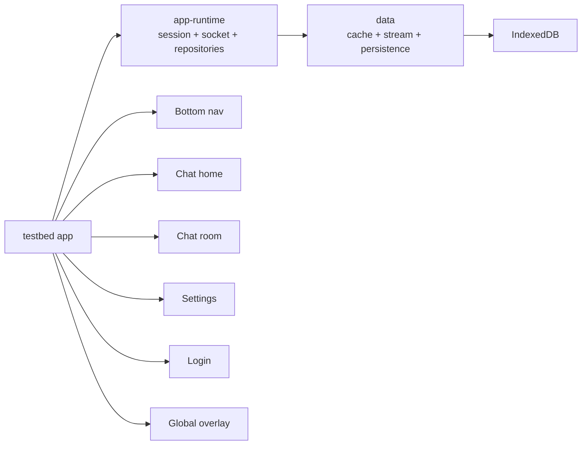

# @chatic/testbed

**A chat-shell-shaped verification app, not a dashboard.** `testbed` exists to check that
`@chatic/app-runtime`, `@chatic/data` and their socket/cache/DB stack behave correctly when driven
through a real user flow — session switching, cloud/place/channel selection, message paging and
send — rather than through a flat list of raw repository calls. If a page here looks like it belongs
in a product, that resemblance is deliberate: a screen that shape-matches the real chat app catches
integration bugs a data-inspector page cannot.

This document covers the **overview and structure** only. Per-screen detail is under
[`docs/`](docs/README.md).

## Scope

**In scope:** wiring `apps/testbed` together as an Nx app; assembling `app-runtime` and `data` for
real; the guest → cloud transition; cloud/place/channel/chat data flow; runtime state inspection
through the global overlay.

**Out of scope:** production-grade visual polish; advanced profile/member management; extended chat
features such as file upload, threads or reactions.

## Terminology

- `relay` — the default broker session, present from boot.
- `default cloud` — the relay-backed cloud every session starts in.
- `invited cloud` — a cloud reached through the invite flow ([session/invite.md](docs/session/invite.md)).
- `place` — the screen-facing name for what the data layer still calls `site` in places (`sid`,
  `CacheSiteView`). The two are the same concept; this app uses `place` in prose and UI copy.

## Structure



- **`@chatic/app-runtime`** owns session state, guest keepalive, socket lifecycle and repository
  binding, and re-binds the runtime on every session switch.
- **`@chatic/data`** owns repository fetch, local cache CRUD, stream subscription and DB
  persistence.
- **`testbed`** owns the route table, the app shell, the bottom nav, the global overlay, and the
  four screens (chat home, chat room, settings, login) that exercise the two layers above.

## Routes

```txt
/               → redirects to /chat
/chat                          Chat home
/chat/channels/:channelId      Chat room
/settings                      Settings
/auth/login                    Login
/invite                        Invite accept
```

`/chat`, `/chat/channels/:channelId` and `/settings` render inside the shared `AppShell` (bottom nav

- overlay entry point); `/auth/login` and `/invite` are standalone routes outside it.

## Global rules every screen follows

- **Guest login is automatic, not a screen.** `RuntimeConnectionHost`
  ([`RuntimeConnectionHost.tsx`](../../libs/app-runtime/src/connection/RuntimeConnectionHost.tsx)),
  mounted at the app root, calls `useRelaySessionKeepAlive` directly — there is no separate
  "background runner" component. Whenever relay auth is absent (first boot, or right after an
  explicit relay logout), it signs in as a guest immediately. A relay logout is therefore not an
  "app exited" state; it is "relay session cleared, and guest login runs again on the next tick." The
  app never shows a login screen unless the user opens `/auth/login` on purpose.
- **Dark mode is a baseline requirement**, handled once at the shell level with shared tokens — every
  screen and the overlay must stay legible in it.
- **The bottom nav has exactly two tabs**, Chat and Settings; the chat room screen keeps the same
  shell. Login and invite are deliberately outside it.
- **The overlay is the one place to inspect runtime state** (session, socket, DB) without leaving the
  current screen — see [overlay/README.md](docs/overlay/README.md). It never performs a login itself.

## Documents

See [`docs/README.md`](docs/README.md) for the category index.
