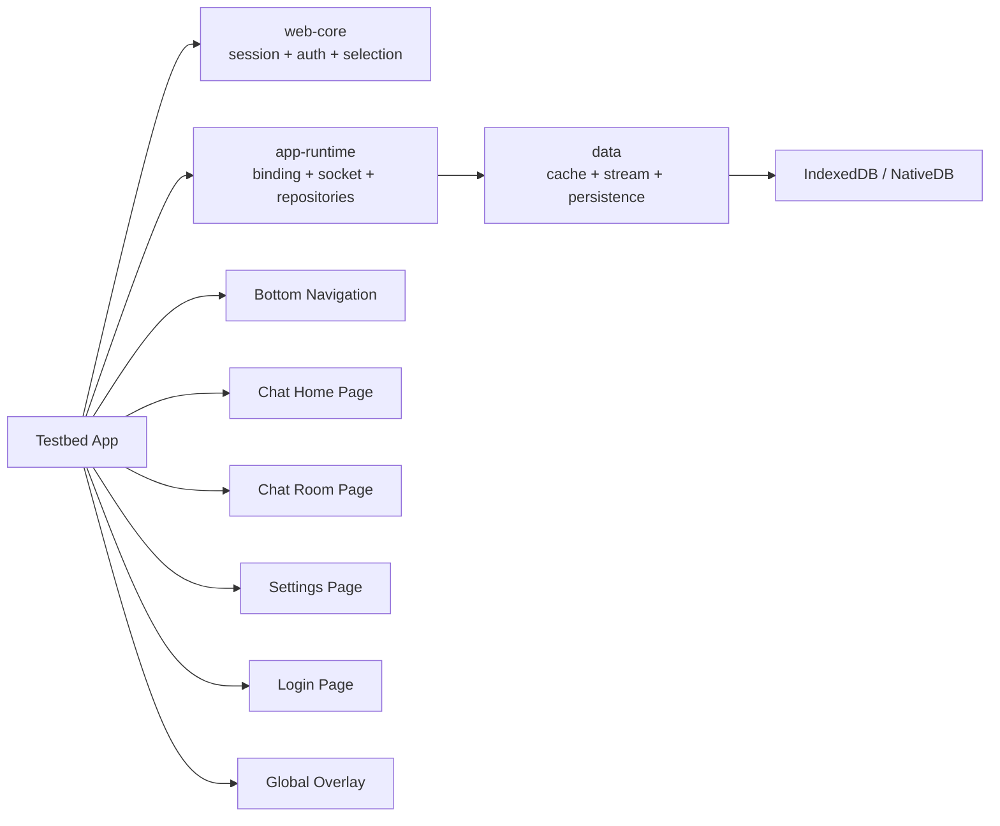

# [기술 스펙 명세서] Testbed 전체 아키텍처

## 1. 목적

`testbed`는 운영 사용자용 앱이 아니라, 실제 채팅 앱과 유사한 사용 흐름으로
세션 전환, 소켓 연결, 캐시 스트림, DB 반영을 검증하기 위한 독립 실험용 웹 앱이다.

이 문서의 결정 사항은 다음과 같다.

- 앱은 단일 대시보드가 아니라 채팅 앱 셸 형태로 구성한다
- 기본 진입은 guest login 유지 흐름을 사용한다
- 하단 네비게이션은 `채팅`, `설정` 두 탭만 제공한다
- 전역 오버레이에서 세션 / 웹 / DB / 소켓 상태를 조회한다
- 메인 사용자 흐름은 `채팅 홈 -> 채널 상세 -> 설정 -> 로그인`으로 구성한다

## 2. 범위와 비범위

### 범위

- Nx 기반 `apps/testbed` 애플리케이션 구성
- `app-runtime`, `web-core`, `data` 실제 조립
- guest -> cloud 전환 흐름 검증
- cloud / place / channel / chat 데이터 흐름 검증
- 전역 오버레이를 통한 런타임 상태 조회

### 비범위

- 운영용 디자인 완성도
- 고급 프로필/멤버 관리 기능
- 파일 업로드, 스레드, 리액션 등 확장 채팅 기능

## 3. 용어 규칙

- `relay`: 기본 중계서버 세션
- `default cloud`: relay 기반 기본 클라우드
- `invited cloud`: 초대 흐름으로 유입된 클라우드
- `place`: 기존 문맥의 `site`와 동일한 개념
- `channel`: place 하위 채팅 단위

문서 전반에서는 `place`를 화면 용어로 사용하되, 구현 계층에서 `site`라는 이름을
사용하는 경우 이를 동일 개념으로 취급한다.

## 4. 전체 구조



## 5. 계층 책임

- `web-core`
    - relay / cloud 세션 상태 관리
    - guest login 유지
    - cloud 선택 및 로그아웃
    - 현재 선택 상태의 기준 제공

- `app-runtime`
    - runtime binding
    - socket lifecycle
    - repository 연결
    - 세션 전환 이후 runtime 재연결

- `data`
    - repository fetch
    - local cache CRUD
    - stream subscription
    - DB 저장 및 조회

- `testbed`
    - 라우트와 앱 셸
    - 하단 네비게이션
    - 전역 오버레이
    - 채팅 홈 / 채널 상세 / 설정 / 로그인 화면

## 6. 전역 UX 규칙

### 6.1 다크 모드

- 앱은 기본적으로 다크 모드를 지원해야 한다
- 최소 요구사항은 모든 핵심 화면과 오버레이가 다크 모드에서 가독성을 유지하는 것이다
- 테마 지원은 앱 셸 레벨에서 공통 토큰으로 처리한다

### 6.2 guest login 기본 동작

- 앱은 유즈케이스 로직에 따라 relay 인증이 없으면 guest login을 즉시 수행한다
- 이 규칙은 실제 코드의 `useRelaySessionKeepAlive` 동작과 일치해야 한다
- 명시적인 relay 로그아웃 이후에도 relay 인증이 비어 있으면 guest login을 다시 즉시 수행해야 한다
- 따라서 relay 로그아웃은 "앱 종료 상태"가 아니라 "relay 세션을 초기화한 뒤 guest 기본 상태로 복귀시키는 동작"으로 해석한다

현재 코드 근거:

- `libs/web-core/src/hooks/app/useRelaySessionKeepAlive.ts`

### 6.3 하단 네비게이션

- 하단 네비게이션 탭은 `채팅`, `설정` 두 개만 둔다
- 채널 상세 화면에서도 동일한 앱 셸을 유지한다
- 로그인 페이지는 별도 라우트로 두며 하단 네비게이션에서 제외한다

### 6.4 전역 오버레이

- 오버레이는 모든 주요 화면에서 열 수 있어야 한다
- 세션, 웹, DB, 소켓 상태는 오버레이에서 확인한다
- 메인 페이지 본문은 상태 덤프가 아니라 실제 사용자 흐름 검증에 집중한다

## 7. 권장 라우트 구조

```txt
/
/chat
/chat/channels/:channelId
/settings
/auth/login
```

필요 시 내부 상태 복원을 위해 `cloudId`, `placeId`는 URL 파라미터 또는 store 기반으로
보존할 수 있다. 다만 핵심 요구사항은 "복귀 가능한 상태"이지, 반드시 모든 선택값을
URL에 강제하는 것은 아니다.

## 8. 주요 상태 전이

### 8.1 앱 시작

1. 앱 셸 초기화
2. relay 인증 부재 시 guest login 시도
3. 기본 cloud 기준 상태 확보
4. 채팅 홈 진입

### 8.2 cloud 전환

1. 사용자가 cloud 선택
2. cloud 세션 생성 또는 복구
3. socket verified 대기
4. place 목록 재조회
5. target place 인증
6. channel 목록 재조회

이 흐름은 현재 `useCloudSwitchFlow`의 파이프라인과 모순되지 않아야 한다.

현재 코드 근거:

- `apps/desktop-web/src/app/shared/hooks/useCloudSwitchFlow.ts`
- `apps/desktop-web/src/app/shared/hooks/useClouds.ts`
- `apps/desktop-web/src/app/shared/hooks/usePlaces.ts`

### 8.3 중계서버 클라우드 복귀

1. 사용자가 기본 클라우드 선택
2. 현재 cloud 세션 정리
3. relay 기준 상태로 복귀
4. place / channel 선택 재정렬

### 8.4 relay 로그아웃

1. relay 로그아웃 실행
2. cloud 상태 동시 정리
3. 오버레이/채팅/설정 화면 상태 초기화
4. relay 인증 부재를 감지하면 guest login 자동 재수행
5. guest 기본 상태로 앱 재진입

## 9. 권장 파일 구조

```txt
apps/testbed/
  project.json
  docs/
    README.md
    architecture.SPEC.md
    overlay.SPEC.md
    chat-home-page.SPEC.md
    chat-room-page.SPEC.md
    settings-page.SPEC.md
    login-page.SPEC.md
  src/app/
    app.tsx
    routes.tsx
    layout/
      BottomNav.tsx
    overlays/
      RuntimeOverlay.tsx
    pages/
      ChatHomePage.tsx
      ChatRoomPage.tsx
      SettingsPage.tsx
      LoginPage.tsx
```

## 10. 수용 기준

- guest 기본 진입이 동작해야 한다
- 채팅/설정 하단 네비게이션이 동작해야 한다
- 오버레이에서 세션/웹/DB/소켓 상태를 조회할 수 있어야 한다
- cloud 전환 시 place / channel 목록이 현재 cloud 기준으로 갱신되어야 한다
- 채널 상세에서 메시지 조회, 상단 페이징, 전송이 가능해야 한다
- 설정에서 cloud logout / relay logout 의미가 구분되어야 한다
- 로그인 페이지에서 이메일 로그인이 가능해야 한다
