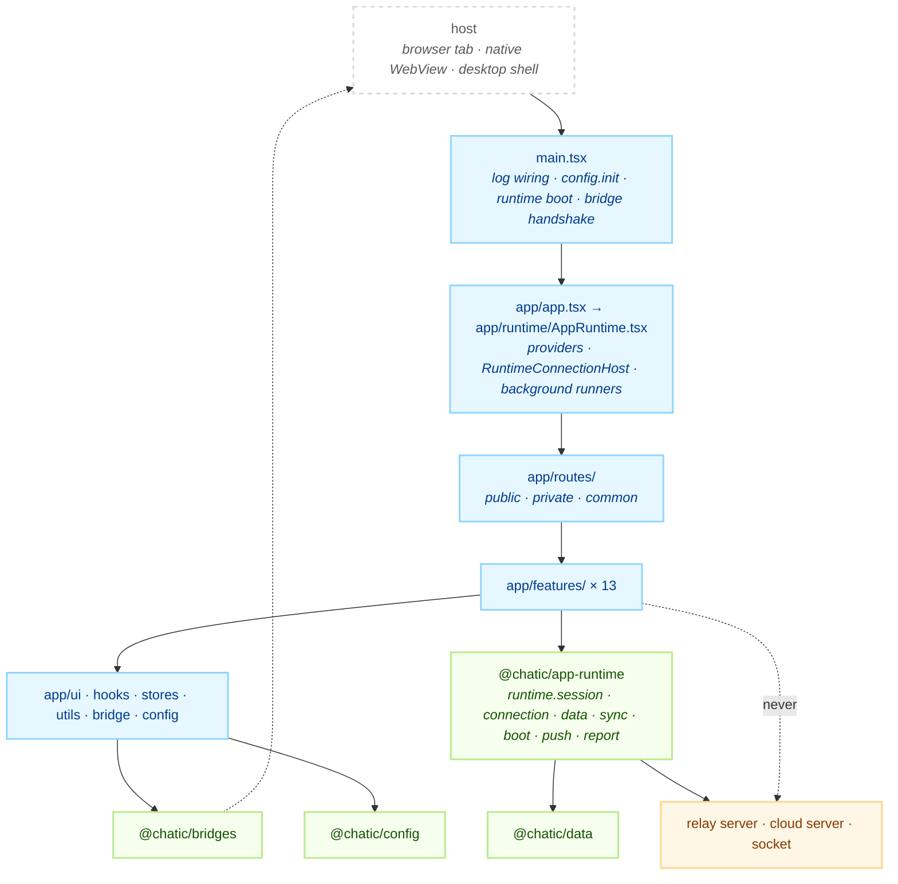
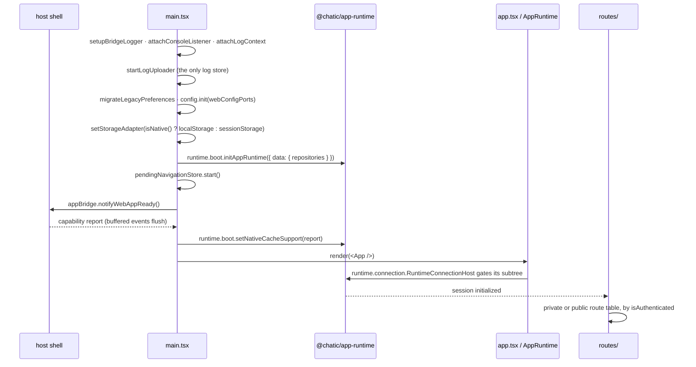

# @chatic/web

**The Chatic web client — the screens, the router, and nothing underneath them.** React + Vite, one
bundle that runs both as a plain browser app and as the WebView inside the native shell. It
assembles routes, pages, hooks and layout chrome on top of libraries that own everything stateful:
session, sockets, repositories, caches, settings, logging and the native bridge.

This document covers the **overview and structure** only. The per-layer detail is canonical under
[`docs/`](#documents).

## Purpose

The app owns screens. Everything a screen needs that outlives a render — a session, a socket, a
cache, a token, a setting, a log sink — belongs to a library, and the app reaches it through a hook
or a facade rather than constructing it.

The invariant is visible in the import list. Every `@chatic/*` the app names is a library whose
README is the contract for what it hands back:

```bash
grep -rhoE "@chatic/[a-z-]+" apps/web/src --include='*.ts' --include='*.tsx' | sort | uniq -c | sort -rn
```

There is no `api/` directory, no socket constructor, no token store and no cache adapter inside
`apps/web/src`. A new one appearing is the violation this section exists to name.

What the app does **not** own:

| Concern                                               | Owner                                                           |
| ----------------------------------------------------- | --------------------------------------------------------------- |
| Session, auth, connection lifecycle, sync, push, boot | [`@chatic/app-runtime`](../../libs/app-runtime/README.md)       |
| Repositories, local cache, observe streams            | [`@chatic/data`](../../libs/data/README.md)                     |
| The native ↔ web message seam, and the logger facade | [`@chatic/bridges`](../../libs/bridges/README.md)               |
| Settings, environment, feature flags                  | [`@chatic/config`](../../libs/config/README.md)                 |
| The logging hub, its listeners, its levels            | [`@chatic/logger`](../../libs/logger/README.md)                 |
| Web design-system components                          | [`@chatic/web-ui-kit`](../../libs/web-ui-kit/README.md)         |
| Cross-platform primitives, storage adapter, fallbacks | [`@chatic/shared`](../../libs/shared/README.md)                 |
| Bridge message payload types                          | [`@chatic/app-messages`](../../libs/app-messages/README.md)     |
| HTTP request building and signing                     | [`@chatic/http`](../../libs/http/README.md)                     |
| Device/platform detection                             | [`@chatic/device-utils`](../../libs/device-utils/README.md)     |
| Policy copy (terms, privacy, licenses)                | [`@chatic/policy-content`](../../libs/policy-content/README.md) |

`@chatic/http` and `@chatic/logger` reach the app indirectly: HTTP through `@chatic/app-runtime`,
the logger through the `logger` re-export in `@chatic/bridges`. The app imports neither package
directly, and it should stay that way — the command above says whether it has.

## Design principles

1. **The app holds no primitive.** Sessions, sockets, repositories, caches and tokens are obtained
   from `runtime.*` and used; they are never constructed, wrapped in a module-level singleton, or
   stored in app state. A `new WebSocket` or a hand-rolled token refresh in `apps/web` is a
   contract violation, not a shortcut.
2. **Selection state changes through a switch hook.** `cid` (cloud), `sid` (place) and `uid` are
   session state, and setting one is a multi-step operation — re-auth, socket rebind, cache
   repartition. Call `app/runtime/useSiteSwitch.ts` or the cloud switch under `features/home`, never
   a raw setter.
3. **`shared` imports no feature.** `ui/`, `hooks/`, `stores/`, `utils/`, `bridge/` and `config/`
   contain zero imports from `features/`. That is what makes them safe to import from anywhere; the
   rule and the command that checks it are in [docs/architecture/](./docs/architecture/README.md).
4. **Features do not import each other.** Two features that need the same thing promote it to
   `app/hooks/`, `app/ui/components/` or `app/utils/`. A `features/a → features/b` import is a
   refactor that was skipped.
5. **Routes are built, not typed.** Every absolute path comes from the `ROUTES` builder in
   `app/routes/paths.ts`. A literal `'/channels/' + id` in a `navigate()` call is a bug waiting for
   a route rename.
6. **The bridge has one door.** Native messages enter and leave through `app/bridge/` only. A
   feature never posts to the shell itself.
7. **`main.tsx` is ordered by contract.** Log listeners attach before anything can log,
   `config.init()` precedes every lazy setting read, and `runtime.boot.initAppRuntime()` precedes
   every session read. Each boundary in that file carries a comment naming what breaks if a line
   crosses it.
8. **Source comments and documents are English.**

## Scope

**In** — routes and route guards; pages and their components; feature-local hooks and state; layout
chrome (safe areas, keyboard insets, navigation bars); theme application to the document; i18n
resources; the app side of the native bridge; the debug overlay; boot wiring in `main.tsx`.

**Out** —

- Session, auth, connection lifecycle, background sync, push registration, boot —
  [`@chatic/app-runtime`](../../libs/app-runtime/README.md).
- Repositories, local caches, observe streams — [`@chatic/data`](../../libs/data/README.md).
- The native message transport and the logger facade —
  [`@chatic/bridges`](../../libs/bridges/README.md).
- Settings resolution and storage — [`@chatic/config`](../../libs/config/README.md).
- Reusable components and tokens — [`@chatic/web-ui-kit`](../../libs/web-ui-kit/README.md).
- The native shell itself — `apps/mobile`. The desktop shell — `apps/desktop-web`.

## Structure



The arrow the diagram draws only to forbid it is the dotted one: **no feature talks to a server.**
There is no `fetch` against a Chatic endpoint anywhere in `apps/web/src/app/features`; a screen that
needs server data asks a repository, and the repository is reached through `runtime.data`.

Import direction _inside_ `app/` — which of those boxes may name which — is decided in
[docs/architecture/](./docs/architecture/README.md) and not restated here.

### Boot



`runtime.connection.RuntimeConnectionHost` is the single session-init driver and it holds the
subtree until the session is ready. `Router` renders nothing while `isInitialized` is false — that
gate is why no screen ever sees a half-built session.

### Directories

```text
apps/web/src/
├── main.tsx            boot, ordered by contract (see principle 7)
├── styles.css          Tailwind entry
├── i18n/               locale resources
├── assets/             app-local static files
├── types/              ambient declarations
└── app/
    ├── app.tsx         provider assembly only — no session logic
    ├── routes/         14 files: three route tables, the ROUTES builder, entry gates
    ├── runtime/        53 files: RuntimeConnectionHost wiring, background runners, log wiring
    ├── features/       589 files across 13 feature groups
    ├── hooks/          71 files: hooks shared by more than one feature
    ├── ui/             39 files: components/, layouts/, hooks/
    ├── utils/          32 files: pure helpers
    ├── bridge/         21 files: the single native ↔ web seam
    ├── stores/         8 files: global client state and preference keys
    └── config/         7 files: the @chatic/config port adapters for this build
```

Files you cannot guess from the name:

- `app/routes/paths.ts` — the `ROUTES` builder and `ROUTE_PARAMS`. Every absolute path in the app is
  here, grouped by page type rather than by feature.
- `app/routes/index.tsx` — the `Router` itself: it picks `privateRoutes` or `publicRoutes` from
  `runtime.session.useSessionAuth()` and blocks render until the session is initialized.
- `app/runtime/AppRuntime.tsx` — mounts `runtime.connection.RuntimeConnectionHost` and seven
  background runners inside it.
- `app/runtime/useSiteSwitch.ts` — the place (site) switch. The cloud switch lives under
  `features/home`.
- `app/config/adapters.ts` — `webConfigPorts`, the object `config.init()` is called with in
  `main.tsx`.
- `app/bridge/appBridge.ts` — the outbound half of the seam; `GlobalBridgeListener.tsx` the inbound.
- `app/utils/index.ts` deliberately **excludes** the modules that read `import.meta.env`. Import
  those by concrete path (`app/utils/webVitals`) or the barrel becomes unloadable under the test
  transform.

Two feature folders have no doc of their own: `appUpdate` (the update prompt host mounted in
`app.tsx`) and `search`. Conversely `docs/feature/notifications/` documents `app/bridge/navigation`,
which is not a feature folder at all.

### Vocabulary

| Term        | Meaning                                                                                                          |
| ----------- | ---------------------------------------------------------------------------------------------------------------- |
| **Cloud**   | One workspace. A user can belong to several. Carried as `cid`.                                                   |
| **Place**   | A subgroup inside a Cloud. The backend model is named `site`, so `place === site` and the session axis is `sid`. |
| **Channel** | A room inside a Place — 1:1, group, or self chat.                                                                |
| **Join**    | The relation between a user and a channel; carries `readNo`, the last-read `chatNo`.                             |

The app runs in one of two connection modes, read from
`runtime.session.useGlobalSession().activeServer.kind`:

- **`relay`** — no Cloud selected (or `cloudId === 'default'`). The client talks to the relay server
  with a relay session token. This is the fallback mode.
- **`cloud`** — a specific Cloud is active. The client talks to that Cloud's own backend with a
  cloud identity token, and re-authenticates when the Place changes.

Both switches, and every re-auth they imply, are performed by `@chatic/app-runtime`. The app calls
the switch hook and touches no token.

## Usage

Run it against the dev backend:

```bash
yarn web:start          # nx serve web --port 5003
```

Reading and writing data — repositories, obtained from the runtime:

```ts
import { runtime } from '@chatic/app-runtime';

const { join: joinRepository } = runtime.data.useRuntimeRepositories();
const uid = runtime.session.useGlobalSession().identity.userId;
```

`runtime.data.useRuntimeRepositories()` is the one door to `@chatic/data` — it appears in about
ninety call sites and nothing in the app imports a repository any other way.

Navigating — always through the builder, imported by relative path (this app has no `@/` alias):

```tsx
import { useNavigate } from 'react-router-dom';

import { ROUTES } from '../routes/paths';

navigate(ROUTES.channels.room(channelId));
```

### Wiring

```text
main.tsx
├── setupBridgeLogger / attachConsoleListener / attachLogContext   (before anything logs)
├── startLogUploader                                               (owns the only log store)
├── migrateLegacyPreferences / syncThemeFromSharedKey
├── config.init(webConfigPorts)                                    (before any lazy setting read)
├── setStorageAdapter(isNative() ? localStorage : sessionStorage)
├── runtime.boot.initAppRuntime(...)                               (before any session read)
├── pendingNavigationStore.start()                                 (before the handshake)
├── appBridge.notifyWebAppReady() → runtime.boot.setNativeCacheSupport
└── render(<App />)
    └── app/app.tsx            HelmetProvider · I18nextProvider · QueryClientProvider · ThemeApplier
        ├── GlobalBridgeListener
        ├── AppUpdatePromptHost
        ├── app/runtime/AppRuntime.tsx
        │   └── runtime.connection.RuntimeConnectionHost   (gates until the session is ready)
        │       ├── background runners × 7
        │       └── app/routes                             (Router → public | private + common)
        └── DebugOverlayHost
```

## Scenarios

### 1. Add a screen to an existing feature

Add the page under `app/features/<group>/pages/`, add its path to `ROUTES` in
`app/routes/paths.ts`, then register it. Seven feature groups export their own
`features/<group>/routes/index.tsx` for the three tables in `app/routes/` to compose; the rest are
listed directly in `PrivateRoutes.tsx`, `PublicRoutes.tsx` or `CommonRoutes.tsx`. Follow whichever
the neighbouring pages in that group already use. Nothing in `app/ui/` or `app/hooks/` may import
the new page. Then update the feature's `docs/feature/<group>/README.md`.

### 2. Read server data on a screen

Call the repository hook from `runtime.data` and render what it observes. Do not fetch, do not
cache in component state, and do not reach for `@chatic/data` internals — the facade on
`runtime.data` is the supported surface. Refresh, sync and delta reconciliation are
[docs/architecture/](./docs/architecture/README.md)'s `data-flow.md`.

### 3. Switch cloud or place

Call the switch hook — `app/runtime/useSiteSwitch.ts` for a Place, the cloud switch under
`features/home` for a Cloud — and render the result. Re-auth, socket rebind and cache repartition
all happen inside `@chatic/app-runtime`. Writing `sid` or `cid` directly leaves the socket bound to
the old partition.

### 4. React to something the native shell does

Inbound messages land in `app/bridge/GlobalBridgeListener.tsx` and the handlers under
`app/bridge/`; outbound calls go through `app/bridge/appBridge.ts`. A push tap that arrives during
cold start is buffered by `pendingNavigationStore`, which `main.tsx` starts _before_ the
`WebAppReady` handshake so the shell's flush is never dropped.

### 5. Read or change a setting

Settings live in `@chatic/config`, initialised once in `main.tsx` with `webConfigPorts` from
`app/config/adapters.ts`. Read through `config`; never through `import.meta.env` inside a feature.
The theme is a setting (`ui.theme`) that `app/runtime/ThemeApplier.tsx` mirrors onto `<html>`.

### 6. Diagnose an error a user hit

`app.tsx` installs the global handlers — `window.onerror`, `unhandledrejection`, capture-phase
resource-load failures, CSP violations — and every one of them writes through `logger` from
`@chatic/bridges`. The entries reach the upload queue started in `main.tsx`. The in-app view is the
debug overlay (`DebugOverlayHost`), documented under `docs/architecture/`.

## Documents

| Folder                                                                | What it covers                                                                                                           |
| --------------------------------------------------------------------- | ------------------------------------------------------------------------------------------------------------------------ |
| [docs/architecture/](./docs/architecture/README.md)                   | Directory placement, data flow, routing, the native bridge, global stores, theme, logging, layout shell, the debug panel |
| [docs/feature/account/](./docs/feature/account/README.md)             | Sign-up and password reset, both through email verification                                                              |
| [docs/feature/auth/](./docs/feature/auth/README.md)                   | Login, session delegation, invite acceptance                                                                             |
| [docs/feature/channels/](./docs/feature/channels/README.md)           | Channel list, chat room, threads, channel settings and invites                                                           |
| [docs/feature/debug/](./docs/feature/debug/README.md)                 | The developer overlay and its runtime unlock                                                                             |
| [docs/feature/feedback/](./docs/feature/feedback/README.md)           | Feedback submission, with logs and device info attached                                                                  |
| [docs/feature/home/](./docs/feature/home/README.md)                   | The main tabs, the lists, and the cloud switch sheet                                                                     |
| [docs/feature/invite/](./docs/feature/invite/README.md)               | Relay 1:1 invites — sending and accepting                                                                                |
| [docs/feature/mypage/](./docs/feature/mypage/README.md)               | The account hub, settings depth, and policy pages                                                                        |
| [docs/feature/notifications/](./docs/feature/notifications/README.md) | Push tap routing and device token registration (implemented in `app/bridge/navigation`)                                  |
| [docs/feature/onboarding/](./docs/feature/onboarding/README.md)       | The first-run setup gate — cloud, then place, then profile                                                               |
| [docs/feature/place/](./docs/feature/place/README.md)                 | Place (site) detail and its settings pages                                                                               |
| [docs/feature/subscription/](./docs/feature/subscription/README.md)   | Subscription status, plans, and in-app purchase                                                                          |

## How to verify

```bash
npx tsc -b apps/web/tsconfig.json                                    # app AND specs
yarn web:test                                                        # jest, --runInBand
npx nx run web:lint
```

Build and deploy:

```bash
yarn web:build:dev      # nx build --configuration=dev web   (swaps .env for .env.dev)
yarn web:build:prod     # nx build --configuration=prod web  (swaps .env for .env.prod)
yarn web:deploy:dev
yarn web:deploy:prod
```

Then the traps:

- Type checking must be `tsc -b`. `tsc --noEmit` inside an Nx project checks zero files and
  succeeds, so passing it proves nothing. `apps/web/tsconfig.json` references `tsconfig.app.json`
  and `tsconfig.spec.json`, which is why the one command covers source and specs.
- Jest does not type check — the base sets `isolatedModules`, so ts-jest transpiles. A broken
  fixture surfaces as `… is not a function` at runtime unless the spec project is checked.
- A spec that imports a barrel pulls the whole barrel. Import the concrete module when the barrel
  drags in something the test environment cannot load — `app/utils/index.ts` excludes the
  `import.meta.env` readers for exactly this reason.
- A stale `dist`/`out-tsc` produces phantom errors after a directory moves. `rm -rf` and look again.
- `.github/workflows/verify.yml` runs `typecheck` for `web` but **excludes `web` from the test
  step**, with the count of failures recorded in its own trailing comment. Web tests are the ones to
  run by hand before merging.
- Changing a shared library is a wider change than it looks: `web` is the heaviest consumer of
  `@chatic/app-runtime` and `@chatic/data`. Type check this app after touching either.
