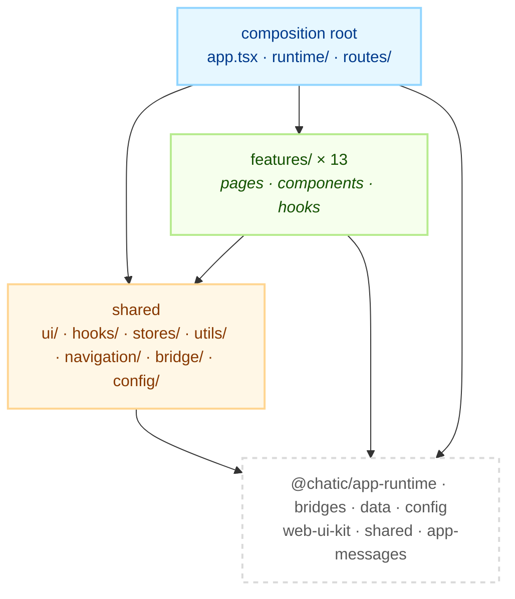

# apps/web documentation

The web client is the entire product surface: every screen the user reads, taps and navigates is
here, running in a browser and inside the mobile shell's WebView. These documents describe **the
rules that cross features** and **each feature in turn**. What the native shell does around this app
is documented in `apps/mobile/docs/`.

This file is also the layering contract — where a new file goes, and which direction an import may
point inside `apps/web/src/app`. It decides nothing about what a library does; those contracts live
in each library's own README, linked from the [app README](./README.md).

## Tree rules

1. Every category folder has a `README.md` — either the category's lead document, or a short index.
2. A category name has to answer "does this document belong here?" on its own. Names that cannot
   (`misc`, `common`, `architecture`) are not used.
3. Depth stops at `docs/<category>/<topic>.md`. The one exception is `feature/<name>/`, because a
   feature owns several screens that are read independently.
4. No topic files directly under `docs/` — this file is the only top-level document.

## Categories

| Category                                    | Answers                                                                                              |
| ------------------------------------------- | ---------------------------------------------------------------------------------------------------- |
| [feature/](./feature)                       | One folder per feature in `src/app/features/` — what each screen contracts, and what it does not own |
| [shell/](./shell/README.md)                 | The frame screens are rendered into — layout chrome, routing, and theme                              |
| [state/](./state/README.md)                 | How data reaches a screen — global stores, and observe / refresh / sync                              |
| [bridge/](./bridge/README.md)               | The single seam to the native shell — messages, device tokens, and push navigation                   |
| [observability/](./observability/README.md) | Looking into a running app — the logger hub and the in-app debug overlay                             |

`feature/<name>/` exists only where `src/app/features/<name>/` exists, and the names match exactly:

```bash
diff <(ls apps/web/src/app/features) <(ls apps/web/docs/feature)   # must print nothing
```

## The shared contract

### The three rings



The arrow the diagram cannot draw is the one that is missing: **`shared` imports no feature.** The
composition root may mount a feature — that is what a composition root is for — but `ui/`, `hooks/`,
`stores/`, `utils/`, `navigation/`, `bridge/` and `config/` contain zero imports from `features/`, and
that is what makes them safe to import from anywhere.

```bash
grep -rn "from '.*features/" apps/web/src/app/{ui,hooks,stores,utils,navigation,bridge,config} \
  --include='*.ts' --include='*.tsx'
```

Exactly three places import a feature, and each is a composition root: `app.tsx` mounts `appUpdate`
and the debug overlay, `routes/` composes each feature's pages into a route table, and
`runtime/AppRuntime.tsx` mounts the background runners that `home` and `debug` own.

### Features do not import each other

Two features that need the same hook promote it to `app/hooks/`, the same component to
`app/ui/components/`, the same pure function to `app/utils/`. A `features/a → features/b` import is
a refactor that was skipped.

The one seam that looks like an exception is not one: `routes/` reaches into
`features/invite/accept/lib/` and `features/invite/utils/` for the redirect logic that has to run
_before_ the invite pages mount. That is the composition root resolving a route, not one feature
calling another.

### The app owns no session, socket or cache

Every one of those is a library's. The app calls hooks and it never holds the primitive:

- **Session, socket, repositories, sync** — `runtime.*` from `@chatic/app-runtime`, seven groups
  under one identifier (`runtime.session`, `runtime.connection`, `runtime.data`, `runtime.sync`,
  `runtime.boot`, `runtime.push`, `runtime.report`).
- **The native shell** — `@chatic/bridges`, reached only through `app/bridge/` (see
  [bridge/](./bridge/README.md)).
- **Reads and writes** — repositories from `@chatic/data`, obtained through `runtime.data`.
- **Settings** — `config` from `@chatic/config`, initialised once in `main.tsx`.

Direct construction of a socket, a token or a cache adapter inside `apps/web` is a contract
violation. There is no `@chatic/socket` to import and no session core object to reach for; the
transport (`@lemoncloud/chatic-sockets-lib`) is assembled by `@chatic/app-runtime` and the app never
names it.

### Selection state changes through a switch hook

`cid` (cloud), `sid` (place/site) and `uid` are session state, and setting them is a multi-step
operation — re-auth, socket rebind, cache repartition. The app calls the hook that performs all of
it (`app/runtime/useSiteSwitch.ts`, and the cloud switch under
[`features/home`](./feature/home/README.md)) and never a raw setter.

### Comments are English

Source comments in this app are English. So are these documents.

## Notes for implementers

- **`main.tsx` is ordered by contract, not by taste.** The log listeners are attached before
  anything can log, `config.init()` precedes every lazy setting read, and `runtime.boot`
  `initAppRuntime()` precedes every session read. Each boundary carries a comment saying what breaks
  if a line moves across it. Read those before inserting anything.
- **`app/utils/index.ts` deliberately excludes the modules that read `import.meta.env`.** Import
  those by concrete path (`app/utils/webVitals`), or the barrel becomes unloadable under the test
  transform.
- **A test that imports a barrel pulls the whole barrel.** Import the concrete module in a spec when
  the barrel drags in something the test environment cannot load.

## Where a new file goes

### Placement decision tree

1. **Bootstrap, platform connection, or routing?** (session/socket lifecycle, the native bridge,
   route tables, web-vitals instrumentation) → `app/runtime/`, `app/bridge/`, `app/routes/`,
   `app/utils/webVitals*`.
2. **Used by exactly one feature?** → `app/features/<feature>/`, in the matching subfolder (below).
3. **Used by two or more features already?** → cross-cutting: `app/ui/{components,layouts}`,
   `app/hooks/`, `app/stores/`, `app/utils/`.
4. **Unsure, or only one consumer so far?** Keep it in the feature. Promote on the **second**
   consumer, not in anticipation of one.
5. **Needed by two features but carries domain logic (a repository call, a domain type)?** Split it
   — see [Splitting a shared component](#splitting-a-shared-component) — because nothing lets a
   whole component move: `ui/` may not know a domain entity, features may not import each other, and
   there is no `shared/` wrapper directory to dump it in instead.

A domain hook such as `useChannelRoom` is always case 2 (`features/channels/hooks`), never
`app/hooks`, unless a second feature ends up needing the exact same hook.

`app/hooks/` and `app/ui/hooks/` are both flat today (43 and 5 files) — group them into
sub-folders only once a category is crowded enough to need one; an empty category folder created in
advance is exactly the YAGNI violation this rule exists to prevent. The distinction between the two:
`app/ui/hooks` is UI mechanics with no data access (focus, insets, keyboard); a hook that touches
data, session or the bridge is `app/hooks` even if it also does UI work.

### Feature-internal structure

```text
features/<feature>/
├── pages/       route-entry screens
├── components/  UI used only inside this feature
├── hooks/       logic hooks that wrap @chatic/data / @chatic/app-runtime for this feature
├── types/       domain types and state — this feature's entities
├── consts/      this feature's constants
├── routes/      this feature's own route table (only where the feature owns one — see below)
└── index.ts     the public barrel; everything outside imports through it
```

There is no `api/` folder: server access goes through `@chatic/app-runtime` / `@chatic/data`, and a
feature's `hooks/` is where that gets wrapped. There is no separate `entities/` or `model/` layer
either — `types/` is the entity layer, promoted to a cross-cutting `types` only on a second
consumer.

The 13 feature folders do not all use the same subset. Counting actual subfolders under
`app/features/*/`: `components` (12), `pages` (11), `hooks` (11), `routes` (7), `lib` (6), `utils`
(4), `types` (4), `consts`/`constants` (3), `stores` (2), plus one-offs (`invite/accept`,
`debug/overlay`, `debug/metrics`). `routes/` appears only in features that export their own
`<Feature>Routes` for the top-level route tables to lazy-compose; `lib/`, `utils/` and `stores/` show
up where a feature's own logic outgrows `hooks/`. Treat the skeleton above as the common case, not a
fixed shape — add the subfolder a feature actually needs rather than forcing every feature to carry
all five.

```bash
find apps/web/src/app/features -mindepth 2 -maxdepth 2 -type d | sed 's#.*/features/[^/]*/##' | sort | uniq -c | sort -rn
```

#### Colocation inside a feature

A feature with several screens re-applies the same decision one level down: a component or hook
used by one screen lives beside that screen (`pages/<Screen>/`), one used by two or more screens
moves to the feature's own `components/`/`hooks/`, and one needed by another feature is a candidate
for promotion (previous section). Start a screen as a single `pages/Foo.tsx` file; split it into a
folder only once it grows screen-local parts. Do not pre-create empty `components/`/`types/` folders
for a screen that does not need them yet.

#### Naming

A folder that wraps a single component takes that component's PascalCase name
(`ChannelRoomPage/ChannelRoomPage.tsx`). A folder that names a domain, layer, or standard bucket
(`channels/`, `pages/`, `hooks/`) is lowercase. Keep this distinction consistent — Linux CI is
case-sensitive even when a contributor's filesystem is not.

### Splitting a shared component

When a component two or more features want mixes presentational UI with a domain call, split it by
what each part depends on, not by where it currently sits:

| Part                               | What it looks like                              | Goes to                                |
| ---------------------------------- | ----------------------------------------------- | -------------------------------------- |
| Form/dialog body                   | Takes copy, initial values, `onSubmit` as props | `app/ui/components`                    |
| The repository call                | e.g. a `setMyProfile` write                     | `app/hooks` (once 2+ features call it) |
| Per-screen copy and open condition | That screen's own concern                       | Stays in `features/<feature>/`         |

The test: delete every `@chatic/data` / `useRuntimeRepositories()` / domain-type import from the
component. What is left is the presentational part that belongs in `ui/components`; if that is
nearly the whole component, it was already decomposed and only needed to move.

This is also why promoting a shared component is never just the component: constants and pure
helpers it depends on (a code-length constant, a countdown formatter) move with it, or the
cross-cutting piece ends up reaching back into a feature for them — a `shared → feature` import with
a different shape.

### Barrels and the test transform

Four `app/` barrels do not load under Jest: `app/hooks`, `app/bridge`, `app/ui/components`,
`app/ui/layouts`. Each pulls in a module (elsewhere in the tree) that reads `import.meta.env`, which
`tsconfig.spec.json`'s `commonjs` target cannot compile. `app/utils/index.ts` sidesteps this by
deliberately excluding `webVitals`/`buildEnv`/`phoneNumber` from its own barrel — that is the pattern
to copy for a new cross-cutting file that itself reads `import.meta.env`.

A spec that needs something from one of the four broken barrels imports the concrete path instead,
with a comment naming what it avoided. Before adding another such comment, check whether the cause
already has a fix — the `@chatic/assets` alias is mapped to a stub in `jest.config.js` for exactly
this reason, so a barrel that only touched that package no longer needs to route around it. A stale
bypass comment for an already-fixed cause is worse than the bypass: it hides that the barrel now
works.

### Detecting a placement violation

```bash
# feature importing another feature directly (targets vary; keep the feature list current)
grep -rnE "from '(\.\./)+(account|appUpdate|auth|channels|debug|feedback|home|invite|mypage|onboarding|place|search|subscription)(/|')" \
    apps/web/src/app/features --include='*.ts*' | grep -v '\.test\.'

# a barrel bypassed because of the test transform, not because of layering
grep -rn "not the .*barrel\|Direct path\|Concrete module" apps/web/src/app --include='*.ts*'
```

The cross-cutting-imports-a-feature check lives in [the shared contract](#the-shared-contract) —
it is a layering rule, not a placement one, so it is not repeated here.

## Further reading

- [apps/web README](./README.md) — purpose, scope, directory tree, and what the app delegates.
- [`feature/`](./feature) — one folder per feature, each with its own README.
