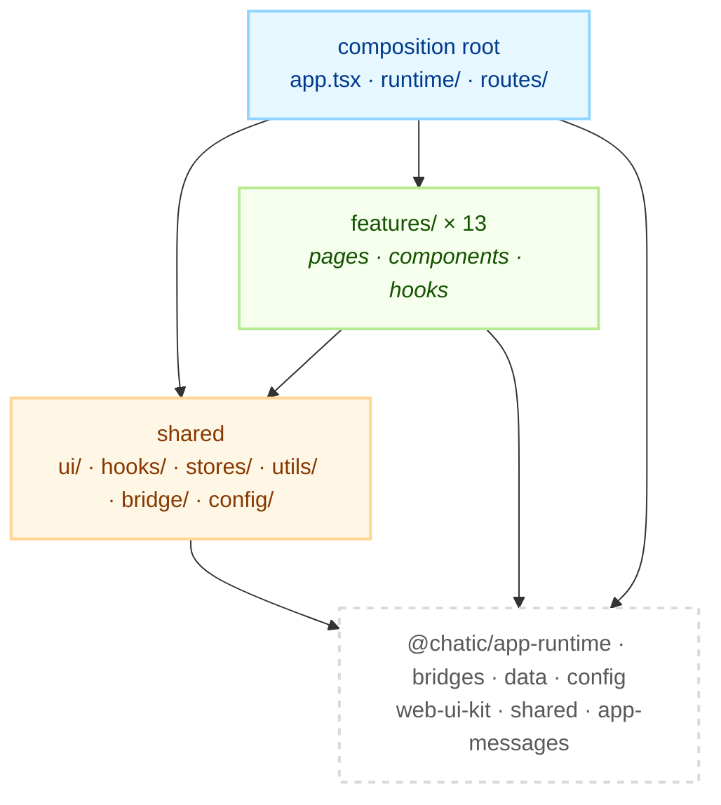

# architecture — the boundaries that cross every feature

Nine topics that no single feature owns: how a file finds its directory, how data reaches a screen,
how the router is assembled, how the app talks to its native shell, where global state lives, how
the theme is applied, how a log entry leaves the browser, how the layout chrome is composed, and how
the debug overlay is built.

A rule belongs here when breaking it in one feature breaks another. A rule that only concerns one
screen belongs in that feature's own doc under [`../feature/`](../feature/).

## Layout

```text
apps/web/docs/architecture/
├── README.md                this file — layering and the rules that cross features
├── directory-structure.md   where a new file goes
├── data-flow.md             observe / refresh / sync, and who triggers which
├── routing.md               the three route tables and the ROUTES builder
├── bridge.md                the single native ↔ web message seam
├── stores.md                global state, and the preference store
├── theme.md                 theme state, application, and shell sync
├── logging.md               the logger hub, its listeners, and the upload queue
├── layout-shell.md          layouts, safe areas, and keyboard insets
└── debug-panel.md           the in-app debug overlay
```

## Responsibilities

This document decides **which direction an import may point** inside `apps/web/src/app`. It decides
nothing about what a library does — those contracts live in each library's own README, linked from
the [app README](../../README.md).

## The shared contract

### The three rings



The arrow the diagram cannot draw is the one that is missing: **`shared` imports no feature.** The
composition root may mount a feature — that is what a composition root is for — but `ui/`, `hooks/`,
`stores/`, `utils/`, `bridge/` and `config/` contain zero imports from `features/`, and that is what
makes them safe to import from anywhere.

```bash
grep -rn "from '.*features/" apps/web/src/app/{ui,hooks,stores,utils,bridge,config} \
  --include='*.ts' --include='*.tsx'
```

Exactly three places import a feature, and each is a composition root: `app.tsx` mounts `appUpdate`
and the debug overlay, `routes/` composes each feature's pages into a route table, and
`runtime/AppRuntime.tsx` mounts the background runners that `home` and `debug` own.

### Features do not import each other

Two features that need the same hook promote it to `app/hooks/`, the same component to
`app/ui/components/`, the same pure function to `app/utils/`. A `features/a → features/b` import is
a refactor that was skipped.

The one seam that looks like an exception is not one: `routes/` reaches into
`features/invite/accept/lib/` and `features/invite/utils/` for the redirect logic that has to run
_before_ the invite pages mount. That is the composition root resolving a route, not one feature
calling another.

### The app owns no session, socket or cache

Every one of those is a library's. The app calls hooks and it never holds the primitive:

- **Session, socket, repositories, sync** — `runtime.*` from `@chatic/app-runtime`, seven groups
  under one identifier (`runtime.session`, `runtime.connection`, `runtime.data`, `runtime.sync`,
  `runtime.boot`, `runtime.push`, `runtime.report`).
- **The native shell** — `@chatic/bridges`, reached only through `app/bridge/` (see
  [bridge.md](./bridge.md)).
- **Reads and writes** — repositories from `@chatic/data`, obtained through `runtime.data`.
- **Settings** — `config` from `@chatic/config`, initialised once in `main.tsx`.

Direct construction of a socket, a token or a cache adapter inside `apps/web` is a contract
violation. There is no `@chatic/socket` to import and no session core object to reach for; the
transport (`@lemoncloud/chatic-sockets-lib`) is assembled by `@chatic/app-runtime` and the app never
names it.

### Selection state changes through a switch hook

`cid` (cloud), `sid` (place/site) and `uid` are session state, and setting them is a multi-step
operation — re-auth, socket rebind, cache repartition. The app calls the hook that performs all of
it (`app/runtime/useSiteSwitch.ts`, and the cloud switch under
[`features/home`](../feature/home/README.md)) and never a raw setter.

### Comments are English

Source comments in this app are English. So are these documents.

## Notes for implementers

- **`main.tsx` is ordered by contract, not by taste.** The log listeners are attached before
  anything can log, `config.init()` precedes every lazy setting read, and `runtime.boot`
  `initAppRuntime()` precedes every session read. Each boundary carries a comment saying what breaks
  if a line moves across it. Read those before inserting anything.
- **`app/utils/index.ts` deliberately excludes the modules that read `import.meta.env`.** Import
  those by concrete path (`app/utils/webVitals`), or the barrel becomes unloadable under the test
  transform.
- **A test that imports a barrel pulls the whole barrel.** Import the concrete module in a spec when
  the barrel drags in something the test environment cannot load.

## Further reading

- [apps/web README](../../README.md) — purpose, scope, directory tree, and what the app delegates.
- [`../feature/`](../feature/) — one folder per feature group, each with its own README.
