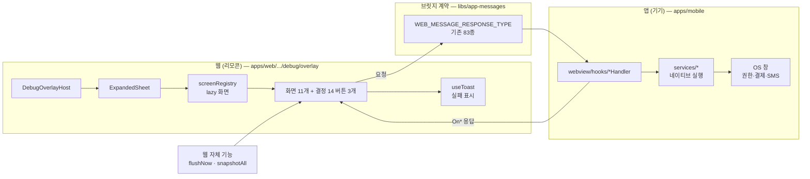
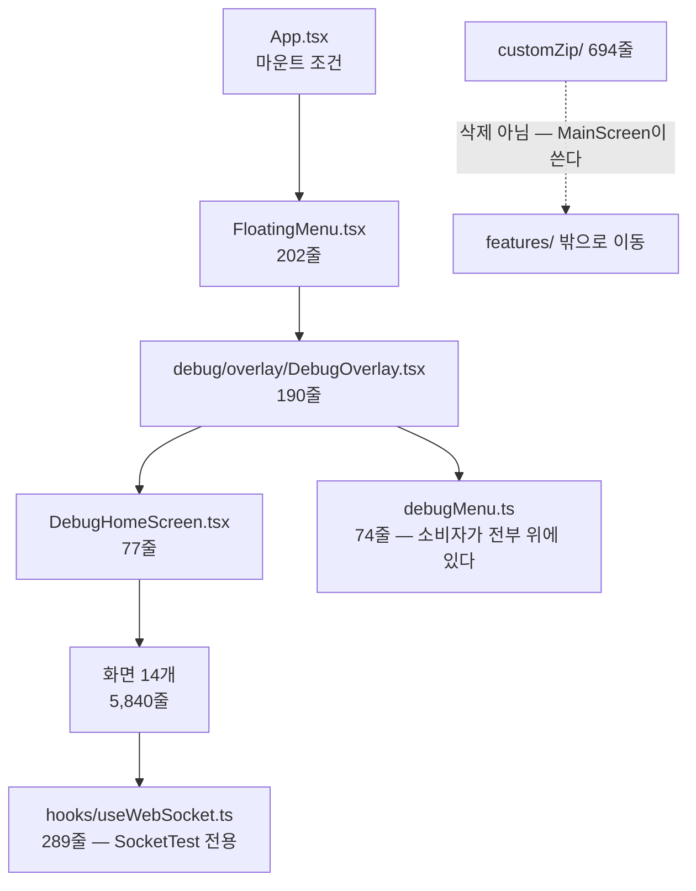

# 디버그 패널

> 상태: **Proposed** · 최종 갱신: 2026-09-10 · 관련 ADR:
> [ADR-0080](../../../../docs/adr/0080-debug-panel-shared-model-and-stage-visibility.md) (디버그는 웹이 전부
> 조작한다) · [ADR-0079](../../../../docs/adr/0079-config-registry-and-lane-resolver.md) (설정 레지스트리 —
> 이 문서가 기대는 기반)

## 목적

디버그 조작 창구를 **웹 하나**로 만든다.

지금은 둘이다. 웹 오버레이(10화면)와 앱 디버그 화면(14화면)이 각자 있고, 겹치는 것은 키 이름이 같은
`UploadTest` 하나뿐이다. 같은 일을 하는 화면이 두 벌 있으면서 이름·분류·언어가 다르고, 앱 쪽 버튼을
바꾸려면 앱 릴리스를 기다려야 한다.

ADR-0080이 그 방향을 정했다 — **웹이 리모콘, 앱이 기기다.** 이 문서는 그 결정을 실제 파일 단위 작업으로
옮긴다.

## 설계 원칙

1. **새 브릿지 명령을 만들기 전에 있는 것을 찾는다.** `WEB_MESSAGE_RESPONSE_TYPE`에 web→app 요청이
   이미 83종 있다. 새 명령은 앱 릴리스를 요구하므로, "이 동작을 부를 명령이 정말 없는가"를 먼저 답한다.
2. **범용 실행 명령은 만들지 않는다** (ADR-0080 미결 3). 웹이 앱의 아무 코드나 부를 수 있게 되는 것은
   디버그 편의로 감수할 위험이 아니다. 명령은 항상 이름이 붙은 동작 하나다.
3. **쓰기는 답을 받는다.** 보내고 잊으면 화면이 "껐다"고 하는데 실제로는 안 꺼진 상태가 생긴다
   (ADR-0080 결정 10).
4. **화면을 옮기기 전에 지울 수 있는지 본다.** 이관 대상 14화면 중 3개는 옮길 게 아니라 없앨 것이었다.
   디버그 화면은 늘어나기만 하는 자리이므로, 이관은 정리할 기회다.
5. **앱에는 실행과 OS 창만 남긴다.** 사람이 앱에서 누를 것이 없어야 결정 12(앱 디버그 UI 0)가 성립한다.

## 범위

**포함**

- 웹 오버레이에 앱 전용 화면 11개의 조작면을 추가 (`apps/web/src/app/features/debug/overlay/`)
- 앱 디버그 UI 삭제 — `features/debug` 중 customZip을 뺀 전부 + `FloatingMenu` + `App.tsx` 마운트 조건
- 화면 3개는 이관 없이 삭제 — `BridgeTest` · `EnvironmentSettings` · `SocketTest`
- ADR-0080 결정 14의 버튼 3개 (로그 지금 보내기 · 설정 전체 보기 · 캐시 도메인별 비우기)
- 실패 표시 (미결 5의 답)

**제외**

- **customZip 기능의 처분** — 디버그 전용이 아니다. `MainScreen.tsx:36`이 `useCustomZipBootGate`로
  WebView 부팅을 막고 있어 디버그 UI 삭제의 부수효과로 뺄 수 없다. 별건으로 판단한다 (미결 4).
- 시각 토큰 통일 — 제품 UI 전체가 걸린 별개 트랙 (ADR-0080 대안 절)
- 원격 컨피그 어댑터 (ADR-0079 결정 10)

## ADR-0080 미결에 대한 답

ADR이 스펙 단계로 넘긴 6개 중 **셋이 조사 과정에서 소멸했다.** 남은 셋만 새로 정한다.

| 미결                       | 답                                                                                                                                                                                                                                                           |
| -------------------------- | ------------------------------------------------------------------------------------------------------------------------------------------------------------------------------------------------------------------------------------------------------------ |
| **1. 공유 모델 위치**      | **소멸.** 결정 12가 앱 디버그 UI를 0으로 만들면 렌더러가 웹 하나다. 모바일 `debugMenu.ts`의 소비자 4개가 전부 삭제 대상이라 모델이 UI와 함께 죽는다 — 공유할 상대가 없다. 결정 1은 결정 12가 대체한다. 웹의 `debugMenu.ts`가 유일한 모델이 된다. 새 lib 없음 |
| **2. 겹치는 화면 쌍**      | **소멸.** 같은 이유다. 목록이 한 벌이 되므로 `DeviceInfo`↔`DeviceTest` 같은 쌍을 합칠지 나눌지는 질문 자체가 없어진다 — 웹 키 하나로 수렴한다                                                                                                               |
| **3. 브릿지 명령 15개**    | **11개는 새 명령 0개.** 기존 83종이 덮는다(아래 대응표). 3개는 삭제 대상. 새로 필요한 것은 **결정 14의 캐시 도메인별 비우기 1개뿐**이고, 그것마저 `ClearCacheDataByChannel`이 이미 있어 확인이 먼저다                                                        |
| **4. 커스텀 zip 처분**     | **이번 범위 밖.** 부팅 경로에 물려 있다(위 §범위). 디버그 UI와 함께 지울 수 없다는 것이 이번 답이고, 존치/삭제 판단은 별건                                                                                                                                   |
| **5. 실패 표시**           | `@chatic/ui-kit`의 `useToast`를 쓴다. 웹 오버레이에는 지금 에러 표시 수단이 없고, 앱 전체에는 이미 토스트가 있다(`HomePage.tsx:19`). 행마다 인라인 상태를 두면 화면 11개에 같은 코드가 반복되므로 오버레이 레벨 토스트 하나로 통일한다                       |
| **6. 시각 규약 문서 소유** | **불필요해졌다.** 규약은 두 렌더러를 맞추기 위한 것이었고 렌더러가 하나 남는다. 이 문서가 웹 패널의 정본이다                                                                                                                                                 |

## 시나리오

**QA가 앱에서 SMS 발송을 시험한다**

1. 앱 안에서 웹 화면을 10탭한다 → `debug.overlayEnabled`가 열린다 (PROD는 입장 코드까지, ADR-0079 결정 5).
2. 오버레이에서 `SmsTest`를 고른다. 화면은 **웹**이 그린다.
3. 번호와 본문을 넣고 보내기를 누른다 → 웹이 `SendSms` 요청을 브릿지로 보낸다.
4. 앱이 OS SMS 창을 띄운다. 사람이 앱에서 누른 버튼은 없다.
5. 앱이 `OnSendSms`로 결과를 돌려준다 → 웹이 성공/실패를 화면에 적는다.
6. 실패면 토스트가 이유를 말한다. 조용히 성공한 척하지 않는다.

**QA가 버그를 재현한 직후 로그를 보낸다** (결정 14)

1. 오버레이 → "로그 지금 보내기".
2. 웹이 `LogUploadScheduler.flushNow()`를 부른다. 브릿지 왕복이 없다 — 웹이 자기 큐를 비운다.
3. 전송 결과가 같은 화면에 남는다. 지금은 앱 종료·로그아웃 때만 불려서 재현 직후 보낼 방법이 없었다.

**개발자가 이 기기의 실효 설정을 본다** (결정 14 · ADR-0079 결정 16의 화면 절반)

1. 오버레이 → "지금 설정 전체 보기".
2. `config.snapshotAll()`이 84키의 이름·설명·현재값·기본값·이긴 행·쓰기 가능 여부를 그대로 준다.
3. 목록만 그린다. `meta: true` 키는 렌더하지 않는다 (ADR-0080 결정 6) — 잠금 화면이 잠금 스위치를 담는 순환.

**앱이 새 명령을 모르는 구버전이다**

1. 웹이 먼저 배포된다(리포 규칙). 웹 패널에는 버튼이 있고 앱은 그 명령을 모른다.
2. 브릿지가 `NOT_FOUND`를 돌려준다 → 웹이 그 버튼을 "이 앱 버전에서 지원 안 함"으로 표시한다.
3. 앱이 올라오면 같은 버튼이 그대로 동작한다. 학습 플래그 패턴은 `ConfigFacade`의 셸 폴백과 같다.

## 다이어그램

**조작 흐름 — 리모콘과 기기**

**삭제 대상 — 앱에서 UI가 0이 되는 경로**

## 상세 구현

### 화면별 대응 — 무엇을 옮기고 무엇을 지우나

기존 명령으로 덮이는지는 [`WEB_MESSAGE_RESPONSE_TYPE`](../../../../libs/app-messages/src/types/web-message-response.ts)
기준이다. **명령 단위 동등성은 단계 1에서 줄 단위로 확인한다** — 아래는 능력 단위 판정이다.

| 앱 화면               | 줄    | 처분     | 기존 명령                                                                                                                                                                                         |
| --------------------- | ----- | -------- | ------------------------------------------------------------------------------------------------------------------------------------------------------------------------------------------------- |
| `UploadTest`          | 1,100 | 이관     | `RequestFileUpload`·`Pause`·`Resume`·`Cancel`·`ListRecoverableUploads`·`RecoverUpload`·`RetryUpload`·`CreateDummyFile` — 웹에 이미 화면 있음(1,720줄) → **동등성 확인**                           |
| `NotificationTest`    | 559   | 이관     | `ShowNotification`·`FetchFcmToken`·`SetBadgeCount`·`FetchBadgeCount`·`FetchPushMarks`·`RequestPermission` (웹 `PushScreen` 163줄 확장)                                                            |
| `SocketTest`          | 540   | **삭제** | 없음. 그런데 `useWebSocket`·`chatic-sockets-api`를 쓰는 곳이 이 화면 하나뿐이다 — 앱에 프로덕션 소켓이 없다. 테스트 화면을 위해서만 있는 스캐폴딩이므로 훅 289줄과 함께 지운다                    |
| `StorageTest`         | 492   | 이관     | 캐시 8종·테스트레코드 4종·preference 3종 (`FetchAllCacheData`·`SaveCacheData`·`DeleteCacheData`·`ClearCacheData`·`SaveTestRecord`·`FetchPreference` 등)                                           |
| `BridgeTest`          | 452   | **삭제** | ADR-0080 결정 11 — 브릿지가 죽으면 흰 화면이 이미 알려준다                                                                                                                                        |
| `IapTest`             | 400   | 이관     | `FetchProducts`·`Purchase`·`FetchCurrentPurchases`·`FinishPurchaseTransaction`·`OpenStore`·`OpenSubscriptionManagement`                                                                           |
| `OAuthTest`           | 382   | 이관     | `OAuthLogin`·`OAuthLogout`                                                                                                                                                                        |
| `SmsTest`             | 373   | 이관     | `SendSms`                                                                                                                                                                                         |
| `DeviceTest`          | 348   | 이관     | `RequestPermission`·`GetContacts`·`OpenCamera`·`OpenPhotoLibrary`·`OpenDocument`·`OpenShareSheet`·`CopyToClipboard`·`FetchSafeArea`·`OpenSettings` (웹 `DeviceInfoScreen` 38줄 확장)              |
| `Monitoring`          | 314   | 이관     | `FetchAppLogBuffer`·`PollAppLogBuffer`·`ClearAppLogBuffer`·`FetchAppLogBufferSize`·`FetchLogUploadQueue`·`AckLogUploadQueue`·`ClearLogUploadQueue` — 웹 `LogBufferScreen` 624줄 → **동등성 확인** |
| `EnvironmentSettings` | 281   | **삭제** | ADR-0080 결정 13 — 기능 자체를 뺀다                                                                                                                                                               |
| `BootPerformance`     | 237   | 이관     | `SendBootMetrics` — 웹 `BootTab` 83줄 → **동등성 확인**                                                                                                                                           |
| `AppIconTest`         | 223   | 이관     | `FetchAppIcon`·`FetchAppIconList`·`ChangeAppIcon`                                                                                                                                                 |
| `DeeplinkTest`        | 139   | 이관     | `OpenURL`                                                                                                                                                                                         |
| `DebugHomeScreen`     | 77    | **삭제** | 결정 12 — 열 곳이 없다                                                                                                                                                                            |

**새 브릿지 명령: 0개.** 결정 14의 캐시 도메인별 비우기도 `ClearCacheDataByChannel`·`DeleteCacheData`가
이미 있어 단계 1에서 커버 범위만 확인한다. ADR이 "화면마다 명령 하나씩 필요하고 앱 릴리스가 든다"고
적은 것은 기존 계약을 세어보지 않은 판단이었다.

### 웹 쪽 확장 지점

한 화면을 더하는 비용은 세 곳이다 — 이 구조는 이미 서 있다.

| 파일                                                                                    | 무엇                                     |
| --------------------------------------------------------------------------------------- | ---------------------------------------- |
| [`overlay/debugMenu.ts`](../../src/app/features/debug/overlay/debugMenu.ts)             | `DebugScreenKey` 유니온 + 섹션 한 행     |
| [`overlay/screenRegistry.tsx`](../../src/app/features/debug/overlay/screenRegistry.tsx) | `lazy()` 한 줄 — 초기 번들에 안 들어간다 |
| `overlay/screens/<Name>Screen.tsx`                                                      | 화면 본문                                |

섹션·언어는 결정 3대로 한국어로 통일한다. 지금 웹은 `Tools`/`Data`/`Info`(영어), 앱은
`기능 테스트`/`환경설정`/`모니터링`(한국어)이다.

### 앱 쪽 삭제

`features/debug` 32파일 7,237줄 중 **customZip 694줄은 남는다** — `MainScreen.tsx:36`의 부팅 게이트가
쓴다. `features/debug` 아래 두면 "디버그 = 삭제됨"과 어긋나므로 디버그 밖으로 옮긴다.

삭제: 6,543줄(features/debug − customZip) + `FloatingMenu.tsx` 202줄 = **6,745줄** + `App.tsx` 마운트 조건.

## 검증 방법

- 웹: 화면마다 유닛 테스트. 기존 관례는 `apps/web/**/*.test.ts(x)` + jest (`apps/web`에서 `npx jest`).
  브릿지 왕복은 `appBridge` 목으로 요청/응답 한 쌍을 확인한다.
- 앱: 삭제가 주 작업이라 새 테스트보다 **잔존 참조 0건**이 판정이다 — `debugMenu`·`FloatingMenu`·
  `DebugOverlay`·`useWebSocket` grep 0건, `apps/mobile`에서 `npx jest` 428개 불변.
- 수동: 앱 안에서 오버레이 진입 → 화면 11개 각각 한 번 누르고 응답 확인. 구버전 앱 시나리오는
  핸들러를 뺀 빌드로 `NOT_FOUND` 표시 확인.
- 타입체크: `apps/web` 0건 유지. `apps/mobile`은 이 워크스페이스에서 앱 레벨 `tsc`가 막혀 있어
  (`@nx/react-native` 부재) ts-jest 결과로 대체한다.

---

## 구현 체크리스트

각 단계가 끝나면 그 자리에서 검증 가능해야 한다. **단계 1이 나머지 전부의 전제다.**

- [ ] **1. 명령 단위 동등성 확인 (코드 변경 0)** — 위 대응표를 줄 단위로 검증한다. 화면 11개가 부르는
      네이티브 동작 하나하나에 대해 기존 명령의 payload가 충분한지 본다. 부족한 것이 나오면 그 목록이
      곧 새 명령 목록이고, 여기서 앱 릴리스 필요 여부가 정해진다. **결과를 이 문서에 반영한 뒤 2로 간다.**
- [ ] **2. 웹 화면 11개 추가** — 결정 3대로 한국어·섹션 통일. `UploadTest`·`Monitoring`·`BootPerformance`는
      신규가 아니라 기존 웹 화면의 동등성 보강.
- [ ] **3. 결정 14 버튼 3개** — 로그 지금 보내기(`flushNow`) · 설정 전체 보기(`snapshotAll`) ·
      캐시 도메인별 비우기. 앞의 둘은 브릿지 왕복이 없다.
- [ ] **4. 실패 표시** — 오버레이 레벨 `useToast` 배선 + 구버전 앱 `NOT_FOUND` 표시.
- [ ] **5. customZip을 디버그 밖으로 이동** — 삭제 전에 해야 `MainScreen` 부팅이 안 깨진다.
- [ ] **6. 앱 UI 삭제** — 화면 14개 · `DebugHomeScreen` · `DebugOverlay` · `debugMenu.ts` ·
      `useWebSocket` · `FloatingMenu` · `App.tsx` 마운트 조건.
- [ ] **7. 배포 순서 확인** — 웹이 먼저 배포되고 앱이 뒤따른다. 6단계가 들어간 앱 빌드가 나가기 전까지
      구버전 앱 사용자는 앱 UI를 그대로 갖는다 — 그 구간에 웹 패널과 앱 UI가 공존하는 것이 정상이다.

## 리스크와 미지수

| 리스크                                   | 크기 | 대응                                                                                                                                  |
| ---------------------------------------- | ---- | ------------------------------------------------------------------------------------------------------------------------------------- |
| 대응표가 능력 단위라 명령 payload가 부족 | 큼   | 단계 1이 그것만 하는 단계다. 코드 변경 0이므로 여기서 틀려도 비용이 없다                                                              |
| 앱 UI를 지운 뒤 웹 패널에 빠진 조작 발견 | 큼   | 단계 6을 마지막에 둔다. 2~4가 끝나고 수동 확인을 통과한 뒤에만 지운다                                                                 |
| 구버전 앱에서 웹 버튼이 조용히 실패      | 중   | 단계 4의 `NOT_FOUND` 표시. 리포 규칙(웹 선배포)상 이 구간은 반드시 생긴다                                                             |
| customZip 이동이 부팅을 깬다             | 중   | 단계 5를 삭제보다 먼저. `MainScreen` 부팅을 수동 확인                                                                                 |
| 앱 레벨 타입체크 부재                    | 중   | 이 워크스페이스는 `@nx/react-native`가 없어 `apps/mobile`의 `tsc`가 안 돈다. 삭제 위주 작업이라 grep + ts-jest로 대체하되 한계를 안다 |
| 웹 오버레이 번들 증가                    | 작   | `screenRegistry`가 이미 `lazy()`다. 화면 11개 모두 lazy 유지                                                                          |
