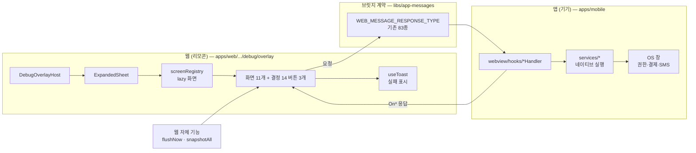
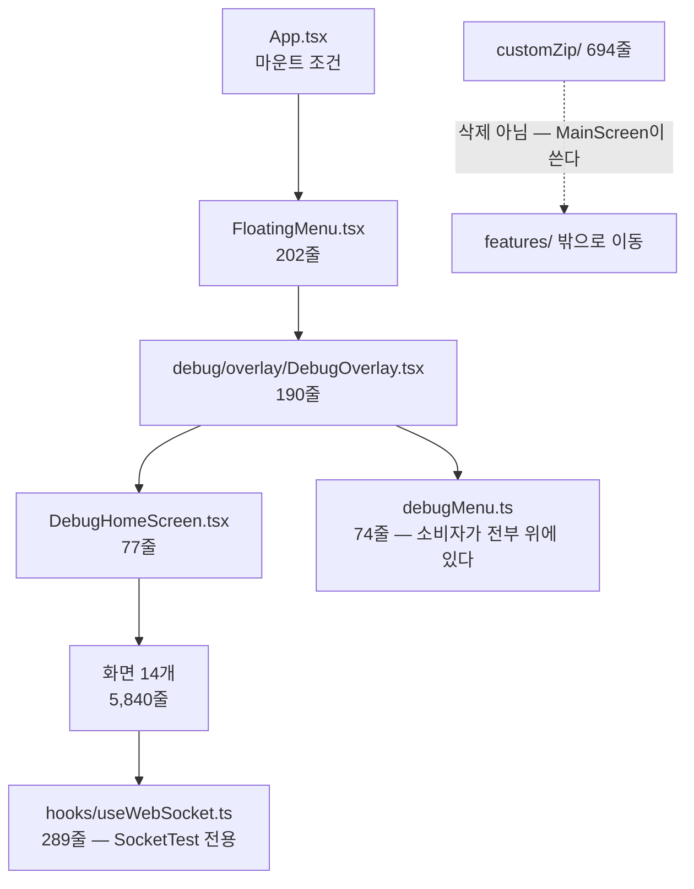

# 디버그 패널

> 상태: **Proposed** · 최종 갱신: 2026-09-10 · 관련 ADR:
>
> 구현은 **1~7단계 전부 커밋됐다.** `Live`로 올리지 않은 이유는 둘이다: ① 캐시 도메인별 비우기 하나가
> 스코프 결정에 막혀 열려 있다(§구현 체크리스트 3단계) ② **실기기 수동 확인을 아직 하지 않았다**
> (§배포 순서의 남은 수동 확인 5건). 그 둘이 닫히면 임시 절(구현 체크리스트·리스크)을 지우고 Live로
> 전환한다.
> [ADR-0080](../../../../docs/adr/0080-debug-panel-shared-model-and-stage-visibility.md) (디버그는 웹이 전부
> 조작한다) · [ADR-0079](../../../../docs/adr/0079-config-registry-and-lane-resolver.md) (설정 레지스트리 —
> 이 문서가 기대는 기반)

## 목적

디버그 조작 창구를 **웹 하나**로 만든다.

지금은 둘이다. 웹 오버레이(10화면)와 앱 디버그 화면(14화면)이 각자 있고, 겹치는 것은 키 이름이 같은
`UploadTest` 하나뿐이다. 같은 일을 하는 화면이 두 벌 있으면서 이름·분류·언어가 다르고, 앱 쪽 버튼을
바꾸려면 앱 릴리스를 기다려야 한다.

ADR-0080이 그 방향을 정했다 — **웹이 리모콘, 앱이 기기다.** 이 문서는 그 결정을 실제 파일 단위 작업으로
옮긴다.

## 설계 원칙

1. **새 브릿지 명령을 만들기 전에 있는 것을 찾는다.** `WEB_MESSAGE_RESPONSE_TYPE`에 web→app 요청이
   이미 83종 있다. 새 명령은 앱 릴리스를 요구하므로, "이 동작을 부를 명령이 정말 없는가"를 먼저 답한다.
2. **범용 실행 명령은 만들지 않는다** (ADR-0080 미결 3). 웹이 앱의 아무 코드나 부를 수 있게 되는 것은
   디버그 편의로 감수할 위험이 아니다. 명령은 항상 이름이 붙은 동작 하나다.
3. **쓰기는 답을 받는다.** 보내고 잊으면 화면이 "껐다"고 하는데 실제로는 안 꺼진 상태가 생긴다
   (ADR-0080 결정 10).
4. **화면을 옮기기 전에 지울 수 있는지 본다.** 이관 대상 14화면 중 3개는 옮길 게 아니라 없앨 것이었다.
   디버그 화면은 늘어나기만 하는 자리이므로, 이관은 정리할 기회다.
5. **앱에는 실행과 OS 창만 남긴다.** 사람이 앱에서 누를 것이 없어야 결정 12(앱 디버그 UI 0)가 성립한다.
6. **확인이 없는 조작은 없는 대로 말한다.** `openURL`·`setBadgeCount`는 `webClient.post`로 보내고
   끝이라 응답이 없다. 결정 10의 확인 원칙과 어긋나지만 그 둘은 제품이 쓰는 기존 메서드이므로 바꾸지
   않고, 결과 줄에 "확인 없음"을 적어 증명된 것과 아닌 것을 구분한다.

## 범위

**포함**

- 웹 오버레이에 앱 전용 화면 11개의 조작면을 추가 (`apps/web/src/app/features/debug/overlay/`)
- 앱 디버그 UI 삭제 — `features/debug` 중 customZip을 뺀 전부 + `FloatingMenu` + `App.tsx` 마운트 조건
- 화면 3개는 이관 없이 삭제 — `BridgeTest` · `EnvironmentSettings` · `SocketTest`
- ADR-0080 결정 14의 버튼 3개 (로그 지금 보내기 · 설정 전체 보기 · 캐시 도메인별 비우기)
- 새 브릿지 명령 3개 — 단계 1·1.5가 확정했다 (§단계 1 검증 결과). 앱 릴리스가 필요한 유일한 부분이다
- 실패 표시 (미결 5의 답)

**제외**

- ~~customZip 기능의 처분~~ → **단계 5에서 결정됐다** (미결 4). 로더를 웹으로 이식하고 앱의
  환경설정 화면을 지웠다. PROD 게이트는 네이티브에 남는다 — 자세한 근거는 §구현 체크리스트 5단계.
- **청크 업로드 서비스와 명령 8종의 처분** — 제품이 쓰지 않는 것은 확인했지만(위 §상세 구현), 미리 만든
  것일 가능성이 있어 이 트랙에서 지우지 않는다. 죽은 코드 판정은 별건이다
- 시각 토큰 통일 — 제품 UI 전체가 걸린 별개 트랙 (ADR-0080 대안 절)
- 원격 컨피그 어댑터 (ADR-0079 결정 10)

## ADR-0080 미결에 대한 답

ADR이 스펙 단계로 넘긴 6개 중 **셋이 조사 과정에서 소멸했다.** 남은 셋만 새로 정한다.

| 미결                       | 답                                                                                                                                                                                                                                                           |
| -------------------------- | ------------------------------------------------------------------------------------------------------------------------------------------------------------------------------------------------------------------------------------------------------------ |
| **1. 공유 모델 위치**      | **소멸.** 결정 12가 앱 디버그 UI를 0으로 만들면 렌더러가 웹 하나다. 모바일 `debugMenu.ts`의 소비자 4개가 전부 삭제 대상이라 모델이 UI와 함께 죽는다 — 공유할 상대가 없다. 결정 1은 결정 12가 대체한다. 웹의 `debugMenu.ts`가 유일한 모델이 된다. 새 lib 없음 |
| **2. 겹치는 화면 쌍**      | **소멸.** 같은 이유다. 목록이 한 벌이 되므로 `DeviceInfo`↔`DeviceTest` 같은 쌍을 합칠지 나눌지는 질문 자체가 없어진다 — 웹 키 하나로 수렴한다                                                                                                               |
| **3. 브릿지 명령 15개**    | **4개다.** 기존 83종이 화면 7개를 완전히 덮고 3개는 삭제 대상이다. 남은 공백은 FCM 토큰 삭제 · 부팅 기록 읽기/비우기 셋이다 — 단계 1에서 메서드 단위로 확정했다(§단계 1 검증 결과). 15개도 0개도 아니고, 앱 릴리스가 범위에 든다                             |
| **4. 커스텀 zip 처분**     | **이번 범위 밖.** 부팅 경로에 물려 있다(위 §범위). 디버그 UI와 함께 지울 수 없다는 것이 이번 답이고, 존치/삭제 판단은 별건                                                                                                                                   |
| **5. 실패 표시**           | `@chatic/ui-kit`의 `useToast`를 쓴다. 웹 오버레이에는 지금 에러 표시 수단이 없고, 앱 전체에는 이미 토스트가 있다(`HomePage.tsx:19`). 행마다 인라인 상태를 두면 화면 11개에 같은 코드가 반복되므로 오버레이 레벨 토스트 하나로 통일한다                       |
| **6. 시각 규약 문서 소유** | **불필요해졌다.** 규약은 두 렌더러를 맞추기 위한 것이었고 렌더러가 하나 남는다. 이 문서가 웹 패널의 정본이다                                                                                                                                                 |

## 시나리오

**QA가 앱에서 SMS 발송을 시험한다**

1. 앱 안에서 웹 화면을 10탭한다 → `debug.overlayEnabled`가 열린다 (PROD는 입장 코드까지, ADR-0079 결정 5).
2. 오버레이에서 `SmsTest`를 고른다. 화면은 **웹**이 그린다.
3. 번호와 본문을 넣고 보내기를 누른다 → 웹이 `SendSms` 요청을 브릿지로 보낸다.
4. 앱이 OS SMS 창을 띄운다. 사람이 앱에서 누른 버튼은 없다.
5. 앱이 `OnSendSms`로 결과를 돌려준다 → 웹이 성공/실패를 화면에 적는다.
6. 실패면 토스트가 이유를 말한다. 조용히 성공한 척하지 않는다.

**QA가 버그를 재현한 직후 로그를 보낸다** (결정 14)

1. 오버레이 → "로그 지금 보내기".
2. 웹이 `LogUploadScheduler.flushNow()`를 부른다. 브릿지 왕복이 없다 — 웹이 자기 큐를 비운다.
3. 전송 결과가 같은 화면에 남는다. 지금은 앱 종료·로그아웃 때만 불려서 재현 직후 보낼 방법이 없었다.

**개발자가 이 기기의 실효 설정을 본다** (결정 14 · ADR-0079 결정 16의 화면 절반)

1. 오버레이 → "지금 설정 전체 보기".
2. `config.snapshotAll()`이 84키의 이름·설명·현재값·기본값·이긴 행·쓰기 가능 여부를 그대로 준다.
3. 목록만 그린다. `meta: true` 키는 렌더하지 않는다 (ADR-0080 결정 6) — 잠금 화면이 잠금 스위치를 담는 순환.

**앱이 새 명령을 모르는 구버전이다**

1. 웹이 먼저 배포된다(리포 규칙). 웹 패널에는 버튼이 있고 앱은 그 명령을 모른다.
2. 브릿지가 `NOT_FOUND`를 돌려준다 → 웹이 그 버튼을 "이 앱 버전에서 지원 안 함"으로 표시한다.
3. 앱이 올라오면 같은 버튼이 그대로 동작한다. 학습 플래그 패턴은 `ConfigFacade`의 셸 폴백과 같다.

## 다이어그램

**조작 흐름 — 리모콘과 기기**

**삭제 대상 — 앱에서 UI가 0이 되는 경로**

## 상세 구현

### 화면별 대응 — 무엇을 옮기고 무엇을 지우나

기존 명령으로 덮이는지는 [`WEB_MESSAGE_RESPONSE_TYPE`](../../../../libs/app-messages/src/types/web-message-response.ts)
기준이다. **명령 단위 동등성은 단계 1에서 줄 단위로 확인한다** — 아래는 능력 단위 판정이다.

| 앱 화면               | 줄    | 처분      | 기존 명령                                                                                                                                                                                                                                     |
| --------------------- | ----- | --------- | --------------------------------------------------------------------------------------------------------------------------------------------------------------------------------------------------------------------------------------------- |
| `UploadTest`          | 1,100 | 이관 없음 | **웹 화면이 그대로 살아남는다.** 웹 `UploadTestScreen`(1,720줄)이 이미 8개 명령 전부를 `webClient.request`로 직접 부르는 유일한 소비자다 — 단계 2에서 할 일이 없고, 모바일 화면은 단계 6에서 함께 사라진다                                    |
| `NotificationTest`    | 559   | 이관      | `ShowNotification`·`FetchFcmToken`·`SetBadgeCount`·`FetchBadgeCount`·`FetchPushMarks`·`RequestPermission` (웹 `PushScreen` 163줄 확장)                                                                                                        |
| `SocketTest`          | 540   | **삭제**  | 없음. 그런데 `useWebSocket`·`chatic-sockets-api`를 쓰는 곳이 이 화면 하나뿐이다 — 앱에 프로덕션 소켓이 없다. 테스트 화면을 위해서만 있는 스캐폴딩이므로 훅 289줄과 함께 지운다                                                                |
| `StorageTest`         | 492   | 분할      | ① 네이티브 캐시 CRUD는 남은 작업(명령 4종 있음, 웹 `CacheTestScreen`은 테스트레코드만 부른다) ② **SQLite 백업/복원은 삭제했다**(아래)                                                                                                         |
| `BridgeTest`          | 452   | **삭제**  | ADR-0080 결정 11 — 브릿지가 죽으면 흰 화면이 이미 알려준다                                                                                                                                                                                    |
| `IapTest`             | 400   | 이관      | `IapScreen` 신설. 명령 6종 파사드가 이미 다 있었다. **구매는 `post`이고 결과는 `OnPurchaseSuccess`/`OnPurchaseError` 이벤트로 온다** — 호출만으로 성공을 말하지 않는다                                                                        |
| `OAuthTest`           | 382   | 이관      | `OAuthScreen` 신설. `OAuthLogin`·`OAuthLogout` — 파사드만 추가. 웹 릴레이 경로와 별개인 **네이티브 시트**를 시험한다                                                                                                                          |
| `SmsTest`             | 373   | 이관      | `SmsScreen` 신설. `SendSms`(OS 작성 창 — 보내기는 사람이 누른다) + `GetContacts`                                                                                                                                                              |
| `DeviceTest`          | 348   | 이관      | 웹 `DeviceInfoScreen`에 조작 절 추가. 명령은 전부 있었고 `appBridge`에 `openCamera`·`openPhotoLibrary`·`openDocument`·`copyToClipboard` 4개를 파사드만 더했다. **`MICROPHONE`은 계약 union을 넓혀야 했다**(아래)                              |
| `Monitoring`          | 314   | 이관      | 큐는 웹 `LogBufferScreen`(624줄)이 **이미 전부 덮는다** — 빠진 건 네이티브 카운터 2개(`getContentProcessReloadCount`·`getLastForegroundResumeMs`)뿐이고, `FetchBootRecords`가 그 둘을 함께 돌려주므로 부팅 기록 화면에 실렸다. 별 화면 불필요 |
| `EnvironmentSettings` | 281   | **삭제**  | ADR-0080 결정 13 — 기능 자체를 뺀다                                                                                                                                                                                                           |
| `BootPerformance`     | 237   | 이관      | **신규 웹 화면이 필요했다.** 웹 `BootTab`(83줄)은 현재 세션의 웹 타임라인을 라이브로 재는 다른 것이다 — 이쪽은 누적된 네이티브+웹 병합 기록이다. `BootRecordsScreen` 신설                                                                     |
| `AppIconTest`         | 223   | 이관      | `AppIconScreen` 신설. `FetchAppIcon`·`FetchAppIconList`·`ChangeAppIcon` — 파사드만 추가. 응답은 `AppIconOption{id,label}`이라 **버튼은 label, 전송은 id**(id가 `null`이면 기본 복원)                                                          |
| `DeeplinkTest`        | 139   | 이관      | `OpenURL` — 앱 스킴을 열면 OS가 인바운드 딥링크로 되돌려준다. `DeeplinkScreen` 신설(입력 + 프리셋 4개). 스킴은 `net.deeplink.scheme`으로 해석한다                                                                                             |
| `DebugHomeScreen`     | 77    | **삭제**  | 결정 12 — 열 곳이 없다                                                                                                                                                                                                                        |

### 단계 1 검증 결과 — 새 브릿지 명령 3개 (2026-09-10)

능력 단위로 "0개"라고 적었던 것을 **메서드 단위로 검증한 결과 4개가 필요하다.** 방법은 화면이 부르는
네이티브 서비스 메서드와 `webview/hooks/*Handler.ts`가 부르는 메서드를 대조한 것이다.

**완전히 덮이는 화면 7개** — `DeviceTest`(8/8) · `StorageTest`(5/5) · `IapTest`(6/6, `useSubscriptionIap`의
공개 API가 IAP 명령 6종과 1:1) · `UploadTest`(5/5) · `AppIconTest`(3/3) · `OAuthTest`(2/2) ·
`SmsTest`(2/2, `SendSms`+`GetContacts`).

**새 명령이 필요한 것 3개** (초안은 4개였다 — 아래 철회 참고)

| 새 명령            | 덮지 못한 메서드                                                                                                                  | 왜 기존 것으로 안 되나                                                               |
| ------------------ | --------------------------------------------------------------------------------------------------------------------------------- | ------------------------------------------------------------------------------------ |
| `DeleteFcmToken`   | `notificationService.deleteToken` (`NotificationTest`)                                                                            | 재등록을 시험하려면 토큰을 지워야 한다. `FetchFcmToken`은 읽기뿐이다                 |
| `FetchBootRecords` | `bootMetricsService.getRecords` · `getContentProcessReloadCount` · `getLastForegroundResumeMs` (`BootPerformance` · `Monitoring`) | `SendBootMetrics`는 웹→앱 쓰기다. 네이티브가 기록한 부팅 타이밍을 되읽는 경로가 없다 |
| `ClearBootRecords` | `bootMetricsService.clearRecords` (`BootPerformance`)                                                                             | 같은 이유                                                                            |

**구현 중 철회 1개 — `SimulateInboundDeeplink`.** 단계 1.5에서 계약에 넣었다가 되돌렸다.
`deeplinkService.handleUrl`이 실제로 하는 일이 **`Linking.openURL(url)`** 이고, 기존 `OpenURL`의
핸들러(`useDeviceHandler.ts:163`)도 정확히 같은 호출로 끝난다 — 앱 스킴을 넘기면 OS를 거쳐
인바운드 딥링크로 되돌아오는 같은 왕복이다. `handleUrl`이 더하는 건 빈 URL 가드와 상대경로
정규화(`/chats/x` → `chatic://chats/x`)뿐이고, 후자는 웹이 `net.deeplink.scheme` 키로 직접 한다.
**이름과 의도만 보고 "반대 방향"이라 판정한 것이 틀렸다** — 구현을 읽으니 같은 동작이었다.
그래서 새 명령은 **3개**다.

**기존 것으로 대체하는 것 3개** — 새 명령을 만들지 않는다 (설계 원칙 1).

| 메서드                               | 대체                                                                |
| ------------------------------------ | ------------------------------------------------------------------- |
| `notificationService.clearBadge`     | `SetBadgeCount(0)`                                                  |
| `notificationService.hasPermission`  | `RequestPermission` — 이미 허용된 상태에서 멱등이고 상태를 돌려준다 |
| `notificationService.onTokenRefresh` | `FetchFcmToken` 폴링 — 디버그 화면에 구독형 이벤트는 과하다         |

**1차 스캔의 오탐 2건을 기록한다.** `uploadService.pauseUpload`/`cancelUpload`를 공백으로 셌는데
`useUploadHandler`가 `getUploadService().pauseUpload(...)` 형태로 부르고 있었다 — `xxxService.method`
패턴만 보면 게터를 거치는 호출을 놓친다. **서비스 호출을 셀 때는 게터 형태를 함께 잡아야 한다.**

**결론: 앱 릴리스가 범위에 들어온다.** ADR은 "화면마다 명령 하나씩(15개)"이라 했고 초안은 "0개"라
했는데, 실제는 3개다. 배포 순서 제약(웹 선배포)이 그대로 적용되므로 단계 7이 필수다.

### 웹 쪽 확장 지점

한 화면을 더하는 비용은 세 곳이다 — 이 구조는 이미 서 있다.

| 파일                                                                                    | 무엇                                     |
| --------------------------------------------------------------------------------------- | ---------------------------------------- |
| [`overlay/debugMenu.ts`](../../src/app/features/debug/overlay/debugMenu.ts)             | `DebugScreenKey` 유니온 + 섹션 한 행     |
| [`overlay/screenRegistry.tsx`](../../src/app/features/debug/overlay/screenRegistry.tsx) | `lazy()` 한 줄 — 초기 번들에 안 들어간다 |
| `overlay/screens/<Name>Screen.tsx`                                                      | 화면 본문                                |

**네이티브 캐시 CRUD 화면은 "명령 4종으로 만들면 된다"가 아니었다 (2026-09-10 실측).** 다섯 번째로
뒤집힌 판정이다. 막는 것은 명령의 부재가 아니라 **스코프**다:

- 캐시 명령 payload는 전부 `CacheBasePayload<K> = { type, cid, uid }`를 요구한다
  (`libs/app-messages/src/types/model/cache.ts:47`).
- 그 `cid`/`uid`를 도메인 타입별로 정하는 정책은 `@chatic/data`의 `resolveScopedContext(type, provider)`가
  소유하고, `libs/db`의 `BaseDbAdapter`만 그것을 부른다(`BaseDbAdapter.ts:20`).
- `libs/app-runtime`의 `runtime.data`는 타입별 캐시 접근자도, 컨텍스트 접근자도 공개하지 않는다.
  `useGlobalCacheSearch`는 검색·안읽음이 쓰는 프로덕션 기능이고 `getDataManager`를 거치므로 원시
  조회 도구가 아니다.

그래서 세 갈래이고 **선택이 필요하다**: ① `runtime.data`에 스코프 접근자 하나를 공개(정책은 한 곳에
남고 화면은 원시 접근을 얻는다) ② `NativeDBAdapter`를 재사용(디둡·메트릭·학습 플래그가 얹혀
관측하려는 원시 상태를 흐린다) ③ 이 화면을 만들지 않는다(모바일 화면의 값은 재현 중 캐시 상태를
들여다보고 고치는 것이고, 결정 14의 "캐시 도메인별 비우기"가 그 필요의 일부를 덮는다).

**SQLite 백업/복원을 삭제했다 (2026-09-10 결정).** `sqliteDatabase.backup/restore`의 소비자가
`StorageTestScreen` 하나뿐이었다 — `SocketTest`의 네이티브 WS 클라이언트와 같은 구조다. 웹으로
옮기려면 `FileManagerBridge`(계약·웹 노출 0건)를 브릿지에 열어야 하는데, **파일시스템 경로를 웹에
여는 것은 디버그 편의로 감수할 위험이 아니다**(설계 원칙 2의 "범용 실행 명령은 만들지 않는다"와 같은
이유). 지운 것: `SqliteDatabase` 구현 **55줄** · `IDatabase` 인터페이스 2줄 · 화면의 핸들러와 버튼.
`FileManagerBridge` 자체는 `useDeviceHandler`·customZip·UploadTest가 쓰므로 남는다.

**청크 업로드는 제품이 쓰지 않는다 — 그런데도 남긴다 (2026-09-10 결정).** 실측: 제품의 이미지 첨부는
`usePickImage` → `resizeImageToBase64`(base64)이고, 업로드 명령 8종의 소비자는 디버그 밖에 **0건**이다.
`appBridge`에는 업로드 메서드가 아예 없어 제품 파사드에 올라간 적도 없고, 모바일 `uploadService`(898줄)를
부르는 것은 `useUploadHandler` 하나이며 그 핸들러를 부르는 건 웹 디버그 화면뿐이다. 구조가 `SocketTest`와
같다.

**그래도 지우지 않는다.** 네이티브 서비스는 2026-05-26~28에 청크·백그라운드 태스크·SQLite 영속·복구까지
갖춰 만들어졌고 그 뒤 손대지 않았다 — **버려진 코드인지 아직 안 나온 대용량 첨부를 위해 미리 만든 것인지
커밋만으로는 구분되지 않는다.** 지우는 쪽이 4,700줄을 줄이지만 후자였다면 재구현 비용이 크고 브릿지 계약
축소라 앱 릴리스도 든다. 그래서 **웹 조작면을 남겨 QA가 계속 시험할 수 있게 하고**, 서비스와 명령 8종의
처분은 별건으로 넘긴다.

**"동등성 확인"이라 적었던 셋 중 둘은 그게 아니었다.** 이름이 비슷하다고 같은 화면이 아니다 —
`BootPerformance`↔`BootTab`은 **다른 것을 재고**(누적 기록 vs 현재 세션 라이브), `Monitoring`은
반대로 웹이 이미 거의 다 덮고 있었다(카운터 2개만 부족). 단계 1의 딥링크 오판과 같은 실수이므로
남은 화면도 **구현을 열어 확인한 뒤** 판정한다.

**권한 union이 사본으로 갈라져 능력 하나를 막고 있었다 (2026-09-10).** 모바일
`services/permission/types.ts`는 `MICROPHONE`을 포함한 5개를 선언하는데 계약
(`libs/app-messages`)은 4개였다 — 그래서 앱은 마이크 권한을 요청할 수 있었지만 웹은 못 했다.
`usePermissionHandler`가 payload를 그대로 `permissionService.request`에 넘기고 앱의
`PERMISSION_MAP`에 `MICROPHONE`(iOS `MICROPHONE` · Android `RECORD_AUDIO`)이 이미 있으므로
**계약 타입만 넓히면 되고 앱 릴리스는 들지 않는다.** 6단계의 `Stage`/`Platform` 사본 문제와 같은
형태다([[config-registry-track]]). 사본을 없애고 모바일이 계약 선언을 재export하게 했다 —
`BootRecord`와 같은 처방이다.

**딥링크 스킴은 절대 문자로 쓰지 않는다 (2026-09-10, 버그 하나를 만들고 배운 것).** `PushScreen`의
푸시 탭 재현에 `chatic://chats`를 박아 넣었는데, DEV 빌드는 `chatic-dev:`를 등록하므로 두 채널이 깔린
기기에서 **prod 앱이 열린다** — `apps/desktop-web`의 `oauth.ts`가 경고하는 그 교차 채널 위험이다.
`lib/buildAppDeeplink.ts`가 `net.deeplink.scheme`(byStage로 DEV는 `chatic-dev`)을 읽어 상대경로에
스킴을 붙이고, **이미 스킴이 붙은 입력은 그대로 통과시킨다** — 다른 채널이 이 빌드를 잡지 않는지
확인하는 것도 시험 대상이기 때문이다(앱 화면이 dev/prod 버튼을 따로 둔 이유). 테스트가 DEV 스킴을
가정해 하드코딩 회귀를 잡는다.

섹션·언어는 결정 3대로 한국어로 통일한다. 지금 웹은 `Tools`/`Data`/`Info`(영어), 앱은
`기능 테스트`/`환경설정`/`모니터링`(한국어)이다.

### 앱 쪽 삭제

`features/debug` 32파일 7,237줄 중 **customZip 694줄은 남는다** — `MainScreen.tsx:36`의 부팅 게이트가
쓴다. `features/debug` 아래 두면 "디버그 = 삭제됨"과 어긋나므로 디버그 밖으로 옮긴다.

삭제: 6,543줄(features/debug − customZip) + `FloatingMenu.tsx` 202줄 = **6,745줄** + `App.tsx` 마운트 조건.

### 캐시 조작의 실제 커버리지 — 앞선 서술을 정정한다 (2026-09-10)

"웹은 네이티브 캐시를 만질 수단이 없다"고 적었는데 **한쪽을 빠뜨린 서술이었다.** 웹
`CacheTestScreen`이 부르는 테스트레코드 명령 5종은 `TestRecordDataSource`를 거치고, 그것은 캐시
도메인 데이터소스들과 **같은 `ISqliteDatabase`**를 쓰며 같은 `data/cache/` 폴더에 있다. 즉
**네이티브 SQLite 왕복 자체는 브릿지로 이미 검증된다** — 핸들러·전송·DB가 같은 경로다.

덮이지 않는 것은 좁다: **제품 캐시 행**(channel/chat/user…)을 도메인별로 들여다보고 고치는 일.
재현 중 캐시 상태를 손보는 용도이고, 그것만으로 스코프 접근자를 새로 공개할 이유는 아니라고
판단해 모바일 화면을 지웠다(사용자 결정). 되살릴 때는 위 §스코프 세 갈래에서 고른다.

### 다음 라운드로 넘기는 관찰 — 웹 `CacheTestScreen`이 필요한지 (2026-09-10)

사용자가 짚었다. 이 문서를 쓰며 실측한 것 둘이 그 의심을 뒷받침한다:

- **이름이 내용과 다르다.** `CacheTestScreen`(1,376줄)은 `webClient`와 `TestRecord`만 쓴다 — 캐시가
  아니라 **테스트레코드** 화면이다. 부르는 명령도 `SaveTestRecord`·`FetchTestRecord`·
  `FetchAllTestRecords`·`SaveAllTestRecords`·`ClearTestRecords` 다섯뿐이다.
- **테스트레코드 자체의 소비자를 확인하지 않았다.** 캐시 명령이 `libs/db`의 프로덕션 경로를 갖는 것과
  달리, 테스트레코드 명령 5종이 제품에서 쓰이는지는 이번에 조사하지 않았다. `SocketTest`·업로드
  서비스와 같은 "디버그만 쓰는 능력"일 수 있다.

**확인 없이 지우지 않는다** — 1,376줄이고, 업로드 서비스에서 배운 대로 "제품이 안 쓴다"가 곧 "버려도
된다"는 아니다. 다음 라운드에서 ① 테스트레코드 명령 5종의 제품 소비자 ② 그 화면이 실제로 QA에
쓰이는지를 먼저 본다.

## 검증 방법

- 웹: 화면마다 유닛 테스트. 기존 관례는 `apps/web/**/*.test.ts(x)` + jest (`apps/web`에서 `npx jest`).
  브릿지 왕복은 `appBridge` 목으로 요청/응답 한 쌍을 확인한다.
- 앱: 삭제가 주 작업이라 새 테스트보다 **잔존 참조 0건**이 판정이다 — `debugMenu`·`FloatingMenu`·
  `DebugOverlay`·`useWebSocket` grep 0건, `apps/mobile`에서 `npx jest` 428개 불변.
- 수동: 앱 안에서 오버레이 진입 → 화면 11개 각각 한 번 누르고 응답 확인. 구버전 앱 시나리오는
  핸들러를 뺀 빌드로 `NOT_FOUND` 표시 확인.
- 타입체크: `apps/web` 0건 유지. **`apps/mobile`도 메인 체크아웃에서는 앱 레벨 `tsc`가 돈다** —
  `npx tsc --noEmit -p tsconfig.app.json`, **선재 부채 1건**(`stores/debugSettingsStore.ts:90`의
  zustand `partialize` 타입, `origin/develop`과 동일 파일이라 무관 확인)이 기준선이다. 워크트리에서
  막히는 건 그쪽에 `@nx/react-native`가 없어서였다 — 단계 1.5에서 이 타입체크가 라우터의 중복 선언을
  실제로 잡았으므로, 이 트랙에서는 메인 체크아웃 기준으로 돌린다.

---

## 구현 체크리스트

각 단계가 끝나면 그 자리에서 검증 가능해야 한다. **단계 1이 나머지 전부의 전제다.**

- [x] **1. 명령 단위 동등성 확인 (코드 변경 0)** — 완료(2026-09-10). 결과는 위 §단계 1 검증 결과.
      새 명령 4개가 필요하고, 화면 7개는 기존 명령으로 완전히 덮인다.
- [x] **1.5. 새 명령 3개를 계약에 추가** — 완료(2026-09-10). `DeleteFcmToken`(`useFcmHandler`) ·
      `FetchBootRecords`/`ClearBootRecords`(`usePerfHandler`) + 라우터 등록. `BootRecord`와 그
      지원 유니온 둘은 기록이 브릿지를 건너게 되면서 `libs/app-messages`의 `model/perf.ts`로 옮기고
      `BootMetricsService`가 재export한다 — 선언 하나가 두 쪽 드리프트를 막는다.
      **앱 릴리스가 필요한 유일한 단계다.** 웹은 이 명령들을 부르되 `NOT_FOUND`를 단계 4의 표시로 흘린다.
- [x] **2. 웹 화면 11개 추가** — 완료(2026-09-10). 신설 6 · 확장 2 · 이관 불필요 3.
    - [x] `BootPerformance` → `BootRecordsScreen` 신설(147줄) + `debugMenu`·`screenRegistry` 등록 +
          `appBridge` 3메서드. 테스트 7건. 새 명령 3개가 이걸로 end-to-end 검증됐다
    - [x] `Monitoring` → 별 화면 불필요로 판정(카운터 2개는 위 화면에 실림)
    - [x] `UploadTest` — 단계 2에서 할 일 없음으로 판정. 웹 화면이 8개 명령의 유일한 소비자이므로 그대로
          살아남고, 모바일 화면은 단계 6에서 사라진다. 네이티브 서비스·명령 8종 처분은 별건(위 절)
    - [x] `PushScreen`←`NotificationTest` — 조작 절 신설(토큰 삭제 · 알림 권한 · 로컬 알림 ·
          뱃지 조회/0으로 · 푸시 탭 재현). `appBridge`에 `fetchBadgeCount`·`showNotification`·
          `requestPermission` 3개를 **파사드만** 추가했다(계약은 이미 있었으므로 앱 릴리스 없음).
          테스트 6건. 이걸로 `DeleteFcmToken`까지 새 명령 3개 전부 end-to-end 검증됐다
    - [x] `DeeplinkTest` → `DeeplinkScreen` 신설. **별 화면이 맞았다** — 웹 `InviteRedirectScreen`은
          공유 링크를 변환해 **웹**을 이동시키는 다른 도구다(`window.location.href`). 이쪽은 **앱**의
          인바운드 라우팅을 시험한다. 프리셋에 교차 확인용 절대 스킴 2개를 둔다
    - [x] `DeviceInfoScreen`←`DeviceTest` — 조작 절 추가(카메라 · 앨범 · 파일 · 연락처 · 클립보드 ·
          OS 설정 · 공유 시트 + 권한 4종). `appBridge` 4개 파사드 추가, 계약에 `MICROPHONE` 확장.
          테스트 5건
    - [x] `AppIconScreen` · `SmsScreen` · `OAuthScreen` 신설 — `appBridge`에 파사드 5개 추가
          (`fetchAppIcon`·`fetchAppIconList`·`changeAppIcon`·`oAuthLogin`·`oAuthLogout`). 테스트 11건
    - [x] `hooks/useDebugOperation` 추출 — "누르고 결과 표시"를 세 번 복사한 뒤 뽑았다. `run`(응답 받는
          명령)과 `fire`(post 기반, 답 없음)를 나눠 결정 10을 지킨다. `PushScreen`·`DeviceInfoScreen`도
          이걸로 정리. 테스트 6건
    - [x] `IapTest` → `IapScreen` 신설. 명령 6종 파사드가 이미 다 있었다. 구매 결과가 이벤트로 오는
          구조를 화면에 반영(구독 + 기록). 테스트 6건
    - [x] `StorageTest` ② SQLite 백업/복원 **삭제 완료**(위 절). 구현 55줄 + 인터페이스 2줄 + 화면 UI
    - [x] `StorageTest` ① 네이티브 캐시 CRUD 화면 — **만들지 않기로 했다**(2026-09-10, 위 절의 ③).
          스코프 접근 방식을 정하는 것이 화면보다 큰 결정이고, 결정 14의 "캐시 도메인별 비우기"가 그
          필요의 일부를 덮는다. 되살릴 때는 위 절의 세 갈래에서 고르는 것으로 시작한다
- [x] **3. 결정 14 버튼 3개** — 둘 완료, 하나는 스코프 벽에 막혔다(2026-09-10).
    - [x] **로그 지금 보내기** — `LogUploaderHandle.flush()`가 이미 있었지만 `main.tsx`가 handle을
          버려서 닿을 수 없었다. `LogQueueView`에 `flush`를 더해(그 모듈이 존재하는 이유와 같은 방식)
          `LogBufferScreen`의 Upload 절에 버튼을 뒀다. **업로더가 없으면 "돌고 있지 않습니다"로
          구분한다** — 조용히 넘어가면 누른 사람에게는 "보냈다"로 읽힌다
    - [x] **지금 설정 전체 보기** — `ConfigScreen` 신설. **ADR-0079 결정 16의 화면 절반**으로,
          그 트랙 7단계가 로깅 절반만 내고 남겨 둔 것이다. `meta: true` 키 제외(결정 6의 순환) +
          `debug.entryCode` 제외(자격증명·복사 가능한 화면). 오버라이드된 것을 먼저 보여준다 —
          "이 기기가 왜 다르게 동작하나"가 여기 오는 이유다
    - [ ] **캐시 도메인별 비우기** — 캐시 CRUD 화면과 **같은 스코프 벽**이다(위 절). payload가
          `{type, cid, uid, channelId}`를 요구하고 `runtime.data`는 접근자를 공개하지 않는다.
          `libs/data`의 repository에도 도메인 비우기 공개 API가 없다. 세 갈래 선택이 먼저다
- [x] **4. 실패 표시** — 완료(2026-09-10). 다만 미결 5의 답과 형태가 달라졌다.
    - [x] **`NOT_FOUND`를 실패와 구분한다** — 호스트는 핸들러가 없을 때 그 코드를 보낸다
          (`AppBridgeHost.ts:185`). 원문("등록된 핸들러를 찾을 수 없습니다")을 그대로 보이면 테스터가
          버전 차이를 버그로 쫓는다. `useDebugOperation.run`이 명령 이름을 받아 "이 앱 버전이
          지원하지 않습니다"로 답하고 **기억한다** — `isUnsupported(command)`로 화면이 버튼을 잠근다.
          모듈 스코프·단방향으로 `shellKvAdapter`의 `configKvUnsupported`와 같은 패턴. `info`로
          기록해 배포 구간의 버전 차이가 수집 로그에 보인다
    - [x] **config 쓰기 실패 토스트** — ADR-0079 4단계가 `onShellWriteFailed`를 로그까지만 배선하고
          "토스트는 다음 라운드"로 남긴 것. 명령형 `toast`(React 밖에서 도는 콜백이므로 훅이 아니다)로
          띄운다. **`onDuplicateKey`는 로그만** — 레지스트리 작성 오류라 폰을 든 사람이 할 일이 없고
          `allModules.spec.ts`가 빈 집합을 단정한다
    - [x] `BootRecordsScreen`이 손으로 만든 에러 처리를 공용 훅으로 대체 — 문구와 학습이 화면마다
          갈리지 않는다

**미결 5의 답을 바꿨다.** 스펙은 "오버레이 레벨 토스트 하나로 통일"이라고 적었지만, `useDebugOperation`이
결과 줄을 이미 한 곳에서 만들고 있어 **조작 결과에는 토스트를 쓰지 않는다**: 디버그 응답은 긴 JSON이라
토스트가 잘라먹고 사라지며, 같은 내용이 두 번 보인다. 토스트는 **config 쓰기 실패**에만 쓴다 — 결정 10이
원래 말한 대상이 그것이고(사용자가 방금 한 행동이 조용히 안 붙는 상황), 화면 밖에서 일어나므로 인라인
줄로는 알릴 자리가 없다.

**곁가지 — `adapters.ts`는 유닛 테스트가 불가능하다.** `import.meta.env`를 읽어 CommonJS 테스트 변환에서
로드되지 않는다(`utils/buildEnv.ts`·`logUploadSwitch.ts`가 읽기를 격리한 것과 같은 제약). 그래서 두 콜백을
`configPortCallbacks.ts`로 분리했다 — 리포가 이미 쓰는 처방이다.

- [x] **5. customZip — 이동이 아니라 로더 이식이었다** (2026-09-10). 옮기기만으로는 안 됐다:
      zip을 심는 유일한 입구가 `useCustomZipLoader`이고 그걸 쓰는 화면이 결정 13이 지우는
      `EnvironmentSettingsScreen` 하나였다. 즉 단계 6은 이 기능을 자동으로 반쪽으로 만든다 —
      부팅 게이트가 복원할 것이 영원히 없어진다. **미결 4가 여기서 강제로 드러났고, 로더를 웹으로
      이식하기로 결정했다.**
    - [x] `features/debug/customZip` → `app/customZip` 이동(브릿지가 부르는 인프라가 됐다)
    - [x] 훅 → `customZipController.ts` 명령형 코어 추출(핸들러는 훅을 들 수 없다). 스토어를
          **서버 기동 성공 뒤에만** 갱신하는 순서를 그대로 보존 — 테스트 6건이 그걸 지킨다
    - [x] 새 명령 3개: `ApplyCustomZip` · `DisableCustomZip` · `FetchCustomZipStatus`
    - [x] **PROD fail-closed 게이트** — `isCustomZipAllowed()`가 baked `VITE_ENV`를 본다. 앱의
          `FloatingMenu`가 걸던 `ALLOW_ENVIRONMENT_SETTINGS`를 그 자리에서 옮겨온 것이고, 웹이
          공급하는 값으로 판정하면 조작된 번들이 게이트 자신을 풀 수 있다(결정 5의 논리).
          **끄기는 게이트하지 않는다** — 빌드가 PROD로 바뀐 채 zip이 켜진 기기의 탈출로다
    - [x] 웹 `CustomZipScreen` + `EnvironmentSettingsScreen` 삭제(결정 13 실현)
- [x] **6. 앱 UI 삭제** — 완료(2026-09-10). **6,428줄.** `features/debug/` 전체(화면 13개 ·
      `DebugHomeScreen` · `DebugOverlay` · `debugMenu.ts` · `useWebSocket` · `theme.ts` ·
      `formatLogForCopy`) + `FloatingMenu.tsx` + `App.tsx`의 마운트 조건·오버레이 상태.
      **앱에서 디버그 UI가 0이 됐다.**
      잔존 참조 전수 0건(`features/debug`·`FloatingMenu`·`DebugOverlay`·`debugMenu`·`useWebSocket`·
      `DebugOverlayEntryKey`) — 남은 두 언급은 customZip 게이트의 출처를 적은 역사적 주석이다.
      `debugSettingsStore.debugModeEnabled`는 **남긴다**: `AppWebView`가 주입 스크립트로 웹에
      되돌려줘 10탭 잠금 해제가 리로드를 넘어 살아남게 한다(`injectionScripts`).
- [x] **7. 배포 순서** — 완료(2026-09-10). 아래 §배포 순서에 못박았고, 감사에서 실제 누락 1건을 잡았다:
      `DeleteFcmToken` 버튼이 명령 이름을 넘기지 않아 학습·잠금이 되지 않았다. 전 화면을 파서로 재감사해
      누락 0건을 확인했다(`run` 호출 중 브릿지를 부르는 것 전부가 세 번째 인자를 넘긴다).

## 배포 순서

**웹이 앱보다 먼저 배포된다**(리포 규칙). 그래서 창이 **두 개** 생기고, 둘 다 정상이다.

### 창 1 — 웹이 앞선 구간: 새 명령이 없는 앱

이 브랜치가 추가한 명령 **8개**는 앱 릴리스가 실려야 동작한다. ADR-0080이 6개,
[ADR-0079](../../../../docs/adr/0079-config-registry-and-lane-resolver.md)의 셸 KV 레인이 2개다 —
**한 앱 릴리스가 둘을 함께 싣는다.**

| 명령                                                           | 출처     | 구버전 앱에서                                                                 |
| -------------------------------------------------------------- | -------- | ----------------------------------------------------------------------------- |
| `DeleteFcmToken` · `FetchBootRecords` · `ClearBootRecords`     | ADR-0080 | 버튼이 "이 앱 버전이 지원하지 않습니다"로 잠긴다 (단계 4)                     |
| `ApplyCustomZip` · `DisableCustomZip` · `FetchCustomZipStatus` | ADR-0080 | 같음. 상태 조회는 조용히 비어 보이고 첫 적용에서 학습한다                     |
| `SaveConfigValue` · `ClearConfigValue`                         | ADR-0079 | `shellKvAdapter`의 `configKvUnsupported`가 레거시 `SavePreference`로 폴백한다 |

`useDebugOperation`의 학습이 이 구간을 덮는다: 첫 호출이 `NOT_FOUND`를 받으면 그 명령을 기억하고
버튼을 잠근다. **파사드만 늘린 12개**(`fetchBadgeCount`·`showNotification`·`requestPermission`·
`openCamera`·`openPhotoLibrary`·`openDocument`·`copyToClipboard`·`fetchAppIcon`·`fetchAppIconList`·
`changeAppIcon`·`oAuthLogin`·`oAuthLogout`)는 명령과 핸들러가 이미 있어 이 구간에 영향이 없다 —
그래도 같은 방식으로 이름을 넘겨 두었다(오래된 빌드에서 하나가 빠져 있어도 같게 동작한다).

### 창 2 — 앱이 뒤따르는 구간: 옛 디버그 UI가 남은 앱

단계 6이 들어간 앱 빌드가 나가기 전까지 **구버전 앱 사용자는 앱 안의 옛 디버그 메뉴를 그대로 갖는다.**
그 구간에는 웹 패널과 앱 UI가 **동시에** 존재하고, 그것이 정상이다 — 앱을 원격으로 지울 방법은 없고,
두 창구가 같은 브릿지 명령을 부르므로 서로를 깨뜨리지도 않는다.

한 가지만 다르다: 그 구간의 구버전 앱에는 `EnvironmentSettingsScreen`이 아직 있어 **웹 주소 바꾸기와
커스텀 zip을 앱에서 직접** 할 수 있다. 새 웹 경로의 PROD 게이트(`isCustomZipAllowed`)는 새 명령에만
걸리므로, 옛 화면의 게이트(`ALLOW_ENVIRONMENT_SETTINGS`, 같은 `VITE_ENV` 판정)가 그 구간을 계속
덮는다 — 두 가드가 같은 기준이라 구간 내내 정책이 흔들리지 않는다.

### 남은 수동 확인

자동 테스트가 덮지 못하는 것들이다. **이 세션에서 실기기 확인은 하지 않았다.**

1. 앱 안에서 오버레이 진입(10탭) → 화면 13개를 한 번씩 눌러 응답 확인
2. 새 명령 6개를 **구버전 앱**에서 눌러 "지원하지 않습니다" 표시와 버튼 잠금 확인
3. 커스텀 zip: DEV 빌드에서 적용·끄기, **PROD 빌드에서 적용이 거부되고 끄기는 되는지**
4. `MainScreen` 부팅 — customZip이 켜진 채 재시작해 게이트가 복원하는지 (단계 5가 이동시킨 경로)
5. 앱에 디버그 UI가 실제로 0인지 (FAB이 안 뜨는지)

## 리스크와 미지수

| 리스크                                       | 크기 | 대응                                                                                                                                           |
| -------------------------------------------- | ---- | ---------------------------------------------------------------------------------------------------------------------------------------------- |
| ~~대응표가 능력 단위라 명령 payload가 부족~~ | 해소 | 단계 1에서 메서드 단위로 검증했다. 새 명령 4개가 나왔고 §단계 1 검증 결과에 적었다 — 코드 변경 0으로 확인해서 비용은 없었다                    |
| 새 명령 4개가 앱 릴리스에 묶인다             | 큼   | 단계 1.5를 단계 2보다 먼저 내보내고, 웹은 `NOT_FOUND`를 표시로 흘린다(단계 4). 구버전 앱에서는 그 4개 버튼만 비활성이고 나머지 화면은 동작한다 |
| 앱 UI를 지운 뒤 웹 패널에 빠진 조작 발견     | 큼   | 단계 6을 마지막에 둔다. 2~4가 끝나고 수동 확인을 통과한 뒤에만 지운다                                                                          |
| 구버전 앱에서 웹 버튼이 조용히 실패          | 중   | 단계 4의 `NOT_FOUND` 표시. 리포 규칙(웹 선배포)상 이 구간은 반드시 생긴다                                                                      |
| customZip 이동이 부팅을 깬다                 | 중   | 단계 5를 삭제보다 먼저. `MainScreen` 부팅을 수동 확인                                                                                          |
| 앱 레벨 타입체크 부재                        | 중   | 이 워크스페이스는 `@nx/react-native`가 없어 `apps/mobile`의 `tsc`가 안 돈다. 삭제 위주 작업이라 grep + ts-jest로 대체하되 한계를 안다          |
| 웹 오버레이 번들 증가                        | 작   | `screenRegistry`가 이미 `lazy()`다. 화면 11개 모두 lazy 유지                                                                                   |
