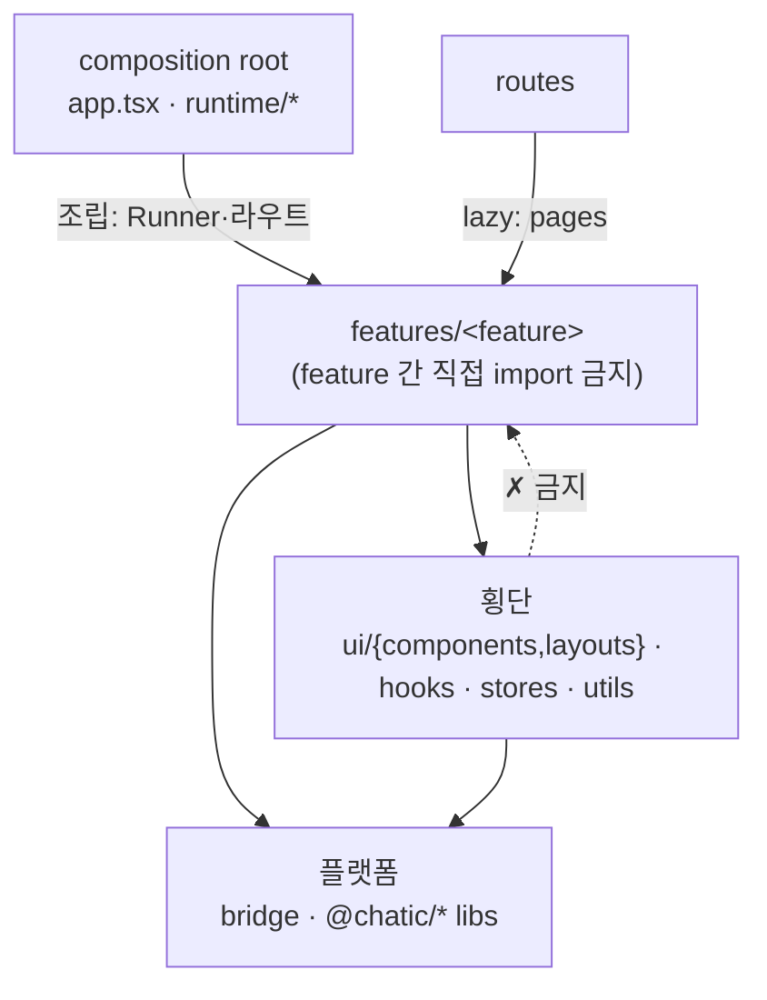

# 디렉터리·프로젝트 구조

> 상태: Live · 최종 갱신: 2026-08-06 · 관련 ADR: [0046](../../../../docs/adr/0046-web-feature-ownership-and-barrel-hygiene.md)
>
> 대상: `apps/web/src` · 참조 구현: `apps/testbed`
>
> 이 문서는 **"이 파일을 어디에 둘 것인가"의 단일 기준**이다.

---

## 1. 전체 레이아웃

모든 애플리케이션 코드는 `src/app/` 하위에 둔다(Nx 관례). `src/`에는 엔트리·정적 자원만 둔다.

```
src/
  main.tsx · i18n/ · assets/ · styles.css · types/    # 엔트리 / 정적 (앱 코드 아님)
  app/
    app.tsx          # composition root — provider 조립만
    # ── 플랫폼 / 런타임 레이어 ──
    runtime/         # 세션 수명 + 소켓 연결: AppRuntime, AppReadyGate, useSocketDelegate, PreferenceLoader
    bridge/          # 네이티브 메시지 단일 접점 (→ bridge.md)
    # ── 라우팅 ──
    routes/          # 라우트 트리 · 가드 · 경로 상수(paths) · 공개/비공개 분기 (→ routing.md)
    # ── 도메인 ──
    features/<feature>/   # 도메인 슬라이스 (아래 §3)
    # ── 횡단 자원 (2개 이상 feature가 공유) ──
    ui/              # 도메인 엔티티를 모르는 횡단 UI
      components/    #   횡단 합성 UI (BottomNavigation, Sidebar, 공용 폼·다이얼로그 등)
      layouts/       #   앱 레이아웃 (Unified/Main/Private/Public/SafeArea 등)
      hooks/         #   UI 메커닉 전용 훅 (useAutoScrollOnFocus, useChromeInsets …) — 데이터 접근 없음
    hooks/           # 횡단 훅 (평면) — 도메인 훅은 금지(→ feature)
    stores/          # 전역 zustand (앱 환경설정 등 → stores.md)
    utils/           # 순수 util / consts (계측 webVitals 포함)
```

> **계측용 `monitoring/`은 없다.** Web Vitals 리포터와 그 인메모리 스토어는 `utils/webVitals.ts`·`utils/webVitalsStore.ts`에 있다 — 디버그 오버레이가 스토어를 읽으므로, 스토어가 `features/debug` 안에 있으면 횡단→feature 역참조가 된다(§2).
>
> **`hooks/`는 평면이다.** `native/` 같은 카테고리 폴더는 실제로 만들어지지 않았다 — 아래 "수가 늘 때 묶는다" 규칙대로, 필요해질 때 묶는다.

> **`shared/` 래퍼는 두지 않는다.** 횡단 자원은 `app/` 최상위 형제 디렉터리로 평면 전개한다 — `shared`가 도메인 코드까지 빨아들이는 junk-drawer가 되는 것을 막기 위함이다.

**횡단 디렉터리 규칙**

- `ui/` = **도메인 엔티티를 모르는 횡단 UI** (components·layouts·아이콘·테마). primitive는 `@chatic/ui-kit` lib에 있고, `ui/`는 앱 전용 합성물만.
    - **허용**: i18n(`useTranslation`), 앱 수준 관심사 — 세션/로그아웃, 서비스 상태, 환경설정. 자체 UI 상태(열림/닫힘, 입력값).
    - **금지**: 특정 도메인 엔티티 지식 — `place`·`channel`·`chat`·`profile`의 repository 호출이나 그 타입에 대한 의존. 이런 컴포넌트는 §4-5로 분해한다.
    - 이 경계가 `ui/`가 새 junk-drawer가 되는 것을 막는 가드다. 예전 기준("presentational만, 훅·상태 금지")은 실제 코드보다 엄격해 지켜지지 않았고(`Sidebar`의 `useSessionLogout`, `ReportIssueDialog`의 `reportIssue` 등), 지킬 수 없는 규칙은 도메인 컴포넌트를 엉뚱한 feature에 방치하는 회피를 낳았다.
- `hooks/` = **횡단 훅**. 도메인 훅은 여기 두지 않는다(→ `features/<feature>/hooks`). 지금은 평면(20여 개)이고, **수가 늘 때 관심사별 서브폴더로 묶는다** — 처음부터 빈 카테고리 폴더를 만들지 않는다(YAGNI).
    - `ui/hooks`와 구분: `ui/hooks`는 **UI 메커닉만**(포커스 스크롤, 인셋, 키보드 흐름) — 데이터에 닿지 않는다. 데이터·세션·브릿지에 닿으면 `app/hooks`다.
- `utils/` = **앱 전용** 순수 util/consts만. 앱에 의존하지 않는 범용 순수함수는 `@chatic/shared` lib **승격 후보**(다른 앱/lib이 같은 걸 필요로 할 때 승격).

---

## 2. 레이어와 의존 방향



- 실선이 허용 방향, 점선이 금지다. 횡단이 feature를 참조하면 위반이며, 예외는 composition root뿐이다.

- **의존은 단방향**: `features` → `횡단`/`플랫폼`. 역방향 금지.
- **feature 간 직접 import 금지**: 두 feature가 공유해야 하면 횡단으로 올린다(승격). feature A가 feature B를 import하지 않는다. 공유물이 도메인 로직을 갖고 있어 그대로 올릴 수 없으면 **쪼개서** 올린다(§4-5).
- **역방향 예외는 composition root뿐**: `app.tsx`와 `runtime/*`은 feature의 Runner·라우트를 **조립**하므로 feature를 알아도 된다. 그 밖의 횡단(`ui` · `hooks` · `utils` · `stores`)이 `features/`를 import하면 위반이다.
- `routes`는 feature의 pages를 라우트에 연결한다(`routes → features` 허용 — 라우팅은 합성 지점).

---

## 3. feature 내부 표준

```
features/<feature>/
  pages/        # 라우트 진입 화면
  components/   # 이 feature 전용 UI
  hooks/        # 이 feature 전용 로직 훅 (web-core 호출을 감싸는 곳)
  types/        # 도메인 타입 / 상태 (엔티티) — 이 feature 전용 타입 전부
  consts/       # 이 feature 전용 상수 (환경 분기·매직값·허용 목록 등)
  index.ts      # 공개 API barrel — 외부는 여기로만 import
```

- **`api/` 디렉터리는 없다.** 서버 호출은 `@chatic/web-core`/`@chatic/data`가 담당한다. feature는 `hooks/`에서 web-core/repository 훅을 감싸고, `types/`에는 도메인 타입·상태만 둔다.
- **엔티티 = `types/`**. 별도 `entities/`·`model/` 레이어를 만들지 않는다. 한 feature 전용이면 `types/`, 2개 이상이 공유하면 횡단으로 승격한다.
- **훅은 `hooks/`로, 타입은 `types/`로, 상수는 `consts/`로 모은다.** 페이지·컴포넌트에 도메인 타입/공용 상수를 인라인으로 흩지 않는다.
- **공개 경계 = `index.ts` barrel (feature만 강제)**. feature 외부는 barrel로만 import하고 내부 파일을 직접 경로로 꺼내지 않는다. 횡단·runtime/bridge 등은 barrel 자유.

### barrel 위생 — 무거운 모듈을 재수출하지 않는다

barrel은 **그 barrel을 쓰는 모든 소비자가 함께 짊어지는 의존 묶음**이다. 하나가 무거우면(레이아웃 전체, 런타임 표면, `import.meta`를 쓰는 모듈) 가벼운 컴포넌트 하나를 꺼내려는 테스트까지 그걸 로드하다 깨진다.

- barrel에서 재수출하지 않는 것: 앱 레이아웃 전체(`PrivateLayout` 등 정적 자원에 닿는 것), `@chatic/app-runtime`/`@chatic/web-core` 표면을 통째로 끌고 오는 모듈.
- **직접 경로에 "왜 barrel을 피했는지" 주석을 달아야 한다면, 그건 아직 원인이 남아 있다는 신호다.** 원인을 없애고 barrel을 쓴다 — 주석은 해법이 아니라 부채 표시다.
- 테스트 환경 결함이 원인일 때는 **소스가 아니라 설정을 고친다**(§6).

### feature 공개 API + 라우트 소유

- **모든 feature는 `index.ts`(barrel)를 가진다.** 외부(특히 `routes/`)는 이 barrel로만 접근한다.
- **feature가 자기 라우트를 소유한다.** feature는 라우트 정의(`<Feature>Routes`)를 `index.ts`로 노출하고, `routes/`은 이를 **lazy import로 합성**만 한다.
    ```tsx
    // routes/private/PrivateRoutes.tsx
    const ChannelRoutes = lazy(() => import('../../features/channels').then(m => ({ default: m.ChannelRoutes })));
    ```
- **barrel 노출 범위는 최소로**: 보통 `<Feature>Routes`만, 드물게 다른 routing이 정말 필요로 하는 공개 컴포넌트 한둘.

### data / sync 모듈은 feature hooks에서 wrapping (중앙 버킷 금지)

`@chatic/data`(`observeList`/`refreshList`/`sendChat`…)와 `@chatic/app-runtime`(sync: `getSyncManager`/`useChatSync`…)의 기능은 **각 feature의 `hooks/`에서 그 화면이 필요한 만큼만 조합해 쓴다.** 최상위 `app/hooks`에 `useChannels`/`useChats`/`usePlaces` 같은 카테고리별 중앙 훅을 두지 않는다.

이유: **`@chatic/data`·`@chatic/app-runtime` 자체가 이미 카테고리별 중앙 레이어다.** 그 위에 앱-레벨 중앙 훅 레이어를 또 두면 같은 레이어를 두 번 만드는 중복 인디렉션이고, 그 중간 버킷이 곧 junk-drawer가 된다. colocation(feature 옆에 데이터 훅)이 표준이다.

```
✅  features/channels/hooks/useChannelRoom  →  repos.chat.observeList + useChatSync
❌  app/hooks/useChats                       →  features 전부가 의존하는 중앙 버킷
```

예외: 2개 이상 feature가 **동일한** 데이터 훅을 쓸 때만 횡단(`app/hooks`)이나 공유 `types`로 승격한다(§4-4 "두 번째 소비자" 트리거).

### feature 내부: 화면별 colocation (fractal)

feature가 여러 화면을 가지면, **§4 결정 트리를 한 단계 아래에 그대로 재귀 적용**한다 — "한 화면 전용이면 그 화면 옆에(colocate), 2개+ 화면이 공유하면 feature 루트로".

```
features/channels/
  pages/
    ChannelRoomPage/           # 채팅방 (라우트 화면)
      ChannelRoomPage.tsx
      MessageList.tsx          # 이 화면 전용 → colocate
      Composer.tsx
    ChannelSettingsPage/       # 채팅방 설정 (라우트 화면)
      ChannelSettingsPage.tsx
      InviteDialog.tsx         # 초대 — 설정에서만 열면 여기
  components/                  # 2개+ 화면이 공유하는 UI
  hooks/                       # 2개+ 화면이 공유하는 훅
  types/ · consts/ · index.ts
```

배치 규칙(한 단계 아래):

1. 라우트 진입 화면 → `pages/<Screen>/`
2. 그 화면 1개 전용 컴포넌트/훅 → 그 화면 폴더에 colocate
3. feature 안 2개+ 화면이 공유 → feature 루트 `components/`·`hooks/`
4. 다른 feature도 사용 → app 최상위 횡단으로 승격(§4-4)

**깊이는 필요할 때 자라게 둔다(YAGNI).** 화면이 단순하면 `pages/Foo.tsx` 단일 파일로 시작 → 전용 부품이 생길 때 폴더로 승격. 빈 `components/`·`types/`·`consts/`를 미리 파지 않는다.

### 폴더 네이밍

- **컴포넌트 1개를 감싸는 폴더(page-as-folder)**: 그 컴포넌트와 동일한 **PascalCase** (`ChannelRoomPage/ChannelRoomPage.tsx`).
- **도메인/레이어/표준 폴더**: **lowercase** (`channels/`, `pages/`, `components/`, `hooks/`, `types/`, `consts/`).
- 대소문자는 일관되게 유지(리눅스 CI는 대소문자 구분; `git config core.ignorecase false` 권장).

---

## 3-1. 이 규칙이 실제로 적용되는 모습 (시나리오)

**A. 플레이스 프로필 폼을 네 화면이 쓴다.** 방 설정(channels)·초대 수락(invite)·초대 발송
(invite)·플레이스 프로필 화면(place)이 같은 폼을 띄우고, 플레이스 생성 플로우(home)도 마지막
스텝에서 쓴다. 폼 몸체는 `ui/components`에 있고 도메인 엔티티를 모른다 — 카피와 초기값, `onSubmit`을
받는다. 저장은 `app/hooks`의 훅이 `profile.setMyProfile`을 감싼다. 각 화면은 자기 카피와 "언제 열리는지"만
알고 그 둘을 조립한다. 어느 feature도 다른 feature를 import하지 않는다.

**B. 앱 셸이 안읽음 총계와 포그라운드 푸시 배너를 갖는다.** `ui/layouts/UnifiedLayout`은 모든
라우트에 마운트되며 배지 숫자와 인앱 푸시 배너가 필요하다. 집계 훅(`useActiveCloudChannels`·
`useMyJoins`·`useChannelUnreads`)과 배너 훅(`useInAppPushMessage`)이 모두 `app/hooks`에 있으므로
셸은 횡단만 참조한다 — feature를 향하지 않는다. 배너 훅은 라우터 트리 안에서만 동작하므로
(`usePushNavigate`) `runtime/AppRuntime`의 Runner로 뺄 수 없고, 그래서 훅 자체가 횡단으로 올라간
것이다. 도메인 엔티티를 하나도 모르는 셸 배관이라 올릴 수 있었다.

**C. 홈 전용 다이얼로그는 홈에 남는다.** `CreatePlaceDialog`·`CreateChannelDialog`·
`CloudSessionSheet`·`SubscriptionRequiredDialog`는 홈에서만 열린다. 두 번째 소비자가 없으므로
승격하지 않는다(§4-4) — "공용처럼 보이는 것"이 아니라 **실제 소비자 수**가 기준이다.

**D. 테스트가 깨져 직접 경로를 쓰고 싶어질 때.** barrel을 우회하기 전에 §6을 본다. 원인이 경로
별칭 불일치나 `import.meta`라면 설정을 고치거나 barrel을 슬림하게 만든다 — 우회 주석을 남기는 것은
부채를 기록하는 것일 뿐 해결이 아니다.

---

## 4. 배치 결정 트리

새 파일/심볼을 둘 곳을 정할 때:

1. **앱 시작·플랫폼 연결인가?** (부트스트랩, 소켓/세션, 네이티브 브릿지, 계측, 라우팅) → `runtime` / `bridge` / `routes` (계측은 `utils/webVitals`)
2. **한 도메인에서만 쓰는가?** → `features/<feature>/`의 해당 하위(`pages`/`components`/`hooks`/`types`/`consts`)
3. **2개 이상 feature가 공유하는가?** → 횡단(`ui/{components,layouts}` · `hooks` · `stores` · `utils`)
4. **애매하면** feature 안에 두고, **두 번째 소비자가 생길 때** 횡단(또는 `types`)으로 승격한다.
5. **공유해야 하는데 도메인 로직이 섞여 있는가?** → 그대로 올릴 수 없으니 **쪼개서** 올린다 (아래).

> 도메인 훅(`useChannelRoom`, `usePlaceList` …)은 **2번**이다 — `features/<feature>/hooks`. `app/hooks`(횡단)에 두지 않는다. 단 §3의 "두 번째 소비자" 예외에 걸리면(2개 이상 feature가 **동일한** 훅을 쓰면) `app/hooks`로 승격한다.

### 4-5. 도메인 로직이 섞인 공유 컴포넌트는 쪼개서 올린다

`ui/`는 도메인 엔티티를 모르고(§1), feature 간 직접 import는 금지(§2)이며, `shared/`도 두지 않는다. 세 규칙이 함께 막고 있으므로 **컴포넌트를 통째로 옮길 자리는 없다.** 대신 조각마다 자리가 있다:

| 조각                  | 성격                                                 | 자리                              |
| --------------------- | ---------------------------------------------------- | --------------------------------- |
| 폼·다이얼로그 몸체    | 카피·초기값·`onSubmit`을 props로 받는 presentational | `ui/components`                   |
| repository 호출       | `setMyProfile` 같은 도메인 쓰기                      | `app/hooks` (2개+ feature가 쓰면) |
| 화면별 카피·열림 조건 | 그 화면의 사정                                       | 해당 `features/<feature>/`        |

판별법: **그 컴포넌트에서 `@chatic/data`·`useRuntimeRepositories`·도메인 타입 import를 지웠을 때 남는 것**이 presentational 조각이다. 남는 게 거의 전부라면 이미 분해된 상태이고 자리만 잘못된 것이다.

```
✅  ui/components/PlaceProfileForm      → 카피 14개 props + onSubmit 주입 (도메인 import 0)
    app/hooks/useSetMyPlaceProfile      → profile.setMyProfile 래핑
    features/*/…                        → 위 둘을 조립 + 자기 카피·열림 조건
❌  features/home/components/PlaceProfileCreateDialog  → 4개 feature가 home을 import
```

같은 분해를 이메일 인증에도 적용했다. `EmailVerifyDialog`는 `useVerifyEmail`(web-core) 호출만
빼면 전부 presentational이었다:

```
✅  ui/components/EmailVerifyDialog     → verifyEmail(request) 콜백 주입 (web-core import 0)
    app/hooks/useVerifyEmailCode        → useVerifyEmail 래핑 (send/resend/check)
    app/utils/verification              → 코드 길이·타이머·isValidEmail·formatCountdown
    ui/components/VerificationCodeInput → 6칸 코드 입력 (account·home 공용이었다)
❌  features/home/components/EmailVerifyDialog  → subscription이 home을 import
```

여기서 딸려 나온 상수·유틸(`VERIFICATION_CODE_LENGTH`·`formatCountdown` …)은 원래
`features/account`에 있었고 auth·home이 그걸 가로질러 import하고 있었다. **컴포넌트를 올릴 때는
그것이 딛고 선 상수·유틸도 함께 봐야 한다** — 몸체만 올리면 횡단→feature 역참조로 형태만 바뀐다.

---

## 5. 자가 점검

구조가 제 역할을 하는지 확인: 아래를 §4 결정 트리로 즉답할 수 있어야 한다.

- 새 도메인 훅 `useFooList` → `features/foo/hooks` (2번)
- 두 화면이 쓰는 확인 다이얼로그 → `app/ui/components` (3번)
- 전역 환경설정 store → `app/stores` (3번)
- 세 feature가 쓰는데 `setMyProfile`을 호출하는 폼 → 쪼갠다 (5번): 몸체 `ui/components` + 저장 훅 `app/hooks`

### 위반 탐지

구조 규칙은 grep으로 확인할 수 있어야 한다. `apps/web`에서 실행한다.

```bash
# ① 횡단 → feature 역참조 (composition root인 app.tsx·runtime/ 은 대상 밖)
#    → 비어 있어야 한다. 지금 비어 있다.
grep -rn "from '.*features/" src/app/ui src/app/hooks src/app/utils src/app/stores --include='*.ts*'

# ② feature 간 직접 import
#    → 목표는 0. 현재 30건(아래 "남은 부채").
grep -rnE "from '(\.\./)+(account|appUpdate|auth|channels|debug|home|invite|issue-report|mypage|onboarding|place|search|subscription)(/|')" \
    src/app/features --include='*.ts*' | grep -v "\.test\."

# ③ barrel 우회 주석 — 원인이 아직 있다는 표시
#    → 현재 12건. 전부 §6의 `import.meta` 또는 의도적 번들 분리가 사유다.
grep -rn "not the .*barrel\|Direct path\|Concrete module" src/app --include='*.ts*'
```

②의 패턴은 **feature 이름을 명시**한다. 예전의 `from '\.\./\.\./[a-z]`는 `features/debug/overlay/tabs`
→ `../../components` 같은 **feature 내부** 상대 경로까지 잡아 위반 아닌 것을 절반 넘게 섞었다 —
탐지기가 노이즈를 내면 아무도 보지 않으므로, 이름을 박아 정확도를 택했다.

### 남은 부채 (2026-08-06 기준)

- **② 30건.** 대부분 한 방향으로 몰려 있다: `channels/components/ConfirmDialog`(4곳), `auth/components/PhoneVerifySheet`(3곳), `invite/…/useInviteListRows`·`InviteChannelRow`(각 2곳), `channels/hooks`(3곳). 즉 **두 번째 소비자가 이미 생긴 공용물이 feature에 남아 있는 것**이고, §4-3/§4-5대로 하나씩 올리면 사라진다. 이번 트랙은 프로필·인증 폼 계열만 처리했다.
- **③ 12건.** `import.meta`가 libs 4곳에 있는 한 `ui/layouts`·`ui/components`·`hooks`·`bridge` barrel은 테스트에서 로드되지 않는다(§6에서 실측). 근본 해결은 `apps/web` 밖이다.
- **내부 path alias(`@/…`) 없음.** `../../../` 상대 경로는 그대로다 — ADR-0046에서 범위 밖으로 뒀다.

---

## 6. 테스트 환경과 구조의 관계

`jest`가 특정 모듈을 처리하지 못하면 그 압력이 **소스 구조를 왜곡**한다 — barrel을 우회하는 직접 경로가 늘고, 같은 대상을 두 방식으로 import하게 된다. 그래서 이 문서는 테스트 설정도 구조 규칙의 일부로 본다.

- **경로 별칭은 tsconfig와 jest가 같은 답을 내야 한다.** `jest.config.js`의 `'^@chatic/(.*)$' → libs/$1/src/index.ts`는 greedy 패턴이므로, `libs/` 밖에 사는 별칭(`@chatic/assets` → 리포 루트 `assets/`)은 **그 앞에 개별 매핑을 둔다.** 빠뜨리면 존재하지 않는 `libs/assets/`로 해석돼 그 모듈에 닿는 모든 barrel이 테스트에서 깨진다. → `'^@chatic/assets$'`를 `__mocks__/assetsMock.js`로 보내는 매핑이 들어가 있다(그 모듈은 `import.meta.url`로 URL을 만들기도 해서, 매핑만으로는 부족하고 스텁이어야 한다).
- **`import.meta`는 `tsconfig.spec.json`의 `module: "commonjs"`에서 컴파일되지 않는다.** `libs/app-runtime` · `libs/shared` · `libs/socket` · `libs/web-core` 네 곳이 `import.meta.env`(vite 표준)를 쓰므로, 그 라이브러리에 닿는 barrel은 테스트에서 로드되지 않는다.
    - **이건 barrel 슬림화로 해결되지 않는다.** barrel에서 무거운 것을 빼도 `@chatic/shared`·`@chatic/web-core`를 쓰는 컴포넌트가 하나라도 남으면 같은 일이 반복되고, 계속 빼면 barrel에 남는 게 없다.
    - **어느 barrel이 로드되는지는 추측하지 말고 재보라.** 임시 테스트에서 `require()`해 보면 바로 나온다. 2026-08-06 실측:

        | barrel              | jest 로드 | 막는 것                                         |
        | ------------------- | --------- | ----------------------------------------------- |
        | `app/utils`         | ✅        | — (`buildEnv`·`phoneNumber`를 일부러 뺐다)      |
        | `app/hooks`         | ❌        | `WEB_ENV = … import.meta.env.VITE_ENV`          |
        | `app/bridge`        | ❌        | 같음                                            |
        | `app/ui/components` | ❌        | `IS_PROD = import.meta.env.VITE_ENV === 'PROD'` |
        | `app/ui/layouts`    | ❌        | 같음                                            |

    - **그래서 이 네 barrel을 우회하는 직접 경로는 정당한 우회로 남는다.** 주석에는 **무엇에 닿아서** 피했는지 적는다 — 사유가 바뀌면(예: `@chatic/assets`는 위 매핑으로 해소됐다) 주석도 같이 고친다. 낡은 사유가 붙은 우회는 "이미 고쳐진 문제"를 영원히 회피하게 만든다. 근본 해결(트랜스폼 단계에서 `import.meta` 치환)은 `apps/web` 밖의 판단이 필요해 이 문서의 범위가 아니다.

- 새 barrel을 만들 때 **테스트에서 한 번 import해 보고** 무거운 것이 딸려오지 않는지 확인한다.

---

## 7. 적용 이력

ADR-0046이 정한 규칙을 코드에 반영한 트랙(2026-08-06, PR #414). 무엇을 옮겼는지가 아니라 **왜 그 자리인지**는 위 본문에 녹여 두었고, 여기에는 결과만 남긴다.

1. **테스트 설정 결함 제거** — `@chatic/assets` 매핑 + 스텁(§6). barrel 우회 사유 하나가 사라졌다.
2. **플레이스 프로필 폼 분해** — `PlaceProfileForm`·`PlaceProfileFormDialog`·`PlaceProfileCreateDialog` → `ui/components`, `useSetMyPlaceProfile` → `app/hooks`, `PlaceProfileEditDialog` → `features/channels`(유일 소비자).
3. **이메일 인증 분해** — `EmailVerifyDialog`·`VerificationCodeInput` → `ui/components`, `useVerifyEmailCode` → `app/hooks`, 코드·타이머 상수와 `isValidEmail`·`formatCountdown` → `app/utils/verification`(§4-5).
4. **훅·유틸 승격** — `useActiveCloudChannels`·`useChannelUnreads`·`useMyJoins`·`useHomeChannels`·`useLastChat`·`useCachedCloudNames`·`useInvitedClouds` → `app/hooks`; `countUnread`·`readCursorOf`·`sortChannels`·`resolvePlaceDisplayName` → `app/utils`.
5. **앱 셸 배관 승격** — `features/notifications`를 해체해 `useInAppPushMessage` → `app/hooks`, `InAppNotificationCard` → `ui/components`, `resolveInAppPushRoute` → `app/utils`. 라우트도 도메인 엔티티도 없는 셸 배관이었고, 유일한 소비자가 `UnifiedLayout`이었다. `webVitalsStore`도 `features/debug` → `app/utils`. 이 둘로 위반 ①이 0이 됐다.

범위에서 뺀 것: barrel 슬림화(§6 — `import.meta`가 뿌리라 슬림화로 안 풀린다), 내부 path alias(ADR-0046), 그리고 위 "남은 부채"의 ② 30건.
