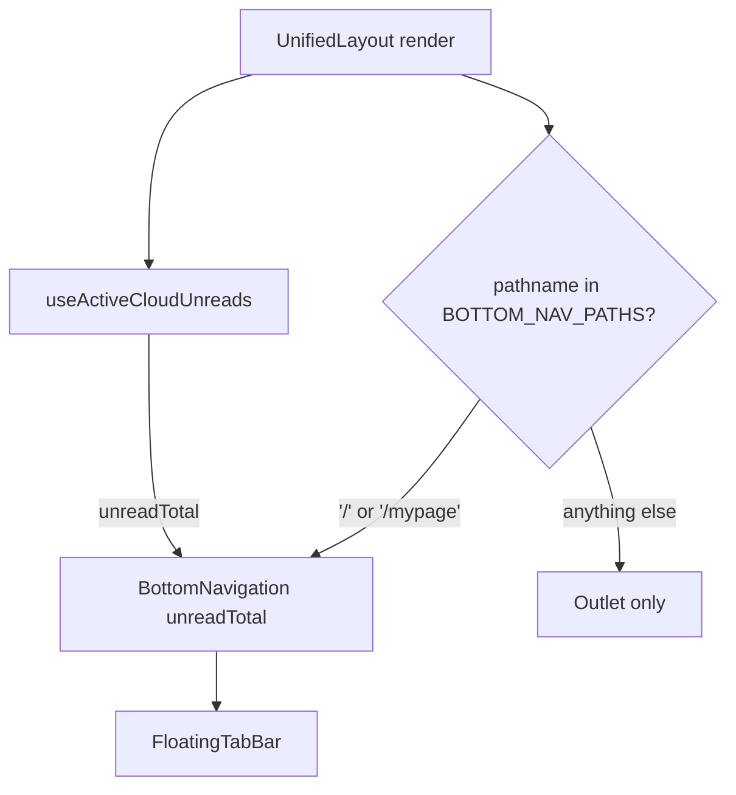

# layout shell — the floating bottom nav and the app-width cap

> Scope: `apps/web/src/app/ui/layouts/UnifiedLayout.tsx`,
> `apps/web/src/app/ui/components/{BottomNavigation,BottomNavSpacer}.tsx`,
> `libs/web-ui-kit` `composites/navigation/FloatingTabBar.tsx`, `apps/web/src/styles.css`
> (`--app-width`).

`UnifiedLayout` wraps every route and renders the floating bottom navigation exactly once,
showing or hiding it and picking the active tab from the current path. Pages never render their
own nav.

## Ownership split

| Layer                              | Owns                                                                           |
| ---------------------------------- | ------------------------------------------------------------------------------ |
| `UnifiedLayout` (apps/web)         | whether the nav shows, the unread total it is fed                              |
| `BottomNavigation` (apps/web)      | the 2-tab route set, active-tab matching, navigation on select                 |
| `FloatingTabBar` (libs/web-ui-kit) | stateless rendering — pill, icons, badge, floating position, safe-area padding |

`FloatingTabBar` knows nothing about `react-router` or the app's routes: everything it draws comes
in as props (`items`, `onSelect`). `BottomNavigation` is the adapter that connects those props to
`ROUTES.home` / `ROUTES.mypage.root` and `useLocation()`.

```ts
// libs/web-ui-kit — no react-router import
export interface FloatingTabBarItem {
    key: string;
    label: string;
    icon: React.ReactNode;
    activeIcon?: React.ReactNode;
    badge?: number; // > 0 shows it; above badgeMax (default 999) clamps to "+999"
    badgeLabel?: string; // folded into the button's aria-label, not a sibling span
    active?: boolean;
}
```

## Where the nav shows



`BOTTOM_NAV_PATHS` (`UnifiedLayout.tsx`) is an exact-match whitelist of `[ROUTES.home,
ROUTES.mypage.root]` — a detail page, an edit screen, or a chat room hides the nav by not being on
the list, not by an exclusion rule. Adding a third tab destination means adding it here.

A second, unrelated whitelist — `MAIN_VARIANT_PATHS` (currently just `/`) — picks the container's
scroll model (`min-h-dvh`, page scroll vs. a fixed `h-dvh` detail shell). The two lists answer
different questions and can diverge: `/mypage` shows the nav but is not the main scroll variant.

## Unread badge: one shared observation, three readers

The chat-tab badge count comes from `useActiveCloudUnreads()`, which reads a single observation
computed once by `ActiveCloudDataProvider` and shared by three consumers: the native app-icon badge
(`UnreadBadgeRunner`, cross-cloud), `UnifiedLayout`'s bottom-nav badge (active-cloud total), and
`HomePage`'s per-place and per-channel counts. Before this, each of the three assembled the same
number from its own channel + per-channel-join observers — every join write recomputed it three
times over. `UnifiedLayout` only _reads_ the shared total; it does not own the aggregation.

## Trailing clearance, not page padding

The two screens the nav sits over (`HomePage`, `MyPage`) end their scroll content with a
`<BottomNavSpacer />` rather than a bare padding class. The nav's own geometry is baked into it:
62px pill + 18px offset = 80px above `--safe-bottom`, plus 224px of scroll clearance, split into a
fixed height and a separate `pb-safe-bottom` div deliberately kept out of one `calc()`. The native
shell sets `--safe-bottom` with `style.setProperty` at runtime, which accepts any string — a missing
inset produces something like `undefinedpx`, and a single invalid `calc()` collapses to `0`, which
used to erase the fixed 224px along with the inset. Splitting the two means a bad inset only costs
the inset.

## The app-width contract (`--app-width`)

`apps/web` is drawn for a phone-sized WebView; the same bundle is also reachable from a desktop
browser through an invite or share link. One rule covers both: every surface fills the device up to
`--app-width` (430px, `apps/web/src/styles.css`) and centers past it.

| Surface                                    | How it gets the cap                                                                    |
| ------------------------------------------ | -------------------------------------------------------------------------------------- |
| A route screen in normal flow              | the shell's own `w-full max-w-app mx-auto` — the page declares nothing                 |
| A route screen taken out of flow (`fixed`) | `fixedViewportScreen` (`KeyboardAwareLayout.tsx`) = `fixed inset-0 mx-auto max-w-app`  |
| A bottom sheet                             | `libs/ui-kit`'s `sheet` (`side="bottom"`) — `mx-auto max-w-[var(--app-width,100%)]`    |
| A fullscreen / slide-up dialog             | `libs/ui-kit`'s `dialog` `fullscreen`/`slide-up` variants — the same cap               |
| An ordinary dialog                         | `dialog` / `alert-dialog` default variant — `max-w-[min(32rem,var(--app-width,100%))]` |
| A global floating bar                      | `FloatingTabBar` (web-ui-kit) reads the same variable directly                         |

The number lives in exactly one place — `apps/web/src/styles.css` — because everything above it is
either laid out in-flow under the shell (which owns the cap once) or `fixed` and portalled to
`document.body` (which escapes the shell and has to re-declare the cap for itself). The libraries
that re-declare it (`libs/ui-kit`, `libs/web-ui-kit`) are shared with `apps/desktop-web`, so they read
the variable rather than a literal number and fall back to `100%` — a host that never sets
`--app-width` is unaffected.

```bash
grep -rn "var(--app-width" libs/ui-kit/src libs/web-ui-kit/src --include='*.tsx' | grep -v test
```

A caller that adds `max-w-full`, `max-w-none`, or `m-0` on top of one of these primitives strips the
cap — `tailwind-merge` resolves the conflicting class in the caller's favor. That is what produced
the original inconsistency this contract replaced (a mobile-width shell next to a full-desktop-width
sheet), and it is the mistake to watch for in a new one.

## Verification

- `libs/web-ui-kit`: `FloatingTabBar.test.tsx` (active/inactive render, `+999` badge clamp,
  `onSelect`), `FloatingTabBar.stories.tsx`.
- `apps/web`: navigate `/` ↔ `/mypage` and confirm the nav persists with the active tab switching;
  navigate into `/mypage/account` or a channel room and confirm it hides.
- Resize to a desktop width and open a bottom sheet, a fullscreen dialog, and a `fixed` route side
  by side — all three should share the shell's column, and `document.documentElement.scrollWidth`
  should not exceed the viewport.

## Further reading

- [architecture README](./README.md) — the three rings, and why `shared` (which includes
  `ui/layouts/`) never imports a feature.
