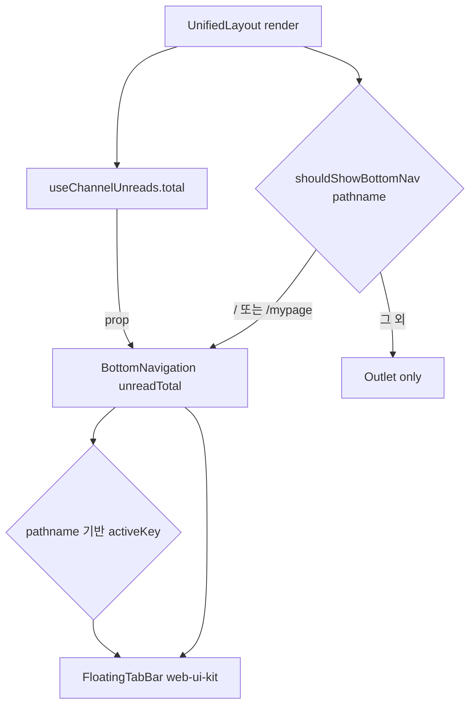
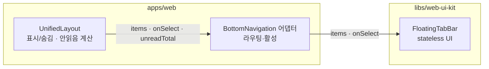

# 레이아웃 셸 · 플로팅 하단 네비게이션

> 상태: Live · 최종 갱신: 2026-07-15 · 관련 ADR: [ADR-0011](../../../../docs/adr/0011-web-layout-shell-and-floating-bottom-nav.md)
>
> 대상: `apps/web/src/app/ui/layouts/UnifiedLayout.tsx`, `apps/web/src/app/ui/components/BottomNavigation.tsx`, `libs/web-ui-kit` `composites/navigation`

## 목적

앱의 모든 라우트를 감싸는 단일 셸(`UnifiedLayout`)이 **플로팅 하단 네비게이션을 단 한 번만** 렌더링하고, 현재 라우트에 따라 표시/숨김과 활성 탭을 제어한다. 네비 UI 자체는 재사용 가능한 디자인 시스템 컴포넌트(`libs/web-ui-kit`)로 두고, 라우팅·활성 판정·안읽음 카운트 같은 앱 로직은 `apps/web` 얇은 어댑터가 소유한다.

이전에는 하단 네비가 `HomePage`·`MyPage`에서 **각각 개별 렌더링**되어, 탭 화면이 늘 때마다 중복·누락·겹침 여백(`pb-32`)을 페이지마다 반복해야 했다.

## 설계 원칙

- **네비는 셸이 소유한다.** 페이지는 하단 네비를 렌더링하지 않는다. 표시 규칙·활성 판정은 셸 한 곳에만 존재한다.
- **UI와 라우팅을 분리한다.** `libs/web-ui-kit`의 네비 컴포넌트는 stateless·slot 기반이며 `react-router`를 모른다. 경로·활성·배지·핸들러는 전부 props로 주입한다.
- **플로팅은 오버레이다.** 네비는 `fixed`로 스크롤과 무관하게 떠 있고, 컨테이너는 터치를 통과(`pointer-events` 격리)시켜 바 밖 영역의 콘텐츠 조작을 막지 않는다.
- **safe-area는 네비가 책임진다.** 하단 인셋은 네이티브 주입 CSS 변수 `--safe-bottom` 기반으로 네비 컴포넌트가 처리한다. 네비가 노출되는 페이지는 그 높이만큼 하단 여백을 확보한다.
- **표시 대상은 화이트리스트다.** "메인 탭 목적지"에서만 노출. 새 탭을 늘릴 때만 화이트리스트를 건드린다.

## 범위

**포함**

- `UnifiedLayout`이 하단 네비를 1회 렌더 + 라우트 기반 표시/숨김.
- `libs/web-ui-kit`에 `FloatingTabBar` 컴포넌트 신규 정의(전체폭 플로팅 영역 + 중앙 글래스 알약 + 탭 + 배지 슬롯).
- `apps/web`의 `BottomNavigation`을 어댑터로 재작성(2탭: Chat/My, 활성 판정, 채팅 안읽음 배지).
- 기존 `HomePage`·`MyPage`의 개별 `<BottomNavigation />` 제거 + 하단 겹침 여백 정리.

**제외**

- 탭 개수·종류 확장(현행 2탭 유지).
- 상세/편집/채팅방 등 비-탭 화면의 레이아웃 변경(네비는 그 화면들에서 단지 숨는다).
- 무료 구독 D-N 등 MyPage 콘텐츠 → [feature/mypage](../feature/mypage/README.md).

## 시나리오

1. **홈에서 마이로 이동** — 사용자가 `/`에서 플로팅 바의 "MY"를 탭 → 어댑터가 `navigate('/mypage', { replace: true })` → 셸이 `/mypage`에서 계속 네비를 렌더하고 활성 탭을 "MY"로 바꾼다.
2. **탭 목적지에서만 노출** — `/`·`/mypage`에서는 네비가 보인다. `/channels/:id/room`, `/mypage/account`, `/subscription` 등으로 진입하면 셸이 `shouldShowBottomNav(pathname) === false`로 판단해 네비를 렌더하지 않는다. 뒤로 나오면 다시 나타난다.
3. **안읽음 배지** — 채팅 탭 우상단에 활성 클라우드의 총 안읽음 수가 배지로 뜬다(999 초과 시 `+999`). 0이면 배지를 숨긴다.
4. **긴 콘텐츠 스크롤** — MyPage처럼 본문이 길면 본문 컨테이너가 스크롤되고, 네비는 화면 하단에 고정된 채 떠 있다. 마지막 콘텐츠는 네비 높이 + safe-area만큼의 하단 여백 덕분에 가려지지 않는다.
5. **safe-area 단말** — 노치/홈 인디케이터가 있는 기기에서 네비 바닥이 `--safe-bottom`만큼 밀려 홈 인디케이터와 겹치지 않는다.

## 다이어그램

라우트에 따른 셸의 네비 렌더 결정:



컴포넌트 소유 경계:



## 상세 구현

### `FloatingTabBar` (libs/web-ui-kit `composites/navigation/`)

전체폭 플로팅 영역 + 중앙 글래스 알약 + 탭들 + 배지 슬롯을 그리는 stateless 컴포넌트. Figma node `1937-26572` 기준: 영역 375×98(뒤 gradation), 알약 166×62 라운드 300, 탭 각 48×48.

```ts
export interface FloatingTabBarItem {
    key: string;
    label: string;
    icon: React.ReactNode; // 비활성 아이콘 (slot — web-ui-kit는 아이콘 비종속)
    activeIcon?: React.ReactNode; // 활성 아이콘 (없으면 icon 재사용)
    badge?: number; // >0이면 배지 노출, 999 초과 시 "+999"
    badgeLabel?: string; // 배지 a11y 문구(로케일). 없으면 "{label}, {count}"
    active?: boolean;
}
export interface FloatingTabBarProps {
    items: FloatingTabBarItem[];
    onSelect: (key: string) => void;
    className?: string;
}
```

- 활성 탭: 다크 필(`bg-[#222325]`, 다크모드 `bg-white/15`), 라벨/아이콘 흰색. 비활성: `text-label`(#53555B).
- 배지: 채팅 탭 우상단 인라인 빨강 필(`bg-[#F41F52]`) + 흰 숫자, `badgeMax`(기본 999) 초과 시 `+999` 클램프. 카운트 0이면 미노출. 배지 span은 `aria-hidden`이고, 카운트는 탭 버튼의 접근성 이름(`aria-label`)에 접힌다(`badgeLabel` 없으면 `"{label}, {count}"`) — 버튼 `aria-label`이 자식 텍스트를 가려 스크린리더가 숫자를 못 읽는 문제 회피. 어댑터는 `bottomNav.unread` 로케일 문구를 넘긴다.
- 자기 위치: `fixed inset-x-0 bottom-0 mx-auto max-w-[430px]`로 앱 컬럼에 맞춰 하단 중앙에 뜬다. 하단 여백 `pb-[calc(var(--safe-bottom,0px)+18px)]`을 영역 컨테이너가 소유. 컨테이너 `pointer-events-none`, 알약(`nav`)만 `pointer-events-auto`. 본문 가독성용 상단 페이드 그라디언트 포함.
- 아이콘은 slot으로 받는다 — 라이브러리 `Icon*`로 대체 불가한 Figma 전용(채팅/사람 필드) 아이콘을 호스트가 주입하기 위함. `composites/navigation/index.ts` → `composites/index.ts`에 배럴 추가.

### `BottomNavigation` 어댑터 (apps/web `ui/components/`)

`FloatingTabBar`에 라우팅·활성만 연결하는 프레젠테이션 컴포넌트. 데이터는 전부 주입받는다.

- 자체 마크업/인라인 SVG/글래스 스타일 없이 2탭 구성(`ROUTES.home`, `ROUTES.mypage.root`)과 `pathname` 기반 `active`만 계산. 채팅/사람 아이콘만 인라인 SVG로 slot 주입.
- 채팅 배지 수: **`unreadTotal` prop으로 주입**(계산은 `UnifiedLayout`이 소유 — 아래). 어댑터는 feature 훅을 직접 참조하지 않는다.
- 이동: `useNavigateWithTransition()` + `navigate(key, { replace: true })`.

### `UnifiedLayout` 표시 제어 + 안읽음 소유 (apps/web `ui/layouts/`)

- `<Outlet />` 뒤에 조건부 `<BottomNavigation unreadTotal={…} />`을 형제로 렌더.
- `shouldShowBottomNav(pathname)` 헬퍼: 화이트리스트 `BOTTOM_NAV_PATHS = ['/', '/mypage']` 정확 일치. `MAIN_VARIANT_PATHS`와 별개 개념(메인 변형 vs 네비 노출)이므로 혼용하지 않는다.
- **네비 배지 안읽음 수를 이 레이아웃이 소유**한다: `useChannelUnreads(useActiveCloudChannels()).total`(`features/home/hooks`)를 계산해 어댑터에 prop으로 내린다. 네비 컴포넌트가 feature에 직접 결합하지 않도록 데이터 소유를 네비를 렌더하는 레이아웃으로 끌어올린 것. **네이티브 앱아이콘 배지는 별개 소비자**(`UnreadBadgeRunner`, AppRuntime 전역, 크로스-클라우드 합계 + 포그라운드 리컨사일)라 그대로 둔다.
- 네비가 뜨는 라우트의 페이지는 본문 하단에 네비 높이만큼 여백 확보(홈 `pb-[98px]`, MyPage `pb-32`).

## 검증 방법

- `libs/web-ui-kit`: `FloatingTabBar.test.tsx`(활성/비활성 렌더, 배지 클램프 `+999`, `onSelect` 콜백), `FloatingTabBar.stories.tsx`(기본/활성/배지 variant).
- `apps/web`: 브라우저 프리뷰에서 `/`↔`/mypage` 이동 시 네비 유지 + 활성 탭 전환, `/mypage/account`·`/channels/:id/room` 진입 시 네비 숨김 확인.
- safe-area: 프리뷰에서 `--safe-bottom`을 강제 주입해 하단 여백 확인. 다크모드 토글로 활성/배지 색 확인.
- 안읽음 배지: 채널 안읽음이 있는 상태에서 채팅 탭 배지 노출/`+999` 클램프 확인.

## 주의점

- **표시 화이트리스트 ≠ 메인 변형**: `BOTTOM_NAV_PATHS`(네비 노출: `/`, `/mypage`)와 `MAIN_VARIANT_PATHS`(레이아웃 폭/스크롤 변형)는 별개다. 탭을 추가할 때 두 목록을 함께 본다.
- **안읽음 두 소비자**: 인앱 네비 배지 = `UnifiedLayout`이 계산하는 **활성 클라우드** 합계(`useChannelUnreads`). 네이티브 앱아이콘 배지 = `UnreadBadgeRunner`(전역)의 **크로스-클라우드** 합계. 서로 다른 값·다른 소유자다. 네비 배지에 크로스-클라우드 합계가 필요하면 별도 작업.
- **셸 스크롤 모델**: 네비가 뜨는 라우트(`/`, `/mypage`)는 모두 메인 변형(`min-h-dvh`, 페이지 스크롤)이라 fixed 오버레이로 충분하다. 페이지는 네비 높이만큼 하단 여백을 둔다(홈 `pb-[98px]`, MyPage `pb-32`). 비-메인 라우트에 네비를 노출하려면 스크롤 컨테이너 여백 처리를 재검토한다.
