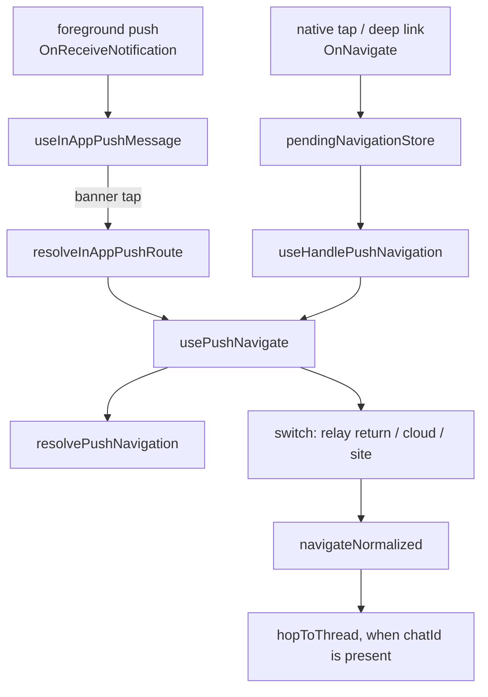

# notifications — where a tapped push lands

A push notification is assembled and drawn by the native shell. The web app's share begins the
moment someone taps it: take the path the shell hands over, put the session in the state that path
needs, and land the reader on the right screen without wrecking the back button.

**There is no `features/notifications/` folder.** This group documents code that lives in four
places, and the entry point is a bridge folder rather than a feature:

```text
apps/web/src/app/
├── bridge/navigation/          6 sources, 4 tests — the whole tap path
│   ├── pendingNavigationStore.ts    holds a pre-mount OnNavigate and replays it
│   ├── resolvePushNavigation.ts     pure: raw path → { target, cid, sid, chatId }
│   ├── resolveThreadTarget.ts       pure: notified chat → thread route, or null
│   ├── usePushNavigate.ts           the primitive both entry points converge on
│   ├── useHandlePushNavigation.ts   native OnNavigate entry point
│   └── index.ts
├── hooks/useInAppPushMessage.tsx    foreground banner + tap → usePushNavigate
├── utils/resolveInAppPushRoute.ts   foreground payload → raw path, plus the field extractors
└── features/home/CloudActivatedRunner.tsx   the one notification that arrives over the socket
```

Device token registration is the other half of the story and has its own document —
[device-token](./device-token.md).

## Responsibilities

This group decides **where a push lands and in which session context**. It decides nothing about how
a push looks in the notification shade, nothing about whether a push is sent, and nothing about
badges.

**Out:**

- Banner assembly and delivery on the device, permission prompts, notification channels, and the
  deep-link plumbing on the native side — [apps/mobile](../../../mobile/README.md).
- Registering this install's token — [device-token](./device-token.md), and the policy behind it in
  [app-runtime push](../../../../libs/app-runtime/docs/push/README.md).
- The cross-cloud unread dot a background push marks — [home](../feature/home/README.md).
- Per-device push mute, which is an account setting — [mypage](../feature/mypage/README.md).

## The shared contract

### One path, four fields

The shell sends `OnNavigate { path, replace? }`. `path` is a web route, and the interesting part is
its query string. `resolvePushNavigation` splits it into four:

| Field    | Source                     | Why it is not part of the route                                                         |
| -------- | -------------------------- | --------------------------------------------------------------------------------------- |
| `target` | pathname + surviving query | What the router is actually given                                                       |
| `cid`    | `?cid=`                    | Session context — which cloud's repository holds this channel                           |
| `sid`    | `?sid=`                    | Session context — which site's token is needed                                          |
| `chatId` | `?chatId=`                 | A routing hint consumed **after** landing, not a route param (see the thread leg below) |

All three are stripped from `target`. They have to be: `navigateNormalized` compares the target
against the live location to avoid re-navigating, and a target still carrying context params would
make two taps on the same room look like two different destinations.

`replace` is logged and then ignored. History normalization supersedes it either way.

Two shapes are accepted beyond the canonical one. `channel?channelId={id}` is normalized to
`/channels/{id}/room` — the context params are read _before_ that branch, because it rebuilds the
target from `channelId` alone and would otherwise drop them. Anything unparseable passes through
untouched rather than being dropped; an empty path goes to the root.

### Two entry points, one primitive



`UnifiedLayout` mounts `useHandlePushNavigation()` and `useInAppPushMessage()`. Both need the router
tree — they rely on `useNavigate`.

**Everything routing-related goes in `usePushNavigate` and nowhere else.** That is the rule the
diagram exists to make visible: a branch added there applies to an OS tap and an in-app banner tap
at once, and a branch added anywhere else applies to one of them and quietly not the other.

### The switch must complete before the navigation

Channel data is read from the _active_ server's repository. Navigate first and the room page looks
for a channel the active repository has never heard of. So every transition is awaited, in this
order, and only then is the route changed:

```
wait for the socket handshake (10s ceiling)
  → recover an evicted invited cloud (native only)
  → logoutCloudSession()   if this is a relay push and a cloud is active
  → switchCloud(cid)       if the push names a different cloud
  → switchSite(sid)        if the push names a different site
  → navigateNormalized(target)
  → hopToThread(chatId)    if the push named a chat
```

A cloud/site switch re-issues tokens against the active server, so attempting one over a half-open
socket races the connection and rolls the selection back. Hence the handshake gate. If it times out,
the switch is skipped and the route is attempted anyway — **every failure path here is best-effort**,
because stranding someone on the screen they were already on is worse than landing them somewhere
that may not load.

`switchCloud` clears the selected site, which is the whole reason site comes second.

Overlapping pushes are dropped rather than queued. A rapid second event arriving while the first is
still awaiting a switch would interleave two switches and double-navigate, so an in-flight ref
processes one at a time.

### The relay sentinel

The backend marks a relay-origin push with the literal `cid` `'#'`. It is not a cloud id, and it is
**not** the session layer's internal `'default'` sentinel — different layer, different meaning. It is
interpreted in `usePushNavigate` and never forwarded to a session API. Getting this wrong means
calling `switchCloud('#')`.

Leaving a cloud for relay does not need a re-login: relay auth underpins the cloud session through
delegation-token exchange, so relay is still valid while a cloud is active and `logoutCloudSession()`
is enough to land back on it.

| Currently in | Push origin (`cid`) | What happens                                       |
| ------------ | ------------------- | -------------------------------------------------- |
| relay        | relay (`'#'`)       | Nothing to switch — navigate                       |
| relay        | cloud `c1`          | `switchCloud('c1')` → navigate                     |
| cloud `c1`   | cloud `c2`          | `switchCloud('c2')` → navigate                     |
| cloud `c1`   | relay (`'#'`)       | `logoutCloudSession()` → navigate, still signed in |
| anywhere     | no `cid`            | Nothing to switch — navigate                       |

The guard that makes row 1 and row 5 safe is structural rather than a special case:
`needsCloudSwitch` is `!!cid && !isRelayPush && cid !== selectedCloudId`, so `'#'` has no path to
`switchCloud` at all. The invited-cloud recovery step is narrowed the same way — `'#'` is not a cloud
to recover.

"Is a cloud active" is read from `useGlobalSession().activeServer.kind`, not from
`selectedCloudId !== 'default'`. The former is committed session truth; the latter is a selection
that can be ahead of it.

A `sid` alongside `'#'` takes the ordinary `switchSite` branch afterwards. Whether relay pushes ever
carry one is unsettled in the payload spec, and no special handling is added for a case nobody has
observed.

### History: only a room is disposable

Repeated push taps used to stack `[home, roomA, roomB, …]`, so back walked through dead rooms
instead of leaving the chat. `navigateNormalized` has three rules:

1. **Already at the exact target** (pathname _and_ query) — skip. Re-navigating would remount the
   page and stack a duplicate entry for the same screen. The query has to participate: an invite
   deep link lands on `/` with its whole meaning in the query string, and a pathname-only comparison
   silently swallows it when the reader is already at home.
2. **Leaving a channel room** — replace it. Rooms are peers a push hops between.
3. **Anywhere else** — push, so the screen underneath survives.

Rule 2 is the narrow one on purpose. It once read "anywhere but home", which meant a push tapped
from `/mypage` replaced mypage and back skipped it — and when mypage was the only entry, back had
nowhere to go at all. Every screen that is not a room is one the reader chose.

### The thread leg

A push names a channel, so a tap lands on the room. But a thread reply is an ordinary chat that
raises its own push while being hidden from the main feed — landing in the room would show the
reader everything except the message they were notified about.

So when `chatId` is present the room is the first stop, not the destination. `hopToThread` reads the
chat (cache first, `getChat` as the cold path), asks `resolveThreadTarget` whether it has a
`parentId`, and pushes the thread route on top if it does. `null` is the common and correct answer.

Three things about it are deliberate. The hop is **pushed**, never routed through
`navigateNormalized`, which would replace the room it was just placed on top of. It is **ordered
after** the room, so back reads thread → room → wherever the reader came from, and so the room's own
load warms the cache this lookup reads. And it is **silent on every failure**, including a location
check before and after the awaits: the reader is already on a screen that makes sense, and hijacking
one they navigated to themselves in the meantime is worse than no hop.

### Cold start

On cold start the shell flushes its buffered tap as soon as the web app sends _any_ bridge message —
long before the session initializes and the router tree mounts. The bridge client drops events with
no listener, so the tap used to vanish and the app booted to home.

`pendingNavigationStore.start()` runs in `main.tsx` before render, subscribes there, and holds the
event until `useHandlePushNavigation` registers. Only the latest unconsumed event is kept: repeated
taps during boot should land on the last one. The held event is cleared before delivery so a
StrictMode remount cannot replay a navigation that already happened.

### The foreground banner

A push arriving while the app is open does not reach the shade. `useInAppPushMessage` draws it as a
toast card and routes a tap through `usePushNavigate`, so it behaves exactly like an OS tap.

Payload fields are read through a **merge of `payload` over the top-level `data`**, never off `data`
directly. Senders nest these fields, and Android's foreground path overwrites top-level `channelId`
with the OS notification channel, which matches no room route. Reading directly is what silently
disarmed both suppression rules below.

Three suppressions, each recorded rather than swallowed — a `PUSH_EVENT` log entry per receipt
carries the verdict, never the title or body, because a push body is message content:

| Verdict           | When                                                       |
| ----------------- | ---------------------------------------------------------- |
| `silent`          | No title and no body — a data-only push the badge consumes |
| `own-message`     | `ownerId` is my own id: my own send echoed back            |
| `viewing-channel` | Already reading that channel, in the room **or a thread**  |

The thread counts as the same room seen from a different angle — and it is where your own send
round-trip would otherwise raise a banner while you type.

The headline is the channel name when known, falling back to the push title; sender titles baked by
the backend are unreliable. The name is shown as-is, with no `#` prefix — that is a public-channel
convention this product has no equivalent of, and the payload carries no stereo, so it was landing
on 1:1 and self rooms too.

A tap registers the push's id against the channel before navigating, so the room's own log entry
joins the receipt under one correlation key. One push can cross app runs when the app was killed,
which puts receipt and entry under different run ids; the sender-assigned id is the only thing that
survives that.

## Cloud activation arrives over the socket, not as a push

When a cloud first goes active the server sends **one** notification and the delivery layer picks
the transport: websocket while the owner is connected, push otherwise. Because it picks one, a
connected owner gets **no push**. Without a socket subscription, an owner with the app open learns
nothing until they happen to look at the cloud list.

`CloudActivatedRunner`, mounted under `AppRuntime` beside `CloudPushMarkRunner`, is that
subscription. It listens for the `cloud.activated` envelope, whose `data` carries `{ id, name }`.

**It pins to the relay slot.** The unicast targets a user and is delivered by the relay deployment,
so it arrives on the relay socket even while a cloud socket is active. `onType` binds to the
_active_ slot, which would miss this exactly when it matters most — sitting inside cloud A while
cloud B finishes provisioning is the common case, not the edge one. `onSlotType('relay', …)` is the
primitive that fixes it, and the slot model behind it is in
[app-runtime socket](../../../../libs/app-runtime/docs/socket/README.md).

Two effects, independent on purpose:

- **The cache invalidation always runs**, turning the provisioning row into an active one. For
  someone looking at the list, that alone is the whole notification.
- **The banner renders only when its copy resolves.** Web i18n is served remotely, so the key can be
  absent on a client whose bundle predates it, and a banner reading
  `notifications.cloudActivated.title` is worse than no banner. The list still updates underneath.

The banner has no click action. A push for the same event goes to the root, and one notification
should not land somewhere different depending on how it arrived. Its toast id is fixed, so an
upgrade that provisions several clouds replaces the banner instead of stacking them.

The envelope type is a string the backend picks, enforced by no shared type. A rename there goes
silent here.

## What not to do

- **Do not add a routing branch outside `usePushNavigate`.** It will apply to one entry point and
  not the other, and the bug report will say "works from the notification but not the banner".
- **Do not forward `'#'` to a session API.** It is a payload marker, not a cloud id.
- **Do not navigate before awaiting the switch.** The room will not find its channel.
- **Do not widen the replace rule past channel rooms.** That is the bug it was narrowed to fix.
- **Do not read push fields off `data` directly.** Use the extractors in `resolveInAppPushRoute.ts`,
  which all share one merge rule.
- **Do not route the thread hop through `navigateNormalized`.** It would replace the room underneath
  it.

## How to verify

```bash
npx jest --config apps/web/jest.config.js --testPathPatterns "bridge/navigation|useInAppPushMessage|resolveInAppPushRoute|CloudActivatedRunner"
npx tsc -b apps/web/tsconfig.json
```

`useHandlePushNavigation.test.ts` is where `usePushNavigate`'s behaviour is specified — the hook is
driven through its entry point rather than directly, so the relay-sentinel rows, the recovery guard,
the best-effort paths and the follow-on site switch are all covered from there.

What a test cannot reach: the shell's own tap paths. Android and iOS get from a banner tap to
`OnNavigate` by different routes — one through the native intent and `Linking`, the other through
the notification-open callback — and they converge on the same contract only on a real device. Both
are documented in [apps/mobile](../../../mobile/README.md). Confirm the crossover by hand: enter a
cloud session, receive a relay DM push, tap it from the shade and from the in-app banner, and check
that you reach the relay room with no re-login and with the cloud session closed.
