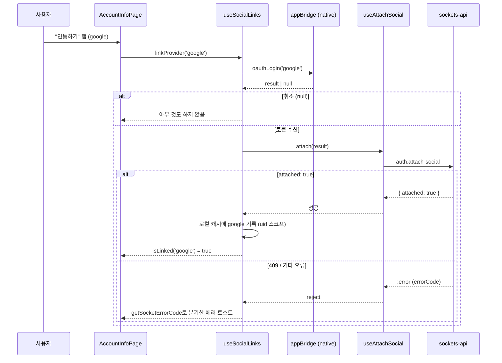
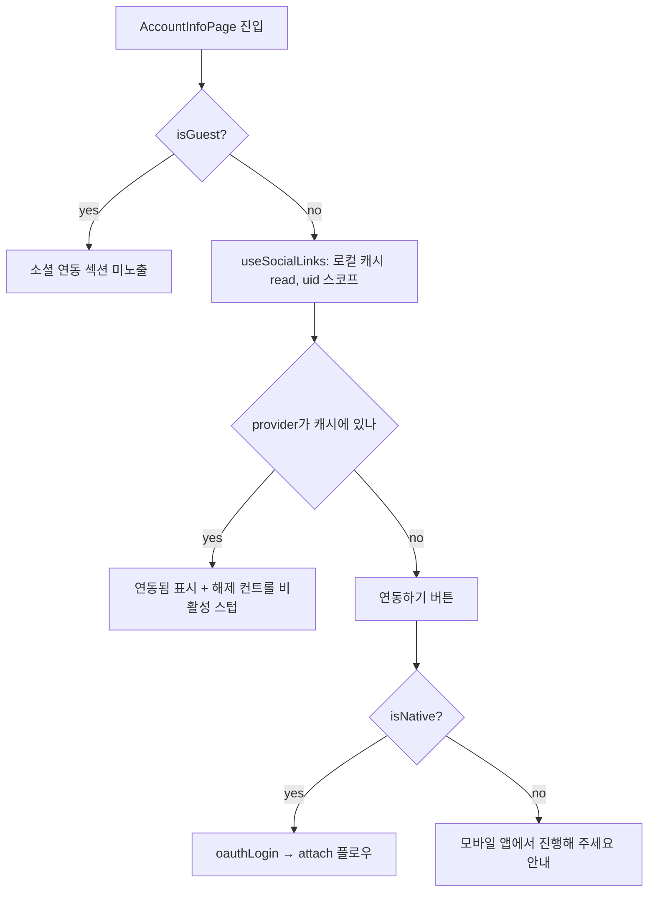

# 마이페이지 계정 연동 (번호 · 소셜)

> 상태: Live · 최종 갱신: 2026-08-03 · 관련 ADR: [ADR-0033](../../../../../docs/adr/0033-relay-dm-invite-and-auth-parallel-tracks.md) 결정 7 · [ADR-0042](../../../../../docs/adr/0042-account-linking-unified-path-migration.md) · 로드맵: [relay-dm-invite-parallel-roadmap.md#track-d--소셜-관리](../../../../../docs/plans/relay-dm-invite-parallel-roadmap.md)
>
> 대상: `apps/web/src/app/features/mypage`(`AccountInfoPage`의 `AccountLinkSection` + `useSocialLinks`)
>
> 같은 폴더의 [README.md](./README.md)는 이메일 가입·비밀번호 재설정(`apps/web/src/app/features/account`)을 다루는 **별개 문서**다 — "account"라는 이름만 같을 뿐 대상 코드가 다르다. 이 문서가 다루는 화면은 `features/mypage`에 있다.
>
> 수단·모드·단계 계약과 `linkAccount` 배선은 [account-linking.md](../auth/account-linking.md)가 소유한다. 번호 인증 화면 자체는 [phone-verification.md](../auth/phone-verification.md)가 소유한다.

> **2026-08-03 — 섹션을 열었다.** 숨겨 두었던 이유는 연동이 아니라 **읽기**였다. 목록 조회 패킷이
> 없어 "연동됨"이 localStorage 추측이었고, 캐시가 지워지면 "연동 안 됨"으로 돌아가며 다른 기기의
> 연동은 영영 몰랐다. **`UserView.link$`가 그 읽기다**(ADR-0042 §5) — 그래서 `SOCIAL_LINK_ENABLED`
> 플래그를 켜지 않고 **지웠고**, localStorage 캐시도 함께 없앴다. 대신 섹션은 `link$`가
> `'unknown'`일 때 스스로 접힌다. 같은 신중함의 더 좁고 자동인 버전이다.

## 목적

계정을 증명하는 수단(번호·소셜)을 한 화면에서 보여 주고 더 달 수 있게 한다. 수단이 둘 이상이면
어느 기기에서 어느 수단으로 로그인해도 같은 유저로 모인다.

이는 client-guide가 명시하는 "계정 갈라짐"(소셜 가입자가 새 기기에서 소셜 로그인 없이 번호부터
인증하면 별개 유저가 생기고 되돌릴 수 없는 사고)을 줄이는 **유일한 사전 방어**이기도 하다.

## 설계 원칙

- **연동은 로그인이 아니다.** `auth.link-account`의 `mode: 'link'`는 이미 메인유저인 세션에 자격을 추가로 붙이며 **세션이 바뀌지 않는다** — 토큰도 오지 않는다. 디바이스 유저의 소셜 로그인(세션이 바뀌는 쪽)은 backend의 기존 REST 소셜 경로이고 이 화면의 책임이 아니다 — 절대 혼동하지 않는다.
- **서버가 모르는 것을 안다고 하지 않는다.** 이제 서버가 `link$`로 말해 주므로 이 원칙은 폐기되지 않고 **모양만 바뀌었다** — 서버가 아무 말도 하지 않았을 때(`'unknown'`) 화면이 상태를 단정하지 않는다. 거짓말할 수 있는 계정 보안 컨트롤은 접히는 편이 낫다.
- **"없음"과 "모름"을 섞지 않는다.** `link$`가 안 오는 이유는 프로필 미도착이거나 서버가 그 자리를 짓지 않은 것이고, 둘 다 "연동 안 됨"과 구별할 수 없다. 섞으면 이미 소셜로 가입한 유저에게 연동을 다시 권하고 403(`type-linked`)을 맞는다.
- **막는 이유는 `verify`로 먼저 묻는다.** `linkable: false`와 `reason`을 응답으로 주는 것은 `verify`뿐이고 `confirm`은 같은 상황을 409·403으로 던진다. 그래서 확정 전에 물어 사용자에게 이유를 보여 준다.
- **가짜 성공을 만들지 않는다.** 해제(unlink) API가 없으므로(요청 7번), 버튼을 눌러도 실제로 풀리지 않는데 "해제됨"이라고 표시하는 일은 없다 — 해제 컨트롤은 스텁 상태를 시각적으로 드러내고, 탭하면 안내만 준다.
- **기존 화면의 시각 언어를 그대로 쓴다.** 이 영역에는 Figma 노드가 지정되지 않았다 — `AccountInfoPage`의 기존 카드(`rounded-[18px] bg-card ... shadow-[...]`)·행(`flex w-full items-center justify-between py-3 pl-4 pr-3`) 클래스와 `mypage/LoginPage.tsx`의 provider 아이콘·iOS 게이팅을 그대로 재사용한다. 새 컴포넌트/새 스타일을 발명하지 않는다.
- **에러는 코드로만 분기한다.** `getSocketErrorCode`(`apps/web/src/app/utils/errors.ts`) 없이 에러 메시지 문자열을 파싱하지 않는다(로드맵 공통 규칙).

## 범위

**포함**

- `AccountInfoPage.tsx`에 provider별(google/apple) 연동 상태를 보여주는 "소셜 연동" 카드 신설.
- 연동 추가: 네이티브 — `appBridge.oauthLogin(provider)` → 반환된 네이티브 토큰을 `useAttachSocial().attach`로 전달.
- 연동 추가: 비네이티브 — 기존 OAuth relay(`createCredentialsByProvider`, `libs/web-core/src/transport/authRuntime.ts`)를 재사용할 수 있는지 조사하고(결론: 불가, 아래 상세 구현 참고), "모바일 앱에서 진행해 주세요" 안내로 폴백.
- 연동 상태 로컬 캐시(uid 스코프) 신규 훅.
- 연동 해제 스텁: 비활성 노출 + `flags.ts` 한 줄 게이팅.
- (선택) 번호만 있는 메인유저에게 소셜 연동을 권하는 배너.

**제외**

- `CloudManagePage.tsx`(구 `AccountManagePage`)에 소셜 연동 섹션을 넣는 것 — 조사 결과 이 화면은 클라우드(워크스페이스) 소유권·구독 도메인이라 소셜 로그인 수단과 다른 개념이다(아래 "상세 구현 > `CloudManagePage`를 제외한 근거"). 화면 이름·경로·i18n 키가 `cloud*`로 바뀐 것도 같은 이유다.
- 연동 목록 조회·연동 해제 백엔드 API 자체(요청 6·7번) — 클라이언트 스텁으로 대응하고 요청 목록은 로드맵 문서가 이미 소유.
- 전화번호 인증/세션 전환(Track A), 초대 화면(Track B·C), `paths.ts`·`HomePage.tsx`·`SocketManager` — 소유권 밖, 변경 없음.
- 비네이티브 환경을 위한 신규 브라우저 OAuth 통합(예: Google Identity Services JS SDK) — 이번 범위 밖(아래 "운영 주의" 참고).

## 시나리오

### 시나리오 1 — 메인유저가 구글 계정을 처음 연동한다 (네이티브)

1. `/mypage/account` 진입 — "계정 연동" 카드에 Google 행이 "연동하기" 버튼과 함께 보인다
   (`link$.social`이 없다고 서버가 말했을 때만).
2. 탭 → `appBridge.oauthLogin('google')` 호출 → 네이티브가 구글 로그인 시트를 띄우고 `idToken`/`accessToken` 등을 반환.
3. 사용자가 네이티브 시트에서 취소하면 `result`가 `null` — 조용히 아무 것도 하지 않는다(에러가 아니므로 토스트 없음, 상태 불변).
4. 성공하면 **`verifySocial(tokens)`** 이 먼저 나간다. `linkable: false`면 이유별 토스트를 띄우고
   확정하지 않는다 — `'type-linked'`(이미 다른 소셜을 달아 둠) / `'occupied'`(남의 계정).
5. `linkable: true`면 **`confirmSocial(tokens)`** 이 확정한다. **로컬 기록을 남기지 않는다** —
   `user.profile`이 갱신되면 행이 "연동됨"으로 바뀐다. **세션 전환도 화면 전환도 없다.**
6. 확정에서 그 소셜 계정이 이미 다른 유저 소유로 판정되면(`409`) "이미 다른 계정에 연동된 소셜
   계정이에요", 같은 수단을 이미 달아 둔 경우(`403`) "이미 다른 계정을 연동해 두셨어요".

### 시나리오 2 — 비네이티브(브라우저) 접근

1. 데스크톱 브라우저 또는 모바일 브라우저(웹뷰 밖)에서 `/mypage/account` 진입.
2. "소셜 연동" 카드는 그대로 보이되, 연동하기를 탭하면 "모바일 앱에서 진행해 주세요" 안내만 뜬다 — attach에 필요한 **네이티브 원시 토큰**(id_token 등)을 브라우저 단독으로는 만들 수 없기 때문이다(상세 구현 참고).

### 시나리오 3 — 이미 연동된 상태에서 재방문

1. `link$.social`이 있는 채로 재진입 → 새 호출 없이 즉시 "연동됨" 표시.
2. 같은 계정으로 **다른 기기**에서 재방문 → **같게 보인다.** 상태가 서버에 있으므로 기기가 바뀌어도,
   캐시를 지워도 그대로다. 이전 판의 알려진 제약(요청 6번)이 이렇게 해소됐다.
3. `link$`가 아직 안 왔거나 서버가 그 자리를 짓지 않았으면 **섹션이 접힌다** — "연동하기"로도
   "연동됨"으로도 보이지 않는다.

### 시나리오 3-b — 번호를 연동한다

1. 번호 행의 "연동하기" 탭 → `PhoneVerifySheet`가 `mode="link"`로 열린다.
2. 발송 → 6자리 입력 시 **`verify`**가 나가고, `linkable: false`면 이유를 인라인으로 보여 주며
   확정 버튼이 열리지 않는다(`'occupied'` = 남의 계정, `'type-linked'` = 이미 다른 번호를 달아 둠).
3. `linkable: true`면 CTA가 `confirm`을 부른다. **토큰이 오지 않고 세션이 그대로다.**
4. 연동 후 행은 서버가 준 마스킹 꼬리로 "연동됨 (5678)"이 된다 — 번호 원문은 서버에 없다.

### 시나리오 4 — 해제를 시도한다

1. "연동됨" 행의 해제 컨트롤은 비활성(회색, 스텁 표시)으로 노출된다.
2. 탭하면 "곧 지원될 예정이에요" 안내만 뜨고 캐시·상태는 그대로다 — 풀리지 않은 연동을 풀렸다고 보고하지 않는다.

### 시나리오 5 — 수단이 하나도 없는 메인유저에게 유도 문구

1. 메인유저(`!isGuest`)이고 **서버가 번호도 소셜도 없다고 말했으면**(`phone === 'absent' && social === 'absent'`) 카드 위에 짧은 안내 문구("계정이 갈라지지 않도록 소셜 계정을 연결해 두세요")를 보여준다.
2. 이전 판의 "이 기기에 캐시가 없음"이라는 근사치를 서버 진실로 바꿨다 — 소셜로 가입한 유저가 매 기기에서 이 문구를 다시 보던 문제가 사라졌다.
3. 닫기 컨트롤은 없다 — `LicensesPage`의 설명 문구(`mb-3 px-1 text-[13px] text-muted-foreground`)와 같은 정적 캡션이다. 상태를 저장하지 않으므로 매 진입마다 같은 조건으로 재평가되고, 수단을 하나라도 연동하면 다음부터 자동으로 사라진다.

## 다이어그램

### 연동 추가 플로우 (네이티브)

### 연동 상태 판정 및 렌더 분기

## 상세 구현

### 연동 상태의 출처 — `UserView.link$` (백엔드 요청 6번 해소)

이 문서의 이전 판은 "연동 목록을 서버에서 읽을 방법이 없다"고 결론 내리고 localStorage 캐시로
대응했다. **`chatic-backend-api@0.26.706`이 그 결론을 뒤집었다.**

- `UserView.link$`(`node_modules/@lemoncloud/chatic-backend-api/dist/modules/auth/views.d.ts:69`)가
  `LinkedAccountsView`다 — `{ phone?, email?, social? }`이고 각 항목이
  `LinkedAccountView { hint?, provider?, linkedAt? }`(`:327-334`)다. 수단마다 자리가 하나이고,
  표시 값만 담는다(`accountId`는 노출되지 않는다).
- 이전 판이 지적한 `MyUserView.account$`는 여전히 **최초 가입 계정 하나**이고 연동 목록이 아니다 —
  그 지적은 유효하다. 답은 `account$`가 아니라 `link$`였다.
- **읽기 경로는 이미 열려 있었다.** 앱은 이미 `user.profile`을 부르고(`useMyUser.ts:39` →
  `UserRepositoryV2.getMyProfile`), 파이프라인 전 구간이 spread라 모르는 필드가 버려지지 않는다
  (`UserRemoteDataSource.ts:71` → `mappers.ts:172` → `UserLocalDataSourceV2.ts:96` → IndexedDB).
  **막던 것은 타입뿐이다** — 경계 타입이 socials-api의 `UserView`인데 페이로드는 backend-api의
  `MyUserView`다.
- 그래서 `MyUser`(`useMyUser.ts:12`)에 `link$`를 더해 넓혔다. `photo`/`email`이 이미 쓰는 기법
  그대로다. 대가: 서버가 모양을 바꿔도 컴파일이 잡아 주지 않는다.
- 판정은 `useLinkedAccounts`(`apps/web/src/app/hooks/useLinkedAccounts.ts`)가 **3상태**로 돌려준다 —
  `'linked'` · `'absent'` · `'unknown'`. `link$` 객체가 없으면 `'unknown'`, 있으면 그 안의 항목
  유무가 그대로 판정이다(서버가 뷰를 지었다는 뜻이라 빠진 항목은 정말 없는 것).

**아직 확인이 필요한 것:** 이미 소셜로 가입한 기존 유저의 `link$`를 채우는 **일회성 백필**이
백엔드 구현 계획의 순서에 없다. 안 돌았다면 그 유저들은 `'absent'`가 아니라 빈 `link$` 또는
`link$` 자체가 없어 `'unknown'`으로 읽히고, 섹션이 접힌다 — 틀린 상태를 보여주지는 않는다.

### `CloudManagePage.tsx`를 제외한 근거

- `CloudManagePage.tsx`의 `useClouds`(`libs/web-core/src/hooks/user/useClouds.ts`)가 반환하는 `CloudView`(`node_modules/@lemoncloud/chatic-backend-api/dist/modules/clouds/model.d.ts:38-62`)는 `ownerId`/`email`(구독 키)/`account$`(`AccountHead`)/멤버십 필드를 가진 **클라우드(워크스페이스) 소유권·구독** 모델이다.
- `AccountStereo`의 `social`(로그인 수단)과는 완전히 다른 도메인이다. 실제로 로케일의 `cloudManage.noAccounts`("등록된 클라우드가 없어요")가 이 화면의 정체가 클라우드 목록임을 보여준다.
- 여기에 구글/애플 연동 섹션을 끼워 넣으면 "클라우드 계정"과 "소셜 로그인 수단"이 한 화면에서 같은 개념처럼 보여 혼동을 만든다 — client-guide가 정확히 경고하는 종류의 혼동("소셜 로그인 자체는 웹소켓에 없다... 혼동하지 마라")과 같은 성격이다. 그래서 소셜 연동 섹션은 `AccountInfoPage.tsx` 하나에만 둔다.

### 비네이티브 OAuth relay 재사용 조사 (백엔드 요청과 무관, 클라 단독 조사)

- `apps/web/src/app/features/auth/hooks/useOAuthLogin.ts`가 쓰는 `createCredentialsByProvider`(`libs/web-core/src/transport/authRuntime.ts:34`)는 `POST /oauth/{provider}/token`에 인가 코드(`code`)를 보내 **서버가 대신 교환한 자체 세션 토큰**(`LemonOAuthToken`)을 받는다 — `auth.attach-social`이 요구하는 **provider 원시 토큰**(`idToken`/`identityToken` 등, `libs/app-messages/src/types/model/auth.ts`의 `GoogleOAuthTokenResult`/`AppleOAuthTokenResult`)과 형태가 다르다. 이 경로는 애초에 "로그인"(세션 발급)을 위한 것이라 attach에 필요한 원시 토큰을 얻는 용도로 재사용할 수 없다.
- 브라우저에서 provider 원시 토큰을 직접 받으려면(예: Google Identity Services JS SDK) 별도의 신규 브라우저 OAuth 통합이 필요하며, 이는 이번 트랙 범위 밖이다(로드맵에 없는 신규 작업 — "운영 주의"에 기록).
- **결론**: 비네이티브 경로는 attach를 수행할 수 없다 — "모바일 앱에서 진행해 주세요" 안내로 폴백한다.

### 파일과 역할

| 파일                                      | 역할                                                                                                                                                                                                                                                 |
| ----------------------------------------- | ---------------------------------------------------------------------------------------------------------------------------------------------------------------------------------------------------------------------------------------------------- |
| `hooks/useSocialLinks.ts`                 | 소셜 연동 오케스트레이션 — `oauthLogin` → 취소/토큰 분기 → `verifySocial` → `linkable` 분기 → `confirmSocial` → 에러 코드 토스트. 상태는 `useLinkedAccounts()`에서 읽는다. 반환: `{ isLinked, linkProvider, requestUnlink, isLinking, socialState }` |
| `components/AccountLinkSection.tsx`       | 카드 + 행 세 개(번호 · Google · iOS면 Apple). `isGuest`거나 어느 상태든 `'unknown'`이면 `null`. 번호 행이 `PhoneVerifySheet`를 `mode="link"`로 연다                                                                                                  |
| `components/SocialProviderIcons.tsx`      | `GoogleIcon`/`AppleIcon` — `LoginPage`와 공유                                                                                                                                                                                                        |
| `flags.ts`                                | `SOCIAL_UNLINK_ENABLED = false`만 남았다. `SOCIAL_LINK_ENABLED`는 존재 이유(읽기 부재)가 사라져 **삭제**했다                                                                                                                                         |
| `pages/AccountInfoPage.tsx:46`            | `<AccountLinkSection />` 마운트                                                                                                                                                                                                                      |
| `public/locales/{ko,en}/translation.json` | `mypage.accountInfo.social.*` — 기존 키 + `phone`·`phoneMasked`·`typeAlreadyLinked`                                                                                                                                                                  |

**왜 로직을 훅에 몰아넣는가**: `mypage/README.md`가 명시하듯 이 앱의 페이지·다이얼로그류
컴포넌트는 유닛 테스트 대상이 아니고 프리뷰로 검증한다 — 오직 `hooks/*.ts`만 테스트된다. 그래서
테스트가 필요한 로직은 전부 훅으로, `AccountLinkSection`은 훅을 호출하는 얇은 프레젠테이션으로
남긴다.

provider 행은 `mypage/LoginPage.tsx`와 동일하게 JSX에서 직접 결정한다: Google은 항상, Apple은
`isNative() && CHATIC_APP_PLATFORM === 'ios'`일 때만 — 훅에 provider 목록을 하드코딩하지 않는다.

### 에러 분기

`verify`가 먼저 답하므로 대부분의 거절은 에러가 아니라 **응답**으로 온다. 아래는 그래도 확정이
던지는 경우다. 전부 `getSocketErrorCode(error)`(`apps/web/src/app/utils/errors.ts:20`)로 분기하고
에러 문자열은 파싱하지 않는다.

| 자리           | 값                                         | 처리                                                                                             |
| -------------- | ------------------------------------------ | ------------------------------------------------------------------------------------------------ |
| `verify` 응답  | `linkable: false`, `reason: 'occupied'`    | "이미 다른 계정에 연동된 소셜 계정이에요" — 확정하지 않는다                                      |
| `verify` 응답  | `linkable: false`, `reason: 'type-linked'` | "이미 다른 계정을 연동해 두셨어요"                                                               |
| `confirm` 에러 | `409`                                      | 위 `occupied`와 같은 문구                                                                        |
| `confirm` 에러 | `403`                                      | 위 `type-linked`와 같은 문구 (메인유저 아님도 여기 섞이지만 이 화면은 `isGuest`로 이미 걸러진다) |
| 기타/미분류    | —                                          | 일반 실패 토스트(`linkFailed`)                                                                   |

## 검증 방법

- **유닛 테스트**: `apps/web/src/app/features/mypage/hooks/useSocialLinks.test.ts`
    - 연동 상태가 `link$`에서 나온다 / 기록된 provider가 아니면 미연동으로 읽힌다.
    - `verify` → `confirm` 순서, 그리고 `linkable: false`가 **확정 전에** 끊는지.
    - 네이티브 취소(`result: null`) → 아무 호출도 없고 토스트도 없다.
    - 이유별·코드별 카피(`type-linked`/`occupied`, 409/403/기타).
    - 비네이티브에서 `oauthLogin`을 부르지 않고 안내 토스트만.
    - `requestUnlink`는 상태를 바꾸지 않는 스텁이다.
    - 실행: `npx jest --config apps/web/jest.config.js --runInBand --watchman=false --testPathPatterns "useSocialLinks"`
- **정적 검사**: `npx tsc -b apps/web/tsconfig.app.json` → 에러 0. 프로젝트 레퍼런스 빌드를 쓴다 —
  라이브러리 `dist`가 낡은 상태에서 `--noEmit -p`를 쓰면 stale `.d.ts`를 읽어 실재하지 않는 에러가 난다.
- **회귀**: `npx jest --config apps/web/jest.config.js --runInBand --watchman=false`(apps/web 전체).
- **수동 확인 — 미실행**: `mypage/README.md` 관례대로 페이지 자체는 프리뷰로 확인하는 항목이나,
  이 세션에는 dev 스테이지 접근·네이티브 브릿지가 없어 수행하지 못했다. 배포 전 확인 필요:
  네이티브에서 google 연동 성공 → 다른 기기에서 같은 상태로 보이는지(`link$`의 핵심 이득),
  번호 연동에서 `verify`가 `linkable`을 답하는지, `link$`가 없는 계정에서 섹션이 접히는지,
  게스트 미노출, 다크모드.

## 구독이 이 연동에 걸려 있다

**구독은 클라우드에 붙고, 클라우드 소유는 소셜 계정 기반이다.** 그래서 소셜 자격이 없는 유저는
결제해도 멤버십이 붙을 자리가 없다.

`validateMembership`은 **구매 뒤에** 돌기 때문에 거기서 실패하면 돈은 나가고 구독은 안 붙는다.
그래서 `useSubscriptionIap.purchaseAndValidate`가 **스토어를 열기 전에** 거절한다
(`isMissingSocialForCloud`).

- **`'absent'`만 막는다.** `'unknown'`(프로필 미도착 · 백필 안 된 기존 계정)을 "소셜 없음"으로
  읽으면 **기존 유료 사용자의 갱신을 막는다.** 서버가 거절하게 두는 편이 낫다.
- **복구(`restorePurchases`)는 막지 않는다.** 이미 존재하는 결제는 누군가의 것이고, 각 건이
  서버 검증을 거쳐 실패 시 건너뛰므로 최악이 0건이다. 시도조차 막으면 결제자가 고립된다.
- 화면이 결제를 권하기 **전에** 안내하도록 `isMissingSocialForCloud`를 함께 내보낸다.

## 운영 주의 (as-built)

- **`link$` 백필이 안 돌았으면 섹션이 조용히 접힌다.** 기존 유저의 자리가 비어 `'unknown'`으로
  읽히기 때문이다. 틀린 상태를 보여주지는 않지만, 이 화면의 가치가 백엔드 백필에 묶여 있다.
- **`cacheWrite`는 merge라 stale `link$`가 남는다**(`UserLocalDataSourceV2.ts:96-102`). 한번 쓰인
  값은 이후 응답이 그 자리를 빼먹어도 캐시에 남는다. 지금은 해제가 없어 무해하지만, 요청 7번을
  열 때 replace 시맨틱을 함께 판단해야 한다.
- **소셜 슬롯은 하나다.** `link$.social`이 단수이므로 `isLinked(provider)`는 "기록된 provider가
  이것인가"다. 다른 provider는 미연동으로 보이고, 실제로 서버도 `type-linked`로 막는다. 수단당
  여러 계정은 서버 미결정 항목이다.
- **같은 provider 재연동 시 서버 동작 미문서화**: 이미 같은 유저에 연동된 provider를 다시 확정했을
  때 성공(no-op)인지 에러인지 client-guide에 명시가 없다. 설계 문서는 "이미 자기 것이면 무해하게
  다시 확정"이라고 적었으므로 성공을 기대하되, `verify`가 먼저 답하므로 사용자에게 도달하기 전에
  걸러진다.
- **해제(unlink)는 의도적으로 비활성 노출**: 완전히 숨기지 않고 회색 처리해 스텁의 존재를 드러낸다. 요청 7번 API가 열리면 `apps/web/src/app/features/mypage/flags.ts`의 `SOCIAL_UNLINK_ENABLED`를 `true`로 바꾸고 `useSocialLinks.requestUnlink`에 실제 호출을 채워 넣는다.
- **비네이티브(브라우저) 소셜 연동은 여전히 구조적으로 불가능**하다(상세 구현 참고) — 지원하려면 별도 브라우저 OAuth 통합이 필요하고, 이는 새 ADR로 분리해야 한다. **번호 연동은 브라우저에서도 된다** — 소켓 호출이라서다.
