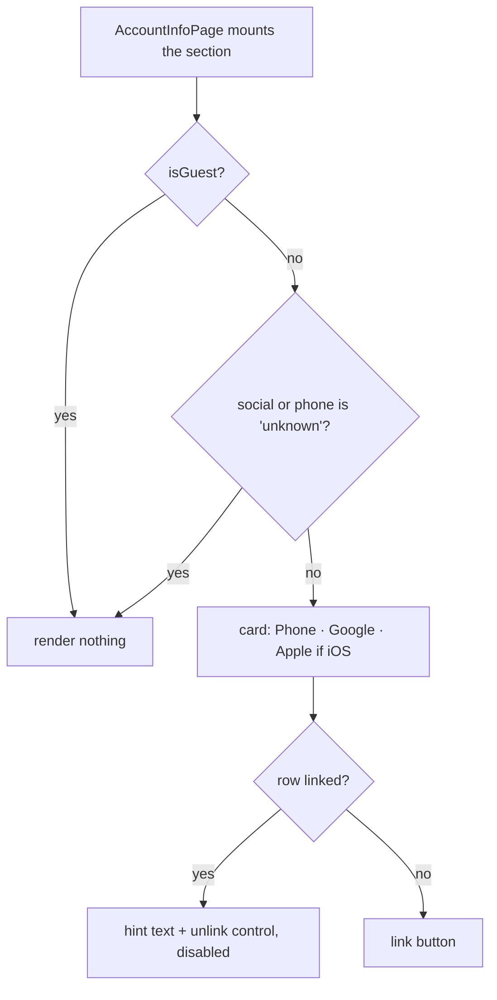

# social-links — the credentials that prove one account

The account-linking card on `/mypage/account`. It shows which credentials — a phone number, a social
account — are attached to the signed-in user, and lets the user attach more. Two credentials mean
that signing in on a new device from either one lands on the same user instead of creating a second,
unmergeable one.

This document covers the **screen**. The packet it drives, its modes and its four steps belong to
[auth](../auth/README.md); the phone sheet it opens belongs there too. Session state, tokens and who
may write them belong to
[`libs/app-runtime`](../../../../../libs/app-runtime/docs/session/README.md).

The code is in `apps/web/src/app/features/mypage`, not in `features/account`. The file sits in this
group because the subject is account credentials — the same subject as
[the sign-up flow](./README.md) next to it.

## Layout

| File                                          | Role                                                                                              |
| --------------------------------------------- | ------------------------------------------------------------------------------------------------- |
| `components/AccountLinkSection.tsx`           | The card and its rows. Two guards, three rows, one sheet                                          |
| `components/SocialProviderIcons.tsx`          | `GoogleIcon` and `AppleIcon`, shared with `mypage/LoginPage.tsx`                                  |
| `hooks/useSocialLinks.ts`                     | Social linking: bridge token → `verifySocial` → `confirmSocial` → toast                           |
| `flags.ts`                                    | `SOCIAL_UNLINK_ENABLED` (`false`). The only constant in the file                                  |
| `pages/AccountInfoPage.tsx`                   | Mounts `<AccountLinkSection />`                                                                   |
| `apps/web/src/app/hooks/useLinkedAccounts.ts` | Reads `link$` off the relay user and answers `'linked'` / `'absent'` / `'unknown'` per credential |
| `apps/web/src/app/hooks/useLinkAccount.ts`    | The `auth.link-account` surface — `send`, `verify`, `confirm`, `verifySocial`, `confirmSocial`    |

The last two live in the app's shared `hooks/` because the phone sheet, the subscription purchase
gate and this card all read them. There is no hook or component under `features/account` involved.

## Responsibilities

This screen decides **what to render** and **which call to make next**. It decides nothing about
whether a link is allowed: that answer is the server's, and it arrives twice — as `linkable` on the
`verify` response, and as a status code on `confirm`.

It also refuses to decide what the server has not said. `useLinkedAccounts` is tri-valued, and
`'unknown'` is a real answer, not a missing one.

### Where state comes from

`UserView.link$` on the relay user record is the source. It carries one slot per credential kind —
`phone`, `email`, `social` — and each slot holds display material only (`hint`, `provider`,
`linkedAt`), never an account id.

`useLinkedAccounts` turns it into three states:

| `link$`                     | Answer      | What the screen does                |
| --------------------------- | ----------- | ----------------------------------- |
| object present, slot filled | `'linked'`  | Shows the credential, with its hint |
| object present, slot empty  | `'absent'`  | Offers the link button              |
| no `link$` object at all    | `'unknown'` | Renders nothing                     |

The third row is the one that matters. A missing `link$` means either that the profile has not
landed yet or that the server never built the slot for this user — and neither is distinguishable
from "not linked". Reading it as `'absent'` would tell a user who registered through social to link
social, and the server would answer 403 `type-linked`. An account-security control that can lie is
worse than one that admits it does not know, so the whole section hides itself instead.

`link$` is read off the **relay** user (`useMyUser`), and that is not incidental: `auth.link-account`
is relay-pinned, because the main user it resolves lives on the central backend behind relay. Read
and write have to agree, or a link made on relay reads as unlinked from inside a cloud.

## The shared contract

### Linking is not logging in

`auth.link-account` with `mode: 'link'` hangs one more credential on a session that is **already** a
main user. No token comes back, the session does not change, and no navigation happens. That is the
whole difference from `mode: 'login'`, which promotes a device user and returns a `$token` the caller
must install. The mode is chosen from the session role, never from the response —
[auth](../auth/README.md) owns that contract in full.

A device user's social **login** — the path that does change the session — is the backend's REST
social route and is not this screen's business.

### `verify` before `confirm`

`verify` is the only step that names a reason. It answers `{ linkable: false, reason }`, where the
reason is `'type-linked'` (this user already has a credential of that kind) or `'occupied'` (the
credential belongs to someone else). `confirm` meets the same two situations with a 403 and a 409 and
no explanation.

So the screen asks first and shows the reason, and only confirms when `linkable` is true. `verify`
changes nothing on the server, which is what makes asking free.

Both codes are still handled on `confirm`, because a state can change between the two calls:

| Where             | Value                   | Message key                     |
| ----------------- | ----------------------- | ------------------------------- |
| `verify` response | `reason: 'type-linked'` | `social.typeAlreadyLinked`      |
| `verify` response | any other reason        | `social.alreadyLinkedElsewhere` |
| `confirm` throw   | 403                     | `social.typeAlreadyLinked`      |
| `confirm` throw   | 409                     | `social.alreadyLinkedElsewhere` |
| `confirm` throw   | anything else           | `social.linkFailed`             |

Every branch reads the status through `getSocketErrorCode` (`apps/web/src/app/utils/errors.ts`).
Nothing parses an error message string.

### One social slot

`link$.social` is singular. `isLinked(provider)` therefore means "is the recorded provider this
one" — a second provider reads as unlinked, and the server enforces the same thing by answering
`type-linked`. Several accounts of the same kind on one user is not a client limitation to work
around; the server has not defined it.

### The rows

`AccountLinkSection` renders two guards and then up to three rows.



- **Phone** opens `PhoneVerifySheet` with `mode="link"`. Linked, it shows the masked tail the server
  returned (`phoneHint`) — the full number is never sent back. The phone row passes no `onUnlink`, so
  it has no unlink control at all.
- **Google** is always offered. **Apple** appears only when `isNative()` and
  `window.CHATIC_APP_PLATFORM` is `ios`. The provider list is decided in JSX, mirroring
  `mypage/LoginPage.tsx`, rather than hard-coded inside the hook.
- The unlink control on the social rows is rendered **disabled**, with a `title` explaining why.
  There is no unlink packet; hiding the control would be tidier and would also hide the fact that
  the capability is missing.

### The nudge above the card

When the server says the user has **neither** credential (`phone === 'absent' && social === 'absent'`),
a one-line caption appears above the card suggesting they link one. An account with no credential is
one device wipe away from being unrecoverable, and this is the only warning the app gives before that
happens.

It has no dismiss control and stores nothing. It is re-evaluated from the server answer on every
entry, so it disappears by itself the moment either credential lands, and a user who registered
through social never sees it on a second device — both of which a per-device dismissal flag would get
wrong.

### Why the browser cannot link a social account

Attaching a social credential needs the **provider's own raw token** — a Google `idToken`, an Apple
`identityToken` — which only the native bridge (`appBridge.oauthLogin(provider)`) can produce.

The browser OAuth path is not a substitute. `createCredentialsByProvider` posts an authorization code
to `POST /oauth/{provider}/token` and gets back **our** session token: it is a login, and it carries
none of the provider material `confirmSocial` requires. Obtaining a raw provider token in a browser
would mean a new browser-side OAuth integration.

So a non-native visitor sees the card and gets `social.mobileOnly` on tap. **Phone linking works in
the browser** — it is a socket call with no bridge in it.

### The card borrows its styling

No Figma node covers this area. The card and row classes come from `AccountInfoPage` itself
(`rounded-[18px] bg-card …`, `flex w-full items-center justify-between py-3 pl-4 pr-3`), the provider
icons and the iOS gate from `mypage/LoginPage.tsx`, and the nudge caption from the same static
caption style the licenses screen uses. Nothing here invents a component or a style.

### Subscriptions depend on this

A subscription attaches to a cloud, and cloud ownership is social-account based, so a user with no
social credential has nothing for a membership to land on. `validateMembership` runs **after** the
purchase, so a failure there takes the money and leaves the subscription unattached.

`useSubscriptionIap` therefore refuses before opening the store, via `isMissingSocialForCloud`
(`apps/web/src/app/features/subscription/hooks/useSubscriptionIap.ts`). Three rules hold that gate
honest:

- **Only `'absent'` blocks.** Reading `'unknown'` as "no social" would stop existing paying customers
  from renewing. Letting the server refuse is the cheaper mistake.
- **`restorePurchases` is not gated.** A purchase that already exists belongs to someone, each one is
  validated server-side and skipped on failure, so the worst case is a count of zero. Refusing to try
  would strand a paying user.
- **The refusal is exported**, so a screen can guide toward linking before it offers to charge.

## Usage

### Reading the state

```tsx
const linked = useLinkedAccounts();
if (linked.phone === 'unknown' || linked.social === 'unknown') return null;
```

Never gate on `'unknown'` as though it were `'absent'`. Fall back on it — render nothing, skip the
nudge, let the server decide.

### Adding a credential kind

1. Add the slot to `LinkedAccounts` in `useLinkedAccounts.ts`, mapping the `link$` entry to the same
   three states. Display material only.
2. Add a `CredentialRow` in `AccountLinkSection`, and extend the `'unknown'` guard to cover it — one
   unknown slot means the whole section is guessing.
3. Put the orchestration in a hook, not in the component. Pages and dialogs in this app are verified
   in a preview; only `hooks/*.ts` is unit-tested, so logic in a component is logic without a test.
4. Run `verify` before `confirm`, and branch on the reason. Skipping `verify` turns an explainable
   refusal into a bare status code.
5. Where the backend endpoint does not exist yet, add a `false` constant to `flags.ts` with the
   reason, and render the control disabled rather than hiding it.

### What not to do

- **Do not cache linked state locally.** A per-device mirror cannot see a link made on another
  device and reads as unlinked after a cache wipe. The server slot has neither problem, and a stale
  local copy is exactly the lie the `'unknown'` state exists to prevent.
- **Do not report a success the server did not give.** The unlink control is a stub; it raises an
  explanatory toast and changes nothing.
- **Do not parse error messages.** `getSocketErrorCode` is the only branch input.
- **Do not put this card on `CloudManagePage`.** That screen lists clouds — workspaces the user owns
  and subscribes to, a `CloudView` with `ownerId`, a billing `email` and membership fields. A social
  credential is a login method. Putting them on one screen makes "cloud account" and "social login"
  look like one concept, which is the confusion the whole two-mode contract exists to prevent.
- **Do not treat the bridge's echoed provider as authoritative.** `useSocialLinks` sends the provider
  of the **row the user tapped**, because that is the intent, and because it guarantees the field the
  packet requires exists whatever shape the bridge returns.

## Notes for implementers and tests

- **`link$` is a hint, not the record of ownership.** It is what the server exposes so a client can
  render without probing each credential. The thing that actually blocks a bad link is `verify`'s
  answer or `confirm`'s status.
- **The one-time backfill may not have reached an account.** A user who registered through social
  before the unified path can read `'unknown'`, and the section stays hidden for them. The screen
  shows nothing wrong, but its value is tied to that backfill.
- **A written `link$` cannot be erased by omission.** `useMyUser` keeps the account fields on the
  relay token and patches them from a one-shot `user.profile`, dropping `undefined` values so a slim
  response cannot wipe a field — only an explicit `null` clears one. Harmless while nothing can be
  unlinked; it has to be re-judged when an unlink endpoint arrives.
- **There is no local cache row to read.** The account profile comes off the stored relay token, not
  out of IndexedDB: the cache is keyed by `cid` and `uid`, so while a cloud is active the relay
  user's row is physically unreachable. Do not reach for the user repository to answer this question.
- **Re-confirming a provider the user already has is not specified.** `verify` answers `type-linked`
  first, so the case does not reach a user — but do not build on an assumption about `confirm` there.
- **Cancelling the native sheet is not an error.** `appBridge.oauthLogin` resolves with a `null`
  result; the hook returns without a call and without a toast.

## How to verify

```bash
npx jest --config apps/web/jest.config.js --runInBand --watchman=false --testPathPatterns "useSocialLinks"
npx tsc -b apps/web/tsconfig.app.json
```

`useSocialLinks.test.ts` covers the state reading (slot absent, wrong provider, `'unknown'`), the
`verify` → `confirm` order and the stop before `confirm`, the native cancel, every message key in the
table above, the non-native path, and that `requestUnlink` mutates nothing.
`AccountLinkSection.test.tsx` covers the two guards and the rows.

The type check must be `tsc -b`. A `--noEmit -p` run reads the libraries' last-emitted `.d.ts` files,
so a stale `dist` invents errors that are not in the source.

The card itself is checked in a preview, per the convention in [mypage](../mypage/README.md). What a
test cannot show: a link made on a native device appearing as linked on a second device, which is the
whole point of reading `link$` from the server.

## Further reading

- [auth](../auth/README.md) — the `auth.link-account` contract, its modes and steps, and the phone
  verification screens.
- [mypage](../mypage/README.md) — the screen this card is mounted on.
- [`libs/app-runtime`](../../../../../libs/app-runtime/docs/session/README.md) — session state and
  what may write it.
