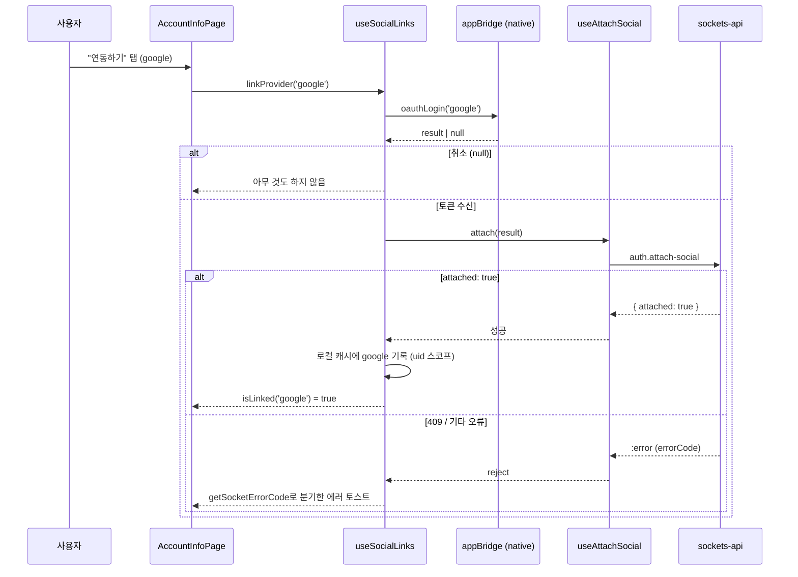
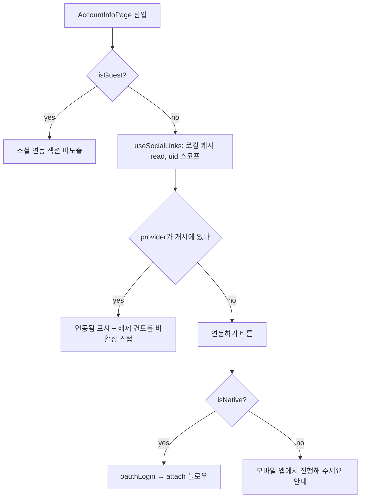

# 마이페이지 소셜 연동 (Track D)

> 상태: Live(화면 비노출) · 최종 갱신: 2026-07-31 · 관련 ADR: [ADR-0033](../../../../../docs/adr/0033-relay-dm-invite-and-auth-parallel-tracks.md) 결정 7 · 로드맵: [relay-dm-invite-parallel-roadmap.md#track-d--소셜-관리](../../../../../docs/plans/relay-dm-invite-parallel-roadmap.md)
>
> 대상: `apps/web/src/app/features/mypage`(`AccountInfoPage` 신규 섹션 + 신규 hooks/components)
>
> 같은 폴더의 [README.md](./README.md)는 이메일 가입·비밀번호 재설정(`apps/web/src/app/features/account`)을 다루는 **별개 문서**다 — "account"라는 이름만 같을 뿐 대상 코드가 다르다. 이 문서가 다루는 화면은 `features/mypage`에 있다.

> **2026-07-31 — 섹션 전체를 숨겼다.** `flags.ts`의 `SOCIAL_LINK_ENABLED = false`가
> `SocialLinkSection`을 `null`로 만든다. 이유는 연동 자체가 아니라 **읽기**다: 목록 조회 패킷이
> 없어(요청 6번) "연동됨"은 localStorage에 남긴 로컬 추측이고, 캐시가 지워지면 "연동 안 됨"으로
> 돌아가며 다른 기기의 연동은 영영 모른다. 거짓말할 수 있는 계정 보안 컨트롤은 안 보이는 편이
> 낫다. 아래 서술은 **플래그를 켰을 때의 동작**이고, 배선은 그대로 남아 있어 켜는 것은 한 줄이다.

## 목적

번호 인증만으로 메인유저가 된 계정(또는 소셜로 가입한 계정)에 구글/애플 같은 추가 소셜 로그인 수단을 "붙여서", 이후 어느 기기에서 그 소셜 계정으로 로그인해도 같은 유저로 모이게 한다. 이는 client-guide가 명시하는 "계정 갈라짐"(소셜 가입자가 새 기기에서 소셜 로그인 없이 번호부터 인증하면 별개 유저가 생기고 되돌릴 수 없는 사고)을 줄이는 방어 수단이기도 하다.

## 설계 원칙

- **attach는 로그인이 아니다.** `auth.attach-social`은 이미 메인유저인 세션에 소셜 자격을 추가로 붙이는 패킷이며 **세션이 바뀌지 않는다**(`chatic-sockets-api/docs/specs/relay-server-invite/05-client-guide.md` §알아 둘 제약 인용 블록). 디바이스 유저의 소셜 로그인(세션이 바뀌는 쪽)은 backend의 기존 REST 소셜 경로이고 이 화면·이 트랙의 책임이 아니다 — 절대 혼동하지 않는다.
- **서버가 모르는 것을 안다고 하지 않는다.** 연동 목록 조회 API가 없는 한(백엔드 요청 6번), 이 화면이 보여주는 "연동됨"은 "서버가 확인해 준 상태"가 아니라 **"이 기기가 마지막으로 attach 성공을 기억하는 상태"**다. 데이터 모델 자체(uid 스코프 로컬 캐시)가 이 사실을 강제한다.
- **가짜 성공을 만들지 않는다.** 해제(unlink) API가 없으므로(요청 7번), 버튼을 눌러도 실제로 풀리지 않는데 "해제됨"이라고 표시하는 일은 없다 — 해제 컨트롤은 스텁 상태를 시각적으로 드러내고, 탭하면 안내만 준다.
- **기존 화면의 시각 언어를 그대로 쓴다.** 이 트랙에는 Figma 노드가 지정되지 않았다 — `AccountInfoPage`의 기존 카드(`rounded-[18px] bg-card ... shadow-[...]`)·행(`flex w-full items-center justify-between py-3 pl-4 pr-3`) 클래스와 `mypage/LoginPage.tsx`의 provider 아이콘·iOS 게이팅을 그대로 재사용한다. 새 컴포넌트/새 스타일을 발명하지 않는다.
- **로컬 캐시는 기기가 아니라 계정(uid) 스코프다.** 같은 기기에서 로그아웃 후 다른 계정으로 로그인해도 이전 계정의 연동 상태를 보여주지 않는다.
- **에러는 코드로만 분기한다.** `getSocketErrorCode`(`apps/web/src/app/utils/errors.ts`) 없이 에러 메시지 문자열을 파싱하지 않는다(로드맵 공통 규칙).

## 범위

**포함**

- `AccountInfoPage.tsx`에 provider별(google/apple) 연동 상태를 보여주는 "소셜 연동" 카드 신설.
- 연동 추가: 네이티브 — `appBridge.oauthLogin(provider)` → 반환된 네이티브 토큰을 `useAttachSocial().attach`로 전달.
- 연동 추가: 비네이티브 — 기존 OAuth relay(`createCredentialsByProvider`, `libs/web-core/src/transport/authRuntime.ts`)를 재사용할 수 있는지 조사하고(결론: 불가, 아래 상세 구현 참고), "모바일 앱에서 진행해 주세요" 안내로 폴백.
- 연동 상태 로컬 캐시(uid 스코프) 신규 훅.
- 연동 해제 스텁: 비활성 노출 + `flags.ts` 한 줄 게이팅.
- (선택) 번호만 있는 메인유저에게 소셜 연동을 권하는 배너.

**제외**

- `AccountManagePage.tsx`에 소셜 연동 섹션을 넣는 것 — 조사 결과 이 화면은 클라우드(워크스페이스) 소유권·구독 도메인이라 소셜 로그인 수단과 다른 개념이다(아래 "상세 구현 > `AccountManagePage`를 제외한 근거").
- 연동 목록 조회·연동 해제 백엔드 API 자체(요청 6·7번) — 클라이언트 스텁으로 대응하고 요청 목록은 로드맵 문서가 이미 소유.
- 전화번호 인증/세션 전환(Track A), 초대 화면(Track B·C), `paths.ts`·`HomePage.tsx`·`SocketManager` — 소유권 밖, 변경 없음.
- 비네이티브 환경을 위한 신규 브라우저 OAuth 통합(예: Google Identity Services JS SDK) — 이번 범위 밖(아래 "운영 주의" 참고).

## 시나리오

### 시나리오 1 — 메인유저가 구글 계정을 처음 연동한다 (네이티브)

1. `/mypage/account` 진입 — "소셜 연동" 카드에 Google 행이 "연동하기" 버튼과 함께 보인다(로컬 캐시에 없음).
2. 탭 → `appBridge.oauthLogin('google')` 호출 → 네이티브가 구글 로그인 시트를 띄우고 `idToken`/`accessToken` 등을 반환.
3. 사용자가 네이티브 시트에서 취소하면 `result`가 `null` — 조용히 아무 것도 하지 않는다(에러가 아니므로 토스트 없음, 캐시 불변).
4. 성공하면 `useAttachSocial().attach(result)` 호출 → `auth.attach-social`이 `{ attached: true }`로 응답 → 로컬 캐시에 `google`을 uid 스코프로 기록 → 행이 즉시 "연동됨"으로 바뀐다. **세션 전환도 화면 전환도 없다** — 사용자는 그대로 `AccountInfoPage`에 남는다.
5. 그 소셜 계정이 이미 다른 유저 소유라면(`409`) "이미 다른 계정에 연동된 소셜 계정이에요" 에러 토스트, 캐시 변경 없음.

### 시나리오 2 — 비네이티브(브라우저) 접근

1. 데스크톱 브라우저 또는 모바일 브라우저(웹뷰 밖)에서 `/mypage/account` 진입.
2. "소셜 연동" 카드는 그대로 보이되, 연동하기를 탭하면 "모바일 앱에서 진행해 주세요" 안내만 뜬다 — attach에 필요한 **네이티브 원시 토큰**(id_token 등)을 브라우저 단독으로는 만들 수 없기 때문이다(상세 구현 참고).

### 시나리오 3 — 이미 연동된 상태에서 재방문

1. 로컬 캐시에 `google`이 있는 채로 재진입 → 새 attach 호출 없이 즉시 "연동됨" 표시.
2. 같은 계정으로 **다른 기기**에서 재방문 → 그 기기엔 캐시가 없으므로 다시 "연동하기"로 보인다. 서버는 실제로 연동된 상태를 알고 있지만 클라이언트가 조회할 방법이 없어 생기는 **알려진 제약**이다(요청 6번 해결 전까지 불가피 — 아래 "운영 주의" 참고).

### 시나리오 4 — 해제를 시도한다

1. "연동됨" 행의 해제 컨트롤은 비활성(회색, 스텁 표시)으로 노출된다.
2. 탭하면 "곧 지원될 예정이에요" 안내만 뜨고 캐시·상태는 그대로다 — 풀리지 않은 연동을 풀렸다고 보고하지 않는다.

### 시나리오 5 (선택) — 번호만 있는 메인유저에게 유도 배너

1. 메인유저(`!isGuest`)이고 로컬 캐시에 연동된 provider가 하나도 없으면 카드 위에 짧은 안내 문구("계정이 갈라지지 않도록 소셜 계정을 연결해 두세요")를 보여준다.
2. 닫기 컨트롤은 없다 — `LicensesPage`의 설명 문구(`mb-3 px-1 text-[13px] text-muted-foreground`)와 같은 정적 캡션이다. 상태를 저장하지 않으므로 매 진입마다 같은 조건으로 재평가되고, provider를 하나라도 연동하면 다음부터 자동으로 사라진다(dismiss 상태를 별도로 관리할 필요가 없다).

## 다이어그램

### 연동 추가 플로우 (네이티브)

### 연동 상태 판정 및 렌더 분기

## 상세 구현

### `useMyUser`/`MyUserView`에 연동 목록 소스가 있는지 조사한 근거 (백엔드 요청 6번 확인)

- `apps/web/src/app/hooks/useMyUser.ts:12`가 반환하는 `MyUser`는 `DomainUser(=CacheUserView) & { photo?: string; email?: string }`뿐이다 — 소셜 연동 관련 필드가 전혀 없다.
- 백엔드 원시 타입 `MyUserView`(`node_modules/@lemoncloud/chatic-backend-api/dist/view/types.d.ts:77-85`)는 `accountId`/`account$`(**단수**, `AccountView` 하나)만 갖는다. 이는 이 유저를 만든 **하나의 원 계정**(최초 가입 수단)만 가리키며, attach로 추가된 나머지 소셜 계정들의 목록이 아니다. `useMyUser`는 이 필드조차 런타임 타입에 노출하지 않는다(주석에서 `photo`/`email`만 명시적으로 확장했다고 밝힘).
- `AccountStereo` LUT(`node_modules/@lemoncloud/chatic-backend-api/dist/modules/auth/oauth2/oauth2-types.d.ts`)에 `social`(예: `google:123455`) 타입이 있어 "연동"이라는 개념 자체는 서버 모델에 존재한다. 하지만 **한 유저에 딸린 모든 Account를 나열하는 조회 패킷/REST가 소켓 게이트웨이(`createInviteGateway`/`createAuthGateway`)에도, `chatic-backend-api`에도 없다.**
- `AttachSocialView`(`.../view/types.d.ts:409-412`)는 `{ attached?: boolean }` 뿐이라 attach 응답 자체도 목록을 주지 않는다.
- **결론**: 연동 목록을 서버에서 읽을 방법이 현재 없다 — 로드맵의 가정(요청 6번)이 타입 레벨에서도 확인된다. 로컬 캐시(uid 스코프)로 대응한다.

### `AccountManagePage.tsx`를 제외한 근거

- `AccountManagePage.tsx:20`의 `useClouds`(`libs/web-core/src/hooks/user/useClouds.ts`)가 반환하는 `CloudView`(`node_modules/@lemoncloud/chatic-backend-api/dist/modules/clouds/model.d.ts:38-62`)는 `ownerId`/`email`(구독 키)/`account$`(`AccountHead`)/멤버십 필드를 가진 **클라우드(워크스페이스) 소유권·구독** 모델이다.
- `AccountStereo`의 `social`(로그인 수단)과는 완전히 다른 도메인이다. 실제로 `apps/web/public/locales/ko/translation.json:240`의 `accountManage.noAccounts: "등록된 클라우드 계정이 없어요"`가 이 화면의 정체가 "클라우드 계정" 목록임을 보여준다.
- 여기에 구글/애플 연동 섹션을 끼워 넣으면 "클라우드 계정"과 "소셜 로그인 수단"이 한 화면에서 같은 개념처럼 보여 혼동을 만든다 — client-guide가 정확히 경고하는 종류의 혼동("소셜 로그인 자체는 웹소켓에 없다... 혼동하지 마라")과 같은 성격이다. 그래서 소셜 연동 섹션은 `AccountInfoPage.tsx` 하나에만 둔다.

### 비네이티브 OAuth relay 재사용 조사 (백엔드 요청과 무관, 클라 단독 조사)

- `apps/web/src/app/features/auth/hooks/useOAuthLogin.ts`가 쓰는 `createCredentialsByProvider`(`libs/web-core/src/transport/authRuntime.ts:34`)는 `POST /oauth/{provider}/token`에 인가 코드(`code`)를 보내 **서버가 대신 교환한 자체 세션 토큰**(`LemonOAuthToken`)을 받는다 — `auth.attach-social`이 요구하는 **provider 원시 토큰**(`idToken`/`identityToken` 등, `libs/app-messages/src/types/model/auth.ts`의 `GoogleOAuthTokenResult`/`AppleOAuthTokenResult`)과 형태가 다르다. 이 경로는 애초에 "로그인"(세션 발급)을 위한 것이라 attach에 필요한 원시 토큰을 얻는 용도로 재사용할 수 없다.
- 브라우저에서 provider 원시 토큰을 직접 받으려면(예: Google Identity Services JS SDK) 별도의 신규 브라우저 OAuth 통합이 필요하며, 이는 이번 트랙 범위 밖이다(로드맵에 없는 신규 작업 — "운영 주의"에 기록).
- **결론**: 비네이티브 경로는 attach를 수행할 수 없다 — "모바일 앱에서 진행해 주세요" 안내로 폴백한다.

### 신규/변경 파일

1. **`apps/web/src/app/features/mypage/hooks/useSocialLinks.ts`** (신규)
    - uid로 스코프한 localStorage 캐시(`chatic-linked-social-providers`, 값은 `{ [uid]: string[] }` JSON) — `channelSort`/`pinnedChannels`(`apps/web/src/app/stores/preferenceKeys.ts:108-121`)와 동일한 "스코프 키 → 값" 저장 관용구를 그대로 따른다.
    - `usePreferenceStore`를 확장하지 않고 별도 파일로 둔 이유: (a) 이 캐시는 "기기 설정"이 아니라 "계정에 딸린 연동 상태"라는 다른 성격의 데이터이고, (b) 여러 트랙이 동시에 워크트리에서 작업 중인 상황에서 공유 스토어 파일을 건드리면 병합 충돌 위험이 커진다(로드맵 "통합 순서"의 파일 소유권 원칙을 스토어까지 보수적으로 확장 적용).
    - attach 오케스트레이션(oauthLogin 호출 → 취소/토큰 분기 → `useAttachSocial().attach` → 성공 시 캐시 기록 → 에러 코드 분기 토스트)까지 이 훅 하나가 담당한다. `mypage/hooks`의 기존 관용구(`useDevicePushMute.ts`가 상태+뮤테이션+토스트를 한 훅에 묶는 방식)를 그대로 따른다.
    - 반환: `{ isLinked(provider), linkProvider(provider): Promise<void>, requestUnlink(): void, isLinking: boolean }`.
    - **왜 로직을 훅에 몰아넣는가**: `mypage/README.md`가 명시하듯 이 앱의 페이지·다이얼로그류 컴포넌트(`AppIconSelectSheet`/`LogoutDialog`/`WithdrawalDialog` 등)는 유닛 테스트 대상이 아니고 프리뷰로 검증한다 — 오직 `hooks/*.ts`만 테스트된다. 그래서 테스트가 필요한 로직은 전부 훅으로, `SocialLinkSection`은 훅을 호출하는 얇은 프레젠테이션으로 남긴다.
2. **`apps/web/src/app/features/mypage/flags.ts`** (신규)
    - `SOCIAL_UNLINK_ENABLED = false` 한 줄 — 요청 7번(연동 해제 API)이 열리면 이 값만 뒤집는다(로드맵 공통 규칙의 스텁 게이팅 관용구).
3. **`apps/web/src/app/features/mypage/components/SocialProviderIcons.tsx`** (신규)
    - `mypage/pages/LoginPage.tsx`에 있던 `GoogleIcon`/`AppleIcon` 인라인 SVG를 추출해 공유한다(중복 제거, 같은 비주얼 재사용 — "새 디자인 언어를 만들지 마라"를 코드로도 지킨다). `LoginPage.tsx`는 이 파일에서 import하도록 갱신.
4. **`apps/web/src/app/features/mypage/components/SocialLinkSection.tsx`** (신규)
    - `AccountInfoPage`의 기존 카드(`rounded-[18px] bg-card px-0.5 py-2 shadow-[0px_2px_12px_0px_rgba(0,0,0,0.08)] dark:border dark:border-border dark:shadow-none`)·행(`flex w-full items-center justify-between py-3 pl-4 pr-3`) 클래스를 그대로 사용.
    - `useRuntimeProfile().isGuest`면 `null` 렌더(방어적 가드 — 이 화면 진입 자체가 이미 `MyPage`에서 `!isGuest`로 걸러지지만, 직접 URL 접근에 대비).
    - provider 행은 `mypage/LoginPage.tsx`와 동일하게 JSX에서 직접 결정한다: Google은 항상, Apple은 `isNative() && CHATIC_APP_PLATFORM === 'ios'`일 때만 — 훅에 provider 목록을 하드코딩하지 않는다(기존 `LoginPage.tsx:117` 패턴 재사용).
    - (선택) 배너도 이 컴포넌트 내부에 조건부로 포함 — 크기가 작아 별도 파일 불필요.
5. **`AccountInfoPage.tsx`** (변경) — Profile Card 아래 `<SocialLinkSection />` 삽입.
6. **`apps/web/public/locales/{ko,en}/translation.json`** (변경) — `mypage.accountInfo.social.*` 신규 키(linked/link/unlink/unlinkComingSoon/mobileOnly/linkSuccess/linkFailed/alreadyLinkedElsewhere/bannerTitle).
7. **`apps/web/docs/feature/mypage/README.md`** (변경, 최소) — 화면/구조 표에 소셜 연동 섹션 한 줄 추가 + 이 문서로 링크(문서 드리프트 방지).

### 에러 분기

전부 `getSocketErrorCode(error)`(`apps/web/src/app/utils/errors.ts:20`)로 분기하고 에러 문자열은 파싱하지 않는다(로드맵 공통 규칙).

| code        | 의미                 | 처리                                                                         |
| ----------- | -------------------- | ---------------------------------------------------------------------------- |
| 409         | 이미 다른 유저 소유  | "이미 다른 계정에 연동된 소셜 계정이에요" 에러 토스트                        |
| 403         | 세션이 메인유저 아님 | 이론상 이 화면 도달 전 `isGuest` 가드로 걸러짐 — 방어적으로 일반 실패 토스트 |
| 기타/미분류 | 네트워크 등          | 일반 실패 토스트(`linkFailed`)                                               |

## 검증 방법

- **유닛 테스트**: `apps/web/src/app/features/mypage/hooks/useSocialLinks.test.ts` (11개, 전부 통과)
    - 초기 상태는 미연동, uid 스코프 격리(다른 uid로 바뀌면 이전 캐시가 보이지 않음).
    - `linkProvider` 성공 시 캐시 반영 + `isLinked` true 전환 + 성공 토스트.
    - 네이티브 취소(`result: null`) → attach 미호출, 캐시·토스트 불변.
    - attach 실패 409 → `alreadyLinkedElsewhere` 문구, 그 외 실패 → `linkFailed` 문구(둘 다 `getSocketErrorCode`로 분기, 문자열 매칭 없음).
    - 비네이티브(`isNative() === false`)에서 `linkProvider` 호출 시 `oauthLogin`/`attach` 미호출, 안내 토스트만.
    - `requestUnlink` 호출 시 캐시 불변 + 안내 토스트만(스텁 계약 검증).
    - 손상된 로컬 캐시 JSON 방어, `uid`가 없을 때 빈 목록.
    - 실행: `npx jest --config apps/web/jest.config.js --runInBand --watchman=false --testPathPatterns "useSocialLinks"` → `Tests: 11 passed, 11 total`.
- **정적 검사**: `npx tsc --noEmit -p apps/web/tsconfig.app.json` → 에러 0(리포 전체 기준). 변경 파일 전부 `npx eslint <파일> --fix` → 에러 0(경고는 `@nx/enforce-module-boundaries`의 캐시된 프로젝트 그래프 부재 알림뿐, 기존 환경 이슈).
- **회귀**: `npx jest --config apps/web/jest.config.js --runInBand --watchman=false`(apps/web 전체) → `Test Suites: 97 passed, Tests: 613 passed`. `LoginPage.tsx`의 아이콘 추출·barrel 변경으로 인한 회귀 없음.
- **수동 확인(dev 스테이지, 프리뷰) — 미실행**: `mypage/README.md` 관례대로 페이지 자체는 프리뷰로 확인하는 항목이나, 이 세션에서는 dev 스테이지 접근·네이티브 브릿지가 없어 수행하지 못했다. 배포 전 다음을 프리뷰/기기에서 확인 필요: 네이티브 앱에서 google attach 성공 → 로그아웃 → 같은 소셜 계정으로 재로그인 시 동일 유저로 귀속(로드맵 Track D 완료 기준), 비네이티브 폴백 문구, 게스트 미노출, 다크모드.

## 운영 주의 (as-built)

- **로컬 캐시의 기기 종속성**: 다른 기기·브라우저 캐시 삭제 시 서버는 여전히 연동 상태이지만 화면엔 "연동하기"로 다시 보일 수 있다(시나리오 3). 요청 6번(목록 조회 API)이 해결되기 전까지 근본 해결이 불가능한, 이 설계가 감수한 제약이다.
- **같은 provider 재attach 시 서버 동작 미문서화**: 이미 같은 유저에 연동된 provider를 다시 attach했을 때 성공(no-op)인지 `409`인지 client-guide에 명시가 없다. 현재는 `409`를 "다른 계정 소유"로 일괄 안내한다 — dev 스테이지에서 실제 동작이 다르게 관찰되면 이 분기만 조정하면 된다.
- **해제(unlink)는 의도적으로 비활성 노출**: 완전히 숨기지 않고 회색 처리해 스텁의 존재를 드러낸다. 요청 7번 API가 열리면 `apps/web/src/app/features/mypage/flags.ts`의 `SOCIAL_UNLINK_ENABLED`를 `true`로 바꾸고 `useSocialLinks.requestUnlink`에 실제 호출을 채워 넣는다.
- **비네이티브(브라우저) attach는 이번 범위에서 구조적으로 불가능**하다(상세 구현 참고) — 지원하려면 별도 브라우저 OAuth 통합이 필요하고, 이는 새 ADR/트랙으로 분리해야 한다.
