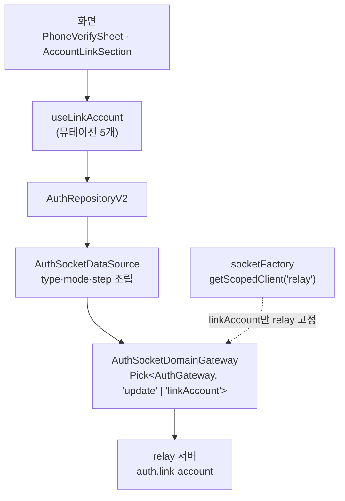
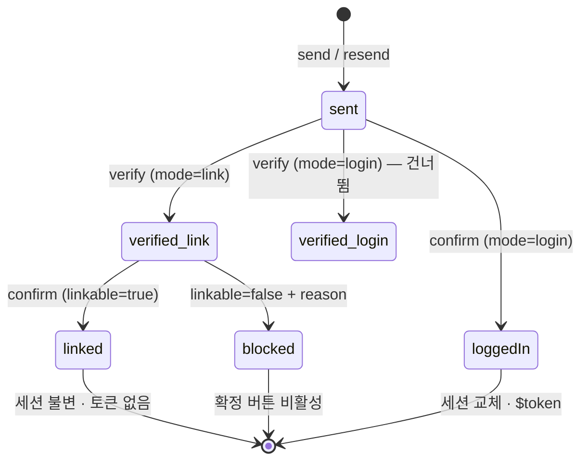
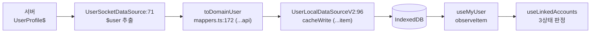

# 계정 연동 통합 경로 (`auth.link-account` · `link$`)

> 상태: Live · 최종 갱신: 2026-08-03 · 관련 ADR: [ADR-0042](../../../../docs/adr/0042-account-linking-unified-path-migration.md) · 시나리오 전수표: [account-linking-scenarios.md](../../../../docs/plans/account-linking-scenarios.md)
>
> 대상: `AuthSocketDomainGateway` · `AuthSocketDataSource` · `AuthRepositoryV2` · `useLinkAccount` · `useLinkedAccounts`

## 목적

계정 수단(번호·이메일·소셜)의 소유를 증명하는 자리를 **앱에서도 하나로** 만든다.

서버가 구 경로 둘(`auth.verify-hash-alias`·`auth.attach-social`)을 `auth.link-account` 하나로
합치고 옛것에 `@deprecated`를 달았다. 백엔드는 *"앱이 옮기면 한 벌로 지운다"*고 대기 중이므로,
이 문서가 다루는 이관이 그 제거의 전제다.

동시에 서버가 **`UserView.link$`** 를 열었다 — 이 유저가 어떤 수단을 달았는지 알려 주는 자리다.
그전까지 앱은 그걸 알 방법이 없어 localStorage 추측으로 대신했다.

이 문서가 소유하는 것:

- **수단·모드·단계 계약** — `type` × `mode` × `step`이 요청 하나를 정하는 규칙과 응답 유니온.
- **`linkAccount` 배선** — 게이트웨이 → 데이터 소스 → 리포지토리 → 훅, 그리고 relay 핀.
- **`link$` 읽기** — 어떤 경로로 오고, 왜 타입에 안 보이고, 없을 때 어떻게 물러나는가.

수단별 화면은 각자의 문서가 소유한다 — 번호는
[phone-verification.md](./phone-verification.md), 소셜은
[social-links.md](../account/social-links.md).

백엔드 계약 원본: `chatic-sockets-api/docs/specs/relay-server-invite/`(앱용 정본은
`05-client-guide.md`) · 정책 원본: `chatic-backend-api`
`feat/relay-server-user-invite-v2`의 `docs/specs/relay-server-user-invite/account-linking-design.md`.

## 설계 원칙

- **의도는 요청이 밝힌다. 응답을 열어 보고 분기하지 않는다.** `mode`가 `link`인지 `login`인지는
  호출부가 세션 역할로 정하고, 그 값이 곧 "이 증명이 끝나면 무엇이 되는가"다.
- **모드는 세션 역할에서 파생한다 — 기본값을 두지 않는다.** 게스트는 `login`, 메인유저는 `link`다.
  어긋나면 폴백이 아니라 에러이므로(메인유저+`login`=400, 게스트+`link`=403) `mode`를 필수 인자로
  두어 호출부가 잊을 수 없게 한다.
- **`verify`는 물어보는 자리, `confirm`은 커밋하는 자리.** `link`에서 막히는 이유를 응답으로
  주는 것은 `verify`뿐이고 `confirm`은 같은 상황을 409·403으로 던진다. 그래서 연동 화면은
  반드시 `verify`를 먼저 부른다.
- **`link$`는 힌트, 차단은 서버.** `link$`로 화면을 미리 고를 뿐이고, 진짜 판정은 `verify`의
  `linkable`과 `confirm`의 에러다.
- **"없음"과 "모름"을 절대 섞지 않는다.** `link$`가 안 오는 이유는 두 가지(프로필 미도착 ·
  서버가 그 자리를 짓지 않음)이고 둘 다 "수단이 없다"와 구별할 수 없다. 모르면 판정하지 않고
  이전 기준으로 물러난다.
- **패킷 조립은 데이터 소스가 독점한다.** 그 위 어느 층도 `type`·`mode`·`step` 문자열을 쓰지
  않는다. 조합의 성립 여부는 백엔드가 가리므로, 이 층은 유니온이 허용하는 조합만 짓고 나머지는
  타입이 거절하게 둔다.
- **에러 분기는 `errorCode`(HTTP status)로만 한다.** `getSocketErrorCode`
  (`apps/web/src/app/utils/errors.ts:20`)를 쓰고 메시지 문자열을 파싱하지 않는다.
- **번호·이메일·OTP·초대 코드는 요청 body에만 산다.** 로그·URL·쿼리 키에 남기지 않는다.

## 범위

**포함**

- `AuthSocketDomainGateway`의 `linkAccount` + 컴포지션 루트의 relay 핀
- `AuthSocketDataSource`의 5개 메서드(번호 send/verify/confirm, 소셜 verify/confirm)
- `AuthRepositoryV2`의 같은 5개 위임
- `useLinkAccount`(뮤테이션 묶음) · `useLinkedAccounts`(`link$` 3상태 판정)
- `MyUser` 타입의 `link$` 확장

**제외**

- **이메일 수단** — 서버가 발송을 `501`로 끊는다. 타입 자리만 지나가고 화면이 없다.
- **연동 해제** — 서버 미결정. `SOCIAL_UNLINK_ENABLED = false` 유지.
- **번호 변경 · 수단당 여러 계정 · 소셜/이메일의 `login` 모드** — 전부 서버 미결정.
- **디바이스 유저의 소셜 로그인** — 소켓에 없다. backend REST 경로이고
  [auth/README.md](./README.md)의 OAuth 흐름이 소유한다.
- **경계 타입을 backend-api로 통일하는 일** — `link$`만 읽는 쪽에서 넓힌다.
- **세션 토큰 설치** — `applySessionToken`이 소유한다([phone-verification.md](./phone-verification.md)).

## 시나리오

전수표는 [account-linking-scenarios.md](../../../../docs/plans/account-linking-scenarios.md)에 있다.
이 문서는 **경로가 갈리는 두 축**만 적는다.

### 1. `login` — 게스트가 메인유저가 된다 (번호만)

```ts
await send(phone, { mode: 'login', code }); // code는 초대 맥락에서만
await confirm(phone, otp, { mode: 'login' }); // → { loggedIn, isNew, $token }
```

**`verify`를 건너뛴다.** `login`의 `verify`는 `{ verified: true }`뿐이라 사용자가 얻는 것이 없고,
`confirm`이 같은 코드로 유효성까지 답한다. 그래서 6자리가 차면 곧바로 확정한다.

확정 응답의 `$token`으로 세션이 바뀐다 — `applySessionToken`이 web-core와 살아 있는 relay 소켓에
새 신원을 심은 **뒤에야** `onVerified`가 뜬다. `isNew`로 가입/복귀 첫 화면이 갈린다.

### 2. `link` — 메인유저가 수단을 하나 더 단다

```ts
await send(phone, { mode: 'link' }); // 소셜에는 이 단계가 없다
const c = await verify(phone, otp, { mode: 'link' }); // → { linkable, reason?, hint? }
if (c.linkable) await confirm(phone, otp, { mode: 'link' }); // → { linked, hint } — 토큰 없음
```

**`verify`를 반드시 거친다.** `linkable: false`면 확정 버튼을 끄고 `reason`을 보여 준다
(`'occupied'` = 그 계정이 남의 것, `'type-linked'` = 그 수단을 이미 다른 값으로 달아 둠).
`confirm`은 같은 상황을 409·403으로만 답하므로 물어보는 쪽이 낫다.

**토큰이 오지 않는다.** 세션이 그대로이므로 설치할 것이 없다.

### 3. `link$` 읽기 — 3상태로 답한다

```ts
const { phone, social, phoneHint, socialProvider } = useLinkedAccounts();
// phone·social: 'linked' | 'absent' | 'unknown'
```

`link$` 객체 자체가 없으면 `'unknown'`이다. 있으면 그 안의 항목 유무가 그대로 판정이다 — 서버가
뷰를 지었다는 뜻이므로 빠진 항목은 정말 없는 것이다.

**`'unknown'`에서 게이트를 걸면 안 된다.** 소셜로 가입한 기존 유저에게 소셜 연동을 다시 요구하고
(403 `type-linked`), 번호 유저에게 이미 가진 번호를 다시 인증하라고 하게 된다.

## 다이어그램

### 배선 (relay 핀)



`auth.update`는 **active 슬롯**에 남는다 — 어느 소켓이 살아 있든 그걸 인증하는 패킷이라서다.
`linkAccount`만 relay에 고정된다: 그것이 해석하는 메인유저가 relay 뒤 중앙 백엔드에 살기 때문이다
(`socketFactory.ts:57-61`).

### 단계 × 모드 → 응답



### `link$`가 앱까지 오는 길



전 구간이 spread다 — 필드 화이트리스트가 없어서 **모르는 필드가 버려지지 않는다.** 막는 것은
타입뿐이고, 읽는 쪽에서 넓혀 쓴다.

## 상세 구현

### 전송 계층

| 파일                                                                    | 역할                                                                                                                                                                                                            |
| ----------------------------------------------------------------------- | --------------------------------------------------------------------------------------------------------------------------------------------------------------------------------------------------------------- |
| `libs/data/src/data/remote/gateways/socket.ts:21`                       | `AuthSocketDomainGateway = Pick<AuthGateway, 'update' \| 'linkAccount'>`. 구 둘을 **일부러 빼 둔다** — `AuthGateway`에는 아직 `@deprecated`로 남아 있고, 이 `Pick`이 호출부가 그걸 집는 것을 막는 유일한 장치다 |
| `libs/app-runtime/src/data/factories/socketFactory.ts:57-61`            | `linkAccount: relayAuthGateway.linkAccount`. 목적지를 컴포지션 시점에 고정해 호출부가 route 인자로 잊을 수 없게 한다                                                                                            |
| `libs/data/src/data/remote/socket-data-sources/AuthSocketDataSource.ts` | `type`·`mode`·`step` 조립을 **독점**한다. `sendPhoneCode`(`resend`로 step 파생) · `verifyPhoneCode` · `confirmPhoneCode` · `verifySocialAccount` · `confirmSocialAccount`                                       |
| `libs/data/src/data/repositories-v2/AuthRepositoryV2.ts`                | 같은 5개를 위임한다. remote-only — 여기엔 캐시할 엔티티가 없다(ADR-0036)                                                                                                                                        |

**미지정 발송 스위치는 페이로드에서 빠진다.** `sms: false`를 리터럴로 실으면 채널이 꺼져 버리므로,
지정한 것만 넘겨 서버 기본값(`dryRun=false`·`sms=true`·`slack=true`)이 살게 한다.

**초대 코드는 `send`에만 실린다.** 증명 단계(`verify`·`confirm`)의 유니온에는 그 자리가 아예 없다 —
번호·초대 대조는 발송에서 한 번 일어난다. 구 경로는 `check`에도 동봉했으나 새 계약에서는 불가능하고,
타입이 이를 강제한다.

### 앱 훅

| 파일                                          | 역할                                                                                                                                                                              |
| --------------------------------------------- | --------------------------------------------------------------------------------------------------------------------------------------------------------------------------------- |
| `apps/web/src/app/hooks/useLinkAccount.ts`    | 5개 뮤테이션 + pending 플래그. 패킷의 단계를 네 호출로 노출하고 `mode`를 인자로 받는다                                                                                            |
| `apps/web/src/app/hooks/useLinkedAccounts.ts` | `link$` → `LinkedState` 3상태(`'linked'`·`'absent'`·`'unknown'`) + 표시용 `phoneHint`·`socialProvider`                                                                            |
| `apps/web/src/app/hooks/useMyUser.ts:12`      | `MyUser = DomainUser & { photo?; email?; link$? }`. 경계 타입은 socials-api의 `UserView`인데 페이로드는 backend-api의 `MyUserView`라, `photo`/`email`이 이미 쓰는 기법으로 넓힌다 |

`link$`가 타입에 안 보이는 대가: 서버가 모양을 바꿔도 컴파일이 잡아 주지 않는다. 경계 타입을
통일하는 일은 이 작업의 범위를 넘어 미뤄 두었다.

### 첫 페인트의 공백

`user.profile` 응답이 오기 전 구간은 토큰 시드만 있다(`useSeedMyUserCache.ts:22-29`). 그래서
`link$`가 그때는 없을 수 있고, `'unknown'` 규칙이 이 구간도 그대로 덮는다.
`LoggedInView.$token`이 `UserTokenView extends UserView`라 서버가 그 자리를 채우면 해소되지만
보장은 없다.

**`cacheWrite`는 merge다**(`UserLocalDataSourceV2.ts:96-102`). 한번 쓰인 `link$`는 이후 응답이
그 자리를 빼먹어도 캐시에 남는다. 지금은 연동 해제가 없어 무해하지만, 해제를 열 때 replace
시맨틱을 함께 판단해야 한다.

## 검증 방법

- `npx jest --config libs/data/jest.config.js --runInBand --watchman=false --testPathPatterns "Auth"` —
  데이터 소스의 조립(모드 축·step 파생·미지정 스위치 누락·증명 단계에 `code` 부재)과 리포지토리 위임.
  `linkable: false`를 에러로 바꾸지 않는다는 계약도 여기 고정돼 있다.
- `npx jest --config libs/app-runtime/jest.config.js --runInBand --watchman=false --testPathPatterns "socketFactory"` —
  **relay 핀 계약**. 네 단계 전부가 relay 슬롯으로 가고 `auth.update`만 active에 남는지. 게이트웨이
  번들을 내주지 않으므로(ADR-0036) 데이터 소스 경유로 관측한다.
- `npx jest --config apps/web/jest.config.js --runInBand --watchman=false --testPathPatterns "PhoneVerify|useSocialLinks|ContactInvitePage"` —
  모드별 경로, `linkable: false` 카피, `link$` 3상태 게이팅.
- `npx tsc -b apps/web/tsconfig.app.json` — 프로젝트 레퍼런스 빌드. 라이브러리 `dist`가 낡은
  상태에서 `--noEmit -p`를 쓰면 stale `.d.ts`를 읽어 실재하지 않는 에러가 난다.
- 수동: 게스트로 번호 로그인 → 초대 발급까지 403 없이 / 소셜 가입 유저로 마이페이지에서 번호 연동
  (`verify`가 `linkable`을 답하는지) / `link$`가 안 오는 환경에서 섹션이 조용히 접히는지.

## 서버에 확인이 필요한 것

셋 다 착수를 막지 않는다 — 전부 "없으면 물러난다"로 설계했다.

| #   | 무엇                                           | 답이 "아니오"면                                                                                                    |
| --- | ---------------------------------------------- | ------------------------------------------------------------------------------------------------------------------ |
| 1   | 기존 유저 `link$` **백필 패치**가 돌았나       | 기존 유저의 `link$`가 비어 발급 게이트가 사실상 동작하지 않는다. `isGuest` 기준으로 물러난다                       |
| 2   | `user.profile`이 `$user.link$`를 **실어 오나** | `link$` 읽기가 성립하지 않는다. `GET /users/0/profile`(`libs/web-core/src/api/auth.ts:128`, 죽은 코드)이 폴백 카드 |
| 3   | `invite.get`이 `last4`를 **실어 오나**         | 발송 전 사전 대조를 건너뛰고 서버 400에 의존한다                                                                   |
