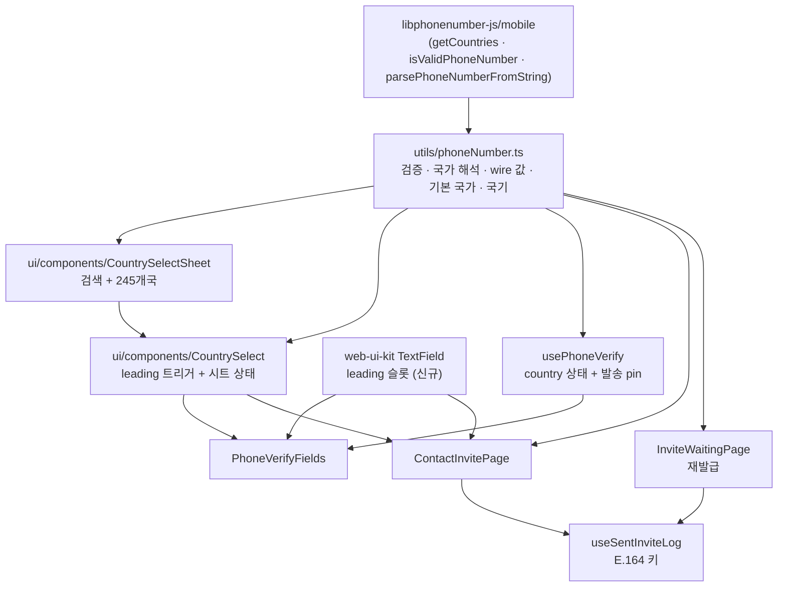
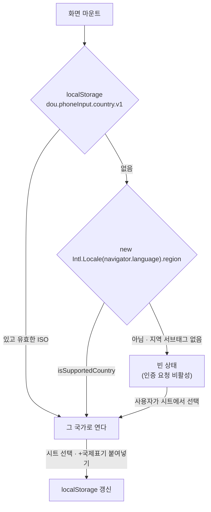
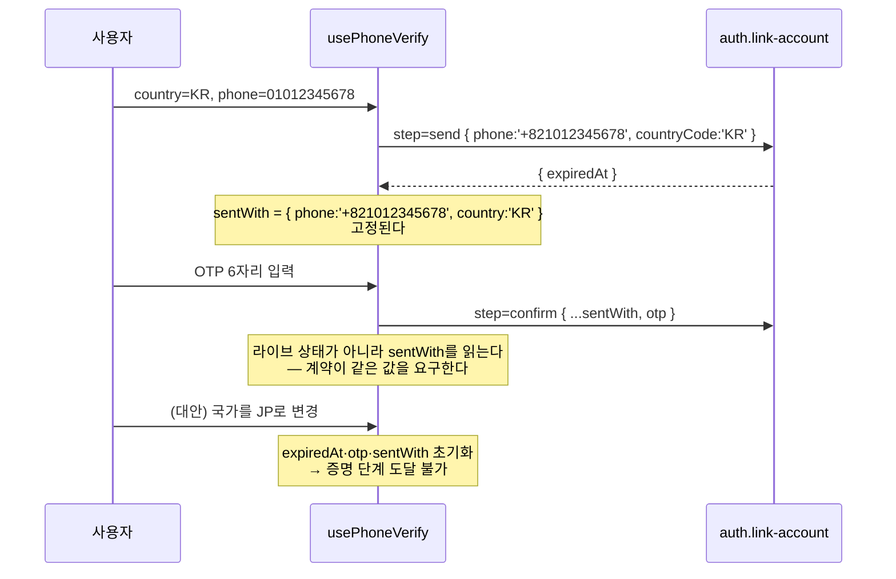

# 국제 전화번호 입력 (국가 선택 · `countryCode` 전송)

> 상태: Live · 최종 갱신: 2026-08-05 · 관련 ADR: [ADR-0044](../../../../docs/adr/0044-international-phone-input-country-code.md)
>
> 소비 화면 문서: [phone-verification.md](./phone-verification.md)(PhoneVerify\*) ·
> [relay-invite-sender.md](../invite/relay-invite-sender.md)(ContactInvitePage)

## 목적

앱의 번호 입력은 전부 한국 번호를 전제했다 — `010/011/016/017/018/019` prefix에 10–11자리다.
서버는 이미 `auth.link-account`·`invite.create` 양쪽에서 `countryCode`(ISO alpha-2, 미지정 시 `KR`)를
받고 데이터 층도 뚫려 있었는데, **UI가 값을 한 번도 넣지 않아** 실제 호출이 항상 서버 기본값으로 처리됐다.

이 문서는 그 끊겼던 구간 — **국가를 고르고, 그 국가로 검증하고, 그 국가를 서버에 실어 보내는 모듈**을
소유한다. 두 화면(번호 인증 · relay 초대 발급)이 이 모듈을 함께 쓴다.

부수적으로 auth 쪽 유틸 사본에는 `normalizeKoreanPhone`이 없어 `+82…`를 붙여넣으면 검증에
실패했다. 이 모듈이 그 입력을 받아낸다.

백엔드 계약 원본: `chatic-sockets-api/docs/specs/relay-server-invite/05-client-guide.md` §계약.

## 설계 원칙

- **국가는 번호와 같은 생명주기다.** 국가가 바뀌면 그 번호로 발송된 인증 코드는 무효다 —
  번호를 고쳤을 때 `expiredAt`을 날리는 것과 같은 처리를 국가 변경에도 적용한다.
- **발송에 쓴 국가로 증명한다.** 계약이 "발송과 증명에 같은 값"을 요구한다. 라이브 상태를 다시
  읽지 않고 **발송 시점의 `{phone, country}`를 고정(pin)해** 증명 단계가 그것을 쓴다.
- **국가 목록·검증 규칙을 우리가 유지하지 않는다.** `libphonenumber-js`가 돌려주는 코드가
  backend의 `CountryCode`와 같은 ISO alpha-2다. 매핑 테이블을 두면 국가가 늘 때 조용히 드리프트한다.
- **backend의 `CountryCode` 유니온을 import 하지 않는다.** relay-server-invite `02-design.md` D4가
  클라이언트 타입을 외부 패키지에 얽지 말라고 못박은 항목이다. 로컬에서는 `string`으로 다루고
  최종 판정은 서버 `400`에 맡긴다.
- **입력은 원시 숫자 그대로 둔다.** 디자인이 하이픈 없는 입력을 지정했고
  ([phone-verification.md](./phone-verification.md) `상세 구현`이 그 결정을 이미 기록한다) 국가 도입이
  그것을 뒤집을 이유가 없다. **`AsYouType` 포맷터는 쓰지 않는다** — `digitsOnly`/`phoneHint` 문구가
  그대로 유효하다.
- **국제 표기 붙여넣기는 국가를 이긴다.** `+81…`을 붙여넣으면 그 값이 곧 국가 선언이므로 선택기를
  거기에 맞춘다. 선택기와 필드가 서로 다른 국가를 가리키는 순간을 만들지 않는다.
- **빈 국가는 에러가 아니라 미완성이다.** 국가가 없으면 검증할 수 없으므로 `인증 요청`이 비활성이다.
  붉은 문구를 띄우지 않는다 — 사용자는 아직 아무것도 틀리지 않았다.
- **모바일 번호만 받는다.** SMS로 코드를 보내는 흐름이다. 전 세계로 넓히면서 유선번호를 통과시키면
  퇴행이다(현행 KR 규칙이 모바일 prefix만 허용했다).
- **wire에는 E.164를 통째로 보낸다(2026-08-05 정정).** 원안은 로컬 형태(`010…`) + `countryCode`를
  택했으나, `chatic-backend-api`의 실제 구현(`asE164Phone`)이 `countryCode`를 로컬(`0…`) 번호에만
  적용하고 `+`로 시작하는 문자열은 그대로 받아들인다는 것을 직접 추적으로 확인했다. 국가별 트렁크
  규칙(선행 `0` 유무)이 갈리는 245개국 중 139개국은 `formatNational()`에 선행 0이 없어, 로컬 형태 +
  `countryCode` 조합이 서버에서 400으로 거절된다(ADR-0044 §5 정정). E.164는 그 갈림에 기대지 않는
  유일한 형태라 KR을 포함한 모든 국가에서 이 형태로 통일한다 — **KR 사용자도 wire 값이 바뀐다**
  (`01012345678` → `+821012345678`). `countryCode`는 계약이 명시한 필드라 계속 함께 보낸다.
- **번호 메타데이터는 초기 청크에 들어가지 않는다.** 이 모듈을 끌어오는 모든 경로는 lazy 청크
  아래에 있어야 한다 — 배럴 재노출과 eager 라우트가 그 규칙을 깨는 두 가지 방법이다(아래 참고).

## 범위

**포함**

- 공용 유틸 `apps/web/src/app/utils/phoneNumber.ts` — 검증·국가 해석·wire 값 생성·기본 국가 결정
- 국가 선택 시트 `ui/components/CountrySelectSheet.tsx`(검색 포함) +
  필드 안 트리거 `ui/components/CountrySelect.tsx`
- `TextField`에 `leading` 슬롯 추가(web-ui-kit)
- `usePhoneVerify`에 국가 상태 + 발송 시점 pin, `send`/`verify`/`confirm`에 `countryCode` 전달
- `ContactInvitePage` 국가 선택 + `invite.create`에 `countryCode` 전달,
  `useRelayInvites`의 좁힌 입력 타입 해제
- `useSentInviteLog` 키를 E.164로 전환(`STORAGE_KEY` `.v1` → `.v2`, 구 키 제거),
  `InviteWaitingPage` 재발급이 그 키에서 국가를 복원
- `contactInvite.maskedPhone`의 `010-` 리터럴 제거(ko/en)
- 새 i18n 키(`phoneInput.*`) + 국가를 짚는 불일치 문구
- `RelayInviteAccept`의 `PhoneVerifyScreen` 코드 분할 — 메타데이터를 초대 수락 콜드 패스에서 뺀다

**제외**

- **cloud 초대 경로**(`AddFriendSheet` · `channels/InvitePage` · desktop `InviteDialog`) —
  `user.invite`/`user.invite-batch` 요청 타입에 `countryCode` 자리가 없다. 서버 선행 작업이 필요하다.
- **KR 전용 유틸 사본 정리**(`auth/utils/phone.ts` · `channels/utils/koreanPhone.ts` ·
  desktop `InviteDialog` 내부 사본 · `AddFriendSheet`의 상수 사본) — cloud 경로가 계속 쓴다(ADR-0044 §7).
- **`AsYouType` 표시 포맷** — 설계 원칙 참고.
- **backend 수정** — relay-server-invite `00-requirement.md`의 비목표.
- **수락 화면의 국가 자동 고정** — `MyInviteView`에 `countryCode`가 없어 불가능하다(후속).
- **`inviteLast4` 대조 로직** — 뒤 4자리 비교라 국가와 무관하게 동작한다. 손대지 않았다.

## 시나리오

### S1. 국내 사용자 — 기본 국가가 이미 맞다

1. 번호 인증 화면 진입. 국가 선택기가 `🇰🇷 +82`를 이미 들고 있다 — 직전 선택이 없으면
   `navigator.language`(`ko-KR`)의 지역 서브태그에서 왔다.
2. `01012345678`을 친다. `isValidMobileNumber('01012345678', 'KR')`이 참이 되는 순간
   `인증 요청`이 활성화된다.
3. 발송 요청에 `{ phone: '+821012345678', countryCode: 'KR' }`이 실린다 — **`phone` 값은 이제
   E.164다**(2026-08-05 정정, ADR-0044 §5). 서버의 `countryCode` 해석은 로컬 형태에만 적용되므로
   이 값은 국가 판정에 영향받지 않는다.
4. 이후는 기존 인증 흐름 그대로([phone-verification.md](./phone-verification.md) 시나리오 1).

### S2. 해외 번호 — 국가를 바꾼다

1. 선택기 탭 → 국가 시트가 올라온다. 상단에 고정된 검색창, 아래로 245개국이 현지화된 이름순으로
   정렬돼 있다. 각 행은 `국기 · 국가명 · +다이얼코드`.
2. `일본`·`jp`·`81`·`+81` 중 아무거나 치면 목록이 좁혀진다. 행 탭 → 시트가 닫히고 선택기가
   `🇯🇵 +81`이 된다.
3. **선택은 localStorage에 남는다.** 다음에 이 화면을 열면 `JP`로 열린다.
4. `09012345678` 입력 → `isValidMobileNumber(…, 'JP')` 참 → 발송에
   `{ phone: '+819012345678', countryCode: 'JP' }`.

### S3. 국제 표기를 붙여넣는다 — 선택기가 따라간다

1. 선택기가 `KR`인 상태에서 `+819012345678`을 붙여넣는다.
2. 입력이 `+`로 시작하고 파싱에 성공하므로 **선택기가 `JP`로 바뀌고 필드는 로컬 형태
   `09012345678`로 다시 쓰인다.** 사용자는 한 동작으로 국가와 번호를 함께 넣은 셈이다.
   그 국가는 명시 선택과 똑같이 localStorage에도 남는다.
3. `+82…`를 붙여넣는 경우도 같다 — 예전에는 검증에 실패하던 입력이 이 경로로 살아난다.
4. 파싱이 실패하면(불완전한 `+8`) 아무것도 바꾸지 않고 입력만 그대로 남긴다.

### S4. 국가를 정할 수 없다 — 빈 상태

1. 직전 선택도 없고 `navigator.language`가 `en`처럼 지역 없이 오면 선택기가 빈 상태로 열린다
   (`국가` placeholder).
2. 번호를 아무리 쳐도 `인증 요청`(초대 발급 화면에서는 `완료`)이 비활성이다. 에러 문구는 없다.
3. 국가를 고르는 순간 검증이 돌고 버튼이 살아난다.

### S5. 코드를 받은 뒤 국가를 바꾼다

1. `KR`로 발송해 타이머가 도는 중에 선택기를 `JP`로 바꾼다.
2. **발송된 코드가 무효화된다** — `expiredAt`·`otp`·에러·`linkVerified`·`sentWith`가 모두
   초기화되고, 인증번호 필드가 다시 잠긴다. 번호를 고쳤을 때와 같은 처리다.
3. 새 국가로 다시 `인증 요청`을 해야 한다. 증명 단계가 발송에 쓰지 않은 국가로 나가는 조합이
   만들어지지 않는다.

### S6. 초대 발급 — 국가가 초대에 실린다

1. `ContactInvitePage`의 번호 필드도 같은 선택기를 갖는다.
2. 제출 시 `createInvite({ phone: '+819012345678', name, countryCode: 'JP' })` — `phone`은
   E.164(2026-08-05 정정), `countryCode`는 계약이 명시한 필드라 함께 보낸다.
3. 로컬 발급 이력도 같은 **E.164** 값을 키로 기록하고, 재초대 감지(`findByPhone`)도
   같은 키로 조회한다 — 국가가 다르면 로컬 형태가 충돌할 수 있어서다.
4. SMS 작성기에도 **E.164**를 넘긴다. 로컬 형태는 발신자 통신사가 같은 나라일 때만 도달한다.
5. 대기 화면의 `초대 다시 하기`는 이력 키(E.164) 자체를 `phone`으로 재사용하고, 거기서 국가만
   되살려(`readInternationalInput`) `{ phone: logEntry.phone, countryCode }`로 재발급한다 —
   항목에 국가 필드를 따로 두지 않는 이유다.

### S7. 수락자가 다른 국가로 인증을 시도한다 — 알려진 갭

1. 발급자가 `JP`로 초대를 만들었다. 수락자의 화면은 자기 locale대로 `KR`로 열린다.
2. `inviteLast4`가 우연히 맞으면 사전 대조를 통과하고 발송이 나간다.
3. 서버가 전체 번호를 대조해 **`400`으로 거절**한다. 문구가 "초대받은 번호가 아니에요.
   **국가와 번호를** 확인해 주세요"로 국가를 함께 짚는다 — 이것이 오늘 가능한 완화책의
   전부다(`MyInviteView`에 국가가 없다).

## 다이어그램

### 모듈 구성



### 기본 국가 결정



### 발송 시점 고정 (pin)



## 상세 구현

### 라이브러리 선택 — `libphonenumber-js/mobile`

`/min`이 아니라 `/mobile`인 이유는 유선번호 때문이다:

| 서브패스  | metadata gzip | `isValidPhoneNumber('0212345678','KR')` (KR 유선) |
| --------- | ------------- | ------------------------------------------------- |
| `/min`    | 19.8KB        | **`true`** — 유선을 통과시킨다                    |
| `/mobile` | 24.5KB        | `false`                                           |
| `/max`    | 40.6KB        | `false`                                           |

KR 규칙이 모바일 prefix만 허용했고
[`PhoneVerifyScreen.test.tsx`](../../../src/app/features/auth/components/PhoneVerifyScreen.test.tsx)가 그것을
고정한다. `/min`을 쓰면 전 세계에서 유선번호로 SMS 인증을 시도할 수 있게 되므로 4.7KB를 더 쓴다.

**jest는 손대지 않았다.** `libphonenumber-js@1.13.10`의 `exports`에 `browser` 조건 키가 없어
(top-level `browser` 필드도 없다) jsdom의 `customExportConditions: ['browser']`가 매치되지 않고
`require` → `index.cjs`(실제 CJS)로 떨어진다.

### 메타데이터를 초기 청크 밖에 두기 — 실측이 정한 세 가지

이 라이브러리는 [`vite.config.mts`](../../../vite.config.mts)의 `manualChunks`에 **넣지 않는다.**
그건 초기 그래프에 들어가는 vendor 묶음이다. 대신 소비 경로 전부를 lazy 청크 아래에 두는데,
그러려면 세 곳을 지켜야 한다 — 셋 다 빌드 산출물로 확인했다.

1. **`utils/index.ts` 배럴에 `./phoneNumber`를 재노출하지 않는다.** 이 배럴은 eager 경로에 있어서,
   재노출하는 순간 메타데이터가 진입 청크로 올라온다.
2. **`ui/components/index.ts` 배럴에 `CountrySelect*`를 재노출하지 않는다.** 같은 이유다.
   두 소비 화면은 구체 파일 경로로 import 한다(어차피 jsdom에서 이 배럴은 `@chatic/assets` 때문에
   로드되지 않아, 리포 관습과도 일치한다).
3. **`RelayInviteAccept`가 `PhoneVerifyScreen`을 `React.lazy`로 가져온다.** 나머지 소비자
   (`ContactInvitePage`·`LoginPage`·`AccountLinkSection`)는 이미 `React.lazy` 라우트
   (`InviteRoutes`·`MyPageRoutes`) 아래에 있지만, **초대 수락 화면만 eager다** —
   [`CommonRoutes.tsx`](../../../src/app/routes/CommonRoutes.tsx)가 "초대받은 사람의 첫 화면이라
   청크 fetch를 얹지 않는다"고 명시적으로 정한 자리다. 그 결정을 지키면서 메타데이터만 빼려면
   **첫 화면이 아닌 단계**를 쪼개면 된다: `phase === 'verifying'`은 `loading` → 수락 화면을
   지나야 도달하므로, 여기서의 lazy는 콜드 패스에 fetch를 얹지 않는다.

실측(`npx nx build web`):

|                            | 진입 청크 raw | 진입 청크 gzip | 번호 메타데이터 청크                                |
| -------------------------- | ------------- | -------------- | --------------------------------------------------- |
| 이 변경 전                 | 1,140,807     | 334.7 KB       | —                                                   |
| 배럴 재노출 + eager import | 1,280,422     | 369.9 KB       | (진입 청크에 포함)                                  |
| **현재**                   | **1,131,585** | **331.1 KB**   | `PhoneVerifyFields-*.js` 147,227 / **38.3 KB gzip** |

진입 청크가 오히려 3.6KB 줄었다 — `PhoneVerifyScreen` 이하가 통째로 lazy 청크로 내려갔기 때문이다.

### `apps/web/src/app/utils/phoneNumber.ts`

`errors.ts`·`placeProfile.ts`와 같은 자리 — 두 피처가 함께 쓰는 순수 헬퍼다.

| export                                | 역할                                                                                                                                              |
| ------------------------------------- | ------------------------------------------------------------------------------------------------------------------------------------------------- |
| `PhoneCountry = string`               | ISO alpha-2. **backend 유니온을 import 하지 않는다**(설계 원칙). 라이브러리의 `CountryCode`는 타입 전용 import로만 쓰고 경계에서 캐스팅한다       |
| `PhoneCountryOption`                  | 시트 한 행 — `{ code, name, dialCode }`                                                                                                           |
| `listPhoneCountries(lang)`            | `getCountries()` 245개 → 옵션 배열. 이름은 `Intl.DisplayNames([lang], {type:'region'})`, 정렬은 `Intl.Collator(lang)`. 결과는 `lang`별로 메모이즈 |
| `phoneCountryDialCode(code)`          | `+82`. 미지원 코드면 `null` — 트리거 버튼용                                                                                                       |
| `isValidMobileNumber(input, country)` | `/mobile` 메타데이터의 `isValidPhoneNumber`. 국가가 없으면 `false`                                                                                |
| `toE164(input, country)`              | `.number`(E.164). **wire 값이자** `useSentInviteLog` 키이자 SMS 작성기 입력 — 셋 다 같은 값을 쓴다(2026-08-05 정정 이후 `toWirePhone`은 삭제됐다) |
| `readInternationalInput(input)`       | `+`로 시작하면 파싱해 `{ country, national }`을, 아니면 `null`. S3의 붙여넣기 경로이자 재발급의 국가 복원 경로                                    |
| `resolveDefaultCountry()`             | 저장값 → `Intl.Locale(navigator.language).region` → `null`. 둘 다 `isSupportedCountry`로 검증                                                     |
| `rememberCountry(code)`               | localStorage `dou.phoneInput.country.v1`. 저장 실패(프라이빗 모드)는 삼킨다                                                                       |
| `toFlagEmoji(code)`                   | ISO 코드 → regional indicator 쌍. 에셋이 없다                                                                                                     |

`Intl.DisplayNames`/`Intl.Collator`/`Intl.Locale`이 없거나 던지는 런타임에서는 ISO 코드를 이름
자리에 그대로 쓰고 기본 정렬로 떨어진다. `toE164`는 호출부가 이미 `isValidMobileNumber`로
걸렀다는 전제이며, 그래도 파싱이 실패하면 입력의 숫자만 돌려준다.

### `TextField`의 `leading` 슬롯 (web-ui-kit)

[`TextField.tsx`](../../../../../libs/web-ui-kit/src/foundations/input/TextField.tsx)의 테두리 컨테이너는 이미
`flex w-full items-center gap-1`이다. `trailing`(컨테이너의 마지막 자식)과 대칭으로
**`<input>` 바로 앞**에 넣는다:

```tsx
{
    leading && <span className="shrink-0 px-1">{leading}</span>;
}
```

`<input>`이 `min-w-0 flex-1`이라 레이아웃 변경이 없다. 컨테이너의 상태 테두리가
`focus-within:border-focus-border`이므로 **슬롯 안의 버튼에 포커스가 가면 필드 전체가 포커스
테두리를 얻는다 — 의도한 동작이다**(국가와 번호가 하나의 입력 그룹이다).

컨테이너 안 순서는 `leading → input → 문자수 카운터 → IconCheck → trailing`이다. 카운터는
`maxLength`가 있을 때만 렌더되고 번호 필드는 `maxLength`를 넘기지 않으므로 이 화면에는 나오지 않는다.

### `CountrySelectSheet` · `CountrySelect` (`apps/web/src/app/ui/components/`)

**두 파일로 나눴다.** 시트는 `{open, onOpenChange, value, onSelect}`만 받는 순수 표현이고,
`CountrySelect`가 트리거 버튼(국기 · 다이얼코드 · caret)과 시트 열림 상태를 함께 소유한다.
그래야 소비 화면이 `leading={<CountrySelect … />}` 한 줄로 끝나고, 특히 `ContactInvitePage`가
**폼 바깥에 형제 노드를 하나도 추가하지 않는다** — 그 페이지의 단일 `return` + 고정 자식 슬롯
구조가 `PhoneVerifySheet`를 승격 도중 언마운트시키지 않는 장치다
([relay-invite-sender.md](../invite/relay-invite-sender.md) `프로필 전제조건 게이트`).

시트는 `BottomSheet`(web-ui-kit) 위에 얹는다. 두 가지가 결정 사항이다.

**검색창은 `children`의 첫 요소를 `sticky`로 붙인다 — ui-kit에 `header` prop을 만들지 않는다.**
`BottomSheet`의 본문은 `min-h-0 flex-1 overflow-y-auto` 하나이고 그것이 스크롤 컨테이너다. 그
직계 자식에 `sticky top-0 z-10 bg-surface`를 주면 245행 위에 고정된다. ui-kit 변경을 `leading`
하나로 끝내기 위해 이 쪽을 택했다. 검색 필드는 기존
[`SearchInput`](../../../../../libs/web-ui-kit/src/foundations/input/SearchInput.tsx)을 재사용한다.

**가상 스크롤을 넣지 않는다.** 245행의 단순 버튼이고, 리포에 가상 스크롤 의존성이 없으며
[`channels/InvitePage`](../../../src/app/features/channels/pages/InvitePage.tsx)가 연락처 목록을 이미 평범한
`.map()`으로 그린다. 필터도 같은 화면의 관습을 따라 `useMemo` + `toLowerCase().includes()`이고
디바운스를 두지 않는다. 검색은 **국가명 · 다이얼코드(`81`·`+81` 둘 다) · ISO 코드**에 걸린다 —
이름이 한국어로 현지화돼 있어 `jp` 같은 라틴 질의를 받아 주려면 코드 매칭이 필요하다.

기존 [`SheetOption`](../../../../../libs/web-ui-kit/src/composites/overlay/SheetOption.tsx)은 라벨 한 줄만
받으므로 쓰지 않고 이 컴포넌트가 자체 행을 그린다. 국기 이모지를 렌더하지 않는 플랫폼
(Windows 브라우저)에서는 `KR` 두 글자로 보이는데, 국가명이 옆에 있으므로 정보 손실이 없다.

### `usePhoneVerify`

| 항목                               | 구현                                                                                                                   |
| ---------------------------------- | ---------------------------------------------------------------------------------------------------------------------- |
| 상태                               | `country: PhoneCountry \| null`(초기값 `resolveDefaultCountry()`)                                                      |
| 상태                               | `sentWith: { phone, country } \| null` — 발송 성공 시 고정                                                             |
| `invalidateOutstandingCode()`      | `expiredAt`·`sentWith`·`otp`·에러·`linkVerified`를 함께 비운다. `handlePhoneChange`와 `handleCountryChange`가 공유한다 |
| `handleCountryChange`              | `rememberCountry` + 위 무효화                                                                                          |
| `handlePhoneChange`                | `readInternationalInput`이 국가를 돌려주면 국가·저장값·필드를 함께 갱신(S3) 후 무효화                                  |
| `canRequestCode`                   | `isValidMobileNumber(phoneInput, country) && !codeSent && !isBusy`. 국가가 `null`이면 자연히 `false`                   |
| `handleSend`                       | `toE164(phoneInput, country)` + `countryCode: country`. 성공 시 `sentWith` 고정                                        |
| `handleResend`                     | **`sentWith`를 다시 보낸다.** 재전송은 같은 번호에 대한 새 코드다                                                      |
| `handleVerifyStep`/`handleConfirm` | **`sentWith`를 읽는다** — 라이브 입력이 아니다. `sentWith`가 없으면 아예 나가지 않는다                                 |
| `inviteLast4` 대조                 | `toE164` 결과의 뒤 4자리로 비교. E.164도 로컬 형태와 끝 4자리가 같으므로 로직 변경 없음                                |
| `fields` 반환                      | `country`, `onCountryChange` 추가                                                                                      |

`PHONE_DIGITS_MAX`(11)는 KR 상수라 더 쓰지 않는다. `PHONE_INPUT_MAX`(20)는 그대로다 —
`+`와 국제 자릿수를 감당한다.

증명 단계가 `sentWith`를 읽는 것이 이번 변경의 핵심 교정이다. 이전 코드는 증명에도 라이브
`phoneDigits`를 넘겼으므로, 계약이 요구하는 "발송과 같은 값"이 상태 무효화에만 의존했다.

### `ContactInvitePage` · `useRelayInvites`

- 국가 상태를 페이지가 들고, 번호 `TextField`에 `leading`으로 `CountrySelect`를 넘긴다.
- 검증이 통과하면 한 번호를 `IssueTarget`(`{country, e164}`)으로 묶고 이후 경로가 전부 그것을
  나른다. 재초대 다이얼로그도 이 값을 들고 있다가 재발급에 쓴다. (2026-08-05 정정 전에는 로컬
  형태 `phone` 필드도 들고 있었으나, wire가 E.164로 바뀌면서 `e164` 하나로 충분해졌다.)
- `createInvite({ phone: target.e164, name, countryCode: target.country })`,
  `record`/`findByPhone`/`sendInviteMessage`도 전부 같은 `e164` 값.
- `channels/utils/koreanPhone`에 대한 이 페이지의 import가 사라졌다(모듈 자체는 cloud 경로가 쓴다).
- `완료` 비활성 조건에 `!country`가 들어간다 — 빈 국가는 에러가 아니라 미완성이다(S4).
- [`useRelayInvites`](../../../src/app/hooks/useRelayInvites.ts)가 `RelayInviteCreateInput`
  (`{ phone; name; countryCode? }`)을 export 하고 `mutationFn`이 그것을 받는다.
  `InviteRepositoryV2.create`는 이미 받고 있었다.

### `useSentInviteLog` · 재발급

[`useSentInviteLog`](../../../src/app/hooks/useSentInviteLog.ts)는 zustand `persist`를 쓰지 않고
localStorage를 직접 읽고 쓴다 — `version`/`migrate` 훅이 없다.

- `STORAGE_KEY`가 `dou.relayInvite.sentLog.v2`다. 키를 바꾸는 것이 곧 마이그레이션이고,
  구 항목은 자연 소멸한다(ADR-0044 §6 — 로컬 편의 캐시일 뿐이다).
- `readStoredLog()`가 첫 읽기에서 `dou.relayInvite.sentLog.v1`을 지운다. 안 그러면 죽은 데이터가
  영구히 남는다.
- 항목 형태(`{inviteId, name}`)는 그대로다 — 국가는 **키가 이미 들고 있다.**
  [`InviteWaitingPage`](../../../src/app/features/invite/pages/InviteWaitingPage.tsx)의 재발급은
  `readInternationalInput(logEntry.phone)`으로 국가만 되살리고, `phone`은 로그 키(`logEntry.phone`)
  자체를 그대로 재사용한다 — wire가 E.164인 지금은 로컬 형태로 되돌릴 필요가 없다(2026-08-05
  정정). 복원에 실패하면(구 형식 키가 남아 있는 경우) `reissueMissingLog` 안내로 떨어진다.

### i18n

**값만 바꾸고 키는 유지한다.** 화면 테스트가 `t`를 키 그대로 echo하도록 스텁하고 있어, 키를
바꾸면 단언이 깨지지만 값을 바꾸면 깨지지 않는다.

| 키                                                                                        | 조치                                                                                                |
| ----------------------------------------------------------------------------------------- | --------------------------------------------------------------------------------------------------- |
| `contactInvite.maskedPhone`                                                               | ko/en 모두 `"010-****-{{last4}}"` → `"****-{{last4}}"`                                              |
| `phoneVerify.inviteMismatch`                                                              | 국가를 함께 짚는 문구로(S7)                                                                         |
| `phoneVerify.phoneInvalidFormat`                                                          | "올바른 휴대폰 번호" → "선택한 국가의 휴대폰 번호"                                                  |
| `phoneVerify.digitsOnly` · `contactInvite.phoneHint` · `contactInvite.phoneInvalidFormat` | **유지** — `AsYouType`을 쓰지 않고, 후자는 이미 국가 중립이다                                       |
| `phoneInput.*` (신규)                                                                     | `countrySheetTitle` · `countrySearchPlaceholder` · `countryPlaceholder`(빈 상태 버튼) · `noResults` |

ko 카피의 "휴대폰"은 유지한다 — 모바일 전용 규칙(`/mobile` 메타데이터)이 그대로라 사실에 맞는다.

## 검증 방법

```bash
npx jest --config apps/web/jest.config.js --testPathPatterns "utils/phoneNumber|ui/components/CountrySelect|features/auth|features/invite|hooks/useSentInviteLog"
```

- `utils/phoneNumber.test.ts` — KR/JP/US/GB 유효, KR 유선(`0212345678`) 거절,
  `toE164('01012345678','KR') === '+821012345678'`(wire=E.164 회귀), `+82`/`+81` 붙여넣기,
  기본 국가 3분기, 목록 현지화·정렬·메모이즈
- `ui/components/CountrySelect*.test.tsx` — 245행 렌더, 이름·다이얼코드·ISO 검색, 빈 결과,
  선택 시 닫힘, 빈 상태 placeholder
- `features/auth/components/PhoneVerifyScreen.test.tsx` — `국가 (ADR-0044)` describe가 S3/S4/S5와
  "증명은 `sentWith`를 쓴다"를 고정한다
- `features/invite/pages/ContactInvitePage.test.tsx` — `국가 (ADR-0044)` describe가 S6(페이로드·
  E.164 이력)·S3·S4·국가 불일치 인라인 에러를 고정한다
- `features/invite/pages/InviteWaitingPage.test.tsx` — 재발급이 E.164 키에서 `{phone, countryCode}`를
  복원하는지, 국가를 잃은 키는 거부하는지
- `hooks/useSentInviteLog.test.ts` — `.v2` 키, 구 `.v1` 제거, 국가별 키 분리

> 세 스위트는 `beforeEach`에서 `localStorage.setItem('dou.phoneInput.country.v1','KR')`로 국가를
> 시드한다. jsdom의 `navigator.language`가 `en-US`라 기본 국가가 `US`로 잡히기 때문이며,
> "마지막 선택 최우선" 규칙을 그대로 쓰는 것이라 프로덕션 경로를 우회하지 않는다.

```bash
npx jest --config libs/web-ui-kit/jest.config.js TextField
npx tsc -b apps/web/tsconfig.app.json
npx nx build web
```

`TextField`는 `leading` 렌더·컨테이너 내 순서·`focus-within`을 확인한다. 빌드는
`reportCompressedSize`가 켜져 있어 출력만으로 위 청크 표를 재확인할 수 있다 —
**메타데이터가 진입 청크가 아니라 `PhoneVerifyFields-*.js`에 있어야 한다.**

수동(dev 스테이지): dryRun 스위치로 KR/JP 각각 발송 → 서버가 E.164 `phone`(+ `countryCode`)을
받아 같은 계정을 찾는지. 특히 **`KR` 사용자가 예전과 같은 계정으로 도착하는지**가 핵심이다 —
wire 값 자체가 `01012345678` → `+821012345678`로 바뀌었기 때문이다(2026-08-05 정정). 해외
실발송은 발송사 계약 확인이 필요하다.
