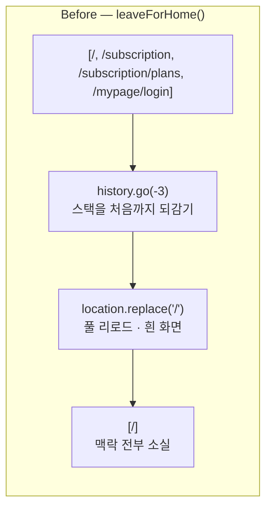
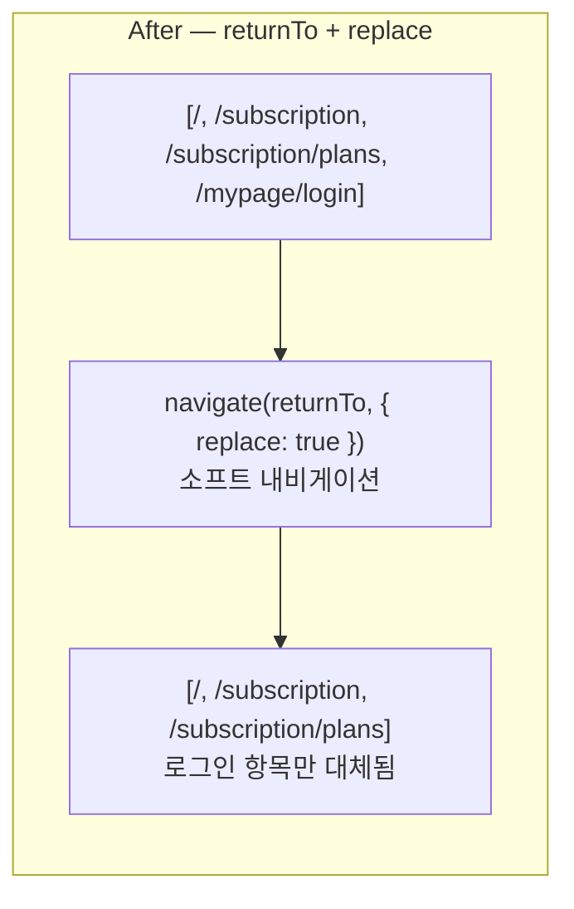
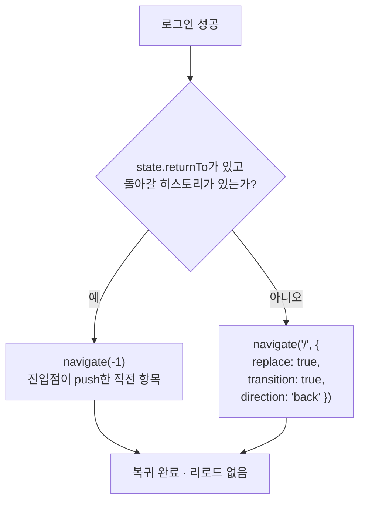
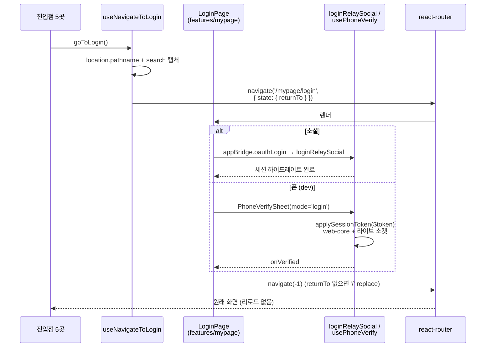

# 로그인 후 원위치 복귀 (`returnTo` · replace 내비게이션)

> 상태: Live · 최종 갱신: 2026-08-14 · 관련 ADR: [ADR-0055](../../../../../docs/adr/0055-web-code-block-home-sort-and-login-return.md) 결정 4 · [ADR-0042](../../../../../docs/adr/0042-account-linking-unified-path-migration.md) (계정 갈라짐 방어) · [ADR-0033](../../../../../docs/adr/0033-relay-dm-invite-and-auth-parallel-tracks.md) Track A (`applySessionToken`)
>
> 대상: `apps/web/src/app/features/mypage/pages/LoginPage.tsx` + 진입점 5곳
>
> 로그인 **화면 자체**(소셜 버튼 배치·폰 로그인 노출 정책)는 [mypage/README](../mypage/README.md)와
> [phone-verification](./phone-verification.md)이 소유한다. 이 문서는 **로그인 전후의 내비게이션**만
> 다룬다.

## 목적

로그인을 마친 사용자를 **로그인하러 오기 직전 화면으로** 돌려보낸다.

지금은 어디서 왔든 무조건 홈으로 튕긴다. 범인은 `LoginPage`의 `leaveForHome()`이다:

```ts
// [/, /mypage, /mypage/login] → [/]
const stepsBack = window.history.length - 1;
window.history.go(-stepsBack); // 히스토리를 처음까지 되감고
// popstate 후 window.location.replace('/'); // 홈으로 풀 리로드
```

소셜 로그인과 폰 로그인 **양쪽이 모두 이걸 호출한다.** 진입 경로는 5곳이고 각자 돌아갈 곳이 다른데
전부 홈으로 간다. 특히 **구독 결제 도중 로그인**이면 결제 화면으로 돌아가야 흐름이 이어지는데 홈으로
튕겨 끊긴다.

히스토리를 되감는 원래 의도는 "뒤로가기로 로그인 화면에 다시 들어가는 루프" 방지였다. 그 목적은
**`replace` 내비게이션만으로도 달성된다** — 되감기도 풀 리로드도 필요 없다.

## 설계 원칙

1. **로그인은 흐름의 중단이 아니라 삽입이다.** 사용자가 하던 일이 있고, 로그인은 그 일을 계속하기 위해
   끼어든 단계다. 끝나면 하던 자리로 돌아간다.
2. **뒤로가기로 로그인 화면에 다시 들어갈 수 없어야 한다.** 이미 지나온 관문이다. 이 방어는
   **히스토리를 한 칸 되돌아가는 것으로** 얻는다 — 진입점이 로그인 화면을 push했으므로 직전 항목이
   곧 돌아갈 화면이고, 뒤로 가면 로그인 항목이 뒤쪽 경로에서 빠진다. 스택 전체를 되감는 것은 과잉이고,
   그 과정에서 사용자가 쌓아온 내비게이션 맥락을 통째로 버린다.
3. **복귀는 "화면 단위"이지 "상태 단위"가 아니다.** 구독 플랜 화면으로 돌아가더라도 로그인 전에 고르던
   플랜 선택은 복원되지 않는다. 상태 복원을 원하면 그건 별도 설계다.
4. **풀 리로드는 신원 교체의 수단이 아니다.** 소셜·폰 양쪽 모두 세션 신원이 콜백 **이전에** 교체된다
   (아래 "세션 신원 교체 시점"). 리로드는 흰 화면 한 번만 추가할 뿐이다.
5. **`returnTo`가 없으면 홈으로.** 딥링크·새로고침으로 로그인 화면에 직접 도달한 경우다. 기본값이
   조용히 동작해야 하고, 그래서 **누락이 눈에 띄지 않는다** — 원칙 6이 따라온다.
6. **진입 경로는 한 함수를 통과한다.** 5곳이 각자 `state`를 손으로 만들면 한 곳만 빠뜨려도 그 경로만
   조용히 홈으로 간다. 전달을 **훅 하나로 강제**하고 5경로 전부를 테스트로 고정한다.

## 범위

**포함**

- `apps/web`: 로그인 진입 훅(`useNavigateToLogin`), `LoginPage`의 `leaveForHome` → `returnTo` +
  `replace` 교체, 진입점 5곳의 호출 교체

**제외**

- **로그인 화면의 모달/시트 승격.** 진입점 5곳을 모두 고쳐야 하고 딥링크 경로도 별도 설계가 필요해,
  얻는 것에 비해 변경면이 넓다 (ADR-0055 대안).
- **화면 내부 상태 복원** (폼 입력, 선택한 플랜, 스크롤 위치). 원칙 3.
- **캐시 비우기.** 게스트 신원으로 채운 캐시는 승격 후에도 유지한다 — 유저가 달라져도 호환된다는 것이
  확인됐다 (ADR-0055).
- **`/auth/login` shim.** `features/auth/pages/LoginPage.tsx`는 18줄짜리 리다이렉트이고 화면이 아니다.
  초대 딥링크를 루트로 넘기는 역할이며 이번 변경과 무관하다 ([invite.md](./invite.md)).
- **로그아웃 경로.** `LogoutPage`는 캐시 클리어 + 세션 종료이고 복귀 개념이 없다.
- **온보딩·초대 수락 흐름의 자체 내비게이션.** `useInviteAccept`는 자기 목적지를 따로 갖는다.

## 진입점 5곳

| 진입점                     | 위치                                                       | 기대 복귀 지점   |
| -------------------------- | ---------------------------------------------------------- | ---------------- |
| `MyPage`                   | `features/mypage/pages/MyPage.tsx:127`                     | 마이페이지       |
| `PhoneVerifyBanner`        | `features/auth/components/PhoneVerifyBanner.tsx:34`        | 배너를 띄운 화면 |
| `SubscriptionSelectDialog` | `features/home/components/SubscriptionSelectDialog.tsx:87` | 홈 (구독 선택)   |
| `SubscriptionPage`         | `features/subscription/pages/SubscriptionPage.tsx:43`      | 구독 화면        |
| `SubscriptionPlansPage`    | `features/subscription/pages/SubscriptionPlansPage.tsx:61` | 플랜 화면        |

세 곳(`SubscriptionSelectDialog`, `SubscriptionPage`, `SubscriptionPlansPage`)이 **게스트 게이트**다 —
결제에 붙일 계정이 없어 로그인으로 보낸다. 그래서 복귀가 가장 중요한 경로이기도 하다.

## 시나리오

### S1. 구독 결제 도중 로그인 (이 문서의 존재 이유)

1. 게스트가 `/subscription/plans`에서 플랜을 고르고 **구독하기**를 누른다.
2. `isGuest`이므로 결제 대신 로그인으로 보낸다 — `returnTo: '/subscription/plans'`가 실린다.
3. 소셜 로그인을 마친다. `loginRelaySocial`이 세션을 하이드레이트한다.
4. `navigate('/subscription/plans', { replace: true })` — **플랜 화면으로 돌아온다.** 풀 리로드가
   없으므로 흰 화면도 없다.
5. 플랜을 **다시 고르고** 구독하기를 누른다. 이번엔 게스트가 아니므로 결제로 진행된다.

> 4번의 "다시 고르고"가 원칙 3이다. 화면은 복원되지만 선택 상태는 복원되지 않는다.
>
> 이전 동작: 3번 이후 홈. 사용자는 플랜 화면을 스스로 다시 찾아 들어가야 했다.

### S2. 마이페이지에서 로그인

1. `/mypage`의 "로그인하기" 헤더를 누른다 → `returnTo: '/mypage'`.
2. 로그인 성공 → `/mypage`로 `replace` 복귀. 이제 게스트 분기가 풀려 프로필·구독·로그아웃 행이 보인다.
3. **뒤로가기** — 로그인 화면이 아니라 `/mypage` 이전 화면(대개 홈)으로 간다. 복귀가 `replace`가
   아니라 **뒤로가기**이기 때문이다. `replace`로 덮으면 `/mypage`가 연속 두 항목이 되어 첫 뒤로가기가
   같은 화면에 머무르고, 사용자에게는 뒤로가기가 고장난 것으로 보인다.

### S3. 계정 갈라짐 방어 배너를 타고 온 경우

1. 전화번호 인증 화면에서 `PhoneVerifyBanner`("소셜 로그인 먼저")를 누른다.
2. 배너가 `onClose()`로 인증 흐름을 먼저 닫고 로그인으로 이동한다 — `returnTo`는 **배너를 띄웠던
   화면**이다(인증 시트가 아니라 그 아래 화면).
3. 소셜 로그인을 마치면 그 화면으로 돌아온다. 이제 `social === 'linked'`이므로 배너는 스스로 사라진다
   (ADR-0042 §5).

### S4. 폰 로그인 (개발 빌드)

1. `PhoneVerifySheet`를 `mode="login"`으로 연다.
2. 번호를 확인하면 응답의 `$token`을 `applySessionToken`이 **`onVerified` 이전에** web-core와 라이브
   릴레이 소켓에 넣는다.
3. `onVerified`에서 `returnTo`로 `replace` 복귀한다. **신원은 이미 교체된 상태**이므로 리로드가
   필요 없다.

### S5. 딥링크·새로고침으로 로그인 화면에 직접 도달

`location.state`가 없다 (`replace`로 온 진입이 아니거나 새로고침으로 state가 날아갔다). `returnTo`가
없으므로 **홈으로** `replace` 복귀한다 — 지금과 같은 동작이며 이 경우엔 그게 맞다.

### S6. 로그인 실패 / 취소

`leaveForHome`이 애초에 호출되지 않는다. 사용자는 로그인 화면에 머물고 토스트만 뜬다. 뒤로가기를
누르면 자기가 왔던 화면으로 돌아간다 — **`returnTo`와 무관하게 히스토리가 그대로이기 때문이다.**

## 다이어그램

### 히스토리 스택 — Before / After





`replace`가 로그인 항목을 **덮어쓰므로** 뒤로가기로 로그인 화면에 다시 들어갈 수 없다 —
`leaveForHome`의 되감기가 하던 방어를 그대로 대신하면서, 그 앞의 스택은 보존한다.

### 복귀 경로 결정



`returnTo`는 **목적지가 아니라 플래그로만** 읽힌다 — "앱 안에서 push되어 왔는가". 문자열이 라우터에
목적지로 넘어가는 경로가 아예 없으므로 오픈 리다이렉트 표면이 존재하지 않는다.

### 진입과 복귀의 전체 흐름



## 상세 구현

### 1. `useNavigateToLogin` — 진입을 한 곳으로 (`features/auth/hooks/useNavigateToLogin.ts`, 신규)

원칙 6의 강제 지점이다. 5곳이 `state` 리터럴을 각자 만들지 않는다.

```ts
/** 로그인 성공 후 돌아갈 경로를 담는 라우터 state 키. */
export interface LoginLocationState {
    returnTo?: string;
}

/**
 * 지금 화면을 복귀 지점으로 기억하며 로그인으로 이동한다.
 *
 * 진입점이 5곳이고 각자 돌아갈 곳이 다른데, 기본값이 홈이라 전달을 빠뜨려도 실패가 눈에 띄지
 * 않는다 — 그래서 캡처를 호출자에게 맡기지 않고 여기서 한다.
 */
export const useNavigateToLogin = () => {
    const navigate = useNavigateWithTransition();
    const { pathname, search } = useLocation();
    return useCallback(() => {
        const returnTo = `${pathname}${search}`;
        void navigate(ROUTES.mypage.login, { state: { returnTo } satisfies LoginLocationState });
    }, [navigate, pathname, search]);
};
```

`search`까지 담는 이유: 구독 플랜 화면처럼 쿼리로 상태를 나르는 화면이 있고, 경로만 복원하면 그
화면의 절반만 돌아온다.

> **`state`이지 쿼리스트링이 아니다.** `?returnTo=`로 실으면 로그인 URL이 임의 경로를 담게 되고,
> 그 값이 그대로 내비게이션에 쓰이면 오픈 리다이렉트 표면이 된다. `location.state`는 히스토리
> 엔트리에 묶여 있어 외부에서 주입할 수 없다.

### 2. `LoginPage` — `leaveForHome` 교체 (`features/mypage/pages/LoginPage.tsx`)

`leaveForHome`을 걷어내고 복귀 함수로 바꾼다:

```ts
const leaveForReturnTo = () => {
    const { returnTo } = (location.state ?? {}) as LoginLocationState;
    const cameFromInsideTheApp = !!returnTo && window.history.length > 1;
    const leaving = cameFromInsideTheApp
        ? navigate(-1)
        : navigate(ROUTES.home, { replace: true, transition: true, direction: 'back' });
    void Promise.resolve(leaving).catch(error =>
        logger.error('AUTH', '[LoginPage] Failed to leave the login screen', { error })
    );
};
```

호출 지점 두 곳은 그대로다 — `handleOAuthLogin`의 성공 경로와 `PhoneVerifySheet`의 `onVerified`.

**왜 `replace`가 아니라 뒤로가기인가.** 진입점이 로그인 화면을 **push**하므로 스택은
`[…, returnTo, /mypage/login]`이다. `replace: true`는 현재 항목만 덮으므로 결과가
`[…, returnTo, returnTo]` — 같은 경로가 연속 두 개다. 첫 뒤로가기가 같은 화면에 머무르고(트랜지션만
재생된다) 두 번 눌러야 실제로 이동한다. 뒤로가기는 그 자리에서 직전 항목으로 이동하므로 로그인
항목이 뒤쪽 경로에서 빠지고 스택도 깨끗하다.

**부수 효과로 리다이렉트 표면이 사라진다.** 뒤로가기는 문자열을 받지 않으므로 `returnTo`는 "앱
안에서 왔는가"라는 **플래그로만** 쓰인다. (검토 결과 `location.state`는 세션 히스토리 항목에만 살고
URL에 실리지 않아 딥링크·외부 링크·네이티브 셸이 설정할 수 없으며, 데이터 라우터가 모든 내비게이션을
`encodeLocation`에 통과시켜 `//evil.com`조차 동일 출처 경로로 접힌다 — 즉 이전 방식에도 오픈
리다이렉트는 없었다. 그럼에도 문자열을 아예 쓰지 않는 편이 질문 자체를 없앤다.)

**폴백은 홈 `replace`.** `returnTo`가 없거나(딥링크·새로고침) 돌아갈 히스토리가 없을 때
(셸이 웹뷰를 새로 만들어 스택은 잃고 라우터 state만 남은 경우) 쓰인다. `transition`/`direction`을
명시하는 이유는 트랜지션 헬퍼가 `replace: true`일 때 애니메이션을 **기본으로 끄기** 때문이다
(`TransitionNavigateOptions`의 `transition?: boolean` — `@default true (false if replace: true)`).

**내비게이션 promise를 삼키지 않는다.** `useNavigateWithTransition`은 뷰 트랜지션 promise를 돌려주고,
이 시점엔 세션이 이미 승격된 뒤다 — 조용히 실패하면 로그인된 사용자가 아무 안내 없이 로그인 화면에
갇힌다.

### 3. 진입점 5곳 — `navigate(ROUTES.mypage.login)` → `goToLogin()`

각 파일에서 `useNavigateWithTransition` 대신(또는 그와 함께) `useNavigateToLogin`을 쓴다. 변경은
호출 한 줄씩이다.

| 파일                              | 변경                                                                                |
| --------------------------------- | ----------------------------------------------------------------------------------- |
| `MyPage.tsx:127`                  | `onClick={() => navigate(ROUTES.mypage.login)}` → `onClick={goToLogin}`             |
| `PhoneVerifyBanner.tsx:34`        | `onClose()` **후** `goToLogin()` — 순서 유지(시트를 로그인 화면 아래 남기지 않는다) |
| `SubscriptionSelectDialog.tsx:87` | `handleClose()` **후** `goToLogin()` — 같은 이유                                    |
| `SubscriptionPage.tsx:43`         | 게스트 분기에서 `goToLogin()`                                                       |
| `SubscriptionPlansPage.tsx:61`    | 게스트 분기에서 `goToLogin()`                                                       |

> `PhoneVerifyBanner`와 `SubscriptionSelectDialog`는 **닫기 → 이동** 순서가 의미를 갖는다. 훅이
> 캡처하는 `location.pathname`은 시트/다이얼로그가 아니라 그 아래 화면이므로, 닫기가 먼저여도
> `returnTo` 값은 동일하다.

### 세션 신원 교체 시점 — 왜 풀 리로드가 필요 없는가

원칙 4의 근거. 두 경로 모두 **복귀 시점에는 이미 새 신원이다.**

- **폰** — `usePhoneVerify`의 `login` 모드는 응답의 `$token`을 `applySessionToken`으로 web-core와
  **살아 있는 릴레이 소켓**에 밀어 넣은 뒤에야 `onVerified`를 부른다 (ADR-0033 Track A 계약;
  [phone-verification.md](./phone-verification.md)).
- **소셜** — `useLoginRelaySocial`이 네이티브 토큰을 검증하고 provider를 세팅하고 세션을
  하이드레이트한 뒤 resolve한다.

게스트도 `isAuthenticated`이므로 로그인은 **게스트 → 실계정 승격**이고, 라우터의 route set
(`privateRoutes`)은 그대로 유지된다. 즉 리로드가 route 재계산을 위해 필요한 것도 아니다.

캐시는 비우지 않는다 — 유저가 달라져도 호환된다는 것이 확인됐다 (ADR-0055).

## 검증 방법

### 유닛 테스트

| 파일                                                  | 커버                                                                                                                                                                                                                                            |
| ----------------------------------------------------- | ----------------------------------------------------------------------------------------------------------------------------------------------------------------------------------------------------------------------------------------------- |
| `features/auth/hooks/useNavigateToLogin.test.ts`      | 현재 경로를 `state.returnTo`로 실어 `/mypage/login`으로 보낸다 · **쿼리스트링 보존** · 진입은 `replace`가 아니다(그래야 복귀 시 그 항목이 대체된다)                                                                                             |
| `features/auth/hooks/loginEntryPoints.test.ts`        | **로그인 라우트를 직접 부르는 화면이 없다**(소스 트리 전수 검사) · 알려진 진입점 5곳이 모두 훅을 쓴다                                                                                                                                           |
| `features/mypage/pages/LoginPage.test.tsx`            | `returnTo`가 있으면 그 화면으로 `replace` 복귀 · 없으면 홈(S5) · `transition`/`direction: 'back'` 전달 · **`history.go`도 `popstate` 리로드도 없다**(회귀 고정) · 폰 인증 완료가 같은 경로를 탄다(S4) · OAuth 취소·로그인 실패 시 이동 없음(S6) |
| `features/auth/components/PhoneVerifyScreen.test.tsx` | 배너가 배너를 띄운 화면을 `returnTo`로 싣는다(S3)                                                                                                                                                                                               |

**진입점 5곳을 개별 렌더 테스트로 고정하지 않았다.** 다섯 화면 모두 유닛 테스트가 없었고, 구독·멤버십·
프로필·다이얼로그까지 딸린 화면을 다섯 벌 세우는 것보다 **불변식 자체를 검사하는 쪽**이 목적에 맞다 —
`loginEntryPoints.test.ts`는 소스 트리 445개 파일을 훑어 `ROUTES.mypage.login`을 직접 쓰는 파일이
없는지 본다. **나중에 생길 여섯 번째 진입점까지 자동으로 걸린다**는 점이 개별 테스트보다 낫다.
(리포에 선례가 있다 — `i18n/localeParity.test.ts`가 같은 방식으로 로케일 파일을 대조한다.)

```bash
npx nx test web
```

결과: 288 스위트 2321건 통과.

### 수동 확인 (미완료)

아래는 **아직 수행하지 않았다** — 개발 서버 기동이 승인되지 않았다. 풀 리로드 제거가 핵심이므로
**네트워크 탭을 열고** 확인한다 — 복귀 시 문서 요청이 다시 나가면 실패다.

1. **S1** — 게스트로 `/subscription/plans` → 구독하기 → 로그인 → **플랜 화면 복귀**, 흰 화면 없음.
2. **S2** — `/mypage` → 로그인 → `/mypage` 복귀 → **뒤로가기가 로그인 화면으로 가지 않는다.**
3. **S5** — 로그인 화면에서 새로고침 후 로그인 → 홈.
4. **S6** — 로그인을 취소/실패시킨 뒤 뒤로가기 → 원래 화면.
5. 나머지 진입점 3곳 각각의 복귀 지점.
6. **`replace` + 트랜지션 조합** — `transition: true`를 `replace: true`와 함께 넘기는 선례가 리포에
   없다. 복귀 애니메이션이 어색하면 `transition`을 빼고 기본값(연출 없음)으로 간다 — 기능이 아니라
   연출 문제다.

폰 로그인(S4)은 **개발 빌드에서만** 노출된다.

## 관련 문서

- [README.md](./README.md) — auth feature 개요 (`/auth/login` shim 포함)
- [phone-verification.md](./phone-verification.md) — `applySessionToken`과 두 셸의 분업
- [account-linking.md](./account-linking.md) — 계정 갈라짐 방어 배너의 근거
- [../mypage/README.md](../mypage/README.md) — 로그인 화면이 사는 허브, 게스트 분기
- [../../architecture/routing.md](../../architecture/routing.md) — route set과 `privateRoutes`
