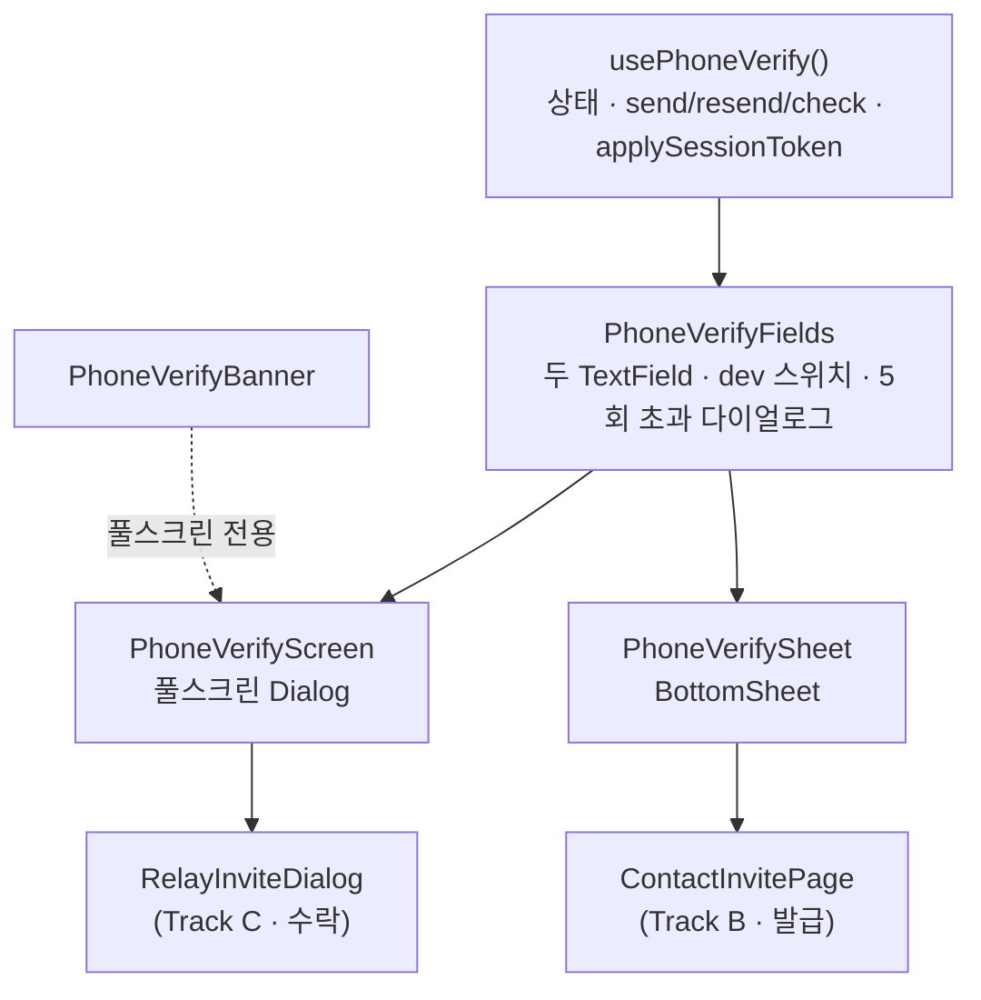
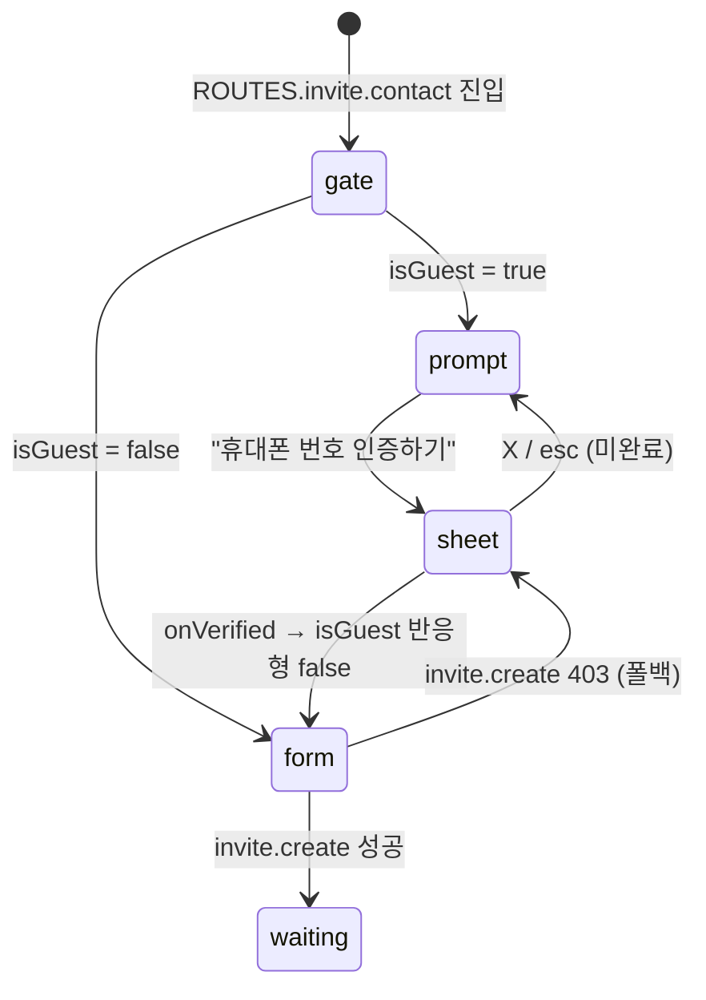
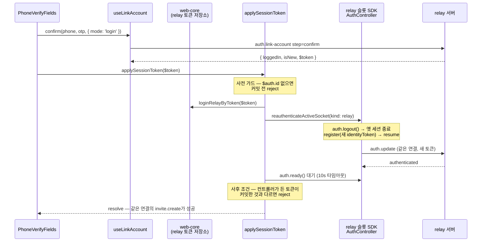

# 전화번호 인증 (PhoneVerifyFields · 두 셸 · applySessionToken)

> 상태: Live · 최종 갱신: 2026-08-03 · 관련 ADR: [ADR-0033](../../../../docs/adr/0033-relay-dm-invite-and-auth-parallel-tracks.md) Track A · [ADR-0034](../../../../docs/adr/0034-inviter-phone-verification-guest-gate-and-sheet.md) · [ADR-0042](../../../../docs/adr/0042-account-linking-unified-path-migration.md) · 로드맵: [relay-dm-invite-parallel-roadmap](../../../../docs/plans/relay-dm-invite-parallel-roadmap.md)

## 목적

1:1(DM) 중계 초대는 **번호의 주인만** 발급·수락할 수 있다. 디바이스 유저(게스트)는
`invite.create`/`invite.accept`가 403으로 막히므로, 번호 소유 증명으로 **메인유저로 승격**하는
입구가 필요하다. 번호가 없는 메인유저(소셜 가입자)에게 번호를 **연동**시키는 입구도 같은 자리를 쓴다.

패킷은 `auth.link-account`이고, 수단·모드·단계 계약과 배선은
[account-linking.md](./account-linking.md)가 소유한다 — 이 문서는 **번호 화면**을 다룬다.

이 문서가 다루는 것:

- **`applySessionToken($token)`** — `mode: 'login'`의 `confirm` 성공 응답의 `$token`(새 세션)을
  web-core 세션 저장소와 relay 소켓 연결 신원에 반영한다. 완료 후 같은 소켓 연결에서
  `invite.create`가 403 없이 성공한다. `mode: 'link'`에는 토큰이 없어 이 경로를 타지 않는다.
- **`usePhoneVerify` + `PhoneVerifyFields`** — 인증 로직과 입력 본문. 셸에 독립적이다.
- **두 셸** — `PhoneVerifyScreen`(풀스크린, 수락 흐름) / `PhoneVerifySheet`(바텀시트, 발급 흐름과
  마이페이지). 같은 본문을 다른 chrome으로 감싼다.
- **사전 게이트** — 발급 진입점에서 게스트와 번호 없는 메인유저를 폼 대신 인증 유도 화면으로 보낸다.
- **`last4` 사전 대조** — 수락 흐름에서 발송 전에 초대 번호와 대조한다.

백엔드 계약 원본: `chatic-sockets-api/docs/specs/relay-server-invite/05-client-guide.md`
(§A-1 인증 흐름 · §발송 제한 · §에러 코드).

## 설계 원칙

- **세션 전환의 원본은 web-core 토큰 저장소다.** 소켓은 저장소를 따라간다. 소켓에만
  새 신원을 심고 저장소를 안 바꾸는 경로는 만들지 않는다 — HTTP 서명/refresh가 옛
  신원으로 남는다.
- **신원 전환은 사전·사후 양쪽을 검사한다.** 커밋 전에 재등록 가능성을(`$auth.id`),
  대기 후에 실제 채택 여부를(컨트롤러가 든 토큰) 확인한다. 어느 한쪽이라도 빠지면
  "HTTP는 새 신원, 소켓은 옛 신원"이라는 반쪽 상태가 조용히 성공으로 위장된다.
- **에러 분기는 `errorCode`(HTTP status)로만 한다.** 메시지 문자열 파싱 금지 —
  `getSocketErrorCode(error)`(`apps/web/src/app/utils/errors.ts`)를 쓴다.
- **타이머·만료는 서버 값(`expiredAt`)으로만 렌더한다.** 유효시간을 클라이언트에
  하드코딩하지 않는다.
- **백엔드에 없는 개념은 UI에서 있는 개념으로 매핑한다.** "시간 연장"은 `step=resend`다
  (ADR-0033 D9). 재전송해도 오답 카운터는 유지된다는 안내를 함께 둔다.
- **번호·OTP·초대 코드는 요청 body에만 산다.** 로그·URL·쿼리 키에 남기지 않는다.
- **클라 카운터는 서버 429의 보조다.** 5회 제한은 클라에서 먼저 끊되 서버 429가 우선한다.
- **셸은 chrome만 갖는다.** 로직·입력 마크업은 셸에 없다. 셸을 하나 더 붙이거나 없애도
  인증 동작은 변하지 않는다.
- **게이트는 UX, 403이 계약이다.** 클라 역할 판정으로 미리 막되 서버 403 경로를 항상
  남긴다 — 메인유저 여부는 서버가 판정한다(가이드 §등장하는 유저 둘).
- **모드는 호출부가 정하고, 기본값이 없다.** 게스트는 `login`, 메인유저는 `link`다. 어긋나면
  폴백이 아니라 에러라서(400·403) `mode`를 필수 prop으로 둔다.
- **왕복보다 싼 거절을 먼저 한다.** 이미 손에 있는 `last4`로 걸러낼 수 있는 오타에 하루 발송
  상한을 태우지 않는다. 4자리는 확정 판정이 아니므로 서버 400 분기를 함께 남긴다.

## 범위

**포함**

- `applySessionToken($token)` (`@chatic/app-runtime` 공개 export) + web-core
  `loginRelayByToken`
- `usePhoneVerify` (로직, 두 모드) · `PhoneVerifyFields` (입력 본문) ·
  `PhoneVerifyScreen`(풀스크린 셸) · `PhoneVerifySheet`(바텀시트 셸)
- 사전 게이트 + 인증 유도 화면 (`ContactInvitePage`, 홈 ＋버튼 1:1 초대 진입점) — 게스트와
  번호 없는 메인유저 둘 다
- 마이페이지 번호 로그인 진입점 (`LoginPage`, ADR-0042 §9)
- `last4` 발송 전 대조 (수락 흐름)
- 계정 갈라짐 방어 — 풀스크린 셸은 이동 배너(ADR-0034 결정 4), `LoginPage`는 인라인 문구
- `auth.logout` 후 디바이스 유저 복귀 회귀 확인

**제외**

- 국가 선택·국가별 번호 검증·`countryCode` 전송 —
  [international-phone-input.md](./international-phone-input.md) 소유. 이 문서의 번호 필드는
  그 모듈을 소비만 한다
- 수단·모드·단계 계약과 `linkAccount` 배선 — [account-linking.md](./account-linking.md) 소유
- `link$` 읽기 자체 (`useLinkedAccounts`) — 같은 문서 소유. 이 문서는 게이트에서 쓰기만 한다
- 초대 발급/수락 화면의 본문 자체 (Track B·C 소유)
- 수락 흐름의 `needVerify` 판정·표현 — 서버 필드이고 풀스크린 유지 (ADR-0034 결정 2)
- 클라우드·그룹 초대 경로의 게이트 (`channels/InvitePage`, `AddFriendSheet`)
- 소셜 연동 화면 — [social-links.md](../account/social-links.md) 소유
- 번호 변경·번호만으로의 계정 복구 (백엔드 미지원)
- cloud 슬롯 신원 갱신 — `$token`은 relay 신원이다. cloud 세션은 그대로 유효하다.

## 시나리오

### 1. 초대자: 발급 전 번호 증명 — `PhoneVerifySheet`

1. 홈 ＋버튼 → "1:1 대화" → `ROUTES.invite.contact`
   (`HomePage.tsx:230` `handleCreateOneOnOne`).
2. `ContactInvitePage`가 두 조건을 본다 — `useRuntimeProfile().isGuest`와
   `useLinkedAccounts().phone === 'absent'`. **어느 쪽이든 참이면 폼 대신 인증 유도
   화면**을 렌더한다 — `친구 초대` 헤더는 공통, 본문은 "안전한 초대를 위해 / 휴대폰
   번호를 인증해 주세요" + 초록 CTA "휴대폰 번호 인증하기".
3. CTA 탭 → `PhoneVerifySheet` 오픈(`mode`는 `isGuest ? 'login' : 'link'`). 시트 헤더는
   "휴대폰 번호 인증" + 원형 X.
4. 번호 입력 → 필드 안 [인증 요청] → `send(phone, { mode })`. 발송 완료 토스트, 인증번호
   필드가 열리고 helper 우측에 `mm:ss` + [시간 연장]이 나타난다.
5. 6자리 입력 시 자동 제출. **모드에 따라 다른 단계가 나간다** —
   `login`은 `confirm`, `link`는 `verify`(그다음 CTA가 `confirm`).
6. `login`: `$token` 존재 → `applySessionToken` 완료까지 대기 → 인증 완료 토스트 → 시트 닫힘.
   `link`: 토큰이 없으므로 확정 성공이 곧 완료다.
7. `isGuest`(또는 `link$.phone`)가 반응형으로 뒤집혀 **같은 화면이 초대 폼으로 바뀐다.** 별도
   리프레시·리마운트가 없다.
8. 이름·번호를 채워 [완료] → `invite.create`가 403 없이 성공.

**`phone`이 `'unknown'`이면 이 게이트는 걸리지 않는다.** 프로필이 아직 안 왔거나 서버가 그 자리를
짓지 않은 상태이고, 그걸 "번호 없음"으로 읽으면 이미 번호를 가진 유저에게 인증을 다시 요구한다.
모르면 `isGuest`만 보는 이전 동작으로 물러난다(ADR-0042 §5).

### 2. 초대자: 게스트가 아닌데 발급이 403 — 폴백

`isGuest`가 `false`인데 `invite.create`가 403이면(정책 변경이나 역할 캐시 지연)
같은 시트를 연다. 인증 성공 후에는 **시트만 닫는다** — 폼 입력이 그대로 남아 있으므로
사용자가 [완료]를 다시 누른다. 자동 재발급은 하지 않는다(스테일 클로저를 피한다).

### 3. 수신자: 초대 수락 중 번호 인증 — `PhoneVerifyScreen`

1. Track C가 `invite.get`에서 `needVerify=true`를 받고
   `<PhoneVerifyScreen context="invite-accept" mode="login" inviteCode={code}
inviteLast4={flow.invite?.last4} … />`를 띄운다. **항상 `login`이다** — 딥링크를 여는 시점의
   세션은 디바이스 유저다.
2. 히어로 아래 계정 갈라짐 방어 배너: "이미 계정이 있다면 소셜로 먼저 로그인하세요" —
   탭하면 `onClose()` 후 `/mypage/login`으로 이동.
3. 번호 입력 → [인증 요청]. **발송 전에 `last4`로 먼저 대조한다** — 뒷 4자리가 다르면 서버를
   부르지 않고 그 자리에서 "초대받은 번호가 아니에요"를 띄운다. 4자리가 맞아도 확정이 아니므로
   서버가 전체 번호를 다시 대조하고, 어긋나면 **발송 단계에서 400**으로 같은 문구가 뜬다.
4. 이후 4~6단계는 시나리오 1의 `login` 경로와 동일. 완료 후 Track C가 프로필 → `invite.accept`로
   진행한다 — 같은 소켓 연결이 이미 메인유저 신원이라 403이 없다.

`last4`가 응답에 없으면 사전 대조를 건너뛰고 서버 400에만 의존한다 — `invite.get`이 그 자리를
싣는다는 보장이 문서에 없어서다.

### 3-b. 마이페이지 로그인 화면의 번호 로그인 — `PhoneVerifySheet` (개발 빌드 전용)

`/mypage/login`은 소셜 버튼 아래에 "휴대폰 번호로 로그인"을 나란히 둔다(`mode="login"`).

> **운영에서는 노출하지 않는다.** `isDevBuild()`(`VITE_ENV` DEV/LOCAL) 뒤에 두어 운영은 소셜이
> 유일한 로그인으로 남는다. 배선과 테스트는 그대로 있으므로 여는 것은 그 한 줄이다 — **구독이
> 소셜 연동에 걸려 있어**(클라우드 소유가 소셜 기반, [social-links.md](../account/social-links.md))
> 번호만으로 가입한 유저가 결제할 수 없는 상태라, 그 커플링과 계정 갈라짐 안내가 정리된 뒤에 연다.
>
> 브라우저 문구도 이 스위치를 따른다 — 번호 로그인이 숨겨져 있으면 "앱에서 로그인해 주세요"가
> 사실이고, 보이면 **소셜만** 앱 전용이라 문구가 갈린다.

- **소셜이 위, 번호가 아래다.** 이 화면이 `PhoneVerifyBanner`의 도착지이고, 계정 갈라짐은 한
  방향으로만 일어난다 — 새 기기에서 번호부터 증명하면 **합칠 수 없는 별개 유저**가 생긴다. 소셜을
  먼저 보여 주고 경고를 번호 바로 위에 두는 것이 방어의 전부다.
- **여기서는 이동 배너를 쓰지 않는다.** `PhoneVerifyBanner`는 `/mypage/login`으로 **보내는**
  컴포넌트이므로 그 도착지에 달면 자기 자신을 가리킨다. 인라인 문구로 대신한다.
- **`isNative()` 가드가 없다.** 소켓 호출이라 브라우저에서도 동작한다 — 소셜이 네이티브 전용이라
  지금까지 브라우저는 로그인이 아예 불가능했고, 이 경로가 그것을 처음 연다.
- **브라우저에서는 탈출구가 없다.** 소셜 로그인이 앱 전용이라 "소셜로 먼저"가 실행 불가능한
  안내가 되므로, 브라우저에서는 "앱에서 소셜로 로그인해 주세요"로 바꿔 이동 링크 없이 안내만 한다.
- 성공 후 히스토리 정리(`leaveForHome`)를 소셜 경로와 공유한다.

### 3-c. 마이페이지 계정 화면의 번호 연동 — `PhoneVerifySheet`

`AccountLinkSection`의 번호 행이 `mode="link"`로 같은 시트를 연다. 자세한 것은
[social-links.md](../account/social-links.md)가 소유한다.

### 4. 재전송과 "시간 연장"

- 인증번호 필드의 [재전송]과 helper 행의 [시간 연장]은 **둘 다 `step=resend`**다
  (ADR-0033 D9). 새 코드 + 새 `expiredAt`이 오고 타이머가 다시 시작된다.
- 재전송 성공 안내에 "이전에 틀린 횟수는 그대로예요"를 포함한다.
- 클라 카운터로 5회를 넘으면 **서버를 부르지 않고 초과 다이얼로그**를 띄운다 — 누른
  컨트롤에 따라 "인증번호 재전송 5회 초과" / "시간 연장 5회 초과". 버튼을 비활성화하지
  않는 이유는 디자인이 다이얼로그를 피드백으로 지정했기 때문이다(죽은 버튼은 안내를
  전달할 수 없다).
- 그 전에 서버 429가 오면 서버 안내가 우선한다. 세 상황이 모두 429라 **호출 지점**으로만
  구분한다 — 최초 발송 429 = 일일 상한(번호 10회/기기 20회), 재전송 429 = 60초 쿨다운,
  check 429 = 오답 5회.

### 5. 타이머 만료

`expiredAt` 도달 시 `00:00` + 인증번호 필드가 에러 상태로 "시간 만료로 새로운 인증
요청을 해주세요." + 제출 비활성. 60초 이하부터 타이머가 적색으로 바뀐다. 재전송으로만
복구한다.

### 6. dev 발송 스위치

`VITE_ENV`가 `DEV`/`LOCAL`인 빌드에서만 입력 아래 노출:

- **dryRun** — 발송 없이 흐름만 (쿨다운·상한·오답 카운터는 정상 동작)
- **Slack 수신** — `{ sms: false, slack: true }`

미지정 스위치는 요청에 아예 싣지 않아 서버 기본값이 산다.

### 7. 로그아웃 회귀

`useSessionLogout` → `logoutSession`(소켓 `auth.logout` + web-core 로컬 teardown) →
`useRelaySessionKeepAlive`가 relay 인증 부재를 보고 `loginRelayGuestByDevice`로 **같은
디바이스 유저** 복귀. `applySessionToken`은 `delegatorId`와 디바이스 저장소를 건드리지
않으므로 이 경로가 깨지지 않는다 — 테스트로 고정돼 있다.

## 다이어그램

### 컴포넌트 구성 (셸 분리)

### 발급 진입점의 게이트

### 세션 전환 (applySessionToken)

- `auth.refresh`/`auth.switch`는 **같은 신원**의 재서명 경로라 다른 유저의 새
  `identityToken`을 실을 수 없다 — 신원 교체의 SDK 경로는 `logout() → register()`이고
  재연결이 필요 없다.
- 저장소 커밋이 먼저다: `SocketReauthBinder`(React)가 같은 변화를 감지해도
  `reauthenticateActiveSocket`의 토큰 동일성 가드로 no-op으로 수렴한다.

## 상세 구현

### applySessionToken 쪽

| 파일                                                    | 역할                                                                                                                                                                                                                                                                                                              |
| ------------------------------------------------------- | ----------------------------------------------------------------------------------------------------------------------------------------------------------------------------------------------------------------------------------------------------------------------------------------------------------------- |
| `libs/web-core/src/session/services.ts`                 | `loginRelayByToken(tokenView)` — 기존 private `applyRelaySession`(guest/social 로그인이 공유) 재사용: `buildCredentialsByToken` + `saveRelayToken` + authenticated 플래그. `delegatorId`는 건드리지 않는다                                                                                                        |
| `libs/app-runtime/src/socket/auth/sessionDelegate.ts`   | `createSocketSessionDelegate()` — 위임 객체 생성을 모듈 함수로 추출(React 밖에서도 쓰기 위함). `connection/useSocketSessionDelegate.ts`가 이걸 `useMemo`로 감싼다                                                                                                                                                 |
| `libs/app-runtime/src/socket/auth/applySessionToken.ts` | 본체. (1) `identityToken` 없으면 no-op(연동만 됨), `$auth.id` 없으면 **커밋 전** reject (2) `loginRelayByToken` (3) `reauthenticateActiveSocket({ kind: 'relay' })` (4) `auth.ready()`를 10s 타임아웃과 경쟁 (5) **사후 조건** — 컨트롤러 토큰 ≠ 커밋한 `identityToken`이면 reject. relay 슬롯이 없으면 (2)까지만 |
| `libs/app-runtime/src/index.ts`                         | `applySessionToken` 공개 export (`public-surface.test.ts`가 목록을 지킨다)                                                                                                                                                                                                                                        |

사후 조건이 필요한 이유: `reauthenticateActiveSocket`에는 조용히 빠져나가는 경로가 둘
있다 — 저장소에서 읽을 registration이 없거나, registration 토큰이 컨트롤러가 이미 든
것과 같을 때. 앞쪽으로 빠지면 `register()`가 호출되지 않는데, 소켓은 여전히 디바이스
유저로 `authenticated`이므로 `ready()`가 즉시 resolve하고 전체가 성공으로 끝난다.
그러면 호출부의 다음 `invite.create`가 403을 받는다 — 이 함수가 막으려던 실패다.

관련 검증 사실:

- 소켓 신원 갱신 경로는 guest→social 승격과 공유한다
  (`reauthenticateActiveSocket.ts:20-33`). 토큰 동일성 가드가 `SocketReauthBinder`와의
  이중 실행을 no-op으로 수렴시킨다.
- SDK `register()`는 inactive면 resume하고 connected면 즉시 `auth.update`를 보낸다.
  `ready()`는 authenticated에 resolve, terminal expired에 reject.
- 게이트웨이는 relay 슬롯에 고정돼 있다 —
  `libs/app-runtime/src/data/factories/remoteFactory.ts:57-61`에서 invite + `linkAccount`가
  `getScopedClient('relay')`. 자세한 것은 [account-linking.md](./account-linking.md).
- `$token`의 필요 필드는 `Token.{authId,accountId,identityId,identityToken}` + `$auth.id` +
  `userRole`이다. 실서버 응답에 `$auth`가 없으면 커밋 전에 reject된다.
- **`mode: 'link'`는 이 경로를 타지 않는다.** 확정 응답에 `$token`이 없고 세션이 그대로이므로
  `applySessionToken`을 부르지 않는다(빈 토큰 no-op 경로도 그대로 남아 있다).

### 인증 본문·셸 쪽 (`apps/web/src/app/features/auth/`)

| 파일                               | 역할                                                                                                                                                                                                                                                                                                                                                                                                                                                                                                                     |
| ---------------------------------- | ------------------------------------------------------------------------------------------------------------------------------------------------------------------------------------------------------------------------------------------------------------------------------------------------------------------------------------------------------------------------------------------------------------------------------------------------------------------------------------------------------------------------ |
| `hooks/usePhoneVerify.ts`          | 상태 기계 — 번호/OTP/에러/`expiredAt`/재전송 카운터/초과 다이얼로그/`pendingToken`/`linkVerified`/dev 스위치. `useLinkAccount` 호출, `getSocketErrorCode` 분기, `applySessionToken` 대기. **`mode`가 필수 옵션**이고 `login`은 `confirm` 단발, `link`는 `verify`→CTA `confirm`으로 갈린다. `inviteLast4`가 있으면 발송 전에 대조한다. `{ fields, submit }` 두 묶음으로 돌려준다 — `fields`는 `PhoneVerifyFields`에 그대로 넘기고, `submit`(`isRetry`/`disabled`/`loading`/`onSubmit`)은 셸이 자기 위치에 버튼으로 그린다 |
| `components/PhoneVerifyFields.tsx` | 두 `TextField`(web-ui-kit) + dev 스위치 + 5회 초과 `AlertDialog`. 필드 안 액션은 `trailing`, 타이머+[시간 연장]은 `helperTrailing` 슬롯                                                                                                                                                                                                                                                                                                                                                                                  |
| `components/PhoneVerifyScreen.tsx` | 풀스크린 `Dialog` 셸 — 우상단 X, 중앙 정렬 히어로, `PhoneVerifyBanner`, 하단 고정 초록 CTA. **props 계약 불변**(`context`/`inviteCode`/`onVerified`/`onClose`)                                                                                                                                                                                                                                                                                                                                                           |
| `components/PhoneVerifySheet.tsx`  | `BottomSheet` 셸 — `title`="휴대폰 번호 인증", `onClose`(원형 X 자동), 좌측 정렬 안내 2줄, `footer`에 초록 CTA. 같은 props                                                                                                                                                                                                                                                                                                                                                                                               |
| `components/PhoneVerifyBanner.tsx` | 계정 갈라짐 방어 배너 — 풀스크린 셸에서만 렌더                                                                                                                                                                                                                                                                                                                                                                                                                                                                           |
| `hooks/useOtpExpiryCountdown.ts`   | `expiredAt` 기준 1초 틱 `{secondsLeft, isExpired}`                                                                                                                                                                                                                                                                                                                                                                                                                                                                       |
| `utils/phone.ts`                   | `isValidKoreanPhone` — 디자인이 하이픈 없는 원시 입력을 지정하므로 표시용 포맷터는 쓰지 않는다                                                                                                                                                                                                                                                                                                                                                                                                                           |
| `utils/env.ts`                     | `isDevBuild()` — `import.meta.env`를 이 모듈에만 격리(ts-jest가 못 읽어 테스트는 모듈째 mock)                                                                                                                                                                                                                                                                                                                                                                                                                            |

web-ui-kit 재사용: `TextField`(`trailing`·`helperTrailing` 슬롯), `BottomSheet`,
`AlertDialog`, `Button`. **신규 컴포넌트·아이콘 추출은 없다** — 시트 헤더의 원형 X는
`BottomSheet`가 `size-6 rounded-full bg-muted` + `IconClose`로 이미 그린다(Figma
`3586:16827`의 24×24 프레임 안 18×18 X와 동일).

- 완료 CTA는 `Button tone="green"`이다. 비활성은 `disabled:bg-control-idle` +
  `disabled:text-placeholder`로 회색이 되는데, 이게 Figma가 `Solid button_Black`으로
  표기한 렌더링이다.
- **초대 코드는 `send`에만 실린다.** 통합 계약의 증명 단계 유니온에는 그 자리가 없다 — 번호·초대
  대조는 발송에서 한 번 일어난다. `mode: 'link'`에서는 서버가 읽지도 않으므로 경계에서 떨어뜨린다.
- 문구는 `public/locales/{ko,en}/translation.json`의 `phoneVerify.*` 블록. 시트 전용으로
  `sheetTitle`·`sheetDescription`, 닫기 접근성 라벨로 `common.close`를 쓴다. `link` 모드의 거절
  카피는 `linkOccupied`(남의 계정)·`linkTypeAlreadyLinked`(이미 다른 번호)다.

### 발급 진입점 게이트 쪽 (`apps/web/src/app/features/invite/`)

| 파일                                 | 역할                                                                                                                                                                                                            |
| ------------------------------------ | --------------------------------------------------------------------------------------------------------------------------------------------------------------------------------------------------------------- |
| `pages/ContactInvitePage.tsx`        | `useRuntimeProfile().isGuest`로 분기 — 게스트면 폼을 아예 렌더하지 않고 `InviterVerifyPrompt`만 그린다(early return). `PageHeader`는 두 분기가 각자 렌더한다. `invite.create` 403이면 같은 시트를 폴백으로 연다 |
| `components/InviterVerifyPrompt.tsx` | 인증 유도 화면 — 중앙 정렬 2줄 제목 + 2줄 안내 + 초록 CTA. CTA는 하단 고정이 아니라 카피 바로 아래(Figma `3578-67319`의 `y=168`)                                                                                |

카피는 `contactInvite.verifyPrompt.{title,note,cta}`다. 기존 `contactInvite.guestBlocked`는
게이트와 시트 폴백이 대신하면서 호출부가 없어져 제거했다.

Figma 근거: `3578-67319`(유도 화면) · `3586-16255`(시트). 시트 안 `General Input` 두 개는
수락 흐름 풀스크린(`3421-59180`)과 구조가 동일해 `PhoneVerifyFields`가 양쪽을 덮는다.

## 검증 방법

- `npx jest --config libs/app-runtime/jest.config.js applySessionToken` — 9 케이스.
  **403 계약 고정 포함**: 실제 `SocketManager` + 가짜 relay 서버가 신원=게스트일 때
  `invite.create`를 403으로 거부 → `applySessionToken` 후 같은
  `getScopedClient('relay')` 경유 호출이 성공. 사후 조건 케이스는 프로덕션 수정을
  stash하면 실패하는 것으로 결함 포착을 확인했다.
- `npx jest --config apps/web/jest.config.js --testPathPatterns "features/auth"` —
  화면 동작/타이머 만료/에러 코드 분기/재전송 캡/배너/dev 스위치. `PhoneVerifyScreen.test.tsx`
  20 케이스는 셸 분리 리팩터의 안전망이다 — 로직을 `usePhoneVerify`로, 본문을
  `PhoneVerifyFields`로 옮기면서 **단언을 하나도 바꾸지 않고** 통과해야 한다.
- `npx jest --config apps/web/jest.config.js --testPathPatterns "features/invite"` —
  게이트 분기(게스트→유도화면 / 비게스트→폼), 유도 CTA가 `invite-create` 맥락으로 시트를
  여는지, 403 폴백이 시트를 열고 인증 후 폼 입력을 유지하는지(자동 재발급 없음)
- `npx jest --config libs/web-core/jest.config.js session/services` —
  `loginRelayByToken` 커밋 + `delegatorId` 불변
- `npx tsc -b apps/web/tsconfig.app.json` — 프로젝트 레퍼런스 빌드. 라이브러리 `dist`가
  낡은 상태에서 `--noEmit -p`를 쓰면 stale `.d.ts`를 읽어 실재하지 않는 에러가 난다.
- 수동: 게스트 기기 → 홈 ＋버튼 → 인증 유도 화면 → 시트 인증 → 폼 자동 전환 →
  `invite.create` 성공 / `auth.logout` 후 게스트 복귀
