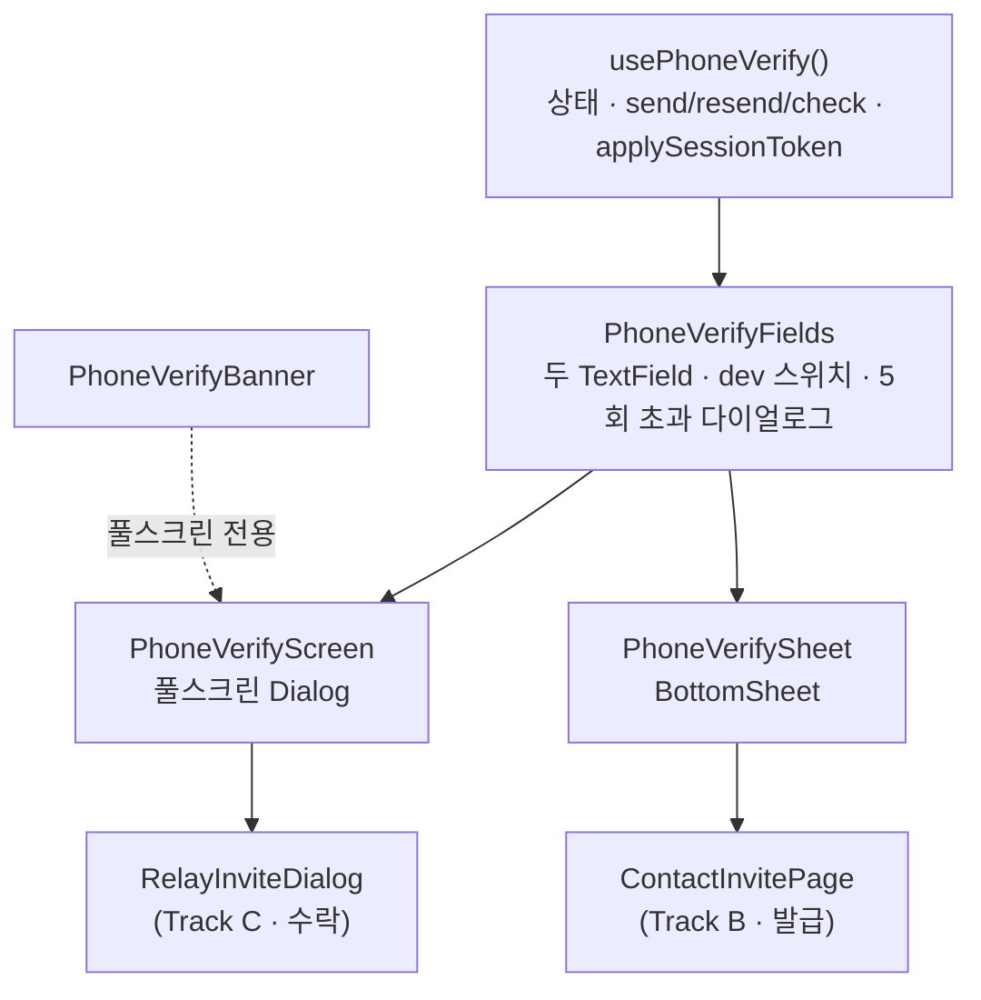
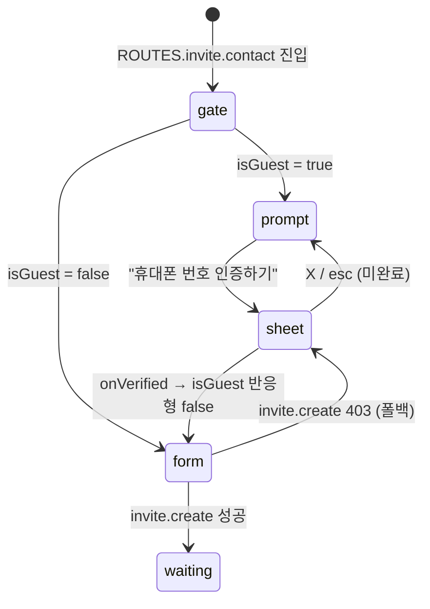
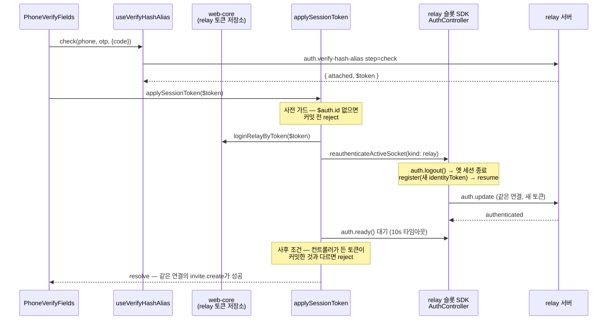

# 전화번호 인증 (PhoneVerifyFields · 두 셸 · applySessionToken)

> 상태: Live · 최종 갱신: 2026-07-30 · 관련 ADR: [ADR-0033](../../../../docs/adr/0033-relay-dm-invite-and-auth-parallel-tracks.md) Track A · [ADR-0034](../../../../docs/adr/0034-inviter-phone-verification-guest-gate-and-sheet.md) · 로드맵: [relay-dm-invite-parallel-roadmap](../../../../docs/plans/relay-dm-invite-parallel-roadmap.md)

## 목적

1:1(DM) 중계 초대는 **번호의 주인만** 발급·수락할 수 있다. 디바이스 유저(게스트)는
`invite.create`/`invite.accept`가 403으로 막히므로, 번호 소유 증명
(`auth.verify-hash-alias`)으로 **메인유저로 승격**하는 입구가 필요하다.

이 문서가 다루는 것:

- **`applySessionToken($token)`** — `verify-hash-alias step=check` 성공 응답의
  `$token`(새 세션)을 web-core 세션 저장소와 relay 소켓 연결 신원에 반영한다.
  완료 후 같은 소켓 연결에서 `invite.create`가 403 없이 성공한다.
- **`usePhoneVerify` + `PhoneVerifyFields`** — 인증 로직과 입력 본문. 셸에 독립적이다.
- **두 셸** — `PhoneVerifyScreen`(풀스크린, 수락 흐름) / `PhoneVerifySheet`(바텀시트,
  발급 흐름). 같은 본문을 다른 chrome으로 감싼다.
- **게스트 사전 게이트** — 발급 진입점에서 게스트를 폼 대신 인증 유도 화면으로 보낸다.

백엔드 계약 원본: `chatic-sockets-api/docs/specs/relay-server-invite/05-client-guide.md`
(§A-1 인증 흐름 · §발송 제한 · §에러 코드).

## 설계 원칙

- **세션 전환의 원본은 web-core 토큰 저장소다.** 소켓은 저장소를 따라간다. 소켓에만
  새 신원을 심고 저장소를 안 바꾸는 경로는 만들지 않는다 — HTTP 서명/refresh가 옛
  신원으로 남는다.
- **신원 전환은 사전·사후 양쪽을 검사한다.** 커밋 전에 재등록 가능성을(`$auth.id`),
  대기 후에 실제 채택 여부를(컨트롤러가 든 토큰) 확인한다. 어느 한쪽이라도 빠지면
  "HTTP는 새 신원, 소켓은 옛 신원"이라는 반쪽 상태가 조용히 성공으로 위장된다.
- **에러 분기는 `errorCode`(HTTP status)로만 한다.** 메시지 문자열 파싱 금지 —
  `getSocketErrorCode(error)`(`apps/web/src/app/utils/errors.ts`)를 쓴다.
- **타이머·만료는 서버 값(`expiredAt`)으로만 렌더한다.** 유효시간을 클라이언트에
  하드코딩하지 않는다.
- **백엔드에 없는 개념은 UI에서 있는 개념으로 매핑한다.** "시간 연장"은 `step=resend`다
  (ADR-0033 D9). 재전송해도 오답 카운터는 유지된다는 안내를 함께 둔다.
- **번호·OTP·초대 코드는 요청 body에만 산다.** 로그·URL·쿼리 키에 남기지 않는다.
- **클라 카운터는 서버 429의 보조다.** 5회 제한은 클라에서 먼저 끊되 서버 429가 우선한다.
- **셸은 chrome만 갖는다.** 로직·입력 마크업은 셸에 없다. 셸을 하나 더 붙이거나 없애도
  인증 동작은 변하지 않는다.
- **게이트는 UX, 403이 계약이다.** 클라 역할 판정으로 미리 막되 서버 403 경로를 항상
  남긴다 — 메인유저 여부는 서버가 판정한다(가이드 §등장하는 유저 둘).

## 범위

**포함**

- `applySessionToken($token)` (`@chatic/app-runtime` 공개 export) + web-core
  `loginRelayByToken`
- `usePhoneVerify` (로직) · `PhoneVerifyFields` (입력 본문) ·
  `PhoneVerifyScreen`(풀스크린 셸) · `PhoneVerifySheet`(바텀시트 셸)
- 게스트 사전 게이트 + 인증 유도 화면 (`ContactInvitePage`, 홈 ＋버튼 1:1 초대 진입점)
- 계정 갈라짐 방어 배너 — **풀스크린 셸에만** (ADR-0034 결정 4)
- `auth.logout` 후 디바이스 유저 복귀 회귀 확인

**제외**

- 초대 발급/수락 화면의 본문 자체 (Track B·C 소유)
- 수락 흐름의 `needVerify` 판정·표현 — 서버 필드이고 풀스크린 유지 (ADR-0034 결정 2)
- 클라우드·그룹 초대 경로의 게이트 (`channels/InvitePage`, `AddFriendSheet`)
- `auth.attach-social` 소셜 연동 (Track D)
- 번호 변경·번호만으로의 계정 복구 (백엔드 미지원)
- cloud 슬롯 신원 갱신 — `$token`은 relay 신원이다. cloud 세션은 그대로 유효하다.

## 시나리오

### 1. 초대자(게스트): 발급 전 번호 인증 — `PhoneVerifySheet`

1. 홈 ＋버튼 → "1:1 대화" → `ROUTES.invite.contact`
   (`HomePage.tsx:230` `handleCreateOneOnOne`).
2. `ContactInvitePage`가 `useRuntimeProfile().isGuest`를 보고 **폼 대신 인증 유도
   화면**을 렌더한다 — `친구 초대` 헤더는 공통, 본문은 "안전한 초대를 위해 / 휴대폰
   번호를 인증해 주세요" + 초록 CTA "휴대폰 번호 인증하기".
3. CTA 탭 → `PhoneVerifySheet` 오픈. 시트 헤더는 "휴대폰 번호 인증" + 원형 X.
4. 번호 입력 → 필드 안 [인증 요청] → `send(phone)`. 발송 완료 토스트, 인증번호 필드가
   열리고 helper 우측에 `mm:ss` + [시간 연장]이 나타난다.
5. 6자리 입력 시 자동 제출 → `check(phone, otp)`.
6. `$token` 존재 → `applySessionToken` 완료까지 대기 → 인증 완료 토스트 → 시트 닫힘.
7. `isGuest`가 반응형으로 `false`로 뒤집혀 **같은 화면이 초대 폼으로 바뀐다.** 별도
   리프레시·리마운트가 없다.
8. 이름·번호를 채워 [완료] → `invite.create`가 403 없이 성공.

### 2. 초대자: 게스트가 아닌데 발급이 403 — 폴백

`isGuest`가 `false`인데 `invite.create`가 403이면(정책 변경이나 역할 캐시 지연)
같은 시트를 연다. 인증 성공 후에는 **시트만 닫는다** — 폼 입력이 그대로 남아 있으므로
사용자가 [완료]를 다시 누른다. 자동 재발급은 하지 않는다(스테일 클로저를 피한다).

### 3. 수신자: 초대 수락 중 번호 인증 — `PhoneVerifyScreen`

1. Track C가 `invite.get`에서 `needVerify=true`를 받고
   `<PhoneVerifyScreen context="invite-accept" inviteCode={code} … />`를 띄운다.
2. 히어로 아래 계정 갈라짐 방어 배너: "이미 계정이 있다면 소셜로 먼저 로그인하세요" —
   탭하면 `onClose()` 후 `/mypage/login`으로 이동.
3. 번호 입력 → [인증 요청] → `send(phone, { code })`. 초대에 적힌 번호가 아니면
   **발송 단계에서 400** → "초대받은 번호가 아니에요" 인라인 에러.
4. 이후 4~6단계는 시나리오 1과 동일. 완료 후 Track C가 프로필 → `invite.accept`로
   진행한다 — 같은 소켓 연결이 이미 메인유저 신원이라 403이 없다.

### 4. 재전송과 "시간 연장"

- 인증번호 필드의 [재전송]과 helper 행의 [시간 연장]은 **둘 다 `step=resend`**다
  (ADR-0033 D9). 새 코드 + 새 `expiredAt`이 오고 타이머가 다시 시작된다.
- 재전송 성공 안내에 "이전에 틀린 횟수는 그대로예요"를 포함한다.
- 클라 카운터로 5회를 넘으면 **서버를 부르지 않고 초과 다이얼로그**를 띄운다 — 누른
  컨트롤에 따라 "인증번호 재전송 5회 초과" / "시간 연장 5회 초과". 버튼을 비활성화하지
  않는 이유는 디자인이 다이얼로그를 피드백으로 지정했기 때문이다(죽은 버튼은 안내를
  전달할 수 없다).
- 그 전에 서버 429가 오면 서버 안내가 우선한다. 세 상황이 모두 429라 **호출 지점**으로만
  구분한다 — 최초 발송 429 = 일일 상한(번호 10회/기기 20회), 재전송 429 = 60초 쿨다운,
  check 429 = 오답 5회.

### 5. 타이머 만료

`expiredAt` 도달 시 `00:00` + 인증번호 필드가 에러 상태로 "시간 만료로 새로운 인증
요청을 해주세요." + 제출 비활성. 60초 이하부터 타이머가 적색으로 바뀐다. 재전송으로만
복구한다.

### 6. dev 발송 스위치

`VITE_ENV`가 `DEV`/`LOCAL`인 빌드에서만 입력 아래 노출:

- **dryRun** — 발송 없이 흐름만 (쿨다운·상한·오답 카운터는 정상 동작)
- **Slack 수신** — `{ sms: false, slack: true }`

미지정 스위치는 요청에 아예 싣지 않아 서버 기본값이 산다.

### 7. 로그아웃 회귀

`useSessionLogout` → `logoutSession`(소켓 `auth.logout` + web-core 로컬 teardown) →
`useRelaySessionKeepAlive`가 relay 인증 부재를 보고 `loginRelayGuestByDevice`로 **같은
디바이스 유저** 복귀. `applySessionToken`은 `delegatorId`와 디바이스 저장소를 건드리지
않으므로 이 경로가 깨지지 않는다 — 테스트로 고정돼 있다.

## 다이어그램

### 컴포넌트 구성 (셸 분리)

### 발급 진입점의 게이트

### 세션 전환 (applySessionToken)

- `auth.refresh`/`auth.switch`는 **같은 신원**의 재서명 경로라 다른 유저의 새
  `identityToken`을 실을 수 없다 — 신원 교체의 SDK 경로는 `logout() → register()`이고
  재연결이 필요 없다.
- 저장소 커밋이 먼저다: `SocketReauthBinder`(React)가 같은 변화를 감지해도
  `reauthenticateActiveSocket`의 토큰 동일성 가드로 no-op으로 수렴한다.

## 상세 구현

### applySessionToken 쪽

| 파일                                                    | 역할                                                                                                                                                                                                                                                                                                              |
| ------------------------------------------------------- | ----------------------------------------------------------------------------------------------------------------------------------------------------------------------------------------------------------------------------------------------------------------------------------------------------------------- |
| `libs/web-core/src/session/services.ts`                 | `loginRelayByToken(tokenView)` — 기존 private `applyRelaySession`(guest/social 로그인이 공유) 재사용: `buildCredentialsByToken` + `saveRelayToken` + authenticated 플래그. `delegatorId`는 건드리지 않는다                                                                                                        |
| `libs/app-runtime/src/socket/auth/sessionDelegate.ts`   | `createSocketSessionDelegate()` — 위임 객체 생성을 모듈 함수로 추출(React 밖에서도 쓰기 위함). `connection/useSocketSessionDelegate.ts`가 이걸 `useMemo`로 감싼다                                                                                                                                                 |
| `libs/app-runtime/src/socket/auth/applySessionToken.ts` | 본체. (1) `identityToken` 없으면 no-op(연동만 됨), `$auth.id` 없으면 **커밋 전** reject (2) `loginRelayByToken` (3) `reauthenticateActiveSocket({ kind: 'relay' })` (4) `auth.ready()`를 10s 타임아웃과 경쟁 (5) **사후 조건** — 컨트롤러 토큰 ≠ 커밋한 `identityToken`이면 reject. relay 슬롯이 없으면 (2)까지만 |
| `libs/app-runtime/src/index.ts`                         | `applySessionToken` 공개 export (`public-surface.test.ts`가 목록을 지킨다)                                                                                                                                                                                                                                        |

사후 조건이 필요한 이유: `reauthenticateActiveSocket`에는 조용히 빠져나가는 경로가 둘
있다 — 저장소에서 읽을 registration이 없거나, registration 토큰이 컨트롤러가 이미 든
것과 같을 때. 앞쪽으로 빠지면 `register()`가 호출되지 않는데, 소켓은 여전히 디바이스
유저로 `authenticated`이므로 `ready()`가 즉시 resolve하고 전체가 성공으로 끝난다.
그러면 호출부의 다음 `invite.create`가 403을 받는다 — 이 함수가 막으려던 실패다.

관련 검증 사실:

- 소켓 신원 갱신 경로는 guest→social 승격과 공유한다
  (`reauthenticateActiveSocket.ts:20-33`). 토큰 동일성 가드가 `SocketReauthBinder`와의
  이중 실행을 no-op으로 수렴시킨다.
- SDK `register()`는 inactive면 resume하고 connected면 즉시 `auth.update`를 보낸다.
  `ready()`는 authenticated에 resolve, terminal expired에 reject.
- 게이트웨이는 relay 슬롯에 고정돼 있다 —
  `libs/app-runtime/src/data/factories/remoteFactory.ts`에서 invite +
  `verifyHashAlias`/`attachSocial` 전부 `getScopedClient('relay')`.
- `$token`의 필요 필드는 sockets-api fixture(`verify-hash-alias-sample.json`)에
  `Token.{authId,accountId,identityId,identityToken}` + `$auth.id` + `userRole`로 실려
  온다. 실서버 응답에 `$auth`가 없으면 커밋 전에 reject된다.

### 인증 본문·셸 쪽 (`apps/web/src/app/features/auth/`)

| 파일                               | 역할                                                                                                                                                                                                                                                                                                                                                                                                                              |
| ---------------------------------- | --------------------------------------------------------------------------------------------------------------------------------------------------------------------------------------------------------------------------------------------------------------------------------------------------------------------------------------------------------------------------------------------------------------------------------- |
| `hooks/usePhoneVerify.ts`          | 상태 기계 — 번호/OTP/에러/`expiredAt`/재전송 카운터/초과 다이얼로그/`pendingToken`/dev 스위치. `useVerifyHashAlias`(Track 0) 호출, `getSocketErrorCode` 분기, `applySessionToken` 대기. `{ fields, submit }` 두 묶음으로 돌려준다 — `fields`는 `PhoneVerifyFields`에 그대로 넘기고, `submit`(`isRetry`/`disabled`/`loading`/`onSubmit`)은 셸이 자기 위치에 버튼으로 그린다. `PhoneVerifyProps`(계약 시그니처)도 여기서 export한다 |
| `components/PhoneVerifyFields.tsx` | 두 `TextField`(web-ui-kit) + dev 스위치 + 5회 초과 `AlertDialog`. 필드 안 액션은 `trailing`, 타이머+[시간 연장]은 `helperTrailing` 슬롯                                                                                                                                                                                                                                                                                           |
| `components/PhoneVerifyScreen.tsx` | 풀스크린 `Dialog` 셸 — 우상단 X, 중앙 정렬 히어로, `PhoneVerifyBanner`, 하단 고정 초록 CTA. **props 계약 불변**(`context`/`inviteCode`/`onVerified`/`onClose`)                                                                                                                                                                                                                                                                    |
| `components/PhoneVerifySheet.tsx`  | `BottomSheet` 셸 — `title`="휴대폰 번호 인증", `onClose`(원형 X 자동), 좌측 정렬 안내 2줄, `footer`에 초록 CTA. 같은 props                                                                                                                                                                                                                                                                                                        |
| `components/PhoneVerifyBanner.tsx` | 계정 갈라짐 방어 배너 — 풀스크린 셸에서만 렌더                                                                                                                                                                                                                                                                                                                                                                                    |
| `hooks/useOtpExpiryCountdown.ts`   | `expiredAt` 기준 1초 틱 `{secondsLeft, isExpired}`                                                                                                                                                                                                                                                                                                                                                                                |
| `utils/phone.ts`                   | `isValidKoreanPhone` — 디자인이 하이픈 없는 원시 입력을 지정하므로 표시용 포맷터는 쓰지 않는다                                                                                                                                                                                                                                                                                                                                    |
| `utils/env.ts`                     | `isDevBuild()` — `import.meta.env`를 이 모듈에만 격리(ts-jest가 못 읽어 테스트는 모듈째 mock)                                                                                                                                                                                                                                                                                                                                     |

web-ui-kit 재사용: `TextField`(`trailing`·`helperTrailing` 슬롯), `BottomSheet`,
`AlertDialog`, `Button`. **신규 컴포넌트·아이콘 추출은 없다** — 시트 헤더의 원형 X는
`BottomSheet`가 `size-6 rounded-full bg-muted` + `IconClose`로 이미 그린다(Figma
`3586:16827`의 24×24 프레임 안 18×18 X와 동일).

- 완료 CTA는 `Button tone="green"`이다. 비활성은 `disabled:bg-control-idle` +
  `disabled:text-placeholder`로 회색이 되는데, 이게 Figma가 `Solid button_Black`으로
  표기한 렌더링이다.
- `check`에도 `code`를 동봉한다 — 계약 시그니처에 있고 서버가 403 '초대 코드 불일치'로
  검증한다.
- 문구는 `public/locales/{ko,en}/translation.json`의 `phoneVerify.*` 블록. 시트 전용으로
  `sheetTitle`·`sheetDescription`, 닫기 접근성 라벨로 `common.close`를 쓴다.

### 발급 진입점 게이트 쪽 (`apps/web/src/app/features/invite/`)

| 파일                                 | 역할                                                                                                                                                                                                            |
| ------------------------------------ | --------------------------------------------------------------------------------------------------------------------------------------------------------------------------------------------------------------- |
| `pages/ContactInvitePage.tsx`        | `useRuntimeProfile().isGuest`로 분기 — 게스트면 폼을 아예 렌더하지 않고 `InviterVerifyPrompt`만 그린다(early return). `PageHeader`는 두 분기가 각자 렌더한다. `invite.create` 403이면 같은 시트를 폴백으로 연다 |
| `components/InviterVerifyPrompt.tsx` | 인증 유도 화면 — 중앙 정렬 2줄 제목 + 2줄 안내 + 초록 CTA. CTA는 하단 고정이 아니라 카피 바로 아래(Figma `3578-67319`의 `y=168`)                                                                                |

카피는 `contactInvite.verifyPrompt.{title,note,cta}`다. 기존 `contactInvite.guestBlocked`는
게이트와 시트 폴백이 대신하면서 호출부가 없어져 제거했다.

Figma 근거: `3578-67319`(유도 화면) · `3586-16255`(시트). 시트 안 `General Input` 두 개는
수락 흐름 풀스크린(`3421-59180`)과 구조가 동일해 `PhoneVerifyFields`가 양쪽을 덮는다.

## 검증 방법

- `npx jest --config libs/app-runtime/jest.config.js applySessionToken` — 9 케이스.
  **403 계약 고정 포함**: 실제 `SocketManager` + 가짜 relay 서버가 신원=게스트일 때
  `invite.create`를 403으로 거부 → `applySessionToken` 후 같은
  `getScopedClient('relay')` 경유 호출이 성공. 사후 조건 케이스는 프로덕션 수정을
  stash하면 실패하는 것으로 결함 포착을 확인했다.
- `npx jest --config apps/web/jest.config.js --testPathPatterns "features/auth"` —
  화면 동작/타이머 만료/에러 코드 분기/재전송 캡/배너/dev 스위치. `PhoneVerifyScreen.test.tsx`
  20 케이스는 셸 분리 리팩터의 안전망이다 — 로직을 `usePhoneVerify`로, 본문을
  `PhoneVerifyFields`로 옮기면서 **단언을 하나도 바꾸지 않고** 통과해야 한다.
- `npx jest --config apps/web/jest.config.js --testPathPatterns "features/invite"` —
  게이트 분기(게스트→유도화면 / 비게스트→폼), 유도 CTA가 `invite-create` 맥락으로 시트를
  여는지, 403 폴백이 시트를 열고 인증 후 폼 입력을 유지하는지(자동 재발급 없음)
- `npx jest --config libs/web-core/jest.config.js session/services` —
  `loginRelayByToken` 커밋 + `delegatorId` 불변
- `npx tsc -b apps/web/tsconfig.app.json` — 프로젝트 레퍼런스 빌드. 라이브러리 `dist`가
  낡은 상태에서 `--noEmit -p`를 쓰면 stale `.d.ts`를 읽어 실재하지 않는 에러가 난다.
- 수동: 게스트 기기 → 홈 ＋버튼 → 인증 유도 화면 → 시트 인증 → 폼 자동 전환 →
  `invite.create` 성공 / `auth.logout` 후 게스트 복귀
