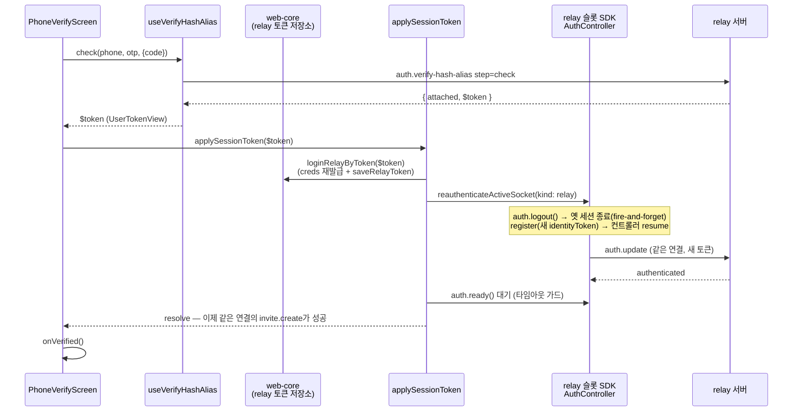
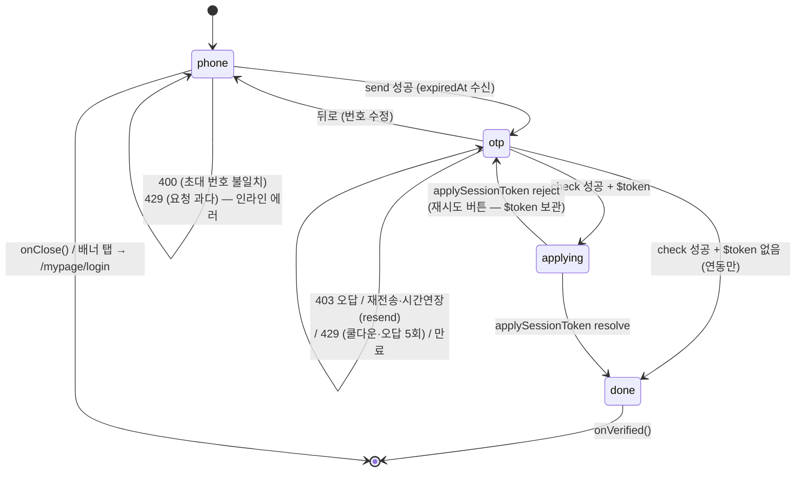

# 전화번호 인증 (PhoneVerifyScreen · applySessionToken)

> 상태: Live · 최종 갱신: 2026-07-29 · 관련 ADR: [ADR-0033](../../../../docs/adr/0033-relay-dm-invite-and-auth-parallel-tracks.md) · 로드맵: [relay-dm-invite-parallel-roadmap](../../../../docs/plans/relay-dm-invite-parallel-roadmap.md) Track A

## 목적

1:1(DM) 중계 초대는 **번호의 주인만** 발급·수락할 수 있다. 디바이스 유저(게스트)는
`invite.create`/`invite.accept`가 403으로 막히므로, 번호 소유 증명
(`auth.verify-hash-alias`)으로 **메인유저로 승격**하는 입구가 필요하다.

이 문서는 그 입구 두 조각을 다룬다 — 둘 다 로드맵 "인터페이스 계약"의 Track A
산출물이며 Track C(수신자 흐름)가 소비한다:

- **`applySessionToken($token)`** — `verify-hash-alias step=check` 성공 응답의
  `$token`(새 세션)을 web-core 세션 저장소와 relay 소켓 연결 신원에 반영한다.
  완료 후 같은 소켓 연결에서 `invite.create`가 403 없이 성공한다.
- **`PhoneVerifyScreen`** — 번호 입력 → OTP 대조 풀스크린. 완료 시 세션 전환까지
  끝난 상태로 `onVerified()`를 부른다.

백엔드 계약 원본: `chatic-sockets-api/docs/specs/relay-server-invite/05-client-guide.md`
(§A-1 인증 흐름 · §발송 제한 · §에러 코드).

## 설계 원칙

- **세션 전환의 원본은 web-core 토큰 저장소다.** 소켓은 저장소를 따라간다
  (기존 guest→social 승격과 같은 결: 저장소 커밋 → 같은 연결 재인증). 소켓에만
  새 신원을 심고 저장소를 안 바꾸는 경로는 만들지 않는다 — HTTP 서명/refresh가
  옛 신원으로 남는다.
- **에러 분기는 `errorCode`(HTTP status)로만 한다.** 메시지 문자열 파싱 금지 —
  `getSocketErrorCode(error)`(`apps/web/src/app/utils/errors.ts`)를 쓴다.
- **타이머·만료는 서버 값(`expiredAt`)으로만 렌더한다.** 유효시간을 클라이언트에
  하드코딩하지 않는다 (ADR-0033 D8과 같은 원칙).
- **백엔드에 없는 개념은 UI에서 있는 개념으로 매핑한다.** "시간 연장" 버튼은
  `step=resend`다 (ADR-0033 D9). 재전송해도 오답 카운터는 유지된다는 안내를 함께 둔다.
- **번호·OTP·초대 코드는 요청 body에만 산다.** 로그·URL·쿼리 키에 남기지 않는다.
- **클라 카운터는 서버 429의 보조다.** 재전송 5회 제한은 클라에서 먼저 끊되,
  서버 429가 오면 그 안내가 우선한다.

## 범위

**포함**

- `applySessionToken($token)` (`@chatic/app-runtime` 공개 export) + web-core
  `loginRelayByToken` (토큰 뷰를 relay 세션으로 커밋하는 서비스)
- `PhoneVerifyScreen` (`apps/web/src/app/features/auth/`) — 번호/OTP 2스텝,
  expiredAt 타이머, 재전송("시간 연장" 포함), 에러 케이스 전부, dev 발송 스위치
- 계정 갈라짐 방어 배너 (인증 UI 상단, 소셜 로그인 `/mypage/login` 진입 재사용)
- `auth.logout` 후 디바이스 유저 복귀 회귀 확인 (시나리오 테스트)

**제외**

- 초대 발급/수락 화면 자체 (Track B·C 소유 — 이 화면을 import해서 쓴다)
- `auth.attach-social` 소셜 연동 (Track D)
- 번호 변경·번호만으로의 계정 복구 (백엔드 미지원)
- cloud 슬롯 신원 갱신 — `$token`은 relay 신원이고 인증 진입점(홈/딥링크)은 relay
  문맥이다. cloud 세션이 활성인 경우는 기존 세션이 그대로 유효하게 남는다.

## 시나리오

### 1. 수신자: 초대 수락 중 번호 인증 (context: 'invite-accept')

1. Track C가 `invite.get`에서 `needVerify=true`를 받고
   `<PhoneVerifyScreen context="invite-accept" inviteCode={code} onVerified onClose/>`를 띄운다.
2. 화면 상단에 계정 갈라짐 방어 배너: "이미 계정이 있다면 소셜로 먼저 로그인하세요"
   — 탭하면 `onClose()` 후 `/mypage/login`(기존 소셜 로그인 브릿지 페이지)으로 이동.
3. 번호 입력 → [인증번호 받기] → `send(phone, { code })`. 초대에 적힌 번호가
   아니면 **발송 단계에서 400** → "초대받은 번호가 아니에요" 인라인 에러.
4. 발송 성공 → 토스트 + OTP 스텝. 타이머는 응답 `expiredAt` 기준 mm:ss 카운트다운.
5. 6자리 입력 시 자동 제출 → `check(phone, otp, { code })`.
    - 403 → "인증번호를 정확히 입력해 주세요" (입력 유지, 재시도 가능)
    - 429 → 오답 5회 초과. "인증 시도 횟수를 초과했어요 — 인증번호를 다시 받아
      주세요" + **재전송해도 틀린 횟수는 초기화되지 않는다는 안내**
    - 400 → 코드 미발송/만료. 만료 안내 + 재전송 유도
6. check 성공 + `$token` 존재 → **`applySessionToken($token)` 완료까지 대기**
   (스피너 유지) → `onVerified()`. `$token`이 비면(연동만 됨, 세션 불변) 곧장
   `onVerified()`.
7. 이후 Track C가 프로필 → `invite.accept`로 진행 — 같은 소켓 연결이 이미
   메인유저 신원이라 403이 나지 않는다.

### 2. 초대자: 발급 403에서 진입 (context: 'invite-create')

1. Track B의 발급 화면에서 `invite.create`가 403이면(디바이스 유저)
   `<PhoneVerifyScreen context="invite-create" onVerified onClose/>`를 띄운다
   (05-client-guide §A-1 — 현 정책상 소셜 유저는 발급 가능하므로 이 분기는
   자리만 확보된 상태).
2. `inviteCode` 없이 같은 흐름. 발급 단계 400 분기 없음.
3. `onVerified()` 후 호출측이 `invite.create`를 재시도한다.

### 3. 재전송과 "시간 연장"

- OTP 스텝의 [재전송]과 타이머 옆 [시간 연장]은 **둘 다 `step=resend`**다
  (ADR-0033 D9 — 백엔드에 연장 개념이 없다). 새 코드 + 새 `expiredAt`이 오고
  타이머가 다시 시작된다.
- 재전송 성공 안내에 "이전에 틀린 횟수는 그대로예요"를 포함한다 (서버가 오답
  카운터를 초기화하지 않는다 — §발송 제한).
- 클라 카운터로 재전송 5회를 넘으면 버튼을 비활성화한다. 그 전에 서버 429
  (60초 쿨다운)가 오면: OTP 스텝 재전송 429 → "잠시 후 다시 시도해 주세요",
  번호 스텝 최초 발송 429 → "인증 요청이 너무 많아요" (하루 10회/기기 20회 상한).
  둘 다 코드는 429뿐이라 **어느 스텝에서 났는지로만** 문구를 고른다.

### 4. 타이머 만료

`expiredAt` 도달 시 00:00 고정 + "인증번호가 만료되었어요" + 제출 비활성.
재전송으로만 복구한다.

### 5. dev 발송 스위치

`VITE_ENV`가 `DEV`/`LOCAL`인 빌드에서만 번호 스텝 하단에 노출:

- **dryRun** — 발송 없이 흐름만 (쿨다운·상한·오답 카운터는 정상 동작)
- **Slack 수신** — `{ sms: false, slack: true }` (SMS 못 받는 개발 환경용)

미지정 스위치는 요청에 아예 싣지 않아 서버 기본값이 산다 (Track 0
`useVerifyHashAlias`가 이미 보장).

### 6. 로그아웃 회귀 (범위 4)

번호 인증으로 승격한 뒤 로그아웃해도 기존 경로 그대로다:
`useSessionLogout` → `logoutSession`(양 슬롯 `auth.logout` + web-core 로컬
teardown) → `useRelaySessionKeepAlive`가 relay 인증 부재를 보고
`loginRelayGuestByDevice`로 **같은 디바이스 유저** 복귀. `applySessionToken`은
게스트 로그인이 소유한 `delegatorId`와 디바이스 저장소를 건드리지 않으므로
(guest→social 승격과 동일 계약) 이 경로가 깨지지 않는다 — 테스트로 고정한다.

## 다이어그램

### 세션 전환 (applySessionToken)

- `auth.refresh`/`auth.switch`는 **같은 신원**의 재서명(authId+signature) 경로라
  다른 유저의 새 `identityToken`을 실을 수 없다 — 신원 교체의 SDK 경로는
  `logout() → register()`다 (SDK `AuthControllerImpl.register`: inactive면 resume
  하며 연결돼 있으면 즉시 `auth.update` 발송). 재연결이 필요 없다.
- 저장소 커밋이 먼저다: `SocketReauthBinder`(React)가 같은 변화를 감지해도
  `reauthenticateActiveSocket`의 토큰 동일성 가드로 no-op — 이중 실행이 수렴한다.

### 화면 상태

## 상세 구현

### applySessionToken 쪽

| 파일 | 역할 |
| --- | --- |
| `libs/web-core/src/session/services.ts` | `loginRelayByToken(tokenView)` 추가 — 기존 private `applyRelaySession`(services.ts:96, guest/social 로그인이 공유) 재사용: `buildCredentialsByToken` + `saveRelayToken` + authenticated 플래그. `delegatorId`는 건드리지 않는다(services.ts:92-94 주석 계약 그대로) |
| `libs/app-runtime/src/socket/auth/sessionDelegate.ts` | `createSocketSessionDelegate()` — `connection/useSocketSessionDelegate.ts`의 위임 객체 생성을 모듈 함수로 추출 (React 밖에서도 쓰기 위함). 훅은 이걸 `useMemo`로 감싼다 |
| `libs/app-runtime/src/socket/auth/applySessionToken.ts` | 본체. (1) `$token.Token.identityToken` 없으면 no-op(연동만 된 경우 — 05-client-guide §A-1), `$auth.id` 없으면 reject(소켓 재등록 불가 계약 위반 — 반쪽 커밋 방지를 위해 저장 전에 검사) (2) `loginRelayByToken` (3) `reauthenticateActiveSocket({ kind: 'relay' })`(logout→register, `libs/app-runtime/src/socket/auth/reauthenticateActiveSocket.ts:35`) (4) relay 슬롯 `auth.ready()`를 타임아웃(10s)과 경쟁시켜 대기. relay 슬롯이 아직 없으면 (2)까지만 — 다음 부트가 새 토큰으로 register 한다 |
| `libs/app-runtime/src/index.ts` | `applySessionToken` 공개 export (+ `public-surface.test.ts` 목록 갱신) |

검증된 사실 (file:line):

- 소켓 신원 갱신 경로는 guest→social 승격과 공유한다:
  `reauthenticateActiveSocket.ts:20-33` "re-authenticates the live socket to a NEW
  identity on the SAME connection". 토큰 동일성 가드(`:56`)가
  `SocketReauthBinder`와의 이중 실행을 no-op으로 수렴시킨다 (테스트로 고정).
- SDK `register()`는 "Idempotent; resumes auth when inactive (after logout or
  expiry)" — `@lemoncloud/chatic-sockets-lib` `auth-controller.js` register:
  `!active`면 resume + connected면 즉시 `sendUpdate()`. `ready()`는
  authenticated에 resolve, terminal expired에 reject.
- 게이트웨이는 relay 슬롯에 고정돼 있다 —
  `libs/app-runtime/src/data/factories/remoteFactory.ts:42-44` (invite +
  verifyHashAlias/attachSocial 전부 `getScopedClient('relay')`). 세션 전환도
  relay 슬롯만 갱신하면 초대 흐름과 정합.
- `$token`에 필요한 필드가 실려 온다 — sockets-api fixture
  (`chatic-sockets-api/data/auth/verify-hash-alias-sample.json`):
  `Token.{authId,accountId,identityId,identityToken}` + `$auth.id` + `userRole`.
  web-core `getServerAuthRegistration('relay')`와 `signServerAuth('relay')`가
  요구하는 전부다. 실서버 응답이 fixture와 다르면(특히 `$auth` 누락)
  `applySessionToken`이 커밋 전에 reject한다 — dev 스테이지 1회 왕복으로 확정 필요.

### PhoneVerifyScreen 쪽 (`apps/web/src/app/features/auth/`)

| 파일 | 역할 |
| --- | --- |
| `components/PhoneVerifyScreen.tsx` | 풀스크린 Dialog(`EmailVerifyDialog.tsx:133-134` 패턴 — `h-full max-w-none` + `hideClose`, 마운트=열림). 스텝 상태 `'phone' \| 'otp'`, 발송/대조는 Track 0 `useVerifyHashAlias`, 에러 분기는 `getSocketErrorCode`, 세션 전환은 `applySessionToken` |
| `components/PhoneVerifyBanner.tsx` | 계정 갈라짐 방어 배너 — `onClose()` 후 `ROUTES.mypage.login` 이동(`useNavigateWithTransition`) |
| `hooks/useOtpExpiryCountdown.ts` | `expiredAt`(epoch ms) 기준 1초 틱 카운트다운 `{secondsLeft, isExpired}` — `useInviteCountdown.ts` 하우스 스타일, 초 단위 |
| `utils/phone.ts` | `isValidKoreanPhone`/`formatPhoneNumber` — `AddFriendSheet.tsx:54-66`과 동일 로직의 auth 피처 사본 (공용 유틸 부재가 현 컨벤션; 통합은 별도 과제) |
| `utils/env.ts` | `isDevBuild()` — `import.meta.env.VITE_ENV`를 이 모듈에만 격리 (ts-jest가 import.meta를 못 읽으므로 테스트는 모듈째 mock) |
| `index.tsx` | 피처 배럴에 `PhoneVerifyScreen` export — Track C는 `features/auth`에서 import |

UI 재사용: `VerificationCodeInput`·`formatTime`·`VERIFICATION_CODE_LENGTH`
(`features/account` 배럴), 토스트 `useToast`, 문구는
`public/locales/{ko,en}/translation.json`의 `phoneVerify.*` 블록.

- props는 로드맵 계약 그대로: `{ context: 'invite-accept' | 'invite-create';
  inviteCode?: string; onVerified(): void; onClose(): void }`. Track C 소비
  import 경로: `apps/web/src/app/features/auth` 배럴(`features/auth/index.tsx`).
- `check`에도 `code`를 동봉한다 — 계약 시그니처(`check(phone, otp, opts?:
  {code?})`)에 있고, 서버가 403 '초대 코드 불일치'로 검증한다.
- 429 문구는 스텝 위치로 고른다 (번호 스텝 최초 발송 = 일일 상한 / OTP 스텝
  재전송 = 60초 쿨다운) — 같은 429라 코드로는 구분 불가. 서버가 세부 코드를
  실어주면 그때 정밀화.
- Figma 노드(3421-59180 외 14개, 로드맵 Track A 절)는 구현 세션에서 MCP 미인증으로
  열람하지 못했다 — 레이아웃은 기존 인증 화면(`VerifyStep.tsx`·`AddFriendSheet.tsx`)
  관용구를 따르며, 디자인 픽셀 맞춤은 후속 확인 항목.

## 검증 방법

- `npx jest --config libs/app-runtime/jest.config.js applySessionToken` — 8 케이스.
  **403 계약 고정 포함**: 실제 `SocketManager` + mock relay 서버가 신원=게스트일 때
  `invite.create`를 403으로 거부 → `applySessionToken` 후 같은
  `getScopedClient('relay')` 경유 호출이 성공 (`applySessionToken.test.ts`)
- `npx jest --config apps/web/jest.config.js --testPathPatterns "features/auth"` —
  27 케이스: 화면 스텝/타이머 만료/에러 코드 분기/재전송 캡/배너/dev 스위치
  (`PhoneVerifyScreen.test.tsx` · `useOtpExpiryCountdown.test.ts` · `phone.test.ts`)
- `npx jest --config libs/web-core/jest.config.js session/services` —
  `loginRelayByToken` 커밋 + delegatorId 불변
- `npx tsc -b apps/web/tsconfig.app.json` (프로젝트 레퍼런스 빌드 — 라이브러리
  dist가 없는 새 워크트리에서는 `--noEmit -p`가 TS6305를 내므로 `-b`를 쓴다)
- dev 스테이지 수동: 디바이스 유저 → 번호 인증 → 같은 연결로 `invite.create`
  성공 / `auth.logout` 후 게스트 복귀. 특히 실서버 `$token`의 `$auth` 동봉을
  1회 확인 (fixture로만 검증됨 — 누락 시 applySessionToken이 커밋 전에 reject).
