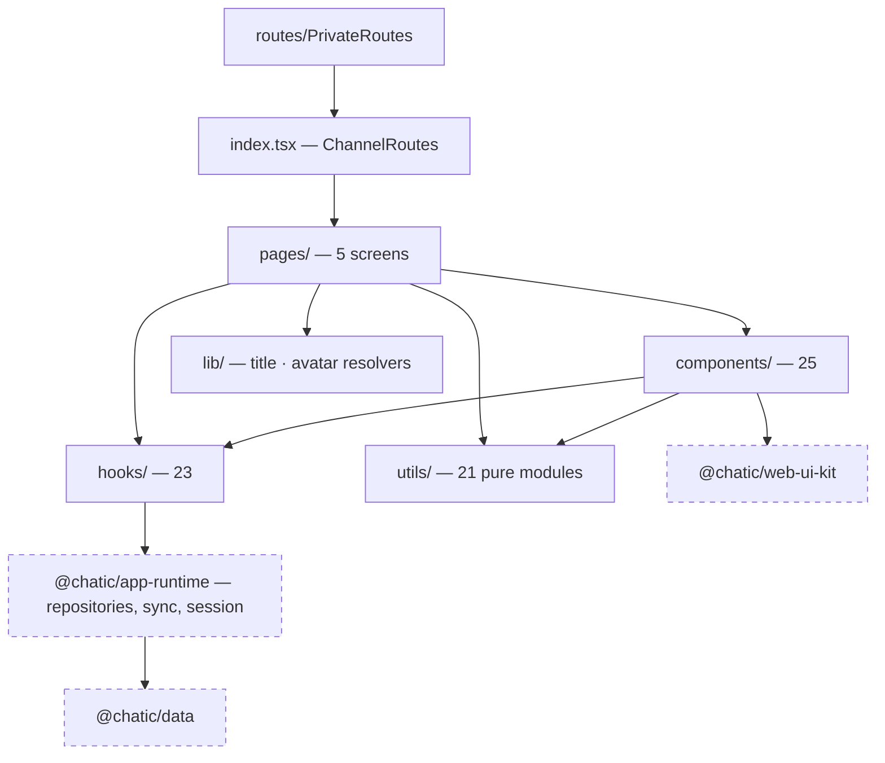
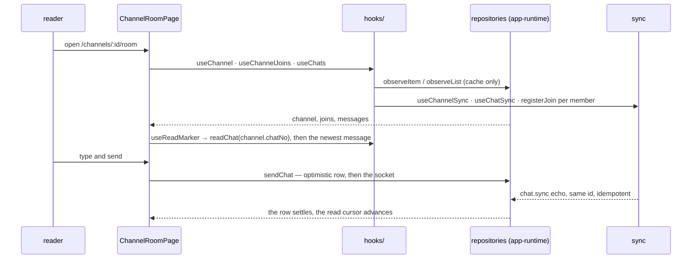

# channels

**The conversation itself: the room, the thread, the settings screen and the invite flow.** This
feature owns `apps/web/src/app/features/channels` — every screen you reach once a channel has been
chosen. It observes the channel, its members and its messages, writes sends, reads, reactions,
membership changes and invites, and exports one thing to the rest of the app: `ChannelRoutes`.

This document covers the **overview and structure**. The per-topic detail is canonical in the
sibling files listed under [Documents](#documents).

## Purpose

`index.tsx` exports `ChannelRoutes`, and `routes/PrivateRoutes.tsx` is its only consumer. Everything
else is internal — but five other features reach into this one for pieces of it. What they take:

```bash
grep -rn "channels/" --include='*.ts' --include='*.tsx' apps/web/src/app/features apps/web/src/app/routes \
  | grep "from '" | grep -v "^apps/web/src/app/features/channels"
```

Today that is `ConfirmDialog` (four callers), `resolveChannelTitle` / `resolveChannelAvatar` and
`useDmPeers` (the home list and place channel management, which must name a room exactly as the room
does), and `messagePlainText` / `toPlainPreview`. The title and avatar resolvers are shared **on
purpose** — see [dm-and-self-chat.md](./dm-and-self-chat.md). The rest is the ordinary pressure of a
shared component sitting in a feature folder.

This feature does **not** own:

- **the channel list** — that is `home` ([../home/README.md](../home/README.md)), including unread
  badges and previews;
- **relay 1:1 invites** — issuing and accepting belongs to `invite`
  ([../invite/README.md](../invite/README.md)); a DM's re-invite hands off to it;
- **push routing into a room or a thread** — `notifications`
  ([../notifications/README.md](../notifications/README.md));
- **caches, cursors, the join window and the feed predicates** — `@chatic/data`
  ([libs/data](../../../../../libs/data/README.md));
- **presentation primitives** — `@chatic/web-ui-kit`, with Block Kit bodies drawn by
  `@chatic/block-kit`.

## Design principles

1. **A page owns data and orchestration; a component owns how it looks.** Every visible element
   comes from `@chatic/web-ui-kit`, assembled here. A screen never invents a colour or a glyph.
2. **One page per surface, not per stereo.** `ChannelRoomPage` serves group, 1:1 and self rooms;
   the differences are variants and gates passed into components. Scrolling, keyboard handling,
   grouping, reactions, threads, read cursors and paging are identical across all three, and
   splitting the page would duplicate every one of them.
3. **One answer per question, shared by every surface that asks it.** A room's title, its avatar,
   a person's display name, who the DM peer is — each has exactly one resolver, because the bug
   they exist to prevent is the same room reading differently in the list and in the room.
4. **Reads observe the cache; freshness is a separate registration.** No screen fetches to render.
5. **Derive before you filter.** Reactions and threads are built from the unfiltered cache window;
   the feed filter runs after, on the rendering list only.
6. **Guess nothing about a person's state.** Where the server cannot distinguish two situations —
   invited versus departed is the standing example — the screen says less rather than guessing.

## Scope

**In** — the room and its message stream, the full-screen thread, reactions, the settings screen and
its dialogs, the channel invite screens, and the hooks and pure derivations behind them.

**Out** — the home list and its badges (`home`), relay invite issue and accept (`invite`), push
navigation (`notifications`), place profiles beyond opening their editor (`place` / `home`), and
everything below the repository call (`@chatic/data`, `@chatic/app-runtime`).

## Structure



The arrow that is missing is the point: **a component never calls a repository.** Data enters
through `hooks/`, and a component receives it as props — which is why the pure modules in `utils/`
and `lib/` can be tested without React or a runtime.

### The room, end to end



### Screens

| Page                  | Route (`ROUTES.channels.*`)           | What it is                            |
| --------------------- | ------------------------------------- | ------------------------------------- |
| `ChannelRoomPage`     | `/channels/:channelId/room`           | the conversation                      |
| `ThreadPage`          | `/channels/:channelId/thread/:rootNo` | one root message and its replies      |
| `ChannelSettingsPage` | `/channels/:channelId/settings`       | name, notification, members, leave    |
| `InvitePage`          | `/channels/:channelId/invite`         | add people: place tab and contact tab |
| `InviteLinkPage`      | `/channels/:channelId/invite/link`    | the issued invite link                |

There is no create-channel screen here: a room is created from `home`, and a self chat is created by
the server.

### Directories

```text
apps/web/src/app/features/channels/
├── index.tsx        ChannelRoutes — the only export the app uses
├── pages/           5 screens
├── components/      25 components, each with its Props co-located
├── hooks/           23 hooks — observe, sync, mutate
├── lib/             the two cross-surface resolvers: title and avatar
├── utils/           21 pure modules — derivations, predicates, formatters
├── stores/          useRecentEmojiStore (zustand, persisted)
└── types/           the view models
```

Files whose contents the name does not give away:

- `types/index.ts` — `ClientChannelView`, `ClientChatView` and `ChannelMember`, plus re-exports of
  the domain models, so feature code imports its types from one place. There is no `types/` file per
  model to open.
- `lib/` holds only `resolveChannelTitle` and `resolveChannelAvatar`: the two answers other features
  are allowed to borrow. Everything else that is pure lives in `utils/`.
- `utils/membership.ts` — `hasLeftChannel`, `isChannelMember`, `isSomeoneElsesSelfChat`, three
  questions about a join row that nothing else can answer.
- `utils/displayName.ts` — the one chain that turns a user id into a name.

The native bridge is used in four places and nothing new is asked of it: `getContacts`,
`openShareSheet`, `openSettings` and `openURL`.

## Usage

```tsx
// routes/PrivateRoutes.tsx
<Route path="/channels/*" element={<ChannelRoutes />} />
```

Inside a screen, data comes from the hooks:

```tsx
const { channel } = useChannel(channelId);
const { joins, myJoin, activeMemberIds, cursorByUser } = useChannelJoins(channelId);
const { messages, rawChats, loadMore } = useChats({ channelId, limit: 100, joinedNo: myJoin?.joinedNo });
```

### Wiring

```text
app.tsx
└── RuntimeConnectionHost        (repositories, sync, session — @chatic/app-runtime)
    └── PrivateRoutes
        └── ChannelRoutes        (this feature)
            └── ChannelRoomPage
                ├── useChannel / useChannelJoins / useChannelMembers / useChannelProfiles
                ├── useChats  → useChatSync, useForegroundChatRefresh
                ├── useJoinPositions → registerJoin per member
                └── useReadMarker, useChatScroll, useMessageJump
```

## Scenarios

### 1. Opening a room

`useChannel` observes the row and registers channel sync; a `null` before any row has arrived means
"still fetching", not "no such channel". `useChats` observes the newest 100 rows, windowed by my
`join.joinedNo`. The read marker fires immediately with `channel.chatNo`, then corrects to the
newest message once the list lands.

### 2. Sending

`sendChat` writes an optimistic row with no `chatNo`, which sorts to the bottom of the list. The
server's reply and the `chat.sync` echo carry the same id, so the cache converges without a flicker,
and the sender's read cursor advances through the new message.

### 3. Reacting

The tap resolves to `on` or `off` against the folded state, the repository writes the returned event
into the chat cache, and the fold re-runs. The event never appears in the feed — it is filtered out
there and folded into a chip instead.

### 4. Replying in a thread

The reply carries `parentId` as the root's full `<channelId>:<chatNo>` id. It is hidden from the
feed, shown on the thread page, and counted as unseen against the read cursor snapshotted when the
room was opened.

### 5. The 1:1 peer leaves

Their join row goes inactive, the composer locks, and a derived footer says where the invite stands
— absent, pending with a countdown, rejected or expired — with a re-invite CTA whenever there is
nothing live to wait for.

### 6. Adding people

The place tab derives its candidate pool from channels the cache already holds and calls
`channel.invite` once; the contact tab reads device contacts and issues invites by phone number, or
hands back a link.

## Documents

| File                                                   | What it covers                                                                              |
| ------------------------------------------------------ | ------------------------------------------------------------------------------------------- |
| [data-layer.md](./data-layer.md)                       | the 23 hooks: observing, sync registration, paging, read cursors, the writes                |
| [chat-room.md](./chat-room.md)                         | the room screen: header, stream, message row, system notices, attachments, composer, scroll |
| [reactions-and-threads.md](./reactions-and-threads.md) | the fold, the toggle, gestures, the emoji picker, thread derivation, the thread page        |
| [channel-settings.md](./channel-settings.md)           | the settings screen, the member list and the four dialogs                                   |
| [dm-and-self-chat.md](./dm-and-self-chat.md)           | per-stereo identity: title chain, avatar rule, the DM peer, peer absence and re-invite      |
| [invite.md](./invite.md)                               | the two invite screens: place candidates, device contacts, the invite link                  |

## How to verify

```bash
npx jest --config apps/web/jest.config.js --runInBand --watchman=false apps/web/src/app/features/channels
npx tsc -p apps/web/tsconfig.app.json --noEmit
```

Traps that apply here:

- The app type-checks against the **built** `.d.ts` of the libraries, not their sources, so a change
  to `@chatic/web-ui-kit` or `@chatic/data` needs that library built first or the app reports
  "property does not exist". A stale `dist`/`out-tsc` produces phantom `TS6305` errors; delete the
  `*.tsbuildinfo` files under it and build again.
- Jest does not type-check — a broken fixture surfaces at runtime as "… is not a function".
- Downstream of this feature: `home`, `place`, `search`, `invite` and `mypage` all import from it
  (see the grep under [Purpose](#purpose)), so a change to `lib/`, `utils/` or `hooks/` reaches
  their suites too. Run the whole app project when touching those.
