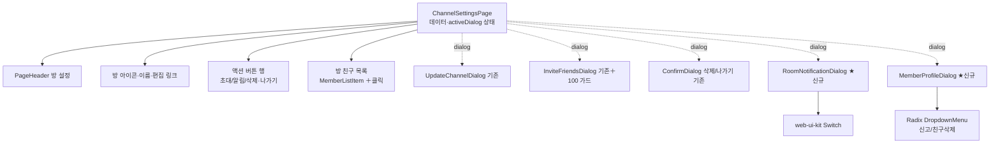
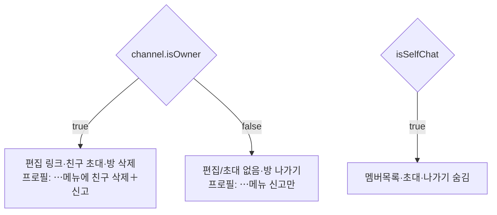

# 채널 설정 UI (Channel Settings UI)

> 상태: Live · 최종 갱신: 2026-07-16 · 관련 ADR: [ADR-0015](../../../../../docs/adr/0015-channel-settings-ui-refresh.md)

## 목적

채널 설정 관련 화면(`ChannelSettingsPage` 및 그 하위 다이얼로그)을 DoU 디자인 개편에 맞춰
`@chatic/web-ui-kit` 프리미티브 기반으로 재정비한다. 설정 화면·정보 수정·확인
다이얼로그는 이미 존재하므로 **재스타일**이 중심이고, **프로필 상세("친구 정보")와 알림
설정**은 신규로 추가한다. 소유자 여부에 따라 노출이 달라지는 규칙을 한 곳에서 일관되게
표현하는 것이 목표다.

## 설계 원칙

- **프레젠테이션은 web-ui-kit 프리미티브로 조립한다.** 새 화면(프로필 상세·알림 설정)은
  feature 레이어의 다이얼로그 컴포넌트로 두되, 시각 요소는 web-ui-kit(`Switch`·`AlertDialog`·
  `Badge`·`ProfileAvatar` 등)로 구성한다. 재사용 가치가 분명한 프리미티브가
  없을 때만 web-ui-kit에 신규 정의한다(불필요한 신규 컴포넌트 지양).
- **소유자 분기는 `channel.isOwner` 하나로 파생한다.** 설정 화면·프로필 상세 모두 동일
  기준을 쓴다([useChannel.ts:10-15](../../../src/app/features/channels/hooks/useChannel.ts) —
  `isOwner = !!ownerId && ownerId === myUid`). 멤버별 소유자 뱃지는 `memberId === channel.ownerId`.
- **미연동 액션은 UI만 둔다.** 백엔드 메서드가 없는 알림 토글·신고하기는 표시/버튼만 두고
  데이터 연동을 하지 않는다(ADR-0015). 눌렀을 때는 토스트 안내로 기대치를 관리한다.
- **별명(닉네임) 편집은 이번 범위에서 제외한다.** 백엔드 미비로 편집 input·`완료` 버튼을 두지
  않는다. 프로필 상세의 이름은 읽기 표시만(후속 과제).
- **`친구 삭제`(kick)는 실제 연동한다.** `leaveChannel({ channelId, userId })`로 특정 멤버를
  내보내며 **소유자만** 가능하다. self-leave와 달리 내 채널 캐시를 유지해야 하므로 repository
  분기가 필요하다(아래 상세 구현).
- **신규 화면은 in-page Dialog로 연다.** 기존 `UpdateChannelDialog`/`InviteFriendsDialog`
  패턴을 그대로 따르고 URL 라우트를 추가하지 않는다.
- **기존 동작 로직은 유지한다.** 나가기/삭제/초대/정보수정의 데이터 흐름은 손대지 않고
  표현만 재배치한다.

## 범위

**포함**

- **채팅방 설정 재스타일** — 방 아이콘/이름(+`편집` 링크, 소유자만), 액션 버튼 행,
  방 친구 목록(소유자 뱃지·`MY` 뱃지). 소유자/일반 멤버 분기.
- **알림 액션 추가** — 액션 버튼 행에 `알림`(Bell) 추가(소유자·일반 공통). 탭 시 알림 설정
  Dialog 오픈.
- **알림 설정 Dialog(신규)** — 앱 알림 꺼짐 배너 + `메시지 알림` 토글. **UI만**(로컬 상태).
- **프로필 상세 Dialog(신규, "친구 정보")** — 멤버 항목 탭으로 진입. 아바타 + 이름(읽기 표시),
  ⋯메뉴(`신고하기` 공통, `친구 삭제` 소유자만). **신고는 UI만, `친구 삭제`(kick)는 연동.
  별명 편집은 제외**(input·완료 없음).
- **확인 다이얼로그** — 방 삭제/나가기(`ConfirmDialog`), 정보 저장 토스트. 디자인 확인 후 유지/보정.
- **인원 100명 초과 안내 얼럿** — 초대 흐름 클라이언트 가드.

**제외**

- 멤버별 별명 쓰기·알림 실제 연동 등 백엔드 필요 작업(kick은 포함).
- 1:1 채팅 전용 레이아웃(ADR-0015의 제외 항목).
- 신규 URL 라우트. 데이터/동기화 로직 변경.

## 시나리오

1. **소유자 진입** — 방 아이콘·이름 + 이름 아래 `편집` 링크. 액션 3개(`친구 초대`·`알림`·
   `방 삭제`). 방 친구 목록에서 소유자에게 초록 뱃지, 본인에게 `MY`.
2. **일반 멤버 진입** — 이름 편집/친구 초대 없음. 액션 2개(`알림`·`방 나가기`). 목록 동일.
3. **알림 설정 열기** — `알림` 탭 → Dialog. 기기 알림이 꺼져 있으면 상단 배너, `메시지 알림`
   토글은 로컬 상태로 on/off(저장/연동 없음). 재진입 시 초기화.
4. **멤버 프로필 보기** — 멤버 항목 탭 → "친구 정보" Dialog. 이름은 읽기 표시(편집 없음).
   ⋯메뉴: `신고하기`(공통), 소유자면 `친구 삭제`도 노출. `신고하기`는 토스트만(UI). `친구 삭제`는
   확인 후 `leaveChannel({ channelId, userId })`로 실제 추방 → 멤버 목록에서 제거, Dialog 닫힘.
5. **정보 수정(소유자)** — 이름 `편집` 링크 또는 이름 탭 → `UpdateChannelDialog`. 방이름·
   썸네일 저장 → "방 정보가 저장되었어요" 토스트(기존 동작 유지).
6. **나가기/삭제** — 액션 탭 → `ConfirmDialog` → 확정 시 기존 뮤테이션 실행 후 홈으로 이동.
7. **초대 인원 초과** — 초대 확정 시 (기존 멤버 + 선택 인원) > 100이면 얼럿("방 인원은 최대
   100명까지만 함께할 수 있어요") 노출, 초대 중단.

## 다이어그램

### 화면 구성 (컨테이너 → Dialog)

### 소유자 분기 결정

## 상세 구현

핵심 파일과 역할. 대안 비교·선택 이유는 [ADR-0015](../../../../../docs/adr/0015-channel-settings-ui-refresh.md).

- **`ChannelSettingsPage`** ([pages/ChannelSettingsPage.tsx](../../../src/app/features/channels/pages/ChannelSettingsPage.tsx)) —
  컨테이너. 루트는 `flex h-full flex-col`(헤더 고정) + 콘텐츠 `flex-1 overflow-y-auto`로,
  `UnifiedLayout`의 `h-dvh overflow-hidden` 셸 안에서 **멤버가 많아지면 목록 영역이 스크롤**된다
  (다른 상세 페이지 패턴과 동일). `DialogType`([:21](../../../src/app/features/channels/pages/ChannelSettingsPage.tsx))에
  `'notification'` 추가, 프로필용 `selectedMember` 상태 추가.
    - 액션 버튼 행([:158-182](../../../src/app/features/channels/pages/ChannelSettingsPage.tsx))에
      `알림`(Bell, `t('chat.settings.notifications')`) 추가 — self가 아니면 소유자·일반 공통.
      순서: 소유자 `초대·알림·삭제`, 일반 `알림·나가기`.
    - 방 이름 아래에 `편집` 링크(밑줄 텍스트 버튼) — 소유자·비-self일 때만 노출, 클릭 시 `'update'`
      Dialog 오픈(기존 `Pencil` inline 트리거 대체).
    - 멤버 항목 탭 시 `openMemberProfile(memberView)`로 `selectedMember` 설정 + `'profile'` 오픈.
    - `handleKickMember`: `leaveChannel({ channelId, userId: selectedMember.id })` → 토스트
      (`kicked`/`kickFailed`) → `closeDialog`. `canKick`은 `isOwner && 대상≠소유자 && 대상≠본인`.
- **`MemberListItem`** ([components/MemberListItem.tsx](../../../src/app/features/channels/components/MemberListItem.tsx)) —
  `onClick`이 있으면 루트를 `button`으로 렌더(없으면 `div`). 소유자 뱃지·`MY` 뱃지는 기존 하드코딩
  hex(`#B0EA10`/`#102346`) 유지(토큰화는 후속). 프레젠테이션만.
- **`RoomNotificationDialog`(신규)** ([components/RoomNotificationDialog.tsx](../../../src/app/features/channels/components/RoomNotificationDialog.tsx)) —
  풀스크린 슬라이드업 Dialog(UpdateChannelDialog 패턴, 우상단 X). `앱 알림 꺼짐` 배너(정적) +
  `메시지 알림` 행(web-ui-kit `Switch`, 로컬 `useState`). i18n `chat.settings.notificationSettings.*`
  (기존 키 재사용). UI만 — 연동/영속 없음.
- **`MemberProfileDialog`(신규)** ([components/MemberProfileDialog.tsx](../../../src/app/features/channels/components/MemberProfileDialog.tsx)) —
  풀스크린 슬라이드업 Dialog. 상단바: 좌 뒤로가기(`ChevronLeft`, 닫기) · 중앙 "친구 정보" ·
  우 ⋯ `DropdownMenu`(`@chatic/ui-kit`, ChatRoomHeader moreMenu 패턴). **`DropdownMenu`는
  `modal={false}` 필수** — modal Dialog 안의 modal DropdownMenu는 pointer 충돌로 트리거 클릭 시
  부모 Dialog가 닫힌다(프리뷰에서 확인·수정). 아바타(`ProfileAvatar`) +
  소유자 뱃지(초록 체크) + 이름(읽기 표시, 편집 없음). ⋯메뉴: `신고하기`(공통, 내부 토스트)·
  `친구 삭제`(`canKick`일 때만, danger). Props: `member`, `memberIsOwner`, `canKick`, `onKick`,
  `isKicking`, `open`, `onOpenChange`.
    - `친구 삭제` → 내부 `ConfirmDialog`(danger) 재확인 → `onKick()`. 컨테이너가 `leaveChannel` 호출.
- **`ChannelRepositoryV2.leaveChannel`** ([ChannelRepositoryV2.ts:248](../../../../../libs/data/src/data/repositories-v2/ChannelRepositoryV2.ts)) —
  kick 지원을 위한 evict 분기. `isSelfLeave = !payload.userId` — self-leave만 `leftChannelIds` 추가 +
  `cacheDelete`(및 실패 시 롤백). kick(타 userId)은 채널 캐시를 건드리지 않는다. `useChannelMutations.leaveChannel`은
  이미 `ChatLeaveInput = { channelId, userId? }`를 통과시켜 훅 변경 불필요.
- **`InviteFriendsDialog`** ([components/InviteFriendsDialog.tsx](../../../src/app/features/channels/components/InviteFriendsDialog.tsx)) —
  `useChannel`로 현재 인원을 얻어 초대 확정 직전 `(memberCount + 선택 인원) > 100`이면 단일 버튼
  `AlertDialog`(`chat.settings.memberLimit.*`) 노출 후 중단. `MAX_ROOM_MEMBERS = 100` 상수.
- **`ConfirmDialog`** ([components/ConfirmDialog.tsx](../../../src/app/features/channels/components/ConfirmDialog.tsx)) —
  기존 그대로. Figma 삭제/나가기(2935-22403/22411)와 이미 일치, 변경 없음.
- **web-ui-kit 신규 컴포넌트 없음** — 필요한 프리미티브(`Switch`·`ProfileAvatar` + `@chatic/ui-kit`
  `Dialog`/`DropdownMenu`/`AlertDialog`)가 모두 존재해 feature 레이어 조립으로 충분(minimal).

## 검증 방법

- **단위 테스트**(통과) — `apps/web` channels 47개 전부 통과(신규 `MemberListItem`·
  `RoomNotificationDialog`·`MemberProfileDialog` 7개 + `ChannelSettingsPage` 컨테이너 6개
  = 소유자/일반 액션 분기·알림 오픈·멤버 탭→프로필·canKick 게이팅·kick 배선). `libs/data`
  `ChannelRepositoryV2` — kick 시 채널 캐시 보존 / self-leave 시 evict 신규 2개 통과(같은 파일의
  기존 실패 2개 `refreshList` 케이스는 이 작업과 무관한 사전 실패).
  `npx jest --config apps/web/jest.config.js apps/web/src/app/features/channels` /
  `npx jest --config libs/data/jest.config.js libs/data/src/data/repositories-v2/ChannelRepositoryV2.test.ts`.
- **타입체크/린트**(통과) — `nx typecheck web`(의존 22 태스크 포함), `nx lint web`(0 errors).
  stale 시 `rm -rf dist/out-tsc`.
- **빌드/서브**(통과) — vite dev(apps/web, 워크트리는 node_modules 심링크 + `.env` 복사) 정상
  기동, 신규 모듈 컴파일·임포트 오류 없음(소켓 503은 백엔드 미연결로 무관).
- **후속(백엔드 필요)** — 실제 채팅방 진입은 로그인+소켓이 필요하므로 소유자/일반 UI 분기·kick
  후 멤버 목록 반영·서버 권한 검증은 백엔드 연결 환경에서 확인한다(chat-room-ui.md와 동일 한계).
  특히 **kick 후 `useChannelMembers` 자동 갱신 여부**(소켓 sync 미반영 시 수동 refetch 필요)와
  **비소유자 kick 서버 거부**를 확인할 것.
