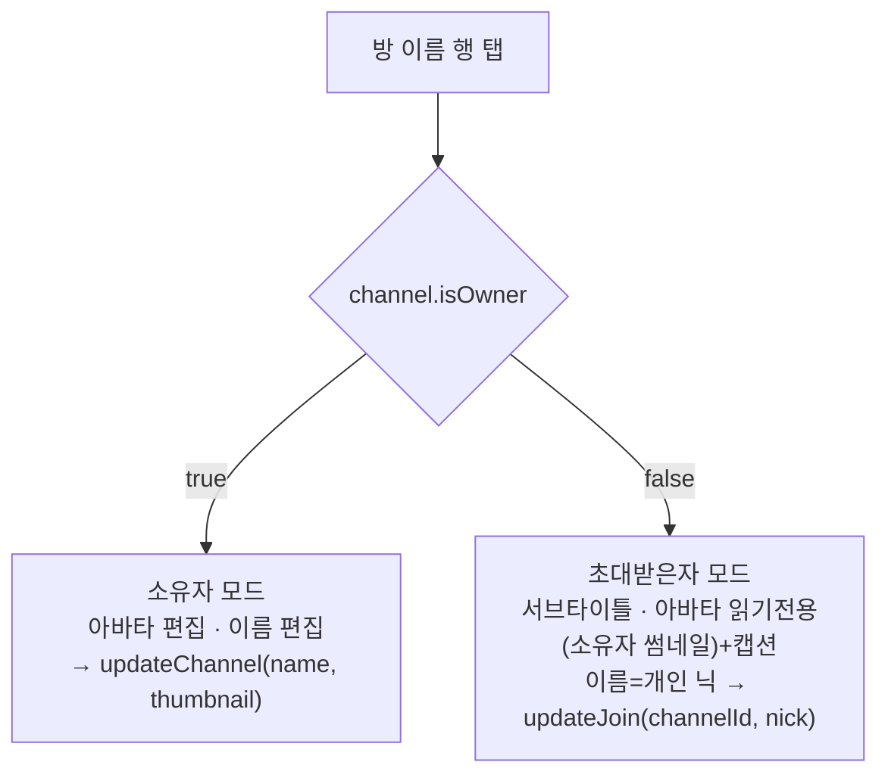
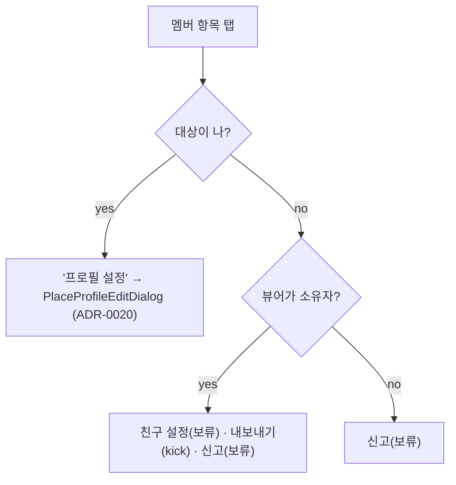
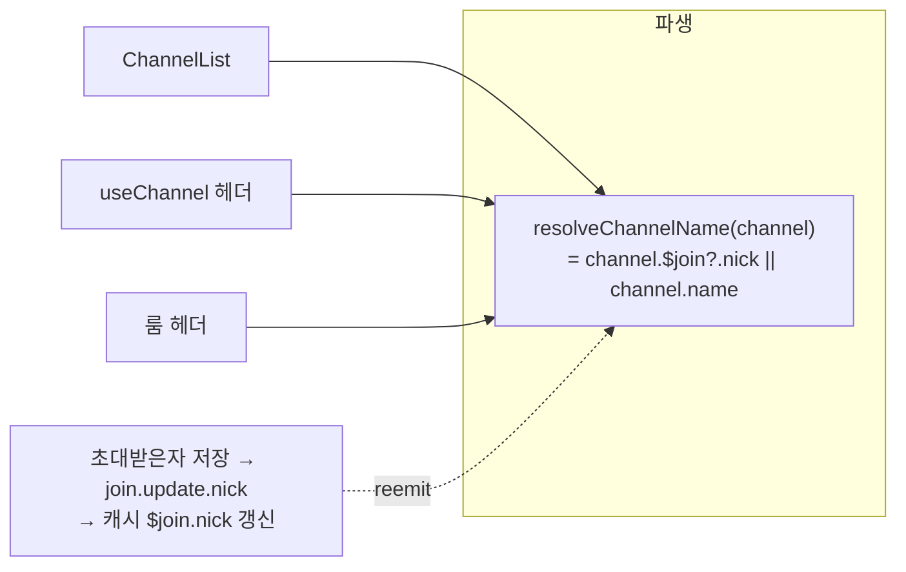

# 채널 상세 다이얼로그 (Channel Detail Dialogs)

> 상태: Live · 최종 갱신: 2026-07-20 · 관련 ADR: [ADR-0022](../../../../../docs/adr/0022-channel-detail-dialogs-figma-redesign.md) (Supersedes 다이얼로그 부분 [ADR-0015](../../../../../docs/adr/0015-channel-settings-ui-refresh.md))

## 목적

채널 설정 화면([channel-settings.md](./channel-settings.md), ADR-0019)에서 열리는 **두 개의 풀스크린 다이얼로그**를
개정 DoU 디자인에 맞춰 `@chatic/web-ui-kit` 기반으로 재구성한다.

1. **방 정보 다이얼로그** (`UpdateChannelDialog`) — 방 이름·프로필 변경. **소유자/초대받은자**로 동작이 갈린다.
2. **멤버 프로필 다이얼로그** (`MemberProfileDialog`) — 멤버 항목 탭으로 진입. **보는 사람(뷰어)의 역할**과
   **대상이 나인지**로 항목이 갈린다.

부수적으로, 초대받은자가 설정한 **개인 방 이름(`join.nick`)이 실제 방 이름 표시에 반영**되도록 클라이언트 파생을
정비한다. (페이지 레이아웃 자체는 [channel-settings.md](./channel-settings.md)가 담당하며 이 문서 범위 밖이다.)

## 설계 원칙

- **프레젠테이션은 web-ui-kit 프리미티브로 조립**한다 — 방 정보/프로필 다이얼로그의 상단바·아바타·입력·리스트·CTA는
  `ModalTopBar`/`ProfileAvatar`/`TextField`/`ListRow`/`FloatingButton`(이미 존재)으로 구성한다. hex·아이콘을 화면에
  직접 박지 않는다. 누락 프리미티브만 라이브러리에 신규 정의한다(불필요한 신규 지양). [ADR-0020](../../../../../docs/adr/0020-place-profile-edit-dialog.md)의 `PlaceProfileFormDialog`가 참조 패턴이다.
- **역할 분기는 기존 파생을 재사용**한다 — 신규 판별 로직을 만들지 않는다:
    - 뷰어가 소유자: `channel.isOwner` (`ownerId === myUid`) — [useChannel.ts:11-15](../../src/app/features/channels/hooks/useChannel.ts)
    - 대상 멤버가 나: `memberId === userId`
    - 대상 멤버가 방장: `memberId === channel.ownerId`
- **초대받은자의 "이름"은 개인 방 이름**이다 — 소유자의 방 이름(`channel.name`)을 바꾸는 게 아니라 **내 `join.nick`**을
  설정하며 "나에게만 표시"된다. 아바타는 **읽기전용**(소유자 썸네일). `join.update`가 `nick`/`notify`만 받고 thumbnail이
  없는 것과 일치한다.
- **개인 방 이름 병합은 파생 계층 한 곳**에 둔다 — 방 이름을 노출하는 소비처(홈 리스트·설정 헤더·룸 헤더)가 각자
  분기하지 않도록 `channel.$join?.nick || channel.name` 파생을 공용 헬퍼로 뽑는다.
- **미연동 액션은 UI만 둔다** — `신고`(백엔드 없음)와 `친구 설정`(Figma에 목적지·의미 미정)은 **행만 노출하고 동작
  보류**(toast/no-op). 눌러도 오해를 주지 않게 토스트로 기대치를 관리한다.
- **프로필 편집기는 재사용**한다 — "내 프로필"의 `프로필 설정`은 새 편집기를 만들지 않고 ADR-0020의
  `PlaceProfileEditDialog`(per-place 프로필, `setMyProfile`)를 그대로 연다.
- **기존 동작 로직은 유지**한다 — kick(`leaveChannel({channelId,userId})`)·소유자 방 정보 저장(`updateChannel`)의
  데이터 흐름은 손대지 않고, 편집 능력과 표현만 바꾼다.

## 범위

**포함**

1. `UpdateChannelDialog` 2모드 재구성 — 소유자(이름+썸네일 편집 → `updateChannel`) / 초대받은자(이름=개인 닉 편집 →
   `join.update.nick`, 아바타 읽기전용+캡션, 서브타이틀). 글자수 카운터 `0/20` + 힌트.
2. `join.update`를 감싸는 신규 앱 훅(`useJoinMutations`).
3. 개인 방 이름 병합 — `resolveChannelName(channel)` 공용 헬퍼 + 소비처 배선(홈 `ChannelList`, `useChannel`, 룸 헤더).
4. `MemberProfileDialog` 재디자인 — `⋯` 드롭다운 제거, 상단 X + 아바타 + 이름 + 인라인 리스트. 뷰어 역할/대상 분기.
5. `친구 설정`·`신고` = UI-only 보류(행 노출 + no-op/toast).
6. `프로필 설정`(대상=나) → `PlaceProfileEditDialog` 재사용 연결.
7. 관련 i18n 키·유닛 테스트 정리.

**제외**

- 채널 알림(notify) 토글 실제 배선 — `join.update.notify`로 가능하나 **별건**(현행 UI-only 유지, [channel-settings.md](./channel-settings.md)).
- `신고` 백엔드, `친구 설정` 실제 동작.
- 페이지 레이아웃(섹션 리스트) 변경 — [channel-settings.md](./channel-settings.md) 소관.
- 데이터 흐름·멤버 소스·kick/leave/delete·sync 등록 모델 변경.

## 시나리오

1. **소유자 — 방 정보 편집** — 방 이름 행 탭 → 다이얼로그. 아바타 카메라 배지로 사진 교체, 이름 입력(카운터).
   `완료` → `updateChannel({ name, thumbnail })` → 토스트 → 닫힘.
2. **초대받은자 — 개인 방 이름 설정** — 방 이름 행 탭 → 다이얼로그. 서브타이틀 "설정한 방 이름은 나에게만
   표시됩니다." 아바타는 소유자 썸네일 읽기전용 + 캡션(`<소유자가 설정한 방 이름>`). 이름 입력(placeholder=소유자
   방 이름) → `완료` → `updateJoin({ channelId, nick })` → 토스트 → 닫힘. 이후 홈/설정/룸 헤더의 방 이름이 **내 닉으로**
   보인다(나에게만).
3. **멤버 프로필 — 뷰어=소유자, 대상=타 멤버** — 멤버 탭 → 프로필 다이얼로그. 아바타 + 이름 + 리스트
   `친구 설정`(toast/no-op) · `내보내기`(확인 → `leaveChannel({channelId,userId})` → 목록 제거) · `신고`(toast).
4. **멤버 프로필 — 뷰어=초대받은자** — 리스트에 `신고`만.
5. **멤버 프로필 — 대상=나** — 리스트에 `프로필 설정` 1개 → 탭 시 `PlaceProfileEditDialog`(per-place 프로필 닉+사진)
   오픈 → `setMyProfile`.
6. **닫기** — 상단 X. 편집 중 미저장 변경이 있으면(방 정보/프로필 편집기) 이탈 가드(`AlertDialog`).

## 다이어그램

### 방 정보 다이얼로그 — 역할 분기

### 멤버 프로필 다이얼로그 — 항목 분기

### 개인 방 이름 병합 (표시)

## 상세 구현

핵심 파일과 역할. 대안 비교·선택 이유는 [ADR-0022](../../../../../docs/adr/0022-channel-detail-dialogs-figma-redesign.md).

- **`UpdateChannelDialog`** ([components/UpdateChannelDialog.tsx](../../src/app/features/channels/components/UpdateChannelDialog.tsx)) —
  `readOnly` prop을 **제거**하고 관측한 `channel.isOwner`에서 모드를 파생한다(페이지는 mode prop을 넘기지 않음).
  소유자=`updateChannel({name, thumbnail})`([useChannelMutations.updateChannel](../../src/app/features/channels/hooks/useChannelMutations.ts)),
  초대받은자=`updateJoin({channelId, nick})`. 초대받은자는 아바타 읽기전용(소유자 썸네일 + 하단 `channel.name` 캡션),
  서브타이틀 노출, 이름 초기값=내 `channel.$join?.nick`(placeholder=`channel.name` → 없으면 i18n). 상단바/아바타/입력/CTA를
  kit 프리미티브(`ModalTopBar`/`ProfileAvatar`/`TextField`/`FloatingButton`)로 재조립하고, `ProfileAvatar`의 select
  어포던스는 소유자만 노출. 글자수 카운터 `0/20`은 `TextField`의 `maxLength`. 검증은 비어있지 않은(trim 1자 이상) 이름 +
  dirty일 때만 완료 활성(이전 min-2 규칙은 Figma 힌트("20글자 이내")에 맞춰 제거).
- **`useJoinMutations`(신규)** ([hooks/useJoinMutations.ts](../../src/app/features/channels/hooks/useJoinMutations.ts), 배럴 export) —
  `useRuntimeRepositories().join.updateJoin`([JoinRepositoryV2.ts:125](../../../../../libs/data/src/data/repositories-v2/JoinRepositoryV2.ts))를
  감싸는 얇은 훅. `useChannelMutations` 패턴(action별 pending 플래그) 동일. optimistic write는 repository가 처리.
  `useChannelMutations`가 `channelRepository`만 쓰므로 repo 혼합을 피해 **별도 훅**으로 둔다. payload 타입은
  `ChannelUpdateJoinInput`(@lemoncloud/chatic-sockets-api); repo 인터페이스의 `JoinUpdateInput`은 동일 alias(`= ChannelUpdateJoinInput`).
- **`resolveChannelName`(신규 공용 헬퍼)** ([app/utils/channel.ts](../../src/app/utils/channel.ts)) —
  `channel.$join?.nick?.trim() || channel.name?.trim() || ''`. 홈·channels 양쪽이 쓰므로 feature가 아닌 **공용 utils**에 둔다.
  `$join`은 채널 뷰에 인라인으로 실려온다([useChannelUnreads.ts:36](../../src/app/features/home/hooks/useChannelUnreads.ts) —
  `ch.$join.chatNo` 선례). 소비처:
    - 홈 채널 리스트 [ChannelList.tsx](../../src/app/features/home/components/ChannelList.tsx) — 이름 결정에 헬퍼 사용(자기채팅/무명 폴백은 유지).
    - 설정 헤더·룸 헤더 — `useChannel`의 `toClientChannel`([useChannel.ts](../../src/app/features/channels/hooks/useChannel.ts))가
      파생 필드 `displayName`을 노출(→ `ClientChannelView.displayName`), `ChannelSettingsPage`/`ChannelRoomPage`가 이를 사용.
- **`useActivePlaceName`(신규 공용 훅)** ([app/hooks/useActivePlaceName.ts](../../src/app/hooks/useActivePlaceName.ts)) —
  `useSessionSelection().selectedSiteId`로 `placeRepository.observeItem`을 구독해 활성 플레이스명을 반환. home 훅을
  끌어오지 않고 `PlaceProfileEditDialog`의 `placeName`을 공급한다. `useMyProfile`과 같은 app-level 공용 위치.
- **`MemberProfileDialog`** ([components/MemberProfileDialog.tsx](../../src/app/features/channels/components/MemberProfileDialog.tsx)) —
  `⋯` `DropdownMenu` 제거. 레이아웃: `ModalTopBar`(X 닫기) + `ProfileAvatar`(+방장 `IconCheck` 뱃지) + 이름 +
  **인라인 `ListRow` 리스트**. Props: 기존 `memberIsOwner`/`canKick`/`onKick`/`isKicking`에 더해 `isSelf`(대상=나),
  `onOpenProfileSettings`(내 프로필 설정 진입). 행 분기: `isSelf`→`프로필 설정`만 / `canKick`(뷰어=소유자,대상≠나≠방장)→
  `친구 설정`+`내보내기`+`신고` / 그 외→`신고`. `친구 설정`(comingSoon)·`신고`(reportSuccess)는 내부 toast(no-op),
  `내보내기`는 `ConfirmDialog`(danger) 재확인 → `onKick`.
- **`ChannelSettingsPage`** ([pages/ChannelSettingsPage.tsx](../../src/app/features/channels/pages/ChannelSettingsPage.tsx)) —
  `DialogType`에 `'profileSettings'` 추가. `MemberProfileDialog`에 `isSelf`(대상=`userId`)/`onOpenProfileSettings`
  (→`openDialog('profileSettings')`) 전달. `PlaceProfileEditDialog`를 `useActivePlaceName()` 결과로 마운트. 방 이름 행
  title은 `channel?.displayName`.
- **`PlaceProfileEditDialog` 재사용** ([home/components/PlaceProfileEditDialog.tsx](../../src/app/features/home/components/PlaceProfileEditDialog.tsx)) —
  `{open, placeName, onClose}` 자립 컴포넌트를 channels에서 **크로스 피처 import**(`../../home/components`)로 재사용(리스크의
  (a)안 채택). eslint 모듈 경계 위반 없음(리포에 강제 boundary 규칙 없음).
- **아이콘/애셋** — 방 정보 카메라(＋) 배지(`ProfileAvatar`의 `IconPlus`), 프로필 X(`ModalTopBar`의 `IconClose`), 방장
  체크(`IconCheck`)가 kit에 모두 존재 → **신규 애셋 반입 없음**.

## 검증 방법

- **유닛 테스트**(통과) — `npx jest --config apps/web/jest.config.js apps/web/src/app/features/channels apps/web/src/app/features/home apps/web/src/app/utils apps/web/src/app/hooks` → **44 suites / 236 tests 통과**.
    - [UpdateChannelDialog.test.tsx](../../src/app/features/channels/components/UpdateChannelDialog.test.tsx) — 소유자 모드
      (아바타 select 노출·`updateChannel(name)` 호출) / 초대받은자 모드(서브타이틀·아바타 select 없음·`channel.name` 캡션·
      `updateJoin(nick)` 호출·placeholder) / 변경 없으면 완료 비활성.
    - [MemberProfileDialog.test.tsx](../../src/app/features/channels/components/MemberProfileDialog.test.tsx) — 3분기
      (대상=나=프로필 설정→콜백 / 뷰어=소유자=친구설정·내보내기·신고 / 뷰어=멤버=신고), 신고/친구설정 토스트, 내보내기 확인→onKick, 방장 뱃지.
    - [useJoinMutations.test.ts](../../src/app/features/channels/hooks/useJoinMutations.test.ts) — `updateJoin` 위임·pending 플래그.
    - [useActivePlaceName.test.ts](../../src/app/hooks/useActivePlaceName.test.ts) — sid 구독→place.name, 미활성 시 빈 문자열, 언마운트 해제.
    - [channel.test.ts](../../src/app/utils/channel.test.ts) — `$join.nick` 우선, 공백·부재 시 `channel.name` 폴백, 둘 다 없으면 빈 문자열.
    - [ChannelSettingsPage.test.tsx](../../src/app/features/channels/pages/ChannelSettingsPage.test.tsx) — 방 이름 title(`displayName`),
      멤버 탭→프로필, canKick 게이팅, `isSelf` + 프로필 설정 다이얼로그 오픈 배선.
- **타입 정합**(수동 확인) — `join.updateJoin`의 인터페이스 타입 `JoinUpdateInput`은 `ChannelUpdateJoinInput`의 alias라
  훅 payload 타입과 호환. 워크트리에는 `node_modules`가 없어 `nx typecheck`/`vite build`가 라이브러리 dist 미빌드로
  실패(환경 한계, 본 변경과 무관) — [[preview-web-from-worktree]]/[[stale-tsbuildinfo-typecheck]] 참고.
- **수동 확인**(백엔드 연결 환경 필요, 이 세션 미수행) — 채널 설정 진입에 로그인+소켓이 필요해 브라우저 육안 확인은
  백엔드 연결 환경에서 수행한다(ADR-0015/0019 문서와 동일 한계). 확인 포인트: 초대받은자 닉 저장 후 홈/설정/룸 헤더에
  내 닉 반영·소유자 방 이름 변경 무영향, 프로필 3분기 렌더, 내 프로필→`PlaceProfileEditDialog` 오픈, kick 후 목록 반영.
  특히 **`$join.nick`이 호출자 본인 값으로 실려오고 저장 후 optimistic write로 갱신되는지**(미도달 시 순간 `channel.name`
  폴백) 확인할 것.
