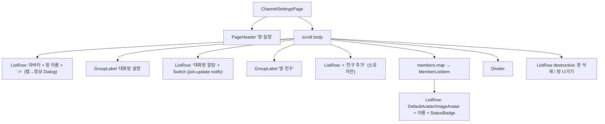
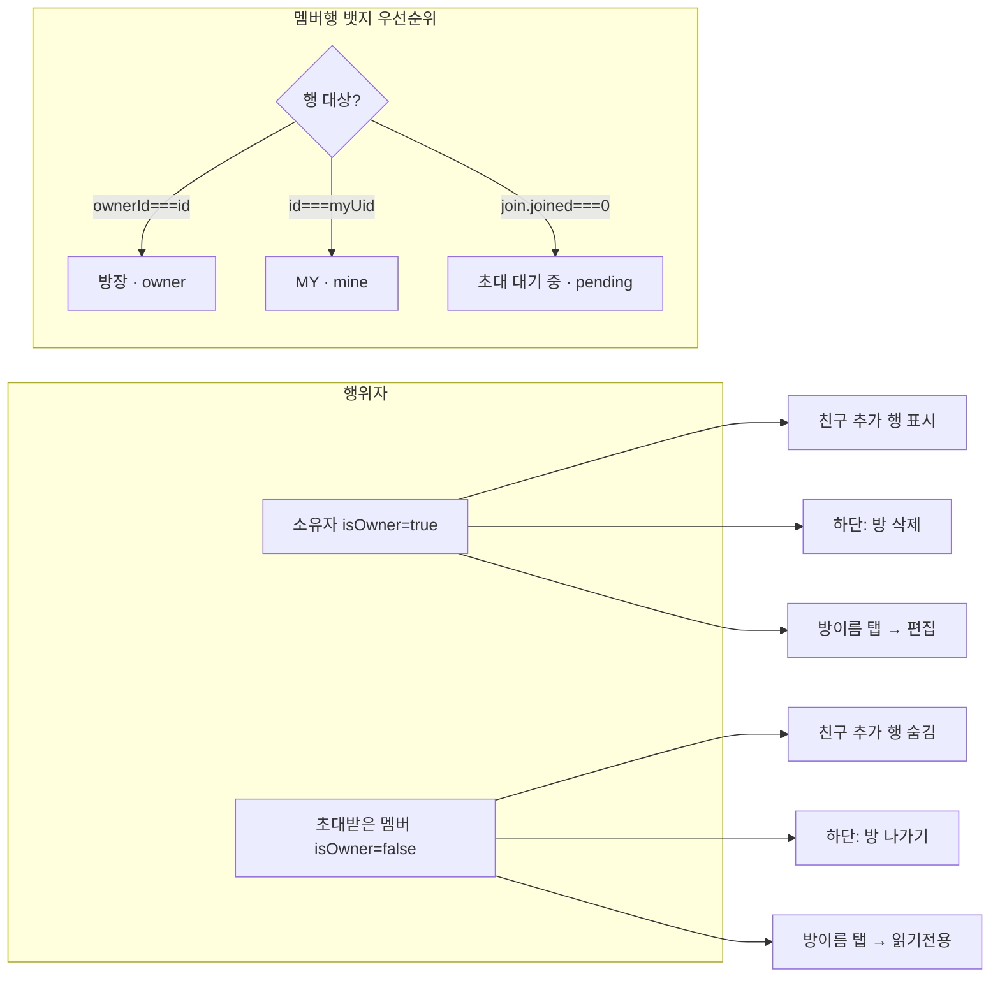
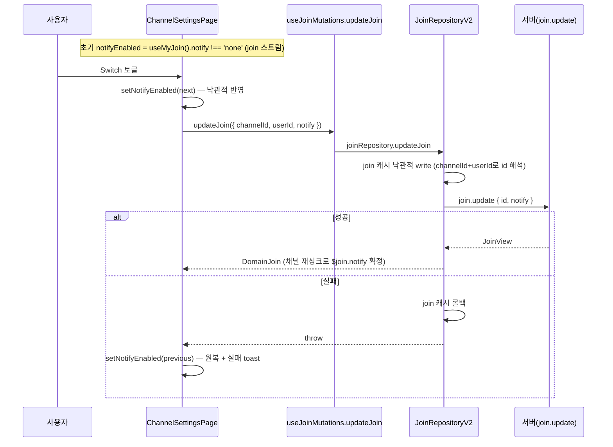

# 그룹 채널 설정 화면 (ChannelSettingsPage)

> 상태: Live · 최종 갱신: 2026-07-20 · 관련 ADR: [ADR-0025](../../../../../docs/adr/0025-channel-notification-mute-toggle.md) (알림 토글 데이터 연동), [ADR-0019](../../../../../docs/adr/0019-group-channel-settings-section-layout.md) (부분 Supersedes [ADR-0015](../../../../../docs/adr/0015-channel-settings-ui-refresh.md))

## 목적

채팅방 **설정 화면**(`ChannelSettingsPage`). 방 정보 확인/편집, 대화방 알림, 방 친구(멤버)
관리, 방 삭제/나가기를 **소유자 / 초대받은 멤버** 유형에 따라 다르게 제공한다. 이 문서는
**그룹 방(`stereo`가 `dm`·`self`가 아닌 방)**을 기술한다 — 한 페이지가 세 유형을 모두 담당하며,
`self`는 [[self-chat]](./self-chat.md), `dm`은 [[dm-chat]](./dm-chat.md)가 각자의 분기를 소유한다.

유형과 무관한 공통 동작 하나: **내 멤버 행에 플레이스 프로필이 없으면 이름 자리에
`프로필 설정 필요`가 오고 탭이 프로필 생성으로 간다.** 멤버 목록은 세 유형 공용 코드이므로 이
동작도 공용이다 — 소유 문서는 [[place-profile-prompt]](../home/place-profile-prompt.md).

## 설계 원칙

- **화면은 `@chatic/web-ui-kit` 프리미티브 조합으로 구성**한다 — 화면 전용 bespoke JSX를
  새로 짜지 않고 `ScreenLayout`/`GroupLabel`/`ListRow`/`Switch`/`StatusBadge`/`Avatar` 계열을
  슬롯에 끼운다 (ADR-0010/0013 계승). 누락 프리미티브만 라이브러리에 신규 정의한다.
- **소유자/멤버 분기는 기존 파생을 그대로 재사용**한다 — 신규 판별 로직을 만들지 않는다:
    - 소유자: `channel.isOwner` (`ownerId === myUid`) — [useChannel.ts:10-15](../../src/app/features/channels/hooks/useChannel.ts)
    - self 채팅: `channel.isSelfChat` (`stereo === 'self'`) — 기존 분기 유지
    - 초대 대기 중: `member.$join?.joined === 0`
- **백엔드 미지원 기능은 UI-only 또는 제외로 명시**한다 — "초대 거절" 상태는 백엔드에 없다.
  동작하지 않는 UI가 오해를 주지 않도록 로컬 상태/미표시로 관리한다.
  (대화방 알림은 `chatic-sockets-api@0.26.703`부터 `join.update` notify를 지원하므로 UI-only에서 데이터 연동으로 전환됨 — ADR-0025.)
- **채팅방별 알림 상태는 서버(`join.notify`)만 신뢰**한다 — apps/web에는 클라이언트 알림을 직접
  렌더하는 notifier가 없고 서버 푸시에 의존하므로, 데스크톱식 로컬 pref store를 두지 않는다.
  즉시 UI 반영은 컴포넌트 낙관적 상태로 처리하고 서버 재싱크 값으로 정정한다.
- 라이브러리 신규/변경 컴포넌트는 stateless·slot·i18n-agnostic 라벨 props·토큰 사용 원칙과
  `*.test.tsx` + `*.stories.tsx` 동반 원칙을 지킨다.

## 범위

**포함**

1. `ChannelSettingsPage` 본문을 섹션 리스트형으로 재구성 (방 이름 행 · "대화방 설정"/알림
   토글 · "방 친구"/친구 추가 + 멤버 목록 · 하단 방 삭제/나가기).
2. 멤버 행 뱃지 재정비 (방장 / MY / 초대 대기 중) — `StatusBadge` 사용.
3. 대화방 알림 = 단순 on/off 인라인 토글. `join.update` notify(`all`/`none`)로 서버에 영속화 (ADR-0025).
4. 방 이름 행 탭 → 소유자=편집 다이얼로그 / 멤버=읽기전용 방 정보.

**제외** (근거: [ADR-0019](../../../../../docs/adr/0019-group-channel-settings-section-layout.md), [ADR-0025](../../../../../docs/adr/0025-channel-notification-mute-toggle.md))

- "초대 거절" 뱃지·상태 (백엔드 미지원 — pending과 구분 불가).
- 알림 `notify = 'mention'` 3단계 — 모바일 토글은 켬/끔 이진(`all`/`none`)만 노출.
- 데스크톱식 로컬 알림 pref store — apps/web엔 클라 notifier가 없어 불필요.
- `libs/data` 변경 — `JoinRepositoryV2.updateJoin`이 이미 notify를 처리(낙관적 write + 롤백).
- 연결 Dialog(정보 수정·프로필 상세)의 재디자인 — 기존 재사용, 멤버 읽기전용만 소규모 추가.
- "신고하기" (Figma hidden).
- 1:1(self) 채팅 레이아웃 — self 유형 전용 문서 [[self-chat]]가 담당(이름 행 탭→이름 수정,
  "방 친구"만 노출). 이 문서는 그룹 설정에 집중한다.

## 시나리오

1. **소유자 진입** — 방 이름 행(+`>`), "대화방 설정"→알림 토글, "방 친구"→**친구 추가 행** +
   멤버 목록(소유자 행에 `방장`, 본인 행에 `MY`, 미수락 멤버에 `초대 대기 중`), 하단 **방 삭제**(빨강).
2. **초대받은 멤버 진입** — 위와 동일하나 **친구 추가 행 없음**, 하단이 **방 나가기**(빨강).
3. **방 이름 행 탭** — 소유자면 `UpdateChannelDialog`(이름/썸네일 편집), 멤버면 같은 다이얼로그를
   **읽기전용**으로 열어 방 정보만 표시.
4. **알림 토글** — 초기값은 내 join 스트림(`useMyJoin`)의 `notify`에서 파생(`'none'`→꺼짐, 그 외→켜짐). 탭 시
   즉시 낙관적 반영 후 `updateJoin({ channelId, userId, notify: 켬?'all':'none' })` 호출. 성공 시
   서버 재싱크로 확정, 실패 시 토글 원복 + 실패 toast. 재진입·기기 간에 상태가 유지된다.
5. **친구 추가**(소유자) — 행 탭 → 기존 `InviteFriendsDialog`.
6. **멤버 행 탭** — 기존 `MemberProfileDialog`(소유자면 강퇴 가능).
7. **방 삭제/나가기** — 하단 행 탭 → `ConfirmDialog` → `deleteChannel`/`leaveChannel` → 루트 이동.

## 다이어그램

### 화면 구성 (컴포넌트 트리)

### 유형/상태 분기

### 알림 토글 흐름 (join.update notify)

## 상세 구현

### 신규/재사용 web-ui-kit 프리미티브 (대부분 이미 존재)

| 용도                              | 컴포넌트                        | 위치                                                                                                                                     |
| --------------------------------- | ------------------------------- | ---------------------------------------------------------------------------------------------------------------------------------------- |
| 섹션 라벨 "대화방 설정"/"방 친구" | `GroupLabel`                    | [GroupLabel.tsx](../../../../../libs/web-ui-kit/src/composites/section/GroupLabel.tsx) — 주석에 두 라벨 예시 명시                        |
| 설정/멤버/토글/삭제 행            | `ListRow`                       | [ListRow.tsx](../../../../../libs/web-ui-kit/src/composites/list/ListRow.tsx) — leading/title/subtitle/trailing/destructive/onClick 슬롯 |
| 알림 토글                         | `Switch`                        | [Switch.tsx](../../../../../libs/web-ui-kit/src/foundations/switch/Switch.tsx) — controlled checked/onCheckedChange                      |
| 뱃지 방장/초대 대기 중/MY         | `StatusBadge`                   | [StatusBadge.tsx](../../../../../libs/web-ui-kit/src/foundations/badge/StatusBadge.tsx) — variant `owner`/`pending`/`mine` 이미 정의     |
| 멤버 아바타(사진 없음)            | `DefaultAvatar`                 | [DefaultAvatar.tsx](../../../../../libs/web-ui-kit/src/foundations/avatar/DefaultAvatar.tsx) — "Figma 1명 Profile"                       |
| 멤버 아바타(사진)                 | `ImageAvatar`                   | avatar/ImageAvatar.tsx                                                                                                                   |
| 방 아바타(그룹 placeholder)       | `ChatAvatar` 또는 `ImageAvatar` | avatar/ChatAvatar.tsx (썸네일 있으면 ImageAvatar)                                                                                        |
| 구분선                            | `Divider`                       | foundations/divider                                                                                                                      |

→ **web-ui-kit 신규 컴포넌트 추가는 0건**이었다. 위 프리미티브가 모두 이미 존재해
(`StatusBadge`의 `owner`/`pending`/`mine` 변형 포함) apps/web에서 조합만으로 완성했다. 방 아바타는
썸네일이 있으면 `ImageAvatar`, 없으면 `ChatAvatar`(placeholder)를 사용한다.

### 변경 파일

1. **[ChannelSettingsPage.tsx](../../src/app/features/channels/pages/ChannelSettingsPage.tsx)** — 핵심.
   현재 상단 아이콘 액션 버튼(`ActionButton` 로컬 컴포넌트) + 가운데 정렬 방정보 구조를
   섹션 리스트형으로 교체:
    - 현재 [L188-221](../../src/app/features/channels/pages/ChannelSettingsPage.tsx) 액션 버튼 블록 제거.
    - 방 이름 행: `ListRow`(leading=방 아바타, title=이름, trailing=chevron, onClick=정보 Dialog).
      소유자→`update` 다이얼로그, 멤버→`update` 다이얼로그(readOnly).
    - "대화방 설정" `GroupLabel` + 알림 `ListRow`(trailing=`Switch`). 알림 상태는 `useMyJoin`(join 스트림)의
      `notify` 기반 낙관적 `useState`이며 토글 시 `useJoinMutations.updateJoin`을 호출(ADR-0025).
      `RoomNotificationDialog`는 이 화면에서 미사용.
    - "방 친구" `GroupLabel` + (소유자만)친구 추가 `ListRow` + 멤버 목록.
    - 하단 `Divider` + `ListRow destructive`(소유자=방 삭제/`delete`, 멤버=방 나가기/`leave`).
    - 기존 다이얼로그 배선(`InviteFriendsDialog`/`UpdateChannelDialog`/`ConfirmDialog`/
      `MemberProfileDialog`)과 mutation 핸들러([L94-147](../../src/app/features/channels/pages/ChannelSettingsPage.tsx))는
      그대로 유지.
    - self 채팅 분기(`!channel?.isSelfChat`)는 현행 유지.

2. **[MemberListItem.tsx](../../src/app/features/channels/components/MemberListItem.tsx)** —
   내부를 `ListRow` + `StatusBadge` 조합으로 재작성. 뱃지 우선순위: `isOwner` → `방장`(owner),
   else `isMe` → `MY`(mine), 그리고 `isPendingInvite` → `초대 대기 중`(pending) 부가 표시.
   현재의 커스텀 초록 체크박스([L61-65](../../src/app/features/channels/components/MemberListItem.tsx))·
   인라인 MY pill은 `StatusBadge`로 대체.

3. **[UpdateChannelDialog.tsx](../../src/app/features/channels/components/UpdateChannelDialog.tsx)** —
   `readOnly?: boolean` prop 추가(멤버 진입 시). true면 이름 입력 `readonly`, 사진 선택·완료 버튼
   숨김, 제목은 `updateChannel.readOnlyTitle`("방 정보")로, "수정해 주세요" 안내는 숨김.
   (소규모 추가; 시각 재디자인은 범위 외.)

4. **i18n** — 기존 키(`roomSettingsGroup`/`roomNotification`/`roomMembers`/`addFriend`/뱃지) 유지.
   이번 개정으로 실패 toast 키 **`chat.settings.notifyFailed`**("알림 설정 변경에 실패했습니다") 신규 추가
   (ko/en 양쪽).

### 데이터/제어 흐름

- 멤버·조인: `useChannelMembers`([hooks](../../src/app/features/channels/hooks/useChannelMembers.ts)) —
  변경 없음. `member.$join?.joined === 0` → pending.
- 프로필(닉/아바타): `useChannelProfiles` — 변경 없음.
- mutation: `useChannelMutations`(leave/delete/invite) — 변경 없음.
- 알림 토글: 초기값은 [`useMyJoin`](../../src/app/features/channels/hooks/useMyJoin.ts)이 join 캐시를
  스트림 관측(`joinRepository.observeList`)해 내 userId 행을 골라 그 `notify`에서 파생한다. 채널 행의
  임베디드 `$join`은 지연되는 projection이라 쓰지 않는다. 토글 시
  [`useJoinMutations.updateJoin`](../../src/app/features/channels/hooks/useJoinMutations.ts) →
  [`JoinRepositoryV2.updateJoin`](../../../../../libs/data/src/data/repositories-v2/JoinRepositoryV2.ts)이
  `channelId + userId`로 join 행을 해석하고 낙관적 캐시 write + `join.update` 소켓 호출 + 실패 롤백까지 담당.
  `updateJoin`의 낙관적 write가 같은 join 캐시에 반영되므로 `useMyJoin` 스트림이 그 값을 다시 흘려보내
  최종 상태가 되고, 화면의 즉시 반영은 컴포넌트 낙관적 `useState`가 담당한다.

## 검증 방법

- **유닛 테스트**(모두 통과, `nx test web --testPathPatterns=channels` → 18 suites / 83 tests):
    - [MemberListItem.test.tsx](../../src/app/features/channels/components/MemberListItem.test.tsx) —
      방장/MY/초대 대기 중 뱃지 렌더 및 우선순위(pending > owner > mine), avatar 분기, onClick 배선.
    - [ChannelSettingsPage.test.tsx](../../src/app/features/channels/pages/ChannelSettingsPage.test.tsx) —
      소유자/멤버/self 분기(친구 추가 행 유무, 하단 삭제/나가기), 방 이름 탭 시 편집/읽기전용 다이얼로그,
      친구 추가→초대 다이얼로그, 멤버 탭→프로필, canKick 조건, kick/삭제 배선. **알림 토글(ADR-0025)**:
      초기값이 `useMyJoin`(join 스트림)의 `notify`에서 파생(`'none'`→off), 토글 시
      `updateJoin({ channelId, userId, notify })` 호출 인자 검증, 실패 시 원복 + toast.
    - [UpdateChannelDialog.test.tsx](../../src/app/features/channels/components/UpdateChannelDialog.test.tsx) —
      편집/읽기전용 모드별 제목·안내 문구·완료 버튼·입력 readonly 분기.
- **타입 검증**: `tsc --noEmit -p apps/web/tsconfig.app.json` 에러 집합이 baseline(0.26.603, 무변경 메인
  트리)과 **완전히 동일** — 알림 연동·`chatic-sockets-api` 0.26.603→0.26.703 버전업 모두 새 타입 에러 0건.
  잔존 6개(`features/home` InviteDialog/PlaceProfile\*)는 버전 무관 기존 에러(범위 외).
  (`nx typecheck web`는 워크트리 프로젝트 참조/`web-ui-kit` rootDir·svg 모듈 이슈로 거짓 실패하므로
  app 설정 직접 검사를 신뢰한다 — [[stale-tsbuildinfo-typecheck]].)
- **빌드 검증**: `nx build web`(vite) 성공(✓ 11.27s) — 0.26.703 해석 및 번들 정상.
- **참고(미실행)**: 브라우저 육안 확인은 워크트리 프리뷰 제약([[preview-web-from-worktree]])으로 이 세션에서
  미수행. 확인 포인트: 알림 토글 초기 상태(서버 notify 반영)·끄기 시 유지·실패 toast.
- **명령**: `nx test web --testPathPatterns=channels`.
