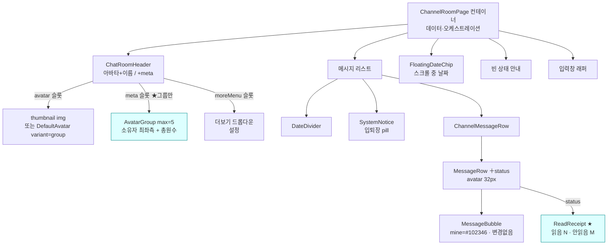
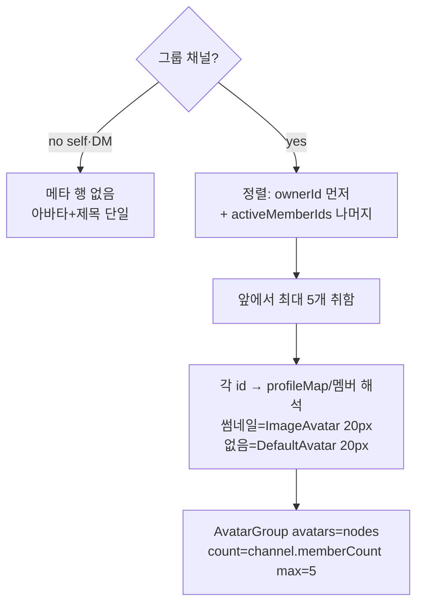
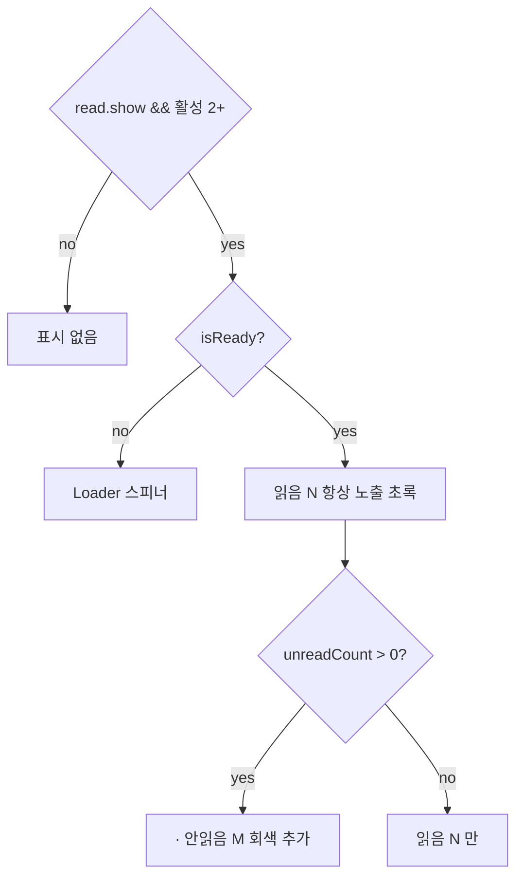

# 채팅방 UI (Chat Room UI)

> 상태: Live · 최종 갱신: 2026-07-20 · 관련 ADR: [[ADR-0010]](../../../../../docs/adr/0010-chat-screen-webuikit-rebuild.md), [[ADR-0021]](../../../../../docs/adr/0021-channel-room-figma-refinement.md), [[ADR-0024]](../../../../../docs/adr/0024-group-chat-room-figma-redesign.md)

## 목적

채팅방 화면(`ChannelRoomPage`)을 DoU 디자인에 맞춰 `@chatic/web-ui-kit` 컴포넌트
기반으로 구성한다. 프레젠테이션은 라이브러리에 위임하고 컨테이너는 데이터·오케스트레이션만
소유한다. 이 문서는 화면 구조가 실제로 어떻게 동작하는지를 기술한다.

## 설계 원칙

- **프레젠테이션은 web-ui-kit에 위임한다.** `ChannelRoomPage`는 데이터 조회·파생과
  오케스트레이션(전송/읽음/스크롤/액션)만 소유하고, 시각 요소는 라이브러리
  컴포넌트(slot 기반, stateless)로 조립한다.
- **누락 컴포넌트는 web-ui-kit에 신규 정의 후 사용한다.** 라이브러리 컨벤션
  (`libs/web-ui-kit/README.md`)을 따른다 — stateless·slot, i18n-agnostic 라벨
  props(호스트가 번역 주입), 토큰만 사용, 각 컴포넌트 `*.test.tsx` + `*.stories.tsx`
  동반, `*Props` export.
- **그룹 헤더는 [아바타 + 제목] 위에 [참여자 스택 + 총원 수] 2줄 구조다.** (ADR-0024가
  ADR-0021의 "멤버 스택 제거" 결정을 되돌린다.) 제목 아래 행에 참여자 아바타를 겹쳐
  노출하고(소유자 최좌측, 최대 5) 그 뒤에 채널 총원 수를 둔다. **self·1:1 DM 헤더는
  이 메타 행 없이 [아바타 + 제목] 단일 행**을 유지한다. 썸네일이 없을 때 fallback 글리프는
  self는 전용 self 아바타(solid 실루엣+링, [[self-chat]]), 그 외(1:1 포함)는 3인 그룹 글리프.
- **화면에 노출되는 아이콘은 Figma SVG로 자산화한다.** lucide 플레이스홀더로 충분한
  것은 그대로 두되, Figma 전용 글리프(그룹 아바타 등)는 SVG를 추출해 `resources/icons`에
  커스텀 아이콘으로 정의한다(ADR-0021).
- **읽음/안읽음 수치는 기존 데이터 계층을 재사용한다.** 두 수치는
  `useJoinPositions.getReadCount`가 이미 계산해 `{ readCount, unreadCount }`로 반환한다
  ([useJoinPositions.ts:76](../../../src/app/features/channels/hooks/useJoinPositions.ts))
  — 신규 컴포넌트는 표현만 담당한다.
- **읽음표시 모드 = 활성 인원 기준**으로 파생한다(2명 이상일 때만 노출; self·1명 미표시).

## 범위

**포함**

- 헤더(그룹): [아바타 + 이름] 행 + 그 아래 [참여자 스택 + 총원 수] 행. 아바타는
  `channel.thumbnail`(있으면 이미지), 없으면 기본 그룹 글리프. 참여자 스택은
  `AvatarGroup`(max 5) — **소유자(`channel.ownerId`)가 가장 왼쪽**, 이후 활성 참여자
  순서. 총원 수 = **`channel.memberCount`**(본인 포함, 빈방=1). 더보기(⋯) 드롭다운(설정) 유지.
- 헤더(self·1:1 DM): [아바타 + 이름] 단일 행(메타 미노출) — 기존 유지.
- 빈 상태(메시지 없음): 상단 `DateDivider` + 좌측정렬 안내 문구(제목/부제) + "친구
  초대하기" 아웃라인 pill 버튼(chevron right). 노출 게이팅은 **기존 유지**(방장 + 비게스트 +
  클라우드 활성). self chat 빈 상태(PenLine 안내)는 기존 유지.
- 스크롤 중 **플로팅 날짜 pill**(ADR-0021): 상단에 걸친 날짜 그룹의 날짜를 반투명 pill로
  표시, 스크롤이 멎으면 사라짐 — 기존 유지.
- 메시지 리스트: 날짜 구분(`DateDivider`), 입퇴장 시스템 알림(`SystemNotice`), 말풍선
  (`MessageBubble` + `MessageRow`), **읽음표시(`ReadReceipt`) — `읽음 N · 안읽음 M`
  2요소**(읽음=초록 `--main-accent`, 안읽음=회색 `text-description`, 불릿 구분).
- 메시지 아바타 크기 **39px → 32px**(Figma `1명 Profile` 32×32). 플레이스홀더도 web-ui-kit
  컴포넌트(`ImageAvatar`/`DefaultAvatar`)로 통일.
- 전체보기: 200자 초과 절단 + 인페이지 오버레이(기존 유지).
- web-ui-kit 확장: `ChatRoomHeader`에 `meta` 슬롯(2줄) 추가, `ReadReceipt`를 읽음+안읽음
  2요소로 확장, `AvatarGroup` `max=5` 사용(컴포넌트는 이미 존재).

**제외**

- 말풍선 색·라운드·패딩·꼬리 형태 — **이미 Figma와 일치**하므로 변경하지 않는다
  (mine=`#102346`, `px-[14px] py-2`, 라운드 18px, 꼬리 1코너).
- self·1:1 DM 헤더의 메타 행(미노출). 헤더 아바타/제목 탭 동작(현행 유지: ⋯ → 방 설정).
- 데이터/동기화/읽음 **계산** 로직(`getReadCount` 수치 그대로 재사용, 표현만 확장).
  빈 상태 게이팅 로직. `useChatScroll` 스크롤 구조. 채널 설정·초대 화면.

## 시나리오

1. **그룹방 진입(헤더 2줄)** — 헤더 왼쪽에 채널 아바타(썸네일/그룹 글리프) + 이름. 이름
   아래 행에 참여자 아바타가 겹쳐 노출된다 — **소유자가 가장 왼쪽**, 이어서 활성 참여자를
   최대 5명까지, 그 오른쪽에 **총원 수**(예: `50`). 오른쪽 더보기(⋯) → `설정`.
2. **소규모/빈 그룹방** — 참여자가 1명(본인만)이면 스택은 본인 1개 + 총원 `1`. 5명 초과면
   앞 5명만 겹쳐 보이고 총원은 전체 수.
3. **빈 그룹방(방장) 진입** — 메시지가 없고 본인이 방장(비게스트·클라우드 활성)이면 상단에
   오늘 `DateDivider`, 그 아래 좌측정렬로 "그룹방을 만들었습니다." + "친구를 초대하고
   대화를 시작해 보세요." + "친구 초대하기"(아웃라인 pill, chevron) → 초대 다이얼로그.
   방장이 아니거나 게스트/클라우드 비활성이면 안내 미표시(기존 게이팅).
4. **나와의 채팅 진입** — 헤더는 [self 전용 아바타(solid 실루엣+링) + 제목(`$join.nick ||
site 프로필 nick`, [[self-chat]])] 단일 행(메타 없음). 메시지는 전부 `mine` 말풍선,
   읽음표시 없음. 비어 있으면 PenLine 안내.
5. **읽음표시(읽음+안읽음)** — 활성 2명 이상인 그룹에서 각 메시지의 시간 옆에
   `읽음 N`(초록) · `안읽음 M`(회색)을 표시한다. 상대 메시지=`시간 · 읽음·안읽음`,
   내 메시지=`읽음·안읽음 · 시간`(시간이 바깥쪽). 모두 읽으면(안읽음 0) `안읽음` 세그먼트를
   감추고 `읽음 N`만 남긴다. self·1명은 미표시.
6. **스크롤로 과거 메시지 탐색** — 스크롤 중 상단에 걸친 날짜 그룹의 날짜가 플로팅
   pill("7. 01 월" 형태)로 뜨고, 스크롤이 멎으면 잠시 뒤 사라진다.
7. **메시지 전송** — 낙관적 렌더(`전송 중`) → 성공 시 시간+읽음표시, 실패 시 `전송 실패` +
   재시도/삭제(기존 로직 유지). **연타를 포함해 전송 후에도 키보드는 내려가지 않는다.**
   textarea 외의 컴포저 요소를 탭해도 캐럿이 유지되도록 두 가지가 함께 필요하다:
   ① 입력이 비어 전송 버튼이 idle이 되어도 실제 `disabled`가 아니라 `aria-disabled`다 —
   disabled 폼 컨트롤은 pointer/mouse 이벤트를 아예 받지 못하고 버블링도 없어서 ②가
   실행될 기회조차 없어진다. ② `pointerdown` + `mousedown` 모두 `preventDefault` — iOS
   WKWebView는 포커스 이동을 `mousedown` 기본 동작으로 처리하므로 `pointerdown`만 막으면
   새어나간다. `touchstart`는 막지 않는다(전송 `click`까지 함께 죽는다). 여기에 컴포저의
   `touch-manipulation`으로 연타가 이중탭 제스처로 해석되는 경로를 없앤다.
8. **긴 메시지 전체보기** — 200자 초과 시 말풍선에 `전체보기` → 인페이지 오버레이.
9. **메시지 롱프레스** — 복사 메뉴 드롭다운(기존 유지).
10. **입퇴장 시스템 알림** — 중앙 pill(`SystemNotice`): 굵은 이름 + 문구. subType(join/
    leave)로 i18n 렌더(기존 유지).

## 다이어그램

### 화면 구성 (컨테이너 → web-ui-kit)

### 헤더 아바타 스택 구성 (소유자 최좌측 · 최대 5 · 총원)

### 읽음표시 렌더 결정

## 상세 구현

### web-ui-kit — 기존 컴포넌트 변경

- **`ChatRoomHeader` — `meta` 슬롯(2줄) 추가**
  ([ChatRoomHeader.tsx](../../../../../libs/web-ui-kit/src/composites/header/ChatRoomHeader.tsx)) —
  optional `meta?: React.ReactNode` prop 추가. 아바타 오른쪽 영역을 제목+메타 컬럼으로
  바꿔, `meta`가 있으면 제목 아래에 메타 행을 렌더한다. `meta` 미전달 시 기존 단일 행과
  동일(self·1:1 DM 무영향). 제목은 계속 `truncate`. 유일 소비처는 `ChannelRoomPage`.
- **`ReadReceipt` — 읽음+안읽음 2요소로 확장**
  ([ReadReceipt.tsx](../../../../../libs/web-ui-kit/src/composites/chat/ReadReceipt.tsx)) —
  props를 `{ readCount, unreadCount, readLabel, unreadLabel, className }`로 확장. 렌더:
  `읽음 {readCount}`(`text-main-accent`, 12px SemiBold) 항상, `unreadCount > 0`이면
  불릿(`•`, `text-description`) + `안읽음 {unreadCount}`(`text-description`). a11y는
  `aria-label`에 `{readLabel} {readCount} {unreadLabel} {unreadCount}` 구성. (Figma
  3209:27289 — `읽음 1 · 안읽음 99`.)
- **`AvatarGroup` — `max={5}`로 사용**
  ([AvatarGroup.tsx](../../../../../libs/web-ui-kit/src/foundations/avatar/AvatarGroup.tsx)) —
  컴포넌트 변경 없음(이미 `max` prop 지원, 6px 겹침=Figma 일치). 호출부에서 `max={5}`,
  `count={channel.memberCount}` 전달.

### apps/web — 컨테이너/행

- **`ChannelRoomPage`** ([ChannelRoomPage.tsx](../../../src/app/features/channels/pages/ChannelRoomPage.tsx)) —
    - `useChannelMembers`에서 `members`를 추가로 구독(현재 `activeMemberIds`만 구독).
    - 헤더 메타 조립: 그룹일 때만(`isGroupChat = !isSelfChat && channel.stereo !== 'dm'`)
      `meta`에 `<AvatarGroup .../>` 전달 — self·1:1 DM은 미전달. 참여자 id
      순서는 순수 헬퍼 `orderMemberIdsOwnerFirst(ownerId, activeMemberIds, 5)`로 만들고
      (소유자 최좌측 + 나머지, 최대 5), 각 id를 `profileMap`(닉/썸네일) → `members`
      유저캐시 순으로 해석해 썸네일이면 `ImageAvatar size={20}`, 없으면
      `DefaultAvatar size={20}` 노드로 만든다. 겹침 구분용으로 각 노드에
      `ring-2 ring-surface` 적용. `count={channel.memberCount ?? 1}`.
    - 읽음 데이터: 메시지별 `getReadCount(chatNo)`에서 `readCount`도 함께 꺼내 행에 전달
      (현재 `unreadCount`만 전달).
    - 나머지(빈 상태/플로팅 날짜/전송/스크롤/전체보기/입력창)는 기존 유지.
- **`ChannelMessageRow`** ([ChannelMessageRow.tsx](../../../src/app/features/channels/components/ChannelMessageRow.tsx)) —
    - `MessageReadInfo`에 `readCount: number` 추가. `ReadReceipt`에 `readCount`/`unreadCount`
        - `readLabel`(`t('chat.room.read')`)/`unreadLabel`(`t('chat.room.unread')`) 전달.
    - 상대 아바타/스페이서 크기 39px → **32px**. 이미지=`ImageAvatar size={32}`,
      플레이스홀더=`DefaultAvatar size={32}`로 교체(lucide `User` 직접 사용 제거).
- **순수 헬퍼** `orderMemberIdsOwnerFirst` (utils, 예:
  `apps/web/src/app/features/channels/utils/orderMemberIds.ts`) — `(ownerId, memberIds, max)`
  → 소유자를 맨 앞에 두고 나머지를 원 순서대로 이어, 중복 제거 후 `max`개로 자른 id 배열.
  UI 비의존이라 단위 테스트로 정렬/캡/중복 규칙을 단언한다.

### i18n

- 읽음 라벨 키 추가: `chat.room.read`(="읽음"). `chat.room.unread`(="안읽음")는 기존 존재
  확인 후 재사용. ko/en 번역 파일 양쪽 추가.

### 디자인 토큰

- 신규 토큰 없음. 읽음=`text-main-accent`(#90C304), 안읽음=`text-description`, 스택 링=
  `ring-surface` 재사용. 말풍선 토큰(`--bubble-mine` 등)은 이미 Figma와 일치 → 불변.

## 검증 방법

- **단위 테스트(통과)**: web-ui-kit `53 suites / 193 tests`, apps/web channels
  `18 suites / 82 tests` 모두 통과.
    - `ReadReceipt.test.tsx` — 읽음+안읽음 동시 노출, 읽음=`text-main-accent`, 안읽음 0 감춤,
      a11y(`읽음 N 안읽음 M` / `읽음 N`) 단언.
    - `ChatRoomHeader.test.tsx` — meta 유(그룹)/무(direct) 렌더.
    - `AvatarGroup.test.tsx` — `max=5` 캡 + 총원 노출.
    - `orderMemberIds.test.ts` — 소유자 선두·순서 유지·중복 제거·max 캡·소유자 부재/누락 id.
    - `ChannelMessageRow.test.tsx` — ReadReceipt에 readCount/unreadCount 전달, 아바타 32px
      (ImageAvatar/DefaultAvatar), `read.show=false` 시 미표시.
    - 실행: `npx jest --config libs/web-ui-kit/jest.config.js` /
      `--config apps/web/jest.config.js apps/web/src/app/features/channels`.
- **타입체크**: `nx typecheck web-ui-kit` 통과. `web`은 워크트리 프로젝트 참조
  (rootDir/`import.meta`) 설정상 기존 에러가 있으나 변경 무관하며, 변경 파일
  (`ChannelRoomPage`/`ChannelMessageRow`/`orderMemberIds`)에 신규 타입 에러 없음 확인.
- **Storybook 시각 검증(통과)**: `ChatRoomHeader > GroupWithMemberStack` — 제목 아래 5개
  아바타 스택 + 총원 `50` 2줄 렌더 확인. `ReadReceipt > PartiallyRead` — `읽음 1`(초록) ·
  `안읽음 99`(회색) 렌더 확인.
- **앱 런타임 검증(후속)**: 실제 채팅방은 로그인+소켓+백엔드 필요 → 연결 환경에서 헤더
  아바타 스택/총원, 읽음+안읽음 표시를 브라우저로 확인.
