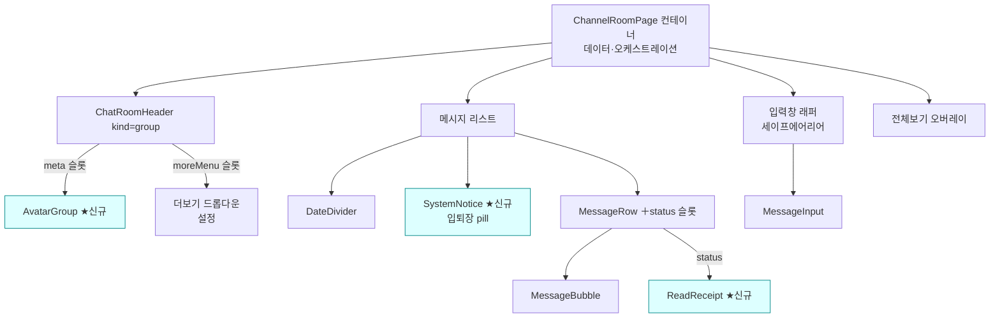
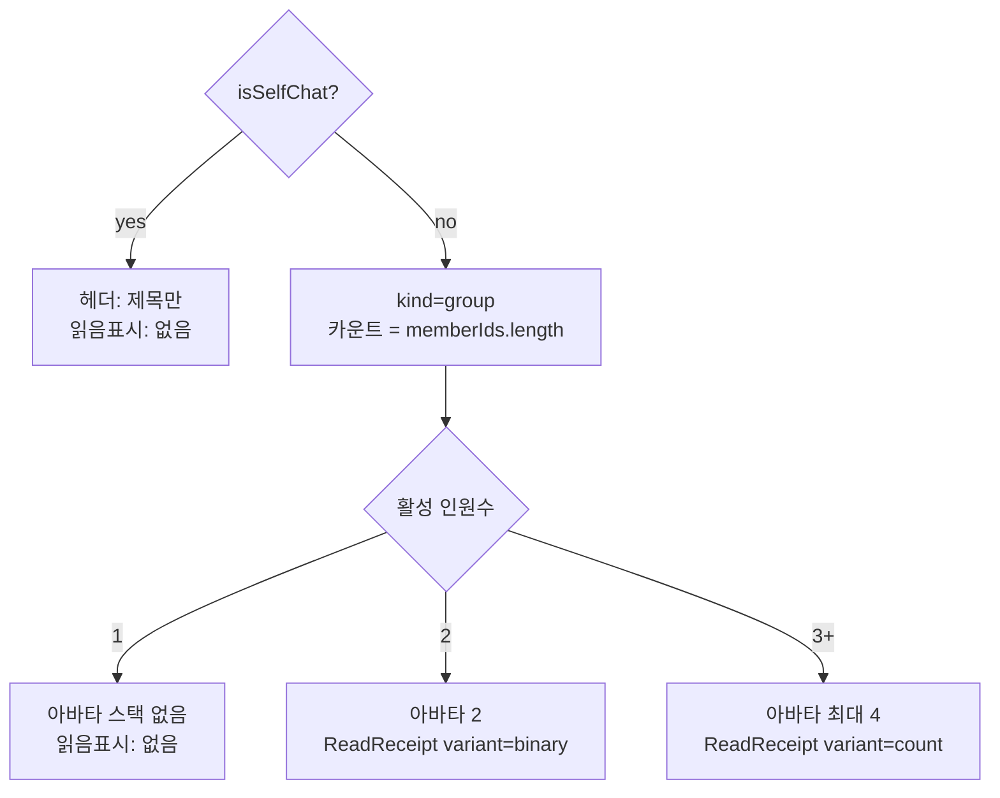

# 채팅방 UI (Chat Room UI)

> 상태: Live · 최종 갱신: 2026-07-15 · 관련 ADR: [[ADR-0010]](../../../../../docs/adr/0010-chat-screen-webuikit-rebuild.md)

## 목적

채팅방 화면(`ChannelRoomPage`)을 DoU 디자인 개편에 맞춰 `@chatic/web-ui-kit`
컴포넌트 기반으로 재구성한다. 지금은 헤더·메시지리스트·말풍선·입력창이 한 파일에
인라인으로 들어간 모놀리식이고, 헤더는 self 여부만 가르는 이분법이라 개편 디자인의
**대분류(self/group) × 인원수별 헤더·읽음표시 차등**을 표현하지 못한다. 이 문서는
재구성 후의 화면 구조가 실제로 어떻게 동작하는지를 기술한다.

## 설계 원칙

- **프레젠테이션은 web-ui-kit에 위임한다.** `ChannelRoomPage`는 데이터 조회·파생과
  오케스트레이션(전송/읽음/스크롤/액션)만 소유하고, 시각 요소는 라이브러리
  컴포넌트(slot 기반, stateless)로 조립한다.
- **누락 컴포넌트는 web-ui-kit에 신규 정의 후 사용한다.** 라이브러리 컨벤션
  (`libs/web-ui-kit/README.md`)을 따른다 — stateless·slot, i18n-agnostic 라벨
  props(호스트가 번역 주입), `resources/styles/tokens.css` 토큰만 사용, 각 컴포넌트
  `*.test.tsx` + `*.stories.tsx` 동반, `*Props` export.
- **대분류는 `self` | `group` 둘만 다룬다.** `direct`(1:1 DM)는 구현 미정이라 범위
  제외(ADR-0010). `self`가 아닌 모든 채널은 `group`으로 렌더한다.
- **읽음 카운트는 기존 데이터 계층을 재사용한다.** 읽음/안읽음 수치는
  `useJoinPositions.getReadCount`가 이미 계산한다([useJoinPositions.ts:76](../../../src/app/features/channels/hooks/useJoinPositions.ts))
  — 신규 컴포넌트는 표현만 담당한다.
- **헤더 카운트 = 나 포함 전체 인원**, **읽음표시 모드 = 활성 인원 기준**으로 각각
  파생한다(아래 상세 구현).

## 범위

**포함**

- 헤더: `self`(제목만) / `group`(제목 + 아바타 스택 + 전체 카운트). 인원수 하위
  케이스(1명/2명/n명) 반영.
- 헤더 더보기(⋯) 드롭다운: `self`·`group` 공통으로 노출, 항목은 `설정` 하나
  (Figma 1922-38384). self도 more 버튼 노출(기존엔 숨김).
- 메시지 리스트: 날짜 구분(`DateDivider`), 입퇴장 시스템 알림(신규 `SystemNotice`
  중앙 pill), 말풍선(`MessageBubble` + `MessageRow`), 읽음표시(신규 `ReadReceipt`).
- 입력창: `MessageInput`(입력 전/포커싱/입력 중/Max Height/스크롤) + iOS 키보드
  세이프에어리어 래퍼.
- 전체보기: 현재 인페이지 오버레이 유지, Figma 스타일 반영.
- web-ui-kit 신규: `AvatarGroup`, `ReadReceipt`, `SystemNotice`. 확장:
  `ChatRoomHeader`(meta + moreMenu 슬롯), `MessageRow`(status 슬롯),
  `MessageInput`(onKeyDown + inputRef). 컨테이너 헬퍼: `ChannelMessageRow`.
- 디자인 토큰 3종(`brand-ink`/`control-idle`/`avatar-ring`)을 apps/web에 이식.

**제외**

- `direct` 헤더(1:1 DM). 전체보기 별도 라우트. 데이터/동기화/읽음 계산 로직 변경.
  채널 설정·초대 화면. 메시지 전송/재시도/복사 등 기존 동작 로직(스타일만 재배치).
- **방 숨기기(hide)** — 데이터 계층에 없는 신규 동작이라 이번 범위 제외. 더보기
  드롭다운에 항목도 넣지 않는다(설정만).

## 시나리오

1. **나와의 채팅 진입** — `channel.isSelfChat`(`stereo === 'self'`)이면 헤더는
   제목("나와의 채팅")만, 아바타/카운트 없음. 더보기(⋯) 버튼은 노출되고 클릭 시
   `설정` 드롭다운. 메시지는 전부 `mine` 말풍선, 읽음표시 없음. 비어 있으면 "나와의
   채팅을 시작해 보세요." 안내.
2. **그룹 1명(나 혼자) 진입** — 활성 인원 1명. 헤더 제목 + 카운트 "1"(아바타 스택
   없음). 읽을 상대가 없어 읽음표시 없음.
3. **그룹 2명 진입** — 헤더 제목 + 아바타 2 + "2". 내가 보낸 메시지에 상대가
   읽었으면 `읽음`, 아니면 `안읽음`(텍스트 이진).
4. **그룹 n명(3+) 진입** — 헤더 제목 + 아바타 최대 4 + "N". 내 메시지에 `읽음 {읽은
수} · 안읽음 {안 읽은 수}`(안읽음 0이면 `읽음 {수}`만).
5. **메시지 전송** — 낙관적 렌더(`전송 중`) → 성공 시 시간+읽음표시로 전환, 실패 시
   `전송 실패` + 재시도/삭제. (기존 로직 유지, 표시만 web-ui-kit로.)
6. **긴 메시지 전체보기** — 200자 초과 시 말풍선에 `전체보기` → 인페이지 오버레이로
   전문 표시(라우트 이동 아님).
7. **메시지 롱프레스** — 말풍선 롱프레스 시 복사 메뉴(드롭다운). (기존 유지.)
8. **입퇴장 시스템 알림** — 멤버 입장/퇴장 시 중앙 pill(`SystemNotice`): 굵은 이름 +
   문구("…님이 채팅방에 입장했습니다"/"…나갔습니다"). subType(join/leave)로 i18n 렌더,
   읽음표시 없음.
    - **알려진 한계**: 데이터 모델은 **1건당 1인**(join 레코드 1개 = 시스템 메시지 1개,
      [system-message.md](./system-message.md)). Figma(2935-22140)의 "레몬1, 레몬2… 님이
      입장했습니다" 같은 다중 이름 pill은 단일 이름으로만 렌더한다 — 다중 이름 batching은
      서버/데이터 계층 후속이며 임의 클라이언트 그룹핑은 하지 않는다.

## 다이어그램

### 화면 구성 (컨테이너 → web-ui-kit)

### 헤더 · 읽음표시 모드 결정

## 상세 구현

### web-ui-kit — 신규 컴포넌트

- **`AvatarGroup`** (`libs/web-ui-kit/src/foundations/avatar/AvatarGroup.tsx`) —
  아바타 노드를 겹쳐 최대 `max`(기본 4)개 노출하고 전체 카운트 숫자를 옆에 표시.
  props: `avatars: ReactNode[]`, `count?: number`(기본 `avatars.length`),
  `max?: number`, `size?: number`, `className`. 겹침은 음수 마진 + surface색 링으로
  분리. `avatars`가 비고 `count`만 있으면 숫자만 렌더(그룹 1명 대응).
- **`SystemNotice`** (`libs/web-ui-kit/src/composites/chat/SystemNotice.tsx`) —
  입퇴장 등 인스트림 시스템 알림. 중앙 정렬 pill(연한 배경) 안에 `children` 렌더
  (호스트가 `<b>이름</b> + 문구` 조합 주입). props: `children: ReactNode`,
  `className`. Figma 2935-22140. (기존 좌측정렬 `SystemMessage`는 입장 배너용으로
  용도 상이 — 여기선 미사용.)
- **`ReadReceipt`** (`libs/web-ui-kit/src/composites/chat/ReadReceipt.tsx`) —
  읽음 상태 표시. props: `readCount`, `unreadCount`, `variant: 'binary' | 'count'`,
  `readLabel`, `unreadLabel`(호스트 주입), `className`.
    - `binary`: `unreadCount<=0` → `readLabel`(읽음), 아니면 `unreadLabel`(안읽음).
    - `count`: `{readLabel} {readCount}` + (`unreadCount>0` → ` · {unreadLabel} {unreadCount}`).
    - 색: 읽음/안읽음 라벨 모두 `text-foreground`(medium), 구분점 `•`은 연회색
      (`input-border`). 색 구분 없음(Figma 2935-22913 확인). 12px/leading-5/tracking-[-0.18px].

### web-ui-kit — 컴포넌트 확장

- **`ChatRoomHeader`** ([ChatRoomHeader.tsx](../../../../../libs/web-ui-kit/src/composites/header/ChatRoomHeader.tsx)) —
  제목 아래 중앙 정렬 2번째 행을 위한 `meta?: ReactNode` 슬롯 추가. 있으면 헤더가
  세로 배치(행1: back/title/more, 행2: meta 중앙). `self`는 meta 미전달.
  더보기 드롭다운을 위한 `moreMenu?: ReactNode` 슬롯 추가 —
  `AppHeader`의 `switcherMenu` 패턴 그대로([AppHeader.tsx:134](../../../../../libs/web-ui-kit/src/composites/header/AppHeader.tsx)):
  있으면 more 버튼을 `DropdownMenu` 트리거로 감싸고 content로 렌더(Radix가 open
  상태 소유, 컴포넌트는 stateless 유지). `onMore`는 단순 콜백용으로 공존.
- **`MessageRow`** ([MessageRow.tsx](../../../../../libs/web-ui-kit/src/composites/chat/MessageRow.tsx)) —
  meta 라인에 `status?: ReactNode` 슬롯 추가(시간과 함께 표시). `mine` 행은 meta를
  `flex-row-reverse`로 미러링해 시간이 바깥, 상태가 안쪽(버블 쪽)에 온다. 컨테이너가
  `ReadReceipt` / `전송 중` / `전송 실패` 클러스터를 상황별로 주입. 기존 `unread`
  (UnreadBadge)와 공존.
- **`MessageInput`** ([MessageInput.tsx](../../../../../libs/web-ui-kit/src/foundations/input/MessageInput.tsx)) —
  `onKeyDown?`(textarea 키 핸들러 패스스루)과 `inputRef?`(내부 오토사이즈 ref와
  병합) 추가. 호스트가 데스크톱 Enter 전송과 스크롤 포커스 재앵커를 붙일 수 있게 한다.

### apps/web — 컨테이너 재구성

- **`ChannelMessageRow`** ([ChannelMessageRow.tsx](../../../src/app/features/channels/components/ChannelMessageRow.tsx)) —
  메시지 한 줄을 web-ui-kit `MessageRow` + `MessageBubble`로 조립하고, 디자인 시스템이
  다루지 않는 컨테이너 관심사(롱프레스→복사 메뉴, 전송중/실패 상태 + 재시도/삭제,
  읽음표시, 200자 초과 절단→전체보기)를 소유한다. 롱프레스 타이머는 프레젠테이션
  버블 대신 이 컴포넌트가 가진다.
- **`ChannelRoomPage`** ([ChannelRoomPage.tsx](../../../src/app/features/channels/pages/ChannelRoomPage.tsx)) —
  인라인 `<header>`/리스트/`<textarea>`를 web-ui-kit 조립으로 교체. 데이터 훅
  (`useChannel`/`useChannelMembers`/`useJoinPositions`/`useChats` 등)과 핸들러
  (`handleSend`/`handleRetryMessage`/`handleCopyMessage`/`setExpandedMessage`)는 유지.
    - 헤더: `<ChatRoomHeader kind="group" title=... onBack meta={groupMeta} moreMenu={moreItems} />`.
      `groupMeta` = self면 `undefined`, group이면 `<AvatarGroup avatars count={memberCount} />`.
      `memberCount` = `channel.memberIds?.length`([ChannelRoomPage.tsx:89](../../../src/app/features/channels/pages/ChannelRoomPage.tsx)).
      `moreItems` = self·group 공통 `<DropdownMenuItem>설정</DropdownMenuItem>`(설정 화면
      이동). 기존 self more 숨김 가드([ChannelRoomPage.tsx:318](../../../src/app/features/channels/pages/ChannelRoomPage.tsx)) 제거.
    - 리스트: 기존 그룹핑(`groupedMessages`, `isSameGroup`) 유지. 렌더만 `DateDivider`/
      `SystemNotice`/`MessageRow`+`MessageBubble`로 교체. 롱프레스/드롭다운/재시도 래핑 유지.
      시스템 메시지 분기(`systemMessageSuffixKey` + legacy content fallback,
      [systemMessage.ts](../../../src/app/features/channels/utils/systemMessage.ts))는 유지하고
      래퍼만 `SystemNotice`로 교체.
    - 읽음표시: `variant` = `activeMemberIds.length <= 2 ? 'binary' : 'count'`,
      수치는 `getReadCount(chatNo)`. **기존 `!isDefaultCloud` 게이팅 제거**(모든
      채팅 표시, ADR-0010) — [ChannelRoomPage.tsx:618](../../../src/app/features/channels/pages/ChannelRoomPage.tsx).
    - 입력창: 기존 세이프에어리어 래퍼(`--keyboard-height`/`--safe-bottom`/iOS 분기)
      안에 `<MessageInput value onChange onSend onKeyDown inputRef />` 배치. `onKeyDown`은
      데스크톱 Enter 전송(모바일은 개행), `inputRef`는 `useChatScroll`의 포커스 재앵커용.
    - 전체보기 오버레이(`Dialog`, [:737](../../../src/app/features/channels/pages/ChannelRoomPage.tsx)) 유지, 스타일만 반영.
- **삭제**: `components/MessageBubble.tsx`, `components/ReadStatus.tsx` — web-ui-kit
  `MessageBubble` + `ReadReceipt`로 대체. (200자 절단은 컨테이너에서 `slice` 후
  `onExpand` 전달.)

### 디자인 토큰 이식

`MessageInput`/아바타가 쓰는 `brand-ink`·`control-idle`·`avatar-ring`이 apps/web에
없음(web-ui-kit `tokens.css`에는 있음, [tokens.css:45-47](../../../../../libs/web-ui-kit/src/resources/styles/tokens.css)).
→ `apps/web/src/styles.css`에 CSS 변수(light/dark) 추가 + `apps/web/tailwind.config.js`
colors에 3종 매핑 추가. (web-ui-kit 소스는 `createGlobPatternsForDependencies`로
클래스 스캔되므로, import 의존 엣지만 생기면 유틸 생성됨.)

## 검증 방법

- **단위 테스트**: web-ui-kit 전체 154개 통과(신규 컴포넌트 test 포함), apps/web
  channels 34개 통과. `npx jest --config libs/web-ui-kit/jest.config.js` /
  `--config apps/web/jest.config.js apps/web/src/app/features/channels`.
- **Storybook 시각 검증(완료)**: `ChatRoomHeader`(meta=AvatarGroup + more), `MessageRow`
  (ReadReceipt count, mine 미러 정렬), `SystemNotice`(중앙 pill), `AvatarGroup`(4 cap +
  카운트, self accent 링) 모두 Figma와 일치 확인. `nx storybook @chatic/web-ui-kit`.
- **앱 빌드/통합 검증(완료)**: vite dev(apps/web)에서 빌드·렌더 정상, `@chatic/web-ui-kit`
  임포트·디자인 토큰 해석 정상(소켓 503은 백엔드 미연결로 무관). 실제 채팅방 4케이스
  런타임 검증은 로그인+소켓 필요 → 백엔드 연결 환경에서 후속 확인.
- **타입체크**: 이 워크트리는 로컬 `node_modules`가 없어(`@nx/react` 부재) `nx typecheck`
  불가 — 백엔드/설치 완비 환경에서 `nx typecheck web-ui-kit web`로 확인 필요.
