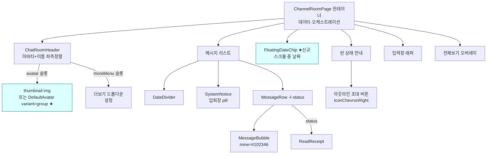
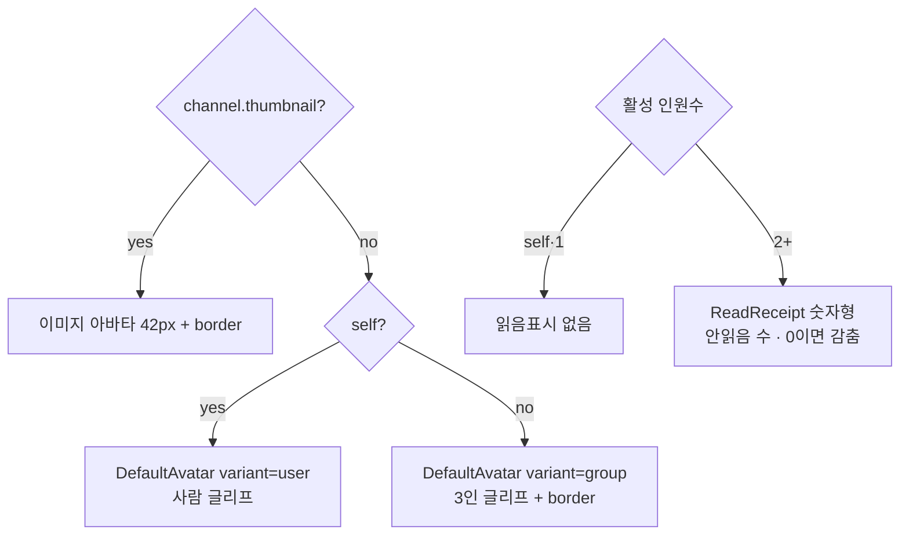
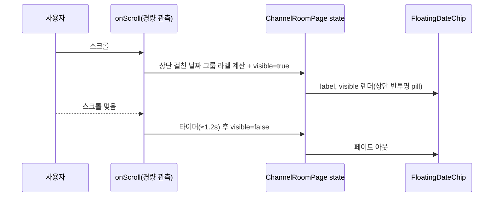

# 채팅방 UI (Chat Room UI)

> 상태: Live · 최종 갱신: 2026-07-20 · 관련 ADR: [[ADR-0010]](../../../../../docs/adr/0010-chat-screen-webuikit-rebuild.md), [[ADR-0021]](../../../../../docs/adr/0021-channel-room-figma-refinement.md)

## 목적

채팅방 화면(`ChannelRoomPage`)을 DoU 디자인에 맞춰 `@chatic/web-ui-kit` 컴포넌트
기반으로 구성한다. 프레젠테이션은 라이브러리에 위임하고 컨테이너는 데이터·오케스트레이션만
소유한다. 이 문서는 화면 구조가 실제로 어떻게 동작하는지를 기술한다.

> 2026-07 개정(ADR-0021): 채널 메인 화면 Figma 개편 반영 — 헤더 [채널 이미지+이름 좌측정렬](멤버 스택 제거), 빈 상태 좌측정렬 안내+아웃라인 버튼, 스크롤 플로팅 날짜 pill, 화면 아이콘 Figma SVG 자산화.

## 설계 원칙

- **프레젠테이션은 web-ui-kit에 위임한다.** `ChannelRoomPage`는 데이터 조회·파생과
  오케스트레이션(전송/읽음/스크롤/액션)만 소유하고, 시각 요소는 라이브러리
  컴포넌트(slot 기반, stateless)로 조립한다.
- **누락 컴포넌트는 web-ui-kit에 신규 정의 후 사용한다.** 라이브러리 컨벤션
  (`libs/web-ui-kit/README.md`)을 따른다 — stateless·slot, i18n-agnostic 라벨
  props(호스트가 번역 주입), 토큰만 사용, 각 컴포넌트 `*.test.tsx` + `*.stories.tsx`
  동반, `*Props` export.
- **헤더는 [아바타 + 제목 좌측정렬] 단일 형태로 통일한다.** self·1:1·group 구분 없이
  헤더는 채널 이미지(썸네일) + 이름을 왼쪽에 나란히 둔다. 멤버 아바타 스택/카운트는
  헤더에서 노출하지 않는다(ADR-0021). 썸네일이 없을 때 fallback 글리프는 self만 사람
  글리프, **그 외(1:1 포함)는 3인 그룹 글리프로 통일**한다(1:1/그룹 판정 없음).
- **화면에 노출되는 아이콘은 Figma SVG로 자산화한다.** lucide 플레이스홀더로 충분한
  것은 그대로 두되, Figma 전용 글리프(그룹 아바타 등)는 SVG를 추출해 `resources/icons`에
  커스텀 아이콘으로 정의한다(ADR-0021).
- **읽음 카운트는 기존 데이터 계층을 재사용한다.** 읽음/안읽음 수치는
  `useJoinPositions.getReadCount`가 이미 계산한다([useJoinPositions.ts:76](../../../src/app/features/channels/hooks/useJoinPositions.ts))
  — 신규 컴포넌트는 표현만 담당한다.
- **읽음표시 모드 = 활성 인원 기준**으로 파생한다(2명=binary, 3+=count).

## 범위

**포함**

- 헤더: [아바타 + 이름] 좌측정렬. 아바타는 `channel.thumbnail`(있으면 이미지), 없으면
  기본 아바타(self/1:1=사람 글리프, group=3인 글리프). 더보기(⋯) 드롭다운(설정)은 유지.
- 빈 상태(메시지 없음): 상단 `DateDivider` + 좌측정렬 안내 문구(제목/부제) + "친구
  초대하기" **아웃라인 pill 버튼**(chevron right). 노출 게이팅은 **기존 유지**(방장 +
  비게스트 + 클라우드 활성). self chat 빈 상태(PenLine 안내)는 기존 유지.
- 스크롤 중 **플로팅 날짜 pill**(신규): 현재 화면 상단에 걸린 날짜 그룹의 날짜를 반투명
  pill로 표시, 스크롤이 멎으면 사라짐.
- 메시지 리스트: 날짜 구분(`DateDivider`), 입퇴장 시스템 알림(`SystemNotice`), 말풍선
  (`MessageBubble` + `MessageRow`), 읽음표시(`ReadReceipt`, **Figma 숫자형 전환** — 안읽은
  수를 숫자로). 말풍선 색/반경을 Figma 토큰에 맞춰 정제(mine=`#102346`).
- 전체보기: 200자 초과 절단 + 인페이지 오버레이(기존 유지).
- web-ui-kit 신규/확장: `FloatingDateChip`(신규), `DefaultAvatar`에 `variant='group'`
  추가, `resources/icons`에 `IconGroup`(Figma SVG) 추가, `ChatRoomHeader` group 변형
  좌측정렬화.

**제외**

- 헤더 멤버 아바타 스택/카운트(제거). `AvatarGroup` 컴포넌트 자체는 라이브러리에 존치하되
  이 화면에서는 미사용.
- 빈 상태 노출 조건(게이팅) 로직 변경.
- 데이터/동기화/읽음 **계산** 로직 변경(`getReadCount` 수치는 그대로 재사용, 표현만
  숫자형으로). `useChatScroll`의 스크롤 구조 변경(플로팅 날짜는 별도 경량 관측으로 추가).
  채널 설정·초대 화면.

## 시나리오

1. **채널 진입(공통 헤더)** — 헤더 왼쪽에 채널 아바타 + 이름. 아바타는
   `channel.thumbnail`이 있으면 이미지, 없으면 기본 글리프(그룹=3인, self=사람). 오른쪽
   더보기(⋯) → `설정` 드롭다운. 멤버 수/아바타 스택은 헤더에 표시하지 않는다.
2. **빈 그룹방(방장) 진입** — 메시지가 없고 본인이 방장(비게스트·클라우드 활성)이면 상단에
   오늘 `DateDivider`, 그 아래 좌측정렬로 "그룹방을 만들었습니다." + "친구를 초대하고
   대화를 시작해 보세요." + "친구 초대하기"(아웃라인 pill, chevron) 버튼 → 초대 다이얼로그.
   방장이 아니거나 게스트/클라우드 비활성이면 안내를 표시하지 않는다(기존 게이팅).
3. **나와의 채팅 진입** — 헤더는 아바타(사람 글리프) + "나와의 채팅". 메시지는 전부 `mine`
   말풍선, 읽음표시 없음. 비어 있으면 PenLine 안내(기존 유지).
4. **읽음표시(숫자형)** — 내 메시지에 아직 안 읽은 인원 수를 시간 옆 숫자로 표시(1:1은
   0/1, 그룹은 안 읽은 인원 수). 전원이 읽으면(안읽음 0) 숫자를 감춘다. self·1명은 미표시.
5. **스크롤로 과거 메시지 탐색** — 스크롤하는 동안 화면 상단에 현재 걸쳐 있는 날짜 그룹의
   날짜가 플로팅 pill("7. 01 월" 형태)로 뜨고, 스크롤이 멎으면 잠시 뒤 사라진다.
6. **메시지 전송** — 낙관적 렌더(`전송 중`) → 성공 시 시간+읽음표시, 실패 시 `전송 실패` + 재시도/삭제(기존 로직 유지).
7. **긴 메시지 전체보기** — 200자 초과 시 말풍선에 `전체보기` → 인페이지 오버레이.
8. **메시지 롱프레스** — 복사 메뉴 드롭다운(기존 유지).
9. **입퇴장 시스템 알림** — 중앙 pill(`SystemNotice`): 굵은 이름 + 문구. subType(join/
   leave)로 i18n 렌더(기존 유지).

## 다이어그램

### 화면 구성 (컨테이너 → web-ui-kit)

### 헤더 아바타 · 읽음표시 결정

### 플로팅 날짜 pill 동작

## 상세 구현

### web-ui-kit — 신규/확장

- **`DefaultAvatar` 확장** ([DefaultAvatar.tsx](../../../../../libs/web-ui-kit/src/foundations/avatar/DefaultAvatar.tsx)) —
  `variant?: 'user' | 'group'`(기본 `user`) 추가. `user`는 기존과 동일(brand-ink 원 +
  `IconUser`). `group`은 Figma "그룹방 Profile"(3158:26238): brand-ink(#102346) 원 +
  `gray_blue`(#E4EAEC) 보더 + `IconGroup`(3인 글리프, 흰색). 기존 호출부(AppHeader/홈)는
  기본값 유지로 무영향.
- **`IconGroup`** (`libs/web-ui-kit/src/resources/icons`) — Figma 그룹 글리프
  (asset `66c4b3f…svg`, viewBox `0 0 26 20.8`)를 커스텀 SVG 컴포넌트로 추출.
  `currentColor` 사용, `IconProps`(=`LucideProps` size/className) 호환 시그니처. 기존
  lucide `IconUsers`(범용)와 구분되는 이 화면 전용 글리프.
- **`FloatingDateChip`** (`libs/web-ui-kit/src/composites/chat/FloatingDateChip.tsx`) —
  스크롤 중 상단 반투명 날짜 pill. props: `label: string`, `visible?: boolean`,
  `className`. Figma(3188:24204): `bg-white/82` + `backdrop-blur-[2px]`, `rounded-[7px]`,
  `px-2 py-1`, 텍스트 11px SemiBold `#222325` tracking `-0.055px`. `visible`로 opacity
  전환(stateless — 표시 여부/타이머는 호스트 소유).

### web-ui-kit — 기존 컴포넌트 변경

- **`ChatRoomHeader`** ([ChatRoomHeader.tsx](../../../../../libs/web-ui-kit/src/composites/header/ChatRoomHeader.tsx)) —
  `group` 변형을 `direct`와 동일한 [leading avatar + 좌측정렬 제목]으로 통합한다.
    - 제목 중앙정렬(`text-center`)과 `meta` 하단 행 렌더를 제거. 두 kind 모두 왼쪽에
      아바타를 두고 제목을 좌측정렬.
    - `avatar` 슬롯을 group에서도 사용. avatar 미전달 시 fallback을 kind별로:
      `direct`→`<DefaultAvatar/>`, `group`→`<DefaultAvatar variant="group"/>`.
    - `meta` prop 제거(멤버 스택 미사용). 유일 소비처가 `ChannelRoomPage`라 blast radius
      없음(`AvatarGroup`은 라이브러리에 존치).
- **`MessageBubble`** ([MessageBubble.tsx](../../../../../libs/web-ui-kit/src/foundations/bubble/MessageBubble.tsx)) —
  mine 배경을 Figma `#102346`에 맞춤(토큰 `--bubble-mine` 갱신, 아래). 반경/여백은
  Figma(3188)와 대조해 필요 시 미세 조정. 컴포넌트 구조 변경은 없음(토큰만).
- **`ReadReceipt` 숫자형 전환** ([ReadReceipt.tsx](../../../../../libs/web-ui-kit/src/composites/chat/ReadReceipt.tsx)) —
  `읽음 N · 안읽음 M` 텍스트 → 안읽은 수 숫자(Figma 3188:24178). `unreadCount > 0`이면 숫자만
  (`text-main-accent` = #90C304, 12px SemiBold), `0`이면 `null`(전원 읽음). props는
  `unreadCount` + `unreadLabel`(a11y `aria-label`)만 남기고 `variant`/`readCount`/`readLabel`
  제거. 소비처(`ChannelMessageRow`)와 `MessageReadInfo`도 함께 축소.

### apps/web — 컨테이너

- **`ChannelRoomPage`** ([ChannelRoomPage.tsx](../../../src/app/features/channels/pages/ChannelRoomPage.tsx)) —
    - 헤더: `<ChatRoomHeader kind={...} title=... avatar={headerAvatar} onBack moreMenu={...} />`.
      `headerAvatar` = `channel.thumbnail`이면 ``,
      없으면 미전달(헤더 fallback이 처리). `kind`는 self면 `direct`(사람 글리프), 그 외
      전부 `group`(3인 글리프). 기존 `memberAvatars`/`groupMeta`/`AvatarGroup` import 제거.
    - 빈 상태(비-self, 게이팅 통과): 상단 `DateDivider`(오늘) + 좌측정렬 블록(px-16 py-10
      gap-24): 제목(18px SemiBold `#222325`) + 부제(16px `#53555B`) + "친구 초대하기"
      아웃라인 pill 버튼(border `#eaeaec`, rounded-full, h-50, gap-6, 16px SemiBold +
      `IconChevronRight` 18px). 기존 Plus/solid 버튼 대체. self 빈 상태는 기존 유지.
    - 플로팅 날짜: 각 날짜 그룹 래퍼에 `data-date-label` 부여. `onScroll`에 경량 핸들러를
      더해 컨테이너 상단 경계에 걸친 그룹의 라벨을 계산 → `floatingDate` state 갱신 +
      `visible=true`, 스크롤 정지 타이머(≈1.2s)로 `visible=false`. 리스트 컨테이너 상단에
      `<FloatingDateChip label={floatingDate} visible={showFloatingDate} />`를 오버레이.
      `useChatScroll` 자체는 건드리지 않는다(`debouncedHandleScroll`와 공존).
    - 날짜 라벨 포맷: 플로팅용은 짧은 형식("M. DD ддд", 예 "7. 01 월") — 기존
      `formatDateSeparator`(전체 형식)와 별도 `formatFloatingDate` 추가.
    - 리스트/전송/읽음/전체보기/입력창: 기존 로직 유지.
- **`ChannelMessageRow`** ([ChannelMessageRow.tsx](../../../src/app/features/channels/components/ChannelMessageRow.tsx)) —
  구조 유지. 필요 시 avatar/버블 미세 스타일만 Figma에 맞춤.

### 디자인 토큰

- `--bubble-mine`을 Figma mine 색 `#102346`(=`218 63% 16%`)으로 갱신. web-ui-kit
  `tokens.css`는 이미 이 값이었고 실제 렌더링하는 `apps/web/src/styles.css`(light/dark)만
  채도 낮은 값이라 어긋나 있던 것을 맞췄다(메모리 [[web-app-mirrors-ui-kit-tokens]]).
- 그룹 아바타 보더색 `gray_blue #E4EAEC` → 기존 `border`(≈`220 15% 91%`) 토큰 재사용
  (`border-border`). 빈 상태 초대 버튼 보더 `#EAEAEC` → `border-input-border` 재사용. 신규
  토큰 추가 없음.
- 읽음 숫자색 `#90C304` → `text-main-accent` 재사용.

## 검증 방법

- **단위 테스트(통과)**: web-ui-kit 전체 `51 suites / 181 tests` 통과(신규 `IconGroup`,
  `FloatingDateChip` 및 갱신된 `DefaultAvatar`·`ChatRoomHeader`·`ReadReceipt` 테스트 포함).
  apps/web channels `12 suites / 47 tests` 통과. 각 테스트는 Figma에서 추출한 실제 토큰
  (`bg-brand-ink`/`border-border`/`text-main-accent`, opacity 상태, 안읽음 0 감춤 등)을
  단언한다.
  `npx jest --config libs/web-ui-kit/jest.config.js` /
  `--config apps/web/jest.config.js apps/web/src/app/features/channels`.
- **타입체크(통과)**: `nx typecheck web-ui-kit` 통과. `web`은 워크트리에서 프로젝트 참조
  rootDir/`import.meta` 설정상 기존부터 실패하나(변경 무관 기존 에러), 변경 파일
  (`ChannelRoomPage`/`ChannelMessageRow`)에는 에러 없음 확인.
- **Storybook 시각 검증**: 스토리 갱신 완료(`ChatRoomHeader` group thumbnail 유/무,
  `FloatingDateChip` visible on/off, `DefaultAvatar` user/group, `ReadReceipt` 숫자형,
  `ChatScreen` 쇼케이스). 워크트리는 메인 트리 `node_modules`(→ storybook 빌드 캐시)를
  심링크로 공유해 실행 중인 다른 세션과 캐시가 얽히므로, 라이브 스토리 화면 대조는 캐시가
  독립된 환경에서 `nx storybook @chatic/web-ui-kit`로 수행할 것. (mine 말풍선 `#102346`
  네이비는 프리뷰에서 정상 렌더 확인.)
- **앱 런타임 검증(후속)**: 실제 채팅방은 로그인+소켓 필요 → 백엔드 연결 환경에서 헤더/
  빈상태/스크롤 플로팅 날짜/읽음 숫자를 브라우저로 확인.
