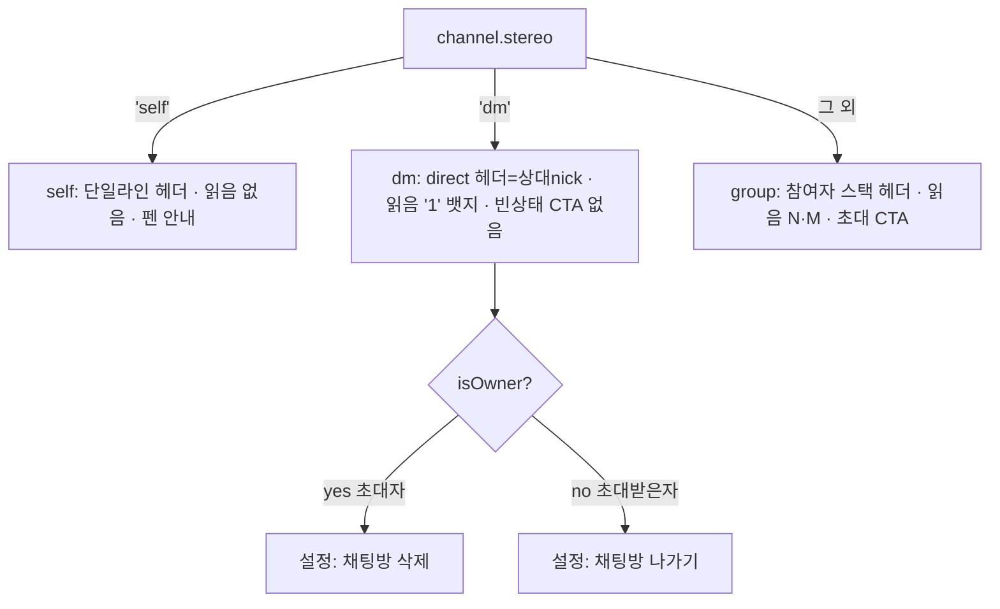
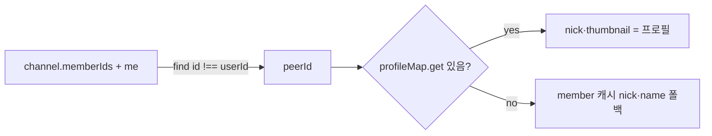

# 1:1 채팅 (DM Chat)

> 상태: Live · 최종 갱신: 2026-07-27 · 관련 ADR: [ADR-0032](../../../../../docs/adr/0032-dm-chat-room-screen.md)

## 목적

`stereo === 'dm'`인 1:1 채팅 채널 유형을 web에서 일관되게 다룬다. 룸([[chat-room-ui]])·
설정([[channel-settings-ui]])에 "미처리(not special-cased yet)"로 남아 있던 dm 분기를
채워, 헤더·빈 상태·읽음 표시·설정 화면을 1:1 맥락에 맞게 통일한다. 프레젠테이션은 기존
방침대로 `@chatic/web-ui-kit`에 위임한다([[self-chat]] 계승).

기존 룸/설정 문서는 dm을 "그룹 아님 / self 아님"으로만 소극 분기했다
([chat-room-ui.md](chat-room-ui.md)의 `isGroupChat = … && stereo !== 'dm'`) — 이 문서가
dm 유형을 가로질러 하나로 기술하고, 룸/설정 문서에는 상호링크만 둔다.

## 설계 원칙

- **dm 판별은 `stereo === 'dm'` 단일 기준.** 멤버 수 기반 판별을 쓰지 않는다. 룸·설정
  어디서든 `channel.stereo === 'dm'`(또는 이를 파생한 `isDmChat`)만 본다. self 판별
  ([[channel-stereo-group-identification]])과 같은 방식이다.
- **dm 헤더 제목·아바타는 상대(peer)의 site 프로필에서 파생한다.** `channel.name`이나 내
  `$join.nick`이 아니라, roster에서 나를 제외한 상대의 `profile.nick`/`thumbnail`을 쓴다.
  프로필 미로딩 시 member 캐시(`member.nick || member.name`)로 폴백한다.
- **dm 방 이름은 변경할 수 없다.** 헤더가 항상 상대 nick 파생이므로 사용자 지정 이름 개념이
  없다 — 설정의 이름 행은 편집 진입(다이얼로그 오픈)을 제거하고, self처럼 별도 이름 편집
  UI도 두지 않는다.
- **읽음 표시(ReadReceipt)는 dm에서 카톡식 '1' 뱃지로 노출한다.** 그룹의 "읽음 N · 안읽음 M"
  대신, 상대가 안 읽은 동안만 안읽음 인원수(dm은 0/1)를 뱃지로 보여주고 읽으면 사라진다.
  `showReadReceipt` 파생(`!isSelfChat && activeCount >= 2`)은 dm에서 이미 참이므로 그대로
  재사용하고, 표시 모드만 분기한다.
- **삭제/나가기 분기는 기존 소유권 규칙을 그대로 쓴다.** 초대자(owner)→삭제, 초대받은자
  (member)→나가기. `ChannelSettingsPage`의 `isOwner` 분기가 이미 이 규칙을 구현하므로 dm
  전용 처리가 없다.
- **누락 컴포넌트만 web-ui-kit에 신규 정의.** dm 헤더는 기존 `ChatRoomHeader`의
  `kind='direct'` 변형으로 충족. 읽음 '1' 뱃지는 신규 컴포넌트가 아니라 기존 `ReadReceipt`에
  표시 모드(`mode`)를 추가해 충족한다(라이브러리 stateless·slot·i18n-agnostic·토큰·
  `*.test.tsx`+`*.stories.tsx` 컨벤션 유지).

## 범위

**포함**

1. **dm 판별 파생** — 룸/설정에서 `isDmChat = channel.stereo === 'dm'`.
2. **상대(peer) 파생 훅** — `useDmPeer`: roster에서 나 제외 상대의 `id`/`nick`/`thumbnail`을
   `profileMap` 우선 + member 캐시 폴백으로 반환. 룸·설정이 공유.
3. **dm 룸 헤더** — `kind='direct'`, 제목=상대 nick, 아바타=상대 thumbnail(없으면 direct
   글리프). 그룹 참여자 스택(meta)은 미노출(기존 `isGroupChat`이 이미 dm 제외).
4. **dm 읽음 '1' 뱃지** — `ReadReceipt`에 `mode='dm'` 추가. `unreadCount > 0`이면 숫자만,
   아니면 렌더 없음. 룸이 dm일 때 이 모드를 넘긴다.
5. **dm 빈 상태** — 그룹 빈 상태의 "초대하기" CTA를 dm에서 미노출(버블 없는 게 초기 상태).
6. **dm 설정 화면** — 이름 행 편집 진입 제거(상대 nick 표시, 탭 비활성), "친구 추가" 행
   숨김, 멤버 프로필의 "내보내기(kick)" 비활성(`canKick`을 `!isDmChat`로 게이트). 알림 토글·
   멤버 목록·삭제/나가기는 유지.

**제외**

- **dm 채널 생성 경로** — web에 dm 채널 생성 UI/로직을 만들지 않는다. dm 채널은 서버에 이미
  존재한다고 가정하고 읽기/사용만 다룬다.
- **dm 방 이름 변경 기능** — 정책상 변경 불가로 확정(별도 UI 없음).
- self/group 룸·설정 레이아웃 변경([[chat-room-ui]]·[[channel-settings-ui]] 유지).
- 신규 web-ui-kit 컴포넌트 신설(기존 `ChatRoomHeader`/`ReadReceipt` 확장으로 충족).

## 시나리오

1. **dm 룸 진입** — 헤더: 상대 프로필 아바타(썸네일 있으면 이미지, 없으면 direct 글리프) +
   제목(상대 `profile.nick`, 폴백 member 이름). ⋯ → "설정". 참여자 스택 없음.
2. **메시지 송수신** — 내 말풍선은 오른쪽, 상대 말풍선은 왼쪽. 그룹과 동일한 버블/그룹핑.
3. **읽음 표시** — 내가 보낸 메시지를 상대가 아직 안 읽었으면 시간 옆에 `1`. 상대가 읽으면
   사라진다. 상대 메시지는 내가 룸에 들어와 읽음 처리되어 뱃지가 뜨지 않는다.
4. **빈 dm 룸** — 상단 오늘 `DateDivider`만. 초대 CTA·안내 문구 없음(버블 없는 초기 상태).
5. **설정(방 정보) 진입** — 상단 이름 행(상대 아바타 + 상대 nick, `>` 없음, 탭 비활성) +
   대화방 알림 토글 + "방 친구"(상대 + 나) + 삭제/나가기. "친구 추가" 행 없음.
6. **삭제/나가기** — 내가 초대자(owner)면 "채팅방 삭제", 초대받은자(member)면 "채팅방
   나가기". 기존 `ConfirmDialog` + `deleteChannel`/`leaveChannel` 그대로.

## 다이어그램

### 채널 유형 → 룸/설정 분기

### 상대(peer) 파생

## 상세 구현

핵심 파일과 역할:

- **[ChannelRoomPage.tsx](../../../src/app/features/channels/pages/ChannelRoomPage.tsx)** —
  `isDmChat` 파생 추가. 현재 헤더는 `kind={isSelfChat ? 'self' : 'group'}`
  ([ChannelRoomPage.tsx:416](../../../src/app/features/channels/pages/ChannelRoomPage.tsx#L416))
  → dm이면 `'direct'`, 제목/아바타를 `useDmPeer`에서. 빈 상태의 owner 초대 CTA 분기
  ([ChannelRoomPage.tsx:448](../../../src/app/features/channels/pages/ChannelRoomPage.tsx#L448))에
  `!isDmChat` 게이트 추가. 읽음 mode는 `ChannelMessageRow`의 `read`로 전달.
- **[useDmPeer.ts](../../../src/app/features/channels/hooks/useDmPeer.ts)** (신규) — `(channel,
members, profileMap, userId) → { id, nick, thumbnail } | null`. roster에서 나 제외 상대를
  찾아 `profileMap` 우선 + member 캐시 폴백으로 해석. `stereo !== 'dm'`이면 `null`.
- **[ChannelMessageRow.tsx](../../../src/app/features/channels/components/ChannelMessageRow.tsx)** —
  `MessageReadInfo`에 `mode?: 'count' | 'dm'` 추가, `ReadReceipt`에 전달
  ([ChannelMessageRow.tsx:162](../../../src/app/features/channels/components/ChannelMessageRow.tsx#L162)).
- **[ReadReceipt.tsx](../../../../../libs/web-ui-kit/src/composites/chat/ReadReceipt.tsx)** —
  `mode?: 'count' | 'dm'`(기본 `'count'`). `'dm'`이면 `unreadCount > 0`일 때 숫자만 accent로
  렌더(`text-main-accent`), 0이면 `null`. `'count'`는 기존 "읽음 N · 안읽음 M" 유지. 뱃지는
  기존 status 슬롯(메시지 시간 옆)에 렌더된다 — 카톡의 시간 앞 배치가 필요해지면 위치만 조정.
- **[ChannelSettingsPage.tsx](../../../src/app/features/channels/pages/ChannelSettingsPage.tsx)** —
  `isDmChat` 파생. `useDmPeer`/`useSelfChatTitle` 훅은 `isError` early return **위에서** 호출한다
  (Rules of Hooks). 이름 행 `onClick`을 dm에서 제거(+ trailing `>` 숨김), `roomTitle`을 dm이면
  상대 nick으로. DM 아바타는 룸 헤더와 동일하게 항상 peer를 쓴다(`channel.thumbnail` 무시).
  "친구 추가" 행은 `isOwner && !isDmChat`로 게이트하고, `MemberProfileDialog`의 `canKick`도
  `!isDmChat`로 게이트해 DM에서 상대 내보내기를 막는다.

읽음 카운트 의미는 [useJoinPositions.ts:74](../../../src/app/features/channels/hooks/useJoinPositions.ts#L74)
그대로 사용한다 — sender는 unread에 안 잡히므로 dm의 `unreadCount`는 "상대가 안 읽음"과
1:1로 대응한다.

## 검증 방법

- **유닛 테스트**
    - [useDmPeer.test.ts](../../../src/app/features/channels/hooks/useDmPeer.test.ts) — dm이
      아니면 null, roster에서 나 제외 상대 선택, `profileMap` 우선 + member 폴백, roster 비었을
      때 member 목록으로 해석, peer 없을 때 null (6 케이스).
    - [ReadReceipt.test.tsx](../../../../../libs/web-ui-kit/src/composites/chat/ReadReceipt.test.tsx)
      `dm mode` — `unreadCount=1` → accent "1" 노출, `unreadCount=0` → 렌더 없음, aria-label
      노출. 기존 `mode='count'` 케이스 유지.
    - [ChannelSettingsPage.test.tsx](../../../src/app/features/channels/pages/ChannelSettingsPage.test.tsx)
      — hooks 모킹에 `useDmPeer` 포함(비-dm은 null). 기존 소유자/멤버/self 케이스 유지.
    - 실행: `npx nx test web --testPathPatterns='channels'`, `npx nx test web-ui-kit`.
      (`SelfChatNameDialog`·`UpdateChannelDialog` 스위트의 모듈 해석 실패는 이 작업과 무관한
      기존 환경 이슈다.)
- **수동 확인**(preview) — 실제 dm 채널 + 로그인 세션 필요. dm 룸 진입 시 헤더가 상대
  nick/아바타인지, 내 메시지에 상대 미열람 시 `1`이 뜨고 열람 시 사라지는지, 빈 dm 룸에 CTA가
  없는지, 설정에서 이름 행이 탭 안 되고 "친구 추가"가 없는지, owner/member에 따라 삭제/나가기가
  맞는지.

## 참고 (알려진 한계)

- **상대 초대 수락 전(pending, `joined === 0`)** — `activeMemberIds`에 상대가 없어
  `profileMap`에 프로필이 없을 수 있다. `useDmPeer`가 roster(`channel.memberIds`) 기준으로
  peer를 찾고 member 캐시로 폴백하므로 이름은 나오지만, 썸네일/nick이 잠깐 폴백값일 수 있다.
- **Figma 픽셀 스펙 미대조** — 헤더 간격·읽음 '1' 뱃지 위치/색, 설정 이름 행의 dm 표기 등은
  기존 토큰/컴포넌트 기본을 따른다. 디자인과 어긋나면 후속 조정.
