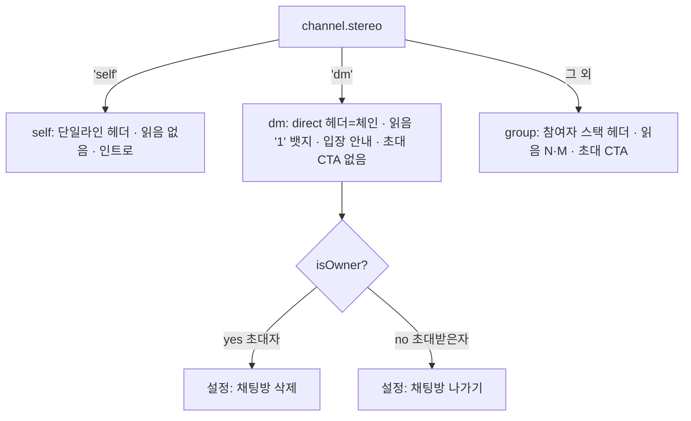
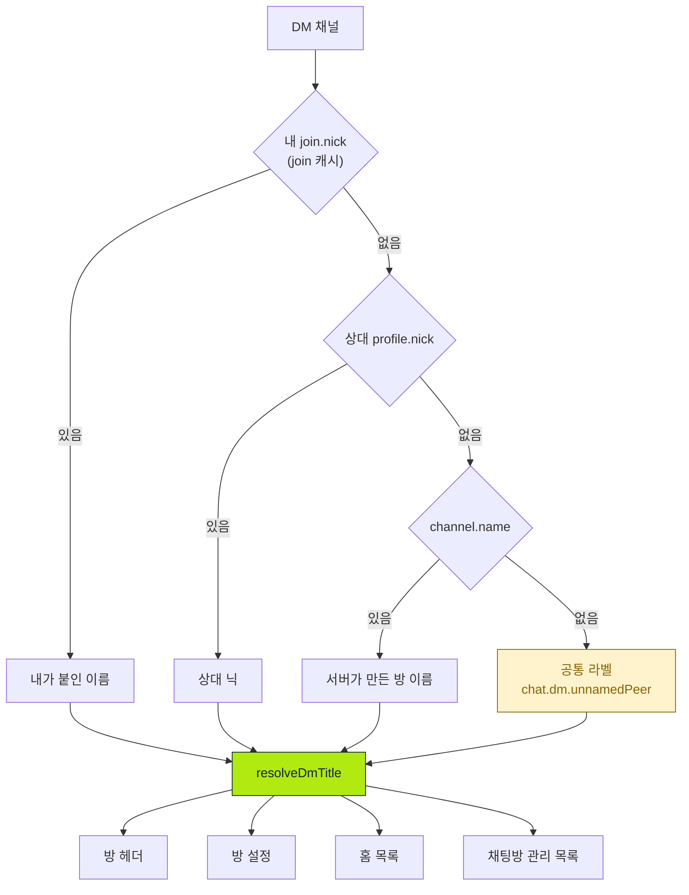
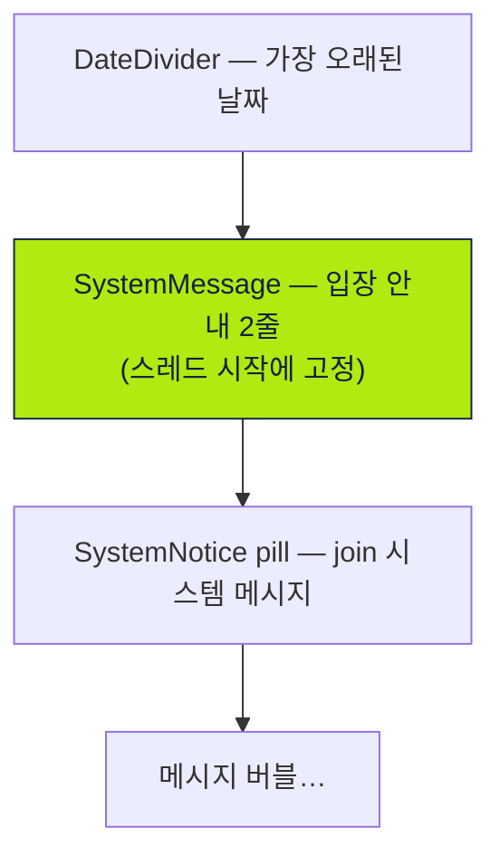

# 1:1 채팅 (DM Chat)

> 상태: Live · 최종 갱신: 2026-07-31 · 관련 ADR: [ADR-0039](../../../../../docs/adr/0039-dm-display-name-chain-and-invite-profile-release.md) · [ADR-0032](../../../../../docs/adr/0032-dm-chat-room-screen.md)(Superseded)

## 목적

`stereo === 'dm'`인 1:1 채팅 채널 유형을 web에서 일관되게 다룬다. 룸([[chat-room-ui]])·
설정([[channel-settings-ui]])에 "미처리(not special-cased yet)"로 남아 있던 dm 분기를 채워,
헤더·본문·읽음 표시·설정 화면을 1:1 맥락에 맞게 통일한다. 프레젠테이션은 기존 방침대로
`@chatic/web-ui-kit`에 위임한다([[self-chat]] 계승).

그룹방과 달리 **DM에는 방 이름이라는 것이 없다** — 방은 곧 상대 한 사람이다. 그래서 이 문서가
답하는 가장 중요한 질문은 하나로 좁혀진다:

**"이 방을 무엇이라고 부를 것인가, 그리고 그 답을 모든 화면이 똑같이 내놓게 할 것인가."**

후자가 이 문서를 유지하는 이유다. DM 이름을 만드는 화면이 넷(방 헤더 · 방 설정 · 홈 목록 ·
채팅방 관리 목록)인데 각자 다르게 계산해서, **같은 방이 홈에서는 "이름 없는 채널", 열면 상대
이름으로 바뀌는** 상태였다(ADR-0039 맥락).

## 설계 원칙

- **dm 판별은 `stereo === 'dm'` 단일 기준.** 멤버 수 기반 판별을 쓰지 않는다. self 판별
  ([[channel-stereo-group-identification]])과 같은 방식이다.
- **이름 계산은 순수 함수 하나에만 둔다.** 네 화면이 각자 삼항 연산자를 쓰는 대신
  `resolveDmTitle` 하나를 부른다. 화면마다 폴백 단계가 하나씩 다른 것이 애초의 어긋남이었다 —
  버그가 아니라 구조의 결과였다. peer를 고르는 규칙도 같은 이유로 `pickDmPeerId` 하나다.
- **모든 화면이 같은 입력을 낼 수 있어야 한다.** 체인에 들어가는 값은 **네 화면이 전부 싸게
  구할 수 있는 것만** 쓴다. 한 화면만 가진 값(예: 채널별 user 캐시)을 넣으면 그 화면만 다른
  답을 내고 원점으로 돌아간다. 이 원칙이 `user.nick`/`user.name` 폴백을 DM 표시명에서 뺀
  이유다.
- **join 값은 join 캐시에서 읽는다.** `channel.$join`은 projection이라 join 캐시보다 늦다
  ([useMyJoin.ts](../../../src/app/features/channels/hooks/useMyJoin.ts)). 이름 변경이 즉시
  반영되어야 하는 화면은 `useMyJoin`/`useMyJoins`를 쓴다.
- **DM에서 `channel.name`은 최후 수단이지 근거가 아니다.** 그룹방 이름은 소유자가 정한 것이지만
  DM의 `channel.name`은 서버가 만든 값이라 사람이 붙인 이름보다 신뢰도가 낮다.
- **읽히지 않는 이름은 이름이 아니다.** 전화번호 유저의 `***1234`류 표시명(ADR-0033 D10)을 DM
  제목이나 안내 문구에 넣지 않는다. 이름이 없으면 이름이 없다고 말한다.
- **읽음 표시(ReadReceipt)는 dm에서 카톡식 '1' 뱃지로 노출한다.** `showReadReceipt` 파생
  (`!isSelfChat && activeCount >= 2`)은 dm에서 이미 참이므로 그대로 재사용하고 표시 모드만 분기.
- **삭제/나가기 분기는 기존 소유권 규칙을 그대로 쓴다.** 초대자(owner)→삭제, 초대받은자
  (member)→나가기. `ChannelSettingsPage`의 `isOwner` 분기가 이미 구현하므로 dm 전용 처리 없음.
- **DM 전용 컴포넌트를 새로 만들지 않는다.** 헤더는 `ChatRoomHeader`의 `kind='direct'`, 읽음은
  기존 `ReadReceipt`에 `mode` 추가, 인트로는 기존 `SystemMessage`, 이름 편집은 self와 공용
  `JoinNickDialog`.

## 범위

**포함**

1. **dm 판별 파생** — 룸/설정/목록에서 `isDmChat = channel.stereo === 'dm'`.
2. **표시 이름 체인** — 내 `join.nick` → 상대 `profile.nick` → `channel.name` → 공통 라벨.
   네 화면이 `resolveDmTitle` 하나를 공유한다.
3. **상대(peer) 파생** — 룸은 `useDmPeer`, 목록은 배치 훅 `useDmPeers`.
4. **dm 룸 헤더** — `kind='direct'`, 제목=체인, 아바타=상대 thumbnail(없으면 direct 글리프).
   그룹 참여자 스택(meta)은 미노출.
5. **본문 최상단 입장 안내 블록** — `SystemMessage` 2줄. 스트림의 join 시스템 메시지(pill)와
   **병존**한다.
6. **dm 읽음 '1' 뱃지** — `ReadReceipt`의 `mode='dm'`.
7. **dm 설정 화면** — 방 이름 변경(내 `join.nick`) 개방, "친구 추가" 숨김, 멤버
   "내보내기(kick)" 비활성. 알림 토글·멤버 목록·삭제/나가기 유지.
8. **홈 / 채팅방 관리 목록의 dm 행** — 제목=체인, 아바타=상대 thumbnail, 인원수 pill 숨김.

**제외**

- **dm 채널 생성 경로** — 서버에 이미 존재하는 dm 채널을 읽기/사용만 한다.
- **초대 시 입력한 친구 이름 → `join.nick` 자동 반영** — 별도 작업. 이 문서는 `join.nick`을
  **읽는** 쪽과 사용자가 직접 쓰는 경로만 다룬다.
- self/group 룸·설정 레이아웃 변경([[chat-room-ui]]·[[channel-settings-ui]] 유지).
- 신규 web-ui-kit 컴포넌트 신설.

## 시나리오

### S1. 초대자가 방을 만들고 상대를 기다린다 (프로필 없는 상대)

1. 연락처로 1:1 초대를 보낸다 → 서버가 DM 채널을 만든다.
2. 홈 목록에 dm 행이 생긴다. 상대는 아직 수락하지 않았고 프로필도 없다 → 체인이
   `join.nick`(없음) → 상대 `profile.nick`(없음) → `channel.name`으로 내려가고, 그것도 비면
   공통 라벨(`chat.dm.unnamedPeer`, "대화 상대")이 뜬다.
3. 방을 열면 헤더가 **홈과 똑같은 문자열**을 보여준다. 아바타는 1인 글리프.
4. 본문에는 아직 입장 안내의 이름이 없어 이름 없는 변형이 뜬다.

### S2. 상대가 수락하고 프로필을 만든다

1. 상대 join이 활성(`joined = 1`)이 되어 `activeMemberIds`에 들어가고 프로필 동기화 대상이 된다.
2. 상대가 나중에 플레이스 설정에서 프로필(닉·사진)을 만든다.
3. 프로필이 캐시에 도착하면 **네 화면이 함께** 상대 닉으로 바뀐다. 홈 행 아바타도 상대 사진으로.
4. 본문 최상단에 `<상대 닉>님이 채팅방에 입장했습니다.` / `1:1 대화를 시작해 보세요.`가 뜬다.
   스트림 안의 join 시스템 메시지(가운데 pill)도 그대로 뜬다 — **같은 문장이 두 모양으로 보이는
   것은 의도된 것이다**(ADR-0039 결정 3).

### S3. 내가 이 방에 이름을 붙인다

1. 방 → ⋯ → 방 설정 → 첫 행("방 이름") 탭.
2. 이름 입력 다이얼로그(최대 20자). placeholder는 지금 보이는 이름(상대 닉 → `channel.name` →
   공통 라벨).
3. 저장하면 `join.update`로 **내 `join.nick`만** 기록된다. 상대에게는 보이지 않는다.
4. 네 화면 모두 즉시 반영된다. 이후 상대가 프로필 이름을 바꿔도 **내가 붙인 이름이 계속 이긴다.**
5. 값을 비우면 `join.nick`이 지워지고 체인이 다시 상대 프로필로 내려간다.

### S4. 메시지 송수신과 읽음

내 말풍선은 오른쪽, 상대는 왼쪽(그룹과 동일한 버블/그룹핑). 내가 보낸 메시지를 상대가 아직 안
읽었으면 시간 옆에 `1`, 읽으면 사라진다. 상대 메시지는 내가 룸에 들어와 읽음 처리되어 뱃지가
뜨지 않는다.

### S5. 안내 블록은 메시지가 쌓인 뒤에도 맨 위에 남는다

빈 상태 전용이 아니다. **스레드의 진짜 시작**(가장 오래된 날짜 그룹이면서 더 불러올 과거가
없을 때)의 날짜 구분선 바로 아래에 고정되어, 스크롤을 끝까지 올리면
`[날짜][입장 안내][첫 메시지]` 순서로 읽힌다. self-chat 인트로와 같은 자리다.

수직 정렬은 그룹방과 같다 — 메시지가 없으면 화면 위, 하나라도 있으면 아래(최신이 바닥)에
붙는다. self-chat만 `flex-1` 스페이서로 항상 위에 고정한다.

### S6. 설정 진입과 삭제/나가기

상단 이름 행(상대 아바타 + 체인 제목 + `>`, 탭하면 이름 편집) + 대화방 알림 토글 +
"방 친구"(상대 + 나) + 삭제/나가기. "친구 추가" 행은 없다. 내가 초대자(owner)면 "채팅방 삭제",
초대받은자(member)면 "채팅방 나가기".

## 다이어그램

### 채널 유형 → 룸/설정 분기



### 표시 이름 체인 — 네 화면이 같은 함수를 부른다



`user.nick`/`user.name`이 체인에 없는 것이 핵심이다. 그 값은 채널당 `syncChannelUsers` 네트워크
호출로만 채워져서([useChannelMembers.ts#L75](../../../src/app/features/channels/hooks/useChannelMembers.ts#L75))
목록 화면이 싸게 가질 수 없다 — 넣으면 방만 다른 답을 낸다.

### 상대(peer) 파생 — 방과 목록의 두 경로


목록은 `useChannelMembers`를 쓰지 않는다(채널당 네트워크 호출). `channel.memberIds`에서 peer를
뽑고, 프로필은 **목록 단위 1회** 구독으로 끝낸다.

### 본문 최상단 구조



## 상세 구현

### 이름·peer 해석 (순수)

- **[dmTitle.ts](../../../src/app/features/channels/utils/dmTitle.ts)** —
  `resolveDmTitle({ joinNick, peerNick, channelName, unnamedLabel, selfUserId })`.
  [selfChatTitle.ts](../../../src/app/features/channels/utils/selfChatTitle.ts)와 같은 자리·같은
  성격(순수 + 코로케이션 테스트). 각 단계는 `?.trim() || 다음`으로 내려간다.
- **[nick.ts](../../../src/app/features/channels/utils/nick.ts)** — `isRawIdNick` /
  `customJoinNick`. `join.nick`을 최우선으로 읽는 체인의 함정을 막는다: **서버가 join의 `nick`을
  raw user id로 시딩하는 흐름이 있다**(이름 없는 self-chat이 확인된 사례). 두 제목 체인이
  trim·가드 인자 순서에서 갈라지지 않도록 `customJoinNick`을 공유한다.
- **[dmPeer.ts](../../../src/app/features/channels/utils/dmPeer.ts)** — `pickDmPeerId`. roster에서
  나를 제외한 멤버. **내 id를 모르면 `undefined`를 반환한다** — 가드가 없으면 `id !== userId`가
  공허하게 참이 되어 roster 첫 항목(보통 owner인 나)이 "상대"로 뽑히고, 내 이름과 아바타가 내
  대화 상대로 렌더된다.

### 훅

- **[useDmPeer.ts](../../../src/app/features/channels/hooks/useDmPeer.ts)** —
  `(channel, members, profileMap, userId) → { id, profileNick?, thumbnail? } | null`.
  `profileNick`은 **프로필만**이고 member 캐시 폴백이 없다(설계 원칙 3). `thumbnail`은 폴백을
  유지한다 — 전역 아바타는 목록에서도 문제되지 않고, 있으면 보여주는 게 낫다.
- **[useDmPeers.ts](../../../src/app/features/channels/hooks/useDmPeers.ts)** (목록용 배치) —
  `(sid, channels, userId) → Map<channelId, DmPeer>`. dm만 골라 peer id를 모으고 **중복 제거 후
  정렬**해 `useChannelProfiles`에 한 번 넘긴다. 정렬이 필요한 이유: 그 훅이 등록 이펙트를
  `ids.join(',')`로 키잉하는데 목록 순서는 최근활동순이라, 정렬하지 않으면 메시지 하나가 도착할
  때마다 모든 프로필 타깃이 해제·재등록된다. 폴링은 `LIST_PROFILE_SYNC_INTERVAL_MS`(60s) —
  상주 화면에 방용 5초를 걸면 행 수만큼 5초마다 요청이 나간다.

### 소비 화면

- **[ChannelRoomPage.tsx](../../../src/app/features/channels/pages/ChannelRoomPage.tsx)** —
  `isDmChat` 파생, `kind='direct'`, 제목은 `resolveDmTitle`. `joinNick`은
  `useMyJoin(channelId)?.nick`(projection인 `channel.$join`이 아니다). 인트로 `roomIntro`는
  빈 상태 분기와 `isThreadStart && roomIntro` 두 곳에서 렌더된다. `isThreadStart`는
  `가장 오래된 로드 그룹 && !hasMore` — `!hasMore`가 없으면 페이지네이션 중인 방에서 인트로가
  히스토리 중간에 뜨고 `loadMore`마다 옮겨다닌다.
- **[ChannelSettingsPage.tsx](../../../src/app/features/channels/pages/ChannelSettingsPage.tsx)** —
  같은 체인(`joinNick`은 `useMyJoin`). `useDmPeer`/`useSelfChatTitle`은 `isError` early return
  **위에서** 호출한다(Rules of Hooks). 방 이름 행은 dm에서도 `>` + `onClick`을 갖고
  `JoinNickDialog`를 연다. "친구 추가"는 `isOwner && !isDmChat`, `MemberProfileDialog`의
  `canKick`도 `!isDmChat`로 게이트.
- **[resolveChannelTitle.ts](../../../src/app/features/home/lib/resolveChannelTitle.ts)** —
  `'dm'` 분기가 owner/member 분기 **이전에** 가로챈다. 그 분기는 DM에 대해 틀리다: 초대자가
  owner라서 서버가 만든 `channel.name`이 이기고 내 이름과 상대 프로필이 모두 무시된다 — 홈과
  방이 어긋난 원인이 정확히 그것이었다. `dmUnnamedLabel`은 **필수**로 두었다(빠뜨리면 조용히
  드리프트하므로).
- **[ChannelList.tsx](../../../src/app/features/home/components/ChannelList.tsx)** — 목록 레벨에서
  `useDmPeers` 1회(`useMyProfile`과 같은 위치·같은 이유). dm 아바타는 상대 thumbnail, 인원수
  pill은 dm에서 숨김. `sid`는 **필수 prop**이다.
- **[PlaceChannelManagePage.tsx](../../../src/app/features/place/pages/PlaceChannelManagePage.tsx)** —
  같은 배선. `resolveChannelTitle`을 공유하므로 이 화면을 빼면 다시 어긋난다.

### 컴포넌트

- **[SystemMessage.tsx](../../../../../libs/web-ui-kit/src/composites/chat/SystemMessage.tsx)** —
  Figma `3086:14439` 기준(제목 18/26 `-0.09px` semibold, 설명 16/22 `-0.08px` `--label`,
  `gap-1.5`, `px-4 pt-2.5 pb-2`). self-chat 인트로와 dm 입장 안내가 공유한다. 이 통합으로
  self-chat 보조 문구 색이 `--description` → `--label`로 진해졌다(ADR-0037의 "Figma 보조 텍스트는
  `--label`" 매핑에 맞추는 정정).
- **[ReadReceipt.tsx](../../../../../libs/web-ui-kit/src/composites/chat/ReadReceipt.tsx)** —
  `mode?: 'count' | 'dm'`. `'dm'`이면 `unreadCount > 0`일 때 숫자만 accent로, 0이면 `null`.
- **[JoinNickDialog.tsx](../../../src/app/features/channels/components/JoinNickDialog.tsx)** —
  self/dm 공용. `variant`가 카피 네임스페이스(`selfChat.name.*` / `dmChat.name.*`)를 고르고
  `fallbackName`이 placeholder를 정한다. `join.update`로 내 `join.nick`을 쓰며,
  `UpdateChannelDialog`(모두가 보는 `channel.name`)와 다르다. **인스턴스는 하나만 마운트한다** —
  마운트마다 내 프로필을 조회하므로 variant별로 두 개를 두면 왕복이 두 배가 되고, dm에서는 그
  값을 쓰지도 않는다.

### i18n

`chat.dm.*`(`unnamedPeer`, `intro.title`, `intro.titleUnnamed`, `intro.description`)과
`dmChat.name.*`(8키, `selfChat.name.*`와 키 대응). `intro.title`의 `{{name}}`은 **상대
`profile.nick`만** 넣는다 — 이 문장은 "누가 입장했다"는 사실 서술이라 내가 붙인 별칭이 들어가면
어색하다. 없으면 `intro.titleUnnamed`.

읽음 카운트 의미는 [useJoinPositions.ts#L74](../../../src/app/features/channels/hooks/useJoinPositions.ts#L74)
그대로 — sender는 unread에 안 잡히므로 dm의 `unreadCount`는 "상대가 안 읽음"과 1:1로 대응한다.

## 검증 방법

```bash
npx nx test web
npx nx test web-ui-kit
```

라이브러리 산출물이 낡으면 앱 전체에 가짜 `TS6305`가 쏟아진다(오래된 `.tsbuildinfo`가 emit을
건너뛰게 만든다). 그때는 `find dist/out-tsc -name "*.tsbuildinfo" -delete` 후 재빌드.

| 파일                                                                                                  | 검증 대상                                                                                                   |
| ----------------------------------------------------------------------------------------------------- | ----------------------------------------------------------------------------------------------------------- |
| [dmTitle.test.ts](../../../src/app/features/channels/utils/dmTitle.test.ts)                           | 체인 4단계, 공백-only 하강, raw-id join nick 무시(peer 유/무 모두)                                          |
| [selfChatTitle.test.ts](../../../src/app/features/channels/utils/selfChatTitle.test.ts)               | `customJoinNick` 공유 후에도 동작 동일                                                                      |
| [useDmPeer.test.ts](../../../src/app/features/channels/hooks/useDmPeer.test.ts)                       | `profileNick`이 member 이름으로 폴백하지 **않고** thumbnail은 폴백                                          |
| [useDmPeers.test.ts](../../../src/app/features/channels/hooks/useDmPeers.test.ts)                     | dm만 선별, 구독 1회·중복 제거·정렬, `userId` 미상 시 빈 Map, 재렌더 시 id 목록 불변                         |
| [resolveChannelTitle.test.ts](../../../src/app/features/home/lib/resolveChannelTitle.test.ts)         | dm 분기 — owner여도 `channel.name`이 못 이김, 최종 라벨이 dm 전용                                           |
| [ChannelList.test.tsx](../../../src/app/features/home/components/ChannelList.test.tsx)                | dm 행 제목 4단계, 상대 thumbnail, pill 부재(그룹엔 존재)                                                    |
| [ChannelSettingsPage.test.tsx](../../../src/app/features/channels/pages/ChannelSettingsPage.test.tsx) | dm 제목, 이름 행이 `joinNick` 다이얼로그를 열고 그룹 다이얼로그는 아님, fallbackName 전달, "친구 추가" 숨김 |
| [JoinNickDialog.test.tsx](../../../src/app/features/channels/components/JoinNickDialog.test.tsx)      | self/dm 카피 분기, dm의 fallbackName placeholder, 두 변형이 같은 `join.update`                              |
| [SystemMessage.test.tsx](../../../../../libs/web-ui-kit/src/composites/chat/SystemMessage.test.tsx)   | 제목만/제목+설명, 좌측 정렬 블록, **Figma 타입 스케일**                                                     |
| [ReadReceipt.test.tsx](../../../../../libs/web-ui-kit/src/composites/chat/ReadReceipt.test.tsx)       | `dm mode` — unread 1 → accent "1", 0 → 렌더 없음                                                            |

`ChannelRoomPage`는 테스트 파일이 없다(700줄, 훅 다수). 인트로 렌더는 Storybook
(`web-ui-kit/composites/SystemMessage`)과 수동 확인이 담당한다.

**수동 확인** — 실제 dm 채널 + 로그인 세션 필요.

1. 프로필 없는 상대와의 dm → **홈 목록 제목과 방 헤더 문자열이 같은지** (이 설계의 핵심 검증)
2. 상대가 프로필을 만든 뒤 → 네 화면이 함께 바뀌는지, 홈 아바타가 상대 사진으로 바뀌는지
3. 방 설정에서 이름을 붙임 → 네 화면 즉시 반영(특히 **방 헤더**), 비우면 상대 닉으로 복귀
4. 메시지 0건 / 여러 날짜 그룹 / **100건 넘어 페이지네이션이 걸린 방**에서 인트로 위치
5. 상대 입장 직후 → pill과 블록이 둘 다 보이는지 (의도된 중복)
6. self-chat 방 → 인트로가 그대로 보이고 보조 문구 색만 진해졌는지
7. 홈 dm 행에 인원수 pill이 없고 그룹 행에는 있는지
8. 내 메시지에 상대 미열람 시 `1`, 열람 시 사라지는지 / 설정에서 owner·member별 삭제·나가기

## 참고 (알려진 한계)

- **`channel.name`이 relay dm에 실제로 채워지는지 미확인.** 비어 있으면 체인 3단계가 사실상 죽은
  분기이고, 프로필 없는 상대는 전부 공통 라벨로 보인다(동작은 정상).
- **프로필 없는 상대가 흔하다.** ADR-0039가 초대 수락의 프로필 강제를 없앤 결과다
  ([[relay-invite-accept]]). 사용자가 직접 방 이름을 붙이는 것(S3)이 현재 유일한 해소 경로이고,
  근본 해소는 초대 시 입력한 이름 → `join.nick` 배선(별도 작업)이다.
- **같은 문장이 한 화면에 두 모양으로 나온다**(가운데 pill + 왼쪽 블록). 의도된 중복이다.
- **수락 전 pending 상대**는 `activeMemberIds`에 없어 프로필이 없을 수 있다. 목록의 `useDmPeers`는
  `joined` 필터 없이 `memberIds`의 peer를 그대로 넘기므로 pending peer에도 프로필 동기화 타깃이
  등록된다(`DomainChannel`에 per-member `joined`가 없어 목록에서 싸게 걸러낼 수 없다).
- **미확정 카피** — `chat.dm.unnamedPeer`("대화 상대")와 `intro.titleUnnamed`는 우리가 정한 문구로
  디자이너 확인 대상이다.
