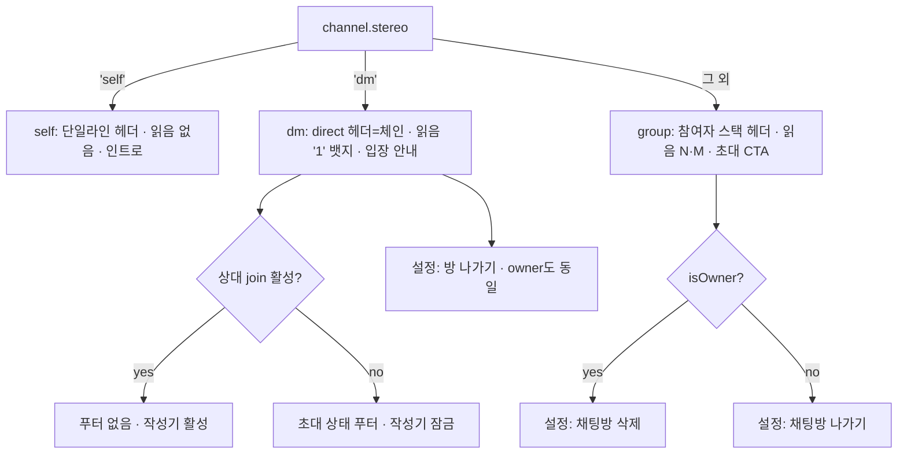
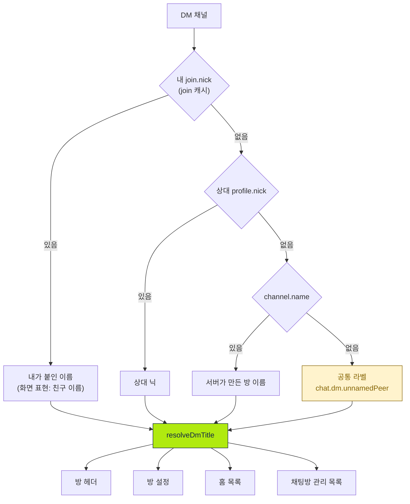
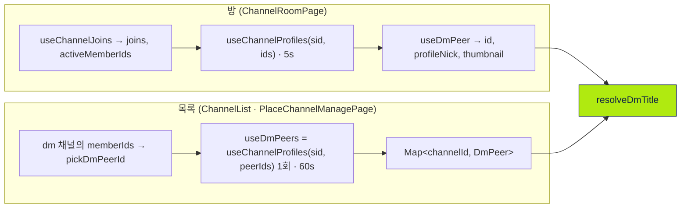
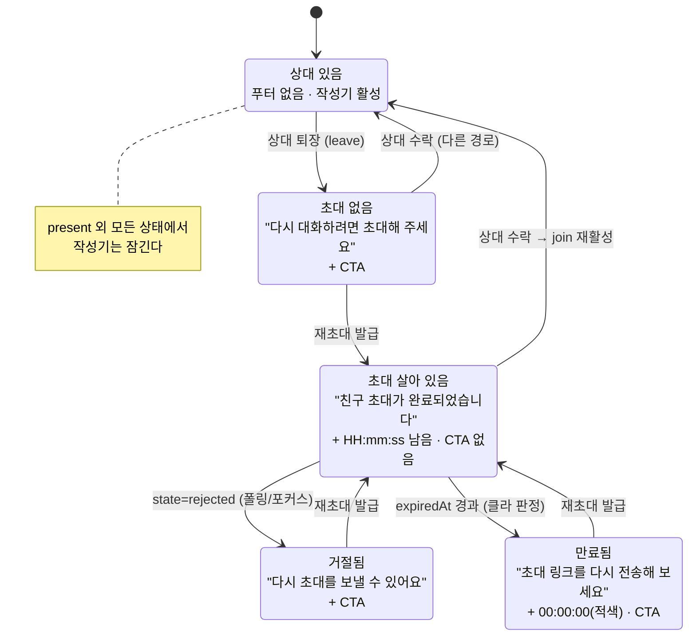
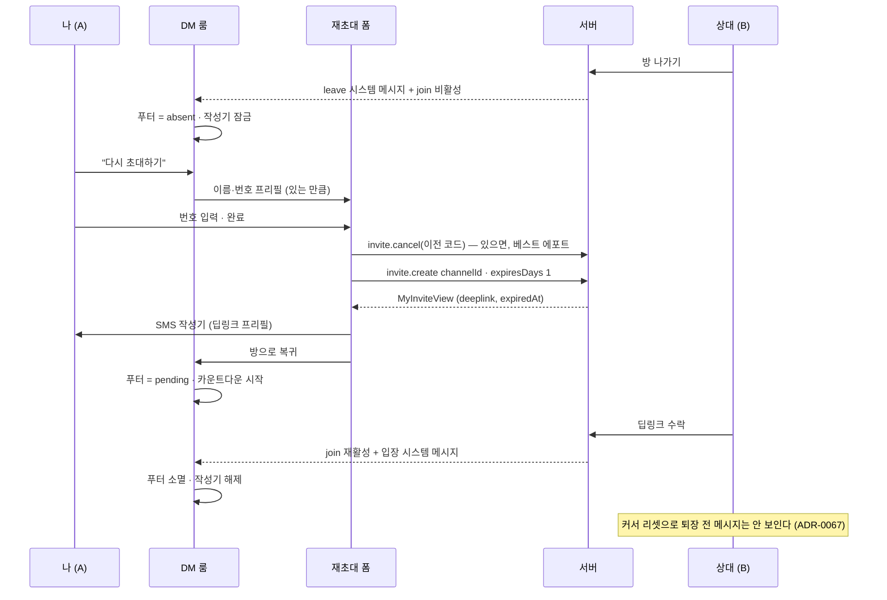
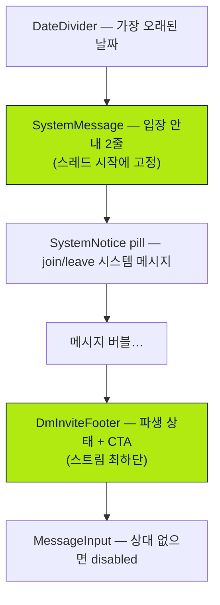

# 1:1 채팅 (DM Chat)

> 상태: Live · 최종 갱신: 2026-08-25 · 관련 ADR: [ADR-0068](../../../../../docs/adr/0068-dm-peer-departure-and-reinvite.md) (상대 부재·재초대) · [ADR-0039](../../../../../docs/adr/0039-dm-display-name-chain-and-invite-profile-release.md) (이름 체인) · [ADR-0032](../../../../../docs/adr/0032-dm-chat-room-screen.md)(Superseded) · 전제: [ADR-0067](../../../../../docs/adr/0067-rejoin-hides-prior-messages.md) (재입장 표시 게이트)

## 목적

`stereo === 'dm'`인 1:1 채팅 채널 유형을 web에서 일관되게 다룬다. 룸([[chat-room-ui]])·
설정([[channel-settings-ui]])의 dm 분기를 채워, 헤더·본문·읽음 표시·설정 화면을 1:1 맥락에 맞게
통일한다. 프레젠테이션은 기존 방침대로 `@chatic/web-ui-kit`에 위임한다([[self-chat]] 계승).

그룹방과 달리 **DM에는 방 이름이라는 것이 없다** — 방은 곧 상대 한 사람이다. 그래서 이 문서가
답하는 질문은 둘이다.

**1. "이 방을 무엇이라고 부를 것인가, 그리고 그 답을 모든 화면이 똑같이 내놓게 할 것인가."**

DM 이름을 만드는 화면이 넷(방 헤더 · 방 설정 · 홈 목록 · 채팅방 관리 목록)인데 각자 다르게
계산해서, **같은 방이 홈에서는 "이름 없는 채널", 열면 상대 이름으로 바뀌는** 상태였다(ADR-0039).

**2. "그 한 사람이 방을 나가면, 이 방은 무엇인가."**

방이 곧 상대인데 그 상대가 없어지면 방은 정체를 잃는다. 상대가 나간 DM은 이력만 남은 막다른
길이었다 — 화면은 아무 말도 하지 않고, 아무도 받지 않는 메시지를 계속 보낼 수 있고, 다시 부를
방법이 없었다. 이 문서의 후반부(§상대 부재와 재초대)가 그 공백을 담당한다(ADR-0068).

## 설계 원칙

- **dm 판별은 `stereo === 'dm'` 단일 기준.** 멤버 수 기반 판별을 쓰지 않는다. self 판별과 같은
  방식이다.
- **이름 계산은 순수 함수 하나에만 둔다.** 네 화면이 각자 삼항 연산자를 쓰는 대신
  `resolveDmTitle` 하나를 부른다. 화면마다 폴백 단계가 하나씩 다른 것이 애초의 어긋남이었다 —
  버그가 아니라 구조의 결과였다. peer를 고르는 규칙도 같은 이유로 `pickDmPeerId` 하나다.
- **모든 화면이 같은 입력을 낼 수 있어야 한다.** 체인에 들어가는 값은 **네 화면이 전부 싸게
  구할 수 있는 것만** 쓴다. 한 화면만 가진 값(예: 채널별 user 캐시)을 넣으면 그 화면만 다른
  답을 내고 원점으로 돌아간다. 이 원칙이 `user.nick`/`user.name` 폴백을 DM 표시명에서 뺀
  이유다.
- **join 값은 join 캐시에서 읽는다.** `channel.$join`은 projection이라 join 캐시보다 늦다. 이름
  변경이 즉시 반영되어야 하는 화면은 `useChannelJoins`의 `myJoin`을 쓴다.
- **DM에서 `channel.name`은 최후 수단이지 근거가 아니다.** 그룹방 이름은 소유자가 정한 것이지만
  DM의 `channel.name`은 서버가 만든 값이라 사람이 붙인 이름보다 신뢰도가 낮다.
- **읽히지 않는 이름은 이름이 아니다.** 전화번호 유저의 `***1234`류 표시명(ADR-0033 D10)을 DM
  제목이나 안내 문구에 넣지 않는다. 이름이 없으면 이름이 없다고 말한다.
- **화면은 "친구 이름", 자료는 "채널 별명"이다.** `join.nick`은 **"내가 이 방에 붙인 이름"**이고
  사람에 붙는 값이 아니다(ADR-0039 맥락 1). 1:1에서는 방이 곧 그 사람이라 두 뜻이 겹쳐 보이지만
  **겹쳐 보이는 것이지 같은 것이 아니다** — 같은 필드를 `resolveChannelTitle`이 self·dm·
  group-member 세 경우에 똑같이 쓰고(그룹 멤버에게는 문자 그대로 "방 이름"), `resolveDmTitle`의
  폴백이 `channel.name`으로 떨어지는 것이 그 증거다. 화면 카피는 "친구 이름"으로 가되 이 값을
  **사람 단위 별칭으로 확장 해석하지 않는다**(ADR-0068 결정 8).
- **읽음 표시(ReadReceipt)는 dm에서 카톡식 '1' 뱃지로 노출한다.** `showReadReceipt` 파생
  (`!isSelfChat && activeCount >= 2`)은 dm에서 이미 참이므로 그대로 재사용하고 표시 모드만 분기.
- **DM은 나가기만 있고 삭제가 없다.** 소유권 분기(`isOwner ? 삭제 : 나가기`)를 DM에서는 쓰지
  않는다. 재초대로 방이 지속해야 하는데 초대자가 방을 지울 수 있으면 재초대할 방이 사라진다
  (ADR-0068 결정 7이 ADR-0032의 소유권 재사용 방침을 DM에서 철회).
- **DM 전용 컴포넌트를 새로 만들지 않는다 — 단, 새 표면은 예외다.** 헤더는 `ChatRoomHeader`의
  `kind='direct'`, 읽음은 `ReadReceipt`의 `mode`, 인트로는 `SystemMessage`, 이름 편집은 self와
  공용 `JoinNickDialog`. 반대로 §상대 부재와 재초대가 만드는 것은 대응물이 없으므로 새로 만든다.
- **stereo로 페이지를 쪼개지 않는다.** `ChannelRoomPage`에서 stereo에 걸린 분기는 7개뿐이고 훅
  호출 48개 중 stereo 전용은 `useDmPeer` 하나다. 나머지(스크롤 앵커링·키보드 보정·그룹핑·
  리액션·스레드·읽음 커서·페이지네이션)는 세 stereo가 완전히 동일하다. **분기는 컴포넌트 안으로
  넣고 페이지는 variant/게이트만 넘긴다** — `RoomIntro`가 이미 그 자리를 증명했다.
- **푸시를 전제로 삼지 않는다.** 정확성의 기준은 "실시간 통보"가 아니라 **"방을 열면 그 순간
  정확하다"**다. 상대 유무는 소켓 sync가, 초대 상태는 포커스 refetch + 조건부 폴링이 맞춘다
  (ADR-0068 결정 10).
- **초대 링크의 기간을 카피에 하드코딩하지 않는다.** 유효시간은 서버 `expiredAt`에서만 파생한다.
  사실상 24시간이지만(`expiresDays: 1`) 그 숫자는 문구에 들어가지 않는다.

## 범위

**포함 — 이름과 표시 (ADR-0039)**

1. **dm 판별 파생** — 룸/설정/목록에서 `isDmChat = channel.stereo === 'dm'`.
2. **표시 이름 체인** — 내 `join.nick` → 상대 `profile.nick` → `channel.name` → 공통 라벨.
   네 화면이 `resolveDmTitle` 하나를 공유한다.
3. **상대(peer) 파생** — 룸은 `useDmPeer`, 목록은 배치 훅 `useDmPeers`.
4. **dm 룸 헤더** — `kind='direct'`, 제목=체인, 아바타=상대 thumbnail(없으면 direct 글리프).
   그룹 참여자 스택(meta)은 미노출.
5. **본문 최상단 입장 안내 블록** — `SystemMessage` 2줄. 스트림의 join 시스템 메시지(pill)와
   **병존**한다.
6. **dm 읽음 '1' 뱃지** — `ReadReceipt`의 `mode='dm'`.
7. **dm 설정 화면** — 친구 이름(내 `join.nick`) 편집, "친구 추가" 숨김, 멤버 "내보내기(kick)"
   비활성. 알림 토글·멤버 목록 유지.
8. **홈 / 채팅방 관리 목록의 dm 행** — 제목=체인, 아바타=상대 thumbnail, 인원수 pill 숨김.

**포함 — 상대 부재와 재초대 (ADR-0068)**

9. **상대 부재 파생** — `hasLeftChannel(peerJoin)`로 상대가 방을 떠났는지 판정.
10. **초대 상태 푸터** — 스트림 하단의 클라이언트 파생 블록: 퇴장 보조 문구 · 초대 완료/거절/
    만료 문구 · `expiredAt` 실시간 카운트다운 · 다시 초대하기 CTA. 서버 `subType` 신설 없음.
11. **입력창 잠금** — 상대가 없으면 작성기 비활성, 재입장하면 복구.
12. **방에서 진입하는 재초대** — `invite.create({ channelId, phone, name, expiresDays: 1 })`로
    **같은 방에 다시 들여보낸다.** CTA는 확인 단계 없이 번호 입력 폼으로 직행한다.
13. **나간 멤버 표시** — 방 설정의 "방 친구"에 나간 상대를 "대화방 나감" 보조 문구로 남긴다
    (**DM 한정**).
14. **DM 나가기 통일** — owner도 삭제가 아니라 나가기. 확인 다이얼로그 한 장.

**제외**

- **dm 채널 생성 경로** — 신규 1:1 발급은 [[relay-invite-sender]] 소관이다. 이 문서는 이미 있는
  dm 채널을 읽고, **기존 방으로의 재초대**만 다룬다.
- **제3자를 기존 DM 방에 초대하는 경로** — 재초대는 같은 상대를 전제한다.
- **재초대 확인 화면**(Figma 4059-13443 · 4068-15399) — 통과할 화면을 하나로 줄였다.
- **"연락처 변경" 화면**(Figma 4142-24843) — 유일한 진입점이 위 확인 화면이었다. 번호 편집은
  재초대 폼 자체에서 한다.
- **`userId` 기반 재초대** — 번호를 묻지 않는 경로. 백엔드 API 요청 후속(ADR-0068 §후속).
- **수락·거절의 초대자 푸시 알림** — 백엔드 미구현. 조건부 폴링이 흡수한다.
- **그룹 방의 퇴장자 표시** — 현행(숨김) 유지.
- **퇴장 시스템 메시지의 그룹 스타일 변경** — DM 푸터의 적색 문구는 DM 한정.
- **초대 시 입력한 친구 이름 → `join.nick` 자동 반영** — 별도 작업(ADR-0039가 남긴 항목).
- self/group 룸·설정 레이아웃 변경([[chat-room-ui]]·[[channel-settings-ui]] 유지).
- `apps/desktop-web` · `apps/testbed`.

## 시나리오

### S1. 초대자가 방을 만들고 상대를 기다린다 (프로필 없는 상대)

1. 연락처로 1:1 초대를 보낸다 → 서버가 DM 채널을 만든다.
2. 홈 목록에 dm 행이 생긴다. 상대는 아직 수락하지 않았고 프로필도 없다 → 체인이
   `join.nick`(없음) → 상대 `profile.nick`(없음) → `channel.name`으로 내려가고, 그것도 비면
   공통 라벨(`chat.dm.unnamedPeer`, "대화 상대")이 뜬다.
3. 방을 열면 헤더가 **홈과 똑같은 문자열**을 보여준다. 아바타는 1인 글리프.
4. 본문에는 아직 입장 안내의 이름이 없어 이름 없는 변형이 뜬다.

### S2. 상대가 수락하고 프로필을 만든다

1. 상대 join이 활성(`joined = 1`)이 되어 `activeMemberIds`에 들어가고 프로필 동기화 대상이 된다.
2. 상대가 나중에 플레이스 설정에서 프로필(닉·사진)을 만든다.
3. 프로필이 캐시에 도착하면 **네 화면이 함께** 상대 닉으로 바뀐다. 홈 행 아바타도 상대 사진으로.
4. 본문 최상단에 `<상대 닉>님이 채팅방에 입장했습니다.` / `1:1 대화를 시작해 보세요.`가 뜬다.
   스트림 안의 join 시스템 메시지(가운데 pill)도 그대로 뜬다 — **같은 문장이 두 모양으로 보이는
   것은 의도된 것이다**(ADR-0039 결정 3).

### S3. 내가 이 방에 이름을 붙인다

1. 방 → ⋯ → 방 설정 → 첫 행 탭 → 친구 정보 시트.
2. 이름 입력(최대 20자). placeholder는 지금 보이는 이름(상대 닉 → `channel.name` → 공통 라벨).
   시트는 "설정한 친구 이름은 나에게만 표시됩니다"라고 말한다.
3. 저장하면 `join.update`로 **내 `join.nick`만** 기록된다. 상대에게는 보이지 않는다.
4. 네 화면 모두 즉시 반영된다. 이후 상대가 프로필 이름을 바꿔도 **내가 붙인 이름이 계속 이긴다.**
5. 값을 비우면 `join.nick`이 지워지고 체인이 다시 상대 프로필로 내려간다.

> 화면은 "친구 이름"이라고 부르지만 저장되는 것은 **이 채널의 별명**이다(§설계 원칙). 같은
> 상대와 방이 둘이면 방마다 다른 값이 남는다.

### S4. 메시지 송수신과 읽음

내 말풍선은 오른쪽, 상대는 왼쪽(그룹과 동일한 버블/그룹핑). 내가 보낸 메시지를 상대가 아직 안
읽었으면 시간 옆에 `1`, 읽으면 사라진다. 상대 메시지는 내가 룸에 들어와 읽음 처리되어 뱃지가
뜨지 않는다.

### S5. 안내 블록은 메시지가 쌓인 뒤에도 맨 위에 남는다

빈 상태 전용이 아니다. **스레드의 진짜 시작**(가장 오래된 날짜 그룹이면서 더 불러올 과거가
없을 때)의 날짜 구분선 바로 아래에 고정되어, 스크롤을 끝까지 올리면
`[날짜][입장 안내][첫 메시지]` 순서로 읽힌다. self-chat 인트로와 같은 자리다.

수직 정렬은 그룹방과 같다 — 메시지가 없으면 화면 위, 하나라도 있으면 아래(최신이 바닥)에
붙는다. self-chat만 `flex-1` 스페이서로 항상 위에 고정한다.

### S6. 설정 진입과 나가기

상단 이름 행(상대 아바타 + 체인 제목 + `>`, 탭하면 친구 정보 시트) + 대화방 알림 토글 +
"방 친구"(나 + 상대, 나간 상대는 "대화방 나감") + **"방 나가기"**. "친구 추가" 행은 없고, 멤버
내보내기도 없다. **owner든 member든 나가기 하나다** — DM에는 방 삭제가 없다.

### S7. 상대가 방을 나간다

1. 상대가 방을 나가면 서버가 `leave` 시스템 메시지를 남기고 상대 join이 비활성이 된다.
2. 내가 방에 있으면 `JoinSyncPlan`·`ChatSyncPlan`으로 즉시 반영된다. 밖에 있었으면 다음 진입에
   맞춰진다.
3. 스트림에 퇴장 시스템 메시지가 남고, 그 아래 **초대 상태 푸터**가 붙는다:
   `다시 대화하려면 초대해 주세요.` + `다시 초대하기` CTA.
4. **작성기가 잠긴다.** 받을 사람이 없는 메시지를 보내 읽음 뱃지 `1`이 영구히 남는 상태를 만들지
   않는다.
5. 방 설정의 "방 친구"에서 상대 행은 사라지지 않고 "대화방 나감"이 붙는다.

### S8. 다시 초대한다

1. 푸터의 `다시 초대하기` 탭 → **번호 입력 폼으로 직행**한다(확인 단계 없음). 이름은 지난
   초대/퇴장자 이름으로 프리필되고, 번호는 이 기기 발급 이력에 있으면 프리필되고 없으면 빈 칸이다.
   **어느 쪽이든 같은 화면이다.**
2. `완료` → 이전 초대가 남아 있으면 먼저 거두고(`invite.cancel`, 베스트 에포트)
   `invite.create({ channelId, phone, name, expiresDays: 1 })`로 새 코드를 발급한다.
3. SMS 작성기가 딥링크를 담고 열린다(비네이티브는 클립보드 복사 폴백).
4. 방으로 돌아온다. 푸터가 `친구 초대가 완료되었습니다.` + `초대 링크 유효시간 HH:mm:ss 남음`
   으로 바뀌고 **CTA는 사라진다** — 살아 있는 초대가 하나 있는 동안 또 발급할 이유가 없다.
5. 카운트다운은 초 단위로 흐른다. 작성기는 여전히 잠겨 있다(상대는 아직 없다).

> "친구 초대가 완료되었습니다"는 **발송 완료**를 뜻한다. 수락이 아니다 — 수락은 뒤따르는 입장
> 시스템 메시지가 말한다.

### S9. 상대가 수락하고 돌아온다

1. 상대가 딥링크로 초대를 수락한다. 서버가 그 채널의 join을 재활성하고 커서를 리셋한다.
2. 상대 화면은 **처음 들어온 것과 같다** — 퇴장 전 메시지가 보이지 않는다(ADR-0067). 내 화면은
   내가 나간 적이 없으므로 이력이 그대로다.
3. 내 화면: `입장했습니다` 시스템 메시지가 도착하고, 상대가 다시 있으므로 **푸터가 사라지고
   작성기가 풀린다.**
4. 방 설정의 상대 행에서 "대화방 나감"이 걷힌다.

### S10. 상대가 거절한다

1. 상대가 초대를 거절하면 서버 `state`가 `rejected`가 된다. 알림 패킷은 없다.
2. 내가 방을 보고 있으면 조건부 폴링이, 밖에 있었으면 진입/포커스 refetch가 이 상태를 가져온다.
3. 푸터가 `친구 초대가 거절되었습니다.` + `다시 초대를 보낼 수 있어요.`로 바뀌고 **CTA가 다시
   나타난다.**

### S11. 초대 링크가 만료된다

1. 24시간이 지나면 카운트다운이 `00:00:00`에 닿는다. **서버 응답을 기다리지 않는다** — 클라가
   `expiredAt`으로 판정한다.
2. 푸터가 `초대 링크가 만료되었습니다.` + `초대 링크를 다시 전송해 보세요.`로 바뀌고, 남은 시간
   줄이 적색 `00:00:00`이 되고 **CTA가 다시 나타난다.**
3. CTA를 누르면 S8과 같은 경로다. 죽은 코드를 먼저 거두고 새로 발급한다.

## 다이어그램

### 채널 유형 → 룸/설정 분기



### 표시 이름 체인 — 네 화면이 같은 함수를 부른다



`user.nick`/`user.name`이 체인에 없는 것이 핵심이다. 그 값은 채널당 `syncChannelUsers` 네트워크
호출로만 채워져서 목록 화면이 싸게 가질 수 없다 — 넣으면 방만 다른 답을 낸다.

### 상대(peer) 파생 — 방과 목록의 두 경로



목록은 `useChannelMembers`를 쓰지 않는다(채널당 네트워크 호출). `channel.memberIds`에서 peer를
뽑고, 프로필은 **목록 단위 1회** 구독으로 끝낸다.

### 초대 상태 푸터 — 상태 기계



CTA가 `pending`에만 없는 것은 Figma가 그렇게 그려져 있고(4062-14154에는 버튼이 없다), **살아
있는 코드가 하나 있는 동안 두 번째 코드를 만들지 않는다**는 기존 규칙과도 맞는다.

### 재초대 시퀀스



### 본문 구조 — 위와 아래



## 상세 구현

### 이름·peer 해석 (순수)

- **[dmTitle.ts](../../../src/app/features/channels/utils/dmTitle.ts)** —
  `resolveDmTitle({ joinNick, peerNick, channelName, unnamedLabel, selfUserId })`.
  [selfChatTitle.ts](../../../src/app/features/channels/utils/selfChatTitle.ts)와 같은 자리·같은
  성격(순수 + 코로케이션 테스트). 각 단계는 `?.trim() || 다음`으로 내려간다.
- **[nick.ts](../../../src/app/features/channels/utils/nick.ts)** — `isRawIdNick` /
  `customJoinNick`. `join.nick`을 최우선으로 읽는 체인의 함정을 막는다: **서버가 join의 `nick`을
  raw user id로 시딩하는 흐름이 있다**(이름 없는 self-chat이 확인된 사례). 두 제목 체인이
  trim·가드 인자 순서에서 갈라지지 않도록 `customJoinNick`을 공유한다.
- **[dmPeer.ts](../../../src/app/features/channels/utils/dmPeer.ts)** — `pickDmPeerId`. roster에서
  나를 제외한 멤버. **내 id를 모르면 `undefined`를 반환한다** — 가드가 없으면 `id !== userId`가
  공허하게 참이 되어 roster 첫 항목(보통 owner인 나)이 "상대"로 뽑히고, 내 이름과 아바타가 내
  대화 상대로 렌더된다.
- **[membership.ts](../../../src/app/features/channels/utils/membership.ts)** — `hasLeftChannel`.
  `join.joined === 0 && (joinedNo || reason)`. `joined`만으로는 "초대됐지만 미입장"과 "나감"이
  구별되지 않아서 `joinedNo`(입장한 chat 번호)가 판별자다. 같은 필드가 재입장 후 피드를 창내는
  기준이기도 하므로(ADR-0067) 두 읽기가 어긋나지 않는다.
- **[dmInviteState.ts](../../../src/app/features/channels/utils/dmInviteState.ts)** _(신규)_ —
  `resolveDmInviteState({ peerLeft, invite, isExpired })` → 판별 유니온
  (`present | absent | pending | rejected | expired`). 순수 함수로 두는 이유는 위 상태 기계 전체가
  React 없이 테스트되게 하려는 것이다. `state === 'pending'`인데 `isExpired`면 **expired로
  내린다** — 서버 `state`는 폴링 전까지 `pending`이라 카운트다운이 0에 닿는 순간을 클라가 판정해야
  한다. `canceled`/`accepted`는 `absent`와 같이 취급한다(전자는 목록 필터가 거르고, 후자는 join
  sync가 곧 `present`로 바꾼다).

### 훅

- **[useDmPeer.ts](../../../src/app/features/channels/hooks/useDmPeer.ts)** —
  `(channel, members, profileMap, userId) → { id, profileNick?, thumbnail? } | null`.
  `profileNick`은 **프로필만**이고 member 캐시 폴백이 없다(설계 원칙 3). `thumbnail`은 폴백을
  유지한다 — 전역 아바타는 목록에서도 문제되지 않고, 있으면 보여주는 게 낫다.
- **[useDmPeers.ts](../../../src/app/features/channels/hooks/useDmPeers.ts)** (목록용 배치) —
  `(sid, channels, userId) → Map<channelId, DmPeer>`. dm만 골라 peer id를 모으고 **중복 제거 후
  정렬**해 `useChannelProfiles`에 한 번 넘긴다. 정렬이 필요한 이유: 그 훅이 등록 이펙트를
  `ids.join(',')`로 키잉하는데 목록 순서는 최근활동순이라, 정렬하지 않으면 메시지 하나가 도착할
  때마다 모든 프로필 타깃이 해제·재등록된다. 폴링은 `LIST_PROFILE_SYNC_INTERVAL_MS`(60s).
- **[useDmInviteState.ts](../../../src/app/features/channels/hooks/useDmInviteState.ts)** — 순수
  파생에 데이터를 물린다. 방과 설정 화면이 같은 훅을 부르므로 푸터가 말하는 것과 친구 정보 시트가
  말하는 것이 어긋날 수 없다.
    1. 상대 join을 `joins`에서 골라 `hasLeftChannel`로 `peerLeft` 판정.
    2. `useRelayInvites`에서 **이 채널을 향하는 최신 초대**를 고른다 — `channelId` 일치 + 로컬
       dismiss(`dismissedAt`) 제외, 목록이 최신순이므로 첫 매치. 소진된 초대(`accepted`)도 이 방을
       계속 가리키므로 걸러지지 않고 파생 함수가 `absent`로 처리한다.
    3. `useInviteCountdown(invite?.expiredAt)`로 카운트다운과 `isExpired`를 얻는다.
    4. `resolveDmInviteState`에 넘긴다.
    5. `resolveReinvitePrefill()` — 이 채널을 가리키는 **모든** 초대를 발급 이력
       (`useSentInviteLog`)에 역조회해 첫 히트의 이름·번호를 돌려준다. 진행 중인 초대가 없는 방이
       보통이고, 그때도 이 방을 만든 `accepted` 초대에서 번호를 되찾을 수 있어야 한다.
       **값이 아니라 함수다** — 답이 필요한 시점은 CTA를 누른 그 순간뿐인데, 이 훅은 메시지가 올
       때마다·스크롤할 때마다 다시 렌더되는 화면에 산다.

    **폴링은 `peerLeft`를 기준으로 켠다** — "초대가 pending일 때만"이 아니다. pending 판정은 이 훅의
    출력이고 그것을 입력(폴링 옵션)으로 되돌리면 렌더 루프가 된다. `peerLeft`는 join 행에서 독립적으로
    정해진다. 넓어진 경우(상대 없고 초대도 없음)는 사용자가 어차피 보고 있는 화면이고, 다른 기기에서
    발급된 초대를 잡아 주는 이득도 있다.

    초대 읽기 자체는 **`peerLeft`가 아니면 세워 둔다**(`enabled: false`). 이 훅은 모든 stereo가
    공유하는 `ChannelRoomPage`에 살기 때문에, 그러지 않으면 그룹방을 열 때마다 `invite.list`가 나간다.
    그래서 [useRelayInvites.ts](../../../src/app/hooks/useRelayInvites.ts)에 `enabled` 옵션을 새로
    열었다(캐시 관측·서버 읽기 둘 다 끈다). `refetchOnWindowFocus: true`와
    `refetchIntervalInBackground: false`는 그 훅이 이미 갖고 있어 새 루프는 만들지 않았다.

### 소비 화면

- **[ChannelRoomPage.tsx](../../../src/app/features/channels/pages/ChannelRoomPage.tsx)** —
  `isDmChat` 파생, `kind='direct'`, 제목은 `resolveDmTitle`. `joinNick`은 `useChannelJoins`의
  `myJoin?.nick`(projection인 `channel.$join`이 아니다). 인트로 `roomIntro`는 빈 상태 분기와
  `isThreadStart && roomIntro` 두 곳에서 렌더된다. `isThreadStart`는
  `가장 오래된 로드 그룹 && !hasMore` — `!hasMore`가 없으면 페이지네이션 중인 방에서 인트로가
  히스토리 중간에 뜨고 `loadMore`마다 옮겨다닌다.

    이 페이지가 이 기능에 대해 아는 것은 **다섯 지점**뿐이다(§설계 원칙 "stereo로 페이지를 쪼개지
    않는다"):
    1. `useDmInviteState` 호출 — dm이 아니면 `present`를 돌려주고 아무것도 조회하지 않는다.
    2. `<DmInviteFooter>` 마운트 — **두 곳**이다. 라이브 목록에서는 컨테이너가 `flex-col-reverse`라
       **`flex-1` 스페이서 바로 다음(두 번째 DOM 자식)** 이 "최신 메시지 아래"에 해당하고, 별도 트리인
       `isChatEmpty` 분기에도 따로 넣어야 한다 — 한 마디도 나누기 전에 상대가 떠난 방은 실제로 있다.
    3. `MessageInput`에 `disabled` 전달.
    4. `useChannelMembers`에 `keepLeftMembers` 전달 — 이게 없으면 상대가 나간 순간 `useDmPeer`가
       `null`이 되어 헤더 이름과 푸터가 함께 사라진다.
    5. `useChannelProfiles`의 타깃에 **DM peer를 더한다.** `activeMemberIds`는 나간 상대를 뺀다.
       `profileMap`은 사이트 전체 캐시라 한 번 본 상대는 계속 이름이 나오지만, 콜드 캐시에서는 아무도
       그를 받아오지 않아 헤더가 "대화 상대"로 떨어진다 — 그런데 방 설정 화면은 (멤버 목록이 나간
       상대를 남기므로) 그를 등록해 실제 이름을 보여준다. **두 화면이 다른 답을 내는 것**이 ADR-0039가
       막으려던 바로 그 상황이다. peer id는 `useDmPeer`가 아니라 roster에서 `pickDmPeerId`로 직접
       뽑는다 — 그 훅은 `profileMap`을 먹으므로 여기서 읽으면 순환이다.

- **[DmInviteFooter.tsx](../../../src/app/features/channels/components/DmInviteFooter.tsx)** —
  파생 상태 하나를 받아 문구·카운트다운·CTA를 그린다. 상태 판정은 하지 않는다(순수 함수 소관).
  CTA 버튼 스타일은 [RoomIntro.tsx](../../../src/app/features/channels/components/RoomIntro.tsx)의
  그룹 초대 버튼과 같다(`h-[50px] rounded-full border` + chevron). 남은 시간은 `HH:mm:ss` 한
  포맷으로만 그린다 — 링크가 24시간이라 `days`가 늘 0이기 때문이고, 그래도 더 긴 링크가 오면
  일수를 시간으로 접어(`73:02:03`) `00:00:00`으로 뭉개지지 않게 한다.
- **[ChannelSettingsPage.tsx](../../../src/app/features/channels/pages/ChannelSettingsPage.tsx)** —
  같은 체인(`joinNick`은 `myJoin`). `useDmPeer`/`useChannelTitle`/`useDmInviteState`는 `isError`
  early return **위에서** 호출한다(Rules of Hooks). 이름 행은 dm에서도 `>` + `onClick`으로
  `JoinNickDialog`를 연다. "친구 추가"는 `isOwner && !isDmChat`, `MemberProfileDialog`의 `canKick`도
  `!isDmChat`. 파괴적 행은 **dm이면 항상 `leave`**이고 확인 다이얼로그도 dm 카피로 갈린다.
  재초대 CTA는 방의 푸터와 **같은 게이트 둘**을 쓴다 — `!isGuest`(발급은 메인유저만)와
  `canReinviteDm(state)`(상대가 있거나 살아 있는 코드가 있으면 내밀 것이 없다). 후자가 없으면
  건강한 1:1의 친구 정보 시트에도 "다시 초대하기"가 떠서, 누르면 이미 방에 있는 사람에게 코드를
  하나 더 발급한다.
- **[useChannelMembers.ts](../../../src/app/features/channels/hooks/useChannelMembers.ts)** —
  `keepLeftMembers` 옵션. 참이면 `hasLeftChannel` 필터를 건너뛴다. **방과 설정 둘 다** dm에서 켠다.
  그룹은 현행(제외) 유지 — 퇴장자에게 "초대 대기" 뱃지가 붙던 문제를 되살리지 않도록, 이 행이
  말하는 것은 **"나감"이며 초대 상태가 아니다**. 별도 플래그를 싣지 않는다: `ChannelMember`가 이미
  `$join`을 들고 있어 소비처가 `hasLeftChannel`을 직접 부른다.
- **[MemberListItem.tsx](../../../src/app/features/channels/components/MemberListItem.tsx)** —
  `hasLeft` prop → `ListRow`의 `subtitle`로 "대화방 나감". 아바타 흐림은 pending 초대와 같은
  처리를 공유한다("지금 여기 없다"는 같은 뜻).
- **[resolveChannelTitle.ts](../../../src/app/features/channels/lib/resolveChannelTitle.ts)** —
  `'dm'` 분기가 owner/member 분기 **이전에** 가로챈다. 그 분기는 DM에 대해 틀리다: 초대자가
  owner라서 서버가 만든 `channel.name`이 이기고 내 이름과 상대 프로필이 모두 무시된다 — 홈과
  방이 어긋난 원인이 정확히 그것이었다. `dmUnnamedLabel`은 **필수**로 두었다.
  진입점은 [useChannelTitle.ts](../../../src/app/features/channels/hooks/useChannelTitle.ts)이고,
  목록 행은 `useMyProfile` 왕복을 피하려고 순수 함수를 직접 부른다.
- **[ChannelList.tsx](../../../src/app/features/home/components/ChannelList.tsx)** — 목록 레벨에서
  `useDmPeers` 1회. dm 아바타는 상대 thumbnail, 인원수 pill은 dm에서 숨김. `sid`는 **필수 prop**.
- **[PlaceChannelManagePage.tsx](../../../src/app/features/place/pages/PlaceChannelManagePage.tsx)** —
  같은 배선. `resolveChannelTitle`을 공유하므로 이 화면을 빼면 다시 어긋난다.

### 재초대 경로

- **[ContactInvitePage.tsx](../../../src/app/features/invite/pages/ContactInvitePage.tsx)** — 방에서
  오는 진입을 **route state로 받는 재초대 모드**로 흡수한다(`{ channelId, name, phone }`).
  새 페이지를 만들지 않는 이유: 이 363줄이 게스트 게이트·프로필 전제조건·국가코드 번호 검증·SMS
  핸드오프·403 복구를 이미 담고 있고, 재초대에도 전부 필요하다. 모드가 바꾸는 것은 넷이다.
    1. 이름·번호 초기값을 route state로 시딩.
    2. `createInvite`에 `channelId`와 `expiresDays: 1`을 함께 싣는다.
    3. 성공 후 대기 화면이 아니라 **방으로 복귀**한다.
    4. 로컬 발급 이력 기반 같은-번호 다이얼로그(`ReinviteDialog`)를 타지 않는다 — 재초대는 이미
       "다시 보낸다"는 의사 표시이고, 푸터가 현재 상태를 이미 말해 준다. 대신 **이 채널의** 이전
       초대를 먼저 거두고 발급한다(ADR-0043 결정 5의 retire-후-create와 같은 규칙). `retire`가 409를
       주면(그 사이 상대가 수락) 발급하지 않고 방으로 보낸다.

    번호를 모르면 빈 칸으로 시작한다 — 막지 않는다. `reissueMissingLog`("이 기기에 남은 정보가 없어
    다시 초대할 수 없어요")는 **그대로 둔다**: 그 문구는 이 폼이 아니라
    [InviteWaitingPage](../../../src/app/features/invite/pages/InviteWaitingPage.tsx)의 재발급 경로에
    있고, 그 화면에는 번호를 물어볼 폼이 없어 유일한 가드다(ADR-0068 결정 3 구현 중 정정).

- **[useRelayInvites.ts](../../../src/app/hooks/useRelayInvites.ts)** — `RelayInviteCreateInput`에
  `channelId?`·`expiresDays?`를 열고(서버 계약에는 이미 있다 — `InviteCreateRequestData`),
  `expiresDays: 1`을 **뮤테이션에서 한 번 기본값으로** 얹는다. 호출부마다 적으면 빠뜨린 곳이 조용히
  서버 기본값(3일)으로 늘어난다. `enabled` 옵션도 여기서 새로 열었다(§훅).

### 컴포넌트

- **[SystemMessage.tsx](../../../../../libs/web-ui-kit/src/composites/chat/SystemMessage.tsx)** —
  Figma `3086:14439` 기준. self-chat 인트로와 dm 입장 안내가 공유한다.
- **[SystemNotice.tsx](../../../../../libs/web-ui-kit/src/composites/chat/SystemNotice.tsx)** —
  스트림 안의 join/leave 안내. `tone?: 'default' | 'alert'`가 새로 붙었다: `alert`는 틴트를 버리고
  글자를 적색으로 돌린다. 방 페이지가 **dm이고 `subType === 'leave'`일 때만** 그 톤을 넘긴다
  (Figma 4041-33606). 그룹은 모든 안내가 그대로 pill이다. `ReadReceipt.mode`와 같은 방식 —
  새 컴포넌트를 만들지 않고 기존 프리미티브에 모드를 하나 더한다.
- **[ReadReceipt.tsx](../../../../../libs/web-ui-kit/src/composites/chat/ReadReceipt.tsx)** —
  `mode?: 'count' | 'dm'`. `'dm'`이면 `unreadCount > 0`일 때 숫자만 accent로, 0이면 `null`.
- **[MessageInput.tsx](../../../../../libs/web-ui-kit/src/foundations/input/MessageInput.tsx)** —
  `disabled`가 **이미 있다.** textarea·전송 버튼을 함께 잠그고, idle(`aria-disabled`)과 전체 잠금
  (`disabled` 속성)을 구분해 둔 상태다. kit 변경 없이 prop 하나로 끝난다.
- **[JoinNickDialog.tsx](../../../src/app/features/channels/components/JoinNickDialog.tsx)** —
  self/dm 공용. `variant`가 카피 네임스페이스(`selfChat.name.*` / `dmChat.name.*`)를 고르고
  `fallbackName`이 placeholder를 정한다. `join.update`로 내 `join.nick`을 쓰며,
  `UpdateChannelDialog`(모두가 보는 `channel.name`)와 다르다. **인스턴스는 하나만 마운트한다.**
  dm variant는 Figma 친구 정보 시트다(4052-12782): "나에게만 표시됩니다" 안내 + 큰 아바타 +
  "대화방 나감" + 이름 입력 + 재초대 CTA. **저장 버튼은 남겼다** — Figma 프레임에는 재초대 CTA만
  있고 저장 수단이 보이지 않는데, 그것을 그대로 따르면 이름을 기록할 방법이 사라진다(§참고).
  **파일명은 유지한다** — 쓰는 자료(`join.nick`)를 정확히 가리킨다.

### i18n

`chat.dm.*`(`unnamedPeer`, `intro.title`, `intro.titleUnnamed`, `intro.description`)과
`dmChat.name.*`(`selfChat.name.*`와 키 대응). `intro.title`의 `{{name}}`은 **상대 `profile.nick`
만** 넣는다 — 이 문장은 "누가 입장했다"는 사실 서술이라 내가 붙인 별칭이 들어가면 어색하다.

이번 개정이 더하는 키는 `chat.dm.footer.*`(퇴장 안내 · 초대 완료 · 거절 2줄 · 만료 2줄 · CTA
라벨)다. 유효시간 줄은 **기존 키를 재사용한다** — `inviteAccept.expiry.label`("초대 링크 유효시간")

- `inviteAccept.expiry.remaining`("{{time}} 남음")이 Figma 카피와 글자까지 같다.

읽음 카운트 의미는 [useJoinPositions.ts](../../../src/app/features/channels/hooks/useJoinPositions.ts)
그대로 — sender는 unread에 안 잡히므로 dm의 `unreadCount`는 "상대가 안 읽음"과 1:1로 대응한다.

## 검증 방법

```bash
npx jest --config apps/web/jest.config.js --runInBand --watchman=false
npx jest --config libs/web-ui-kit/jest.config.js --runInBand --watchman=false
npx tsc -b libs/web-ui-kit/tsconfig.lib.json && npx tsc -p apps/web/tsconfig.app.json --noEmit
```

마지막 줄의 순서가 중요하다. 앱은 kit의 소스가 아니라 **`dist/out-tsc`의 `.d.ts`를 본다**, 그래서
kit에 prop을 하나 추가하면(예: `SystemNotice.tone`) lib을 다시 빌드하기 전까지 앱 타입체크가
"Property does not exist"로 실패한다. 산출물이 더 낡아 가짜 `TS6305`가 쏟아지면
`find dist/out-tsc -name "*.tsbuildinfo" -delete` 후 재빌드.

마지막 실행 결과 (2026-08-25): apps/web **230 suites / 2127 tests**, web-ui-kit
**71 suites / 333 tests**, `apps/web` 타입체크 0건.

| 파일                                                                                                  | 검증 대상                                                                                                                       |
| ----------------------------------------------------------------------------------------------------- | ------------------------------------------------------------------------------------------------------------------------------- |
| [dmTitle.test.ts](../../../src/app/features/channels/utils/dmTitle.test.ts)                           | 체인 4단계, 공백-only 하강, raw-id join nick 무시                                                                               |
| [selfChatTitle.test.ts](../../../src/app/features/channels/utils/selfChatTitle.test.ts)               | `customJoinNick` 공유 후에도 동작 동일                                                                                          |
| [dmInviteState.test.ts](../../../src/app/features/channels/utils/dmInviteState.test.ts)               | 상태 기계 전수 — pending+isExpired→expired, accepted/canceled→absent, CTA 가시성                                                |
| [useDmPeer.test.ts](../../../src/app/features/channels/hooks/useDmPeer.test.ts)                       | `profileNick`이 member 이름으로 폴백하지 **않고** thumbnail은 폴백                                                              |
| [useDmPeers.test.ts](../../../src/app/features/channels/hooks/useDmPeers.test.ts)                     | dm만 선별, 구독 1회·중복 제거·정렬, `userId` 미상 시 빈 Map                                                                     |
| [useDmInviteState.test.ts](../../../src/app/features/channels/hooks/useDmInviteState.test.ts)         | 채널 일치 초대만 선택(최신순 첫 매치·dismiss 제외), `peerLeft`일 때만 조회·폴링, dm 아님 → `present`, 프리필 4경우              |
| [membership.test.ts](../../../src/app/features/channels/utils/membership.test.ts)                     | `hasLeftChannel` — joinedNo/reason 판별, 둘 다 없으면 false                                                                     |
| [useChannelMembers.test.ts](../../../src/app/features/channels/hooks/useChannelMembers.test.ts)       | dm은 나간 멤버를 남기고 그룹은 계속 제외                                                                                        |
| [resolveChannelTitle.test.ts](../../../src/app/features/channels/lib/resolveChannelTitle.test.ts)     | dm 분기 — owner여도 `channel.name`이 못 이김, 최종 라벨이 dm 전용                                                               |
| [ChannelList.test.tsx](../../../src/app/features/home/components/ChannelList.test.tsx)                | dm 행 제목 4단계, 상대 thumbnail, pill 부재                                                                                     |
| [ChannelSettingsPage.test.tsx](../../../src/app/features/channels/pages/ChannelSettingsPage.test.tsx) | dm 제목, 이름 행이 friend 시트를 열고 그룹 다이얼로그는 아님, "친구 추가" 숨김, **dm은 owner도 나가기**, 나간 멤버 행           |
| [JoinNickDialog.test.tsx](../../../src/app/features/channels/components/JoinNickDialog.test.tsx)      | self/dm 카피 분기, dm의 fallbackName placeholder, 같은 `join.update`, CTA 노출                                                  |
| [DmInviteFooter.test.tsx](../../../src/app/features/channels/components/DmInviteFooter.test.tsx)      | 상태별 문구·CTA 유무·카운트다운 색(만료 시 적색)·하루 넘는 링크의 시간 접기                                                     |
| [ContactInvitePage.test.tsx](../../../src/app/features/invite/pages/ContactInvitePage.test.tsx)       | 재초대 모드 — 프리필(있음/없음), `channelId` 전달, 방 복귀, ReinviteDialog 미개입, 이 방의 이전 초대만 retire, 409는 발급 안 함 |
| [useRelayInvites.test.ts](../../../src/app/hooks/useRelayInvites.test.ts)                             | `expiresDays: 1` 기본값·호출부 오버라이드·`channelId` 통과                                                                      |
| [SystemNotice.test.tsx](../../../../../libs/web-ui-kit/src/composites/chat/SystemNotice.test.tsx)     | `alert` 톤이 틴트를 버리고 적색으로 그린다                                                                                      |
| [ReadReceipt.test.tsx](../../../../../libs/web-ui-kit/src/composites/chat/ReadReceipt.test.tsx)       | `dm mode` — unread 1 → accent "1", 0 → 렌더 없음                                                                                |

`ChannelRoomPage`는 테스트 파일이 없다(958줄, 훅 48개). 그래서 이번 개정이 그 파일에 더하는 것을
**세 지점으로 제한**했고(§상세 구현), 로직은 전부 순수 함수와 컴포넌트로 내려 각각 테스트한다.

**수동 확인** — 실제 dm 채널 + 로그인 세션 필요.

1. 프로필 없는 상대와의 dm → **홈 목록 제목과 방 헤더 문자열이 같은지**
2. 상대가 프로필을 만든 뒤 → 네 화면이 함께 바뀌는지
3. 친구 정보 시트에서 이름을 붙임 → 네 화면 즉시 반영, 비우면 상대 닉으로 복귀
4. 메시지 0건 / 여러 날짜 그룹 / **100건 넘어 페이지네이션이 걸린 방**에서 인트로 위치
5. 상대 퇴장 → 푸터 등장 · **작성기 잠김** · 방 설정에 "대화방 나감"
6. 재초대 → 번호 입력 폼 직행(프리필 유/무 모두) → 완료 → SMS 작성기 → 방 복귀 → 카운트다운
7. 카운트다운을 만료까지 방치 → `00:00:00` 적색 · 문구 전환 · **CTA 재등장** (서버 폴링 없이)
8. 상대 재입장 → 푸터 소멸 · 작성기 해제 · 상대에게 퇴장 전 메시지가 **안 보이는지**(ADR-0067)
9. **빈 스트림 + 상대 부재** 조합 — `isChatEmpty` 분기는 별도 트리를 그리므로 푸터가 그 경로에서도
   보이는지
10. dm 설정에서 owner로 들어가도 "방 나가기"인지 / 그룹은 여전히 "채팅방 삭제"인지
11. 홈 dm 행에 인원수 pill이 없고 그룹 행에는 있는지
12. 내 메시지에 상대 미열람 시 `1`, 열람 시 사라지는지

## 참고 (알려진 한계)

- **`channel.name`이 relay dm에 실제로 채워지는지 미확인.** 비어 있으면 체인 3단계가 사실상 죽은
  분기이고, 프로필 없는 상대는 전부 공통 라벨로 보인다(동작은 정상).
- **프로필 없는 상대가 흔하다.** ADR-0039가 초대 수락의 프로필 강제를 없앤 결과다
  ([[relay-invite-accept]]). 사용자가 직접 이름을 붙이는 것(S3)이 현재 유일한 해소 경로다.
- **같은 문장이 한 화면에 두 모양으로 나온다**(가운데 pill + 왼쪽 블록). 의도된 중복이다.
- **수락 전 pending 상대**는 `activeMemberIds`에 없어 프로필이 없을 수 있다. 목록의 `useDmPeers`는
  `joined` 필터 없이 `memberIds`의 peer를 그대로 넘기므로 pending peer에도 동기화 타깃이 등록된다.
- **"친구 이름"이 방마다 다를 수 있다.** 자료가 채널 별명이므로, 같은 상대와 DM 방이 둘 이상이면
  방마다 다른 값이 남는다. 중복 방은 "이미 1:1 대화가 있어요" 사전 감지가 없어서(ADR-0033 D2)
  실제로 생길 수 있다.
- **초대 상태는 `invite.list`의 100건 창에 의존한다.** 오래된 초대가 창 밖으로 밀리면 푸터가
  상태를 모르는 채 CTA만 내민다.
- **앱 밖에서 상대의 재입장을 실시간으로 못 알 수 있다.** 서버가 `join` 시스템 메시지에 푸시를
  쏘는지 미확인이고, 안 쏴도 기능은 "방을 열면 정확해진다"로 내려앉는다.
- **재초대에는 상대 번호가 필요하다.** 내가 피초대자였던 방·기기를 바꾼 경우·localStorage가 비워진
  경우에는 사용자가 번호를 다시 입력해야 한다. 근본 해소는 `userId` 기반 재초대(백엔드 후속).
- **미확정 카피·디자인 — 디자이너 확인 대상 3건.**
    1. `chat.dm.unnamedPeer`("대화 상대")·`intro.titleUnnamed` — 우리가 정한 문구다.
    2. 푸터가 상대 재입장 후 **사라지는** 동작. Figma 4055-13019은 초대 완료 문구가 그대로 남아
       있는 모습으로 그려져 있다. 파생 블록은 현재 상태만 말하므로 이력으로 남지 않는다.
    3. 친구 정보 시트(4052-12782)의 **저장 수단**. 프레임에는 재초대 CTA만 있고 완료/저장 버튼이
       없는데, 그대로 따르면 이름을 기록할 방법이 사라진다. 저장 버튼을 남기고 CTA를 그 위에 얹어
       두었다.
- **서버 동작 실측 4건 — QA에서 확인해야 한다.** 코드로는 확정할 수 없고, 어긋나면 설계가 바뀐다.
    1. **비-owner 멤버가 `channelId`를 실어 초대할 수 있는가.** 서버가 거절하면 재초대 주체를
       owner로 제한해야 하고, "초대받은 쪽이 상대를 다시 부르는" 흐름이 막힌다.
    2. **수락이 새 방을 만들지 않고 그 채널의 join을 재활성하는가.** ADR-0067의 커서 리셋이 성립을
       시사하지만 `channelId`를 실은 초대의 수락 경로로 직접 확인한 것은 아니다.
    3. **`invite.list` 행에 `channelId`가 유지되는가.** 푸터가 초대를 채널에 귀속시키는 유일한
       열쇠다. 비어 오면 pending을 못 알아보고 CTA를 계속 내민다(오작동은 아니지만 부정확).
    4. **`expiresDays: 1`이 실제로 24시간인가.** 계약은 "발급 시점부터 n일"이지만 서버가 자정
       기준으로 끊을 수도 있다.
- **되돌리기.** 계약 변경은 `channelId`·`expiresDays` 두 optional 필드를 보내는 것뿐이다. 문제가
  생기면 **두 필드를 안 보내는 것으로** 되돌리면 예전 동작(새 방 생성 · 3일)으로 정확히 복귀한다.
  데이터를 지우거나 옮기는 변경은 없어 마이그레이션도 캐시 무효화도 필요 없다.
