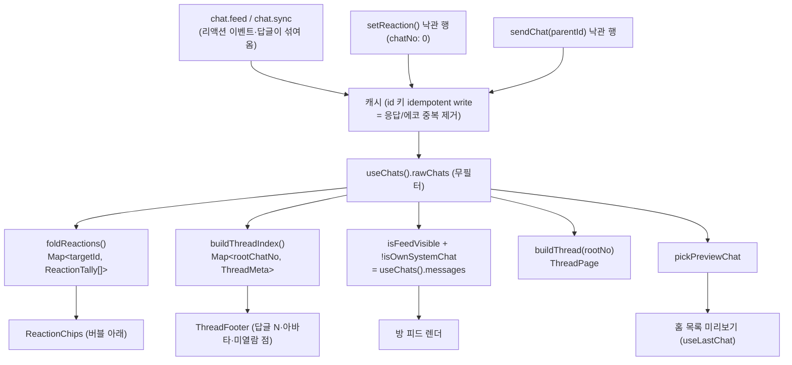
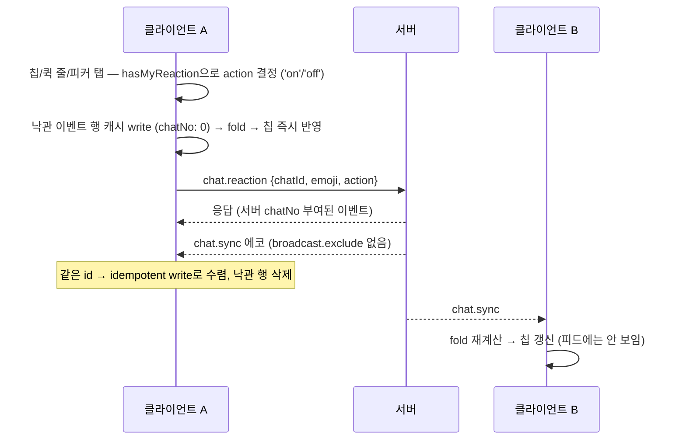
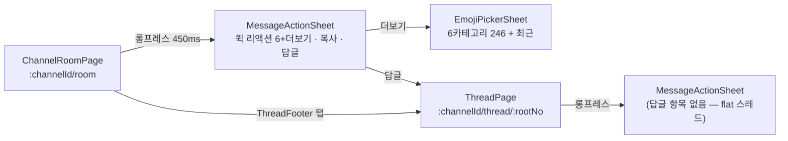
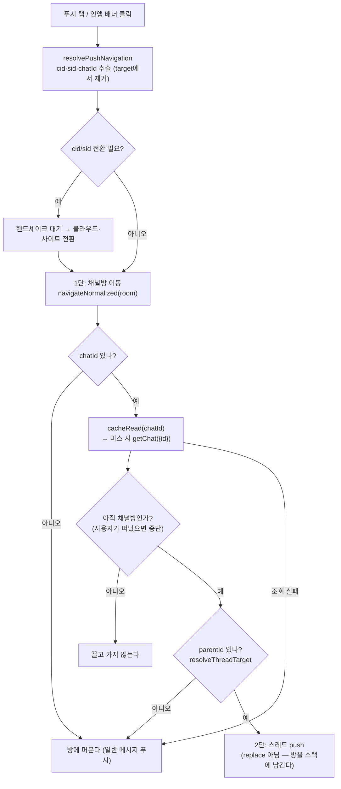

# 이모지 리액션과 스레드 (apps/web)

> 상태: Live · 최종 갱신: 2026-08-05 · 관련 ADR: [ADR-0045](../../../../../docs/adr/0045-web-emoji-reaction-and-thread.md) (선행: [ADR-0008](../../../../../docs/adr/0008-threads-client-derived-from-parentid.md))
>
> 외부 계약 원본: `chatic-sockets-api` `docs/specs/chat-emoji-reaction/` (01-spec.md · 05-client-guide.md)

## 목적

apps/web(모바일) 채팅방의 이모지 리액션과 스레드 답글. 데스크톱
(`apps/desktop-web/src/app/features/chat/`)에 먼저 완성된 구현의 **포팅**이며, 동시에
버그 수정이다 — 리액션 이벤트(`stereo:'system'` · `subType:'reaction'`)와 스레드 답글
(`parentId` 보유)은 `chat.feed`/`chat.sync`에 평범한 chat으로 섞여 오는데, 피드 가시성
필터가 없던 시절에는 데스크톱에서 누가 이모지를 누르면 모바일 방 화면에 빈
`SystemNotice` 알약이 뜨고 홈 목록 미리보기를 점거했다.

엔진 계층(`ChatRepositoryV2.setReaction` · `sendChat`의 `parentId` 통과 · id 키 idempotent
캐시)은 이 작업 전부터 완성돼 있었다 — 이 트랙은 UI 배선 + 클라이언트 파생 로직 + 타입 정리다.

## 설계 원칙

- **재설계가 아니라 포팅.** 서버 계약이 걸린 로직(이모지 fold 키, `parentId` 이중 인코딩
  매칭, 가시성 술어)은 데스크톱 구현과 자구까지 같다. 달라지는 순간 한 클라이언트가 켠
  리액션이 다른 클라이언트에서 안 꺼진다. 각 포팅 파일 헤더에 원본 경로를 남겼다.
- **fold는 필터 전, 표시 필터는 그 뒤.** 리액션 집계와 스레드 인덱스는 **필터를 거치지 않은**
  원본 목록(`useChats().rawChats`)에서 파생하고, 피드 렌더 목록만 `isFeedVisible`로 거른다.
  순서가 바뀌면 파생 재료 자체가 사라진다. 특히 내 리액션 이벤트는 `isOwnSystemChat`에도
  걸리므로, fold 입력은 반드시 완전 무필터 목록이어야 한다.
- **diff는 apps/web + libs/data 타입 정리에 가둔다.** 데스크톱 코드는 무변경. 파생 유틸은
  앱 로컬이며 libs 승격은 후속 리팩토링 트랙이다 (ADR-0045 결정 3).
- **파생 값은 best-effort.** 답글 개수·리액션 집계는 로컬 캐시에 로드된 범위에서만
  계산된다 (ADR-0008). UI가 권위 있는 수치처럼 제시하지 않는다.
- **확정 행(chatNo > 0)만 리액션·답글 대상이 된다.** 낙관 행의 임시 id로 리액션/답글을
  쏘면 서버가 404를 내고, 확정 교체 후 고아가 된다.
- **채널 종류를 구분하지 않는다.** 그룹·DM·셀프 채팅 모두 같은 동작. 분기 없음.

## 범위

**포함** — 리액션 칩·퀵 리액션 줄·전체 이모지 피커·토글 · 피드/홈 미리보기 가시성 필터
(버그 수정) · 스레드 전체화면 라우트(`:channelId/thread/:rootNo`)와 답글 전송 · 스레드
루트의 답글 푸터와 안 본 답글 강조 · 메시지 액션 BottomSheet(기존 Radix 드롭다운 대체) ·
`@lemoncloud/chatic-socials-api` `^0.26.721` 범프와 그에 딸린 캐스팅·Pick 정리 · ko/en 번역 키.

**제외** — `chat.feed`의 `parentId` 필터·서버측 답글 집계(백엔드 후속) · 중첩 스레드 ·
리액션 푸시 · 리액션한 사람 목록 상세 시트 · 데스크톱 코드 변경 · 파생 유틸의 libs 승격 ·
답글 전용 미읽음 카운터.

## 시나리오

1. **리액션 달기** — 메시지를 450ms 롱프레스(우클릭/contextmenu 포함) →
   `MessageActionSheet`가 열린다: 상단 퀵 리액션 줄(최근 사용 우선 + 고정 `👍🆗` + 보충,
   6개 + 더보기), 아래로 복사·답글. 이모지를 탭하면
   `setReaction({chatId: message.id, emoji, action:'on'})` → 낙관 이벤트 행이 즉시 fold에
   잡혀 칩이 뜬다 → 서버 응답과 `chat.sync` 에코는 같은 id로 idempotent write되어 낙관
   행을 교체한다. 실패하면 낙관 행이 삭제되어 칩이 되돌아가고, 행 아래에 실패 문구가 남는다
   (`useReactions.failedId`).
2. **리액션 토글 오프** — 내 리액션이 있는 칩(`mine`) 또는 퀵 줄의 눌린 이모지를 탭하면
   `action:'off'`를 보낸다. 서버는 토글 판정을 하지 않는다 — `action`은 목표 상태고, 현재
   상태 판정은 `hasMyReaction`(정규화 fold 키 매칭)이 한다. 표시 문자열 비교는 U+FE0F
   차이로 오판한다.
3. **남의 리액션 수신** — `chat.sync`로 도착한 이벤트가 캐시에 쌓이고 fold가 다시 돌아
   칩이 갱신된다. 이벤트 행 자체는 `isFeedVisible`이 걸러 피드에 보이지 않는다.
4. **스레드 열기** — 루트 메시지의 답글 푸터("답글 N · 답글자 아바타") 또는 액션 시트의
   "스레드로 답글" → `ROUTES.channels.thread(channelId, chatNo)` 전체화면 라우트로 페이지
   전환. 뒤로가기·딥링크가 기존 라우팅에 그대로 얹힌다.
5. **답글 전송** — 스레드 화면 하단 입력창에서 전송하면
   `sendMessage({channelId, content, parentId: root.id})` — **`parentId`는 반드시 루트의
   full id(`<channelId>:<chatNo>`)**. bare `chatNo`는 서버가 404. 낙관 행은 full id를 들고
   있다가 서버 저장본(bare `chatNo`로 정규화)으로 교체된다 — 매칭이 양쪽 인코딩을 다 받는
   이유다. 전송 성공 시 그 `chatNo`로 읽음 커서를 전진시킨다(답글도 채널 chatNo를 소비하므로).
6. **안 본 답글 강조** — 답글은 `stereo:'user'`라 미읽음 배지에 잡히는데 본문 피드에서는
   숨겨지므로, 방 진입만으로 배지가 사라지면 답글을 못 본 채 지나간다. 방 진입 시점의 내
   읽음 커서(`myJoin.readNo`)를 **스냅샷**해 두고(라이브 커서는 `useReadMarker`가 진입
   즉시 헤드로 밀어버려 기준으로 못 쓴다), `threadMeta.lastReplyNo > 스냅샷`이면 푸터에
   점·강조를 표시한다. 최신 답글이 내 것이면 점을 찍지 않는다(`lastReplyOwnerId`).
   방을 나갔다 오면 새 스냅샷이 잡혀 점이 걷힌다 — 커서의 읽음 의미론과 일치.
7. **홈 목록 미리보기** — `pickPreviewChat`이 리액션 이벤트·답글·시스템 행(내 것이든
   아니든)·실패 전송을 건너뛰고, `compareByChatNo`로 순위를 매겨 내 pending 전송
   (`chatNo:0` 센티넬)도 즉시 미리보기가 되게 한다.
8. **전체 이모지 피커** — 액션 시트의 더보기(+) → `EmojiPickerSheet`: 6카테고리 246개
   큐레이션(외부 emoji DB 없음, 데스크톱과 동일 집합) + 최근 탭. 선택은 LRU 16
   (`chatic.emoji.recent`, localStorage persist)에 남는다.
9. **답글 푸시로 들어오기 (2단 이동)** — 답글은 평범한 `stereo:'user'` chat이라 푸시가 나가는데
   본문 피드에서는 숨겨진다. 채널 단위로만 이동하면 **알림의 원인이 화면에 없는** 상태가 된다.
   그래서 한 번에 스레드로 뛰지 않고 단계적으로 이동한다:
    1. 푸시가 준 대로 **채널방을 먼저 연다** (`ROUTES.channels.room`).
    2. 푸시가 `chatId`를 실어 왔으면 그 chat이 답글인지 확인한다 —
       `cacheRead(chatId)` → 미스 시 `getChat({id})` → `parentId` 유무.
    3. 답글이면 그 위에 **스레드를 push**한다. 최상위 메시지거나 조회 실패면 방에 그대로 머문다.

    이 순서인 이유가 세 가지다. 뒤로가기가 `스레드 → 채널방 → 원래 화면`으로 자연스럽고,
    **채널방이 뜨면서 채워지는 캐시가 곧 이 조회의 재료**이며, 해석에 실패해도 여전히 맞는
    화면에 남는다. 조회 실패는 전부 조용히 넘긴다 — 사용자는 이미 납득 가능한 화면에 있다.

## 다이어그램

### 데이터 흐름 — 파생은 필터 전, 표시는 필터 후



### 리액션 토글 시퀀스



### 표면 구조



### 답글 푸시의 2단 이동



## 상세 구현

### 공유 술어 — `apps/web/src/app/utils/chat.ts`

home과 channels가 함께 쓰는 술어는 (ADR이 지목한 `channels/utils/`가 아니라) 기존
`isOwnSystemChat`이 살던 앱 공용 유틸에 뒀다 — 이 리포에 피처 간 교차 import 선례가
없어서다. 전부 데스크톱 `shared/utils`/`previewChat.ts`의 포팅:

- `compareByChatNo` — chatNo 오름차순, 센티넬 0(pending)은 마지막, createdAt 타이브레이크.
- `isNotifiableChat` — `stereo !== 'system'`. subType이 아니라 stereo 가드인 이유는 새
  subType이 이 빌드보다 먼저 서버에 생기기 때문.
- `isFeedVisible` — `!parentId && subType !== 'reaction'`. 삭제 메시지(tombstone)와
  join/leave는 남긴다.
- `isPreviewableChat` — `isFeedVisible && isNotifiableChat && !isFailed`.
- `pickPreviewChat` — `compareByChatNo` 순위로 최신 previewable 행 선택.

### channels 전용 파생 — `apps/web/src/app/features/channels/utils/`

| 파일               | 내용                                                                                                                                                                                                                               | 데스크톱 원본과의 차이                                                                  |
| ------------------ | ---------------------------------------------------------------------------------------------------------------------------------------------------------------------------------------------------------------------------------- | --------------------------------------------------------------------------------------- |
| `foldReactions.ts` | fold 키 `NFC + U+FE0F 제거`(서버 `normalizeEmoji` 동일, 스킨톤·ZWJ 유지) · `(targetId, userId, key)` 삼중 키 last-action-wins(`order = chatNo \|\| MAX_SAFE_INTEGER - index`) · `Map<targetId, ReactionTally[]>` · `hasMyReaction` | 없음 (헤더 주석만)                                                                      |
| `buildThread.ts`   | `threadRootId` · `buildThreadIndex`(full id↔bare chatNo 정규화, reaction 제외, tombstone 카운트) · `buildThread`(rootKeys 집합 매칭, 루트 페이지아웃 시 degrade)                                                                  | `ThreadMeta`에 **`lastReplyNo`·`lastReplyOwnerId` 추가** — 미열람 점 판정용 모바일 확장 |
| `emoji.ts`         | `EMOJI_CATEGORIES` 6카테고리 246개                                                                                                                                                                                                 | 없음 (동일 유지 필수)                                                                   |

### UI — `apps/web/src/app/features/channels/`

| 파일                                                                                                            | 역할                                                                                                                                                                                                                                                                                    |
| --------------------------------------------------------------------------------------------------------------- | --------------------------------------------------------------------------------------------------------------------------------------------------------------------------------------------------------------------------------------------------------------------------------------- |
| [components/MessageActionSheet.tsx](../../../src/app/features/channels/components/MessageActionSheet.tsx)       | `BottomSheet` 기반 롱프레스 시트: 퀵 리액션 줄(최근→`QUICK_REACTIONS`→보충, 6개, `aria-pressed`로 눌림 표시) + 더보기 + 복사 + 답글. `canReact`/`canReply`는 확정 행(chatNo>0)만 true. 기존 미사용 키 `chat.room.messageActions` 재사용.                                                |
| [components/EmojiPickerSheet.tsx](../../../src/app/features/channels/components/EmojiPickerSheet.tsx)           | 전체 피커 시트: 카테고리 탭 + 8열 그리드 + 최근 탭(있을 때만). 데스크톱 `EmojiPicker` 포팅.                                                                                                                                                                                             |
| [components/ReactionChips.tsx](../../../src/app/features/channels/components/ReactionChips.tsx)                 | 칩 줄: 이모지+인원 수, `mine` 강조 테두리, 탭 토글. 비면 렌더 안 함. 데스크톱 `ReactionBar` 포팅.                                                                                                                                                                                       |
| [components/ThreadFooter.tsx](../../../src/app/features/channels/components/ThreadFooter.tsx)                   | 답글 푸터: 답글자 아바타 스택(최대 3) + "답글 N" + 미열람 점. 로드된 답글이 있는 루트에만 렌더.                                                                                                                                                                                         |
| [components/ChannelMessageRow.tsx](../../../src/app/features/channels/components/ChannelMessageRow.tsx)         | Radix 드롭다운 제거 — 롱프레스/contextmenu가 `onLongPress`(시트 열기)로 수렴. 버블 아래 컬럼에 칩·실패 문구·푸터 슬롯. tombstone(`hidden`)엔 칩 숨김.                                                                                                                                   |
| [pages/ThreadPage.tsx](../../../src/app/features/channels/pages/ThreadPage.tsx)                                 | 전체화면 스레드: 루트 + 답글 목록(오름차순) + 키보드 인식 컴포저. `buildThread(rawChats, rootNo)` 파생, 이름 해석은 방과 같은 우선순위(profile nick → member cache → `owner$`). 루트 페이지아웃 시 안내 + "이전 메시지 불러오기". 시트 재사용(답글 항목 없음 — flat). 읽음 영수증 없음. |
| [pages/ChannelRoomPage.tsx](../../../src/app/features/channels/pages/ChannelRoomPage.tsx)                       | fold/threadIndex 파생, 시트 상태(`actionMessage`), `baselineReadNo` 스냅샷, 행 배선.                                                                                                                                                                                                    |
| [hooks/useChats.ts](../../../src/app/features/channels/hooks/useChats.ts)                                       | 매핑 필터에 `isFeedVisible` 추가, **`rawChats`(무필터 창) 노출** — fold/스레드 파생 재료.                                                                                                                                                                                               |
| [hooks/useChatMutations.ts](../../../src/app/features/channels/hooks/useChatMutations.ts)                       | `SendMessageInput.parentId?` 추가 (레포지토리는 원래 통과시킴).                                                                                                                                                                                                                         |
| [hooks/useReactions.ts](../../../src/app/features/channels/hooks/useReactions.ts)                               | `toggleReaction(chatId, emoji, isMine)` → `action: isMine ? 'off' : 'on'`, 실패 시 `failedId`. 이 피처 컨벤션대로 react-query 없이 플레인 프로미스.                                                                                                                                     |
| [routes/paths.ts](../../../src/app/routes/paths.ts) · [index.tsx](../../../src/app/features/channels/index.tsx) | `ROUTES.channels.thread(channelId, rootNo)` = `/channels/:channelId/thread/:rootNo`.                                                                                                                                                                                                    |
| [stores/useRecentEmojiStore.ts](../../../src/app/stores/useRecentEmojiStore.ts)                                 | zustand persist LRU 16, 키 `chatic.emoji.recent`, `QUICK_REACTIONS = ['👍','🆗']`(고정 — 최근순 재배열 금지 근거는 파일 주석). 앱 공용 stores 폴더(피처 stores 선례 없음).                                                                                                              |

### 푸시 → 스레드 내비게이션 (`apps/web/src/app/bridge/navigation/`)

두 진입점(네이티브 `OnNavigate` 푸시 탭, 포그라운드 인앱 배너 클릭)이 모두
`usePushNavigate`로 수렴하므로 로직은 한 곳에만 둔다. 인앱 배너가 모바일
`resolvePushTapPath`를 미러링한다는 기존 불변식이 유지된다.

| 파일                                                                                               | 변경                                                                                                                                                                                                                                                                                                                        |
| -------------------------------------------------------------------------------------------------- | --------------------------------------------------------------------------------------------------------------------------------------------------------------------------------------------------------------------------------------------------------------------------------------------------------------------------- |
| [resolvePushNavigation.ts](../../../src/app/bridge/navigation/resolvePushNavigation.ts)            | `chatId`를 `cid`/`sid`와 같은 방식으로 추출하고 `target`에서 제거한다. 방 URL이 정규형을 유지해야 `navigateNormalized`의 "이미 그 화면" 비교가 두 번의 탭을 서로 다른 목적지로 오판하지 않는다. **추출을 `/channel` 폴백 분기보다 앞에 둔 것이 핵심** — 그 분기는 `channelId`만으로 타깃을 재구성해 남은 파라미터를 버린다. |
| [resolveThreadTarget.ts](../../../src/app/bridge/navigation/resolveThreadTarget.ts)                | 조회된 chat이 답글이면 스레드 경로, 아니면 `null`(방에 머문다). `parentId`가 곧 `rootNo`이고, full id 인코딩이 들어와도 chatNo만 떼어 쓴다.                                                                                                                                                                                 |
| [usePushNavigate.ts](../../../src/app/bridge/navigation/usePushNavigate.ts)                        | `hopToThread` 추가 + 모든 종료 경로를 `land()`로 통일(전환 실패·best-effort 경로에서도 홉이 시도된다). **스레드 홉은 `navigateNormalized`를 쓰지 않고 직접 push한다** — 그 헬퍼는 현재 위치가 채널방이면 `replace`하므로, 방금 깔아둔 방이 스택에서 사라진다.                                                               |
| [resolveInAppPushRoute.ts](../../../src/app/features/notifications/utils/resolveInAppPushRoute.ts) | `extractPushContext`가 `chatId`도 반환하고(이미 `payload` JSON을 파싱해 병합하던 자리), 두 분기 모두 쿼리에 실어 공용 하류로 넘긴다.                                                                                                                                                                                        |

**남은 서버 의존성** — OS 푸시 **탭** 경로는 네이티브가 `{ path, replace }`만 브리지로 넘기고
raw `data`(여기에 `chatId`가 있다)를 버린다. 그래서 클라 쪽 준비는 끝났지만, 실제로 동작하려면
서버가 답글 푸시의 `link`에 `chatId`를 실어야 한다(예: `channel?channelId={id}&chatId={id}:{no}`).
그 전까지 이 경로는 채널방까지만 이동하며, 루트 행의 `ThreadFooter` 미열람 점이 단서로 남는다.
포그라운드 인앱 배너는 `data` 전체가 이미 넘어오므로 **지금 바로 동작한다.**
| [useLastChat.ts](../../../src/app/features/home/hooks/useLastChat.ts) | reduce를 `pickPreviewChat`으로 교체 — 리액션/답글/시스템/실패 제외 + pending 우선 순위까지 데스크톱과 동일해짐. |
| `public/locales/{ko,en}/translation.json` | `chat.room.react*`·`pickEmoji`·`moreEmoji`, `chat.thread.*`, `emoji.*`. 복수형 키(`replyCount_one/_other`)는 ko/en 패리티 테스트 때문에 양쪽 모두 suffix 형태. |

### libs/data 타입 정리 (범프에 딸린 작업)

- [package.json:119](../../../../../package.json) — `@lemoncloud/chatic-socials-api` `^0.26.721`.
  `apps/mobile`의 `"*"` 핀은 yarn.lock에서 0.26.129로 별도 잠겨 있어 영향 없음(확인함).
- [gateways/index.ts:26](../../../../../libs/data/src/data/remote/gateways/index.ts) —
  `ChatDomainGateway` Pick에 `'reaction'` 추가.
- [ChatRepositoryV2.ts](../../../../../libs/data/src/data/repositories-v2/ChatRepositoryV2.ts) —
  `setReaction`·`createOptimisticChat`의 `as DomainChat` 생캐스팅 제거. 캐스팅이 숨기던
  유령 필드 2개(`userId`, `isOwner` — `CacheChatView`에 없고 읽는 곳도 없음)를 함께 삭제.

### 건드리지 않는 것

- [useChannelUnreads.ts:36](../../../src/app/features/home/hooks/useChannelUnreads.ts) —
  `chatNo - metaNo` 상계가 리액션 이벤트(`stereo:'system'` → `metaNo` 포함)를 이미 걸러낸다.
  답글은 여전히 배지에 잡히는 의도된 한계(완화책 = ThreadFooter 미열람 강조).
- 데스크톱 코드 전체, 캐시/레포지토리 동작(타입 정리 외).

## 검증 방법

- **유닛 테스트** (Jest·ts-jest, 소스 옆 코로케이션): `foldReactions.test.ts`(데스크톱
  스펙 포팅 — 정규화 수렴·last-action-wins·낙관 정렬·fold 키), `buildThread.test.ts`(양
  인코딩 매칭·reaction 제외·tombstone·`lastReplyNo/OwnerId`), `chat.test.ts`(가시성·미리보기
  술어·정렬), `useChats.test.ts`(피드 필터 + `rawChats`), `useLastChat.test.ts`(리액션/답글
  점거 차단), `useReactions.test.ts`(on/off 판정·failedId), `MessageActionSheet.test.tsx`·
  `ReactionChips.test.tsx`(렌더/상호작용), `resolveThreadTarget.test.ts`·
  `resolvePushNavigation.test.ts`(chatId 추출·폴백 분기 통과),
  `useHandlePushNavigation.test.ts`(2단 이동 — 방 먼저 후 스레드 push, 최상위는 방에서 멈춤,
  캐시 미스 시 `getChat` 폴백, 조회 실패 시 잔류, 조회 중 이탈 시 미납치).

    ```bash
    npx nx run web:test
    ```

- **수동 크로스 체크**: 데스크톱에서 리액션/답글 → 모바일 방에 빈 알약이 안 뜨고 칩/푸터가
  갱신되는지, 홈 미리보기가 점거되지 않는지. 모바일에서 켠 리액션을 데스크톱에서 끄기
  (fold 키 일치 검증). 스레드 딥링크·뒤로가기·키보드 위 컴포저. 오래된 스레드에서
  "이전 메시지 불러오기" degrade 경로. 답글 푸시의 2단 이동은 **포그라운드 인앱 배너로
  먼저 검증 가능**하다(OS 탭 경로는 서버가 `link`에 `chatId`를 실은 뒤).

- **알려진 무관 부채**: `desktop-web:typecheck`는 이 트랙과 무관한 기존 오류들이 있다
  (이번에 libs/data 앞단 오류가 고쳐지며 드러남 — `useInviteLogin`의 `isGuest`,
  `IUserRepositoryV2.refreshList` 인터페이스 누락, `MentionNode` override). 별도 트랙.
