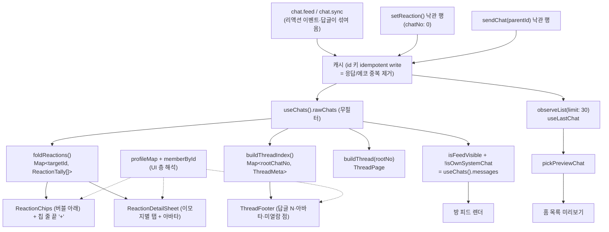
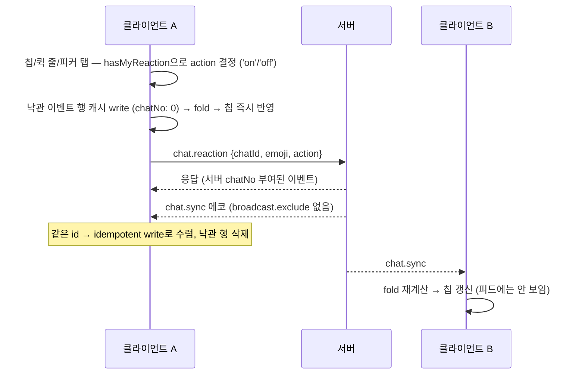
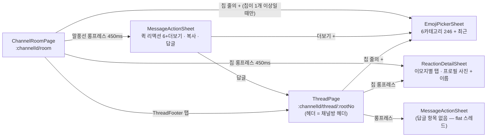
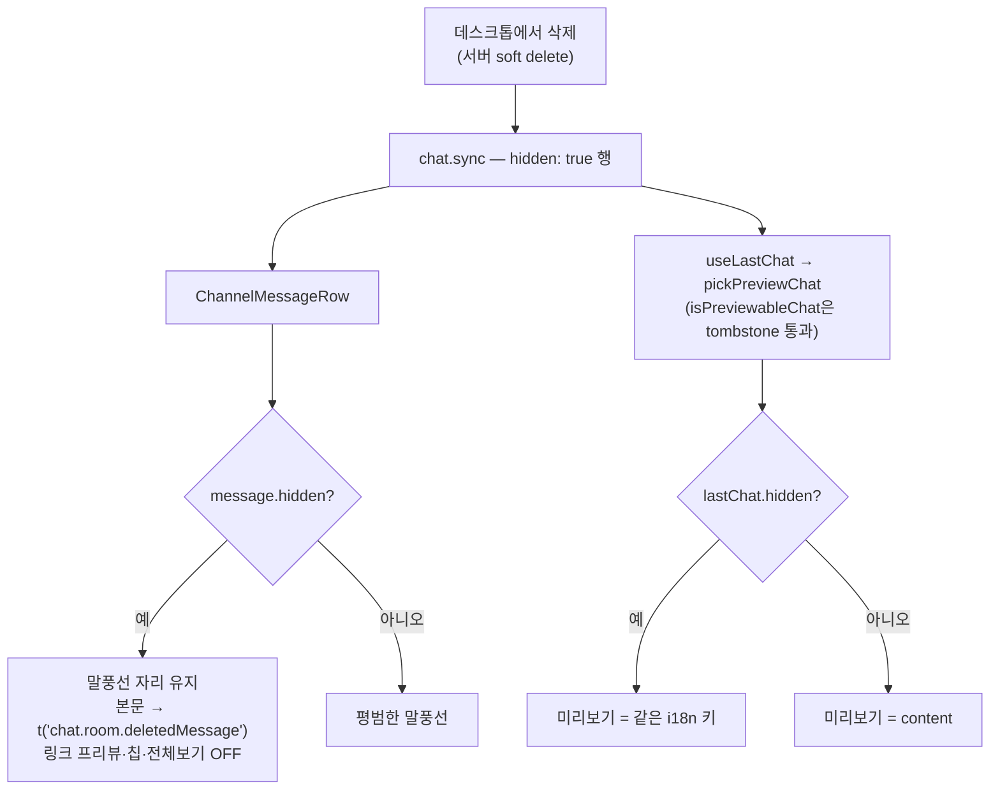
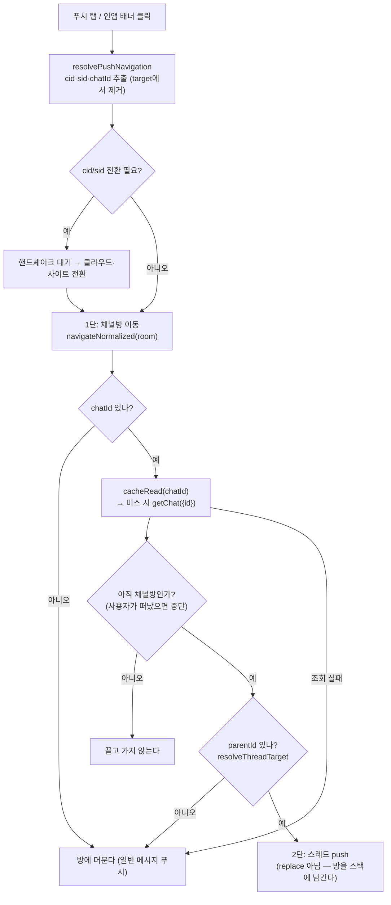

# 이모지 리액션과 스레드 (apps/web)

> 상태: Live · 최종 갱신: 2026-08-07 · 관련 ADR: [ADR-0047](../../../../../docs/adr/0047-web-reaction-and-thread-refinements.md) (후속 다듬기) · [ADR-0045](../../../../../docs/adr/0045-web-emoji-reaction-and-thread.md) (도입) · 선행: [ADR-0008](../../../../../docs/adr/0008-threads-client-derived-from-parentid.md) · [ADR-0046](../../../../../docs/adr/0046-web-feature-ownership-and-barrel-hygiene.md) (소유권·배럴)
>
> 외부 계약 원본: `chatic-sockets-api` `docs/specs/chat-emoji-reaction/` (01-spec.md · 05-client-guide.md)

## 목적

apps/web(모바일) 채팅방의 이모지 리액션과 스레드 답글. 데스크톱
(`apps/desktop-web/src/app/features/chat/`)에 먼저 완성된 구현의 **포팅**이며, 동시에
버그 수정이다 — 리액션 이벤트(`stereo:'system'` · `subType:'reaction'`)와 스레드 답글
(`parentId` 보유)은 `chat.feed`/`chat.sync`에 평범한 chat으로 섞여 오는데, 피드 가시성
필터가 없던 시절에는 데스크톱에서 누가 이모지를 누르면 모바일 방 화면에 빈
`SystemNotice` 알약이 뜨고 홈 목록 미리보기를 점거했다.

엔진 계층(`ChatRepositoryV2.setReaction` · `sendChat`의 `parentId` 통과 · id 키 idempotent
캐시)은 이 작업 전부터 완성돼 있었다 — 이 트랙은 UI 배선 + 클라이언트 파생 로직 + 타입 정리다.

ADR-0047의 후속 다듬기가 여기에 합류한다. 새 기능이 아니라 **이미 만든 표면의 마감**이고,
셋(홈 빈 행·스레드 헤더 맥락 부재·삭제 메시지 원문 노출)은 실재하는 결함이다.

## 설계 원칙

- **재설계가 아니라 포팅.** 서버 계약이 걸린 로직(이모지 fold 키, `parentId` 이중 인코딩
  매칭, 가시성 술어)은 데스크톱 구현과 자구까지 같다. 달라지는 순간 한 클라이언트가 켠
  리액션이 다른 클라이언트에서 안 꺼진다. 각 포팅 파일 헤더에 원본 경로를 남겼다.
- **fold는 필터 전, 표시 필터는 그 뒤.** 리액션 집계와 스레드 인덱스는 **필터를 거치지 않은**
  원본 목록(`useChats().rawChats`)에서 파생하고, 피드 렌더 목록만 `isFeedVisible`로 거른다.
  순서가 바뀌면 파생 재료 자체가 사라진다. 특히 내 리액션 이벤트는 `isOwnSystemChat`에도
  걸리므로, fold 입력은 반드시 완전 무필터 목록이어야 한다.
- **파생은 순수하게, 해석은 UI에서.** `foldReactions`·`buildThread*`는 프로필 캐시를 모른다.
  아바타·표시 이름을 고르는 우선순위(사이트 프로필 → 멤버 user 캐시 → 임베드 `owner$`)는
  **표시하는 컴포넌트가** 적용한다. 파생 유틸에 캐시를 주입하면 순수성이 깨지고 테스트가
  무거워진다. 대가는 우선순위 체인이 표시 지점마다 반복된다는 것 — 지금 방·스레드·푸터 셋이다.
- **같은 방의 두 화면은 같은 헤더를 쓴다.** 채널방과 스레드는 제목 체인(`useChannelTitle`)·
  아바타 규칙(`resolveChannelAvatar`)·`kind`를 공유한다. "스레드에 있다"는 신호는 헤더가
  아니라 내용(루트 + 구분선 + 답글 목록)이 낸다.
- **diff는 apps/web + libs/data 타입 정리에 가둔다.** 데스크톱 코드는 무변경. 파생 유틸은
  앱 로컬이며 libs 승격은 후속 리팩토링 트랙이다 (ADR-0045 결정 3).
- **파생 값은 best-effort.** 답글 개수·리액션 집계는 로컬 캐시에 로드된 범위에서만
  계산된다 (ADR-0008). UI가 권위 있는 수치처럼 제시하지 않는다.
- **확정 행(chatNo > 0)만 리액션·답글 대상이 된다.** 낙관 행의 임시 id로 리액션/답글을
  쏘면 서버가 404를 내고, 확정 교체 후 고아가 된다.
- **제스처는 빈도로 나눈다.** 한 요소가 탭과 롱프레스를 둘 다 가질 때, 흔한 동작이 싼
  제스처를 갖는다 — 칩의 탭은 토글, 꾹 누르기는 반응자 상세. 롱프레스 임계값은 채팅 표면
  전체가 상수 하나(`LONG_PRESS_DELAY_MS`)를 공유한다.
- **삭제된 메시지는 어디서든 같은 문구다.** 방과 홈이 하나의 i18n 키를 공유한다. 표기가
  갈라지면 한쪽만 원문을 계속 보여주게 되고, 그게 정확히 ADR-0047 §6이 잡는 결함이다.
- **채널 종류를 구분하지 않는다.** 그룹·DM·셀프 채팅 모두 리액션·스레드 동작이 같다.
  분기는 헤더의 표시(`kind`·제목·아바타)에만 존재한다.

## 범위

**포함** — 리액션 칩·칩 줄 끝의 추가 버튼·퀵 리액션 줄·전체 이모지 피커·토글 · 액션 시트의
칩 롱프레스로 여는 이모지별 반응자 상세 시트(프로필 사진 포함) · 피드/홈 미리보기 가시성
필터(버그 수정) · 홈 관측 창
(`PREVIEW_LOOKBACK`) 10 → 30 · 스레드 전체화면 라우트(`:channelId/thread/:rootNo`)와 답글
전송 · 채널방과 통일된 스레드 헤더 · 스레드 루트의 답글 푸터(아바타 해석 통일)와 안 본 답글
강조 · 메시지 액션 BottomSheet(기존 Radix 드롭다운 대체) · 삭제 메시지 tombstone 표기(방·홈) ·
`useRecentEmojiStore`의 `features/channels/stores/` 이동(ADR-0046) ·
`@lemoncloud/chatic-socials-api` `^0.26.721` 범프와 그에 딸린 캐스팅·Pick 정리 · ko/en 번역 키.

**제외** — 홈 행의 리액션 배지(ADR-0047 대안에서 기각) · `chat.feed`의 `parentId` 필터·서버측
답글 집계(백엔드 후속) · 중첩 스레드 · 리액션 푸시 · 리액션 전용 미읽음 카운터 · 반응자 목록
홈 정렬 기준 손대기 · `apps/web`에서 보낸 메시지의
서버 soft delete · 데스크톱 코드 변경 · 파생 유틸의 libs 승격.

## 시나리오

1. **리액션 달기 (첫 리액션)** — 메시지를 450ms 롱프레스(우클릭/contextmenu 포함) →
   `MessageActionSheet`가 열린다: 퀵 리액션 줄(최근 사용 우선 + 고정 `👍🆗` + 보충,
   6개 + 더보기), 복사, 답글. 이모지를 탭하면
   `setReaction({chatId: message.id, emoji, action:'on'})` → 낙관 이벤트 행이 즉시 fold에
   잡혀 칩이 뜬다 → 서버 응답과 `chat.sync` 에코는 같은 id로 idempotent write되어 낙관
   행을 교체한다. 실패하면 낙관 행이 삭제되어 칩이 되돌아가고, 행 아래에 실패 문구가 남는다
   (`useReactions.failedId`).
2. **리액션 하나 더 달기 (칩 줄의 `+`)** — 이미 칩이 있는 메시지에는 칩 줄 **마지막 항목**으로
   `+` 버튼이 붙는다. 탭하면 액션 시트를 건너뛰고 `EmojiPickerSheet`가 바로 열린다 — 이 버튼을
   누른 시점에 의도는 "리액션 추가"로 확정돼 있어 복사·답글이 섞인 시트를 한 단계 더 보여줄
   이유가 없다. 칩이 하나도 없으면 칩 줄 자체가 렌더되지 않으므로 `+`도 나오지 않는다
   (모든 메시지 아래 빈 스트립을 상시 예약하지 않는다 — ADR-0045의 판단 유지).
3. **리액션 토글 오프** — 내 리액션이 있는 칩(`mine`) 또는 퀵 줄의 눌린 이모지를 탭하면
   `action:'off'`를 보낸다. 서버는 토글 판정을 하지 않는다 — `action`은 목표 상태고, 현재
   상태 판정은 `hasMyReaction`(정규화 fold 키 매칭)이 한다. 표시 문자열 비교는 U+FE0F
   차이로 오판한다. **칩 탭은 토글로만 남는다** — 칩의 일차 기능이 토글이라, 거기에 상세
   열기를 겹치면 두 동작이 같은 제스처를 다툰다.
4. **누가 눌렀는지 보기 (칩 롱프레스 → 전용 시트)** — 리액션 **칩을 꾹 누르면**
   `ReactionDetailSheet`가 열린다: 이모지별 탭(이모지 + 인원 수, 가로 스크롤) + 그 이모지에
   반응한 사람들의 **프로필 사진 + 이름** 목록. 누른 칩의 이모지 탭이 선택된 채로 열린다 —
   방금 누른 것을 시트에서 다시 찾게 하지 않는다.

    칩은 제스처 둘을 **빈도로 나눠 갖는다**: 탭은 흔한 쪽(토글), 꾹 누르기는 상세. 하나의
    제스처가 둘을 동시에 일으키면 안 되므로, 롱프레스로 끝난 제스처에 따라오는 `click`은
    삼킨다. 임계값은 말풍선 롱프레스와 같은 `LONG_PRESS_DELAY_MS` 하나를 공유한다 — 값이
    갈리면 같은 제스처가 손가락이 닿은 위치에 따라 다르게 느껴진다.

    시트가 열려 있는 동안 fold가 갱신되면(누가 리액션을 내리면) 탭의 수가 줄고, 보고 있던
    탭이 통째로 사라지면 남은 첫 탭으로 떨어진다.

5. **남의 리액션 수신** — `chat.sync`로 도착한 이벤트가 캐시에 쌓이고 fold가 다시 돌아
   칩이 갱신된다. 이벤트 행 자체는 `isFeedVisible`이 걸러 피드에 보이지 않는다.
6. **스레드 열기** — 루트 메시지의 답글 푸터("답글 N · 답글자 아바타") 또는 액션 시트의
   "스레드로 답글" → `ROUTES.channels.thread(channelId, chatNo)` 전체화면 라우트로 페이지
   전환. 헤더의 **정체성**은 채널방과 같다 — 같은 제목 체인(join nick → DM 피어 nick →
   채널명 → 폴백), 같은 아바타 규칙, `kind`도 채널 종류(`self`/`direct`/`group`)를 따른다.
   같지 않은 것은 **부속 슬롯 둘**이다: 그룹 참여자 스택(`meta`)과 설정 `moreMenu`를 스레드는
   달지 않는다 — 방 관리는 방의 일이고, 스레드에서 설정으로 빠지는 통로는 뒤로가기 스택만
   복잡하게 한다. "스레드"라는 표기는 헤더에 없고, 루트 + 구분선 + 답글 목록이라는 내용
   구조가 그 역할을 한다. 뒤로가기는 채널방으로 돌아간다.

    대가 하나: 채널이 아직 캐시에 없는 콜드 진입(스레드 딥링크)에서는 제목이 잠깐
    "이름 없는 채널"로 뜬다. 방 헤더가 이미 갖고 있던 동작을 그대로 물려받은 것이라
    일관성 쪽을 택했다 — 고치려면 두 화면을 함께 고쳐야 하고, 그건 이 트랙 밖이다.

7. **답글 전송** — 스레드 화면 하단 입력창에서 전송하면
   `sendMessage({channelId, content, parentId: root.id})` — **`parentId`는 반드시 루트의
   full id(`<channelId>:<chatNo>`)**. bare `chatNo`는 서버가 404. 낙관 행은 full id를 들고
   있다가 서버 저장본(bare `chatNo`로 정규화)으로 교체된다 — 매칭이 양쪽 인코딩을 다 받는
   이유다. 전송 성공 시 그 `chatNo`로 읽음 커서를 전진시킨다(답글도 채널 chatNo를 소비하므로).
8. **답글 푸터의 아바타** — 답글자 아바타는 메시지 행과 **같은 우선순위**로 해석한다
   (사이트 프로필 → 멤버 user 캐시 → 임베드 `owner$.thumbnail`). 그래서 같은 사람이 말풍선과
   푸터에서 다른 얼굴로 보이지 않고, `owner$`가 없는 낙관 답글도 아바타가 뜬다.
9. **안 본 답글 강조** — 답글은 `stereo:'user'`라 미읽음 배지에 잡히는데 본문 피드에서는
   숨겨지므로, 방 진입만으로 배지가 사라지면 답글을 못 본 채 지나간다. 방 진입 시점의 내
   읽음 커서(`myJoin.readNo`)를 **스냅샷**해 두고(라이브 커서는 `useReadMarker`가 진입
   즉시 헤드로 밀어버려 기준으로 못 쓴다), `threadMeta.lastReplyNo > 스냅샷`이면 푸터에
   점·강조를 표시한다. 최신 답글이 내 것이면 점을 찍지 않는다(`lastReplyOwnerId`).
   방을 나갔다 오면 새 스냅샷이 잡혀 점이 걷힌다 — 커서의 읽음 의미론과 일치.
10. **홈 목록 미리보기** — `pickPreviewChat`이 리액션 이벤트·답글·시스템 행(내 것이든
    아니든)·실패 전송을 건너뛰고, `compareByChatNo`로 순위를 매겨 내 pending 전송
    (`chatNo:0` 센티넬)도 즉시 미리보기가 되게 한다. 관측 창은 **행당 30행**이라 리액션
    버스트가 최근 행을 채워도 마지막 실제 메시지까지 닿는다. preview와 time은 **둘 다**
    `lastChat`에서 나오므로 "옛 본문 + 새 시각" 같은 어긋남은 구조적으로 없다.
    리액션은 홈에 어떤 형태로도 나타나지 않는다 — 배지·문장 합성·시각 갱신 모두 기각
    (ADR-0047 대안).
11. **전체 이모지 피커** — 액션 시트의 더보기(+) 또는 칩 줄의 `+` → `EmojiPickerSheet`:
    6카테고리 246개 큐레이션(외부 emoji DB 없음, 데스크톱과 동일 집합) + 최근 탭. 선택은
    LRU 16(`chatic.emoji.recent`, localStorage persist)에 남는다. 두 진입점 모두 같은
    `handlePickEmoji`로 수렴하므로 토글 판정도 동일하다.
12. **삭제된 메시지 (크로스 클라이언트)** — 데스크톱에서 지운 메시지는 서버 soft delete라
    `hidden` 행으로 모바일에 도착한다. 방에서는 말풍선 자리를 유지한 채 본문 대신
    "삭제된 메시지입니다"를 렌더한다 — 행이 그냥 사라지면 읽고 있던 사람에게 설명이 남지
    않는다. 링크 프리뷰·리액션 칩·전체보기 affordance는 함께 꺼진다. 홈에서도 마지막
    메시지가 tombstone이면 같은 문구를 미리보기에 쓴다(원문 노출 금지). `isPreviewableChat`은
    tombstone을 계속 통과시킨다 — 미리보기에서만 빼면 홈은 옛 메시지를, 방은 삭제된 것을
    보여주어 두 화면이 어긋난다. `apps/web`은 tombstone을 **읽을 수만 있고 만들 수는 없다**
    (여기의 `deleteMessage`는 서버 삭제가 아니라 실패/대기 행의 캐시 삭제다).
13. **스레드에 다녀와도 읽던 자리를 잃지 않는다** — 스레드로 가면 방 페이지는 언마운트되고,
    돌아오면 역방향 목록이 `scrollTop 0`(=바닥)에서 다시 시작한다. 그래서 `openThread`가 떠나기
    직전 offset을 맡겨두고(`stashRoomScroll`), 다음 방 마운트가 **한 번만** 꺼내 복원한다
    (`takeRoomScroll`). 한 번만인 이유는 홈에서 방으로 들어갈 때는 최신 메시지에 착지하는
    메신저 관례를 지켜야 하기 때문이다 — 복원은 "스레드에서 돌아온 진입"에만 붙는다.
    복원은 바닥 고정보다 우선하며(첫 페이지 도착이 곧 "새 최신 메시지"라 그냥 두면 덮인다),
    복원 뒤 도착하는 새 메시지는 평소대로 다시 바닥을 따라간다.
14. **스레드에서는 그 채널의 인앱 배너가 뜨지 않는다** — 방에서 억제되는 것과 같은 이유다.
    스레드는 그 방의 다른 화면이므로, 답글을 쓰는 동안 내 전송 왕복이 배너로 되돌아오면
    안 된다. 판정은 `window.location.pathname`을 방·스레드 두 패턴에 맞춰본다.
15. **답글 푸시로 들어오기 (2단 이동)** — 답글은 평범한 `stereo:'user'` chat이라 푸시가 나가는데
    본문 피드에서는 숨겨진다. 채널 단위로만 이동하면 **알림의 원인이 화면에 없는** 상태가 된다.
    그래서 한 번에 스레드로 뛰지 않고 단계적으로 이동한다:
    1. 푸시가 준 대로 **채널방을 먼저 연다** (`ROUTES.channels.room`).
    2. 푸시가 `chatId`를 실어 왔으면 그 chat이 답글인지 확인한다 —
       `cacheRead(chatId)` → 미스 시 `getChat({id})` → `parentId` 유무.
    3. 답글이면 그 위에 **스레드를 push**한다. 최상위 메시지거나 조회 실패면 방에 그대로 머문다.

    이 순서인 이유가 세 가지다. 뒤로가기가 `스레드 → 채널방 → 원래 화면`으로 자연스럽고,
    **채널방이 뜨면서 채워지는 캐시가 곧 이 조회의 재료**이며, 해석에 실패해도 여전히 맞는
    화면에 남는다. 조회 실패는 전부 조용히 넘긴다 — 사용자는 이미 납득 가능한 화면에 있다.

## 다이어그램

### 데이터 흐름 — 파생은 필터 전, 표시는 필터 후



### 리액션 토글 시퀀스



### 표면 구조 — 리액션 추가의 두 통로



### 삭제 메시지의 두 표면



### 답글 푸시의 2단 이동



## 상세 구현

### 공유 술어 — `apps/web/src/app/utils/chat.ts`

home과 channels가 함께 쓰는 술어는 (ADR-0045가 지목한 `channels/utils/`가 아니라) 기존
`isOwnSystemChat`이 살던 앱 공용 유틸에 뒀다 — 이 리포에 피처 간 교차 import 선례가
없어서다. 전부 데스크톱 `shared/utils`/`previewChat.ts`의 포팅:

- `compareByChatNo` — chatNo 오름차순, 센티넬 0(pending)은 마지막, createdAt 타이브레이크.
- `isNotifiableChat` — `stereo !== 'system'`. subType이 아니라 stereo 가드인 이유는 새
  subType이 이 빌드보다 먼저 서버에 생기기 때문.
- `isFeedVisible` — `!parentId && subType !== 'reaction'`. 삭제 메시지(tombstone)와
  join/leave는 남긴다. `subType !== 'reaction'`은 `isNotifiableChat`과 중복이지만
  **의도를 명시하는 이중 안전장치**로 남긴다 — 서버가 언젠가 리액션을 `system`이 아니게
  바꿔도 피드가 버틴다.
- `isPreviewableChat` — `isFeedVisible && isNotifiableChat && !isFailed`. 세 술어가 각각 다른
  것을 잡는다: `stereo` 가드는 join/leave + 리액션, `!parentId`는 답글(`stereo:'user'`라 위
  가드에 안 걸림), `!isFailed`는 실패한 내 전송(`chatNo: 0` 센티넬이 항상 최신으로 정렬돼
  미리보기를 영구히 붙잡음). **tombstone은 통과시킨다** — 진짜 그 채널의 마지막 메시지이고,
  방·홈이 둘 다 tombstone으로 렌더하므로 전제가 성립한다.
- `pickPreviewChat` — `compareByChatNo` 순위로 최신 previewable 행 선택.

**변경 없음.** ADR-0047 §3의 결론은 "판별 로직은 이미 정답"이고, 실제 변경은 관측 창 크기뿐이다.

### channels 전용 파생 — `apps/web/src/app/features/channels/utils/`

| 파일               | 내용                                                                                                                                                                                                                               | 데스크톱 원본과의 차이                                                                  |
| ------------------ | ---------------------------------------------------------------------------------------------------------------------------------------------------------------------------------------------------------------------------------- | --------------------------------------------------------------------------------------- |
| `foldReactions.ts` | fold 키 `NFC + U+FE0F 제거`(서버 `normalizeEmoji` 동일, 스킨톤·ZWJ 유지) · `(targetId, userId, key)` 삼중 키 last-action-wins(`order = chatNo \|\| MAX_SAFE_INTEGER - index`) · `Map<targetId, ReactionTally[]>` · `hasMyReaction` | 없음 (헤더 주석만)                                                                      |
| `buildThread.ts`   | `threadRootId` · `buildThreadIndex`(full id↔bare chatNo 정규화, reaction 제외, tombstone 카운트) · `buildThread`(rootKeys 집합 매칭, 루트 페이지아웃 시 degrade)                                                                  | `ThreadMeta`에 **`lastReplyNo`·`lastReplyOwnerId` 추가** — 미열람 점 판정용 모바일 확장 |
| `emoji.ts`         | `EMOJI_CATEGORIES` 6카테고리 246개                                                                                                                                                                                                 | 없음 (동일 유지 필수)                                                                   |

`buildThreadIndex`가 `repliers[].thumbnail`에 임베드 `owner$` 값을 담는 것은 **유지한다**.
파생은 프로필 캐시를 모르는 채로 두고, 우선순위 적용은 `ThreadFooter`가 한다(설계 원칙 3).

### UI — `apps/web/src/app/features/channels/`

| 파일                                                                                                        | 역할                                                                                                                                                                                                                                                                                                                                                                                                          |
| ----------------------------------------------------------------------------------------------------------- | ------------------------------------------------------------------------------------------------------------------------------------------------------------------------------------------------------------------------------------------------------------------------------------------------------------------------------------------------------------------------------------------------------------- |
| [components/ReactionDetailSheet.tsx](../../../src/app/features/channels/components/ReactionDetailSheet.tsx) | 이모지별 탭(가로 스크롤, 활성 탭은 하단 보더+강조 카운트) + 반응자 목록(36px 아바타 + 이름, `max-h-[45vh]` 스크롤). `tallies`는 **라이브 fold** — 열려 있는 동안 리액션이 내려가면 탭이 사라지고 첫 탭으로 폴백. `initialKey`가 누른 칩의 탭을 연다.                                                                                                                                                          |
| [components/ReactionChips.tsx](../../../src/app/features/channels/components/ReactionChips.tsx)             | 칩 줄: 이모지+인원 수, `mine` 강조 테두리, **탭 = 토글 / 롱프레스 = 반응자 상세**(뒤따르는 click은 삼킴). **줄의 마지막 항목으로 `+` 버튼**(`onAdd`) — 칩과 같은 높이·모양이라 줄의 리듬을 깨지 않는다. `tallies`가 비면 줄 전체를 렌더하지 않으므로 "칩 1개 이상일 때만 `+`"가 구조적으로 성립한다. 데스크톱 `ReactionBar` 포팅 + 모바일 확장.                                                               |
| [components/MessageActionSheet.tsx](../../../src/app/features/channels/components/MessageActionSheet.tsx)   | `BottomSheet` 기반 롱프레스 시트: 퀵 리액션 줄(최근→`QUICK_REACTIONS`→보충, 6개, `aria-pressed`) + 더보기 → 복사 → 답글. `canReact`/`canReply`는 확정 행(chatNo>0)만 true. **누가 눌렀는지는 여기 없다** — `ReactionDetailSheet`가 답한다.                                                                                                                                                                    |
| [components/EmojiPickerSheet.tsx](../../../src/app/features/channels/components/EmojiPickerSheet.tsx)       | 전체 피커 시트: 카테고리 탭 + 8열 그리드 + 최근 탭(있을 때만). 데스크톱 `EmojiPicker` 포팅. 진입점 둘(시트의 더보기, 칩 줄의 `+`)이 같은 상태로 수렴한다.                                                                                                                                                                                                                                                     |
| [components/ThreadFooter.tsx](../../../src/app/features/channels/components/ThreadFooter.tsx)               | 답글 푸터: 답글자 아바타 스택(최대 3) + "답글 N" + 미열람 점. 아바타는 `avatarOf?.(id) ?? replier.thumbnail` — **프로필 우선, 임베드는 폴백**. 로드된 답글이 있는 루트에만 렌더.                                                                                                                                                                                                                              |
| [components/ChannelMessageRow.tsx](../../../src/app/features/channels/components/ChannelMessageRow.tsx)     | 롱프레스/contextmenu가 `onLongPress`로 수렴. 버블 아래 컬럼에 링크 카드·칩·실패 문구·푸터 슬롯. **tombstone(`hidden`)** 이면 본문 대신 삭제 문구를 렌더하고 링크 프리뷰·칩·전체보기·롱프레스를 모두 끈다. `onAddReaction`·`avatarOf`를 각각 칩 줄과 푸터로 내린다.                                                                                                                                            |
| [pages/ChannelRoomPage.tsx](../../../src/app/features/channels/pages/ChannelRoomPage.tsx)                   | fold/threadIndex 파생, 시트 상태(`actionMessage`·`emojiPickerOpen`), `baselineReadNo` 스냅샷, 행 배선. 칩 줄의 `+`는 `actionMessage`를 세우고 피커를 여는 한 동작 — 그래서 `handlePickEmoji`가 두 통로에서 그대로 재사용된다.                                                                                                                                                                                 |
| [pages/ThreadPage.tsx](../../../src/app/features/channels/pages/ThreadPage.tsx)                             | 전체화면 스레드: 루트 + 답글 목록(오름차순) + 키보드 인식 컴포저. **헤더 정체성은 채널방과 동일** — `useChannelTitle(channel, {joinNick, peerNick})` · `resolveChannelAvatar` · `kind = self/direct/group`. `meta`(참여자 스택)·`moreMenu`(설정)는 달지 않는다. `buildThread(rawChats, rootNo)` 파생. 루트 페이지아웃 시 안내 + "이전 메시지 불러오기". 시트 재사용(답글 항목 없음 — flat). 읽음 영수증 없음. |
| [hooks/useChats.ts](../../../src/app/features/channels/hooks/useChats.ts)                                   | 매핑 필터에 `isFeedVisible` 추가, **`rawChats`(무필터 창) 노출** — fold/스레드 파생 재료.                                                                                                                                                                                                                                                                                                                     |
| [hooks/useChatMutations.ts](../../../src/app/features/channels/hooks/useChatMutations.ts)                   | `SendMessageInput.parentId?` 추가 (레포지토리는 원래 통과시킴).                                                                                                                                                                                                                                                                                                                                               |
| [hooks/useReactions.ts](../../../src/app/features/channels/hooks/useReactions.ts)                           | `toggleReaction(chatId, emoji, isMine)` → `action: isMine ? 'off' : 'on'`, 실패 시 `failedId`. 이 피처 컨벤션대로 react-query 없이 플레인 프로미스.                                                                                                                                                                                                                                                           |
| `stores/useRecentEmojiStore.ts`                                                                             | zustand persist LRU 16, 키 `chatic.emoji.recent`, `QUICK_REACTIONS = ['👍','🆗']`(고정 — 최근순 재배열 금지 근거는 파일 주석). **`app/stores/` → `features/channels/stores/`로 이동**(ADR-0046: 채팅 도메인 전용 스토어는 도메인 피처가 소유). storage key 유지 → 사용자 데이터 무영향.                                                                                                                       |
| [routes/paths.ts](../../../src/app/routes/paths.ts)                                                         | `ROUTES.channels.thread(channelId, rootNo)` = `/channels/:channelId/thread/:rootNo`.                                                                                                                                                                                                                                                                                                                          |

### 스크롤·알림 맥락

| 파일                                                                                | 역할                                                                                                                                                                                                                                                                                                                                 |
| ----------------------------------------------------------------------------------- | ------------------------------------------------------------------------------------------------------------------------------------------------------------------------------------------------------------------------------------------------------------------------------------------------------------------------------------ |
| [hooks/useScrollRestoration.ts](../../../src/app/hooks/useScrollRestoration.ts)     | 채널별(또는 임의 키별) offset 한 칸, `stashScroll`/`takeScroll`(일회성). 스토어가 아니라 모듈 맵인 이유는 **이 값으로 렌더하는 것이 아무것도 없기 때문** — 나갈 때 쓰고 돌아올 때 한 번 읽는다. `useChatScroll`과 홈 목록이 공유하는 자리로 뽑혔다(원래 채널 전용 `roomScrollMemory.ts`였다).                                        |
| [hooks/useChatScroll.ts](../../../src/app/features/channels/hooks/useChatScroll.ts) | `channelId`로 `useScrollRestoration(channelId, ready, {manualConsume:true})`를 호출해 마운트 시 맡긴 offset을 청구하고, 메시지가 도착한 커밋에서 복원한다. **청구 해제는 복원(레이아웃 이펙트)이 아니라 자동 스크롤(패시브 이펙트)이 한다** — 레이아웃이 먼저 도므로 거기서 지우면 같은 커밋에서 바닥 고정이 풀려 복원이 되돌려진다. |
| [utils/longPress.ts](../../../src/app/features/channels/utils/longPress.ts)         | `LONG_PRESS_DELAY_MS = 450`. 말풍선과 칩이 공유한다.                                                                                                                                                                                                                                                                                 |
| [hooks/useInAppPushMessage.tsx](../../../src/app/hooks/useInAppPushMessage.tsx)     | "지금 이 채널을 보고 있다" 판정에 **방과 스레드 두 라우트**를 모두 넣는다. 배너 카드는 아바타 + 제목 + 스니펫(슬랙 관례)이며, 내려오는 모션은 sonner의 `top-center` 기본 동작이다.                                                                                                                                                   |

### 홈 — `apps/web/src/app/`

| 파일                                                                                                  | 역할                                                                                                                                                                                                                      |
| ----------------------------------------------------------------------------------------------------- | ------------------------------------------------------------------------------------------------------------------------------------------------------------------------------------------------------------------------- |
| [hooks/useLastChat.ts](../../../src/app/hooks/useLastChat.ts)                                         | `observeList({channelId, limit: PREVIEW_LOOKBACK})` + `pickPreviewChat`. **`PREVIEW_LOOKBACK = 30`** — 리액션 버스트가 최근 행을 채워도 마지막 실제 메시지까지 닿게 하는 창. 비용은 홈 행 수만큼 곱해지는 캐시 관측 범위. |
| [features/home/components/ChannelList.tsx](../../../src/app/features/home/components/ChannelList.tsx) | `preview = lastChat.hidden ? t('chat.room.deletedMessage') : (lastChat.content ?? '')`. time은 그대로 `lastChat.createdAt` — preview와 time이 같은 행에서 나오므로 어긋나지 않는다.                                       |

### 푸시 → 스레드 내비게이션 (`apps/web/src/app/bridge/navigation/`)

두 진입점(네이티브 `OnNavigate` 푸시 탭, 포그라운드 인앱 배너 클릭)이 모두
`usePushNavigate`로 수렴하므로 로직은 한 곳에만 둔다. 인앱 배너가 모바일
`resolvePushTapPath`를 미러링한다는 기존 불변식이 유지된다.

| 파일                                                                                               | 변경                                                                                                                                                                                                                                                                                                                        |
| -------------------------------------------------------------------------------------------------- | --------------------------------------------------------------------------------------------------------------------------------------------------------------------------------------------------------------------------------------------------------------------------------------------------------------------------- |
| [resolvePushNavigation.ts](../../../src/app/bridge/navigation/resolvePushNavigation.ts)            | `chatId`를 `cid`/`sid`와 같은 방식으로 추출하고 `target`에서 제거한다. 방 URL이 정규형을 유지해야 `navigateNormalized`의 "이미 그 화면" 비교가 두 번의 탭을 서로 다른 목적지로 오판하지 않는다. **추출을 `/channel` 폴백 분기보다 앞에 둔 것이 핵심** — 그 분기는 `channelId`만으로 타깃을 재구성해 남은 파라미터를 버린다. |
| [resolveThreadTarget.ts](../../../src/app/bridge/navigation/resolveThreadTarget.ts)                | 조회된 chat이 답글이면 스레드 경로, 아니면 `null`(방에 머문다). `parentId`가 곧 `rootNo`이고, full id 인코딩이 들어와도 chatNo만 떼어 쓴다.                                                                                                                                                                                 |
| [usePushNavigate.ts](../../../src/app/bridge/navigation/usePushNavigate.ts)                        | `hopToThread` 추가 + 모든 종료 경로를 `land()`로 통일(전환 실패·best-effort 경로에서도 홉이 시도된다). **스레드 홉은 `navigateNormalized`를 쓰지 않고 직접 push한다** — 그 헬퍼는 현재 위치가 채널방이면 `replace`하므로, 방금 깔아둔 방이 스택에서 사라진다.                                                               |
| [resolveInAppPushRoute.ts](../../../src/app/features/notifications/utils/resolveInAppPushRoute.ts) | `extractPushContext`가 `chatId`도 반환하고(이미 `payload` JSON을 파싱해 병합하던 자리), 두 분기 모두 쿼리에 실어 공용 하류로 넘긴다.                                                                                                                                                                                        |

**남은 서버 의존성** — OS 푸시 **탭** 경로는 네이티브가 `{ path, replace }`만 브리지로 넘기고
raw `data`(여기에 `chatId`가 있다)를 버린다. 그래서 클라 쪽 준비는 끝났지만, 실제로 동작하려면
서버가 답글 푸시의 `link`에 `chatId`를 실어야 한다(예: `channel?channelId={id}&chatId={id}:{no}`).
그 전까지 이 경로는 채널방까지만 이동하며, 루트 행의 `ThreadFooter` 미열람 점이 단서로 남는다.
포그라운드 인앱 배너는 `data` 전체가 이미 넘어오므로 **지금 바로 동작한다.**

### i18n — `public/locales/{ko,en}/translation.json`

`chat.room.react*`·`pickEmoji`·`moreEmoji`, `chat.thread.*`, `emoji.*`. 복수형 키
(`replyCount_one/_other`)는 ko/en 패리티 테스트 때문에 양쪽 모두 suffix 형태.
ADR-0047로 추가되는 키:

| 키                         | ko                  | en                        | 쓰이는 곳                                  |
| -------------------------- | ------------------- | ------------------------- | ------------------------------------------ |
| `chat.room.deletedMessage` | 삭제된 메시지입니다 | This message was deleted. | 방 말풍선 · 홈 미리보기 (**한 키를 공유**) |
| `chat.room.addReaction`    | 리액션 추가         | Add reaction              | 칩 줄 `+`의 `aria-label`                   |
| `chat.room.reactions`      | 반응                | Reactions                 | 액션 시트 반응자 구획 제목                 |

`chat.thread.title`("스레드")은 헤더에서 빠지면서 사용처가 0이 되어 **ko/en 양쪽에서 삭제**했다.
패리티는 한쪽만 지울 때 깨지는 것이라 동시 삭제는 아무 문제가 없다 — 쓰이지 않는 키를 남길
이유가 없다.

### libs/data 타입 정리 (범프에 딸린 작업)

- [package.json:119](../../../../../package.json) — `@lemoncloud/chatic-socials-api` `^0.26.721`.
  `apps/mobile`의 `"*"` 핀은 yarn.lock에서 0.26.129로 별도 잠겨 있어 영향 없음(확인함).
- [gateways/socket.ts:26](../../../../../libs/data/src/data/remote/gateways/socket.ts) —
  `ChatSocketDomainGateway` Pick에 `'reaction'` 추가.
- [ChatRepositoryV2.ts](../../../../../libs/data/src/data/repositories-v2/ChatRepositoryV2.ts) —
  `setReaction`·`createOptimisticChat`의 `as DomainChat` 생캐스팅 제거. 캐스팅이 숨기던
  유령 필드 2개(`userId`, `isOwner` — `CacheChatView`에 없고 읽는 곳도 없음)를 함께 삭제.

### 건드리지 않는 것

- [useChannelUnreads.ts:36](../../../src/app/features/home/hooks/useChannelUnreads.ts) —
  `chatNo - metaNo` 상계가 리액션 이벤트(`stereo:'system'` → `metaNo` 포함)를 이미 걸러낸다.
  답글은 여전히 배지에 잡히는 의도된 한계(완화책 = ThreadFooter 미열람 강조).
- `sortChannels` — `'recent'`의 1차 키가 내 join의 `updatedAt`이라 남의 활동(리액션이든
  일반 메시지든)에 반응하지 않는다. 선재 특성이고 리액션과 무관하므로 별도 트랙
  (ADR-0047 후속).
- `isPreviewableChat`의 술어 구성, 데스크톱 코드 전체, 캐시/레포지토리 동작(타입 정리 외).

## 검증 방법

- **유닛 테스트** (Jest·ts-jest, 소스 옆 코로케이션):

    ```bash
    npx nx run web:test
    ```

    | 파일                                                                                                | 무엇을 잡나                                                                                                                                                 |
    | --------------------------------------------------------------------------------------------------- | ----------------------------------------------------------------------------------------------------------------------------------------------------------- |
    | `foldReactions.test.ts`                                                                             | 정규화 수렴·last-action-wins·낙관 정렬·fold 키 (데스크톱 스펙 포팅)                                                                                         |
    | `buildThread.test.ts`                                                                               | 양 인코딩 매칭·reaction 제외·tombstone 카운트·`lastReplyNo/OwnerId`                                                                                         |
    | `chat.test.ts`                                                                                      | 가시성·미리보기 술어·정렬 (tombstone이 미리보기를 통과한다는 것 포함)                                                                                       |
    | `useChats.test.ts` · `useReactions.test.ts` · `useLastChat.test.ts`                                 | 피드 필터 + `rawChats` · on/off 판정·failedId · 리액션/답글의 미리보기 점거 차단                                                                            |
    | `ReactionChips.test.tsx`                                                                            | **`+` 버튼: 칩이 있을 때만 노출, `onAdd` 호출** · 칩 토글·`aria-pressed`                                                                                    |
    | `MessageActionSheet.test.tsx`                                                                       | **반응자 구획: 리액션 없으면 미노출, 있으면 이모지별 이름 표기** · 퀵 줄·복사·답글                                                                          |
    | `ChannelMessageRow.test.tsx`                                                                        | **tombstone: 삭제 문구 렌더 · 원문·칩·링크 카드·전체보기 미노출**                                                                                           |
    | `ThreadFooter.test.tsx`                                                                             | **아바타 우선순위: `avatarOf` > 임베드 `thumbnail` > 기본** · 카운트·미열람 점·아바타 3개 상한                                                              |
    | `ChannelList.test.tsx`                                                                              | **마지막 메시지가 tombstone이면 미리보기가 삭제 문구**                                                                                                      |
    | `ReactionDetailSheet.test.tsx`                                                                      | **이모지별 탭·누른 칩의 탭 선택·탭 전환·프로필 사진/기본 아바타·탭 소멸 시 폴백**                                                                           |
    | `useScrollRestoration.test.ts` · `useChatScroll.test.ts`                                            | **일회성 stash/take · manualConsume 시 청구 유지** · **복원이 바닥 고정을 이긴다 · 복원은 한 번뿐 · 타 채널 값 무시**                                       |
    | `useInAppPushMessage.test.tsx`                                                                      | **같은 채널의 스레드에서도 배너 억제 / 다른 채널 스레드에서는 표시**                                                                                        |
    | `resolveThreadTarget.test.ts` · `resolvePushNavigation.test.ts` · `useHandlePushNavigation.test.ts` | chatId 추출·폴백 분기 통과 · 2단 이동(방 먼저 후 스레드 push, 최상위는 방에서 멈춤, 캐시 미스 시 `getChat` 폴백, 조회 실패 시 잔류, 조회 중 이탈 시 미납치) |

- **수동 크로스 체크**:
    - 칩이 있는 메시지의 `+` → 피커가 바로 뜨는지(액션 시트를 거치지 않는지), 칩이 없는
      메시지에는 `+`가 없는지.
    - 리액션이 여럿 달린 메시지를 롱프레스 → 반응자 구획의 이름이 방 말풍선의 표시 이름과
      같은지, 반응자가 많을 때 구획만 스크롤되고 아래 액션이 밀려나지 않는지.
    - 스레드 헤더가 채널방 헤더와 제목·아바타·글리프까지 같은지(그룹/DM/셀프 각각).
    - 답글 푸터 아바타가 말풍선 아바타와 같은 얼굴인지, 낙관 답글 직후에도 아바타가 뜨는지.
    - **데스크톱에서 메시지 삭제** → 모바일 방이 tombstone 문구로 바뀌고 원문이 사라지는지,
      그게 마지막 메시지면 홈 행도 같은 문구인지.
    - 리액션만 30행 가까이 쌓인 채널의 홈 행이 빈 채로 보이지 않는지.
    - 데스크톱에서 리액션/답글 → 모바일 방에 빈 알약이 안 뜨고 칩/푸터가 갱신되는지.
      모바일에서 켠 리액션을 데스크톱에서 끄기(fold 키 일치 검증).
    - 스레드 딥링크·뒤로가기·키보드 위 컴포저. 오래된 스레드에서 "이전 메시지 불러오기"
      degrade 경로. 답글 푸시의 2단 이동은 **포그라운드 인앱 배너로 먼저 검증 가능**하다
      (OS 탭 경로는 서버가 `link`에 `chatId`를 실은 뒤).

- **알려진 무관 부채**: `desktop-web:typecheck`는 이 트랙과 무관한 기존 오류들이 있다
  (`useInviteLogin`의 `isGuest`, `IUserRepositoryV2.refreshList` 인터페이스 누락,
  `MentionNode` override). 별도 트랙.
