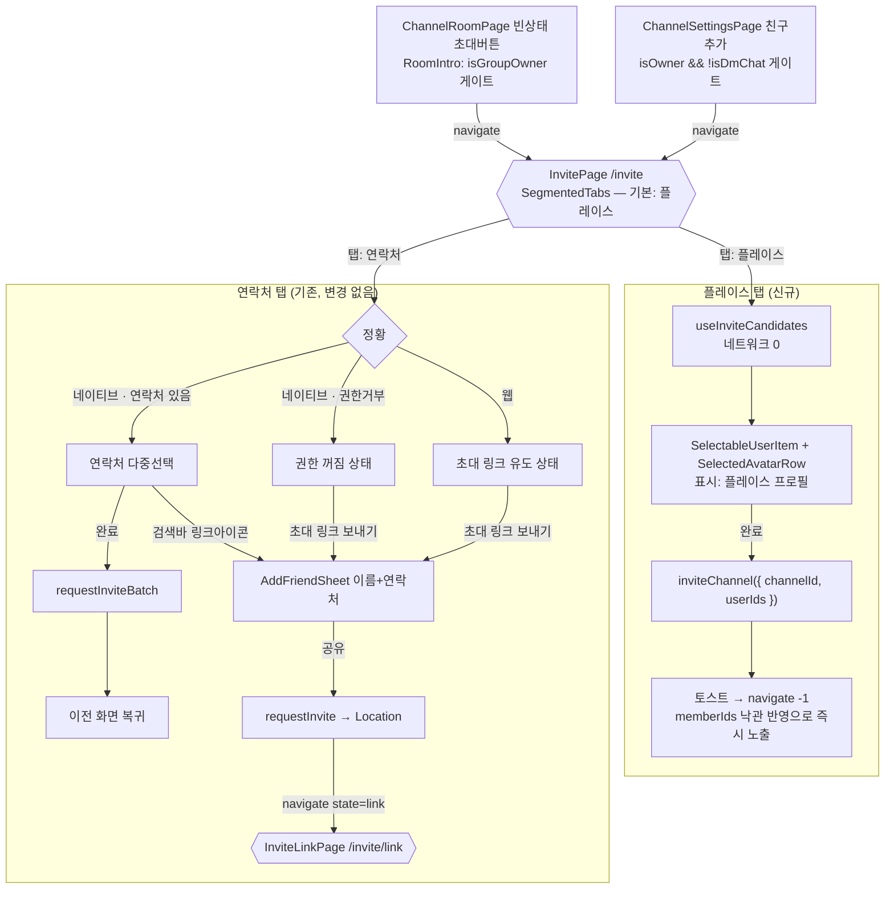
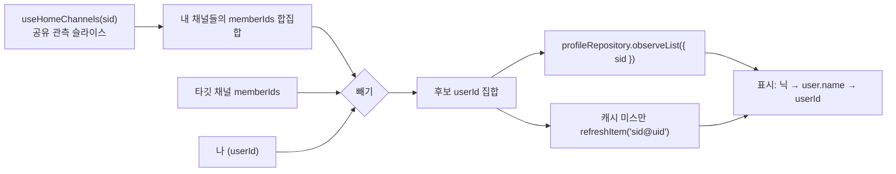

# 채널 초대 화면 (Channel Invite Page)

> 상태: Live · 최종 갱신: 2026-09-07
> · 관련 ADR: [ADR-0022](../../../../../docs/adr/0022-channel-invite-page-web-ui-kit.md)(페이지 전환·연락처 초대) ·
> [ADR-0075](../../../../../docs/adr/0075-web-channel-member-add-from-place.md)(플레이스 탭 — 이번 개정)

## 목적

채널에 친구를 초대하는 흐름을 **슬라이드업 다이얼로그에서 라우팅 페이지로 전환**하고,
Figma 개편 디자인(친구 선택 / 초대 링크 / 연락처 권한 꺼짐)을 `@chatic/web-ui-kit` 프리미티브로
반영한다. 초대 UI가 다이얼로그로 채널 룸·설정 페이지 안에 얹혀 있던 것을 독립 페이지로 분리해
딥링크·뒤로가기·전환 애니메이션과 자연스럽게 통합하는 것이 목표다.

이 페이지는 **성격이 다른 두 가지 "사람 넣기"를 한 자리에 담는다.**

| 탭                 | 대상                                          | 수단                            | 결과                      |
| ------------------ | --------------------------------------------- | ------------------------------- | ------------------------- |
| **플레이스**(기본) | 이미 이 플레이스에서 나와 방을 같이 쓰는 사람 | `channel.invite`                | 즉시 방에 들어온다        |
| 연락처             | 아직 계정이 없거나 이 클라우드 밖의 사람      | `user.invite-batch` → 초대 링크 | 링크를 받고 수락해야 한다 |

기본 탭이 플레이스인 이유는 두 가지다. 넣고 싶은 사람은 대개 **이미 여기 있고**, 웹에서는
연락처 접근 자체가 불가능해(§S5) 연락처 탭이 링크 유도 화면 하나로 끝난다.

## 설계 원칙

- **프레젠테이션은 web-ui-kit 프리미티브로 조립한다.** 재사용 가치가 분명한데 kit에 없는 것만
  신규 정의한다(선택 아바타 칩 행, 초대 링크 카드). 그 외 화면 로직은 feature 레이어 페이지에 둔다.
- **상단 헤더는 앱 `PageHeader`를 재사용한다.** 다른 채널 페이지(Room/Settings)와 동일하게
  [PageHeader.tsx](../../../src/app/ui/components/PageHeader.tsx)를 쓴다. 초대 링크 페이지의 X(닫기)
  어피어런스를 위해 `hideBack` 옵션만 최소 보강한다.
- **초대 링크 URL은 `requestInvite`(이름+전화번호) 응답의 `Location`으로만 얻는다.** 범용 채널
  초대링크 엔드포인트는 없다(ADR-0022). 따라서 링크 페이지 진입 전 항상 이름+연락처 입력 단계가 선행한다.
- **플랫폼 분기는 `isNative()` 하나로 파생한다.** 네이티브만 디바이스 연락처 다중 선택을 노출하고,
  웹은 연락처가 없으므로 초대 링크 흐름으로 유도한다.
- **선택 상한은 순수 100.** 현재 멤버 수와 무관하게 한 번에 최대 100명 선택. 방 정원 초과 여부는
  서버가 최종 검증한다.
- **기존 초대 로직은 재사용한다.** 연락처 페치·한국 번호 검증·배치 초대 훅은 그대로 두고 껍데기만
  페이지+kit로 재구성한다.
- **두 탭은 선택 상태도 확정 동작도 공유하지 않는다.** 플레이스 탭은 `channel.invite`로 즉시 넣고,
  연락처 탭은 링크를 만든다. 선택을 섞으면 하단 버튼 하나가 두 가지 다른 일을 하게 된다. 탭을
  바꾸면 그 탭의 선택만 남는다.
- **후보는 서버에 묻지 않고 이미 가진 캐시에서 만든다.** 서버에 유저 디렉터리가 없다(ADR-0075).
  플레이스의 채널 목록은 [`useHomeChannels`](../../../src/app/hooks/useHomeChannels.ts)가 이미
  공유 관측의 슬라이스로 주고 각 행이 `memberIds`를 들고 있으므로, **후보 집계에 추가 네트워크
  요청이 없다.** 채널마다 로스터를 fetch하는 데스크탑 방식(ADR-0072)을 그대로 옮기지 않는다.
- **사람은 플레이스 프로필로 그린다.** 전역 유저 레코드의 이름이 아니라 이 플레이스에서 쓰는
  닉·사진이다. 같은 사람이 피커에서와 설정의 멤버 목록에서 다른 이름으로 보이면 안 된다.
- **owner만 이 페이지에 온다.** 진입점 두 곳이 이미 그렇게 게이트돼 있다(§진입점). 페이지 안에서
  탭별로 권한을 다시 나누지 않는다.

## 범위

**포함**

- 친구 선택 페이지(`InvitePage`) — 라우트 `/channels/:channelId/invite`. 네이티브 연락처 다중 선택,
  선택 아바타 칩 행, 전체 선택 해제, 100 상한 토스트, 완료(배치 초대). 웹은 초대 링크 유도 상태.
- 초대 링크 페이지(`InviteLinkPage`) — 라우트 `/channels/:channelId/invite/link`. 초대 링크 카드,
  복사/공유, 복사/공유 완료 상태.
- 이름+연락처 입력 바텀시트(`AddFriendSheet`) 재사용 — 제출 시 자동 공유 대신 초대 링크 페이지로 이동.
- 진입점 2곳 재배선(`ChannelRoomPage`·`ChannelSettingsPage`: 다이얼로그 열기 → `navigate`).
- 연락처 권한 꺼짐 상태(네이티브) 디자인 반영.
- web-ui-kit 신규 컴포넌트(선택 아바타 칩 행·초대 링크 카드) + 링크 아이콘.
- i18n 키(ko/en 양쪽).

**이번 개정(ADR-0075)에서 추가**

- 페이지 상단 **탭 셸** — `플레이스`(기본) / `연락처`. web-ui-kit에 인페이지 세그먼트 탭 신설.
- **플레이스 탭** — 같은 플레이스에서 나와 방을 같이 쓰는 사람을 검색·다중선택해 `channel.invite`로
  즉시 추가. 표시는 플레이스 프로필(닉·사진).
- 후보 집계 훅 `useInviteCandidates` (apps/web feature 레이어).
- 연락처 탭은 **동작 변경 없이** 탭 안으로 들어간다.

**제외**

- 범용 채널 초대링크 전용 백엔드 엔드포인트 신설.
- 웹에서의 디바이스 연락처 접근(불가).
- `InviteCodeCard`(현재 미사용) 관련 변경.
- **DM에 사람 추가** — 1:1은 고정 편성(ADR-0032). 진입점의 `!isDmChat` 게이트가 그대로 막는다.
- **클라우드 전체·플레이스 멤버 전원 후보** — 전자는 다른 플레이스 사람의 프로필이 없고, 후자는
  서버에 멤버 목록 API가 없다(ADR-0075 결정 2).
- **후보 집계를 `libs/data`로 승격** — desktop-web을 갈아끼울 수 없어 공유가 성립하지 않는다.
  의도적 중복이며 갚는 시점은 ADR-0075 결정 5에 못박혀 있다.
- **초대 대기(미입장) 상태 표시** — join 카운터가 "초대됨"과 "나감"을 구분하지 못한다.

## 시나리오

### S1. 플레이스 탭 — 같은 플레이스 사람을 골라 즉시 추가 (신규)

1. owner가 설정의 `친구 추가` 또는 룸 빈 상태의 초대 버튼 → `navigate(/channels/:id/invite)`.
   페이지는 **`플레이스` 탭으로 열린다.**
2. 후보가 그려진다 — 이 채널의 `sid` 안에서 내가 참여 중인 **다른** 채널들의 멤버 합집합에서
   이 방의 현재 멤버와 나를 뺀 사람들. 각 행은 플레이스 프로필의 닉·사진으로 그리고, 프로필이
   아직 없으면 `유저 레코드 name → userId` 순으로 떨어진다.
3. 검색어를 넣으면 닉·이름·userId로 필터된다.
4. 탭해서 고르면 상단 `SelectedAvatarRow`에 칩이 쌓인다. 상한은 연락처 탭과 같은 100명.
5. `완료` → `inviteChannel({ channelId, userIds })` 한 번. 성공 토스트 후 이전 화면으로 복귀.
6. 돌아온 설정 화면의 `방 친구`에 방금 넣은 사람이 **바로** 보인다 — `inviteChannel`이
   `channel.memberIds`를 낙관적으로 갱신하고, 이름은 피커가 이미 캐시에 올려둔 프로필에서 온다.
7. 후보가 없으면(내 다른 방이 없거나 전원이 이미 이 방에 있음) 빈 안내와 함께
   `연락처` 탭으로 유도한다.

### S2. 연락처 탭 (네이티브) — 연락처 다중 선택 후 배치 초대

1. 채널 룸 빈 상태 또는 설정에서 `초대`/`친구 추가` 탭 → `navigate(/channels/:id/invite)`.
2. `InvitePage`가 `appBridge.getContacts()`로 연락처를 불러와 `SelectableUserItem` 목록 렌더.
   유효 한국 번호가 없는 연락처는 `disabled`. 검색바 오른쪽에는 버튼 **둘**이 나란히 선다 —
   연락처 설정(`openSettings`)과 초대 링크. 설정 버튼이 목록이 채워진 상태에서도 남는 이유는
   **부분 연락처 접근**이 잘린 목록을 돌려주면서 페이로드에 그 사실을 싣지 않기 때문이다.
   사용자는 목록이 전부인지 알 수 없고, 이 버튼이 유일한 탈출구다.
3. 사용자가 친구를 탭해 선택 → 상단에 `SelectedAvatarRow`(제거 가능 칩) 표시, 헤더 카운트 `n/100`.
4. 100명 도달 후 추가 선택 시도 → "100명 까지 초대 가능해요" 토스트, 선택 무시.
5. `완료` 탭 → 선택 1명=단건, 2명+=배치 초대 요청. 성공 토스트 후 이전 화면으로 복귀.

### S3. 초대 링크 (네이티브·웹 공통 마무리)

1. 친구 선택 페이지 검색바의 링크 아이콘(네이티브) 또는 웹 진입 상태의 `초대 링크 보내기` 탭
   → `AddFriendSheet`(이름+연락처) 등장. **네이티브·웹·운영/개발 빌드를 가리지 않는다** — 한때
   운영 앱을 문자 전송만으로 제한한 적이 있으나(임시 기획) 해제됐다.
2. 이름·번호 작성 후 공유 버튼 → `requestInvite` 네트워크 콜(자동 공유하지 않음) → 응답 `Location` 링크 획득.
3. 시트를 닫고 `navigate(/channels/:id/invite/link, { state: { inviteLink, channelName, avatar } })`.
4. `InviteLinkPage`가 초대 링크 카드에 그룹 이름·URL 전체를 노출.
5. 링크 아이콘 탭 → 클립보드 복사 → "링크 복사 완료" 토스트.
6. `링크 공유하기` 탭 → 네이티브 OS 공유 시트 / 웹 클립보드 복사 → 버튼 `✓ 공유 완료` 상태.

### S4. 연락처 탭 (네이티브) — 권한 꺼짐

1. `getContacts()`가 빈 목록/거부 → 권한 꺼짐 상태 렌더("연락처 접근 허용이 꺼져 있어요" + 안내 +
   `초대 링크 보내기` 버튼).
2. 안내 탭 → OS 설정 열기(`appBridge.openSettings()`). `초대 링크 보내기` 탭 → S2 흐름.

### S5. 웹 진입

1. 진입점 탭 → `navigate(/channels/:id/invite)`. **`플레이스` 탭이 기본**이므로 웹에서도 첫 화면이
   고를 것이 있는 상태로 열린다(S1).
2. `연락처` 탭으로 넘어가면 웹은 디바이스 연락처가 없으므로 초대 링크 유도 상태(S4와 같은 레이아웃,
   권한 문구 대신 웹 안내)로 렌더하고 `초대 링크 보내기`로 S3 흐름을 탄다.

> 개정 전에는 웹 진입이 곧바로 이 링크 유도 화면이었다. 플레이스 탭이 기본이 되면서 **웹의 첫
> 화면이 빈손이 아니게 되는 것**이 이번 변경의 가장 큰 체감 차이다.

## 다이어그램

### 후보 집계 (S1 2단계)

## 상세 구현

### 탭 셸 (신규)

`InvitePage`가 `PageHeader` 아래에 세그먼트 탭을 두고 본문을 갈아끼운다. 라우트는 하나로 유지한다 —
탭은 URL에 남기지 않는다. 딥링크로 특정 탭을 열 요구가 없고, 남기면 뒤로가기가 탭 전환을
되감아 페이지 이탈과 헷갈린다.

- `activeTab: 'place' | 'contact'`, 초기값 `'place'`.
- 선택 상태는 탭마다 별개다. 두 탭이 서로 다른 서브트리라 상대 탭의 선택은 애초에 존재하지 않는다.
- 하단 `FloatingButton`은 각 탭이 자기 것을 그린다.
- **연락처는 탭에 들어와야 불러온다.** `appBridge.getContacts()`는 OS 권한 팝업을 띄우므로
  마운트 시 호출하면 **연락처를 쓸 생각도 없는 사용자에게 권한을 묻게 된다** — 기본 탭이
  플레이스가 되면서 생긴 문제다.
  트리거는 `activeTab`이 아니라 **한 번이라도 열렸는가**(`contactsRequested`)다. 탭 값에 직접
  의존시키면 탭을 되돌릴 때 cleanup이 진행 중인 요청을 취소하고, 그 사이 응답이 오면 아무 상태도
  세팅되지 않은 채 재요청 가드만 남아 **연락처 탭이 영영 빈 화면**이 된다. 이 플래그는
  false→true로 한 번만 바뀌므로 effect도 한 번 돌고 cleanup은 언마운트에서만 실행된다.

### web-ui-kit 신규 — `SegmentedTabs`

kit에 인페이지 탭이 없다. `FloatingTabBar`는 하단 내비게이션이라 성격이 다르고, 유일한 인페이지
선례는 디버그 오버레이의 임시 버튼(`features/debug/overlay/MiniPanel.tsx:79`)이라 프로덕션 패턴이
아니다. 화면에서 임기응변하지 않는다는 원칙에 따라 kit에 신설한다.

- `composites/navigation/SegmentedTabs.tsx` — Props: `items: { id; label }[]`, `value`, `onChange`.
- 접근성: `role="tablist"` / `role="tab"` + `aria-selected`, 좌우 화살표 이동.
- **디자인 출처가 없다** — Figma 노드를 받지 못했다(§리스크). 기존 토큰(`text-label`,
  `bg-muted`, `border-focus-border`)으로 조립하고 디자인이 오면 그 컴포넌트만 고친다.

### 후보 집계 — `useInviteCandidates` (신규)

`features/channels/hooks/useInviteCandidates.ts`. 시그니처: `(channelId, sid) => { candidates, isLoading }`.

**네트워크 요청을 내지 않는다.** 데스크탑(ADR-0072)은 채널마다 로스터를 fetch했지만 웹은 그럴
필요가 없다 —

1. [`useHomeChannels(sid)`](../../../src/app/hooks/useHomeChannels.ts)가 이 플레이스의 채널을 준다.
   자체 옵저버가 아니라 앱의 단일 클라우드 관측을 슬라이스한 것이라 구독 비용이 0이다.
2. 각 `DomainChannel.memberIds`(SDK `ChannelView`에서 스프레드로 실려 옴)를 합집합한다.
3. 타깃 채널의 `memberIds`와 내 `userId`를 뺀다.

제외 소스는 **둘**이다 — 합집합에서 타깃을 제외할 때 타깃 채널 행의 `memberIds`를 쓰고,
합집합을 만들 때 타깃 채널 자체를 순회에서 뺀다. 한쪽이 비어도 이미 방에 있는 사람이 후보로
새지 않는다.

`memberIds`는 옵셔널이라 `detail: true`로 채워지지 않은 행이 섞일 수 있다. 그런 행은 조용히
건너뛴다 — 후보가 조금 적은 것이 잘못된 후보를 그리는 것보다 낫다. 브라우저 실측에서 캐시의
채널 행들은 `memberIds`를 싣고 있었다(빈 배열인 self 채널 포함).

### 표시 — 플레이스 프로필

`useChannelProfiles`와 같은 기계를 쓴다: `profileRepository.observeList({ sid })`로 관찰하고,
후보 중 캐시에 없는 사람만 `refreshItem('${sid}@${uid}')`로 한 번 채운다. 다만 **방 화면의 20초가
아니라 리스트 화면용 `LIST_PROFILE_SYNC_INTERVAL_MS`(60초)** 로 돈다 — 후보 한 명당 동기화 타깃이
하나씩 붙는데 이 풀은 내가 속한 모든 방의 합집합이라 어떤 멤버 목록보다 크다. 고르는 도중 닉이
바뀌는 것은 중요하지 않고, 첫 그림은 어차피 원샷 부트스트랩이 담당한다. 폴백 체인은
`ChannelSettingsPage`의 멤버 행과 **동일하게** `프로필 닉 → 유저 레코드 name → userId`.

가운데 단계(유저 레코드 `name`)는 후보별 **`cacheRead` 원샷**으로 읽는다. `observeList`를 쓰지
않는 이유는 타입이 강제한다 — `ChannelListUserRequestData`가 `channelId`를 필수로 요구하는데
후보는 여러 채널에서 오므로 이들을 한 번에 덮는 스코프 쿼리가 없다. 관측도 네트워크도 아닌
캐시 읽기라 후보 집합이 바뀔 때만 돈다.

검색은 닉·유저 이름·userId를 모두 매칭한다 — 닉을 모르는 상대의 id를 붙여넣는 경로가 남는다.

### 확정 — `inviteChannel`

`useChannelMutations().inviteChannel({ channelId, userIds })` 한 번. 리포지토리가 낙관적 쓰기와
롤백을 이미 갖고 있으므로(ADR-0072가 넣음) 화면은 성공/실패만 다룬다.

유저 캐시에 직접 쓰지 않는다 — 웹의 멤버 목록은 `channel.memberIds`로 시드되고 그 필드는
`inviteChannel`이 낙관적으로 갱신한다(ADR-0075 결정 6).

### 라우팅

- [paths.ts:42-45](../../../src/app/routes/paths.ts) `ROUTES.channels`에 추가:
    - `invite: (channelId) => \`/channels/${channelId}/invite\``
    - `inviteLink: (channelId) => \`/channels/${channelId}/invite/link\``
- [channels/index.tsx](../../../src/app/features/channels/index.tsx)에 두 `<Route>` 추가
  (`:channelId/invite`, `:channelId/invite/link`), `pages/index.ts`에 두 페이지 export.

### 페이지 (feature 레이어)

- [`pages/InvitePage.tsx`](../../../src/app/features/channels/pages/InvitePage.tsx) —
  `useParams<{ channelId }>`, `PageHeader`(back), `SearchInput`(trailing=링크 버튼),
  `SelectableUserItem` 목록, `SelectedAvatarRow`, 하단 `완료` 버튼. `isNative()` 분기로 연락처/웹 유도/권한거부 렌더.
  이 화면이 흡수한 `InviteFriendsDialog`는 이전이 끝나면서 삭제됐다.
    - 선택 상한: `MAX_INVITE_SELECTION = 100`. 초과 선택 시 토스트(`memberCount + 선택 ≤ 100` 정원 가드).
    - 배치 초대: `handleBatchInvite` →
      [`useCreateInviteBatch`](../../../src/app/features/channels/hooks/useCreateInviteBatch.ts)의
      `createBatchInvite`.
- `pages/InviteLinkPage.tsx` (신규) — `useLocation().state`에서 `{ inviteLink, channelName, avatar }` 수신.
  state가 없으면(리로드 등) 채널 룸으로 `navigate(replace)`. `PageHeader`(hideBack + rightAction=X),
  `InviteLinkCard`, 하단 `링크 공유하기` 버튼. 공유는 native `appBridge.openShareSheet` / 웹
  `copyMessageToClipboard`.

### 연락처 필드 계약과 폴백

연락처 앱의 필드는 **하나도 필수가 아니고**, 두 플랫폼이 "비어 있음"을 다르게 표현한다.
`react-native-contacts` 8.0.10 네이티브 소스 기준:

| 필드                                                           | Android (`ContactsProvider.java`)    | iOS (`RCTContacts.mm`)                                                                                  |
| -------------------------------------------------------------- | ------------------------------------ | ------------------------------------------------------------------------------------------------------- |
| `displayName`                                                  | 구조화 이름 → 없으면 조직명으로 채움 | **키를 아예 보내지 않는다**                                                                             |
| `givenName`                                                    | 비면 `displayName`으로 대체(:624)    | 값이 nil이면 **키를 생략**(:337)                                                                        |
| `familyName` / `middleName` / `company` / `jobTitle`           | 채움                                 | nil이면 **키를 생략**                                                                                   |
| `backTitle` · `isStarred` · `prefix` · `suffix` · `department` | 채움                                 | **보내지 않는다**                                                                                       |
| `birthday.year`                                                | 채움                                 | 연도 없이 저장했으면 **생략**                                                                           |
| 별명(nickname)                                                 | —                                    | 라이브러리가 `CNContactNicknameKey`를 **fetch하지 않는다** — 별명만 저장한 연락처는 이름을 알 길이 없다 |

그래서 규칙이 둘로 나뉜다.

**① 앱은 정규화만 한다** —
[`toContactInfo`](../../../../mobile/src/app/utils/contactInfo.ts)가 누락 키를 전부 기본값으로
채운다. `ContactInfo`는 대부분의 필드를 non-optional로 선언하는데 iOS 페이로드는 그보다 좁아서,
정규화가 없으면 웹은 타입이 `string`이라고 약속한 자리에서 `undefined`를 읽는다.
표시 이름을 **지어내지는 않는다** — 어느 조각이 앞에 오는지는 표현 규칙이고, 그건 웹이 한 곳에서 소유한다.

**② 웹이 이름을 만든다** —
[`resolveContactName`](../../../src/app/features/channels/utils/deviceContact.ts)의 폴백 체인:

`displayName` → 이름 조각 조합 → `company` → **전화번호** → `inviteFriends.unnamedContact`

- 조각 조합은 한글·한자·가나가 섞여 있으면 `성+중간+이름`을 **공백 없이**, 아니면 라틴 관례대로
  `given middle family`를 공백으로 잇는다.
- 번호는 자리를 메우는 문구가 아니라 **실제 답**이다. 사용자가 걸 번호이고, 그것만으로 누구 행인지
  알아본다.
- 마지막 라벨(`unnamedContact`)은 **방어용이고 실제로는 도달하지 않는다.** 조건이 "이름도 회사도
  번호도 없음"인데, 아래 ④가 그런 연락처를 목록에서 빼기 때문이다. 남겨 두는 이유는 빈 행이 다시
  렌더되는 것이 이 체인이 없애려던 바로 그 버그라서 — 누군가 이 함수가 이름 붙일 수 없는 연락처를
  목록에 올린다면, 고장이 아니라 의도로 읽혀야 한다.
- 검색(`contactSearchText`)은 회사명과 번호(표시형·숫자만)까지 훑는다. 화면에 보이는 라벨로 검색했는데
  안 나오는 것은 그 자체로 버그다.

**③ 번호는 전부 훑는다** — `resolveContactPhone`은 저장된 번호를 **처음부터 끝까지** 보고 첫 유효
한국 휴대폰을 고른다. 첫 칸만 읽던 이전 구현은 집·회사 번호가 앞에 있는 연락처를 "번호 없음"으로
취급해 초대 자체를 막았다. 연락처 앱은 번호 순서를 보장하지 않는다. 반환은 E.164다(위 §S1 근거와 동일).

**④ 번호가 없는 연락처는 목록에서 뺀다** — `listedContacts`가 `resolveContactDisplayPhone(c) !== ''`로
거른다. 초대는 번호로 나가므로 그런 행은 초대할 수도, 번호로 알아볼 수도 없다 — 눌리지 않는 행을
남기는 것보다 안 보이는 게 낫다. 텔레그램도 전화번호가 계정 식별자라 번호 없는 연락처는 애초에
목록에 들어오지 않는다.

판정은 **라벨을 만드는 함수와 같은 것**을 쓴다. "보여줄 번호가 없다"와 "목록에서 뺀다"가 어긋나면
안 되기 때문이다.

**유효한 한국 휴대폰이 아닌 번호(집전화·해외번호)는 걸러내지 않는다.** 그 행은 번호로 식별되고 초대만
비활성이다 — "저장돼 있는데 안 보인다"와 "초대할 수 없다"는 사용자에게 다른 이야기다. 목록이 이 필터로
비게 되면(받은 연락처 전부가 번호 없음) 빈 패널 대신 `inviteFriends.noInvitableContacts`를 띄운다.
검색바와 링크 초대는 그대로 남는다 — 부분 연락처 접근으로 잘린 목록의 탈출구가 링크 초대이기 때문이다.

### 바텀시트 동작 변경

- [AddFriendSheet.tsx:96-120](../../../src/app/features/channels/components/AddFriendSheet.tsx) `handleShare`:
  현재 `createSingleInvite`(자동 공유 후 닫힘) → **링크만 획득 후 초대 링크 페이지로 이동**하도록 변경.
- [useCreateInviteBatch.ts](../../../src/app/features/channels/hooks/useCreateInviteBatch.ts)에 `requestInviteLink`
  추가 — `requestInvite`([useUserMutations.ts:26](../../../src/app/features/channels/hooks/useUserMutations.ts))
  응답의 `Location`을 **공유하지 않고 문자열로 반환**. 기존 `createSingleInvite`(자동 공유)는 유지하되
  신규 흐름에서는 사용하지 않는다.

### 진입점 재배선

- [ChannelRoomPage.tsx:401](../../../src/app/features/channels/pages/ChannelRoomPage.tsx) `setInviteDialogOpen(true)`
  → `navigate(ROUTES.channels.invite(stableChannelId))`. `inviteDialogOpen` state(:51)와 다이얼로그 렌더(:545) 제거.
- [ChannelSettingsPage.tsx:174](../../../src/app/features/channels/pages/ChannelSettingsPage.tsx) `openDialog('invite')`
  → `navigate(ROUTES.channels.invite(channelId))`. `DialogType`에서 `'invite'` 제거(:22), 다이얼로그 렌더(:224) 제거.

### web-ui-kit 신규 — 선택 칩 · 링크 카드

- `composites/list/SelectedAvatarRow.tsx` — 가로 스크롤 제거 가능 아바타 칩 행.
  Props: `items: { id; name; avatarSrc? }[]`, `onRemove(id)`. `ProfileAvatar` + X 뱃지 + 이름 라벨.
- `composites/list/InviteLinkCard.tsx` — 그룹 아바타 + 이름 + URL 전체 노출 + 우측 링크/복사 아이콘 버튼.
  Props: `name; url; avatarSrc?; onCopy()`.
- 각 `composites/list/index.ts` 및 `composites/index.ts` barrel에 export.

### 아이콘

- [resources/icons/index.ts](../../../../../libs/web-ui-kit/src/resources/icons/index.ts)에 `IconLink` semantic
  alias 추가(lucide `Link2`, 없으면 Figma SVG 컴포넌트). 검색바 링크 버튼 + 초대 링크 카드에서 사용.

### 헤더 보강

- [PageHeader.tsx:7-11](../../../src/app/ui/components/PageHeader.tsx)에 `hideBack?: boolean` 추가.
  true면 좌측 back 버튼 미렌더(초대 링크 페이지에서 X를 `rightAction`으로 사용).

### i18n

- [ko/translation.json:776-](../../../public/locales/ko/translation.json) 및 en 양쪽에 추가/조정:
    - `inviteFriends.selectTitle` "친구 선택", `inviteFriends.deselectAll` "전체 선택 해제",
      `inviteFriends.limitToast` "100명 까지 초대 가능해요", `inviteFriends.done` "완료",
      `inviteFriends.sendLink` "초대 링크 보내기".
    - `inviteLink.title` "초대 링크", `inviteLink.share` "링크 공유하기", `inviteLink.shared` "공유 완료",
      `inviteLink.copyDone` "링크 복사 완료".

## 검증 방법

### 플레이스 탭 (통과 중)

`npx nx test web` 247 스위트 / 2405 테스트, `npx nx test web-ui-kit` 72 스위트 / 343 테스트 그린.

- [`SegmentedTabs.test.tsx`](../../../../../libs/web-ui-kit/src/composites/navigation/SegmentedTabs.test.tsx) (10) —
  렌더·`aria-selected`·roving `tabIndex`·화살표 양끝 감김·Home/End·무관한 키 무시·목록에 없는 `value`·화살표 이동 시 포커스 따라가기.
- [`useInviteCandidates.test.ts`](../../../src/app/features/channels/hooks/useInviteCandidates.test.ts) (11) —
  합집합, 타깃 멤버 제외, 나 제외, 타깃 행을 출처로 쓰지 않음, `memberIds` 없는 행 건너뛰기,
  타깃 행에 `memberIds`가 없어도 새지 않음, 빈 id·중복 처리, 인자 부재, `userId` 부재.
- [`PlaceInviteTab.test.tsx`](../../../src/app/features/channels/components/PlaceInviteTab.test.tsx) (18) —
  폴백 3단(닉 → 유저 name → id, 공백 닉 포함), 아바타 전달, 선택·상한 토스트, 닉/ id 검색,
  선택 고정, 한 번의 `inviteChannel({ channelId, userIds })`, 성공 토스트 + `navigate(-1)`,
  실패 시 잔류, 후보 0 안내, 로딩 중에는 안내 억제, **로딩 중·무검색 시 '검색 결과 없음' 미표시**.
- `InvitePage.test.tsx` +8 — 기본 탭이 플레이스, `sid` 전달, 탭 전환,
  **플레이스 탭에 머무는 동안 `getContacts()` 미호출**, 탭 진입 시 1회 호출, 재방문 시 재호출 없음,
  **응답 전에 탭을 되돌려도 연락처가 결국 도착**(위 레이스 회귀 방어 — 뮤테이션으로 확인),
  웹에서도 기본 탭이 플레이스. 기존 18개는 연락처 탭으로 전환만 거쳐 그대로 통과한다.

### 브라우저 실측 (2026-09-07)

게스트 세션, 375×812. **확인됨**: 탭 셸이 `role="tab"` + `aria-selected` + roving `tabIndex`로
렌더되고 플레이스가 기본, 후보 0 안내와 연락처 탭 유도 문구, 연락처 탭 전환 후 기존 링크 유도
화면이 그대로. 콘솔 에러는 `clouds/0/list` CORS(선재, 이 변경과 무관)뿐.

**확인 못 함 — 후보가 있는 상태.** 캐시에 가짜 채널을 심어도 `refreshList`가 서버 스냅샷에 없는
행을 prune해 매번 지운다(의도된 동작). 실제 후보 목록·초대 왕복은 계정 둘이 필요하며, 그 부분은
위 유닛 테스트가 덮는다.

### 기존 연락처 흐름 (통과 중)

- **유닛 테스트**(jest, 콜로케이트 `*.test.tsx`) — 전부 통과:
    - [SelectedAvatarRow.test.tsx](../../../../../libs/web-ui-kit/src/composites/list/SelectedAvatarRow.test.tsx) —
      렌더/`onRemove` 콜백/빈 목록 미렌더.
    - [InviteLinkCard.test.tsx](../../../../../libs/web-ui-kit/src/composites/list/InviteLinkCard.test.tsx) —
      URL 노출/`onCopy` 콜백.
    - [InvitePage.test.tsx](../../../src/app/features/channels/pages/InvitePage.test.tsx) — 연락처 렌더,
      1명=단건/2명+=배치 호출 후 `navigate(-1)`, 권한 거부 배너, 100 선택 상한 토스트, 웹 가이드 분기.
      `describe('contacts that carry no display name')`이 iOS 페이로드 모양(성만·회사만·번호만·집전화
      우선)과 목록 제외 규칙(번호 없음은 숨김, 집전화만 있으면 남김, 전부 번호 없으면 안내 문구)을 덮는다.
    - [deviceContact.test.ts](../../../src/app/features/channels/utils/deviceContact.test.ts) — 이름 폴백
      체인, 번호 선택(저장 형태 매트릭스), 표시 포맷, 검색 텍스트.
    - [contactInfo.test.ts](../../../../mobile/src/app/utils/contactInfo.test.ts) — 앱 쪽 누락 키 정규화.
    - [AddFriendSheet.test.tsx](../../../src/app/features/channels/components/AddFriendSheet.test.tsx) —
      공유 제출 시 `requestInviteLink` 호출 + 초대 링크 페이지로 `navigate`(state 포함).
    - [ChannelSettingsPage.test.tsx](../../../src/app/features/channels/pages/ChannelSettingsPage.test.tsx) —
      친구 추가 행 탭 시 `/channels/ch1/invite`로 이동.
    - 실행: `npx nx test web --testPathPatterns=features/channels`.
- **수동 확인**(인증 세션 필요, 웹 프리뷰로는 네이티브 연락처·실제 초대 API 미실행): 네이티브 연락처 선택→배치 초대,
  웹 초대 링크 흐름, 권한 꺼짐 상태, 100 상한 토스트, 링크 복사/공유 토스트 및 버튼 상태.
- **참고**: worktree에는 `@nx/react/typings/*`가 없어 `nx typecheck`가 환경상 실패한다(코드 무관). jest는
  main-tree node_modules로 정상 실행됨.
