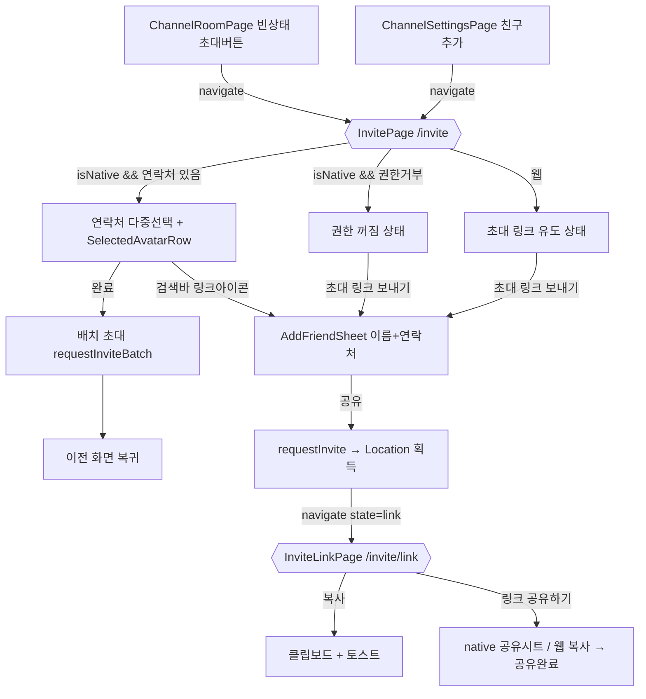

# 채널 초대 화면 (Channel Invite Page)

> 상태: Live · 최종 갱신: 2026-07-20 · 관련 ADR: [ADR-0022](../../../../../docs/adr/0022-channel-invite-page-web-ui-kit.md)

## 목적

채널에 친구를 초대하는 흐름을 **슬라이드업 다이얼로그에서 라우팅 페이지로 전환**하고,
Figma 개편 디자인(친구 선택 / 초대 링크 / 연락처 권한 꺼짐)을 `@chatic/web-ui-kit` 프리미티브로
반영한다. 초대 UI가 다이얼로그로 채널 룸·설정 페이지 안에 얹혀 있던 것을 독립 페이지로 분리해
딥링크·뒤로가기·전환 애니메이션과 자연스럽게 통합하는 것이 목표다.

## 설계 원칙

- **프레젠테이션은 web-ui-kit 프리미티브로 조립한다.** 재사용 가치가 분명한데 kit에 없는 것만
  신규 정의한다(선택 아바타 칩 행, 초대 링크 카드). 그 외 화면 로직은 feature 레이어 페이지에 둔다.
- **상단 헤더는 앱 `PageHeader`를 재사용한다.** 다른 채널 페이지(Room/Settings)와 동일하게
  [PageHeader.tsx](../../../src/app/ui/components/PageHeader.tsx)를 쓴다. 초대 링크 페이지의 X(닫기)
  어피어런스를 위해 `hideBack` 옵션만 최소 보강한다.
- **초대 링크 URL은 `requestInvite`(이름+전화번호) 응답의 `Location`으로만 얻는다.** 범용 채널
  초대링크 엔드포인트는 없다(ADR-0022). 따라서 링크 페이지 진입 전 항상 이름+연락처 입력 단계가 선행한다.
- **플랫폼 분기는 `isNative()` 하나로 파생한다.** 네이티브만 디바이스 연락처 다중 선택을 노출하고,
  웹은 연락처가 없으므로 초대 링크 흐름으로 유도한다.
- **선택 상한은 순수 100.** 현재 멤버 수와 무관하게 한 번에 최대 100명 선택. 방 정원 초과 여부는
  서버가 최종 검증한다.
- **기존 초대 로직은 재사용한다.** 연락처 페치·한국 번호 검증·배치 초대 훅은 그대로 두고 껍데기만
  페이지+kit로 재구성한다.

## 범위

**포함**

- 친구 선택 페이지(`InvitePage`) — 라우트 `/channels/:channelId/invite`. 네이티브 연락처 다중 선택,
  선택 아바타 칩 행, 전체 선택 해제, 100 상한 토스트, 완료(배치 초대). 웹은 초대 링크 유도 상태.
- 초대 링크 페이지(`InviteLinkPage`) — 라우트 `/channels/:channelId/invite/link`. 초대 링크 카드,
  복사/공유, 복사/공유 완료 상태.
- 이름+연락처 입력 바텀시트(`AddFriendSheet`) 재사용 — 제출 시 자동 공유 대신 초대 링크 페이지로 이동.
- 진입점 2곳 재배선(`ChannelRoomPage`·`ChannelSettingsPage`: 다이얼로그 열기 → `navigate`).
- 연락처 권한 꺼짐 상태(네이티브) 디자인 반영.
- web-ui-kit 신규 컴포넌트(선택 아바타 칩 행·초대 링크 카드) + 링크 아이콘.
- i18n 키(ko/en 양쪽).

**제외**

- 범용 채널 초대링크 전용 백엔드 엔드포인트 신설.
- 웹에서의 디바이스 연락처 접근(불가).
- `InviteCodeCard`(현재 미사용) 관련 변경.

## 시나리오

### S1. 네이티브 — 연락처 다중 선택 후 배치 초대

1. 채널 룸 빈 상태 또는 설정에서 `초대`/`친구 추가` 탭 → `navigate(/channels/:id/invite)`.
2. `InvitePage`가 `appBridge.getContacts()`로 연락처를 불러와 `SelectableUserItem` 목록 렌더.
   유효 한국 번호가 없는 연락처는 `disabled`.
3. 사용자가 친구를 탭해 선택 → 상단에 `SelectedAvatarRow`(제거 가능 칩) 표시, 헤더 카운트 `n/100`.
4. 100명 도달 후 추가 선택 시도 → "100명 까지 초대 가능해요" 토스트, 선택 무시.
5. `완료` 탭 → 선택 1명=단건, 2명+=배치 초대 요청. 성공 토스트 후 이전 화면으로 복귀.

### S2. 초대 링크 (네이티브·웹 공통 마무리)

1. 친구 선택 페이지 검색바의 링크 아이콘(네이티브) 또는 웹 진입 상태의 `초대 링크 보내기` 탭
   → `AddFriendSheet`(이름+연락처) 등장.
2. 이름·번호 작성 후 공유 버튼 → `requestInvite` 네트워크 콜(자동 공유하지 않음) → 응답 `Location` 링크 획득.
3. 시트를 닫고 `navigate(/channels/:id/invite/link, { state: { inviteLink, channelName, avatar } })`.
4. `InviteLinkPage`가 초대 링크 카드에 그룹 이름·URL 전체를 노출.
5. 링크 아이콘 탭 → 클립보드 복사 → "링크 복사 완료" 토스트.
6. `링크 공유하기` 탭 → 네이티브 OS 공유 시트 / 웹 클립보드 복사 → 버튼 `✓ 공유 완료` 상태.

### S3. 네이티브 — 연락처 권한 꺼짐

1. `getContacts()`가 빈 목록/거부 → 권한 꺼짐 상태 렌더("연락처 접근 허용이 꺼져 있어요" + 안내 +
   `초대 링크 보내기` 버튼).
2. 안내 탭 → OS 설정 열기(`appBridge.openSettings()`). `초대 링크 보내기` 탭 → S2 흐름.

### S4. 웹 진입

1. 진입점 탭 → `navigate(/channels/:id/invite)`. 웹은 연락처가 없으므로 초대 링크 유도 상태(S3와 동일한
   레이아웃, 권한 문구 대신 웹 안내)로 렌더하고 `초대 링크 보내기`로 S2 흐름 유도.

## 다이어그램

## 상세 구현

### 라우팅

- [paths.ts:42-45](../../../src/app/routes/paths.ts) `ROUTES.channels`에 추가:
    - `invite: (channelId) => \`/channels/${channelId}/invite\``
    - `inviteLink: (channelId) => \`/channels/${channelId}/invite/link\``
- [channels/index.tsx](../../../src/app/features/channels/index.tsx)에 두 `<Route>` 추가
  (`:channelId/invite`, `:channelId/invite/link`), `pages/index.ts`에 두 페이지 export.

### 페이지 (feature 레이어)

- `pages/InvitePage.tsx` (신규) — 기존 [InviteFriendsDialog.tsx](../../../src/app/features/channels/components/InviteFriendsDialog.tsx)의
  로직을 흡수. `useParams<{ channelId }>`, `PageHeader`(back), `SearchInput`(trailing=링크 버튼),
  `SelectableUserItem` 목록, `SelectedAvatarRow`, 하단 `완료` 버튼. `isNative()` 분기로 연락처/웹 유도/권한거부 렌더.
    - 선택 상한: `MAX_INVITE_SELECTION = 100`. 초과 선택 시 토스트(기존 `memberCount + 선택 ≤ 100` 정원 가드
      [InviteFriendsDialog.tsx:189](../../../src/app/features/channels/components/InviteFriendsDialog.tsx) 대체).
    - 배치 초대: 기존 `handleBatchInvite`
      ([:174](../../../src/app/features/channels/components/InviteFriendsDialog.tsx)) 로직 이식.
- `pages/InviteLinkPage.tsx` (신규) — `useLocation().state`에서 `{ inviteLink, channelName, avatar }` 수신.
  state가 없으면(리로드 등) 채널 룸으로 `navigate(replace)`. `PageHeader`(hideBack + rightAction=X),
  `InviteLinkCard`, 하단 `링크 공유하기` 버튼. 공유는 native `appBridge.openShareSheet` / 웹
  `copyMessageToClipboard`.

### 바텀시트 동작 변경

- [AddFriendSheet.tsx:96-120](../../../src/app/features/channels/components/AddFriendSheet.tsx) `handleShare`:
  현재 `createSingleInvite`(자동 공유 후 닫힘) → **링크만 획득 후 초대 링크 페이지로 이동**하도록 변경.
- [useCreateInviteBatch.ts](../../../src/app/features/channels/hooks/useCreateInviteBatch.ts)에 `requestInviteLink`
  추가 — `requestInvite`([useUserMutations.ts:26](../../../src/app/features/channels/hooks/useUserMutations.ts))
  응답의 `Location`을 **공유하지 않고 문자열로 반환**. 기존 `createSingleInvite`(자동 공유)는 유지하되
  신규 흐름에서는 사용하지 않는다.

### 진입점 재배선

- [ChannelRoomPage.tsx:401](../../../src/app/features/channels/pages/ChannelRoomPage.tsx) `setInviteDialogOpen(true)`
  → `navigate(ROUTES.channels.invite(stableChannelId))`. `inviteDialogOpen` state(:51)와 다이얼로그 렌더(:545) 제거.
- [ChannelSettingsPage.tsx:174](../../../src/app/features/channels/pages/ChannelSettingsPage.tsx) `openDialog('invite')`
  → `navigate(ROUTES.channels.invite(channelId))`. `DialogType`에서 `'invite'` 제거(:22), 다이얼로그 렌더(:224) 제거.

### web-ui-kit 신규

- `composites/list/SelectedAvatarRow.tsx` — 가로 스크롤 제거 가능 아바타 칩 행.
  Props: `items: { id; name; avatarSrc? }[]`, `onRemove(id)`. `ProfileAvatar` + X 뱃지 + 이름 라벨.
- `composites/list/InviteLinkCard.tsx` — 그룹 아바타 + 이름 + URL 전체 노출 + 우측 링크/복사 아이콘 버튼.
  Props: `name; url; avatarSrc?; onCopy()`.
- 각 `composites/list/index.ts` 및 `composites/index.ts` barrel에 export.

### 아이콘

- [resources/icons/index.ts](../../../../../libs/web-ui-kit/src/resources/icons/index.ts)에 `IconLink` semantic
  alias 추가(lucide `Link2`, 없으면 Figma SVG 컴포넌트). 검색바 링크 버튼 + 초대 링크 카드에서 사용.

### 헤더 보강

- [PageHeader.tsx:7-11](../../../src/app/ui/components/PageHeader.tsx)에 `hideBack?: boolean` 추가.
  true면 좌측 back 버튼 미렌더(초대 링크 페이지에서 X를 `rightAction`으로 사용).

### i18n

- [ko/translation.json:776-](../../../public/locales/ko/translation.json) 및 en 양쪽에 추가/조정:
    - `inviteFriends.selectTitle` "친구 선택", `inviteFriends.deselectAll` "전체 선택 해제",
      `inviteFriends.limitToast` "100명 까지 초대 가능해요", `inviteFriends.done` "완료",
      `inviteFriends.sendLink` "초대 링크 보내기".
    - `inviteLink.title` "초대 링크", `inviteLink.share` "링크 공유하기", `inviteLink.shared` "공유 완료",
      `inviteLink.copyDone` "링크 복사 완료".

## 검증 방법

- **유닛 테스트**(jest, 콜로케이트 `*.test.tsx`) — 전부 통과:
    - [SelectedAvatarRow.test.tsx](../../../../../libs/web-ui-kit/src/composites/list/SelectedAvatarRow.test.tsx) —
      렌더/`onRemove` 콜백/빈 목록 미렌더.
    - [InviteLinkCard.test.tsx](../../../../../libs/web-ui-kit/src/composites/list/InviteLinkCard.test.tsx) —
      URL 노출/`onCopy` 콜백.
    - [InvitePage.test.tsx](../../../src/app/features/channels/pages/InvitePage.test.tsx) — 연락처 렌더, 1명=단건/2명+=배치
      호출 후 `navigate(-1)`, 권한 거부 배너, 100 선택 상한 토스트, 웹 가이드 분기.
    - [AddFriendSheet.test.tsx](../../../src/app/features/channels/components/AddFriendSheet.test.tsx) — 공유 제출 시
      `requestInviteLink` 호출 + 초대 링크 페이지로 `navigate`(state 포함).
    - [ChannelSettingsPage.test.tsx](../../../src/app/features/channels/pages/ChannelSettingsPage.test.tsx) — 친구 추가 행
      탭 시 `/channels/ch1/invite`로 이동.
    - 실행: `npx jest --config apps/web/jest.config.js features/channels` (65 passed) +
      `npx jest --config libs/web-ui-kit/jest.config.js SelectedAvatarRow InviteLinkCard` (5 passed).
- **수동 확인**(인증 세션 필요, 웹 프리뷰로는 네이티브 연락처·실제 초대 API 미실행): 네이티브 연락처 선택→배치 초대,
  웹 초대 링크 흐름, 권한 꺼짐 상태, 100 상한 토스트, 링크 복사/공유 토스트 및 버튼 상태.
- **참고**: worktree에는 `@nx/react/typings/*`가 없어 `nx typecheck`가 환경상 실패한다(코드 무관). jest는
  main-tree node_modules로 정상 실행됨.
