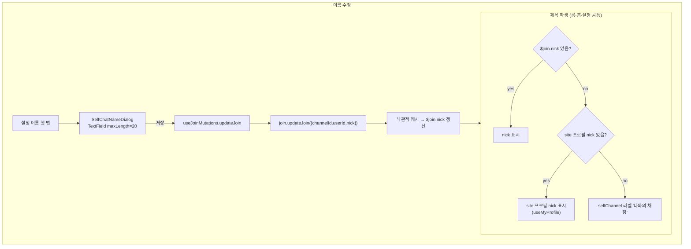
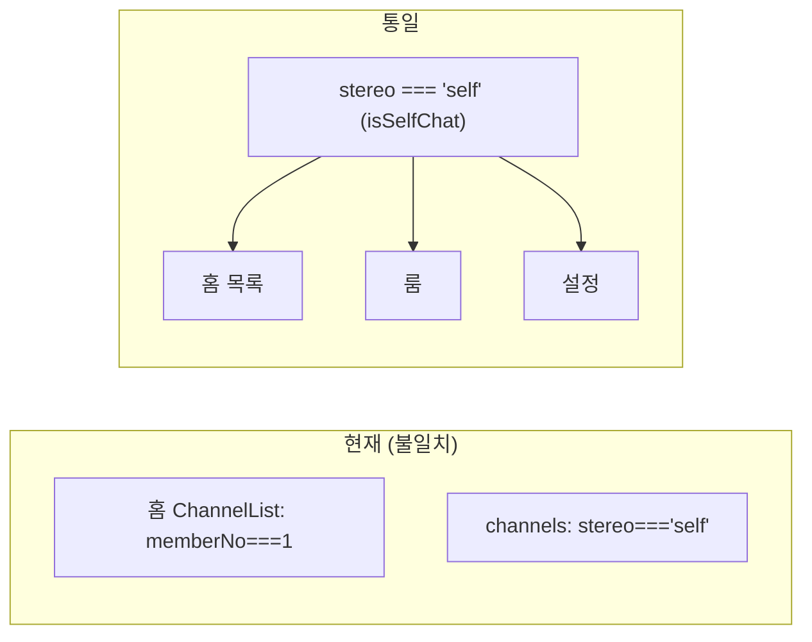
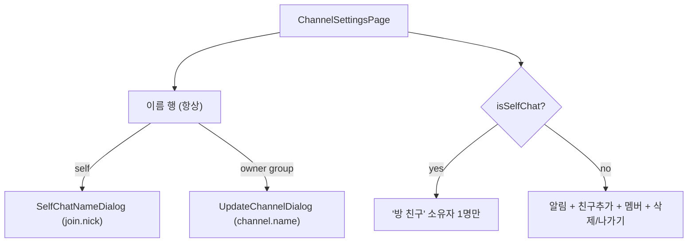

# 나와의 채팅 (Self Chat)

> 상태: Live · 최종 갱신: 2026-07-20 · 관련 ADR: [ADR-0026](../../../../../docs/adr/0026-self-chat-channel-type.md)

## 목적

`stereo === 'self'`인 "나와의 채팅" 채널 유형을 web에서 일관되게 다룬다. 룸·설정·홈
목록에 흩어진 self 처리를 하나의 기준으로 통일하고, 최근 DoU Figma 리디자인을 반영하며,
self 채널 이름을 **각 유저 join의 nick**으로 수정할 수 있게 한다. 프레젠테이션은 기존
방침대로 `@chatic/web-ui-kit`에 위임한다([[chat-room-ui]]·[[channel-settings]] 계승).

기존 룸/설정 문서는 self를 "범위 외 / 기존 분기 유지"로 두었다
([channel-settings.md:41](channel-settings.md)) — 이 문서가 self 유형을 가로질러 하나로
기술하고, 룸/설정 문서에는 상호링크만 둔다.

## 설계 원칙

- **self 판별은 `stereo === 'self'` 단일 기준.** 멤버 수(`memberNo`) 기반 판별을 쓰지
  않는다. 홈·룸·설정 어디서든 `channel.stereo === 'self'`(또는 이를 파생한
  `isSelfChat`)만 본다.
- **self 이름은 `channel.name`이 아니라 현재 유저 `$join.nick`.** 저장은 게이트웨이
  `join.update`(`JoinUpdateRequestBody = { id, nick?, notify?, role? }`), 표시는
  `$join.nick || site 프로필 nick`. 그룹 채널명(`channel.update`) 경로와 분리한다
  ([[self-chat-name-via-join-nick]]).
- **읽음표시(ReadReceipt)는 self에서 노출하지 않는다.** 나 혼자이므로 안 읽은 인원
  개념이 없다 — 기존 파생(`showReadReceipt = !isSelfChat && …`)을 유지한다.
- **누락 컴포넌트만 web-ui-kit에 신규 정의.** 이름수정 UI는 기존 `TextField`(카운터·
  헬퍼·상태 내장)로 충족. 다만 self 기본 아바타는 디자인이 달라(아래) web-ui-kit에 글리프
  1개(`IconUserSolid`) + 아바타/헤더 변형을 추가한다. 라이브러리 컨벤션(stateless·slot·
  i18n-agnostic·토큰·`*.test.tsx`+`*.stories.tsx`)을 따른다.
- **self 기본 아바타는 전용 디자인.** 그룹/일반 유저 placeholder와 다르다 — 네이비
  (`brand-ink`) 원 + gray_blue(`border`) 헤어라인 링 + **흰색 solid 사람 실루엣**(Figma
  "1명 Profile", node 3185:13127). 기존 `variant='user'`(링 없음 + lucide 아웃라인)와 구분
  된다. 실루엣 글리프는 Figma에서 추출해 `resources/icons/IconUserSolid`로 자산화한다.
- **그 외 아이콘은 `resources/icons` 시맨틱 별칭 재사용**(빈 상태 펜=`PenLine`, 뒤로/더보기
  등 기존 매핑).

## 범위

**포함**

1. **판별 통일** — 홈 `ChannelList`의 `memberNo === 1` self 판별을 `stereo === 'self'`로
   교체.
2. **self 이름 = `$join.nick`** — 표시(룸 헤더·홈 목록·설정 이름 행)를 `$join.nick ||
site 프로필 nick`으로 통일. 저장은 `useJoinMutations.updateJoin`(`join.update`)으로.
3. **이름 수정 UI** — 설정 상단 이름 행 탭 → self 전용 이름 편집(이름 전용, 최대 20자,
   글자 카운터, 헬퍼 "20글자 이내로 입력해 주세요"). `TextField` 사용, 썸네일 없음.
4. **설정 화면 self 레이아웃** — 이름 행 + "방 친구"(소유자 1명)만. 대화방 알림·친구
   추가·방 나가기/삭제는 self에서 미노출.
5. **룸/홈 Figma 반영** — 룸 빈 상태(펜 안내)·메시지(전부 mine·읽음숫자 없음)·헤더(self
   전용 아바타 + 제목), 홈 아이템(MY 배지 + self 아바타 + 제목), 설정 이름 행/방 친구 아바타.
6. **self 전용 기본 아바타** — `IconUserSolid` + `DefaultAvatar`/`ChatRoomHeader` self 변형.

**제외**

- **self 채널 생성 경로** — web에 self 채널 생성 UI/로직을 만들지 않는다. self 채널은
  서버에 이미 존재한다고 가정하고 읽기/이름수정/사용만 다룬다.
- desktop-web 반영(이번은 `apps/web` 한정).
- 홈 안읽음 배지 로직 변경(self는 자연히 unread 없음).
- 그룹/1:1 룸·설정 레이아웃 변경([[chat-room-ui]]·[[channel-settings]] 유지).

## 시나리오

1. **홈 목록에서 self 식별** — `stereo === 'self'`인 행은 `MY` 배지 + 제목(`$join.nick ||
site 프로필 nick`)으로 노출. 멤버수 pill 없음(1명). 탭 → self 룸.
2. **self 룸 진입** — 헤더: 사람 글리프 아바타(썸네일 있으면 이미지) + 제목(`$join.nick ||
site 프로필 nick`). ⋯ → "설정". 메시지는 전부 `mine` 말풍선, 시간 옆 읽음 숫자 없음.
3. **빈 self 룸** — 상단 오늘 `DateDivider` + 중앙 펜(`PenLine`) 아이콘 + "나만의 기록을
   시작해보세요 / 메모, 링크 등 자유롭게 기록할 수 있어요" 안내.
4. **설정(방 정보) 진입** — 상단 이름 행(아바타 + 제목, `>` 표시, 탭 가능) + "방 친구"
   섹션(소유자 1명, `MY` 배지). 대화방 알림·친구 추가·방 나가기 없음.
5. **이름 수정** — 이름 행 탭 → 이름 편집 화면(현재 이름 프리필, 카운터 `N/20`, 헬퍼).
   저장 → `join.update`로 `$join.nick` 갱신 → 낙관적 캐시 반영으로 룸 헤더·홈 목록·설정
   제목이 즉시 갱신. 빈 값 저장 시 nick 제거(제목이 site 프로필 nick fallback으로 복귀).
6. **이름 검증** — 최대 20자(초과 입력 캡 또는 오버리밋 에러 표기). 빈 값 허용 여부는
   구현 확정(아래 리스크).

## 다이어그램

### self 이름 표시/저장 흐름

### self 판별 통일

### 설정 화면 유형 분기

## 상세 구현

### apps/web — 데이터/뮤테이션

- **`useJoinMutations.updateJoin`** (재사용,
  [useJoinMutations.ts](../../src/app/features/channels/hooks/useJoinMutations.ts)) —
  join.nick 쓰기는 ADR-0025에서 도입된 `useJoinMutations().updateJoin({ channelId, userId,
nick })`를 그대로 쓴다(알림 토글이 쓰는 것과 동일 훅). 별도 뮤테이션을 새로 만들지 않는다.
  하위 계층은 이미 nick을 처리한다
  ([JoinRepositoryV2.ts:125](../../../../../libs/data/src/data/repositories-v2/JoinRepositoryV2.ts)
  — payload에 id/joinId 없으면 channelId+userId로 composite id resolve, 낙관적 반영 후
  실패 시 롤백). `userId`는 `channel.$join?.userId ?? 세션 userId`.
- **`useChannel` 뷰모델**
  ([useChannel.ts:10](../../src/app/features/channels/hooks/useChannel.ts)) — `isSelfChat`
  파생은 유지. `$join`은 `...channel` 스프레드로 이미 노출되므로 컨테이너에서
  `channel.$join?.nick` 직접 접근 가능(뷰모델 변경 최소).

### apps/web — 제목 파생 (공용 helper)

self 제목 파생을 순수 함수 + 훅으로 추출해 홈·룸·설정이 공유한다.

- **`resolveSelfChatTitle(nick, siteProfileNick, fallbackLabel)`**
  ([utils/selfChatTitle.ts](../../src/app/features/channels/utils/selfChatTitle.ts)) — 순수
  함수. `nick.trim()` → `siteProfileNick.trim()` → `fallbackLabel` 순으로 첫 비어있지 않은
  값을 반환.
- **`useSelfChatTitle(channel)`**
  ([hooks/useSelfChatTitle.ts](../../src/app/features/channels/hooks/useSelfChatTitle.ts)) —
  `nick`은 `channel.$join?.nick`, 없으면 **활성 site 프로필 nick**(`useMyProfile().profile?.nick`)
  으로 폴백한다. 이는 계정(user 레코드) 이름이 아니라 **site 프로필의 이름**이다 — user
  레코드의 `name`은 raw id/UUID일 수 있어 쓰지 않는다. 그래도 없으면
  `channelList.selfChannel` 라벨. `isSelfChat`인 곳에서만 쓴다. `useMyProfile`은 호출당
  `getMyProfile()` fetch가 있어 리스트에서 per-row로 호출하지 말고 부모에서 1회 해석해
  순수 함수로 넘긴다(홈 `ChannelList`).

### apps/web — 화면

- **홈 `ChannelList`**
  ([ChannelList.tsx](../../src/app/features/home/components/ChannelList.tsx)) —
  `isSelf = channel.memberNo === 1` → `channel.stereo === 'self'`. self 행 제목은
  `resolveSelfChatTitle($join.nick, myNick, 라벨)`. `myNick`(= site 프로필 nick)은 부모
  `ChannelList`에서 `useMyProfile`로 1회 해석해 각 행에 prop으로 내린다(per-row fetch 회피).
  `MY` 배지·멤버수 pill 로직은 유지(self는 pill 없음). 관련 문서: [[components]](../home/components.md).
- **룸 `ChannelRoomPage`**
  ([ChannelRoomPage.tsx:349](../../src/app/features/channels/pages/ChannelRoomPage.tsx)) —
  헤더 title: `isSelfChat ? t('channelList.selfChannel') : …` → self는 공용 파생
  (`$join.nick || site 프로필 nick`). `kind='self'`·읽음표시 미노출·빈 상태(PenLine)는 유지.
  빈 상태 문구는 Figma(3185-13109)와 대조해 i18n(`chat.room.emptyState.selfLine1/2`)을
  맞춘다.
- **설정 `ChannelSettingsPage`**
  ([ChannelSettingsPage.tsx](../../src/app/features/channels/pages/ChannelSettingsPage.tsx)) — - 이름 행: self·비-self 모두 `trailing`에 `>`(ChevronRight)를 두고 탭 가능. 탭 시
  `openDialog(isSelfChat ? 'selfName' : 'update')`로 self는 `SelfChatNameDialog`,
  비-self는 `UpdateChannelDialog`(멤버는 `readOnly`)를 연다. 제목은 self면
  `useSelfChatTitle`, 아니면 `channel.name`. - 이름 행 아바타(`roomAvatar`): 썸네일 있으면 `ImageAvatar`, 없으면 self는
  `DefaultAvatar`(사람 글리프), 그룹은 기존 `ChatAvatar`. - 멤버 행 렌더는 `memberList` 지역 변수로 추출해 self "방 친구" 섹션과 그룹 멤버 섹션이
  공유한다(로딩/멤버맵/빈 상태 동일). - self 분기: `{isSelfChat ? (<GroupLabel 방친구 /> + memberList) : (<>알림·친구추가·멤버·
삭제/나가기</>)}`. self는 소유자 1명만 "방 친구"에 노출되고, 대화방 알림·친구 추가·방
  나가기/삭제는 미노출. `SelfChatNameDialog`는 다른 다이얼로그와 함께 배선.

### apps/web — 신규 다이얼로그

- **`SelfChatNameDialog`** (신규, `components/`) — self 이름 전용 편집.
  `UpdateChannelDialog`(채널명+썸네일, `channel.update`)와 저장 경로·레이아웃이 달라
  전용 컴포넌트로 분리한다. web-ui-kit `TextField`
  ([TextField.tsx](../../../../../libs/web-ui-kit/src/foundations/input/TextField.tsx))
  사용: `label`(방 이름), `value`/`onChange`, `maxLength={20}`(카운터 `N/20` + 하드 캡),
  `description`("20글자 이내로 입력해 주세요"). 열릴 때 `channel.$join?.nick` 프리필. 저장 →
  `useJoinMutations.updateJoin({ channelId, userId: channel.$join?.userId ?? 세션 userId, nick: name.trim() })`.
  **빈 값 저장을 허용**해 nick을 빈 문자열로 보내 커스텀 이름을 제거한다(제목이 site 프로필
  nick fallback으로 복귀). Dialog 셸/토스트/저장 버튼 스타일은 `UpdateChannelDialog` 패턴
  재사용, 썸네일·검증(min) 없음.

### web-ui-kit

이름수정은 기존 `TextField`, 메시지/헤더/리스트/배지는 기존 컴포넌트로 충족. self 기본
아바타 전용 디자인을 위해 다음을 추가/확장한다:

- **`IconUserSolid`** (신규,
  [resources/icons/IconUserSolid.tsx](../../../../../libs/web-ui-kit/src/resources/icons/IconUserSolid.tsx)) —
  Figma "1명 Profile"(3185:13127)에서 추출한 solid 사람 실루엣(머리+어깨 2 path,
  `currentColor`). `viewBox="0 0 42 42"`가 아바타 원과 일치해, 아바타 전체 크기로 렌더하면
  실루엣이 원 기준 위치에 정확히 앉는다. `IconGroup`과 동일 패턴. `resources/icons` 배럴에 export.
- **`DefaultAvatar` `variant='self'` 추가**
  ([DefaultAvatar.tsx](../../../../../libs/web-ui-kit/src/foundations/avatar/DefaultAvatar.tsx)) —
  `bg-brand-ink` + `border border-border`(링) + `IconUserSolid`(size=원 지름, 흰색). 기존
  `user`/`group` 변형과 호출부는 불변.
- **`ChatRoomHeader` `kind='self'` 추가**
  ([ChatRoomHeader.tsx](../../../../../libs/web-ui-kit/src/composites/header/ChatRoomHeader.tsx)) —
  fallback 아바타를 `DefaultAvatar variant='self'`로 매핑(`group`→group, `self`→self, 그 외
  →user). thumbnail이 있으면 host가 `avatar` slot으로 주입.

소비처: 룸 `kind={isSelfChat ? 'self' : 'group'}`, 설정 이름 행 아바타 `variant='self'`, 홈
목록 self 행 `variant='self'`.

### i18n

- 신규 키: self 이름 편집(예 `selfChat.name.label`=방 이름, `.placeholder`,
  `.helper`="20글자 이내로 입력해 주세요", `.maxLength` 에러, 저장 성공/실패 토스트).
- 기존 확인/정렬: `channelList.selfChannel`(=나와의 채팅, 최종 fallback),
  `chat.room.emptyState.selfLine1/2`(Figma 문구와 일치 확인).
- dev i18n 캐시 주의([[dev-i18n-localstorage-cache]]).

## 검증 방법

- **유닛 테스트(통과 — `channels` + 홈 `ChannelList`)**
    - [selfChatTitle.test.ts](../../src/app/features/channels/utils/selfChatTitle.test.ts) —
      파생 순서(nick → site 프로필 nick → 라벨), 트림/공백/누락 fallback.
    - [SelfChatNameDialog.test.tsx](../../src/app/features/channels/components/SelfChatNameDialog.test.tsx) —
      현재 nick 프리필, 라벨/헬퍼/완료 노출, 저장 시 `$join.userId`+트림 nick 호출·닫힘, 빈 값 저장(nick 제거).
    - [ChannelSettingsPage.test.tsx](../../src/app/features/channels/pages/ChannelSettingsPage.test.tsx) —
      self: 파생 제목 행 + "방 친구"(소유자) 렌더, 대화방 설정/친구추가/삭제/나가기 미노출, 이름 행
      탭 → `SelfChatNameDialog` 오픈. 비-self 소유자/멤버 회귀.
    - [ChannelList.test.tsx](../../src/app/features/home/components/ChannelList.test.tsx) —
      `stereo==='self'` 행은 파생 제목 + MY 배지, 그룹 행은 `channel.name` + MY 없음.
    - 명령: `npx jest --config apps/web/jest.config.js --rootDir apps/web channels ChannelList`.
- **web-ui-kit 테스트(통과, self 아바타)**: `DefaultAvatar.test`(self 변형 = 링 +
  solid 글리프 viewBox `0 0 42 42`), `ChatRoomHeader.test`(`kind='self'` fallback 글리프),
  스토리 `DefaultAvatar.SelfChat`·`ChatRoomHeader.SelfWithMenu` 갱신.
  명령: `npx jest --config libs/web-ui-kit/jest.config.js --rootDir libs/web-ui-kit DefaultAvatar ChatRoomHeader`.
- **타입체크**: `@chatic/*`를 소스로 매핑한 tsc 실행에서 변경 파일 타입 에러 0건. `nx typecheck web`
  자체는 워크트리에서 미설치 dep(`@lemoncloud/chatic-sockets-lib`)·누락 `@nx/react` 타이핑으로
  프로젝트-참조 빌드가 실패하나 이는 환경 문제이며 변경과 무관([[stale-tsbuildinfo-typecheck]],
  [[preview-web-from-worktree]]).
- **수동 확인(후속, 로그인+소켓 필요)**: 실제 self 채팅방은 백엔드 연결이 있어야 하므로 브라우저
  육안 확인은 후속. 확인 포인트 — 홈 self 행 제목/MY, 룸 헤더 제목·읽음숫자 없음·빈 상태 문구,
  설정 이름 행 탭→편집·저장 후 제목 즉시 반영·빈 값 시 site 프로필 nick fallback. 낙관적
  `updateJoin` 캐시가 `observeItem`으로 룸/홈/설정에 즉시 전파되는지 함께 확인.
