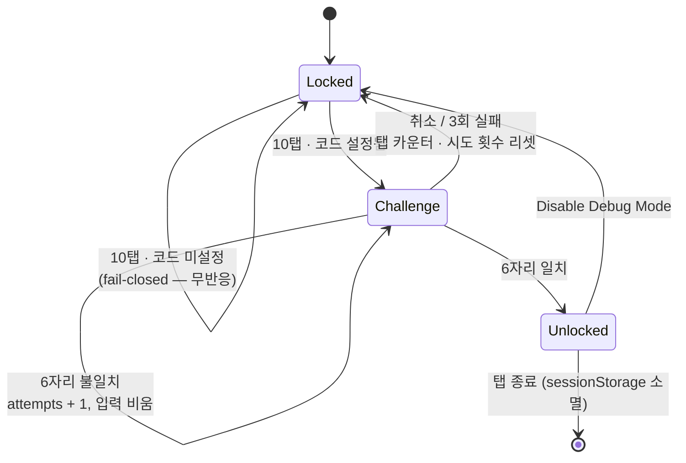
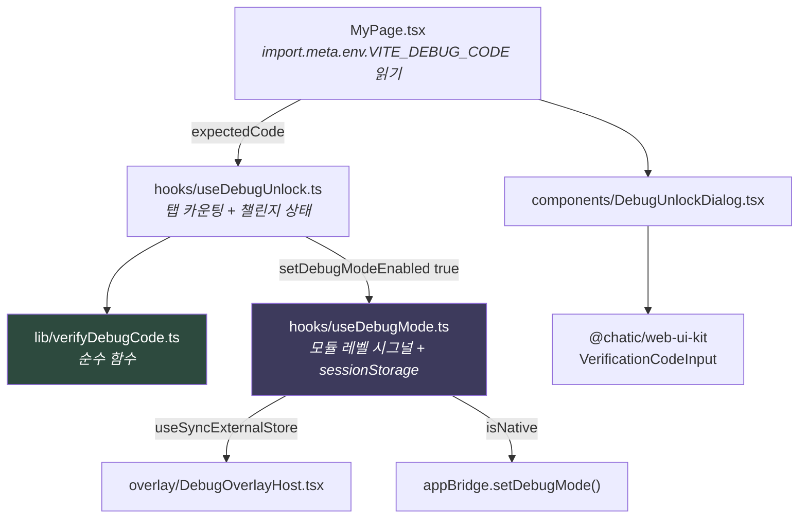

# 디버그 오버레이 진입 게이트

> 상태: Live · 최종 갱신: 2026-08-04 · 관련 ADR: [ADR-0034](../../../../../docs/adr/0034-debug-overlay-entry-code-gate.md)

> 대상: `apps/web/src/app/features/debug` 의 언락 경로. 오버레이 자체의 구조·도구 목록은 [README](./README.md) 참고.

## 목적

디버그 오버레이는 DB Browser, My Profile Editor, Email Login, Chunk Upload Test처럼 **실제 데이터와 세션을 직접 조작하는 도구**를 노출한다. 일반 유저가 여기 들어오면 데이터 손상과 CS 유입으로 이어진다.

기존 게이트는 MyPage "앱 버전" 행을 3초 내 10회 탭하는 **제스처 하나뿐**이었다. 지식 검증 단계가 없어 연타하다 우연히 열릴 수 있었다. 이 문서는 그 앞에 **입장 코드 검증**을 추가해 우발적 진입을 차단하는 구조를 다룬다.

## 설계 원칙

1. **Fail-closed.** 코드가 주입되지 않았으면 게이트 전체가 죽는다. 설정 누락이 조용히 문을 여는 경로를 만들지 않는다.
2. **비밀은 소스에 두지 않는다.** 이 리포는 OSS 미러로 공개된다([ADR-0005](../../../../../docs/adr/0005-desktop-published-as-oss-mirror-chatic-app.md)). 코드 값은 환경변수로만 들어온다.
3. **제스처는 은닉, 코드는 검증.** 둘은 역할이 다르다. 제스처는 진입 경로의 존재를 숨기고, 코드는 진입 자격을 묻는다. 하나가 뚫려도 다른 하나가 남는다.
4. **`import.meta`는 테스트되는 모듈에 넣지 않는다.** ts-jest는 CommonJS로 변환하므로 `import.meta`가 들어간 파일은 유닛 테스트에서 컴파일되지 않는다 — 간접적으로도 걸린다: `useDebugUnlock.test.ts`가 `useDebugMode.ts`를 통해 실제 `appBridge` 체인을 로드하자 `libs/web-core`의 `webTransport.ts`가 읽는 `import.meta.env`에서 파싱이 깨졌다(브릿지를 목으로 대체해 해결). 판정 로직은 순수 함수로 두고 env 읽기는 테스트 없는 호출부에 둔다.
5. **언락은 세션 스코프.** 디버그 모드는 남아 있으면 안 되는 상태다. 탭이 닫히면 사라진다.

## 범위

**포함** — `apps/web`의 디버그 모드 언락 경로: 탭 카운팅, 코드 입력 다이얼로그, 코드 검증, 실패 처리.

**제외**

- `apps/desktop-web`의 PlaceRail 7탭 게이트 (`localStorage` 영구). 별도 과제.
- 모바일 셸의 자체 진입 경로 및 non-PROD 네이티브 빌드의 컴파일 타임 FAB 플래그.
- 서버 권한(role) 기반 게이팅 — 리포에 관리자 개념 자체가 없다.
- 디버그 메뉴 항목별 세분화된 권한.

**모바일이 범위에 없어도 함께 닫히는 이유:** `apps/web/src/main.tsx:46`이 웹 부팅마다 `appBridge.setDebugMode(false)`를 전송해 네이티브 MMKV 플래그를 초기화한다. 모바일에는 자체 제스처가 없으므로 웹 게이트가 곧 모바일 게이트다.

## 시나리오

### S1. 운영자가 디버그 도구를 연다 (해피 패스)

1. MyPage → "앱 버전" 행을 3초 내 10회 탭.
2. 입장 코드 다이얼로그가 열린다. 6자리 숫자 셀에 자동 포커스.
3. 6자리를 채우면 **자동 제출**된다 (별도 확인 버튼 없음).
4. 코드 일치 → 다이얼로그가 닫히고 `sessionStorage['chatic-debug-mode'] = 'true'`. 우하단 "debug" 플로팅 버튼과 MyPage의 "Debug Mode" 행이 즉시 나타난다.
5. 네이티브 셸이면 `SetDebugMode(true)`가 브릿지로 전파되어 모바일 FAB도 함께 열린다.

### S2. 일반 유저가 우연히 10번 탭한다

1. 10탭 → 코드 다이얼로그가 열린다.
2. 코드를 모르므로 취소하거나 아무 숫자나 넣는다.
3. 3회 틀리면 다이얼로그가 닫히고 탭 카운터가 0으로 리셋된다. 다시 시도하려면 10탭부터.
4. 디버그 모드는 끝내 열리지 않는다. 앱의 다른 동작에는 아무 영향이 없다.

### S3. `VITE_DEBUG_CODE`가 주입되지 않은 빌드

1. 10탭을 해도 **아무 일도 일어나지 않는다.** 다이얼로그조차 열리지 않는다.
2. 탭 카운터는 계속 돌지만 임계값에서 조용히 무시된다.
3. 로컬 개발자는 `apps/web/.env`에 `VITE_DEBUG_CODE=...`를 추가해야 디버그 도구를 쓸 수 있다.

### S4. 오입력 후 정정

1. 6자리를 채웠는데 틀림 → 셀이 붉게 변하고(`error`) 입력이 비워진다. 남은 시도 2회.
2. 다시 입력해 맞히면 S1의 4단계로 합류한다. 실패 카운터는 다이얼로그가 닫힐 때 리셋된다.

### S5. 이미 언락된 세션

- 같은 탭 안에서는 `sessionStorage` 플래그가 살아 있어 10탭·코드를 다시 묻지 않는다.
- 확장 시트 홈 하단 "Disable Debug Mode"로 잠그면 플래그가 지워지고, 다음 진입은 다시 10탭 + 코드를 요구한다.
- 탭/앱을 닫으면 자동 해제된다.

## 다이어그램

### 언락 흐름



### 모듈 의존관계



`import.meta.env` 읽기가 `MyPage.tsx`에 있는 이유는 설계 원칙 4 때문이다. `useDebugMode.ts`·`useDebugUnlock.ts` 모두 유닛 테스트가 있어 `import.meta`를 담을 수 없다. `MyPage.tsx`에는 테스트가 없다.

## 상세 구현

### 신규 파일

| 파일                                              | 역할                                                                                                         |
| ------------------------------------------------- | ------------------------------------------------------------------------------------------------------------ |
| `features/debug/lib/verifyDebugCode.ts`           | 순수 판정 함수. `(input, expected) => boolean`. `expected`가 비어 있으면 항상 `false` (fail-closed).         |
| `features/debug/hooks/useDebugUnlock.ts`          | 탭 카운팅 + 챌린지 상태머신. `expectedCode`를 인자로 받는다.                                                 |
| `features/debug/components/DebugUnlockDialog.tsx` | 코드 입력 다이얼로그. `ConfirmDialog`와 같은 `AlertDialog` 프리미티브 위에 `VerificationCodeInput`을 얹는다. |

### 수정 파일

| 파일                                                                               | 변경                                                                                                                                                                                                                                       |
| ---------------------------------------------------------------------------------- | ------------------------------------------------------------------------------------------------------------------------------------------------------------------------------------------------------------------------------------------ |
| `features/debug/hooks/useDebugMode.ts`                                             | `registerTap`·탭 카운팅 제거. 모듈 시그널 setter를 `setDebugModeEnabled`로 export해 `useDebugUnlock`이 쓰게 한다. 훅 반환은 `{ isEnabled, disable }`([useDebugMode.ts:51-59](../../../src/app/features/debug/hooks/useDebugMode.ts)).      |
| `features/debug/consts/index.ts`                                                   | `DEBUG_CODE_LENGTH = 6`, `DEBUG_CODE_MAX_ATTEMPTS = 3` 추가. env는 넣지 않는다.                                                                                                                                                            |
| `features/mypage/pages/MyPage.tsx`                                                 | 모듈 스코프에서 `import.meta.env.VITE_DEBUG_CODE` 읽기([MyPage.tsx:24](../../../src/app/features/mypage/pages/MyPage.tsx)), `useDebugUnlock` 사용([MyPage.tsx:40-41](../../../src/app/features/mypage/pages/MyPage.tsx)), 다이얼로그 렌더. |
| `features/debug/index.ts`, `hooks/index.ts`, `lib/index.ts`, `components/index.ts` | 배럴 export 추가, `isDevEnv` export 제거.                                                                                                                                                                                                  |
| `apps/web/.env.example`                                                            | `VITE_DEBUG_CODE=000000` 항목 추가.                                                                                                                                                                                                        |
| `apps/web/docs/feature/debug/README.md`                                            | 게이팅 섹션 갱신, stale한 "DEV/LOCAL 자동 활성" 서술 제거하고 이 문서로 링크.                                                                                                                                                              |

`VITE_DEBUG_CODE`는 배포 파이프라인의 신규 필수 시크릿이다. CI에 주입을 빠뜨리면 fail-closed 설계상 배포 빌드에서 디버그 도구가 조용히 사라진다 — 배포 담당자에게 공유가 필요하다.

### 제거된 파일

- `features/debug/lib/isDevEnv.ts`, `isDevEnv.test.ts` — 디버그 기능 안에서는 호출부가 없어 함께 정리했다.

    단, **디버그 밖에 호출부가 하나 남아 있었다**: `features/auth/utils/env.ts`가 이 술어를 감싸 `isDevBuild()`로 재수출하고 있었고(→ `usePhoneVerify`, `mypage/LoginPage`), 삭제 직후 `Could not resolve "../../debug/lib/isDevEnv"`로 웹 빌드가 깨졌다. 되살리는 대신 그 래퍼를 지우고 호출부를 공용 `app/utils/buildEnv.ts`의 동일한 `isDevBuild()`로 옮겼다 — 원래 중복 사본이었고, `buildEnv`의 주석이 말하듯 공유 레이어가 피처(debug)에 의존하지 않게 하는 방향이기도 하다.

### 상태 소유권

- **언락 여부**(`isEnabled`)는 모듈 레벨 시그널 — 모든 훅 인스턴스가 공유해야 한다. 상시 마운트된 `DebugOverlayHost`가 MyPage의 언락에 즉시 반응해야 하기 때문이다.
- **탭 카운터와 챌린지 상태**는 컴포넌트 로컬(`useRef` / `useState`) — 언락을 시도하는 MyPage만 알면 된다. `DebugOverlayHost`의 훅 인스턴스가 남의 다이얼로그 상태를 보면 안 된다. 기존 `tapCountRef`가 이미 이 방식이다.

### 검증 로직

```ts
// lib/verifyDebugCode.ts
export const verifyDebugCode = (input: string, expected: string | undefined): boolean =>
    !!expected && input === expected;
```

빈 `expected`에서 `'' === ''`로 통과하는 것을 막는 게 이 함수의 핵심이다. 타이밍 세이프 비교는 하지 않는다 — 위협 모델이 우발적 진입 차단이고, 값 자체가 이미 번들에 있다.

### 탭 → 챌린지 전이

10탭 카운팅 자체는 기존 로직과 같다(3초 리셋 타이머). 달라진 건 임계값에 도달했을 때의 동작 — 즉시 언락하는 대신 코드가 설정된 경우에만 챌린지를 연다:

```ts
// hooks/useDebugUnlock.ts
if (tapCountRef.current >= TAP_THRESHOLD) {
    tapCountRef.current = 0;
    // No code configured — stay silent rather than opening a challenge nothing can pass.
    if (expectedCode) setChallengeOpen(true);
}
```

챌린지가 열린 뒤 `submitCode`가 실제 언락을 담당한다 — 정답이면 `setDebugModeEnabled(true)` 호출 후 상태 리셋, 오답이면 시도 횟수를 늘리고 `DEBUG_CODE_MAX_ATTEMPTS`(3) 도달 시 리셋한다.

## 검증 방법

### 유닛 테스트

| 파일                                  | 커버 대상                                                                                                                                                       |
| ------------------------------------- | --------------------------------------------------------------------------------------------------------------------------------------------------------------- |
| `lib/verifyDebugCode.test.ts` (신규)  | 일치/불일치, `expected`가 `undefined`·빈 문자열일 때 `false`, 입력이 빈 문자열이어도 `false`                                                                    |
| `hooks/useDebugUnlock.test.ts` (신규) | 10탭 시 챌린지 오픈, 9탭은 미오픈, 3초 경과 카운터 리셋, 코드 미설정 시 10탭 무반응, 정답 시 언락, 3회 오답 시 다이얼로그 닫힘 + 카운터 리셋, 취소 시 상태 리셋 |
| `hooks/useDebugMode.test.ts` (수정)   | `registerTap` 관련 케이스를 `useDebugUnlock.test.ts`로 이관. 나머지(sessionStorage 초기값, 인스턴스 간 동기화, 브릿지 전파, 주입 전역)는 유지                   |

실행:

```bash
npx nx test web --testPathPatterns="debug"
```

`useDebugUnlock.test.ts`는 `useDebugMode`를 통해 실제 `appBridge` 체인이 로드되는 걸 막기 위해 `useDebugMode.test.ts`와 같은 방식으로 `@chatic/bridges`·`../../../bridge`를 목 처리한다(설계 원칙 4 참고).

### 수동 확인

1. `apps/web/.env`에 `VITE_DEBUG_CODE=123456` 설정 후 dev 서버 실행 → MyPage 앱 버전 10탭 → 다이얼로그 → `123456` → 우하단 "debug" 버튼 확인.
2. 같은 상태에서 `999999`를 3회 입력 → 다이얼로그 자동 종료, 이후 1탭으로는 다시 열리지 않음(10탭 필요) 확인.
3. `.env`에서 `VITE_DEBUG_CODE`를 지우고 재시작 → 10탭해도 무반응 확인.
4. 언락 후 탭을 닫았다 다시 열기 → 잠금 상태 복귀 확인.
5. 네이티브 셸(모바일 앱)에서 언락 → 모바일 FAB 디버그 메뉴가 함께 열리는지 확인.
