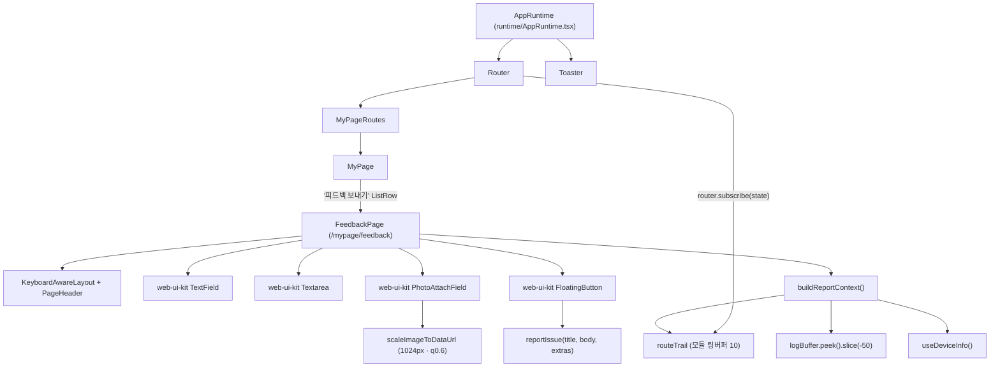
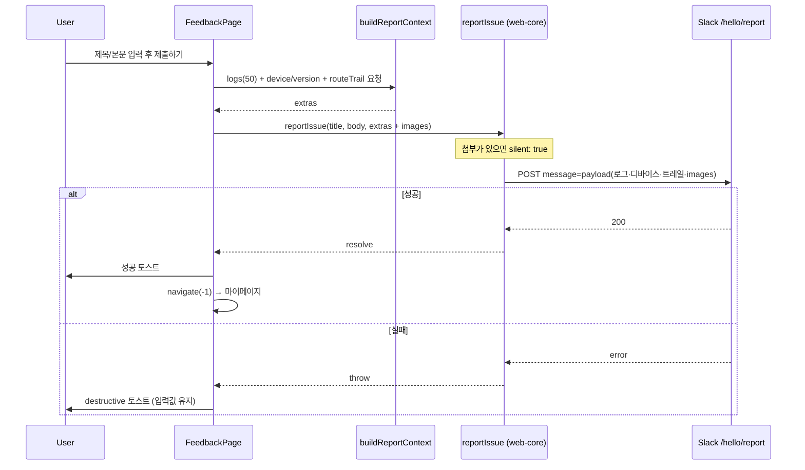
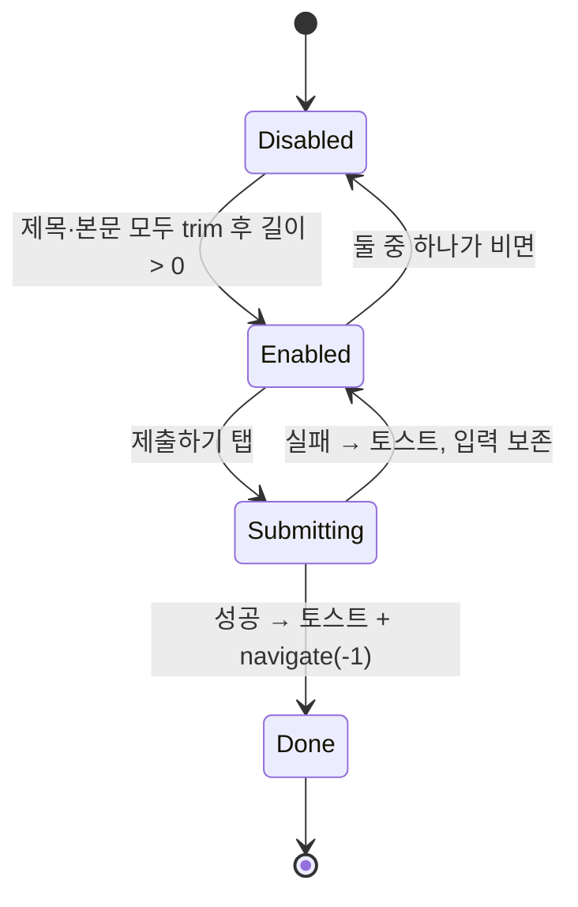

# feedback

> 상태: Live · 최종 갱신: 2026-08-11 · 관련 ADR: [ADR-0047](../../../../../docs/adr/0047-feedback-page-replaces-issue-report-floating-widget.md) (화면 전환) · [ADR-0049](../../../../../docs/adr/0049-feedback-photo-attachment-inline-base64.md) (사진 첨부) · [ADR-0017](../../../../../docs/adr/0017-issue-report-floating-widget.md) (Superseded)
>
> 대상: `apps/web/src/app/features/feedback` — 이전 `features/issue-report`(플로팅 위젯)를 대체한다.

## 목적

사용자가 서비스를 쓰다 겪은 불편·개선 의견을 남길 수 있게 한다. 마이페이지의 `피드백 보내기`로 진입하는 전용 화면이며, 사용자가 입력한 제목·본문과 화면 캡처에 더해 **최근 로그 50개 + 디바이스/버전/뷰포트 스냅샷 + 최근 방문 경로**를 자동으로 붙여 보낸다. 목표는 "사용자가 상황을 길게 설명하지 않아도 재현에 필요한 컨텍스트가 리포트에 자동으로 붙는 것"으로, 이전 플로팅 위젯과 동일하다 — 바뀐 것은 **진입 경로와 화면 형태**뿐이다.

## 설계 원칙

- **진입점은 하나.** 앱 전역에 상주하는 위젯을 두지 않는다. 마이페이지 메뉴 한 곳에서만 진입한다. 화면 위에 상시 떠 있는 컨트롤은 컨텐츠를 가리고 오탭을 만든다.
- **UI는 web-ui-kit으로만 조립한다.** 화면은 `KeyboardAwareLayout` + DS 컴포넌트의 조합이지, 손으로 쓴 화면 컴포넌트가 아니다. DS에 없는 프리미티브가 필요하면 **앱에서 만들지 말고 web-ui-kit에 추가한다** — `@chatic/ui-kit`(shadcn) 직접 참조로 우회하지 않는다.
- **진단 컨텍스트 수집은 순수 함수로.** 로그/상태 스냅샷 조합은 React 밖에서 테스트 가능한 순수 함수로 유지한다.
- **전송 실패는 조용히 삼키지 않는다.** 성공/실패를 토스트로 알리고, 실패 시 입력값을 보존한다.
- **페이로드 크기는 항상 유한하다.** 사용자 입력·로그 모두 상한이 있다. 상한이 없는 필드는 언젠가 제출 전체를 실패시킨다.

## 범위

**포함**

- `/mypage/feedback` 전용 화면: 헤드카피 + 안내 불릿 + 제목(TextField) + 본문(Textarea) + 하단 플로팅 `제출하기`.
- 마이페이지 정책 카드 최상단 `피드백 보내기` 진입 행. 게스트도 접근 가능.
- 전송 시 로그 50개 + 디바이스/버전/온라인/뷰포트/경로 + **최근 방문 경로 트레일** 자동 첨부.
- **사진 첨부 최대 5장** — 브라우저에서 base64 JPEG으로 축소해 payload에 실어 전송([ADR-0049](../../../../../docs/adr/0049-feedback-photo-attachment-inline-base64.md)).
- admin-v2 리포트 상세에서 첨부 사진 조회.
- web-ui-kit `Textarea` · `PhotoAttachField` foundation.
- `FloatingTabBar` 디자인 갱신(Figma 3293-40098).

**제외**

- 로그 민감정보 스크러빙(현행 감수). 첨부 사진도 같은 입장 — 사용자가 고른 캡처를 그대로 싣는다.
- 전용 이슈 트래킹 목적지(현행 Slack `/hello/report` 유지).
- 제출 완료 전용 화면/팝업 — 토스트로 갈음한다.

## 시나리오

### 1. 피드백 보내기 (정상 흐름)

1. 사용자가 마이페이지 → `피드백 보내기` 탭 → `/mypage/feedback` 이동.
2. 화면에 헤드카피(`DoU 서비스 이용 중 / 불편했던 점이나, 개선이 필요한 / 부분을 편하게 남겨주세요`)와 안내 불릿 2개가 보인다.
3. 제목·본문을 입력한다. **둘 다 공백이 아닌 값이 있어야** 하단 `제출하기`가 활성화된다. 사진은 선택이라 활성 조건에 들어가지 않는다.
4. (선택) 사진을 고르면 브라우저에서 즉시 축소·인코딩해 썸네일로 보여준다.
5. 제출 → `buildReportContext()`가 로그 꼬리 50개 + 디바이스/버전/온라인/뷰포트/경로 + 라우트 트레일을 조합 → `reportIssue(title, body, extras)`. 제목·본문은 `trim()` 후 전송한다.
6. 성공: 토스트 + `navigate(-1)`로 마이페이지 복귀.
7. 실패: destructive 토스트, **입력값 유지**, 화면 이탈 없음.

### 2. 입력 제약

- 문자 종류 제한 없음 — 한글·영문·숫자·특수문자·이모지 모두 허용한다. 필터링·정규화를 하지 않는다.
- 글자수 카운터를 노출하지 않는다. 대신 두 필드 모두 `MAX_INPUT_LENGTH`(5000자) 안전망을 `onChange`에서 잘라 적용한다 — DS `TextField`의 `maxLength`는 카운터를 함께 렌더하므로 쓰지 않고, `Textarea`는 카운터 자체가 없다.

### 3. 사진 첨부

- jpg·png를 **최대 5장**. 5장이 차면 첨부 영역 자체가 사라진다.
- 고른 즉시 브라우저에서 **긴 변 1024px · JPEG 0.6**으로 축소해 base64 data URL로 만든다. 비율을 유지하고 잘라내지 않으며, 이미 작은 이미지는 확대하지 않는다.
- 한도를 넘겨 고르면 초과분만 버리고 `사진 첨부는 5장까지 가능해요.` 토스트로 알린다(조용히 버리지 않는다).
- 브라우저가 디코딩하지 못하는 파일은 그 묶음만 실패 토스트를 띄우고, **이미 붙인 사진은 유지**한다.
- 전송 시 `extras.images`는 payload에 함께 실린다. 대신 **첨부가 있는 제보만 `silent: true`** 로 나가 Slack 알림 없이 저장만 된다 — 아래 상세 구현 참고.

### 4. 제보 시점 화면 맥락 (라우트 트레일)

플로팅 위젯 시절에는 `extras.path`가 곧 사용자가 문제를 겪던 화면이었다. 진입점이 마이페이지로 바뀌면서 `path`는 항상 `/mypage/feedback`이 되어 진단 가치를 잃는다. 이를 보전하기 위해 **최근 방문 경로 10개를 앱 전역에서 기록**하고 리포트에 함께 싣는다.

- 라우트가 바뀔 때마다 `recordRoute(pathname)`가 모듈 링버퍼에 push한다(연속 중복 경로는 무시).
- 제출 시 `extras.routeTrail`에 오래된 것 → 최신 순으로 담긴다. 마지막 항목은 `/mypage/feedback`, 그 앞이 사용자가 실제로 있던 화면이다.

### 5. 게스트 사용자

마이페이지 정책 카드는 `isGuest` 분기 밖이라 비로그인 사용자에게도 렌더된다([MyPage.tsx](../../../src/app/features/mypage/pages/MyPage.tsx)). `reportIssue`는 `user.isAuthenticated: false`를 페이로드에 실어 정상 전송하므로 게스트도 그대로 제보할 수 있다.

## 다이어그램

### 진입과 마운트 구조



### 제출 시퀀스



### 제출 버튼 활성 상태



## 상세 구현

### 디렉터리

```
apps/web/src/app/features/feedback/
├─ pages/
│  ├─ FeedbackPage.tsx           # 화면 전체 (KeyboardAwareLayout + PageHeader + FloatingButton + 사진 인코딩/한도)
│  ├─ FeedbackPage.test.tsx
│  └─ index.ts
├─ lib/
│  ├─ buildReportContext.ts      # 로그50 + 디바이스/버전/온라인/뷰포트/경로/트레일 조합 (순수 함수)
│  ├─ buildReportContext.test.ts
│  └─ index.ts
└─ index.ts
```

### 핵심 파일과 역할

- **[pages/FeedbackPage.tsx](../../../src/app/features/feedback/pages/FeedbackPage.tsx)** — [ProfileEditPage.tsx](../../../src/app/features/mypage/pages/ProfileEditPage.tsx)와 같은 스캐폴드: `KeyboardAwareLayout className="fixed inset-0 overflow-hidden"` + `header={<PageHeader title />}` + `footer={<FloatingButton />}`. 본문은 헤드카피(20px semibold, `leading-[1.35] tracking-[-0.1px]`, `whitespace-pre-line`으로 i18n의 `\n` 3줄 처리) → 안내 불릿(`list-disc`, `text-description`) → `TextField`(제목, 필수) → `Textarea`(본문, 필수) → `PhotoAttachField`(사진, 선택) 순. 상태는 controlled `useState` 3개뿐이라 `react-hook-form`을 쓰지 않는다. 제출 성공 후 입력값을 리셋하지 않는다 — 화면이 언마운트되므로, 먼저 비우면 전환 애니메이션 동안 빈 폼이 깜빡인다. 사진 인코딩(`scaleImageToDataUrl`)·5장 한도·초과 토스트는 전부 이 페이지가 관리한다: DS 필드는 고른 파일을 그대로 되돌려줄 뿐이라, 왜 거절됐는지 사용자에게 말해줄 수 있는 쪽이 정책을 갖는다.
- **[libs/shared/.../resizeImage.ts](../../../../../libs/shared/src/utils/resizeImage.ts)** — `scaleImageToDataUrl(file, { maxEdge, quality })`. 비율을 유지한 축소이며 업스케일하지 않는다. 같은 파일의 `resizeImageToBase64`는 150px **정사각 center-crop**이라 아바타 전용이다 — 화면 캡처에 쓰면 대부분을 잘라내 진단 가치가 사라진다.
- **[libs/web-ui-kit/.../PhotoAttachField.tsx](../../../../../libs/web-ui-kit/src/foundations/input/PhotoAttachField.tsx)** — 점선 드롭존(h144 · radius24 · `#DFE0E2`) + 88px 썸네일 스트립(radius10 · `border-placeholder`, 16px 삭제 배지 `bg-input-border`). 순수 표현 컴포넌트다: `File[]`을 그대로 돌려주고 `value`를 그리기만 하므로, 인코딩 방식·크기 예산·한도 초과 처리 같은 **페이로드 정책이 디자인 시스템에 새지 않는다**. `max`에 도달하면 드롭존을 감춘다.
- **[libs/web-core/.../common.ts](../../../../../libs/web-core/src/api/common.ts)** — `reportIssue`가 `extras`를 payload에 펼치고, **첨부가 있을 때만 `silent: true`** 로 보낸다. payload는 `body.message`에 실려 그대로 Slack 메시지 텍스트가 되는데 base64 한 장이면 Slack 상한(~40k자)을 넘기 때문이다. `SlackReportBody.meta`로 분리하는 쪽을 먼저 구현했지만 **백엔드가 클라이언트 `meta`를 저장하지 않아** 사진이 유실됐고(2026-08-11 실측), 저장되는 필드가 `message`뿐이라 알림을 포기하는 쪽으로 돌아섰다([ADR-0049](../../../../../docs/adr/0049-feedback-photo-attachment-inline-base64.md)). 첨부가 있으면 장수·payload KB를 로그로 남겨, 크기 상한에 걸렸을 때 숫자가 함께 남는다.
- **[admin-v2 parseReportLog.ts](../../../../admin-v2/src/app/features/report-logs/lib/parseReportLog.ts)** — 저장 레코드에서 첨부를 찾아 `row.images`로 올린다. payload `images`(현행 경로) → 래퍼 `meta.images` → 레코드 `meta.images` → 최상위 순으로 탐색하고(뒤쪽 `meta` 지점은 잠깐 배포됐던 meta 빌드와, 백엔드가 나중에 meta를 저장할 경우 대비), `data:image/…`·`http(s)://`만 통과시킨다. **[ReportDetailDrawer.tsx](../../../../admin-v2/src/app/features/report-logs/components/ReportDetailDrawer.tsx)** 는 이를 썸네일 그리드로 그리고(클릭 시 새 탭 원본), Raw 블록에서는 base64를 마커로 치환한다 — 안 그러면 raw가 수 MB 텍스트가 된다. 첨부 섹션은 payload 파싱 실패와 무관하게 보이도록 `payload &&` 밖에 둔다.
- **[lib/buildReportContext.ts](../../../src/app/features/feedback/lib/buildReportContext.ts)** — `{ logs, device, version, online, viewport, path, routeTrail }`을 반환하는 순수 함수. `logBuffer.peek()`는 FIFO(오래된 것부터)라 "최근 50개"는 전체를 peek해 `slice(-50)`로 꼬리를 취한다 — `peek(50)`은 가장 오래된 50개가 되어 오답이다. `deviceToken`(FCM/APNS 푸시 크리덴셜)과 `deviceId`/`installId`/`firebaseInstallationId`는 `pickDeviceFields`가 걸러낸다: 리포트는 공유 채널에 떨어지므로 capability 토큰을 실으면 안 된다. `app/utils` 배럴이 아니라 `routeTrail`/`viewport` 파일을 **직접 경로로** import 한다 — 배럴은 `import.meta`를 쓰는 모듈까지 끌고 와 CommonJS 테스트 트랜스폼이 파싱하지 못한다(architecture/directory-structure.md §6).
- **[app/utils/routeTrail.ts](../../../src/app/utils/routeTrail.ts)** — 모듈 레벨 링버퍼(`ROUTE_TRAIL_SIZE = 10`). `recordRoute(path)`(빈 경로·직전과 동일한 경로는 무시), `getRouteTrail()`(복사본 반환 — 호출부가 버퍼를 오염시키지 못하게), `resetRouteTrail()`(테스트용). React 밖 순수 모듈. **호출부는 `pathname`만 넘긴다** — 트레일은 공용 Slack 채널로 나가는데 이 앱은 쿼리스트링에 capability 토큰을 싣는다(`/invite/accept?…`, `/s?…`). 경로 세그먼트는 리포트가 이미 담고 있는 리소스 id지만 쿼리스트링은 크리덴셜이다. 이 계약은 `routeTrail.test.ts`가 못박는다.
- **[app/utils/viewport.ts](../../../src/app/utils/viewport.ts)** — `getViewportSize()`. 삭제된 `useDraggable`에 있던 것을 그대로 이관했다. 측정 불가(레이아웃 전 WebView/headless)일 때 `{0,0}`을 돌려주고 폴백은 호출부가 정한다.
- **[routes/index.tsx](../../../src/app/routes/index.tsx)** — 라우트 기록은 별도 러너 컴포넌트 없이 **데이터 라우터를 직접 구독**한다. `Router`가 `createBrowserRouter` + `RouterProvider` 구조라 `AppRuntime`은 라우터 컨텍스트 **밖**이고, `useLocation` 기반 러너는 마운트할 자리가 없다. `router.subscribe(state => recordRoute(state.location.pathname))`는 `Router` 안에서 끝나고 private/public/common 라우트를 전부 덮는다. `subscribe`는 최초 상태를 방출하지 않으므로 구독 직후 `router.state.location.pathname`을 한 번 직접 기록한다. `router`가 `isAuthenticated` 변화로 재생성되면 재구독하는데, `recordRoute`가 연속 중복을 무시하므로 같은 경로가 겹쳐 쌓이지 않는다.
- **[libs/web-ui-kit/.../Textarea.tsx](../../../../../libs/web-ui-kit/src/foundations/input/Textarea.tsx)** — DS `TextField`와 같은 껍데기(label + required 마크 + 박스 + description/error 라인), 내부만 `<textarea>`. 박스 `h-[198px]`(prop `height`로 조정) · `rounded-[24px]` · `px-5 py-4`, 텍스트 `text-[14px] font-medium leading-[1.45] tracking-[-0.07px]`, 기본 테두리 `border-input-border`, 포커스 `focus-within:border-[1.5px] focus-within:border-focus-border`(`--focus-border` = `#3A3C40`, Figma 값과 동일), 에러 `border-destructive`. `resize-none`이라 넘치면 늘어나지 않고 스크롤한다. **카운터를 렌더하지 않는다** — 장문 입력에서 보이는 상한은 압박으로 읽힌다. 필요해지면 옵트인 prop으로 추가한다.
- **[libs/web-ui-kit/.../FloatingTabBar.tsx](../../../../../libs/web-ui-kit/src/composites/navigation/FloatingTabBar.tsx)** — active 탭 배경 `rgba(3,13,35,0.7)`(유리 바가 덧입혀져 반투명 네이비로 보인다), 라벨 `leading-[12px] tracking-[-0.1px]`. 비활성 탭의 `opacity-[0.54]`는 **버튼이 아니라 아이콘·라벨에 각각** 건다 — 버튼에 걸면 안읽음 배지까지 함께 흐려지는데, 배지는 "지금 보고 있지 않은 탭"에서 눈에 띄어야 하므로 Figma가 유일하게 원래 채도로 남겨둔 요소다. 다크 모드 분기(`dark:bg-white/15`)는 유지 — Figma는 라이트만 제공한다.

### 기존 파일 변경

| 파일                                                                                                                                           | 변경                                                                                                                      |
| ---------------------------------------------------------------------------------------------------------------------------------------------- | ------------------------------------------------------------------------------------------------------------------------- |
| [routes/paths.ts](../../../src/app/routes/paths.ts)                                                                                            | `mypage.feedback: '/mypage/feedback'`                                                                                     |
| [mypage/routes/index.tsx](../../../src/app/features/mypage/routes/index.tsx)                                                                   | `<Route path="feedback" element={<FeedbackPage />} />` — 페이지는 `feedback` 피처 소유이고, URL만 mypage 허브 아래에 있다 |
| [mypage/pages/MyPage.tsx](../../../src/app/features/mypage/pages/MyPage.tsx)                                                                   | 정책 `MenuCard` 최상단에 `피드백 보내기` `ListRow` 추가 · `이슈 신고 버튼` 스위치 행 제거                                 |
| [runtime/AppRuntime.tsx](../../../src/app/runtime/AppRuntime.tsx)                                                                              | `<IssueReportHost />` 마운트·import 제거                                                                                  |
| [stores/preferenceKeys.ts](../../../src/app/stores/preferenceKeys.ts) · [usePreferenceStore.ts](../../../src/app/stores/usePreferenceStore.ts) | `issueReportHidden` 엔트리·상태·액션 삭제                                                                                 |
| [libs/web-core/.../types/common.ts](../../../../../libs/web-core/src/api/types/common.ts)                                                      | `IssueReportExtras.routeTrail?: string[]` (옵셔널이라 하위호환)                                                           |
| `apps/web/public/locales/{ko,en}/translation.json`                                                                                             | `feedback.*`·`mypage.feedback` 추가, `issueReport.*`·`reportIssue.*`·`mypage.issueReportButton` 삭제                      |

### 삭제된 자산

```
apps/web/src/app/features/issue-report/            # Host · Fab · Overlay · useDraggable (buildReportContext만 이관)
apps/web/src/app/ui/components/ReportIssueDialog.tsx   # 실사용처 0이던 구버전 다이얼로그
apps/web/src/app/ui/components/RequiredLabel.tsx       # 위 다이얼로그 전용이라 함께 참조 0
```

`ui/components/index.ts`의 두 export 라인도 함께 지웠다([ADR-0046](../../../../../docs/adr/0046-web-feature-ownership-and-barrel-hygiene.md) 배럴 위생).

### i18n 키

번역 리소스는 `apps/web/public/locales/{ko,en}/translation.json`에 리포와 함께 산다(`loadPath: /locales/{{lng}}/{{ns}}.json`, [i18n/index.ts](../../../src/i18n/index.ts)).

| 키                                         | ko                                                                             |
| ------------------------------------------ | ------------------------------------------------------------------------------ |
| `feedback.title`                           | 의견 보내기                                                                    |
| `feedback.heading`                         | `DoU 서비스 이용 중\n불편했던 점이나, 개선이 필요한\n부분을 편하게 남겨주세요` |
| `feedback.noticePurpose` / `noticeNoReply` | 안내 불릿 2줄                                                                  |
| `feedback.titleLabel` / `titlePlaceholder` | 제목 / 제목을 입력해주세요.                                                    |
| `feedback.bodyLabel` / `bodyPlaceholder`   | 소중한 의견을 남겨주세요 / 답변을 적어주세요.                                  |
| `feedback.submit` / `success` / `failed`   | 제출하기 / 소중한 의견 감사합니다. / 전송에 실패했습니다…                      |
| `mypage.feedback`                          | 피드백 보내기                                                                  |

## 검증 방법

**유닛 테스트** (ts-jest, `*.test.ts(x)` — 리포 관례. apps/web은 한국어 설명, web-ui-kit은 영어)

- `features/feedback/lib/buildReportContext.test.ts` — 진단 필드만 담는지, 푸시 토큰·영구 식별자 제외, 버퍼 꼬리 50개, `routeTrail` 포함.
- `features/feedback/pages/FeedbackPage.test.tsx` — 제출 버튼 활성 조건(초기·한쪽만·공백만·둘 다), `trim()` 후 전송 인자, 성공 시 토스트 + `navigate(-1)`, 실패 시 입력 보존, 5000자 클램프·카운터 미노출. 사진: 인코딩→썸네일, 개별 삭제, 5장 초과 시 트림+토스트, 만원이면 드롭존 숨김, 인코딩 실패 시 기존 첨부 유지, 제출 인자의 `images` 유무.
- `libs/web-core/src/api/common.spec.ts` — **`images`가 `meta`로만 가고 `message` 문자열엔 `data:image`가 없다**(회귀 시 Slack 전송이 깨지는 자리), 첨부 없으면 `meta` 키 미생성, 나머지 extras는 payload 유지.
- `apps/admin-v2 parseReportLog.spec.ts`(vitest) — 첨부를 래퍼 meta·레코드 meta·payload 어디에 두어도 찾아내고, 렌더 불가한 값(`javascript:` 등)은 버린다.
- `app/utils/routeTrail.test.ts` — 순서, 연속 중복 무시, 빈 경로 무시, 10개 상한, 반환값 복사본, **쿼리스트링이 섞이지 않는다는 계약**.
- `libs/web-ui-kit/.../Textarea.test.tsx` — 라벨 연결·required, `onChange` 원문 전달(이모지 포함), error가 description을 덮고 `aria-invalid` 부여, 카운터 미렌더, `height` prop.
- `libs/web-ui-kit/.../PhotoAttachField.test.tsx` — 라벨/힌트/설명 렌더, **`max`를 넘겨도 스스로 자르지 않고 전부 돌려준다**(거절 사유는 호출부가 안내), 같은 파일 재선택을 위한 input 값 초기화, 취소(빈 선택) 무시, 인덱스 기준 삭제, `max` 도달 시 드롭존 숨김.
- `libs/web-ui-kit/.../FloatingTabBar.test.tsx` — 기존 케이스에 더해, 비활성 탭은 흐려지되 **배지는 흐려지지 않는다**(회귀 방지).
- 실행:

    ```bash
    cd apps/web && npx jest
    ```

    ```bash
    npx nx run admin-v2:test
    ```

    admin-v2는 jest가 아니라 **vitest**다. 나머지(`libs/web-ui-kit`·`libs/web-core`·`libs/shared`)는 각 디렉터리에서 `npx jest`.

    최근 결과: apps/web 187/1661 · web-ui-kit 65/287 · web-core 10/89 · shared 2/10 · admin-v2 13파일/77 통과.

**정적 검증**

```bash
npx nx run-many -t lint -p web,web-ui-kit,admin-v2,@chatic/web-core,@chatic/shared
```

`nx run web:typecheck`는 `libs/data`·`libs/web-ui-kit` 스토리의 **선재 부채**로 실패한다(이 피처와 무관). 변경분만 확인하려면 path alias를 소스로 푸는 임시 tsconfig(`noEmit`, references 없음)로 `tsc`를 돌린다 — 남는 61건이 전부 손대지 않은 파일인지 확인하는 방식.

**브라우저 확인** (Storybook `web-ui-kit-storybook`, `computer`/`javascript_tool`)

- `Textarea` — 비포커스 `border-width 1px / #EAEAEB`, 포커스 시 `1.5px / rgb(58,61,64)`(= `#3A3C40`), `radius 24px`, `height 198px`, `padding 16px 20px`, `font-size 14px`, `letter-spacing -0.07px`, `resize none`. 넘치는 값은 박스 높이를 유지한 채 스크롤.
- `FloatingTabBar` — 라이트: active `rgba(3,13,35,0.7)` / inactive `opacity 0.54` / 라벨 `-0.1px`·`12px`. 다크(`html.dark`): active `rgba(255,255,255,0.15)`로 정상 전환, 비활성 라벨도 대비 유지.
- `PhotoAttachField` — 드롭존 `144px` · `radius 24px` · `dashed 1px #DFE0E2`, 썸네일 `88×88` · `radius 10px` · `border #BABCC0` · `object-fit cover`, 삭제 배지 `16×16` 원형 `#EAEAEC`. `max` 도달 시 드롭존이 사라지고 스트립만 가로 스크롤한다.
- 주의: `getComputedStyle`을 클래스/포커스 변경과 **같은 tick**에서 읽으면 이전 값이 잡힌다. 상태를 바꾼 뒤 별도 호출로 다시 읽어야 한다.

**수동 확인 포인트** (백엔드 필요)

앱 부팅이 게스트 로그인(`POST /oauth/register-device`)에 의존하므로 백엔드가 닿지 않는 환경에서는 화면을 띄울 수 없다. 실환경에서 확인할 것: 마이페이지 진입 → 헤드카피/불릿 렌더, 키보드가 올라올 때 CTA가 키보드 위에 붙는지, 이모지 입력, 제출 성공 후 마이페이지 복귀, 게스트 상태 진입, 전송된 payload의 `routeTrail`이 직전 화면을 담는지.

**전송 경로(2026-08-11 실측 반영).** `body.meta`로 분리해 보내는 첫 구현은 dev에서 사진이 유실됐다 — 저장 레코드의 `meta`가 `{}`로 비어 돌아왔고, 백엔드가 클라이언트 `meta`를 버린다는 뜻이다. 지금은 payload에 싣고 첨부가 있는 제보만 `silent: true`로 보낸다.

**남은 미확인: 저장 항목 크기.** 5장이면 1MB에 근접한다. 저장소가 DynamoDB면 항목당 400KB 제한에 걸릴 수 있다. 첨부가 있는 제보는 `[reportIssue] sending attachments` 로그에 `images`·`payloadKb`가 찍히므로, 실패 시 어느 크기에서 걸렸는지 바로 확인할 수 있다. 걸리면 장수·품질을 낮추거나 업로드 API로 옮긴다.

**확인해야 할 것**: dev에 배포해 사진 1장·5장으로 각각 제보 → admin-v2 `/report-logs` 상세에 Attachments 섹션이 뜨는지, 그리고 Slack에 해당 제보가 **안 오는 것이 맞는지**(의도된 동작).
