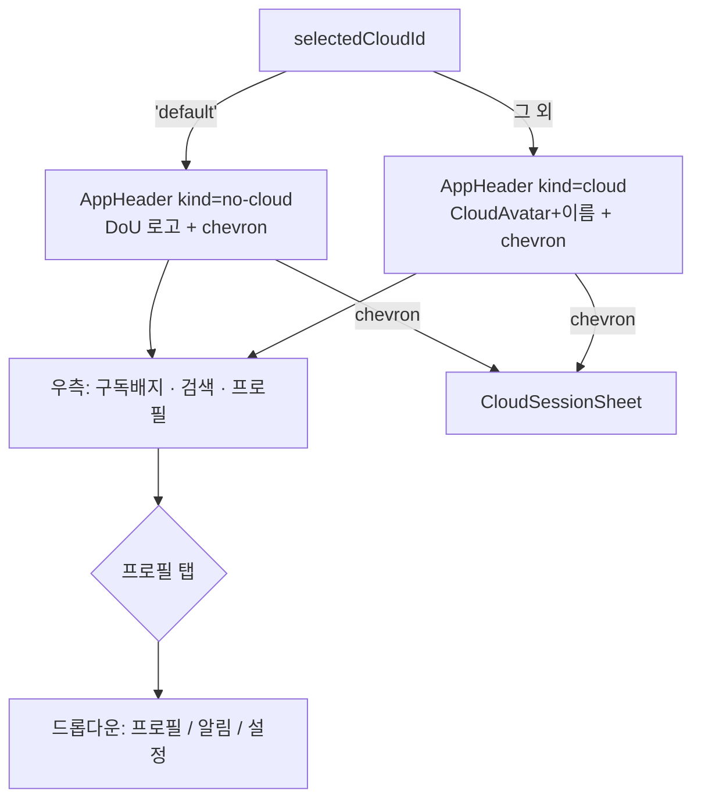
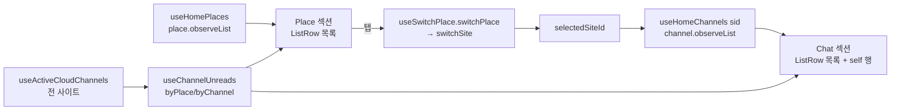
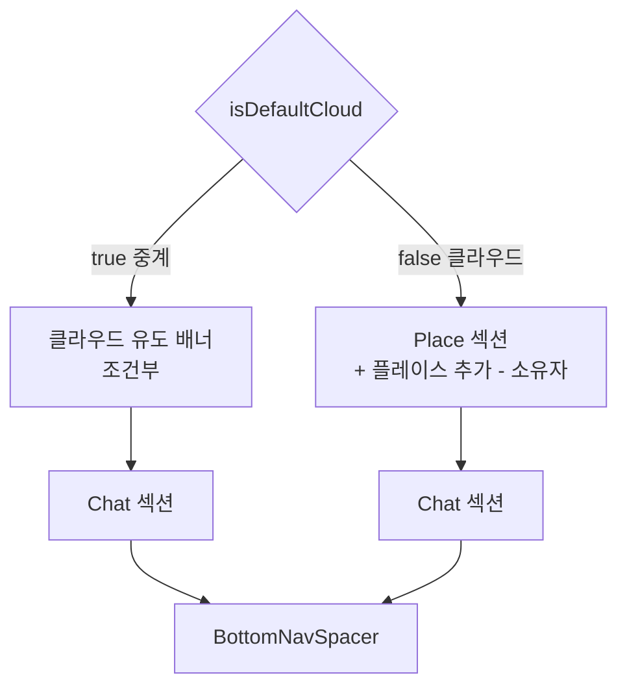
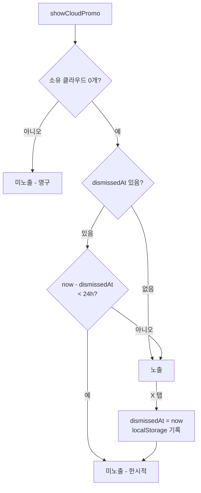
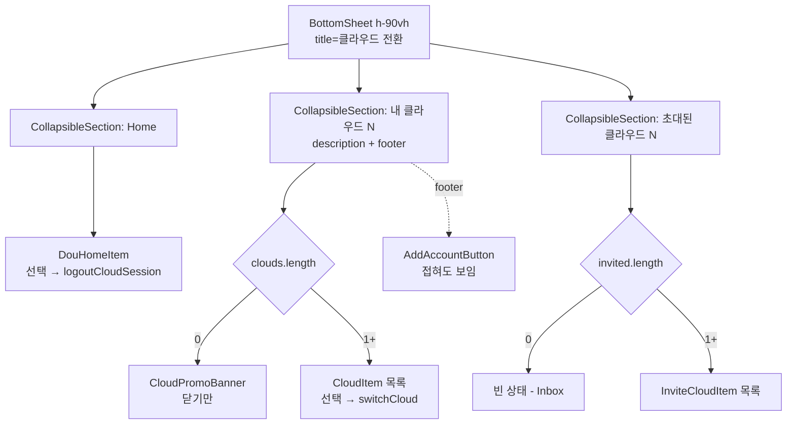
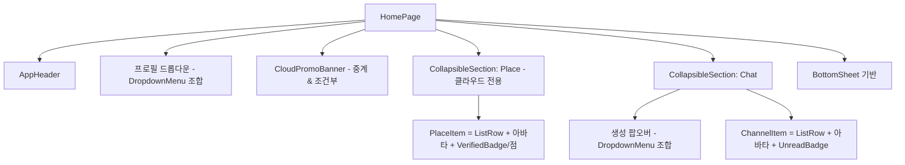

# home

> 상태: Live · 최종 갱신: 2026-08-03 · 관련 ADR: [[ADR-0013]], [[ADR-0014]], [[ADR-0034]]
>
> 대상: `apps/web/src/app/features/home` · 참조 구현: `apps/testbed/src/app/pages/ChatHomePage.tsx`

## 목적

메인 화면(`/`)이다. 활성 클라우드의 **Place 목록**과 **선택된 Place의 Channel 목록**을 보여주고,
**Place 전환**·**클라우드 전환(CloudSessionSheet)**·**미읽음 집계**를 담당한다. 최초 실행 시
[onboarding](../onboarding/README.md) 모달을 오버레이로 띄운다. 활성 플레이스에 프로필이 없으면
[플레이스 프로필](./place-profile.md) 오버레이를 감지해 띄운다(onboarding 우선).

화면은 **접속 유형(중계 vs 클라우드)**과 **구독 여부(free/pro)**에 따라 모습이 갈린다.

- **중계(default)** — 플레이스는 항상 1개이고 자동 연결되므로 Place 섹션을 노출하지 않는다. 헤더 →
  클라우드 유도 배너 → Chat 섹션만 있는 단일 목록 화면이다.
- **클라우드** — Place 섹션과 Chat 섹션을 모두 노출한다. 소유자면 `＋ 플레이스 추가`가 붙는다.

UI는 전부 `@chatic/web-ui-kit`으로 조립한다(ADR-0013). 클라우드 구독 자체를 설명하는 화면은 이 문서가
아니라 [subscription/cloud-guide.md](../subscription/cloud-guide.md)가 담당한다.

## 설계 원칙

- **web-ui-kit 우선.** 헤더·아바타·배지·행·시트는 `@chatic/web-ui-kit`에서 가져온다. 색상 hex·아이콘을
  홈에 직접 박지 않는다. 라이브러리에 없는 프리미티브만 그곳에 새로 정의하고 가져다 쓴다.
- **프레젠테이션만 교체, 데이터 흐름 보존.** repository observe + per-item sync 등록 모델
  ([architecture/data-flow.md](../../architecture/data-flow.md))과 미읽음·last-chat 계산은 바꾸지 않는다.
- **단일 활성 Place.** Place는 세로 목록에서 하나만 활성이며, 선택 시 backend active-site를 전환하고
  그 채널을 Chat 섹션에 노출한다(`useSwitchPlace`). 여러 Place의 채널을 동시에 fetch하지 않는다.
- **상태는 host가 소유.** kit 컴포넌트는 stateless — 접기 상태·드롭다운 open 상태·선택 상태는 홈이 쥔다.
- **접속 유형·구독으로 데이터 구동.** 헤더 kind·배지·팝오버 항목은 `selectedCloudId`·membership에서 파생한다.
- **중계에서는 플레이스를 감춘다, 끊지 않는다.** 중계 플레이스는 항상 1개이고 `useSwitchPlace`가 자동
  선택하므로 리스트가 정보를 더하지 않는다. 그래서 **렌더만 생략**하고 `useHomePlaces`/`useSwitchPlace`
  호출과 `selectedSiteId` 확보는 그대로 둔다 — Chat 섹션이 `selectedPlaceId`에 의존하므로 세션을 끊으면
  중계 홈이 빈 화면이 된다.
- **상한은 버튼을 숨기지 않고 시도를 토스트로 막는다.** `＋ 플레이스 추가`/`＋ 클라우드 추가`는 상한에
  도달해도 계속 보이고, 누르면 사유를 토스트로 알린다(`placeLimitReached`/`addAccount.limitExceeded`).
  "왜 버튼이 없지"보다 "왜 안 되는지"를 알려주는 편이 낫다.

## 범위

**포함**

- 헤더(`AppHeader`) — 중계=로고 / 클라우드=이름+아바타, 구독 배지, 검색 슬롯, 프로필 드롭다운.
- 클라우드 유도 배너 — 중계 홈 상단. 소유 클라우드 0개일 때만, 닫기 24시간 유지. 링크는 안내 화면으로.
- Place 섹션 — **클라우드 모드 전용**. 접기 가능, 소유자면 `＋ 플레이스 추가`.
- Chat 섹션 — 두 모드 공통. 접기 가능, `＋` 생성 팝오버(중계=`1:1 대화`, 클라우드=`그룹 방 만들기`[PRO 게이팅]).
- 클라우드 전환 시트(`CloudSessionSheet`) — `Home` / `내 클라우드` / `초대된 클라우드` 접기 섹션 3개.
- 미읽음 집계(플레이스 점 · 채널 배지 · 클라우드별 스냅샷)와 스크롤 복원.

**제외**

- 검색 기능(버튼만, TBD) · `1:1 대화` 생성 플로우(버튼만, TBD).
- 클라우드 구독 안내 화면 → [subscription/cloud-guide.md](../subscription/cloud-guide.md).
- 구독·IAP 로직(`SubscriptionSelectDialog`, `EmailVerifyDialog`) 내부.
- 세션 전환 파이프라인(`switchCloudSession` / `logoutCloudSession`) 내부.
- 클라우드 이름 변경 — 시트에서 제거됐고 `/mypage/cloud-profile`이 단일 경로다.
- `apps/desktop-web`의 클라우드 전환(좌측 `CloudRail`) — 구조가 달라 별도 설계 대상.
- 알림 설정 전용 라우트 신설(현재 없음).

## 시나리오

1. **중계(기본) 진입** — `selectedCloudId === 'default'`. 헤더 좌측 = DoU 로고 + 전환 chevron, 우측 =
   `FREE`/`PRO` 배지·검색·프로필. **Place 섹션은 렌더되지 않는다.** 그 자리에 클라우드 유도 배너(소유
   클라우드 0개 & 미dismiss일 때)가 오고, 이어서 Chat 섹션 — 최상단 `MY / 나와의 채팅` self 행 + 친구
   1:1 채팅 목록. 플레이스 자동 선택은 배후에서 그대로 일어나므로 Chat 섹션은 정상 채워진다.
2. **클라우드 진입** — `selectedCloudId !== 'default'`. 헤더 좌측 = `CloudAvatar`(이름 이니셜) + 클라우드
   이름 + chevron. Place 섹션엔 그 클라우드의 플레이스가 세로로 나열(선택=파란 체크, 미선택+미읽음=빨간 점),
   소유자면 `＋ 플레이스 추가` 노출. Chat 섹션엔 선택 플레이스의 그룹 채널 + self 행. 배너는 뜨지 않는다
   (클라우드를 이미 보유).
3. **배너 → 안내 화면** — 중계 홈 배너의 `클라우드 추가 >` 탭 → `/subscription/guide`로 이동해 클라우드가
   무엇인지 먼저 설명한다. 결제는 그 화면의 CTA가 플랜 피커로 넘긴다. 반면 전환 시트 footer의
   `＋ 클라우드 추가`는 `SubscriptionSelectDialog`로 직행한다 — 그 사용자는 이미 클라우드 관리 화면까지
   들어와 무엇을 사는지 아는 상태다(ADR-0034 개정 1).
4. **배너 닫기** — 배너 우측 `X` 탭 → 즉시 사라지고 dismiss 시각이 저장된다. **24시간 안에는 홈과 전환
   시트 어디에도 다시 뜨지 않고**, 하루가 지나면 다시 노출된다. 클라우드를 하나라도 갖게 되면 dismiss 여부와
   무관하게 영구 미노출.
5. **Place 전환**(클라우드 모드) — Place 행 탭 → `switchPlace(placeId)`가 `switchSite` 호출(낙관 선반영·
   커밋·롤백). 활성 플레이스가 없으면 목록 첫 항목 자동 선택. Chat 섹션이 새 플레이스 채널로 갱신된다.
6. **섹션 접기/펼치기** — 섹션 헤더 우측 chevron 탭 → 해당 섹션 본문 토글. 각 섹션은 독립이며, 시트의
   세 섹션도 같은 규칙을 따른다. 접혀도 섹션 헤더의 서브캡션과 footer(`＋ 클라우드 추가`)는 계속 보인다.
7. **채널 생성** — Chat 섹션 `＋` 탭 → 팝오버. 중계면 `1:1 대화`(TBD), 클라우드면 `그룹 방 만들기`.
   후자는 구독중(pro)이 아니면 `SubscriptionRequiredDialog`로 유도, 구독중이면 `CreateChannelDialog`.
8. **클라우드 전환** — 헤더 좌측 chevron 탭 → `CloudSessionSheet`(BottomSheet, 90vh 고정). 위에서부터
   세 개의 접기 섹션이다:
    - `Home` — 중계를 나타내는 `두유 홈` 행 하나. 선택 = 중계 복귀(`logoutCloudSession`).
    - `내 클라우드 N` — 0개면 유도 배너, 1개 이상이면 서브캡션(`나만의 공간에서 그룹 대화 시작`) + 소유
      클라우드 목록. **섹션 footer에 `＋ 클라우드 추가`가 개수와 무관하게 항상 있다.**
    - `초대된 클라우드 N` — 초대받은 클라우드 목록. 없으면 빈 상태.

    현재 접속 대상은 트레일링 라임 원형 체크로 표시된다. 클라우드 행 선택 = `switchCloud`. 프로비저닝
    중(`reserved`/`init`)인 행은 스피너 + `설정 중` 문구로 선택 불가이고, 30초 폴링이 `active` 전환을
    감지하면 `클라우드가 준비되었어요!` 토스트를 띄운다.

9. **클라우드 추가 상한** — `＋ 클라우드 추가` 탭 → 소유 클라우드가 이미 1개 이상이면
   `계정은 최대 1개까지 추가할 수 있어요` 토스트로 막고, 0개면 `SubscriptionSelectDialog`를 연다.
   버튼은 두 경우 모두 보인다.
10. **프로필 진입** — 헤더 우측 프로필 탭 → 드롭다운. `플레이스 설정` → `/place/:sid/settings`. 중계에서도
    `selectedSiteId`가 있으므로 동작하며, **중계에서 플레이스 설정에 닿는 유일한 경로**다.

## 다이어그램

**헤더 kind 분기**



**Place 선택 → Chat 노출**



**모드별 홈 본문 구성**



**배너 노출 판정 (홈 · 시트 공용)**



**클라우드 전환 시트 구조**



**컴포넌트 트리**



## 상세 구현

### 헤더 (`AppHeader`)

- **kind 판정**: `useSessionSelection().selectedCloudId === 'default'` → `no-cloud`, 그 외 `cloud`
  ([HomePage.tsx:51-52](../../../src/app/features/home/pages/HomePage.tsx)).
- **클라우드 이름/아바타** (`cloud` kind): 이름 = `getCloudDisplayName(activeCloud)`
  (`cloud.name ?? cloud.email.split('@')[0]`, [cloud-session/shared.ts:13](../../../src/app/features/home/components/cloud-session/shared.ts)).
  활성 클라우드 = `useCloudSessionCatalog().clouds` 중 `id === selectedCloudId`. **클라우드 이미지 필드가
  없으므로** `cloudAvatar`는 생략 → `AppHeader`가 `CloudAvatar`(이름 이니셜)로 폴백.
- **구독 배지**: `planTier = useMembershipInfo().data?.isValid ? 'pro' : 'free'`(게스트는 항상 `free`).
  `onPlanClick` → `navigate(ROUTES.subscription.root)`. (`useMembershipInfo`는 `@chatic/web-core`,
  판정 관례는 `subscription/pages/SubscriptionPage.tsx`와 동일.)
- **검색**: `onSearch` 제공(버튼 렌더) — 핸들러는 TBD 플레이스홀더(토스트/no-op).
- **프로필**: 우측 상단 아바타는 **플레이스(site) 프로필 사진만** 보여준다(`ProfileAvatar src={myProfile?.thumbnail}`,
  계정 사진 폴백 없음). 활성 플레이스에 프로필 사진이 없거나 렐리(플레이스 프로필 없음)면 `ProfileAvatar`의 기본
  글리프(기본 아바타)로 폴백한다([HomePage.tsx](../../../src/app/features/home/pages/HomePage.tsx)의 `displayImageUrl`).
  드롭다운 헤더의 이름(`displayName`)은 `resolveHeaderProfile` 계층(site→account→setup)을 유지한다. `onProfile`은
  드롭다운을 여는 트리거.
- **좌측 chevron**: `onSwitcher`는 `canSwitchCloud`일 때만 전달 → `CloudSessionSheet` open. (게스트 게이팅은
  현행 `!isGuest || isInvitedGuest` 유지.)

### 프로필 드롭다운

`AppHeader`의 `onProfile`을 트리거로 `@chatic/ui-kit`의 `DropdownMenu`를 홈에서 조합한다(kit 신규 컴포넌트
아님). 헤더 상단엔 내 플레이스 프로필(닉/썸네일), 항목:

- `프로필` → 플레이스 프로필 수정 오버레이(`PlaceProfileEditDialog`)를 연다(클라우드 종류 무관, 라우팅 아님). 활성 플레이스(`selectedSiteId`)가 없으면 비활성. 상세는 [place-profile.md](./place-profile.md).
- `설정` → `navigate(ROUTES.mypage.root)`(`/mypage` 설정 허브).
- `알림` → TBD(전용 라우트 없음).

### 클라우드 유도 배너 (`CloudPromoBanner`)

중계 홈 상단과 전환 시트 `내 클라우드` 섹션에 같은 문구로 뜨는 구독 유도 배너다. 겉면은 kit 신규
`PromoBanner`(아래 kit 변경 참고), 노출 판정·dismiss 기록은 홈이 쥔다.

- **노출 판정** — 단일 훅 `useCloudPromo()`(`features/home/hooks`)가 `{ isVisible, dismiss }`를 낸다.
  `isVisible = clouds.length === 0 && !isDismissedWithin24h`. 소유 클라우드는 `useCloudSessionCatalog().clouds`
  (시트와 동일 소스)를 쓰므로 두 위치의 판정이 어긋나지 않는다.
- **dismiss 저장** — `usePreferenceStore`에 `cloudPromoDismissedAt`(epoch ms 문자열)을 추가한다. 전례는
  `dismissedUpdateVersion`([preferenceKeys.ts:125](../../../src/app/stores/preferenceKeys.ts)) — `strategy: 'local'`,
  `defaultValue: ''`. 네이티브 브릿지가 읽을 키가 아니므로 `native+local`이 아니다. 파싱 실패/미래 시각 등
  이상값은 "닫힌 적 없음"으로 강등해, 잘못된 한 번의 쓰기가 배너를 영구히 숨기지 못하게 한다.
- **24시간 판정** — `Date.now() - dismissedAt < 24 * 60 * 60 * 1000`. 기기 로컬 시계 기준이며 조작에
  취약하지만 프로모션 배너라 허용한다(ADR-0034).
- **가로 여백은 마진이 아니라 패딩이다** — `PromoBanner`는 `w-full`이므로 카드에 `mx-*`를 주면 `100% + 여백`이
  되어 페이지가 가로로 스크롤된다. 그래서 `CloudPromoBanner`가 `px-4` 래퍼를 직접 들고, 호출부는 세로 여백만
  넘긴다. 숨을 때 컴포넌트 전체가 `null`이라 래퍼를 써도 빈 박스가 남지 않는다.
- **두 위치의 차이** — 홈은 액션 링크(`클라우드 추가 >`, 목적지 = 안내 화면)와 닫기를 모두 쓰고, 시트는 닫기만
  쓴다(시트에는 섹션 footer의 `＋ 클라우드 추가`가 이미 있다). 래퍼 컴포넌트는
  [CloudPromoBanner](../../../src/app/features/home/components/CloudPromoBanner.tsx) 하나이고, `onAddCloud`를
  넘겼는지로 링크 노출이 갈린다.
- **배치** — 중계 홈에서 스크롤 영역 최상단(Chat 섹션 위). 클라우드 모드에서는 렌더하지 않는다.

### 클라우드 추가 플로우 (`useAddCloudFlow`)

배너 링크와 시트 footer 버튼이 같은 구독 플로우로 들어가므로, 상한 가드·성공 토스트·카탈로그 무효화를
[useAddCloudFlow.tsx](../../../src/app/features/home/hooks/useAddCloudFlow.tsx) 하나에 모았다.

- `requestAddCloud()` — 소유 클라우드가 `MAX_CLOUDS`(=1) 이상이면 `addAccount.limitExceeded` 토스트로 끝내고,
  아니면 `SubscriptionSelectDialog`를 연다.
- `addCloudDialog` — 호스트가 트리에 **한 번만** 렌더하는 노드.
- **호출 지점은 `HomePage` 하나다.** 시트는 훅을 직접 부르지 않고 `onAddCloud` prop으로 받는다. 양쪽이 각자
  훅을 부르면 홈이 시트를 항상 마운트하므로 `SubscriptionSelectDialog`·`EmailVerifyDialog`·`useSubscriptionIap`
  트리가 상시 두 벌 존재하게 된다 — 지금 당장 오작동하지는 않지만(닫힌 Radix 다이얼로그는 아무것도 렌더하지
  않고, 각 IAP 인스턴스는 자기 resolver만 해소한다) 이 플로우에 인스턴스와 무관한 부수효과가 하나라도 생기면
  즉시 두 번 발화한다.
- **노드를 반환하는 이유**: 1개 상한은 서버 규칙이고
  [SubscriptionPlansPage.tsx](../../../src/app/features/subscription/pages/SubscriptionPlansPage.tsx)에도 같은
  가드가 있다. 클라이언트 쪽 사본이 늘어나면 드리프트하므로, open 상태까지 훅 안에 두어 호출부가 가드를
  재구현할 여지를 없앴다.

### Place 섹션 (`CollapsibleSection` + `ListRow`) — 클라우드 모드 전용

- `PlaceList` → `CollapsibleSection`(title=`Place`, `count={places.length}`, 접기 상태 host 소유)으로
  감싼다. 카운트는 kit `SectionHeader`가 제목 옆 `main-accent`(이 앱에선 #90C304 초록)로 렌더(Figma `2931-8611`).
- `PlaceItem`을 세로 `ListRow`로 재작성: `leading` = 아바타(`place.thumbnail`은 kit 이미지 아바타
  프리미티브로 원형 크롭 / 기본 플레이스는 DoU 마크 / 그 외 이름 이니셜), `title` = 이름 + (선택 시
  `VerifiedBadge`), `subtitle` = 플레이스 유형 라벨(`기본/내/초대받은 플레이스`), 미선택+미읽음이면 이름 옆
  빨간 점(`bg-red-500`). `usePlaceSync(place.id)` 등록은 유지. 선택 체크(`VerifiedBadge`)는 kit `bg-verified`
  토큰을 쓰므로 앱이 `--verified` CSS 변수([styles.css](../../../src/styles.css))와 tailwind `verified` 색 매핑
  ([tailwind.config.js](../../../tailwind.config.js))을 **둘 다** 정의해야 파랗게 보인다 — 앱은 web-ui-kit
  `tokens.css`를 import하지 않고 자체 토큰셋을 유지하므로 누락 시 흰 체크가 배경 없이 안 보인다.
- 기존 필터 유지: `stereo === 'place'`(중계 구독 행) 제외([PlaceList.tsx:40](../../../src/app/features/home/components/PlaceList.tsx)).
- `＋ 플레이스 추가` 행은 소유자 전용 — `permissions.canCreatePlace`로 게이팅(초대는 숨김).
- **중계에서는 이 섹션을 렌더하지 않는다.** `HomePage`가 `!isDefaultCloud`일 때만 `<PlaceList>`를 마운트한다
  ([HomePage.tsx:293](../../../src/app/features/home/pages/HomePage.tsx)). `PlaceList`의 `isDefaultCloud` prop과
  `PlaceItem`의 `isHomePlace`(중계 기본 플레이스 표기), `placeList.subtitleDefault` 라벨은 소비자가 없어지므로
  함께 정리한다.
- **`useHomePlaces`/`useSwitchPlace` 호출은 모드 무관하게 유지한다.** Chat 섹션이 `selectedPlaceId`를 요구하고
  ([HomePage.tsx:306](../../../src/app/features/home/pages/HomePage.tsx)) 중계 플레이스는 자동 선택으로만 잡히므로
  ([useSwitchPlace.ts:32](../../../src/app/features/home/hooks/useSwitchPlace.ts)), 훅을 떼면 중계 홈이
  `EmptyState`로 떨어진다. 렌더만 생략하는 것이 핵심이다.
- 중계에서 플레이스 설정에 닿는 경로는 헤더 프로필 드롭다운(`플레이스 설정`) 하나만 남는다. `/place/:id`
  라우트 자체는 존치한다.

### Chat 섹션 (`CollapsibleSection` + `ListRow` + 생성 팝오버)

- `ChannelList`이 `CollapsibleSection`(title=`t('homePage.channels','채널')`, `count={channels.length}`)으로
  감싼다. 라벨은 로컬 로케일(`public/locales`) 기준 `채널`(ko)/`Chat`(en) — 하드코딩 `Chat` 폐기.
- `ChannelItem`은 `ListRow`로 구성: `leading` = 아바타(`channel.thumbnail` 사진은 kit 이미지 아바타
  프리미티브로 원형 크롭 / self=`DefaultAvatar` / 그룹=`ChatAvatar`), `title` = (self면 `MY` 배지,
  `Badge tone="dark"`) + 이름 + **멤버수>1이면 이름 뒤 회색 pill**(Figma `2931-8611`; 예전 아바타 오버레이
  배지 폐기), `subtitle` = `useLastChat` 미리보기(현행 유지, [last-chat.md](./last-chat.md); `blurLastMessage`
  시 blur), `trailing` = 세로 스택(시간 + `UnreadBadge variant="pill"`). `MY` 배지는 모드 무관하게 `isSelf`
  기준이다(예전 relay-only 게이트 폐기).
- `useChannelSync`·`useLastChat` 등록, `useChannelUnreads` 계산은 그대로.
- 섹션 헤더 `＋`(생성 팝오버) — `DropdownMenu` 조합, 접속 유형별 단일 항목:
    - 중계(`isDefaultCloud`) → `1:1 대화`(TBD 플레이스홀더 토스트).
    - 클라우드 → `그룹 방 만들기`(미구독 시 `PlanBadge PRO` 노출): 구독(`planTier==='pro'`)이면
      `CreateChannelDialog`, 아니면 `SubscriptionRequiredDialog`
      ([components/SubscriptionRequiredDialog.tsx](../../../src/app/features/home/components/SubscriptionRequiredDialog.tsx)).

### 클라우드 전환 시트 (`CloudSessionSheet`)

겉면은 kit `BottomSheet`(`className="h-[90vh]"` 고정 높이). 본문은 **탭이 아니라 접기 섹션 3개**다
(Figma `3477-23611` / `3486-25407` / `3486-25889`).

- **섹션 구성** — 위에서부터 `Home`(카운트 없음) / `내 클라우드 N` / `초대된 클라우드 N`. 각각
  `CollapsibleSection`이고 `defaultOpen`이다. 기존 `TabBar`와 `CloudTab` 타입은 폐기한다 — 초대 개수는
  탭 라벨의 `(N)`이 아니라 섹션 헤더 카운트가 표현한다.
- **`Home` 섹션** — `DouHomeItem` 한 행. 렐리는 카탈로그에 없고 `selectedCloudId === 'default'`로만
  존재하므로 합성 행으로 렌더한다. `dou-logo.svg`(28×28 레몬) + `bg-[#90c304]` 초록 원 + `두유 홈`(ko)/
  `DoU Home`(en). 선택 시 `logoutCloudSession()`으로 중계 복귀.
- **`내 클라우드` 섹션** — `count={clouds.length}`.
    - `description` = `나만의 공간에서 그룹 대화 시작` — 단, **0개일 때는 description 대신 `CloudPromoBanner`**를
      본문에 렌더한다(Figma `3477-23611`).
    - 본문 = `sortCloudsForSwitcher`로 정렬된 `CloudItem` 목록(선택 항목 상단 고정 → `createdAt` 내림차순).
      로딩 스켈레톤·`errorLoading` + 재시도 분기는 이 본문 안에 유지한다.
    - `footer` = `AddAccountButton`. **섹션 body 밖**이므로 접혀도 보인다(Figma `3486-25889`). 기존
      `BottomSheet`의 `footer` prop 사용은 폐기한다.
- **`초대된 클라우드` 섹션** — `count={invitedClouds.length}`, 본문은 `InviteCloudItem` 목록. 0개면 기존
  중앙 정렬 빈 상태(`Inbox` 글리프 + `emptyInvited` + `emptyInvitedDescription`)를 그대로 쓴다.
- **행 레이아웃(불변)** — `[아바타 46px][이름 / 서브타이틀] … [선택 체크]`. 서브타이틀은 소유 =
  `cloud.email`([CloudItem.tsx:119](../../../src/app/features/home/components/cloud-session/CloudItem.tsx)),
  초대 = `{{owner}}님의 클라우드`(`invitedOwnerLabel`). 선택 마크는 트레일링 라임 원형 체크
  (`bg-[#b0ea10]` + 흰 체크). 상태 배지(`reserved`/`suspended`/`expired`/`error`), 프로비저닝 스피너와
  `statusReservedDescription`, 미읽음 빨간 점은 전부 유지한다.
- **이름 편집 제거** — `CloudItem`의 `Pencil` 버튼과 `onEditCloud` prop을 제거하고, `CloudNameEditDialog`와
  시트의 `editingCloud` 상태 및 `cloudsKeys.lists()` 낙관적 패치도 함께 삭제한다(소비자 소멸). 이름 변경은
  `/mypage/cloud-profile`([CloudProfileEditPage](../../../src/app/features/mypage/pages/CloudProfileEditPage.tsx))
  단일 경로다.
- **`＋ 클라우드 추가` 상시 노출** — 기존 footer 조건(`tab === 'my' && !isDefaultSelected && clouds.length < 1`,
  [CloudSessionSheet.tsx:149](../../../src/app/features/home/components/CloudSessionSheet.tsx))을 없애고 항상
  렌더한다. 1개 상한은 `handleAddAccount`의 기존 가드가 계속 담당한다 — `clouds.length >= 1`이면
  `addAccount.limitExceeded`(`계정은 최대 1개까지 추가할 수 있어요`) 토스트. 같은 상한이
  [SubscriptionPlansPage.tsx:57](../../../src/app/features/subscription/pages/SubscriptionPlansPage.tsx)에도
  있으므로 서버 규칙이며 UI가 임의로 푸는 것이 아니다.
- **로직 전부 보존** — `useCloudSessionCatalog`/`useInvitedClouds`/`switchCloud`/`logoutCloudSession`,
  30초 프로비저닝 폴링(`useInterval`), `cloudReady` 토스트, `readCloudUnreadSnapshot`, 오픈 시 `refetchClouds`.

### 레이아웃 — 플로팅 네비 위로 콘텐츠 노출

- 바텀네비는 shell(`UnifiedLayout`)이 소유하며 `FloatingTabBar`가 `fixed`로 뜬다. 현재 `HomePage` 루트는
  `pb-[98px]`로 하단에 죽은 여백을 예약해([HomePage.tsx:190](../../../src/app/features/home/pages/HomePage.tsx))
  콘텐츠가 pill 뒤로 지나가지 못한다.
- 개정: 루트 `pb-[98px]`를 제거하고 스크롤 영역([HomePage.tsx:205](../../../src/app/features/home/pages/HomePage.tsx))
  안쪽에 하단 패딩을 주어, 마지막 행이 pill 위로 스크롤되며 그 사이 콘텐츠가 반투명 pill 뒤로 비쳐 보이게 한다
  (kit 백드롭 제거와 함께). "네비만 뜨고 뒤 영역은 노출"이 목표.

### kit 컴포넌트 (`@chatic/web-ui-kit`)

홈이 쓰는 kit 자산 중 이 화면이 소유권을 갖는 것들. 색상 hex·아이콘을 홈에 직접 박지 않는 원칙(설계 원칙
1번)에 따라, 새 프리미티브는 kit에 정의하고 홈은 조립만 한다.

- **`CollapsibleSection`** (`composites/section/CollapsibleSection.tsx`) — `SectionHeader` + 회전하는
  `IconChevronDown`으로 본문을 토글한다. controlled(`open`/`onOpenChange`) + uncontrolled(`defaultOpen`) 둘 다
  지원하고, 닫히면 본문을 unmount해 중첩 행의 sync 등록이 해제된다. 이번 개정으로 슬롯 두 개가 붙었다 —
  `description?: string`(헤더 제목 아래 서브캡션, **접기 대상 아님**)과 `footer?: React.ReactNode`(본문 아래,
  접기 대상 **밖**의 고정 영역). 둘이 접힘 상태에서도 보여야 하는 근거는 Figma `3486-25889`(전 섹션 접힘)에서
  `나만의 공간에서 그룹 대화 시작`과 `＋ 클라우드 추가`가 그대로 보이는 것이다. 기존 소비자(홈 Place/Chat)는
  두 prop을 넘기지 않으므로 영향 없다. 접힘 시 실제로 클리핑 영역 **밖**에 있는지는 유닛 테스트가 containment로
  단정한다(단순 "DOM에 존재" 단정은 jsdom에 CSS가 없어 회귀를 못 잡는다).

- **`PromoBanner`(신규, `composites/feedback/`)** — 회색 라운드 박스 + 리딩 아이콘 슬롯(48px) + 본문 2줄 +
  옵셔널 액션 링크 + 옵셔널 닫기 버튼. props: `icon?`, `title`(줄바꿈 포함 문자열, `whitespace-pre-line`),
  `actionLabel?`, `onAction?`, `onDismiss?`, `dismissLabel?`, `className?`. 링크·닫기는 각각 핸들러가 있을 때만
  렌더하므로 홈(둘 다)과 시트(닫기만)를 한 컴포넌트로 덮는다. 닫기는 18px 글리프를 `size-6` 래퍼에 넣어 24px
  최소 탭 타겟을 지킨다(WCAG 2.5.8, `BottomSheet`의 닫기와 같은 형태). 배치 여백은 호출부가 `className`으로
  주므로, 배너가 스스로 숨어도 빈 여백 박스가 남지 않는다. `EmptyState`와 같은 feedback 계열에 둔다.
- **라임 원형 체크 아이콘(신규 리소스)** — 현재 `DouHomeItem`/`CloudItem`이 `lucide-react`의 `Check`를
  `bg-[#b0ea10]` 원 안에 직접 조립한다(두 곳 중복). `resources/icons`의 단일 아이콘으로 추출해 시트 두 행이
  같은 것을 쓴다. 색은 Figma 변수 `main1_Color`(`#b0ea10`)다.
- **클라우드 일러스트(신규 에셋, `resources/assets/`)** — Figma `Icon/My Cloud/내 클라우드`. 배너용 소형과
  안내 화면용 102px 두 크기로 쓰이므로 SVG 하나를 `size`로 조절한다.
- **기존 자산(불변)** — `UnreadBadge`(`variant="pill"`), `ImageAvatar`, `CloudAvatar`, `AppHeader`,
  `BottomSheet`, `FloatingTabBar`(백드롭 없음), `dou-logo.svg`. 자세한 배경은 ADR-0013/0014.

- **`SectionHeader` 카운트 색** — 제목과 같은 `text-foreground`다. 예전에는 accent 초록(#90C304, ADR-0014)이었고
  Figma `3486-26403`이 `#0c1014`로 바뀐 것을 확인해 전환했다. 처음에는 `countTone` prop으로 분기했지만, 카운트를
  넘기는 프로덕션 소비자를 전수 확인한 결과 **네 곳(홈 Place/Chat, 시트 두 섹션) 전부가 foreground를 원했고
  accent를 쓰는 곳이 하나도 없어** prop을 없애고 기본 동작으로 만들었다. 초록 카운트가 다시 필요해지면 그때
  분기를 되살린다.

### 데이터 소스 매핑 요약

| 화면 요소         | 소스                                           | 근거                        |
| ----------------- | ---------------------------------------------- | --------------------------- |
| 헤더 kind         | `selectedCloudId === 'default'`                | HomePage.tsx:52             |
| 클라우드 이름     | `getCloudDisplayName(activeCloud)`             | cloud-session/shared.ts:13  |
| 클라우드 아바타   | (이미지 없음) `CloudAvatar` 이니셜             | CloudView에 image 필드 부재 |
| 구독 tier         | `useMembershipInfo().isValid ? 'pro':'free'`   | web-core subscription 훅    |
| 헤더 프로필       | `resolveHeaderProfile`                         | lib/resolveHeaderProfile.ts |
| Place 목록/선택   | `useHomePlaces`/`useSwitchPlace`               | hooks/\*.ts                 |
| 미읽음            | `useChannelUnreads(useActiveCloudChannels)`    | hooks/\*.ts                 |
| 채널 미리보기     | `useLastChat`                                  | last-chat.md                |
| 라우트            | `ROUTES.mypage.*`/`subscription.root`          | routes/paths.ts             |
| Place 섹션 노출   | `!isDefaultCloud`                              | HomePage.tsx                |
| 배너 노출         | `useCloudPromo()` (카탈로그 0개 + 24h dismiss) | hooks/useCloudPromo.ts      |
| 배너 dismiss      | `cloudPromoDismissedAt` (epoch ms 문자열)      | stores/preferenceKeys.ts    |
| 시트 섹션 카운트  | `clouds.length` / `invitedClouds.length`       | CloudSessionSheet.tsx       |
| 클라우드 1개 상한 | `MAX_CLOUDS` → limitExceeded 토스트            | hooks/useAddCloudFlow.tsx   |

### 미읽음 계산 (불변)

채널 단위 미읽음 = 채널 최신 `chatNo`와 내 읽음 커서(`$join.chatNo`)의 차분(시스템 메시지 보정 포함):

```
unread(channel) = max(0, (channel.chatNo ?? 0) - ($join.chatNo ?? 0) - systemInWindow)
```

`useChannelUnreads(channels)`가 각 채널에 임베드된 `$join.chatNo`에서 파생한다(별도 join 구독 없음). 홈은
`useActiveCloudChannels`(활성 클라우드 전 사이트)로 집계해 Place별(`byPlace`, 미읽음 점)·채널별(`byChannel`,
`UnreadBadge`) 총계를 낸다. 앱 아이콘 배지는 `UnreadBadgeRunner`(AppRuntime)가 전역 소유 — 이 페이지가 아니다.

## 검증 방법

**유닛 테스트**

```bash
npx nx test web-ui-kit && npx nx test web
```

- `CollapsibleSection.test.tsx` — `description`/`footer`가 렌더되고 **접힘 상태에서도 DOM에 남는지**(본문만
  unmount) 확인. 두 prop 미전달 시 마크업이 그대로인지도 확인(기존 Place/Chat 회귀 방지).
- `PromoBanner.test.tsx` — `onAction`/`onDismiss` 유무에 따른 링크·닫기 조건부 렌더, 클릭 콜백, 아이콘 슬롯.
- `useCloudPromo.test.ts` — 노출 판정 진리표: 클라우드 0개+미dismiss=노출 / 0개+23h=미노출 /
  0개+TTL초과=노출 / 1개=미노출(dismiss 무관), `dismiss()` 즉시 반영.
- `usePreferenceStore.test.ts` — `parseCloudPromoDismissedAt`(빈 값·NaN·음수·`Infinity`·미래 시각을 모두 0으로
  강등) 및 `dismissCloudPromo`가 localStorage에만 쓰고 네이티브 브릿지는 건드리지 않는지.
- 기존 `shared.test.ts`(`sortCloudsForSwitcher`, `isProvisioning`, `getCloudDisplayName`)는 로직 미변경으로
  그대로 통과한다.

**빌드**

```bash
npx nx build web
```

`TabBar`/`CloudTab`/`CloudNameEditDialog` 삭제 후 잔존 import가 없는지를 빌드가 잡아낸다.

**Storybook 시각 확인**

`CollapsibleSection` → `CollapsedWithDescriptionAndFooter`: 접힌 상태에서 서브캡션과 `＋ 클라우드 추가`가
남고 chevron만 회전하는지. `PromoBanner` → `HomeVariant` / `SheetVariant`: 링크·닫기 조합.

**수동 확인 포인트**

| 상황                                  | 확인할 것                                                                  |
| ------------------------------------- | -------------------------------------------------------------------------- |
| 중계 진입, 클라우드 0개               | Place 섹션 없음 · 배너 노출 · Chat 섹션 정상(자동 선택된 플레이스의 채널)  |
| 배너 `X` 탭                           | 즉시 사라짐 → 시트를 열어도 배너 없음 → 앱 재시작 후에도 24h 동안 없음     |
| 중계 진입, 클라우드 1개 이상          | 배너 미노출(홈·시트 양쪽)                                                  |
| 시트 전 섹션 접기                     | 서브캡션과 `＋ 클라우드 추가`가 계속 보이고 시트 높이 90vh 유지            |
| `＋ 클라우드 추가`(클라우드 1개 보유) | 버튼 보임 + 탭 시 `계정은 최대 1개까지 추가할 수 있어요` 토스트            |
| 초대 클라우드 0개                     | `초대된 클라우드 0` 헤더 + 빈 상태                                         |
| 프로비저닝 중 클라우드                | 스피너·`설정 중` 문구·선택 불가 유지, 30초 폴링 후 `active` 전환 시 토스트 |
| 클라우드 모드 진입                    | Place 섹션 복귀 · 배너 없음 · 소유자면 `＋ 플레이스 추가`                  |
| 중계에서 플레이스 설정                | 헤더 프로필 드롭다운 → `플레이스 설정`이 정상 진입                         |

워크트리 프리뷰 구동은 [[preview-web-from-worktree]] 참고. 중계 세션만으로는 시트의 소유 클라우드 목록을
검증할 수 없으니 클라우드 보유 계정으로도 한 번 확인한다.

> 남은 제품 판단 하나: 마이페이지 구독 MenuCard가 `!isGuest`로 게이팅되어 있어 게스트는
> [클라우드 안내 화면](../subscription/cloud-guide.md)에 닿지 못한다. 안내의 1차 타깃이 미구독자인데 게스트가
> 그 정의에 가장 잘 맞으므로 어긋남이 남아 있다 — 게이팅 완화는 구독 섹션 전체의 노출 정책 문제라 이번
> 범위에서 손대지 않았다.
