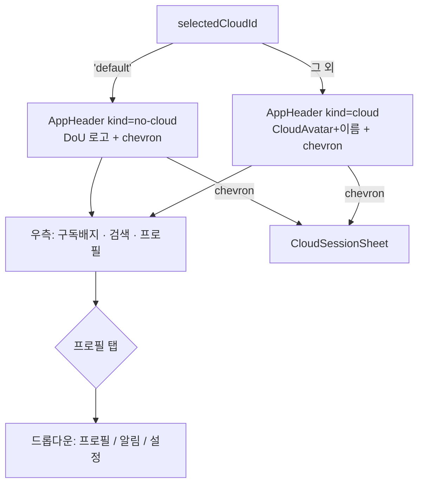
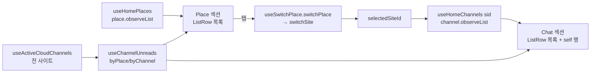
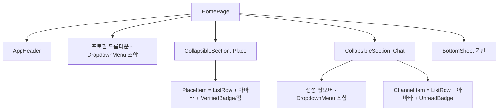

# home

> 상태: Live · 최종 갱신: 2026-07-15 · 관련 ADR: [[ADR-0013]]
>
> 대상: `apps/web/src/app/features/home` · 참조 구현: `apps/testbed/src/app/pages/ChatHomePage.tsx`

## 목적

메인 화면(`/`)이다. 활성 클라우드의 **Place 목록**과 **선택된 Place의 Channel 목록**을 보여주고,
**Place 전환**·**클라우드 전환(CloudSessionSheet)**·**미읽음 집계**를 담당한다. 최초 실행 시
[onboarding](../onboarding/README.md) 모달을 오버레이로 띄운다. 활성 플레이스에 프로필이 없으면
[플레이스 프로필 생성](./place-profile-create.md) 오버레이를 감지해 띄운다(onboarding 우선).

이번 개정(ADR-0013)의 목표는 **손수 만든 홈 UI를 `@chatic/web-ui-kit`로 마이그레이션**하는 것이다.
데이터 흐름·훅·동기화 등록 모델은 그대로 두고, 헤더·Place/Chat 섹션·행·클라우드 전환 시트를 디자인
시스템 컴포넌트로 교체한다. 화면은 **접속 유형(중계 vs 클라우드)**과 **구독 여부(free/pro)**에 따라
상태가 달라진다.

## 설계 원칙

- **web-ui-kit 우선.** 헤더·아바타·배지·행·시트는 `@chatic/web-ui-kit`에서 가져온다. 색상 hex·아이콘을
  홈에 직접 박지 않는다. 라이브러리에 없는 프리미티브만 그곳에 새로 정의하고 가져다 쓴다.
- **프레젠테이션만 교체, 데이터 흐름 보존.** repository observe + per-item sync 등록 모델
  ([architecture/data-flow.md](../../architecture/data-flow.md))과 미읽음·last-chat 계산은 바꾸지 않는다.
- **단일 활성 Place.** Place는 세로 목록에서 하나만 활성이며, 선택 시 backend active-site를 전환하고
  그 채널을 Chat 섹션에 노출한다(`useSwitchPlace`). 여러 Place의 채널을 동시에 fetch하지 않는다.
- **상태는 host가 소유.** kit 컴포넌트는 stateless — 접기 상태·드롭다운 open 상태·선택 상태는 홈이 쥔다.
- **접속 유형·구독으로 데이터 구동.** 헤더 kind·배지·팝오버 항목은 `selectedCloudId`·membership에서 파생한다.

## 범위

**포함**

- 헤더를 `AppHeader`로 교체 (중계=로고 / 클라우드=이름+아바타, 구독 배지, 검색 슬롯, 프로필).
- 우측 프로필 → 드롭다운(`프로필/알림/설정`).
- Place 섹션·Chat 섹션을 각각 **접기 가능한 섹션**으로 재구성(신규 kit `CollapsibleSection`).
- Place/Channel 행을 `ListRow` + kit 아바타/배지로 재작성(하드코딩 제거).
- Chat 섹션 `＋` → 컨텍스트별 생성 팝오버(중계=`1:1 대화`, 클라우드=`그룹 방 만들기`[PRO 게이팅]).
- 클라우드 전환 시트를 `BottomSheet` 기반으로 **시각 리스킨**(기존 로직 보존).

**제외**

- 검색 기능(버튼만, TBD) · `1:1 대화` 생성 플로우(버튼만, TBD).
- 데이터 흐름·미읽음·last-chat·sync 등록 로직 변경.
- 클라우드 전환 시트의 프로비저닝/이름편집/연결끊기/계정추가 **로직** 변경(시각만).
- 알림 설정 전용 라우트 신설(현재 없음 — [리스크](#리스크와-미지수) 참조).

## 시나리오

1. **중계(기본) 진입** — `selectedCloudId === 'default'`. 헤더 좌측 = DoU 로고 + 전환 chevron(게스트가
   아니거나 초대 클라우드 보유 시), 우측 = `FREE`/`PRO` 배지·검색·프로필. Place 섹션엔 기본 플레이스
   1개(`DoU Home / 기본 플레이스`, 파란 체크)만, `＋ 플레이스 추가` 없음. Chat 섹션 최상단 `MY / 나와의 채팅`
   self 행 + 친구 1:1 채팅 목록.
2. **클라우드 진입** — `selectedCloudId !== 'default'`. 헤더 좌측 = `CloudAvatar`(이름 이니셜) + 클라우드
   이름 + chevron. Place 섹션엔 그 클라우드의 플레이스가 세로로 나열(선택=파란 체크, 미선택+미읽음=빨간 점),
   소유자면 `＋ 플레이스 추가` 노출. Chat 섹션엔 선택 플레이스의 그룹 채널 + self 행.
3. **Place 전환** — Place 행 탭 → `switchPlace(placeId)`가 `switchSite` 호출(낙관 선반영·커밋·롤백). 활성
   플레이스가 없으면 목록 첫 항목 자동 선택. Chat 섹션이 새 플레이스 채널로 갱신된다.
4. **섹션 접기/펼치기** — Place·Chat 섹션 헤더 우측 chevron 탭 → 해당 섹션 본문 토글. 두 섹션은 독립.
5. **채널 생성** — Chat 섹션 `＋` 탭 → 팝오버. 중계면 `1:1 대화`(TBD), 클라우드면 `그룹 방 만들기`.
   후자는 구독중(pro)이 아니면 `SubscriptionRequiredDialog`로 유도, 구독중이면 `CreateChannelDialog`.
6. **클라우드 전환** — 헤더 좌측 chevron 탭 → `CloudSessionSheet`(BottomSheet). `내 클라우드`/`초대된 클라우드`
   탭, 선택 시 `switchCloud`, 연결끊기·계정추가·이름편집·프로비저닝 배지 보존.
7. **프로필 진입** — 헤더 우측 프로필 탭 → 드롭다운. `프로필` → 프로필 편집(중계=account edit, 클라우드=
   site-profile), `설정` → `/mypage`, `알림` → TBD.

## 다이어그램

**헤더 kind 분기**



**Place 선택 → Chat 노출**



**컴포넌트 트리(개정 후)**



## 상세 구현

### 헤더 (`AppHeader`)

- **kind 판정**: `useSessionSelection().selectedCloudId === 'default'` → `no-cloud`, 그 외 `cloud`
  ([HomePage.tsx:51-52](../../../src/app/features/home/pages/HomePage.tsx)).
- **클라우드 이름/아바타** (`cloud` kind): 이름 = `getCloudDisplayName(activeCloud)`
  (`cloud.name ?? cloud.email.split('@')[0]`, [cloud-session/shared.ts:13](../../../src/app/features/home/components/cloud-session/shared.ts)).
  활성 클라우드 = `useCloudSessionCatalog().clouds` 중 `id === selectedCloudId`. **클라우드 이미지 필드가
  없으므로** `cloudAvatar`는 생략 → `AppHeader`가 `CloudAvatar`(이름 이니셜)로 폴백.
- **구독 배지**: `planTier = useMembershipInfo().data?.isValid ? 'pro' : 'free'`(게스트는 항상 `free`).
  `onPlanClick` → `navigate(ROUTES.subscription.root)`. (`useMembershipInfo`는 `@chatic/web-core`,
  판정 관례는 `subscription/pages/SubscriptionPage.tsx`와 동일.)
- **검색**: `onSearch` 제공(버튼 렌더) — 핸들러는 TBD 플레이스홀더(토스트/no-op).
- **프로필**: `avatar = <ProfileAvatar src={headerProfile.imageUrl} size={36} />`(onSelect 없음 → 편집 배지
  없이 사진+글리프 폴백). 소스는 기존 `resolveHeaderProfile`
  ([lib/resolveHeaderProfile.ts](../../../src/app/features/home/lib/resolveHeaderProfile.ts)) 그대로. `onProfile`은
  드롭다운을 여는 트리거로 쓴다(아래).
- **좌측 chevron**: `onSwitcher`는 `canSwitchCloud`일 때만 전달 → `CloudSessionSheet` open. (게스트 게이팅은
  현행 `!isGuest || isInvitedGuest` 유지.)

### 프로필 드롭다운

`AppHeader`의 `onProfile`을 트리거로 `@chatic/ui-kit`의 `DropdownMenu`를 홈에서 조합한다(kit 신규 컴포넌트
아님). 헤더 상단엔 내 플레이스 프로필(닉/썸네일), 항목:

- `프로필` → `navigate(isDefaultCloud ? ROUTES.mypage.account.edit : ROUTES.mypage.account.siteProfile)`
  (경로 근거: [routes/paths.ts:66,69](../../../src/app/routes/paths.ts), 현행 `profileTarget` 분기와 동일).
- `설정` → `navigate(ROUTES.mypage.root)`(`/mypage` 설정 허브).
- `알림` → TBD(전용 라우트 없음 — [리스크](#리스크와-미지수)).

### Place 섹션 (`CollapsibleSection` + `ListRow`)

- `PlaceList` → `CollapsibleSection`(title=`Place`, 접기 상태 host 소유)으로 감싼다.
- `PlaceItem`을 세로 `ListRow`로 재작성: `leading` = 아바타(`place.thumbnail` 이미지 / 기본 플레이스는 DoU
  마크 / 그 외 이름 이니셜), `title` = 이름 + (선택 시 `VerifiedBadge`), `subtitle` = 플레이스 유형 라벨
  (`기본/내/초대받은 플레이스`), 미선택+미읽음이면 이름 옆 빨간 점. `usePlaceSync(place.id)` 등록은 유지.
- 기존 필터 유지: `stereo === 'place'`(중계 구독 행) 제외([PlaceList.tsx:53](../../../src/app/features/home/components/PlaceList.tsx)).
- `＋ 플레이스 추가` 행은 소유자 전용 — `permissions.canCreatePlace`로 게이팅(중계/초대는 숨김).

### Chat 섹션 (`CollapsibleSection` + `ListRow` + 생성 팝오버)

- `ChannelList`이 `CollapsibleSection`(title=`Chat`)으로 감싼다.
- `ChannelItem`은 `ListRow`로 구성: `leading` = 아바타(`channel.thumbnail` 사진 / self=`DefaultAvatar` / 그룹=`ChatAvatar`,
  멤버수>1이면 오버레이 배지), `title` = (self면 `MY` 배지, `Badge tone="dark"`) + 이름, `subtitle` = `useLastChat`
  미리보기(현행 유지, [last-chat.md](./last-chat.md); `blurLastMessage` 시 blur), `trailing` = 세로 스택(시간 +
  `UnreadBadge variant="pill"`). `MY` 배지는 모드 무관하게 `isSelf` 기준이다(예전 relay-only 게이트 폐기).
- `useChannelSync`·`useLastChat` 등록, `useChannelUnreads` 계산은 그대로.
- 섹션 헤더 `＋`(생성 팝오버) — `DropdownMenu` 조합, 접속 유형별 단일 항목:
    - 중계(`isDefaultCloud`) → `1:1 대화`(TBD 플레이스홀더 토스트).
    - 클라우드 → `그룹 방 만들기`(미구독 시 `PlanBadge PRO` 노출): 구독(`planTier==='pro'`)이면
      `CreateChannelDialog`, 아니면 `SubscriptionRequiredDialog`
      ([components/SubscriptionRequiredDialog.tsx](../../../src/app/features/home/components/SubscriptionRequiredDialog.tsx)).

### 클라우드 전환 시트 (`CloudSessionSheet`)

- 겉면을 kit `BottomSheet`로 교체(현재 `@chatic/ui-kit` `Sheet` 직접 사용,
  [CloudSessionSheet.tsx:121-231](../../../src/app/features/home/components/CloudSessionSheet.tsx)). 상단
  `ProfileSection` 제거(프로필은 헤더 드롭다운으로 이동). 행은 서브타이틀(소유=계정/이메일, 초대=`OO님의
클라우드`)로 리스킨.
- **로직 전부 보존**: `useCloudSessionCatalog`/`useInvitedClouds`/`switchCloud`/`logoutCloudSession`,
  프로비저닝 폴링·`cloudReady` 토스트·이름 편집(`CloudNameEditDialog`)·계정 추가.

### kit 변경 — `CollapsibleSection`(신규), `UnreadBadge`(pill variant)

- **`CollapsibleSection`** (`libs/web-ui-kit/src/composites/section/CollapsibleSection.tsx`) — `SectionHeader`를
  감싸고 우측 actions에 회전하는 `IconChevronDown`을 두어 본문을 토글한다. 접기 상태는 controlled
  (`open`/`onOpenChange`) + uncontrolled(`defaultOpen`, 기본 open) 둘 다 지원하며, 닫히면 본문을 unmount해
  중첩 행의 sync 등록이 해제된다. 스토리 + 유닛 테스트 동반, `composites/section/index.ts`에 export.
- **`UnreadBadge`에 `variant` 추가** — 기존 accent 텍스트(`accent`, 기본)에 채워진 핑크 pill(`pill`)을 더했다.
  채널 행은 `pill`을 쓴다(Figma의 채운 배지). 기존 소비자는 기본값 유지로 영향 없음.

### 데이터 소스 매핑 요약

| 화면 요소       | 소스                                         | 근거                        |
| --------------- | -------------------------------------------- | --------------------------- |
| 헤더 kind       | `selectedCloudId === 'default'`              | HomePage.tsx:52             |
| 클라우드 이름   | `getCloudDisplayName(activeCloud)`           | cloud-session/shared.ts:13  |
| 클라우드 아바타 | (이미지 없음) `CloudAvatar` 이니셜           | CloudView에 image 필드 부재 |
| 구독 tier       | `useMembershipInfo().isValid ? 'pro':'free'` | web-core subscription 훅    |
| 헤더 프로필     | `resolveHeaderProfile`                       | lib/resolveHeaderProfile.ts |
| Place 목록/선택 | `useHomePlaces`/`useSwitchPlace`             | hooks/\*.ts                 |
| 미읽음          | `useChannelUnreads(useActiveCloudChannels)`  | hooks/\*.ts                 |
| 채널 미리보기   | `useLastChat`                                | last-chat.md                |
| 라우트          | `ROUTES.mypage.*`/`subscription.root`        | routes/paths.ts             |

### 미읽음 계산 (불변)

채널 단위 미읽음 = 채널 최신 `chatNo`와 내 읽음 커서(`$join.chatNo`)의 차분(시스템 메시지 보정 포함):

```
unread(channel) = max(0, (channel.chatNo ?? 0) - ($join.chatNo ?? 0) - systemInWindow)
```

`useChannelUnreads(channels)`가 각 채널에 임베드된 `$join.chatNo`에서 파생한다(별도 join 구독 없음). 홈은
`useActiveCloudChannels`(활성 클라우드 전 사이트)로 집계해 Place별(`byPlace`, 미읽음 점)·채널별(`byChannel`,
`UnreadBadge`) 총계를 낸다. 앱 아이콘 배지는 `UnreadBadgeRunner`(AppRuntime)가 전역 소유 — 이 페이지가 아니다.

## 검증 방법

- **유닛 테스트** — `nx test web-ui-kit`(147개 통과): `CollapsibleSection.test.tsx`(열림/닫힘·controlled·actions),
  `Badges.test.tsx`의 `UnreadBadge` pill variant. 기존 홈 훅 테스트(`useSwitchPlace`/`useChannelUnreads`/
  `resolveHeaderProfile`)는 로직 미변경으로 그대로 통과.
- **빌드** — `nx build web` 통과: HomePage + 재작성된 Place/Chat/시트 + web-ui-kit 전체 모듈 그래프가 vite/rollup으로
  클린 번들됨(import/JSX 해석 검증).
- **수동 확인(preview)** — 중계/클라우드/초대클라우드 3상태에서: 헤더 kind·배지(free/pro)·프로필 드롭다운,
  Place 세로목록+선택 체크+미읽음 점, Place/Chat 접기, 생성 팝오버(중계 1:1 / 클라우드 그룹·구독 게이팅),
  클라우드 전환 시트. (홈은 인증 뒤 화면이라 로그인 세션에서 확인한다.)

> 환경 주의: 이 워크트리는 `node_modules`가 불완전(`@nx/react` 미설치)해 `nx typecheck`가 `@nx/react/typings`
> 에서 실패한다 — 코드 문제가 아니라 설치 문제다. 타입 확인은 `nx build web`(성공)과 web-ui-kit 소스 tsc로 갈음했다.
