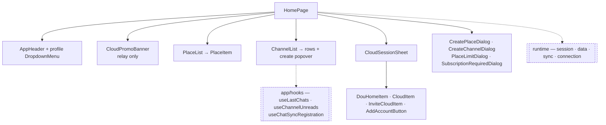

# home

**The main screen at `/` — the list of places in the cloud you are connected to, the list of
channels in the place you have selected, and the sheet that moves you between clouds.** It also owns
the header identity, the unread marks for everywhere you are not currently looking, and the two
creation entries that open a new place or group room.

This document covers the **overview and structure**. The four topics with enough detail to stand
alone are listed under [Documents](#documents).

## Purpose

Home assembles screens out of runtime data; it owns no transport and no cache. Data is read through
repository `observe*` streams, refreshed by registered sync targets, and written through repository
commands — all of it reached through `runtime` from `@chatic/app-runtime`.

```bash
grep -rn "features/home" --include='*.ts' --include='*.tsx' apps/web/src | grep -v node_modules
```

**Home does not own** the subscribe-a-cloud flow ([subscription](../subscription/README.md)), the
place profile form and settings hub ([place](../place/README.md)), the room and its settings
([channels](../channels/README.md)), or invite issuing and acceptance ([invite](../invite/README.md)).
What it owns of each is the entry point and nothing behind it.

## Design principles

1. **Assemble from `@chatic/web-ui-kit`.** Header, avatars, badges, rows, sections and sheets come
   from the kit. A colour hex or an icon written directly into a home component is the violation; a
   missing primitive is added to the kit and then used.
2. **The host owns state.** Kit components are stateless. Collapsed sections, open dropdowns and the
   selected row are held by `HomePage` or by the list that renders them.
3. **One active place.** Selecting a place switches the backend active site and the Chat section
   follows it. Channels of several places are never fetched at once.
4. **Relay hides places, it does not disconnect them.** The relay has exactly one place and it is
   auto-selected, so the list would add nothing — only the **render** is skipped.
   `useHomePlaces`/`useSwitchPlace` still run, because the Chat section depends on `selectedPlaceId`
   and a relay home without it is an empty screen.
5. **A limit never removes a button.** `＋` entries stay visible at their cap and the attempt
   explains the refusal. "Why is this gone" is a worse question than "why can't I".
6. **Marks, not counts, for what you cannot see.** A place you are not in and a cloud you are not
   connected to are represented by presence marks, never numbers — their data is only as fresh as
   your last visit.
7. **Rendering never fetches.** The channel list is a pure cache read. Freshness is a separate
   registration the surface mounts, so scrolling a row into view cannot make a request.

## Scope

**In** — the header and its profile dropdown; the cloud promo banner; the Place section; the Chat
section with its previews, unread badges and creation popover; the cloud-switcher sheet; the place
and cloud unread marks; the three app-global runners that home exports.

**Out** — search itself (the header button only navigates to `/search`), the subscribe and IAP flow
([subscription](../subscription/README.md)), the profile form ([place](../place/README.md)), invite
issuing and acceptance ([invite](../invite/README.md)), and `apps/desktop-web`'s own switcher, which
is a different structure in a different app.

## Structure



The arrow that does **not** exist: home never imports `features/subscription`. The add-cloud button
raises a request on a store, and the private router mounts the flow's own host to answer it. That
keeps a feature that owns payment dialogs out of the screen that merely offers them.

### Boot and mount points

Three components live in this feature but are mounted by `AppRuntime`, not by the page, so they keep
working on every route:

```text
AppRuntime
├── ActiveCloudDataProvider   (app/hooks — the one channel + join observation)
├── UnreadBadgeRunner         → app-icon badge total
├── CloudPushMarkRunner       → cross-cloud push marks (foreground + native drain)
└── CloudActivatedRunner      → 'cloud.activated' socket unicast → toast + catalog invalidation
```

`CloudActivatedRunner` is pinned to the **relay** socket slot, not the active one. The unicast
targets a user and is delivered by the relay deployment, so subscribing on the active slot would
miss it exactly in the common case — sitting in cloud A while cloud B finishes provisioning.

### Directories

```text
apps/web/src/app/features/home/
├── index.tsx                      barrel — hooks, routes, pages, the 3 runners
├── CloudActivatedRunner.tsx       app-global, mounted by AppRuntime
├── CloudPushMarkRunner.tsx        app-global, mounted by AppRuntime
├── UnreadBadgeRunner.tsx          app-global, mounted by AppRuntime
├── pages/HomePage.tsx             the screen — all page state lives here
├── routes/index.tsx               HomeRoutes, which renders HomePage and nothing else
├── components/                    9 exported, plus PlaceItem (used only by PlaceList)
│   └── cloud-session/             7 files — the switcher sheet's rows and helpers
├── hooks/                         6 hooks; the barrel exports 5
├── lib/resolveHeaderProfile.ts    header identity tiers
├── stores/useCloudPushMarkStore.ts
├── types/index.ts                 re-exports DomainChannel and DomainPlace — nothing of its own
└── utils/resolvePushCloudId.ts    which cloud a push came from
```

Files whose contents the name does not give away:

- `components/ChannelEmptyState.tsx` — two readings of "no rooms here", `invited` and `owner`,
  because what the user can do about it differs.
- `components/PlaceLimitDialog.tsx` — the place cap, offered as two actions rather than described
  in a toast.
- `components/cloud-session/shared.ts` — `isProvisioning`, `getCloudDisplayName` and
  `sortCloudsForSwitcher`; there is no file per helper.
- `components/cloud-session/CloudUnreadBadge.tsx` — the unread mark all three switcher row types
  share, so they cannot drift apart.
- `hooks/useAddCloudFlow.tsx` — 22 lines that raise a request on a store. It renders nothing and
  checks no quota; both belong to the subscription flow's host.
- `hooks/useReconcileInvitedClouds.ts` — purges an `invited` cache row for a cloud the signed-in
  account actually owns. **It has no caller today.**

## Usage

Home is mounted by the private router as a route element:

```tsx
// routes/PrivateRoutes.tsx
import { HomeRoutes } from '../features/home';
```

The runners are mounted separately, by `AppRuntime`:

```tsx
// runtime/AppRuntime.tsx
import { CloudActivatedRunner, CloudPushMarkRunner, UnreadBadgeRunner } from '../features/home';
```

Those imports, plus `useUpdatePlace` — which `features/place`'s edit page takes from this barrel —
are the only things outside home that reach into it:

```bash
grep -rn "features/home'\|'\.\./\.\./home'" --include='*.ts' --include='*.tsx' apps/web/src
```

## Scenarios

### 1. Relay home

`selectedCloudId === 'default'`. The header is `kind="no-cloud"` — the DoU logo, the plan pill,
search, and the profile avatar. **No Place section is rendered**; its slot goes to
`CloudPromoBanner`, which appears only while the account owns no cloud and has not dismissed it
within the last 24 hours. Below it, the Chat section: sent invites first, then the self row and the
1:1 rooms. Place selection still happens invisibly, so the list fills normally.

### 2. Cloud home

`selectedCloudId !== 'default'`. The header is `kind="cloud"` — a `CloudAvatar` built from the
cloud's initials, because `CloudView` carries no image field, beside the cloud name. The name comes
from the local cache first and the relay catalog second, so a rename shows here immediately. On a
cold start with neither, the header shows a loading placeholder rather than a nameless circle.

The Place section lists the cloud's places, the selected one carrying a `VerifiedBadge` and the
others a dot when they have unread. An owner also gets `＋ 플레이스 추가`.

### 3. Switching place

Tapping a place row calls `switchPlace(placeId)` → `switchSite`, which owns the optimistic apply,
the commit and the rollback. When no place is active — right after a cloud switch, for instance —
`useSwitchPlace` auto-selects the first. With no place at all, the Chat section is replaced by an
`EmptyState` inviting the user to connect to one.

### 4. Switching cloud

The header's switcher opens `CloudSessionSheet`, a `BottomSheet` of three collapsible sections:
`Home` (one synthetic relay row, selecting it calls `logoutCloudSession`), `내 클라우드` (owned
clouds, sorted with the active one pinned to the top, with `＋ 클라우드 추가` as a **footer** so it
survives collapsing), and `초대된 클라우드`. A provisioning row is not selectable and shows a
spinner; while the sheet is open and any row is provisioning, a 30-second poll refetches and a
ready cloud raises a toast. The switcher is open to everyone, guests included — it is the way to
reach DoU Home, see invited clouds, or subscribe.

### 5. Creating something

The Place section's `＋` and the Chat section's create popover both route through `HomePage`
handlers that gate on ownership, cap and plan before opening an overlay. The popover's contents
differ by mode: on the relay `1:1 대화` plus, **only while unpaid**, a `그룹 방 만들기` upsell row;
on a cloud, `그룹 방 만들기` alone. See [place-channel-create](./place-channel-create.md).

### 6. Accepting an invite

Home does not draw the accept screen. When an invite deep link has been resolved elsewhere and a
channel is pending, `HomePage` navigates straight into that room with `replace`. There is no
place-profile gate in front of it — an invitee with no profile goes to the room and fills it in
later. The screen itself belongs to [invite](../invite/README.md).

## Documents

| File                                                 | What it covers                                                                 |
| ---------------------------------------------------- | ------------------------------------------------------------------------------ |
| [last-chat.md](./last-chat.md)                       | The message preview and the list order, and why the server's summary is unused |
| [unread-dot.md](./unread-dot.md)                     | The unread formula, the place and cloud marks, cross-cloud push resolution     |
| [place-channel-create.md](./place-channel-create.md) | Creating a place or a group room — gating, caps, the two overlays              |
| [place-profile.md](./place-profile.md)               | Header identity tiers, the setup nudge, the branded place name                 |

## How to verify

```bash
npx nx typecheck web
npx nx test web
```

Traps that apply here:

- `web`'s **test** target is excluded from `.github/workflows/verify.yml`. It sits at a known
  handful of failures out of ~2720, so a green CI run is not evidence that a home test passes —
  run it yourself and compare against the baseline the workflow's comment records.
- `typecheck` is in the gate and is expected clean. It pulls `@chatic/web-ui-kit`, so a kit change
  can turn this red without a line of `apps/web` changing.
- A single suite is faster than the whole target:
    ```bash
    npx jest --config apps/web/jest.config.js --rootDir apps/web ChannelList HomePage CloudSessionSheet
    ```
- Home's three runners are mounted under `AppRuntime`. A test that renders `HomePage` alone gets
  none of them, and a badge or mark assertion there will pass for the wrong reason.
