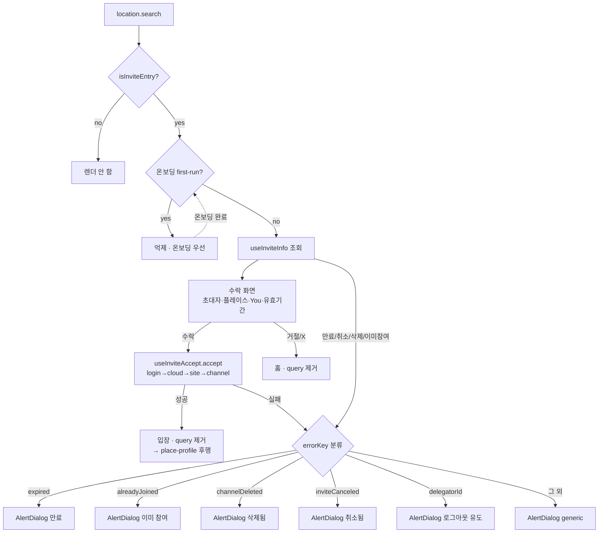
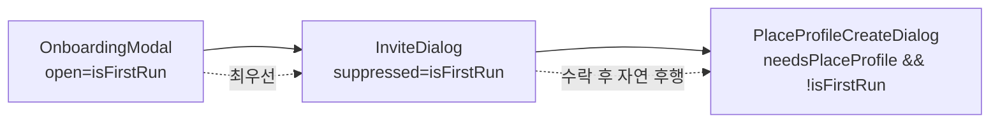
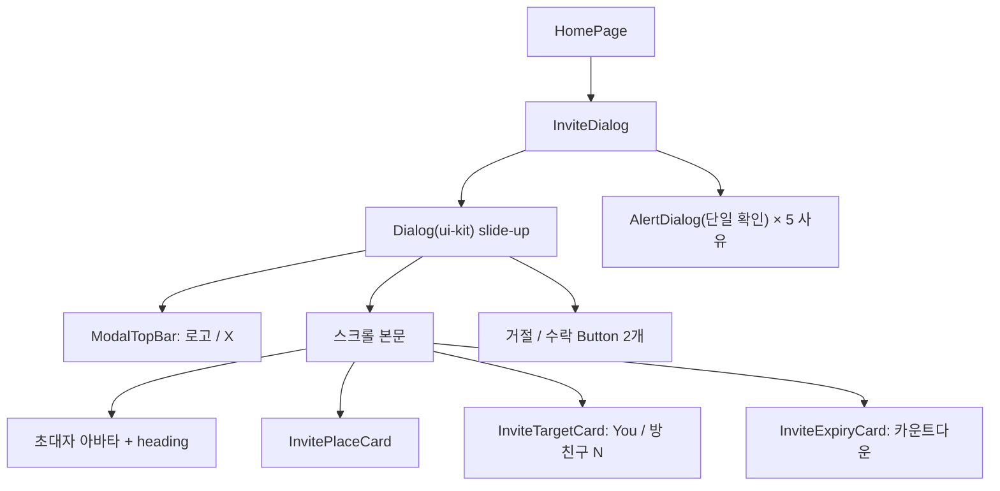

# 초대 수락 (Invite Accept)

> 상태: Live · 최종 갱신: 2026-07-16 · 관련 ADR: [0016](../../../../../docs/adr/0016-invite-accept-popup-web-ui-kit.md)

## 목적

초대 딥링크(`?provider=invite&code=...&_backend=...`)로 진입한 사용자에게 **초대 수락 화면**을 띄워, 어떤 플레이스·누구의 초대인지 보여주고 수락/거절하게 한다. 수락하면 초대 파이프라인(cloud→site→channel 입장)을 태운다. 만료·취소·삭제·이미참여 같은 실패는 명확한 안내 다이얼로그로 처리한다.

이번 개정(ADR-0016)의 목표는 **홈 오버레이 중 유일하게 남은 하드코딩 컴포넌트 `InviteDialog`를 `@chatic/web-ui-kit`으로 리디자인**하는 것이다. 수락 파이프라인(`useInviteAccept`)과 URL 감지 로직은 보존하고, 프레젠테이션을 디자인 시스템으로 교체하며 오버레이 중첩을 정리한다.

## 설계 원칙

- **web-ui-kit 우선.** 색상 hex·수제 오버레이를 컴포넌트에 직접 박지 않는다. 없는 프리미티브만 라이브러리에 추가한다(이번엔 `AlertDialog` 단일 액션).
- **프레젠테이션만 교체, 파이프라인 보존.** `useInviteAccept`의 로그인→cloud→site→channel 입장 순서, `useInviteInfo` 조회, `parseInviteDeeplink`/`isInviteEntry` 감지는 바꾸지 않는다.
- **표시 판단은 URL + 우선순위 한 곳(home).** 초대 팝업은 URL 초대 파라미터 유무로 구동되되, 온보딩(first-run)이 떠 있으면 억제한다. 우선순위: **온보딩 > 초대 > 플레이스 프로필 생성.**
- **데이터가 없으면 우아하게 접는다.** 백엔드가 아직 안 내려주는 필드(플레이스 소개·썸네일·멤버수·초대자 이미지)는 숨기거나 폴백(이니셜/기본 아바타)한다. 프론트는 계약대로 소비하되 단독 배포 가능해야 한다.

## 범위

**포함**

- `InviteDialog`를 풀스크린 슬라이드업 다이얼로그로 리디자인(헤더 로고+X, 스크롤 본문, 하단 거절/수락 고정).
- 수락 화면 본문 카드: 초대자 아바타+heading, 플레이스 카드, You/그룹 카드, 초대 링크 유효기간 카운트다운 카드.
- 실패 상태 4종을 `AlertDialog`(중앙 단일 확인)로: 만료 / 이미 참여 / 채팅방 삭제 / 초대 취소.
- `missingDelegator`(로그아웃 유도)도 `AlertDialog`로 통일.
- 오버레이 우선순위 편입: 온보딩 중에는 초대 팝업 억제.
- web-ui-kit `AlertDialog`에 **단일 액션(확인만)** 지원 추가.

**제외**

- 초대 수락 파이프라인(`useInviteAccept`)·`useInviteInfo`·딥링크 파싱 **로직** 변경.
- 초대 발신 쪽(`channels/InviteFriendsDialog`, `InviteCodeCard`) — 별개 기능.
- **백엔드 API 확장 자체**(플레이스 소개·썸네일·멤버수·초대자 이미지 denormalize) — 프론트 리포 밖 선행 의존. 프론트는 계약대로 소비 + degrade만.
- 이미참여/삭제/취소를 구분하는 **백엔드 에러코드 확정 배선** — 코드 확인 후 후속(만료만 확정 배선, 나머지 generic 폴백).

## 시나리오

1. **정상 초대 진입** — 초대 딥링크로 홈 진입. `isInviteEntry`가 참이고 온보딩이 아니면 풀스크린 수락 화면. `useInviteInfo`가 초대자·플레이스 메타를 채우고, 없는 필드(소개/썸네일/멤버수)는 접힌다. `expiredAt`이 있으면 유효기간 카드에 카운트다운(임박 시 빨강).
2. **수락** — `수락` 탭 → `useInviteAccept.accept()`가 로그인→cloud→site→channel 입장 파이프라인 실행. 성공하면 URL query가 정리되며 팝업이 닫히고, 초대받은 플레이스에 내 프로필이 없으면 **플레이스 프로필 생성 오버레이가 후행**([place-profile.md](./place-profile.md) 생성 시나리오).
3. **거절** — `거절` 탭 → 홈으로 이동하며 query 제거(팝업 재등장 불가). 별도 서버 호출 없음.
4. **만료 초대** — 링크가 만료됐으면 만료 `AlertDialog`("초대 링크가 만료되었어요"). `확인` → 홈.
5. **이미 참여 / 채팅방 삭제 / 초대 취소** — 각 사유별 `AlertDialog`. `확인` → 홈. (구분 가능한 사유만 정확 매핑, 나머지는 generic 폴백.)
6. **온보딩 중 진입** — first-run 온보딩이 떠 있으면 초대 팝업은 억제된다. 온보딩 완료 후 URL에 초대 query가 남아 있으면 그때 표시(그 사이 만료됐으면 만료 다이얼로그).
7. **기기 인증 누락** — `delegatorId` 부재로 파이프라인이 막히면 로그아웃 유도 `AlertDialog`. `확인` → 로그아웃(URL 보존).

## 다이어그램

### 표시·상태 흐름

### 오버레이 우선순위 (HomePage)

### 컴포넌트 트리

## 상세 구현

### `InviteDialog` 리라이트

`apps/web/src/app/features/home/components/InviteDialog.tsx` — **오케스트레이터**(오버레이·라우팅·데이터·에러 다이얼로그). 하드코딩 마크업(3상태)을 걷어내고 `PlaceProfileCreateDialog` 패턴을 따른다:

- 골격: `Dialog`(`@chatic/ui-kit`) + `DialogContent variant="slide-up" hideClose`(풀스크린 `max-h-[100dvh]`, `max-w-[440px]` 중앙 컬럼). a11y용 `DialogTitle`/`DialogDescription`은 `sr-only`. 안에 presentational `InviteAcceptScreen`을 렌더.
- URL 감지·early return(`isInviteEntry`)·`suppressed`는 최상단. `missingDelegator`면 로그아웃 다이얼로그, `errorKey`면 `resolveDialogVariant`로 매핑한 `AlertDialog`(아래).
- 닫기 가드: `requestClose`가 `isAccepting` 중 dismiss(X/esc/오버레이)를 no-op으로 막아, 수락 진행 중 URL이 정리돼 실패 다이얼로그가 유실되는 것을 방지(`PlaceProfileCreateDialog` 패턴).

무거워지므로 [components.md](./components.md) 관례대로 **`components/invite/` 서브폴더**로 뷰를 분리(전부 presentational):

- `invite/InviteAcceptScreen.tsx` — 수락 화면 본문(props 구동, 데이터/라우팅 없음 → 프리뷰·테스트 용이).
    - **배경(테마 적응 글래스모피즘)**: 루트에 브랜드 그린 워시(`linear-gradient(180deg, rgba(176,234,16,.12), .30)` — DoU 그린 고정, 아래로 진해짐)를 깔고, 그 위에 프로스티드 요소가 뜬다. 그린 alpha가 라이트=흰 배경/다크=검은 배경 위에 얹혀 두 테마 모두 자연스럽다. (공용 `Dialog` 오버레이가 `bg-black/80`이라 "뒤 홈을 backdrop-blur"는 불가 → 자체 완결 배경으로 구현. ADR-0016.)
    - 헤더: **커스텀 헤더 행**(로고 좌 + X 우, `bg-transparent`). `ModalTopBar` 좌측 슬롯 44px 고정이라 폭 102px 로고(`douLogo`)가 안 들어가므로 safe-area 패딩만 인라인 재현. X는 `IconClose`.
    - 본문(`flex-1 min-h-0 overflow-y-auto`): 초대자 `ProfileAvatar`(이미지 없으면 유저 글리프) + heading(이름 `` 24px 강조 + `inviteAccept.invitedBy` 접미사, 이름 없으면 `inviteAccept.title`) + 서브텍스트 + 카드들.
    - footer(`shrink-0`, 상단 라운드+그림자): **프로스티드 패널**(`bg-white/60 dark:bg-white/5 backdrop-blur`) 안에 `Button` 거절(`variant="outline"` → gray) / 수락(solid → green, `loading={isAccepting}`).
- `invite/InviteCard.tsx` — 프로스티드 글래스 카드 셸(`rounded-[24px]` + `bg-white/55 dark:bg-white/10 backdrop-blur-[12px]` + 흰 hairline border). Figma의 반투명 흰 카드(`white/0.47`+blur)를 재현하되, 콘텐츠 색은 theme 토큰(`text-foreground`/`text-description`)이라 라이트·다크 모두 legible.
- `invite/InvitePlaceCard.tsx` — 플레이스 카드. 썸네일 있으면 ``, 없으면 `PlaceAvatar`. 명=`site$.name`, 소개=`site$.intro`(없으면 접힘).
- `invite/InviteTargetCard.tsx` — You 카드. `DefaultAvatar`+`You`+`1:1 대화`. `memberCount>0`이면 `방 친구 N` 배지(`IconUsers`). 1:1/그룹 판정 기준 미확정이라 기본 1:1, 멤버수 도착 시에만 배지.
- `invite/InviteExpiryCard.tsx` — 유효기간 카드. `IconClock`+라벨+절대 만료시각(`YYYY.MM.DD HH:mm`)+남은시간. `isImminent`면 `text-destructive`.

`hooks/useInviteCountdown.ts` — `expiredAt`(ms) 기준 남은 시간 파생 훅. 30s 인터벌 갱신(분 granularity로 충분), `{ days, hours, minutes, isExpired, isImminent }` 반환(`expiredAt` 없으면 `null`). 임박 임계값 10분.

### 실패 상태 매핑

InviteDialog 내 `resolveDialogVariant(errorKey)`가 `useInviteAccept`의 `errorKey`를 **다이얼로그 사유(variant)**로 매핑한다. `missingDelegator`는 별도 분기(로그아웃 액션). 다이얼로그는 web-ui-kit `AlertDialog` 단일 확인이며, 실패 다이얼로그 **제목은 `text-destructive`**(ReactNode span), 확인 버튼은 기본색(Figma 대로). 사유별 제목/본문은 i18n(`inviteAccept.dialog.*`):

| variant          | 트리거(현재 가능)                                             | i18n                                     |
| ---------------- | ------------------------------------------------------------- | ---------------------------------------- |
| `expired`        | `inviteAccept.expired`(400/404 at login) · 만료된 `expiredAt` | `inviteAccept.dialog.expired.*`          |
| `alreadyJoined`  | (백엔드 코드 확인 후 배선)                                    | `inviteAccept.dialog.alreadyJoined.*`    |
| `channelDeleted` | (백엔드 코드 확인 후 배선)                                    | `inviteAccept.dialog.channelDeleted.*`   |
| `inviteCanceled` | (백엔드 코드 확인 후 배선)                                    | `inviteAccept.dialog.inviteCanceled.*`   |
| `delegatorId`    | `missingDelegator`                                            | `inviteAccept.dialog.missingDelegator.*` |
| `generic`(폴백)  | 그 외 errorKey(timeout/network/enterFailed/failed)            | `inviteAccept.dialog.generic.*`          |

- 만료 외 3종은 백엔드가 어떤 에러 문자열/코드로 내려주는지 확인되기 전까지 `generic`으로 폴백한다(리스크 참조). UI(다이얼로그 4종 메시지)는 미리 준비한다.
- `missingDelegator` 확인 → 로그아웃(`useSessionLogout({ preserveUrl: true })`), 나머지 확인 → 홈(query 제거).

### web-ui-kit — `AlertDialog` 단일 액션

`libs/web-ui-kit/src/composites/overlay/AlertDialog.tsx`는 현재 취소/확인 2버튼 분할만 지원한다([AlertDialog.tsx:80-95](../../../../../libs/web-ui-kit/src/composites/overlay/AlertDialog.tsx)). Figma 실패 다이얼로그는 **단일 `확인`** 버튼이다(이미 `LimitExceededDialog`가 raw primitive로 손수 구현 중 — 승격 가치 확인).

- `cancelLabel`의 기본값 `'Cancel'`을 제거해 진짜 optional로. `cancelLabel`이 없으면(그리고 `onCancel`도 없으면) **단일 full-width 확인 버튼**을 렌더, 있으면 기존 2-up 분할 유지.
- 유일 소비자 `PlaceProfileCreateDialog`는 항상 `cancelLabel`을 넘기므로 **하위 호환**(변화 없음).
- 스토리에 단일/2버튼 케이스, 테스트에 단일 렌더·확인 콜백 케이스 추가.

### HomePage 배선

`apps/web/src/app/features/home/pages/HomePage.tsx` — `<InviteDialog />`([HomePage.tsx:249](../../../src/app/features/home/pages/HomePage.tsx))에 `suppressed={isFirstRun}` 전달(또는 `!isFirstRun`일 때만 마운트). `isFirstRun`은 이미 `usePreferenceStore`에서 온다([HomePage.tsx:121](../../../src/app/features/home/pages/HomePage.tsx)). place-profile는 이미 `!isFirstRun` 가드가 있고 초대 수락 후 후행하므로 추가 배선 불필요.

### 데이터 계약 (백엔드 선행 의존)

프론트가 소비하되 백엔드가 채워야 하는 필드(현재 `MyInviteView`/`Head` 타입에 없음):

- `site$` 소개문구, `site$` 썸네일 — 플레이스 카드.
- 채널 멤버수 — 그룹 카드 `방 친구 N`.
- `inviter$` 아바타 이미지 — 초대자 아바타.

도착 전에는 각각 숨김/이니셜·기본 아바타로 degrade. 타입은 `MyInviteView` 확장 지점(`InviteContext.info`)에 optional로 선언.

## 검증 방법

- **유닛 테스트** (전부 통과)
    - `libs/web-ui-kit/src/composites/overlay/AlertDialog.test.tsx`(6): `cancelLabel` 없으면 단일 버튼만 렌더 + `onConfirm` 호출, 있으면 2버튼 유지.
    - `apps/web/src/app/features/home/hooks/useInviteCountdown.test.ts`(4): `expiredAt` 없으면 null, 일/시/분 분해, 10분 이하 임박, 만료 전이(가짜 타이머).
    - `apps/web/src/app/features/home/components/InviteDialog.test.tsx`(9): 비-초대/`suppressed`면 렌더 안 함, 수락 화면(초대자/플레이스/You/거절·수락), 수락→`accept` 호출, 거절→홈, 만료 errorKey→만료 다이얼로그, 미구분 errorKey→generic, `missingDelegator`→로그아웃, degrade(소개/썸네일 없이 이름만).
    - 회귀: `PlaceProfileCreateDialog.test.tsx`(AlertDialog 유일 소비자) 통과 — kit 변경 하위호환 확인.
- **정적 검사**: `nx build web`(전체 그래프 번들) 통과, web-ui-kit `tsc --build tsconfig.lib.json` 통과, `nx lint web`/`nx lint web-ui-kit` 0 errors. (이 워크트리는 `node_modules`가 불완전(`@nx/react` 미설치)해 `nx typecheck`가 `@nx/react/typings`에서 거짓 실패 — 코드 문제가 아니라 설치 문제이므로 빌드로 갈음. [README](./README.md) 주의 참고.)
- **수동 확인(QA)**: 실제 확인은 로그인 세션 + 유효한 초대 딥링크(`?provider=invite&code=…&_backend=…`)가 필요해 로컬 프리뷰 재현이 제한적이다([place-profile.md](./place-profile.md)와 동일 제약). 배포 QA에서 7개 Figma 상태(수락 기본/유효기간/그룹, 만료/이미참여/삭제/취소 다이얼로그, 온보딩 중 억제) 대조 권장.
