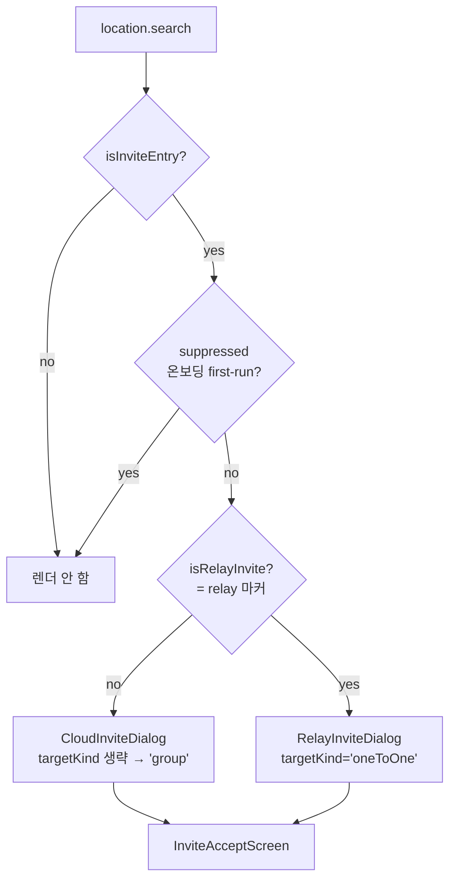
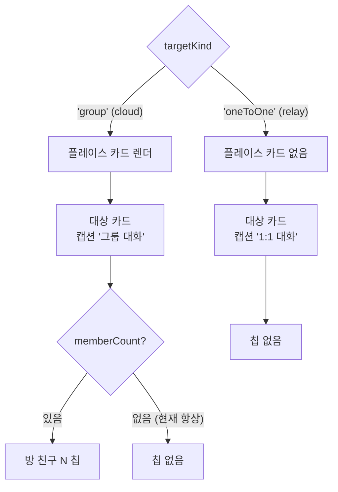
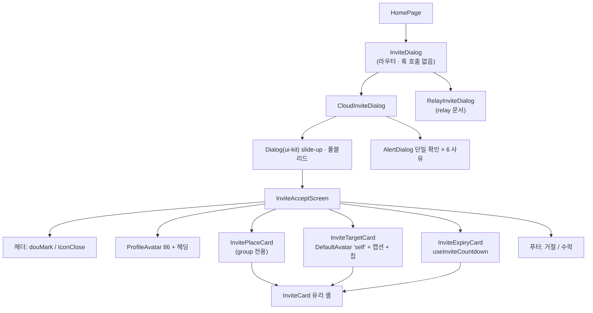
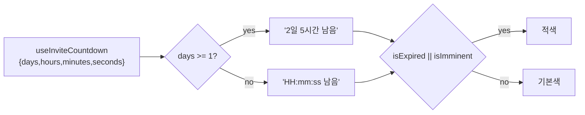

# 초대 수락 (Invite Accept)

> 상태: Live · 최종 갱신: 2026-07-30 · 관련 ADR: [0037](../../../../../docs/adr/0037-invite-accept-popup-group-and-dm-variants.md), [0016](../../../../../docs/adr/0016-invite-accept-popup-web-ui-kit.md)
>
> relay 1:1 오케스트레이션은 별도 문서: [relay-invite-accept](../invite/relay-invite-accept.md)

## 목적

초대 딥링크로 진입한 사용자에게 **초대 수락 화면**을 띄워, 어떤 플레이스·누구의 초대이고 어떤
대화에 들어가는지 보여주고 수락/거절하게 한다.

이 문서가 소유하는 것은 셋이다:

1. **진입 라우터** — 딥링크를 읽어 cloud / relay 분기를 고르고 온보딩 중에는 억제한다.
2. **cloud 초대 오케스트레이션** — REST 초대 파이프라인(login→cloud→site→channel)과 실패
   다이얼로그.
3. **공유 프레젠테이션 계층** — 수락 화면과 그 카드들, 카운트다운 훅. **cloud(그룹 대화)와
   relay(1:1 대화) 양쪽이 같은 화면을 쓰고, 방 종류에 따라 구성이 갈린다.**

relay 초대의 스텝 오케스트레이션(인증→프로필→수락→채널 해소)은 계약이 전혀 달라
[relay-invite-accept](../invite/relay-invite-accept.md)가 담당한다.

## 설계 원칙

- **web-ui-kit 우선.** 색상 hex·수제 오버레이를 컴포넌트에 직접 박지 않는다. 없는 프리미티브만
  라이브러리에 추가한다. 아이콘은 `resources/icons`의 `Icon*` 별칭만 쓰고 `lucide-react`를 직접
  import하지 않는다.
- **디자인 원본 글리프를 쓴다.** lucide 근사로 때우지 않는다. Figma에 전용 글리프가 있으면
  `currentColor` React 컴포넌트로 추출해 kit에 올린다 — 고정색 SVG 에셋으로 넣으면 다크 모드에서
  죽는다.
- **프레젠테이션만 교체, 파이프라인 보존.** `useInviteAccept`의 입장 순서, `useInviteInfo` 조회,
  `parseInviteDeeplink`/`isInviteEntry` 감지는 건드리지 않는다. **기존 `InviteDialog.test.tsx`가
  무수정 통과하는 것이 회귀 없음의 판정 기준이다.**
- **표시 판단은 URL + 우선순위 한 곳(home).** 우선순위: **온보딩 > 초대 > 플레이스 프로필 생성.**
- **방 종류 차이는 캡션이 아니라 구성으로 낸다.** 그룹/1:1은 문구 한 줄만 다른 게 아니라 **어떤
  카드가 뜨는지**가 다르다(ADR-0037). 판정은 `targetKind` 하나에서만 갈라지고, 각 카드가 그것을
  다시 해석하지 않는다.
- **데이터가 없으면 우아하게 접는다.** 백엔드가 아직 안 내려주는 필드는 숨기거나 폴백한다.
  UI는 디자인대로 만들어 두고 값이 오는 날 한 줄도 안 바꾸고 뜨게 한다(ADR-0033 D1 인터페이스
  선반영).
- **유효시간은 서버 값만 렌더한다.** `expiredAt` epoch(ms)만 쓰고 기간을 하드코딩하지 않는다.
  기간은 백엔드 3일이고 클라이언트는 그것을 모른다(ADR-0033 D8).

## 범위

**포함**

- `InviteDialog` 진입 라우터(cloud/relay 분기, 온보딩 억제).
- `CloudInviteDialog` — cloud 초대 오케스트레이션 + 실패 다이얼로그 6종.
- 공유 수락 화면: 브랜드 헤더, 초대자 헤딩, 플레이스/대상/유효시간 카드, 거절·수락 푸터.
- **그룹 / 1:1 변형**(ADR-0037): 플레이스 카드 유무, 대상 카드의 캡션과 방 친구 칩.
- 유효시간 카운트다운 훅 + 카드(24시간 미만 `HH:mm:ss`, 그 이상 `n일 n시간`).
- web-ui-kit 아이콘 3종 추가(duotone 시계 · 방 친구 · 사진 placeholder).

**제외**

- relay 스텝 오케스트레이션·채널 해소 — [relay-invite-accept](../invite/relay-invite-accept.md).
- 초대 발신(발급·대기 화면·재초대) — [relay-invite-sender](../invite/relay-invite-sender.md).
- `useInviteAccept` / `useInviteInfo` / 딥링크 파싱 **로직** 변경.
- **백엔드 확장 요청 신규 제기** — 플레이스 소개·썸네일·멤버수·채널 `stereo` 비정규화. 프론트는
  계약대로 소비 + degrade만 한다(ADR-0037 결정 2).
- 이미참여/삭제/취소를 구분하는 백엔드 에러코드 배선 — 만료만 확정, 나머지 `generic` 폴백.
- 배경 도형 SVG 에셋 추출 — CSS 그라디언트로 근사한다(ADR-0037 결정 6).
- `GlassCard` kit 승격, `Badge`의 glass tone — 재사용처가 없어 앱 로컬에 남긴다.

## 시나리오

### 1. 그룹 초대 진입 (cloud)

플레이스 초대 딥링크(`?provider=invite&code=…&_backend=…`)로 홈 진입 → 라우터가 relay 마커가
없음을 보고 cloud 분기 → `useInviteInfo`가 초대자·플레이스 메타를 채운다.

화면 구성: 초대자 아바타 + "**Sunny**님이 DoU에 당신을 초대했어요" → **플레이스 카드**(이름 +
소개) → **대상 카드**(1인 solid 아바타 + "You" + "그룹 대화" + 방 친구 칩) → 유효시간 카드 →
거절/수락.

**방 친구 칩은 실제로 뜨지 않는다.** `useInviteInfo`가 주는 Head 타입에 멤버수가 없기 때문이다
([CloudInviteDialog.tsx:91-93](../../../src/app/features/home/components/invite/CloudInviteDialog.tsx)).
칩 UI는 준비돼 있고 값이 오는 순간 뜬다.

### 2. 1:1 초대 진입 (relay)

relay 마커가 있으면 relay 분기. 화면은 같은 `InviteAcceptScreen`이지만 **플레이스 카드가 아예
없다** — 1:1 대화에 플레이스는 의미가 없다(ADR-0037 결정 1). 대상 카드 캡션은 "1:1 대화"이고
방 친구 칩도 없다.

이후 스텝(인증→프로필→수락→방 입장)은 [relay-invite-accept](../invite/relay-invite-accept.md).

### 3. 유효시간 카운트다운

`expiredAt`이 있으면 유효시간 카드가 뜬다. 초대 링크는 서버에서 3일이므로 두 표기를 오간다:

- **24시간 이상 남음** → `2일 5시간 남음`. 갓 받은 링크가 여기 걸린다.
- **24시간 미만** → `HH:mm:ss 남음` (매초 갱신). 마지막 하루에 들어오면 디자인 그대로 초 단위로
  줄어든다.
- **10분 이하 또는 이미 만료** → 남은 시간이 적색(`text-destructive`).
- **0에 도달** → relay는 만료 다이얼로그로 전이한다(relay 문서 시나리오 4). cloud는 그런 전이가
  없어 화면에 머무르며 `00:00:00 남음`을 적색으로 보여주고, 수락을 누르면 `inviteAccept.expired`로
  걸린다.

### 4. 수락 (cloud)

`수락` → `useInviteAccept.accept()`가 login→cloud→site→channel 입장 파이프라인 실행. 성공하면 URL
query가 정리되며 팝업이 닫히고, 초대받은 플레이스에 내 프로필이 없으면 **플레이스 프로필 생성
오버레이가 후행**한다([place-profile.md](./place-profile.md)).

수락 진행 중에는 X·esc·오버레이 dismiss가 no-op이다 — 중간에 URL이 정리되면 뒤따르는 실패
다이얼로그가 유실된다.

### 5. 거절 (cloud)

`거절` → 홈으로 이동하며 query 제거. **서버 호출 없음.** cloud에는 거절 API가 없어 거절과 닫기가
실제로 같은 동작이고, 그래서 `onDecline` 기본값이 `onClose`다.

### 6. 실패 상태

- **만료** → 만료 `AlertDialog`("초대 링크가 만료되었어요"). `확인` → 홈.
- **이미 참여 / 채팅방 삭제 / 초대 취소** → 백엔드 에러코드가 확정되지 않아 현재는 전부
  `generic` 폴백. 사유별 문구와 다이얼로그는 준비돼 있다.
- **기기 인증 누락**(`missingDelegator`) → 로그아웃 유도 다이얼로그. `확인` → 로그아웃(URL 보존).

### 7. 온보딩 중 진입

first-run 온보딩이 떠 있으면 초대 팝업은 억제된다. 온보딩 완료 후 URL에 초대 query가 남아 있으면
그때 표시(그 사이 만료됐으면 만료 다이얼로그). 라우터 단에서 처리되므로 cloud/relay 공통이다.

## 다이어그램

### 진입 분기



### 그룹 / 1:1 변형 (ADR-0037)

`targetKind` 하나가 세 곳을 갈라놓는다. 각 카드가 방 종류를 다시 판정하지 않는다.



### 컴포넌트 트리



### 카운트다운 표기 결정



## 상세 구현

### 진입 라우터

[`components/InviteDialog.tsx`](../../../src/app/features/home/components/InviteDialog.tsx) —
`useLocation` + `parseInviteDeeplink` + 세 조건만 남은 순수 라우터다. **데이터 훅을 하나도 부르지
않는다**: 부르면 relay 딥링크에서도 cloud `useInviteInfo`가 발사돼 존재하지 않는 cloud 초대를
조회한다. `HomePage.tsx:347`의 `<InviteDialog suppressed={isFirstRun} />`가 유일한 마운트 지점이다.

### cloud 오케스트레이션

[`invite/CloudInviteDialog.tsx`](../../../src/app/features/home/components/invite/CloudInviteDialog.tsx)
— 오버레이·라우팅·데이터·에러 다이얼로그를 소유한다.

- 골격: `Dialog`(`@chatic/ui-kit`) + `DialogContent variant="slide-up" hideClose`. 풀블리드라
  `style={{ padding: 0 }}`로 variant의 safe-area 패딩을 죽인다 — 커스텀 `pt-safe-*` 유틸리티는
  tailwind-merge가 인식하지 못해 className `p-0`로는 이길 수 없다. safe inset은 화면이 내부에서
  직접 적용한다.
- `resolveDialogVariant(errorKey)`가 `useInviteAccept`의 `errorKey`를 다이얼로그 사유로 매핑한다.
  현재 `inviteAccept.expired`만 확정 매핑이고 나머지는 `generic`이다.
  `missingDelegator`는 별도 분기(로그아웃 액션).
- 실패 다이얼로그 **제목은 `text-destructive`**(ReactNode span), 확인 버튼은 기본색.
- `requestClose`가 `isAccepting` 중 dismiss를 no-op으로 막는다.

| variant          | 트리거(현재 가능)                                  | i18n                                     |
| ---------------- | -------------------------------------------------- | ---------------------------------------- |
| `expired`        | `inviteAccept.expired`                             | `inviteAccept.dialog.expired.*`          |
| `alreadyJoined`  | (백엔드 코드 확인 후 배선)                         | `inviteAccept.dialog.alreadyJoined.*`    |
| `channelDeleted` | (백엔드 코드 확인 후 배선)                         | `inviteAccept.dialog.channelDeleted.*`   |
| `inviteCanceled` | (백엔드 코드 확인 후 배선)                         | `inviteAccept.dialog.inviteCanceled.*`   |
| `delegatorId`    | `missingDelegator`                                 | `inviteAccept.dialog.missingDelegator.*` |
| `generic`(폴백)  | 그 외 errorKey(timeout/network/enterFailed/failed) | `inviteAccept.dialog.generic.*`          |

### 공유 수락 화면

[`invite/InviteAcceptScreen.tsx`](../../../src/app/features/home/components/invite/InviteAcceptScreen.tsx)
— 순수 프레젠테이션(데이터·라우팅 없음). props 계약:

| prop                                      | relay            | cloud(기본값)                         |
| ----------------------------------------- | ---------------- | ------------------------------------- |
| `targetKind`                              | `'oneToOne'`     | 생략 → `'group'`                      |
| `countdown`                               | `flow.countdown` | `useInviteCountdown(info?.expiredAt)` |
| `onDecline`                               | `flow.decline`   | `onClose`                             |
| `showDecline`                             | 플래그           | `true`                                |
| `overlay`                                 | 채널 대기 스피너 | 없음                                  |
| `placeName`/`placeIntro`/`placeThumbnail` | 안 넘김          | `info.site$.name`                     |

`expiredAt`은 prop이 아니다. 유효시간 카드는 `countdown`만 필요하고 `useInviteCountdown`은
`expiredAt`이 없으면 `null`을 주므로, 만료 시각을 화면까지 실어 보내는 것은 중복이었다.

- **배경(테마 적응 글래스모피즘)**: 3겹 `radial-gradient`로 브랜드 그린(`#b0ea10`) 블룸을 깔고, 그
  위에 전면 프로스트 레이어(`backdrop-blur-[56px]`)를 덮는다. 카드·헤더·푸터는 그 위에 떠서 자기
  `backdrop-blur`로 뒤의 그린을 유리로 만든다. 공용 `Dialog` 오버레이가 `bg-black/80`이라 "뒤 홈을
  blur"는 불가능해 자체 완결 배경으로 구현했다. **Figma의 384×733 도형 에셋은 추출하지 않는다** —
  화면 폭 대응·다크 모드에 CSS가 유리하고 바이트가 0이다(ADR-0037 결정 6).
- 헤더: **커스텀 행**(`douMark` 좌 + `IconClose` 우). `ModalTopBar` 좌측 슬롯이 44px 고정이라 폭
  102px 마크가 안 들어가서 safe-area 패딩만 인라인 재현했다.
- 헤딩: 이름 `<span>` 24px bold + `inviteAccept.invitedBy` 접미사(20px semibold), 이름이 **비어
  있을 때만** `inviteAccept.title` 폴백. 색은 `text-brand-ink`(`#102346`, Figma `blue_bk`)이고
  다크 모드에서는 대비가 죽으므로 `dark:text-foreground`로 되돌린다.
- 본문 서브텍스트와 카드 보조 줄은 `text-label`(`#53555B`) — `text-description`(`#84888F`)이
  아니다.
- 플레이스 카드 게이트는 `showPlaceCard = targetKind !== 'oneToOne' && (placeName || placeThumbnail)`
  이다. **1:1이면 메타가 있어도 절대 안 뜨고**(ADR-0037 결정 1), 그룹이면 보여 줄 것이 있을 때만
  뜬다 — 아이콘만 있는 빈 껍데기는 카드가 없는 것보다 나쁘다("데이터가 없으면 우아하게 접는다").
- 푸터: 프로스티드 패널(`bg-white/55 dark:bg-white/5 backdrop-blur-[16px]`, 상단 라운드 16 +
  그림자) 안에 `Button` 거절(`variant="outline"`) / 수락(solid). `size="lg"`가 `h-[50px]`로
  디자인과 일치한다([Button.tsx:23](../../../../../libs/web-ui-kit/src/foundations/button/Button.tsx)).
  Figma의 불투명 `#dbdbda`는 blur 렌더를 flatten한 값으로 보고 프로스티드를 유지한다.

### 카드들

- [`invite/InviteCard.tsx`](../../../src/app/features/home/components/invite/InviteCard.tsx) —
  유리 셸: `rounded-[24px]` + `bg-white/45 dark:bg-white/10` + `backdrop-blur-[12px]` + 흰
  hairline border. 콘텐츠 색은 테마 토큰이라 두 모드 모두 legible. **kit으로 승격하지 않는다** —
  소비처가 이 화면뿐이다.
- [`invite/InvitePlaceCard.tsx`](../../../src/app/features/home/components/invite/InvitePlaceCard.tsx)
  — 썸네일 있으면 ``, 없으면 `IconImageSolid size={40}`. 이 글리프가 원판까지 포함하므로
  종전의 `<span className="bg-brand-ink">` 래퍼는 사라진다. **사진 모티프가 컷아웃이라 글리프 색은
  뒤에 있는 카드와 대비돼야 한다** — `text-brand-ink`는 라이트 유리 카드 위에서 14:1이지만 다크
  카드(`white/10`) 위에서는 1.2:1로 사실상 안 보인다. 그래서 `dark:text-white/80`으로 반전해 밝은
  원판 + 어두운 모티프(8.7:1)로 만든다.
- [`invite/InviteTargetCard.tsx`](../../../src/app/features/home/components/invite/InviteTargetCard.tsx)
  — `DefaultAvatar size={40} variant="self"` + `You` + 캡션 + 방 친구 칩.
  `variant="self"`가 Figma `1명 Profile` 글리프(`IconUserSolid`)를 그린다 — 기본값 `'user'`는
  lucide 외곽선이라 디자인과 다르다. **그룹도 같은 1인 글리프를 쓴다**(ADR-0037 결정 5, 디자인
  확인 대기). 칩은 `Badge` + className으로 유리 스타일(`bg-white/20`, shadow, `px-3.5 py-2`,
  13px)을 입히고 아이콘은 `IconUsersGroup size={18}`이다. 다크에서도 `white/20`을 유지한다 —
  카드가 이미 `white/10`이라 같은 값을 쓰면 칩 경계가 사라진다.
- [`invite/InviteExpiryCard.tsx`](../../../src/app/features/home/components/invite/InviteExpiryCard.tsx)
  — `IconClockSolid size={20} className="text-description"`(디자인의 `#84888F`) +
  `inviteAccept.expiry.label` + 남은 시간 한 줄. **절대 만료시각 줄은 없다.** 24시간 이상이면
  `n일 n시간`(시간이 0이면 `n일`), 미만이면 제로 패딩한 `HH:mm:ss`를 만들어 둘 다 같은
  `inviteAccept.expiry.remaining`(`{{time}} 남음`)에 넣는다. 적색(`text-destructive`) 판정은
  `isExpired || isImminent`다 — `isImminent`는 만료 순간 거짓으로 돌아가므로 그것만 보면 죽은 링크가
  `00:00:00 남음`을 평온한 색으로 보여준다. `InviteWaitingPage`의 `spent`와 같은 짝짓기다.

### 카운트다운 훅

[`hooks/useInviteCountdown.ts`](../../../src/app/features/home/hooks/useInviteCountdown.ts)

```ts
export interface InviteCountdown {
    days: number; hours: number; minutes: number;
    seconds: number;        // 신규 — HH:mm:ss 표기용
    isExpired: boolean;
    isImminent: boolean;    // 10분 이하
}
useInviteCountdown(expiredAt?: number): InviteCountdown | null
```

`TICK_MS`가 `30_000` → `1_000`이 된다. 초 단위 표기가 매초 갱신돼야 하기 때문이다. **이 훅은
[`InviteWaitingPage`](../../../src/app/features/invite/pages/InviteWaitingPage.tsx)와 공유하므로
그 화면도 매초 리렌더된다** — 대기 화면은 분 단위만 보여줘서 시각 변화는 없다.

### web-ui-kit — 아이콘 3종

`libs/web-ui-kit/src/resources/icons/`에 기존 커스텀 글리프 규약(`IconGroup`·`IconUserSolid`)대로
`currentColor` React 컴포넌트로 두고 배럴에 노출한다.

| 이름             | Figma 노드                                                  | viewBox     | 비고                                             |
| ---------------- | ----------------------------------------------------------- | ----------- | ------------------------------------------------ |
| `IconClockSolid` | Bold Duotone / Time / Clock Circle `3073:10991`             | `0 0 20 20` | 2 path. 외곽 원 `opacity 0.5` + 시침·분침        |
| `IconUsersGroup` | Bold Duotone / Users / Users Group Two Rounded `3158:26141` | `0 0 18 18` | 6 path. 중앙 1인 불투명 + 좌우 2인 `opacity 0.4` |
| `IconImageSolid` | 플레이스 사진 placeholder `3073:10971`                      | `0 0 40 40` | 2 path. 네이비 원판 + `evenodd` 사진 컷아웃      |

세 개 모두 `size` prop으로 정사각 렌더하고 `fill="currentColor"`, `aria-hidden`이다. Figma가
`#84888F`/`#102346`을 박아 주는 것을 `currentColor`로 바꿔 넣는다.

`IconUsersGroup`은 Figma가 6개 조각을 inset 퍼센트로 배치한 것을 하나의 18×18 viewBox 안에서
`<g transform="translate(...)">`로 재배치한 것이다(중앙 머리 `6.375, 3` 크기 5.25 / 좌우 머리
`3.375·10.875, 3.75` 크기 3.75 / 중앙 몸통 `4.5, 9.75` 크기 9×5.25 / 좌우 몸통 `1.5·10.5, 10.5`
크기 6×3.75). 좌우 조각은 좌우 대칭 도형이라 Figma의 `-scale-x-100` 미러링은 좌표 이동만으로
재현된다. 중앙 인물을 마지막에 그려 좌우 인물 위에 올린다.

**kit에 이미 있는 것과의 관계** — `IconImageSolid`의 글리프는
[`resources/assets/default-place-avatar.svg`](../../../../../libs/web-ui-kit/src/resources/assets/default-place-avatar.svg)
(86px)와 **같은 도형이다**(좌표가 정확히 0.4651배). 그 에셋은 `#102346`이 박힌 URL 임포트라
다크 모드 대응도 `currentColor`도 안 되고 소비처가 `CreatePlaceDialog`의 업로드 기본 이미지
하나뿐이므로, 그것은 그대로 두고 컴포넌트를 새로 만든다. 마찬가지로 카드2 글리프는 기존
`IconUserSolid`와 같은 도형(0.952배)이라 **새 에셋이 필요 없다**.

### i18n

`public/locales/{ko,en}/translation.json`:

- `inviteAccept.expiry.label` — ko "초대 링크 유효**기간**" → "초대 링크 유효**시간**"(디자인 카피),
  en "Invite link expires in" → "Invite link valid for". 둘 다 `inviteWaiting.validityLabel`과
  같은 문구가 됐다 — 같은 초대의 유효시간을 두 화면이 다르게 부르고 있었다.
- `inviteAccept.expiry.remaining` / `days` / `hours` — 기존 키 그대로 재사용.
- `inviteAccept.expiry.minutes` — `HH:mm:ss`가 대신하므로 수락 화면에서는 안 쓰이지만
  `InviteWaitingPage`가 계속 쓴다. **삭제하지 않는다.**
- 신규 키 없음.

## 검증 방법

- **유닛 테스트** — `apps/web` 129 suites / 894 tests, web-ui-kit 57 suites / 230 tests 전부 통과.
    - [`icons/DuotoneIcons.test.tsx`](../../../../../libs/web-ui-kit/src/resources/icons/DuotoneIcons.test.tsx)(15)
      — 세 아이콘을 `describe.each`로 묶어 viewBox·`size`·`currentColor`·`aria-hidden`을 확인하고,
      이중 톤 레이어링을 따로 검증한다(시계는 `opacity 0.5` 다이얼 + 불투명 침, 칩은 6 path 중
      정확히 4개가 `0.4`, 사진은 `evenodd`가 살아 있는지). `evenodd`가 빠지면 컷아웃이 메워져 그냥
      원판이 되므로 이 단정이 회귀를 잡는다.
    - `features/home/hooks/useInviteCountdown.test.ts`(5) — `seconds` 분해, 1초 tick 전진.
    - `features/home/components/invite/InviteExpiryCard.test.tsx`(6) — `HH:mm:ss`, 제로 패딩,
      24시간 이상 `n일 n시간`, 시간 0이면 `n일`, 임박 적색 / 평시 `text-label`.
    - `features/home/components/invite/InviteAcceptScreen.test.tsx`(10) — 그룹/1:1 변형(플레이스
      카드 유무·캡션), `targetKind` 생략 시 그룹 취급, **1:1은 플레이스 메타가 있어도 카드 없음**,
      그룹이지만 보여 줄 것 없으면 접힘, 칩은 `memberCount` 도착 시에만, 거절 라우팅과 게이팅.
    - **회귀**: `InviteDialog.test.tsx` 무수정 통과. `RelayInviteDialog.test.tsx`의 "플레이스 카드를
      그리지 않는다"는 이제 이중으로 보장된다(다이얼로그가 `site$`를 전달하지 않음 **＋** 화면이
      `targetKind`로 차단) — 목이 일부러 site를 실어 두므로 두 가드 중 하나가 빠지면 실패한다.
- **정적 검사**: web-ui-kit `tsc --build tsconfig.lib.json` 0 errors. 변경 파일 eslint 0 errors.
  `apps/web` 타입체크는 이 워크트리에서 `routes/ShareLinkRedirect.tsx`(다른 작업분, untracked) 때문에
  2건 실패하지만 **이 기능의 파일에서는 0건**이다.
- **시각 확인(수행함)**: 세 아이콘을 브라우저에 렌더해 Figma 스크린샷(`3073:10971` · `3158:26141` ·
  `3158:26141` 칩)과 대조했고, dev 서버(`?provider=invite&code=…`)에서 라이트·다크 모두 확인했다 —
  헤딩 `#102346`, 보조 텍스트 `#53555B`, 유리 카드, 1인 solid 아바타, 버튼 `h-[50px]`.
- **미확인(유닛 테스트로만 커버)**: 데이터가 있는 플레이스 카드, 방 친구 칩, 유효시간 카드 두 표기,
  1:1 캡션. 유효한 초대 딥링크 + 로그인 세션이 필요해 로컬에서 띄울 수 없다. 배포 QA에서 Figma
  `3072-10943`(1:1)·`3076-11341`(그룹)과 대조한다.

## 남은 것

- **방 친구 칩은 아직 실화면에 뜬 적이 없다.** `memberCount`가 어디서도 오지 않는다. 백엔드가 값을
  채우는 날 처음 렌더되므로 그때 패딩·줄바꿈을 확인해야 한다.
- **유효시간 24시간 이상 구간의 문구는 우리가 정한 것이다.** 디자인은 `HH:mm:ss`만 그렸다.
  ADR-0033 D8의 카피 수정 요청이 아직 열려 있고, 디자이너 확인이 필요하다.
- **그룹 대상 카드의 아바타가 1인 글리프다.** 디자인 파일을 따랐다(ADR-0037 결정 5). 디자인이
  수정되면 `variant="group"`으로 한 단어 변경이다.
- **거절 버튼 배경이 투명하다.** 디자인은 `bg-white` + `#dfe0e2` 테두리다. 공용 kit
  `Button variant="outline"`이라 바꾸면 앱 전체 outline 버튼에 파급되므로 손대지 않았다. 푸터를
  프로스티드로 유지한 판단과도 일관된다.
- **다크 모드 헤딩이 라이트와 다른 색이다**(`brand-ink` → `foreground`). 네이비가 어두운 표면에서
  대비를 잃어 되돌린 것이지만 디자인 의도와 어긋날 수 있다.
- [`libs/web-ui-kit/README.md`](../../../../../libs/web-ui-kit/README.md)의 아이콘 목록에 세 개가
  아직 빠져 있다.
