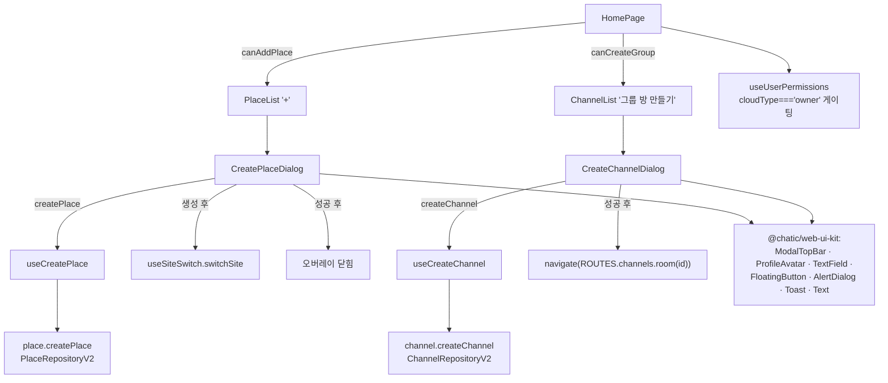
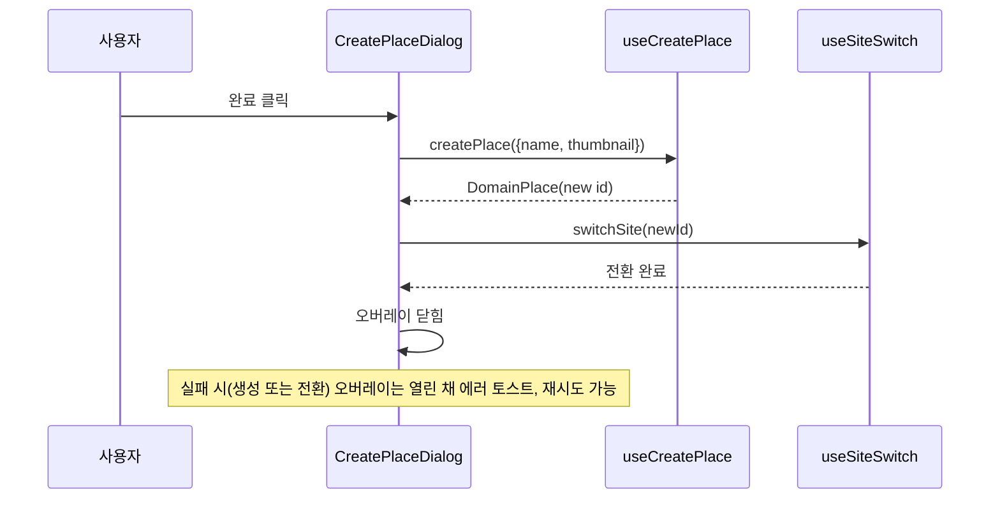

# 플레이스 생성 · 그룹방 생성 (Place / Channel Create)

> 상태: Live · 최종 갱신: 2026-07-20 · 관련 ADR: [0018](../../../../../docs/adr/0018-place-channel-create-web-ui-kit-rebuild.md)

## 목적

owner가 새 **플레이스(=Site)** 와 **그룹방(=Channel)** 을 개설하는 두 풀스크린 생성 화면. 홈(`/`)에서
진입점(Place `+` / Chat `그룹 방 만들기`)을 눌러 슬라이드업 오버레이로 띄우고, 이름(+선택 이미지)을 받아
클라우드 서버에 생성한 뒤 **생성된 대상으로 바로 이동**시킨다 — 플레이스는 사이트전환, 그룹방은 채널이동.

기존 두 다이얼로그([CreatePlaceDialog](../../../src/app/features/home/components/CreatePlaceDialog.tsx),
[CreateChannelDialog](../../../src/app/features/home/components/CreateChannelDialog.tsx))는 레거시
`@chatic/ui-kit`(shadcn)으로 만들어졌고 생성 후 이동이 없다. 이번 작업은 개정 Figma에 맞춰 두 화면을
`@chatic/web-ui-kit`으로 **재구축**하고, 이동·owner 게이팅·이미지·개수 한도를 배선한다.

프로필 설정 오버레이([place-profile-create.md](./place-profile-create.md))와는 다르다 — 저쪽은 "플레이스 안에서
내 프로필 만들기", 이쪽은 "플레이스/그룹방 자체를 개설". 다만 UI 레이아웃이 동일해 그 다이얼로그를 시각·구조
레퍼런스로 삼는다.

## 설계 원칙

- **생성은 owner + 클라우드 서버에서만.** 플레이스·그룹방 개설 진입점은 **내가 소유한 클라우드**
  (`cloudType === 'owner'`)에서만 노출한다. 렐리(default)·초대(invited) 클라우드에선 숨긴다. 서버가 최종 권한
  주체이므로 클라이언트 게이팅은 UX(진입점 노출/사전 검증)다.
- **UI는 `@chatic/web-ui-kit`으로 조립한다.** 색 hex·아이콘을 화면에 직접 박지 않는다. 부족한 조각(그룹 아바타
  글리프 등)은 화면에서 임기응변하지 말고 라이브러리에 추가한 뒤 쓴다(web-ui-kit 우선 원칙, ADR-0013).
- **두 화면은 한 패턴을 공유한다.** 타이틀/부제 + 원형 아바타(이미지 선택) + 이름 `TextField`(0/20) + `완료`.
  차이는 문구·기본 글리프·생성 API·완료 후 이동뿐이므로, 공통 골격을 맞추고 차이만 분기한다.
- **생성 성공 = 즉시 그 대상으로 이동.** 생성만 하고 홈에 머무르지 않는다. 플레이스=반환 site id로 `switchSite`,
  그룹방=반환 channel id로 채널 라우트 이동. 이동이 완료 동작의 일부다.
- **한도는 진입점 상시 노출 + 시도 시 토스트.** 개수 상한(플레이스 5 / 그룹방 100)에 도달해도 `+`는 남기고,
  누르면 안내 토스트로 막는다(기존 거부-토스트 관용구와 일관).
- **한도 상수는 단일 소스.** 죽은·상충하는 상수를 없애고 한 곳에서만 정의한다.

## 범위

**포함**

- [CreatePlaceDialog](../../../src/app/features/home/components/CreatePlaceDialog.tsx) 재구축 — web-ui-kit
  풀스크린 오버레이(이름 1~20 필수 + 이미지 선택 + 이탈 확인 + 성공/에러 토스트).
- [CreateChannelDialog](../../../src/app/features/home/components/CreateChannelDialog.tsx) 재구축 — 동일 골격,
  그룹 기본 글리프·문구, `stereo: 'private'` 유지.
- 생성 후 이동: 플레이스 → `switchSite(newSiteId)`, 그룹방 → `navigate(ROUTES.channels.room(newChannelId))`.
- 이미지 배선: [useCreatePlace](../../../src/app/features/home/hooks/useCreatePlace.ts)에 `thumbnail` 추가
  (`PlaceCreateInput`은 이미 지원), 그룹방은 `channel.create`가 `thumbnail`을 받는다는 ADR-0018 전제하에
  `{ stereo, name, thumbnail }` 단일 스텝.
- owner 게이팅: [useUserPermissions](../../../src/app/hooks/useUserPermissions.ts)에 클라우드 소유
  (`cloudType === 'owner'`) 개념을 반영해 `canCreatePlace`·`canCreateChannel`을 좁힌다.
- 개수 한도: 플레이스 5 / 그룹방(플레이스당) 100. 상수 단일화 및 [consts.ts](../../../src/app/utils/consts.ts)
  의 죽은·상충 값 정리.
- 그룹 아바타 글리프: `ProfileAvatar`에 placeholder 글리프 선택 옵션 추가(1인 `IconUser` / 그룹 `IconUsers`).
- i18n: `createPlace.*`·`createChannel.*` 키 보강(부제·사진 라벨·힌트·이탈 확인·한도 토스트).

**제외**

- 프로필 설정 오버레이(`place-profile-create.md`) 로직 — 시각 참고만, 건드리지 않음.
- 그룹방 PRO 게이트 정책 자체 — 현행 `planTier === 'pro'` 유지, owner 게이트를 그 위에 얹기만.
- 미사용 프로토타입 [CreateChannelPage](../../../src/app/features/channels/pages/CreateChannelPage.tsx) +
  `/channels/create` 라우트 — 정리(삭제) 후보로 다루되 신규 라우트는 만들지 않음.
- 1:1 대화 생성, 검색 등 미구현 기능.
- 서버측 owner/한도 강제(백엔드 소관).

## 시나리오

### 플레이스 생성

1. **진입** — owner 클라우드에서 홈 Place 섹션 하단 `+`(add place) 행을 누른다. owner가 아니거나 렐리/초대
   클라우드면 애초에 `+`가 없다. 이미 5개면 `+`는 있으나 누르면 "플레이스는 최대 5개까지 만들 수 있어요" 토스트.
2. **입력** — 타이틀 "플레이스를 만들어서 대화를 시작해 보세요" + 부제. 이름 1~20자일 때만 `완료` 활성. 20자
   초과 시 빨간 테두리 + "21/20" + 힌트, `완료` 비활성.
3. **사진(선택)** — 아바타 `+` → 파일 선택. 10MB 이하 webp/png/jpeg, 통과 시 150px 정사각 base64 미리보기.
4. **완료** — `createPlace({ name, thumbnail })` → 반환된 site id로 `switchSite` → 성공 시 오버레이가
   닫힌다(그룹방 생성과 동일 골격). 실패하면 오버레이는 열린 채로 "플레이스를 만들지 못했어요" 에러 토스트만
   뜨고 재시도할 수 있다. 프로필 생성은 강제하지 않는다 — ADR-0045 결정 4가 한 번 넣었다가 되돌렸다: 새
   사이트의 owner 프로필 row는 `place.create`가 만들어주지 않고, `profile.set`(`updateSiteProfile`)은
   UPDATE 전용이라 그 자리에서 쓰려고 하면 항상 404가 난다(재시도로도 해소 불가 — 백엔드 한계). owner도
   다른 진입자와 동일하게 방 설정 nudge([place-profile-create.md](./place-profile-create.md), ADR-0040)로
   프로필을 나중에 채운다.
5. **이탈** — X/esc/overlay 시 입력값이 있으면 "중단하시겠어요?" 확인 모달, 없으면 즉시 닫힘.

### 그룹방 생성

1. **진입** — owner 클라우드에서 선택된 플레이스의 Chat 섹션 `+` → `그룹 방 만들기`. PRO 아니면 구독 유도
   다이얼로그. 이미 100개면 토스트로 막는다. 중계의 같은 이름 항목은 **미구독자 업셀 전용**이라 개수와
   무관하게 항상 구독 유도 다이얼로그로 간다(구독자에겐 항목 자체가 없다).
2. **입력** — 타이틀 "그룹방을 만들고 대화를 시작해 보세요" + 부제. 이름 규칙은 플레이스와 동일. placeholder는
   "예: 여름 여행, 가족 모임, 프로젝트 A".
3. **사진(선택)** — 동일. 기본 글리프는 그룹(`IconUsers`).
4. **완료** — `createChannel({ stereo: 'private', name, thumbnail })` → 반환된 channel id로
   `navigate(ROUTES.channels.room(id))` → 방으로 이동. 오버레이는 닫힘.
5. **이탈** — 플레이스와 동일.

## 다이어그램

### 컴포넌트 · 데이터 흐름

### 생성 → 이동 시퀀스 (플레이스)

## 상세 구현

### 1) 진입점 게이팅 — owner + 한도 (HomePage)

owner 게이팅은 클라우드 컨텍스트(렐리 1:1 vs 클라우드 그룹)를 아는 [HomePage](../../../src/app/features/home/pages/HomePage.tsx)에서
파생한다. `useUserPermissions`는 클라우드 catalog를 갖지 않고 릴레이 1:1 예외를 알 수 없어, 소유 판정을 훅에
넣지 않고 HomePage에 둔다.

- **owner 신호**: `isCloudOwner = !isDefaultCloud && !isInvitedCloud`. `cloudType`은 `'invited' | 'owner'`뿐이라
  (렐리는 `default` id로 별도), 비-렐리·비-초대 클라우드는 곧 내가 소유한 클라우드다. `useCloudSessionCatalog`의
  `CloudView`엔 `cloudType`이 없으므로 DomainCloud 분류를 쓰는 기존 `isInvitedCloud`로 안전하게 파생한다.
- `canAddPlace = isCloudOwner && permissions.canCreatePlace`(= owner && 비게스트 && 활성 클라우드). PlaceList의
  `+`는 이 값으로만 노출된다.
- 채널 `+` 메뉴: `canCreate = !isChannelsLoading && (isDefaultCloud || isCloudOwner)`. 렐리에선 모두에게 `1:1
대화`(placeholder)를, 클라우드에선 owner에게만 `그룹 방 만들기`를 보인다. 렐리의 미구독자에게는 `그룹 방
만들기`가 업셀 행으로 한 줄 더 붙는다(`showGroupCreate = !isDefaultCloud || !isPro`).
- 한도 체크는 개수를 아는 HomePage 핸들러에서 한다. `handleCreatePlace`는 `ownedPlaceCount >= MAX_PLACES`
  (relay 구독행 `stereo === 'place'` 제외 카운트)면 `homePage.placeLimitReached` 토스트 후 return.
  `handleCreateGroup`은 렐리면 상한 체크 없이 곧바로 구독 유도로 빠지고(업셀 전용 입구라 렐리 플레이스의
  채널 수가 상한 토스트로 바뀌면 안 된다), 클라우드에선 `channels.length >= MAX_CHANNELS_PER_PLACE`면
  `homePage.channelLimitReached` 토스트 후 return(그다음 PRO 게이트). 단, dev-class 빌드(`VITE_ENV` DEV/LOCAL, `isDevBuild()`)에서는 두 한도
  체크를 건너뛴다 — 테스터가 자유롭게 시드할 수 있도록. PRO 게이트는 그대로 남는다.

### 2) 한도 상수 단일화

- [consts.ts](../../../src/app/utils/consts.ts)를 **단일 소스**로 교정: `MAX_PLACES=5`,
  `MAX_CHANNELS_PER_PLACE=100`, `GUEST_MAX_CHANNELS=3`(이전 값 5/5/1은 죽은 코드 + 요구사항 상충이라 폐기).
- [useUserPermissions.ts](../../../src/app/hooks/useUserPermissions.ts)의 로컬 리터럴을 지우고 consts에서
  import한다. `maxChannels`는 게스트면 `GUEST_MAX_CHANNELS`, 아니면 `MAX_CHANNELS_PER_PLACE`. `canCreateChannel`
  은 코스한 채로 두고(릴레이/클라우드 분기는 HomePage 소관), 값은 그대로다.

### 3) CreatePlaceDialog 재구축

- [CreateChannelDialog.tsx](../../../src/app/features/home/components/CreateChannelDialog.tsx)와 같은 골격.
  `Dialog`(slide-up 풀스크린) + `ModalTopBar`(onClose) + 스크롤 본문 + `FloatingButton`, a11y용 `sr-only`
  타이틀/설명, 인라인 `Toast`(성공/에러), `AlertDialog`(이탈 확인). 이미지 처리는
  `resizeImageToBase64(file, 150)`(`@chatic/shared`) + 10MB·webp/png/jpeg 규칙 동일.
- 이름: `TextField` `required maxLength={20} enforceMaxLength={false}`, `name.length>20`이면 `error`.
- 완료: 다이얼로그가 직접 서버 작업을 든다 — `createPlace({ name, thumbnail })` → `switchSite(id)` →
  성공 시 `onOpenChange(false)`. 실패하면 오버레이는 열린 채 에러 토스트만 뜨고 재시도 가능
  (`CreateChannelDialog`와 동일한 `submitting` 상태 패턴). 프로필 생성 스텝을 뒤에 강제로 붙였던
  적이 있으나(ADR-0045 결정 4) 되돌렸다 — 백엔드가 신규 사이트의 첫 프로필 write를 지원하지 않아
  (`place.create`가 owner 프로필 row를 만들지 않고 `profile.set`은 UPDATE 전용) 항상 404가 났다.
- [useCreatePlace.ts](../../../src/app/features/home/hooks/useCreatePlace.ts): 시그니처를
  `createPlace({ name, thumbnail }: { name: string; thumbnail?: string })`로 넓혀 payload에 thumbnail 통과.
  `PlaceCreateInput`(`PlaceBodyData`)이 이미 `thumbnail?`을 가지므로 리포/원격은 무변경(payload passthrough,
  [PlaceRepositoryV2.ts:89](../../../../../libs/data/src/data/repositories-v2/PlaceRepositoryV2.ts)).

### 4) CreateChannelDialog 재구축

- 3)과 동일 골격. 문구·placeholder·기본 글리프(그룹)만 분기.
- 완료: `await createChannel({ stereo: 'private', name, thumbnail })` →
  `navigate(ROUTES.channels.room(created.id))`. `useCreateChannel`은 이미 `DomainChannel`을 반환한다
  ([useCreateChannel.ts](../../../src/app/features/channels/hooks/useCreateChannel.ts)).
- **thumbnail 전제(ADR-0018)**: `ChannelCreateRequestData`는 현재 `{ stereo, name }`뿐이다
  ([channel/types.d.ts:3](../../../../../node_modules/@lemoncloud/chatic-sockets-api/dist/lib/channel/types.d.ts)).
  `channel.create` payload는 게이트웨이로 그대로 전달되므로
  ([ChannelRemoteDataSource.ts:90](../../../../../libs/data/src/data/remote/data-sources/ChannelRemoteDataSource.ts)),
  타입에 `thumbnail?`이 추가되면 배선은 자동이다. **착수 시 소켓 API의 thumbnail 지원 여부를 먼저 확인**하고,
  미지원이면 타입 확장/백엔드 협의가 블로커(→ 리스크 섹션).

### 5) 그룹 아바타 글리프 — web-ui-kit

- [ProfileAvatar.tsx:44](../../../../../libs/web-ui-kit/src/foundations/avatar/ProfileAvatar.tsx)의 placeholder는
  `IconUser`(1인) 고정이다. 그룹방은 Figma가 group 글리프이므로, `glyph?: 'user' | 'group'`(기본 `'user'`)
  prop을 추가해 `'group'`이면 `IconUsers`([icons/index.ts](../../../../../libs/web-ui-kit/src/resources/icons/index.ts))
  를 렌더한다. 기본값이 `'user'`라 기존 사용처 무영향.
- Figma 네이비 원형 배경이 현재 `bg-muted`와 다르면 토큰으로 반영(하드코딩 금지). 정확한 배경/글리프 색은
  `get_variable_defs`로 확인 후 결정.

### 6) 마운트 · i18n · 정리

- [HomePage.tsx:249-250](../../../src/app/features/home/pages/HomePage.tsx)의 두 다이얼로그 렌더는 유지하되
  props가 재구축본에 맞게 바뀐다(예: place 완료 후 전환을 위해 `onDone` 콜백 도입 가능).
- i18n: `createPlace`/`createChannel` 블록에 부제·사진 라벨/선택·이름 힌트·이탈 확인(4키)·한도 토스트 키 추가
  (`apps/web/public/locales/{ko,en}/translation.json`). 기존 `title`/`nameLabel`/`namePlaceholder`/`done`은 재사용.
- 정리: 미사용 `CreateChannelPage` + `ROUTES.channels.create`(`/channels/create`) 제거
  ([paths.ts](../../../src/app/routes/paths.ts), [channels/index.tsx](../../../src/app/features/channels/index.tsx),
  `channels/pages/index.ts`, `paths.test.ts`). 그 프로토타입 전용이던 `VisibilityToggle`도 orphan이 되어 함께
  삭제(개정 Figma에 가시성 토글 없음).

## 검증 방법

- **유닛/컴포넌트 테스트** (전부 통과):
    - [CreatePlaceDialog.test.tsx](../../../src/app/features/home/components/CreatePlaceDialog.test.tsx) (6):
      완료 활성/비활성 전이, 20자 초과 카운터, 완료 시 생성 후 전환하고 닫음, 생성 실패 시 에러 노출 후
      전환/닫기 안 함, 입력 유무별 즉시 닫힘/이탈 확인 모달.
    - [CreateChannelDialog.test.tsx](../../../src/app/features/home/components/CreateChannelDialog.test.tsx) (5):
      위와 동일 + 성공 시 `{ stereo:'private', name, thumbnail }` 생성 후 `navigate(room(id))`, 실패 시 이동/닫기
      안 함.
    - [ProfileAvatar.test.tsx](../../../../../libs/web-ui-kit/src/foundations/avatar/ProfileAvatar.test.tsx):
      기본은 `IconUser`, `glyph="group"`이면 `IconUsers` 렌더.
    - 기존 회귀: home+channels 18 suites / 109 tests 통과, `useUserPermissions`(3)·`paths`(10) 통과.
- **정적 검사**: `nx typecheck web-ui-kit` 통과. `nx typecheck web`는 이 환경에서 develop에도 있는 인프라 에러
  (nx spec rootDir·`import.meta`·모듈 해석)가 있어 그린 게이트가 아니며, 변경 파일 한정으로는 새 타입에러 0.
- **수동 확인(후속)**: 생성 UI는 로그인 + owner 클라우드 세션에서만 노출되어 로컬 프리뷰 재현이 제한적이다
  (ADR-0012 프로필 생성과 동일 제약). 배포 환경 QA에서 owner 클라우드로 두 화면을 열어 이름/이미지 입력 →
  완료 후 이동(사이트전환/채널이동)과 개정 Figma 2노드(`3036-12309`, `3135-23390`) 시각 대조 권장.
