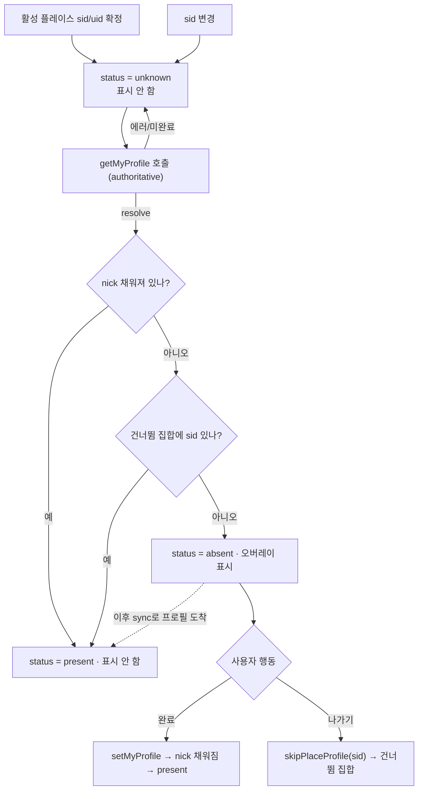
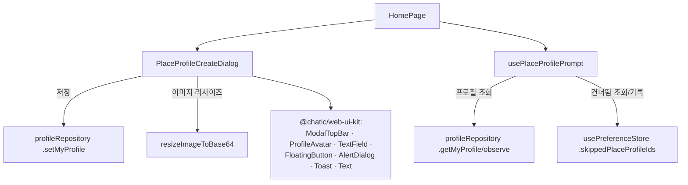

# 플레이스 프로필 생성 (Place Profile Create)

> 상태: Live · 최종 갱신: 2026-07-15 · 관련 ADR: [0012](../../../../../docs/adr/0012-place-profile-creation.md)

## 목적

플레이스(=Site)마다 사용자가 쓰는 프로필(이름·사진)을 **처음 만드는** 화면. 활성 플레이스에 내 프로필이 아직 없을 때 홈에서 감지해 풀스크린 오버레이로 띄운다. 이미 있는 프로필을 고치는 편집 화면([SiteProfileEditPage](../../../src/app/features/mypage/pages/SiteProfileEditPage.tsx))과는 별개다 — 이쪽은 "생성", 저쪽은 "편집".

## 설계 원칙

- **생성과 편집을 분리한다.** 편집 화면은 손대지 않는다. 생성 고유 요소(이탈 확인 모달·X 닫기 모달 UI·필수 단계 성격·20자)는 편집 화면의 관용구(뒤로가기 헤더·30자)와 섞지 않는다.
- **UI는 `@chatic/web-ui-kit`으로 조립한다.** 앱에서 이 라이브러리를 쓰는 첫 화면이다. 부족한 조각은 페이지에서 임기응변하지 말고 라이브러리에 추가한 뒤 쓴다.
- **등장 판단은 한 곳(home)에서.** 진입 경로(생성 직후·초대 참여·기존 미설정 플레이스 진입)와 무관하게 "활성 플레이스에 프로필이 없다"는 한 조건으로 처리한다.
- **건너뛰기는 이번 세션 동안만 존중한다.** 사용자가 "나가기"로 건너뛰면 이번 세션에서는 같은 플레이스에 다시 뜨지 않지만, 프로필은 언제든 프로필 화면에서 수정할 수 있으므로 영구 차단하지 않는다(세션 종료 후 재프롬프트 가능).

## 범위

**포함**

- 플레이스 프로필 생성 오버레이(풀스크린 다이얼로그) 신규 구현.
- 홈에서 활성 플레이스 프로필 유무 감지 → 미설정 & 미건너뛰기면 오버레이 표시.
- 이름 1~20자 필수 / 프로필 이미지 선택. 다섯 상태(초기·입력완료·제출로딩+성공토스트·20자초과에러·이탈확인모달) 전부.
- "나가기" 건너뛰기 플래그를 프론트 store(세션 스코프)에 플레이스별로 저장.
- `@chatic/web-ui-kit` `TextField`에 "카운터는 쓰되 하드 캡은 안 거는" 옵션 추가(초과 에러 상태 도달 가능하게).

**제외**

- 플레이스(Site) 개설 자체 — [CreatePlaceDialog](../../../src/app/features/home/components/CreatePlaceDialog.tsx) 소관.
- 기존 `SiteProfileEditPage`/`CloudProfileEditPage` 리워크·통합.
- 전용 URL 라우트/딥링크 진입(홈 감지 오버레이라 URL 진입점 불필요).

## 시나리오

1. **새 플레이스를 만든 직후** — 사용자가 `CreatePlaceDialog`로 플레이스를 개설하고 그 플레이스로 전환되면, 홈이 "이 플레이스에 내 프로필 없음"을 감지해 생성 오버레이를 띄운다.
2. **초대받아 참여한 플레이스에 처음 진입** — 초대 수락 후 해당 플레이스가 활성화되면 동일하게 감지되어 오버레이가 뜬다.
3. **이름 입력** — 사용자가 이름을 입력한다. 1자 이상 20자 이하일 때만 "완료"가 활성화된다. 20자를 넘기면 필드가 빨간 테두리 + "21/20" 카운터 + 에러 문구로 바뀌고 "완료"는 비활성.
4. **사진 선택(선택)** — 아바타의 "+"를 누르면 파일 선택창이 뜬다. 10MB 이하 webp/png/jpeg만 허용, 초과 시 에러 문구. 통과하면 150px 정사각 base64로 미리보기.
5. **완료** — "완료"를 누르면 버튼이 로딩되며 `setMyProfile({ nick, thumbnail })`를 호출. 성공하면 "프로필 설정이 완료되었습니다" 토스트가 잠깐 뜨고 오버레이가 닫힌다. 프로필이 생겼으므로 다시 뜨지 않는다.
6. **나가기(건너뛰기)** — X 또는 뒤로 시도 시 "프로필 설정을 중단하시겠어요?" 확인 모달. "계속 설정"은 모달만 닫고, "나가기"는 오버레이를 닫으면서 이 플레이스를 세션 건너뜀 집합에 기록 → 이번 세션 동안 같은 플레이스에선 다시 뜨지 않는다(세션 종료 후에는 다시 뜰 수 있음).

## 다이어그램

### 등장 판단 흐름 (로딩 vs 진짜 없음을 상태로 구분)

핵심: **`unknown`(로딩) 상태에서는 절대 표시하지 않는다.** `absent`는 `getMyProfile()`이 **성공 resolve**한 뒤 관측 캐시에 nick이 없을 때만 확정된다(reject는 일시적으로 보고 재시도). 한 번 `present`가 된 플레이스는 래치되어 (저장 직후 뒤늦은 빈 조회에도) 다시 `absent`로 내려가지 않는다.

### 컴포넌트 의존 관계

## 상세 구현

### 1) web-ui-kit — `TextField` 확장

[TextField.tsx](../../../../../libs/web-ui-kit/src/foundations/input/TextField.tsx)는 현재 `maxLength`를 주면 카운터 표시와 **입력 하드 캡**이 함께 걸려, Figma의 "21/20 초과 에러" 상태에 도달할 수 없다.

- `enforceMaxLength?: boolean`(기본 `true`) prop 추가. `false`면 DOM `maxLength`를 걸지 않아 입력이 20자를 넘을 수 있고, 카운터는 계속 `value.length/maxLength`로 표시된다.
- 초과 여부 판단·에러 문구는 호출자가 `error` prop으로 넘긴다(컴포넌트는 표현만).
- 기본값이 `true`라 기존 사용처는 영향 없음.

### 2) 프론트 store — 건너뜀 플래그 (플레이스별)

기존 프리퍼런스는 단일 문자열 값이지만, 건너뜀은 sid 집합이라 JSON 배열로 저장한다. **세션 스코프**(`sessionStorage`)라 앱/탭을 닫으면 초기화되어 다음 세션에 다시 프롬프트할 수 있다.

- [preferenceKeys.ts](../../../src/app/stores/preferenceKeys.ts): `skippedPlaceProfiles` 항목 추가 — `strategy: 'session'`, `sessionKey: 'chatic-skipped-place-profiles'`, `defaultValue: '[]'`.
- [usePreferenceStore.ts](../../../src/app/stores/usePreferenceStore.ts): 상태 `skippedPlaceProfileIds: string[]`(초기값은 저장된 JSON 파싱, 실패 시 `[]`), 액션 `skipPlaceProfile(sid: string)`(집합에 추가 후 JSON 직렬화하여 `sessionStorage`에 persist).

### 3) 감지 훅 — `usePlaceProfilePrompt`

신규 `apps/web/src/app/features/home/hooks/usePlaceProfilePrompt.ts`.

- 입력: 활성 플레이스 `sid`(`useSessionSelection().selectedSiteId`), `uid`(`useSessionIdentity().userId`).
- **default cloud(중계 서버)에서도 동작한다.** default cloud에서도 `selectedSiteId`는 relay core에서 나오므로([contextStore.ts:173](../../../../../libs/web-core/src/session/contextStore.ts)), 클라우드 종류로 게이팅하지 않는다. `sid`·`uid`가 모두 있을 때만 프로필을 키(`${sid}@${uid}`)로 판단할 수 있으므로, 둘 중 하나라도 없으면 표시하지 않는다.
- **관측 캐시 주도 + 레이스 안전 (핵심)**: 내부 상태 `status: 'unknown' | 'present' | 'absent'`. 판단은 `getMyProfile()`의 반환값이 아니라 **관측 캐시(`observeItem`, 헤더가 읽는 것과 동일 소스)**로 한다 — 동시 저장/조회가 오래된 값으로 resolve될 수 있기 때문.
  - **로딩 vs 없음**: `absent`는 `getMyProfile()`이 **성공 resolve**했을 때만 확정한다(서버의 authoritative "이 플레이스에 프로필 없음"). reject는 대개 일시적(부팅 시 소켓 연결 중 503)이므로 "없음"으로 보지 않고 **재시도(`RETRY_DELAY_MS`×`MAX_FETCH_ATTEMPTS`)하며 `unknown` 유지** → 로딩 중 프롬프트가 깜빡이며 뜨지 않는다.
  - **present 래치 (`presentFor` ref)**: 한 번 nick이 확인된 플레이스는 이후 다시 `absent`로 내려가지 않는다 — effect 재실행이나, 저장 직후 **뒤늦게 도착한 오래된 빈 조회**가 캐시를 덮어써도 프롬프트가 재등장하지 않는다. (프로필 설정 후 다이얼로그가 다시 뜨던 동시성 버그를 막는 지점.) 래치는 `profileId` 단위라 다른 플레이스로 바뀌면 새로 판정한다.
  - `getMyProfile()`은 캐시를 채우고 settle 시점을 알리는 용도이며, 그 cacheWrite가 `observeItem`으로 fan-in된다.
- `shouldPrompt = (status === 'absent') && !skippedPlaceProfileIds.includes(sid)`.
- 반환: `{ shouldPrompt, activeSid, dismiss() }`. `dismiss()`는 `skipPlaceProfile(sid)` 호출.

### 4) 오버레이 — `PlaceProfileCreateDialog`

[PlaceProfileCreateDialog.tsx](../../../src/app/features/home/components/PlaceProfileCreateDialog.tsx). `@chatic/web-ui-kit`으로 조립.

- 골격: `Dialog`(slide-up, 풀스크린 `max-h-[100dvh]` — `CreatePlaceDialog`와 동일 컨테이너) 안에 `ModalTopBar`(onClose, 제목 없음) + 본문 + `FloatingButton`. a11y용 `DialogTitle`/`DialogDescription`은 `sr-only`.
- **반응형 레이아웃**: 본문은 `flex-1 min-h-0 overflow-y-auto`로 짧은 뷰포트에서 스크롤되고, `FloatingButton`은 `shrink-0`으로 하단 고정되어 겹치지 않는다. 간격은 Figma 스펙에 맞춤(제목 `px-4 py-4`·gap-2, 본문 블록 `py-10`·`gap-8`, 아바타 `px-[18px]`·gap-4, 이름 필드는 `TextField` 자체 `px-4`). 제목 20px·부제 14px, 제목/부제 `break-keep`으로 긴 플레이스명도 안전하게 줄바꿈.
- 제목/부제: `Text`로 "\<{{place}}\>에 사용할 프로필을 만들어 주세요"(2줄, `whitespace-pre-line`) + 설명 2줄.
- 아바타: `ProfileAvatar`(`onSelect`로 숨은 `<input type=file>` 트리거) + "프로필 사진 [선택]" 라벨.
- 이름: `TextField` `required` `maxLength={20}` `enforceMaxLength={false}`. `name.length>20`이면 `error`(= 힌트 문구, 빨간색)로 20/20 초과 상태를 표현. success 체크는 쓰지 않음(Figma에 없음).
- 완료: `FloatingButton` `loading` = 제출 중, `disabled` = 이름 무효/제출 중. `canSubmit = trim 1~20자 && !submitting`.
- 알림(성공/에러): 오버레이 하단에 `Toast`를 인라인 렌더. 성공 시 `variant="positive"`("프로필 설정이 완료되었습니다")를 화면 위에 잠깐 띄우고 `SUCCESS_CLOSE_DELAY(1300ms)` 후 `onDone`. 이미지 크기 초과·저장 실패는 `variant="error"`로 같은 자리에 표시(전역 toast provider 불필요).
- 이탈 확인: 로컬 state로 web-ui-kit `AlertDialog` 제어. `cancelLabel="나가기"`→`onExit`, `confirmLabel="계속 설정"`→모달만 닫음. X/esc/overlay(`onOpenChange(false)`) 시 입력값이 있으면 확인 모달, 없으면 바로 `onExit`. 제출 중에는 닫기 무시.
- 이미지 처리: `resizeImageToBase64(file, 150)`(`@chatic/shared`), 10MB 초과·webp/png/jpeg 외 거부(기존 편집 페이지와 동일 규칙).
- 저장: `useRuntimeRepositories().profile.setMyProfile({ nick, thumbnail })`.

### 5) 마운트 & i18n

- [HomePage.tsx](../../../src/app/features/home/pages/HomePage.tsx): `usePlaceProfilePrompt`로 `shouldPrompt`/`dismiss`를 받고, 로컬 `isPlaceProfileOpen` state로 열림을 제어한다(성공 토스트를 보여준 뒤 명시적으로 닫기 위함 — 감지값의 즉각적 재계산에 흔들리지 않음). **onboarding 모달(`isFirstRun`)이 떠 있으면 열지 않는다**(onboarding 우선). `onDone`은 닫기, `onExit`은 닫기 + `dismiss()`. 활성 플레이스 이름은 `places`/`selectedPlaceId`에서 해석.
- `home/components/index.ts`·`home/hooks/index.ts`에 export 추가.
- i18n: `apps/web/public/locales/{ko,en}/translation.json`에 `placeProfileCreate` 블록(title/subtitle/nameLabel/nameHint/namePlaceholder/photoLabel/photoOptional/done/close/successToast/saveError/imageSizeError/exitTitle/exitDescription/exitLeave/exitContinue). title은 `{{place}}` 보간.

### 6) web-ui-kit 첫 소비자 배선

apps/web가 `@chatic/web-ui-kit`을 처음 소비하면서 필요한 통합 작업:

- **디자인 토큰 보강**: web-ui-kit 컴포넌트가 쓰는 `--brand-ink`/`--control-idle`/`--avatar-ring`가 apps/web에 없어, 권위 소스([tokens.css](../../../../../libs/web-ui-kit/src/resources/styles/tokens.css))의 값을 [styles.css](../../../src/styles.css)(light/dark)와 [tailwind.config.js](../../../tailwind.config.js)에 추가.
- **프로젝트 레퍼런스**: `nx sync`가 [tsconfig.app.json](../../../tsconfig.app.json)에 `web-ui-kit` 참조를 추가(빌드 그래프 정합).
- **jest asset mock**: web-ui-kit 배럴이 SVG/이미지를 re-export하므로, [jest.config.js](../../../jest.config.js)에 `css`/이미지용 moduleNameMapper(web-ui-kit의 mock 재사용)를 추가.

## 검증 방법

- **유닛/컴포넌트 테스트** (전부 통과):
  - [TextField.test.tsx](../../../../../libs/web-ui-kit/src/foundations/input/TextField.test.tsx): `enforceMaxLength={false}`면 하드 캡 없이 21/20 카운터 노출, 기본은 캡 유지.
  - [usePreferenceStore.test.ts](../../../src/app/stores/usePreferenceStore.test.ts): `skipPlaceProfile` 추가·중복 제거·persist·빈 sid 무시.
  - [usePlaceProfilePrompt.test.ts](../../../src/app/features/home/hooks/usePlaceProfilePrompt.test.ts): 로딩 중 미표시 / resolve 후 nick 공백&미건너뛰기→표시 / nick 채워짐→미표시 / 건너뛰기·sid·uid 없음→미표시 / **getMyProfile reject는 로딩으로 간주해 미표시+재시도**, 재시도 resolve 시 판정 / reject 중 캐시 nick 있으면 미표시 / **present 래치**(저장 후 뒤늦은 빈 조회가 와도 재표시 안 함) / default cloud 동작 / 늦게 도착한 프로필로 자동 닫힘 / dismiss 호출.
  - [PlaceProfileCreateDialog.test.tsx](../../../src/app/features/home/components/PlaceProfileCreateDialog.test.tsx): 완료 활성/비활성 전이, 20자 초과 카운터, `setMyProfile` 호출(nick trim), 입력 유무에 따른 이탈 확인 모달/즉시 exit.
- **정적 검사**: `nx typecheck web`·`nx typecheck web-ui-kit` 통과, 변경 파일 ESLint 통과.
- **수동 확인(후속)**: 실제 프롬프트는 로그인 세션 + 프로필 없는 활성 플레이스 상태가 필요해 로컬 프리뷰로 재현이 제한적이다. Storybook의 `TextField > OverLimit` 스토리로 초과 상태를 시각 확인할 수 있으나, worktree+nx 데몬(심링크 node_modules) 상호작용으로 worktree 스토리 인덱싱이 지연될 수 있음. 배포 환경 QA에서 5개 Figma 상태를 대조 권장.
