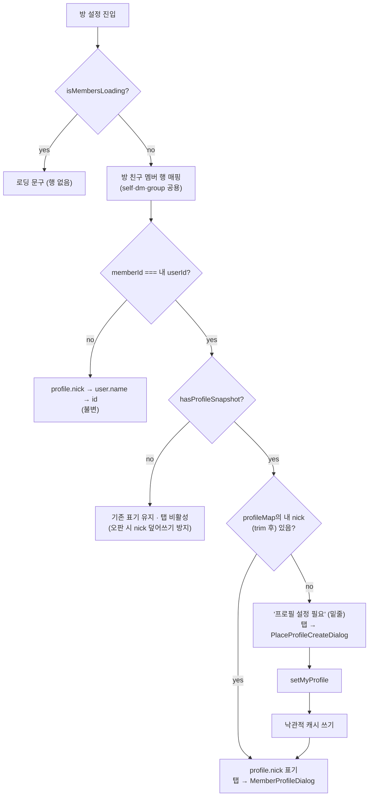
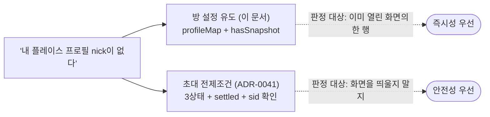
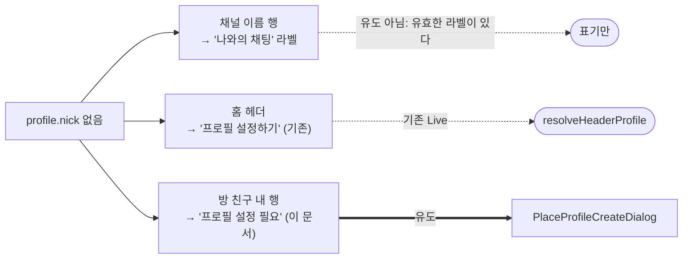
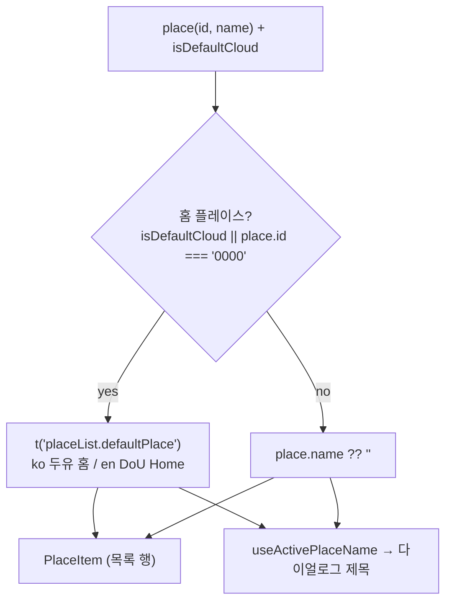

# 플레이스 프로필 미설정 유도

> 상태: Live · 최종 갱신: 2026-08-03 · 관련 ADR: [0040](../../../../../docs/adr/0040-self-chat-title-and-profile-setup-nudge.md) (현행), [0039](../../../../../docs/adr/0039-dm-display-name-chain-and-invite-profile-release.md) (프로필 강제 해제), [0012](../../../../../docs/adr/0012-place-profile-creation.md) (원 생성 플로우)

## 목적

플레이스(=Site)에 내 프로필이 없을 때 **어디서 그 사실을 알리고, 어떻게 설정 화면으로
보내는가**를 소유하는 문서. 다이얼로그 UI 자체는 [place-profile.md](./place-profile.md)가,
프로필이 쓰이는 표시 이름 규칙은 [self-chat.md](../channels/self-chat.md)·
[dm-chat.md](../channels/dm-chat.md)가 담당한다. 이 문서는 그 사이를 잇는 **감지·표기·라우팅**을
다룬다.

프로필은 **선택**이다. ADR-0039가 앱에 남은 마지막 강제 지점(초대 수락의 `profiling` 스텝)을
없애면서 프로필 강제는 0이 됐고, 그보다 앞선 2026-07-28의 `98a4685ff`가 플레이스 진입 시의
강제 팝업(`usePlaceProfilePrompt` + `PlaceProfileCreateDialog`)을 제거했다. 그 결과 **프로필을
설정하지 않은 사용자가 앱을 정상적으로 쓰는 상태가 기본값**이 됐고, 대신 그들에게 설정을
권할 자리가 앱 안에 하나도 없어졌다. ADR-0039가 "재권유 UX"라는 이름으로 범위 밖에 미뤄둔 것이
그것이며, 이 문서가 그 자리를 채운다.

강제 팝업과 이 유도는 목적이 같고 성격이 반대다.

|           | 강제 팝업 (~2026-07-28, 폐지) | 유도 (현행)                                          |
| --------- | ----------------------------- | ---------------------------------------------------- |
| 트리거    | 플레이스 진입 시 자동         | 방 설정을 열어 내 이름을 볼 때                       |
| 거부      | 불가 (`dismissible={false}`)  | 언제든 닫힘                                          |
| 오판 비용 | 앱이 막힘 → 판정을 이중 확증  | 빈 폼 저장이 nick을 덮어씀 → 프로필 읽기 완료를 확인 |

## 설계 원칙

- **유도는 사람 이름이 있어야 할 자리에서만 한다.** 프로필이 없다는 사실을 별도 배너·토스트로
  알리지 않는다. `profile.nick`이 없어서 **보여줄 이름이 실제로 없는 자리**를 유도 문구가
  대신 차지한다. 유도가 화면을 늘리지 않고, 이미 비어 있던 곳을 채운다.
- **읽을 수 없는 값으로 이름 자리를 메우지 않는다.** `profile.nick`이 없을 때
  user 레코드의 `name`으로 폴백하지 않는다. 전화번호 가입자의 그 값은 `***<뒷4자리>`이고
  (ADR-0033 D10) 그 외에는 raw UUID다. ADR-0039가 표시 이름 체인에서 이미 기각한 값이므로
  멤버 목록에서도 쓰지 않는다.
- **내 프로필만 유도한다.** 남의 프로필 미설정은 내가 해결할 수 없어 클릭 목적지가 없다.
  남의 행은 기존 표기(`profile.nick → user.name → id`)를 그대로 유지한다.
- **`stereo`로 게이팅하지 않는다.** 멤버 목록은 self·dm·group 공용 코드이고 이름이 새는 경로도
  공용이다. self에만 적용하면 공용 매핑에 분기가 늘면서 알려진 노출을 dm·group에 남긴다.
- **로딩과 부재를 구분한다 — 프로필 스트림 자신의 신호로.** 빈 `profileMap`은 "프로필 없음"이
  아니다. 그리고 **멤버 로딩 상태는 이 구분에 쓸 수 없다**: `isMembersLoading`은 user 캐시의 첫
  emit에 내려가고 프로필과 무관한데, 프로필은 채널 행(`sid`)에 하위 의존이라 **멤버가 먼저
  도착하는 것이 정상**이다. 그래서 `useChannelProfiles`가 `hasSnapshot`을 내고 유도가 그것을
  기다린다. 오판 비용이 "문구가 어긋남"으로 끝나지 않기 때문이다 — 그 행은 탭 가능하고, 탭하면
  빈 생성 폼이 열려 **저장이 실제 nick을 덮어쓴다.**
- **판정 경로를 초대 경로와 합치지 않는다.** 초대(ADR-0041)는 *화면을 띄울지*를 판정하므로
  헛등장하면 빈 폼이 기존 프로필을 덮어쓴다 — `settled` 게이트와 `sid` 확인이 필수인 3상태
  판정기를 쓴다. 이 유도는 *이미 열린 화면의 한 행*을 판정하므로 그 화면이 이미 가진
  `profileMap`에 준비 신호(`hasSnapshot`)만 더하면 충분하고, 구독을 하나 더 붙이는 것은
  낭비다 — 다만 그 신호 없이는 판정이 성립하지 않는다는 것이 이번에 드러났다. **두 판정이 어긋나 보이는
  순간(방 설정은 유도하는데 초대 화면은 안 뜸)은 정상이다** — 전자는 즉시성, 후자는 안전성을
  택한 결과다.
- **홈 플레이스의 이름은 백엔드 원문을 노출하지 않는다.** relay의 개인 플레이스는 백엔드
  이름이 `default`/`#default`(id `0000`)다. 이 이름은 유도가 여는 다이얼로그의 제목으로
  들어가므로, 표시용 이름 해석을 **순수 함수 하나**로 모아 모든 소비처가 공유한다. 판정
  신호가 화면마다 갈리면 다시 어긋난다.

## 범위

**포함**

- 방 설정(`ChannelSettingsPage`) "방 친구"의 **내 행**: `profile.nick`이 없으면
  `프로필 설정 필요`(밑줄) 표기. 모든 `stereo`에 적용.
- 내 행 클릭의 조건 분기 — 미설정이면 프로필 생성 다이얼로그 직행, 설정돼 있으면 기존
  `MemberProfileDialog`.
- `PlaceProfileCreateDialog` 복원 (`98a4685ff`에서 삭제된 파일) + 강제를 전제한 카피 교정.
- `PlaceProfileForm.exit`의 선택화 — 가드 유무를 카피의 부재로 스위치.
- `resolvePlaceDisplayName` 순수 함수 신설 + 홈 플레이스 라벨을 ko `두유 홈`으로 통일.
- 레거시 표시 이름 리졸버(`resolveChannelName` / `ClientChannelView.displayName`) 제거.

**제외**

- `PlaceProfileForm`/`PlaceProfileFormDialog`의 폼 UI·저장 로직 — [place-profile.md](./place-profile.md) 소유.
- 초대 경로의 프로필 전제조건과 3상태 판정 훅 — ADR-0041 / [relay-invite-accept.md](../invite/relay-invite-accept.md) 소유.
- 홈 채널 목록 행에서의 유도 — Figma가 없어 카피·모양이 미정.
- 홈 헤더의 `프로필 설정하기` 넛지(`resolveHeaderProfile`의 `setup` 상태) — 이미 Live이며 불변.
- 표시 이름 체인 자체의 규칙 변경 — [self-chat.md](../channels/self-chat.md)·[dm-chat.md](../channels/dm-chat.md) 소유.
- 강제 팝업/`usePlaceProfilePrompt`의 부활.
- `desktop-web`.

## 시나리오

### S1 — 프로필 없이 방 설정을 연다 (유도 발생)

1. 프로필을 만들지 않은 사용자가 채팅방 → ⋯ → 방 설정을 연다.
2. 상단 이름 행은 채널 표시 이름 체인을 따른다 — self면 `join.nick → profile.nick →
나와의 채팅/Self Chat`이므로 프로필이 없어도 `나와의 채팅`이 뜬다. **유도 문구가 아니다.**
3. "방 친구" 섹션의 내 행: `MY` 배지 + **`프로필 설정 필요`(밑줄)**. 프로필 읽기가 끝나기
   전에는(`hasSnapshot === false`) 이 문구를 쓰지 않고 기존 표기를 유지하므로, 프로필이 있는
   사용자에게 문구가 스치지 않는다.
4. 그 행을 탭 → **프로필 생성 다이얼로그가 바로 열린다**(`MemberProfileDialog`를 거치지 않음).
5. 제목은 `<플레이스>에 / 사용할 내 프로필을 만들어 주세요`. 홈 플레이스라면 `<플레이스>`
   자리에 `두유 홈`이 들어간다(백엔드 원문 `default`가 아니다).
6. 이름을 넣고 완료 → `profile.set`(`setMyProfile`) → 성공 토스트 → 닫힘.
7. 낙관적 캐시 쓰기가 관찰자들에게 퍼져 **내 행이 방금 넣은 이름으로 바뀐다.** self 방이면
   상단 이름 행도 체인 2단계(`profile.nick`)를 타 같이 바뀐다.

### S2 — 설정을 중단한다

4단계에서 이름을 입력한 뒤 닫으려 하면 미저장 가드가 뜬다(이 경로는 `exit` 카피를 넘긴다).
중단하면 프로필은 만들어지지 않고 내 행은 다시 `프로필 설정 필요`다. **앱은 계속 정상
동작한다** — 이 문구는 차단이 아니다. 가드 문구도 그렇게 말한다: "지금 중단하면 프로필이
만들어지지 않습니다. 플레이스 설정에서 언제든 다시 설정할 수 있어요."

### S3 — 프로필이 있는 상태로 방 설정을 연다 (유도 없음)

내 행은 `MY` + `profile.nick`(밑줄 없음). 탭하면 기존대로 `MemberProfileDialog`가 열리고,
거기서 `프로필 설정`을 누르면 **수정** 다이얼로그(`PlaceProfileEditDialog`)가 열린다. 유도
경로와 수정 경로는 목적이 달라 각자의 카피를 쓴다.

### S4 — 남의 프로필이 없다

상대 행은 `profile.nick → user.name → id` 폴백을 그대로 쓴다. `프로필 설정 필요`를 붙이지
않는다 — 내가 해결할 수 없고, 탭하면 그 사람 프로필(신고/내보내기)이 열려야 한다.

### S5 — 홈 플레이스 이름이 쓰이는 다른 자리

플레이스 목록 행(`PlaceItem`)과 클라우드 시트의 `두유 홈` 행은 이미 브랜딩된 이름을 쓴다.
이번 통일로 ko 라벨이 한 문자열(`두유 홈`)로 모였으므로 **플레이스 목록 표기도 `DoU Home` →
`두유 홈`으로 함께 바뀌었다**(en은 양쪽 모두 `DoU Home` 유지).

## 다이어그램

### 유도 판정과 라우팅



### 같은 사실, 두 판정 경로 (합치지 않는다)



### 프로필 없는 사용자가 만나는 이름 자리 (유도는 한 곳뿐)



### 플레이스 표시 이름 해석



## 상세 구현

### 1) 판정과 표기 — `ChannelSettingsPage`

[ChannelSettingsPage.tsx](../../../src/app/features/channels/pages/ChannelSettingsPage.tsx)의
`memberList` 매핑 안에서 결정된다. 이 목록은 self·dm·group 공용이라 유도도 공용이다.

```ts
const needsProfileSetup = !!memberId && memberId === userId && hasProfileSnapshot && !memberProfile?.nick?.trim();
const memberName = needsProfileSetup
    ? t('chat.settings.profileSetupRequired')
    : memberProfile?.nick || member.name || memberId || t('chat.settings.unknownUser');
```

- `memberProfile`은 이미 그 화면이 가진 `useChannelProfiles(sid, memberUserIds)`의 `profileMap`
  에서 온다. 구독을 새로 붙이지 않는다.
- **내 행에서 `member.name`·`memberId` 폴백은 자동으로 도달 불가**가 된다 —
  `needsProfileSetup`이 정확히 "내 행 + nick 없음"이므로 별도 조건을 더하지 않았다.
- **`hasProfileSnapshot`이 없으면 이 판정은 틀린다.** `isMembersLoading`으로 대신할 수 없는
  이유는 설계 원칙에 있다. `useChannelProfiles`가 이 신호를 새로 내며, `observeList`가 emit할 때
  **그리고** 콜드 캐시 부트스트랩이 settle될 때 `true`가 된다 — 캐시가 비어 `observeList`가 한
  번도 emit하지 않는 경우에도 영구히 대기하지 않는다. `sid`가 바뀌면 `false`로 되돌아간다.
- 클릭: `needsProfileSetup ? openDialog('profileCreate') : openMemberProfile(memberView)`.
  `DialogType`에 `'profileCreate'`가 추가됐고, `PlaceProfileEditDialog`(`'profileSettings'`)는
  S3 경로로 그대로 남는다.

**주의: 제목 행과 멤버 행은 서로 다른 소스를 읽는다.** 제목은 `useChannelTitle` →
`useMyProfile`(활성 사이트의 `${sid}@${uid}` 관찰 + 일회성 `getMyProfile()`), 멤버 행은
`profileMap`(멤버 단위 5초 폴링)이다. 정상 상태에서는 같은 값이지만 도착 순서가 다를 수 있다.
합치지 않은 이유는 설계 원칙의 마지막 두 항목에 있다. 테스트도 두 소스에 **다른 nick**을 넣어
이 구분이 무너지면 실패하게 해뒀다.

[MemberListItem.tsx](../../../src/app/features/channels/components/MemberListItem.tsx)는
`needsProfileSetup?: boolean`을 받아 이름에 밑줄만 붙인다(문구 선택은 호출자 몫). 배지
우선순위(`pending` → `owner` → `mine`)는 불변 — Figma `3185-13278`도 `MY`를 유지한다.

### 2) 생성 다이얼로그 — `PlaceProfileCreateDialog`

`98a4685ff`가 지운 66줄 파일을 되살렸다. 시그니처는
`{ open, placeName, onDone, onExit, exit? }` —
[공유 계약](../../../../../docs/plans/place-profile-create-shared-contract.md) §1이 정본이며
초대 경로(ADR-0041)가 같은 컴포넌트를 소비한다.

- **`dismissible`은 노출하지 않는다.** 두 소비처 모두 강제로 쓰지 않기로 했다.
- **`exit`을 넘기면 미저장 가드가 붙는다.** 이 문서의 유도 경로는 넘긴다 — 되돌아가는 비용이
  없으니 반쯤 입력한 이름을 조용히 버릴 이유가 없다. 초대 경로는 생략한다.
- `placeName`은 호출자가 **해석한** 값이다(§3). 여기서 다시 해석하지 않는다.

### 3) 플레이스 표시 이름 — `resolvePlaceDisplayName`

[resolvePlaceDisplayName.ts](../../../src/app/features/home/lib/resolvePlaceDisplayName.ts).
순수 함수 + `HOME_PLACE_ID = '0000'` 상수.

```ts
resolvePlaceDisplayName(place, { isDefaultCloud }, t): string
```

판정은 **`isDefaultCloud`(`selectedCloudId === 'default'`) OR `place.id === '0000'`**.
클라우드 신호가 1차인 이유는 이미 다섯 곳(`HomePage`·`PlaceList`·`useHomePlaces`·
`useHomeChannels`·`useActiveCloudChannels`)이 그것을 쓰고, 레거시 `place.id === 'default'`가
실제 relay place에 매치되지 않기 때문이다. `'0000'`은 런타임의 실제 sid라 보조로 함께 인정한다.

소비처는 둘이다.

- [PlaceItem.tsx](../../../src/app/features/home/components/PlaceItem.tsx) — 이미 받는
  `isHomePlace` prop을 `ctx.isDefaultCloud`로 넘긴다(동작 불변, ko 라벨 문자열만 바뀜).
- [useActivePlaceName.ts](../../../src/app/hooks/useActivePlaceName.ts) — `selectedCloudId`를
  함께 읽고, 관찰한 place 행이 아직 없으면 `{ id: sid }`로 폴백한다. **여기가 `default` 원문
  노출을 실제로 고치는 지점**이다(생성/수정 다이얼로그 제목).

`DouHomeItem`은 소비처가 아니다 — place가 없는 합성 클라우드 행이라 해석할 이름이 없고,
라벨 키(`cloudSessionSheet.douHome`)만 같은 문자열을 쓴다.

### 4) 가드 스위치 — `PlaceProfileForm.exit`

[PlaceProfileForm.tsx](../../../src/app/features/home/components/PlaceProfileForm.tsx).
`exit`을 optional로 바꿨다. 별도 boolean(`confirmOnExit` 등)을 두지 않고 **카피의 부재 자체를
스위치로 쓴다** — 가드를 켜려면 보여줄 문구가 필요하므로 두 값이 항상 함께 움직인다.

```ts
if (exit && isDirty) setAlertOpen(true);
else onExit();
```

`exitGuard`도 `exit`이 없으면 `null`이다. `dismissible` 분기는 손대지 않았다. 기존 호출자
(`PlaceProfileEditDialog`, `PlaceProfilePage`)는 `exit`을 넘기므로 **무변경으로 가드를 유지한다.**

### 5) i18n

| 키                                   | 변경                                                               |
| ------------------------------------ | ------------------------------------------------------------------ |
| `chat.settings.profileSetupRequired` | **신규** — ko `프로필 설정 필요` / en `Profile setup needed`       |
| `channelList.selfChannel`            | en `My Chat` → **`Self Chat`** (Figma `3185-13278`)                |
| `placeList.defaultPlace`             | ko `DoU Home` → **`두유 홈`** (`cloudSessionSheet.douHome`와 일치) |
| `placeProfileCreate.title`           | ko/en에 "내"/"your" 추가 (Figma `3026-11374`)                      |
| `placeProfileCreate.exitDescription` | 강제를 전제한 문구 폐기 — 아래 참고                                |

`exitDescription`의 옛 값은 ko `"이름을 설정해야 DoU를 시작할 수 있어요!"` / en
`"You need to set a name to start DoU!"`였다. 프로필 강제가 0이 된 뒤 이 문장은 **거짓**이므로,
중단해도 앱을 쓸 수 있고 나중에 다시 설정할 수 있다는 사실로 바꿨다.

dev i18n 캐시 주의([[dev-i18n-localstorage-cache]]).

### 6) 레거시 표시 이름 리졸버 제거

ADR-0040 결정 2. `app/utils/channel.ts`의 `resolveChannelName`은 `$join.nick → channel.name`
뿐이어서 **raw-UUID 가드도 `stereo` 분기도 없었고**, `useChannel`이 이를
`ClientChannelView.displayName`으로 노출했다. 같은 채널이 `roomTitle`은 옳고 `displayName`은
UUID인 상태가 남아 있으면 "체인은 하나"가 사실이 아니다.

**프로덕션 소비처는 0이었다** — 생산자(`useChannel`)·타입 선언·테스트 픽스처뿐이었고,
`InvitePage`의 `contact.displayName`은 기기 연락처 필드로 무관하다. 지운 것:
`utils/channel.ts` + `channel.test.ts`, `utils` 배럴 export, `ClientChannelView.displayName`,
`useChannel`의 파생, 픽스처 4곳. 표시 이름은 이제 `resolveChannelTitle` 하나가 낸다.

### 7) 잘못된 ADR 주석 교정

`selfChatTitle.ts`·`resolveChannelTitle.ts`·`ChannelList.tsx`가 self 채널을 "ADR-0022"로
적었으나 실제는 **ADR-0026**이다(0022는 초대 페이지).

## 검증 방법

- **유닛 테스트** (`apps/web` 전체 138 스위트 / 1004 케이스 통과)
    - [ChannelSettingsPage.test.tsx](../../../src/app/features/channels/pages/ChannelSettingsPage.test.tsx)
      의 `프로필 미설정 유도 (내 행)` describe — 유도 표기와 `user.name` 미노출, 공백 nick,
      프로필 있을 때 미유도, 남의 행 불변, 두 클릭 분기(생성 직행 / 멤버 프로필),
      `self`·`dm`·`group` 세 유형 모두 동일 동작, self 이름 행은 유도가 아니라 라벨.
      **회귀 가드 2건: `hasSnapshot === false`이고 멤버는 도착해 있을 때 유도하지 않고 탭도
      다이얼로그를 열지 않는다** — 이 구간을 부재로 읽으면 프로필이 있는 사용자의 nick이
      덮어써진다.
    - [useActivePlaceName.test.ts](../../../src/app/hooks/useActivePlaceName.test.ts) — 기본
      클라우드 브랜딩, place 행 미캐시 시 sid 폴백, 홈 sid 단독 판정, **사이트 전환 시 이전 행
      즉시 폐기**(보관하면 relay의 `0000`이 남아 다른 클라우드에서도 `두유 홈`이라 답한다),
      동일 emit 반복이 리렌더를 쌓지 않음.
    - [MemberListItem.test.tsx](../../../src/app/features/channels/components/MemberListItem.test.tsx) —
      `needsProfileSetup`의 밑줄 유무 + `MY` 배지 병존.
    - [PlaceProfileCreateDialog.test.tsx](../../../src/app/features/home/components/PlaceProfileCreateDialog.test.tsx) —
      `98a4685ff^`에서 복원한 회귀 가드 + 제목에 해석된 플레이스 이름 주입 + **`exit` 유무에 따른
      가드 on/off** 두 케이스.
    - [resolvePlaceDisplayName.test.ts](../../../src/app/features/home/lib/resolvePlaceDisplayName.test.ts) —
      `isDefaultCloud`·`id === '0000'`·일반 place·이름 없음·place 자체가 없음.
    - 회귀: `ChannelList.test.tsx`·`selfChatTitle.test.ts`·`resolveChannelTitle.test.ts`·
      `PlaceProfileForm*`·`PlaceProfileEditDialog.test.tsx`.
    - 명령:
        ```bash
        npx jest --config apps/web/jest.config.js --rootDir apps/web ChannelSettingsPage MemberListItem PlaceProfile resolvePlaceDisplayName ChannelList selfChatTitle resolveChannelTitle
        ```
- **정적 검사**: `npx tsc -p apps/web/tsconfig.app.json --noEmit` 에러 0건, 변경 파일 ESLint·
  Prettier 통과. 제거 심볼 grep 0건 —
    ```bash
    grep -rn "resolveChannelName" apps/web/src libs
    ```
- **수동 확인(로그인+소켓 필요)**: 프로필 없는 계정으로 self 방 설정 → 내 행 유도 문구, 탭 →
  생성 다이얼로그 제목의 플레이스 이름이 `default`가 아닌 `두유 홈`, 저장 → 내 행과 (self면)
  이름 행이 갱신. dm·group 방에서도 내 행이 같은지. 플레이스 목록 행 라벨이 `두유 홈`인지.

## 운영 주의 (as-built)

- **`profile.get`이 프로필 없는 사용자에게 행을 남기는지는 확인되지 않았다.** 남기지 않아도
  `profileMap`에 내 항목이 없으므로 판정은 `nick 없음`으로 같게 성립하고, 남긴다면 빈 `nick`으로
  같은 결론이 된다. `hasSnapshot`이 두 경로(emit / 부트스트랩 settle) 모두에서 올라가므로
  **어느 쪽이든 유도가 조용히 죽지는 않는다.**
- **`PlaceProfileCreateDialog`는 기존 값을 seed하지 않는다.** 생성 다이얼로그이므로 의도된 것이며,
  `hasSnapshot` 가드가 "프로필이 있는데 열리는" 경로를 막는다. 가드를 우회하는 새 호출자가
  생긴다면 그때는 seed가 필요하다 — 빈 폼 저장이 기존 nick을 덮어쓰기 때문이다.
- **로컬 캐시에서 명시적 `thumbnail: undefined`가 기존 사진을 지운다.** `ProfileRepositoryV2.setProfile`
  과 `ProfileLocalDataSourceV2.normalizeProfile`이 평범한 스프레드라 _생략된_ 키만 보호한다.
  서버로는 `JSON.stringify`가 `undefined`를 빼므로 전송되지 않고 다음 폴링(5초)에 복구된다.
  이 다이얼로그만의 문제가 아니라 프로필 저장 경로 전반의 것이므로 별도 과제로 둔다.
- **`placeList.defaultPlace` ko 변경이 플레이스 목록 표기도 바꿨다** — 이번 스펙 밖 화면이다.
  의도된 통일이지만 시각적 회귀로 보고될 수 있다.
- **dm·group 방 설정의 내 행 표기가 Figma 확인 없이 바뀌었다.** 방향은 `***1234`/UUID →
  행동 가능한 문구이므로 퇴행은 아니나 디자이너 사후 확인 대상이다.
- **`exitDescription` 교정 문구는 디자이너 미확인이다.**
- **`PlaceProfileForm.exit` 선택화는 공유 계약 §3에서 S-41(초대 세션) 소유로 배정됐던 변경이다.**
  선행 의존이라 이 세션이 함께 내렸다 — 초대 세션은 그 3줄을 다시 만들지 않는다.
