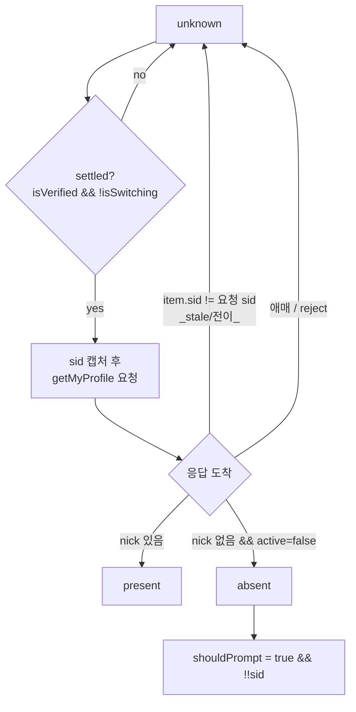
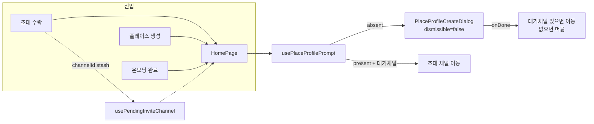

# 플레이스 프로필 설정 프롬프트 플로우

> 상태: Live · 최종 갱신: 2026-07-23 · 관련 ADR: [0012](../../../../../docs/adr/0012-place-profile-creation.md)

## 목적

플레이스(=Site)에 내 프로필이 없을 때 **설정 팝업을 언제·어떻게 띄우고, 완료 후 어디로 보내는가**를 소유하는 문서. 다이얼로그 UI 자체는 [place-profile.md](./place-profile.md)가, 초대 수락 파이프라인은 [invite-accept.md](./invite-accept.md)가 담당한다. 이 문서는 그 사이를 잇는 **감지·게이팅·라우팅**을 다룬다.

핵심 목표는 두 가지다:

1. 프로필 설정을 **필수**로 만든다(취소·건너뛰기 없음).
2. "이미 프로필이 있는데 팝업이 뜨는" 오판을 없앤다 — 프로필 유무를 **확정적으로(definitive)** 인지한 뒤에만 띄운다.

## 설계 원칙

- **프로필 유무의 단일 판정 훅.** `usePlaceProfilePrompt` 하나가 활성 플레이스의 프로필 유무를 판정한다. 세 진입 플로우(초대·플레이스 생성·온보딩)는 모두 이 훅의 결과에 반응할 뿐, 각자 판정하지 않는다.
- **판정은 서버 권위 + 컨텍스트 검증.** 유무는 로컬 캐시가 아니라 소켓 `profile.get-mine`로 읽는다. 단, 응답이 **요청 시점 컨텍스트(sid)와 일치할 때만** 신뢰한다. 전이·stale 컨텍스트 응답은 `unknown`으로 버리고 다음 settle에서 재읽기 — 오판(false absent)의 근본 차단.
- **판정은 비대칭이다.** `present`는 nick만으로 확정한다(nick이 곧 "프로필 있음" 신호). 반면 위험한 방향인 `absent`(=필수 팝업을 여는 쪽)는 서버 계약으로 이중 확증한다(no nick + `active:false`). nick도 없고 `active:false`도 아닌 애매 응답은 `unknown`. present에까지 `active:true`를 요구하면 프로필이 있는 사이트가 `active`를 누락했을 때 초대 네비게이션이 막힐 수 있어, 대칭 엄격 대신 이 비대칭을 택했다.
- **필수는 판정에도, UI에도 새긴다.** 스킵/dismiss 경로를 훅에서 없애고(`shouldPrompt`는 유무만으로 결정), 다이얼로그는 `dismissible={false}`로 호출한다.
- **미확정일 때는 아무것도 하지 않는다.** `status`가 `unknown`인 동안에는 팝업도, 초대 채널 이동도 하지 않는다. 깜빡임과 오판을 동시에 막는다.
- **온보딩 > 초대 > 프로필 프롬프트 우선순위를 유지한다** ([invite-accept.md](./invite-accept.md)와 동일). 프로필 프롬프트는 `!isFirstRun`에서만 뜬다.

## 범위

**포함**

- `usePlaceProfilePrompt`: 필수화(스킵 경로 제거, 이미 반영됨) + **응답 sid 검증**과 **`active` 이중 확증** 추가.
- 세 진입 플로우 배선: 초대(`useEnterInvitedChannel` + `usePendingInviteChannel`), 플레이스 생성(자동 감지), 온보딩/기본 플레이스(자동 감지).
- "건너뛰기 기억" store 완전 제거: `usePreferenceStore`의 `skippedPlaceProfileIds`/`skipPlaceProfile`, preference key `skippedPlaceProfiles`.
- 대응 유닛 테스트 갱신.

**제외**

- `PlaceProfileFormDialog`/`PlaceProfileCreateDialog`/`PlaceProfileEditDialog`의 폼 UI·저장 로직 — [place-profile.md](./place-profile.md) 소유.
- 초대 수락 파이프라인(`useInviteAccept`)·딥링크 파싱 — [invite-accept.md](./invite-accept.md) 소유.
- 서버 `profile.get-mine` 계약 변경(백엔드).
- 과거 저장된 `skippedPlaceProfiles` 값의 마이그레이션/정리(방치, 무해).

## 시나리오

### Flow 1 — 초대 수락 → 채널

1. 초대 수락 → `useInviteAccept`가 cloud→site 입장까지 태운다.
2. `useEnterInvitedChannel`이 초대의 `channelId`를 `usePendingInviteChannel`에 stash하고 **home으로** 이동(`replace`).
3. home에서 `usePlaceProfilePrompt`가 판정:
    - **absent(확정)** → `PlaceProfileCreateDialog`(필수). `onDone` → 대기 채널로 이동(`openPendingInviteChannel`).
    - **present(확정)** → 팝업 없이 대기 채널로 직행.
    - **unknown** → 대기(다음 settle에서 재판정). 이 사이 채널 이동·팝업 모두 없음.

### Flow 2 — 첫 플레이스 생성 → 머묾

1. `CreatePlaceDialog`에서 이름·사진 입력 → `place.create` + `useSiteSwitch.switchSite`로 새 site로 전환 → 다이얼로그 닫힘.
2. home이 새 플레이스로 재렌더. site-switch mutation이 `SWITCH_SITE_MUTATION_KEY`로 추적되므로 `usePlaceProfilePrompt`는 switch가 settle될 때까지 `unknown`을 유지.
3. settle 후 판정: 새 플레이스엔 프로필이 없으므로 **absent(확정)** → 프로필 팝업(필수). 완료 후 그대로 플레이스에 머묾(대기 채널 없음).

### Flow 3 — 온보딩 / 기본 플레이스(중계서버)

1. 첫 실행 → `OnboardingModal`(`open={isFirstRun}`). 이 동안 프로필 프롬프트는 억제(`!isFirstRun` 가드).
2. 온보딩 완료 → `isFirstRun=false`. 기본 플레이스(default cloud, relay가 `selectedSiteId` 공급)에서 판정.
3. **absent(확정)** → 프로필 팝업(필수) → 완료.

## 다이어그램

### 판정 상태 기계 (`usePlaceProfilePrompt`)

### 세 플로우와 훅의 관계

## 상세 구현

### 1) `usePlaceProfilePrompt` — 판정 강화

[usePlaceProfilePrompt.ts](../../../src/app/features/home/hooks/usePlaceProfilePrompt.ts). 현재도 `settled = isVerified && !isSwitching` gate에서 `getMyProfile()`을 쏘고 `nick` 유무로 판정한다([usePlaceProfilePrompt.ts:54](../../../src/app/features/home/hooks/usePlaceProfilePrompt.ts), [:72-82](../../../src/app/features/home/hooks/usePlaceProfilePrompt.ts)). 여기에 두 가지를 더한다:

- **응답 sid 검증**: 요청 시점의 `sid`를 클로저로 캡처하고(effect deps에 `sid` 포함), 응답 `item.sid`(정규화 필드, `toDomainProfile`가 `siteId||sid||context.sid`로 채움 — [mappers.ts:205](../../../../../libs/data/src/data/domain/mappers.ts))가 그 `sid`와 다르면 판정을 수용하지 않고 `unknown` 유지. 전이/stale 컨텍스트 응답을 식별해 버린다.
- **비대칭 판정**: `hasNick(item)` → `present`(nick만으로 충분). 그렇지 않고 `item.active === false` → `absent`. 둘 다 아니면 `unknown`. `absent`(필수 팝업을 여는 위험한 방향)만 `active`로 이중 확증하고, `present`는 nick 단독으로 확정해 초대 네비게이션이 계약 드리프트에 막히지 않게 한다.

`DomainProfile`(=`CacheProfileView`)은 `sid`(non-optional)·`active?: boolean`을 타입으로 보유하므로 캐스팅 없이 접근 가능.

반환은 `{ shouldPrompt, status }`(미사용이던 `activeSid`는 제거). `shouldPrompt = status === 'absent' && !!sid` 유지(스킵 경로 없음).

### 2) 초대 플로우 배선 (현행 유지 확인)

- [useEnterInvitedChannel.ts](../../../src/app/features/home/hooks/useEnterInvitedChannel.ts): `channelId`를 `usePendingInviteChannel`에 stash 후 home으로 `replace`.
- [usePendingInviteChannel.ts](../../../src/app/stores/usePendingInviteChannel.ts): 비영속 zustand store(accept→profile→channel hop 브리지).
- [HomePage.tsx](../../../src/app/features/home/pages/HomePage.tsx): `placeProfileStatus === 'present'`이면 대기 채널 직행, `onDone`에서 `openPendingInviteChannel()`. `status==='unknown'` 동안 이동 안 함(현행 effect가 `present`에서만 발동).

### 3) 건너뛰기 store 제거

[usePreferenceStore.ts](../../../src/app/stores/usePreferenceStore.ts)에서:

- `PreferenceState.skippedPlaceProfileIds` 필드, `PreferenceActions.skipPlaceProfile` 액션과 그 구현 제거([usePreferenceStore.ts:103](../../../src/app/stores/usePreferenceStore.ts), [:114](../../../src/app/stores/usePreferenceStore.ts), [:136](../../../src/app/stores/usePreferenceStore.ts), [:160-165](../../../src/app/stores/usePreferenceStore.ts)).
- 초기화의 `parseStringArray(readPreference('skippedPlaceProfiles'))` 제거. `parseStringArray`가 다른 소비자 없으면 함께 제거(grep 확인).
- `preferenceKeys`에서 `skippedPlaceProfiles` 키 정의 제거.
- 브리지 오버라이드(`applyBridgePreferences` 류)에 해당 키가 있으면 제거.

### 4) 참조 정리

- `usePlaceProfilePrompt`·그 테스트의 store 참조는 이미 제거됨(작업 트리). 다른 참조처 부재는 grep(`skippedPlaceProfileIds|skipPlaceProfile|skippedPlaceProfiles`)로 확인.

## 검증 방법

- **유닛 테스트** [usePlaceProfilePrompt.test.ts](../../../src/app/features/home/hooks/usePlaceProfilePrompt.test.ts) — 판정 훅 + store 합쳐 43개 통과:
    - 기존: sid·uid 없으면 미조회, 미검증/switching 중 `unknown` 유지, settle 순간에만 read, reject→미표시, relay(default cloud)에서도 동작.
    - 신규: `nick` 없음+`active:false`→absent(+`shouldPrompt`), `nick`+`active:true`→present, **응답 `sid`≠요청 sid → `unknown`(오판 차단)**, `nick` 없는데 `active:true`(애매)→`unknown`, `nick` 있으면 `active` 값 무관하게 present(초대 네비게이션 hang 방지).
- **store 테스트** [usePreferenceStore.test.ts](../../../src/app/stores/usePreferenceStore.test.ts): `skipPlaceProfile` describe 블록·`skippedPlaceProfileIds` 초기화 제거, 나머지 회귀 통과.
- **정적 검사**: 변경 5개 파일 ESLint 통과. `tsc -p apps/web/tsconfig.app.json` 기준 변경 파일에 신규 타입 에러 없음(잔존 9개는 stereo `self`·InviteDialog 백엔드 계약 대기·place-profile 다이얼로그 반환 타입 등 **이번 변경과 무관한 기존 이슈**). 제거 심볼 grep(`skippedPlaceProfile*`, `parseStringArray`) 0건 확인.
- **수동 확인(로컬 프리뷰 제약)**: 실제 세션·초대 딥링크가 필요해 로컬 재현이 제한적([place-profile.md](./place-profile.md)와 동일 제약). 배포 QA에서 세 플로우와 "이미 프로필 있는 재진입 시 무팝업"을 대조 권장.

## 운영 주의 (as-built)

- **서버 계약 의존**: `absent` 판정만 "없음 = `active:false` + `nick` 미포함"이라는 `profile.get-mine` 계약(없을 때도 `:ok` + `active:false`, 있을 때 `nick` + `active:true`)에 의존한다. `active`가 흔들려도 `present`는 nick 단독이라 초대 네비게이션은 안전하고, 영향은 "없음인데 `active:false`가 안 와서 팝업이 지연"되는 쪽으로만 제한된다.
- **판정 지연**: 전이/stale 컨텍스트 응답(`item.sid` 불일치)을 버리고 다음 settle에서 재읽기하므로, 오판은 없되 팝업 등장이 한 박자 늦을 수 있다. `settled`(`isVerified && !isSwitching`)가 정상 회복되지 않으면 팝업이 지연·미표시될 수 있으니 소켓 검증 신호를 함께 본다.
