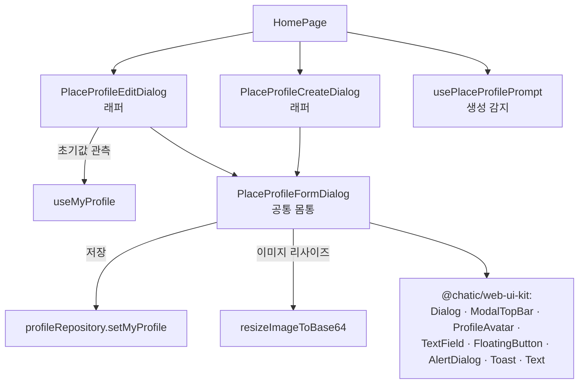
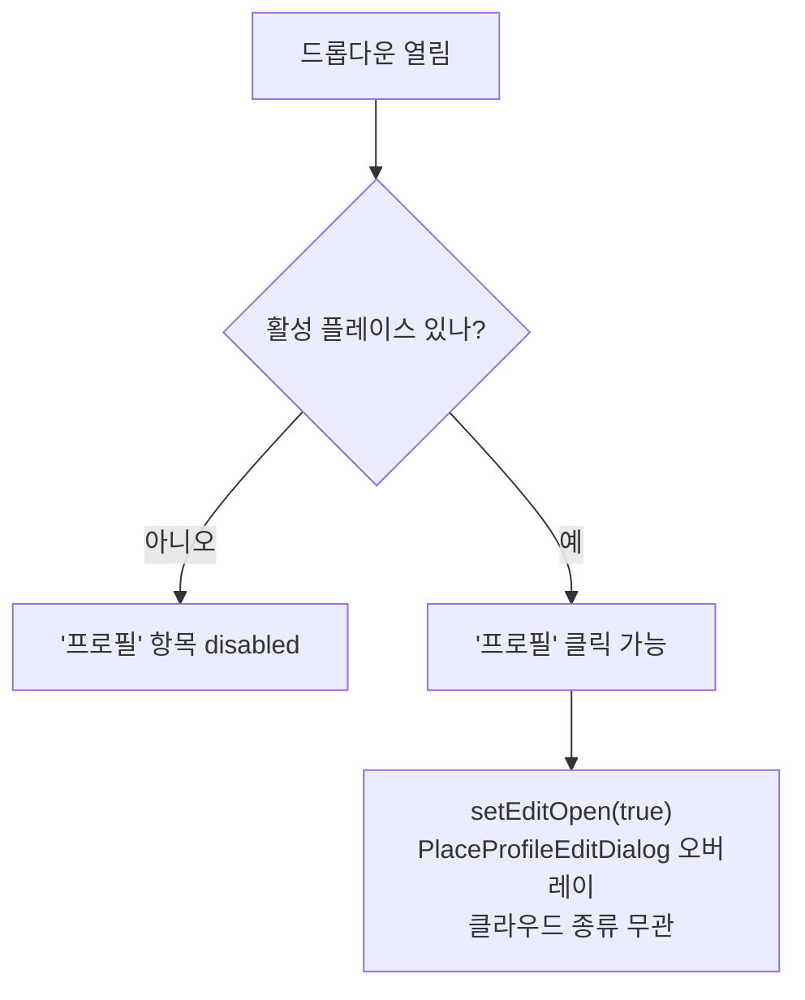

# 플레이스 프로필 (생성·수정)

> 상태: Live · 최종 갱신: 2026-07-20 · 관련 ADR: [0012](../../../../../docs/adr/0012-place-profile-creation.md), [0020](../../../../../docs/adr/0020-place-profile-edit-dialog.md)

## 목적

플레이스(=Site)마다 사용자가 쓰는 프로필(이름·사진)을 **만들고 고치는** 화면. 두 흐름을 하나의 공통 오버레이로 제공한다.

- **생성**: 활성 플레이스에 내 프로필이 아직 없을 때 홈이 감지해 풀스크린 오버레이로 띄운다.
- **수정**: 홈 헤더 드롭다운의 "프로필"에서 열어 이미 있는 프로필을 고친다.

플레이스(공간) 자체를 개설하는 [CreatePlaceDialog](../../../src/app/features/home/components/CreatePlaceDialog.tsx), 클라우드 프로필을 고치는 [CloudProfileEditPage](../../../src/app/features/mypage/pages/CloudProfileEditPage.tsx)와는 별개다.

## 설계 원칙

- **생성과 수정은 한 몸통을 공유한다.** UI·상태 로직이 사실상 동일(같은 `setMyProfile` 저장 경로, 같은 Figma 레이아웃)하므로 공통 컴포넌트(`PlaceProfileFormDialog`)를 두고 생성/수정은 얇은 래퍼로 둔다. 차이는 **문구·초기값·성공 처리뿐**이다.
    - 이는 ADR-0012의 "생성과 편집을 분리한다 / 편집 화면은 손대지 않는다" 원칙을 [ADR-0020](../../../../../docs/adr/0020-place-profile-edit-dialog.md)로 **개정한 결과**다. 분리로 인한 쌍둥이 중복·UX 불일치를 없앤다.
- **UI는 `@chatic/web-ui-kit`으로 조립한다.** 부족한 조각은 화면에서 임기응변하지 말고 라이브러리에 추가한 뒤 쓴다. (이번 범위에서는 신규 컴포넌트·아이콘 추가 불필요 — 모두 기존 자산으로 충당.)
- **수정은 라우트가 아니라 오버레이다.** 생성과 진입 형태를 맞춰, 홈 위에 뜨는 다이얼로그로 통일한다. 전용 URL/딥링크는 두지 않는다.
- **플레이스 프로필은 클라우드 종류를 가리지 않는다.** default cloud(중계 서버)에서도 `selectedSiteId`가 relay core에서 나와 per-site 프로필이 존재하므로(생성 감지도 default cloud에서 동작), 드롭다운 "프로필"은 클라우드 종류와 무관하게 **항상 이 수정 다이얼로그**를 연다. 기존의 "default cloud → `account.edit`" 분기는 없앤다.
- **활성 플레이스가 없으면 진입을 막는다.** 편집 대상(sid)이 없으면 프로필을 로드·저장할 수 없으므로, 활성 플레이스가 없을 때 드롭다운 "프로필" 항목을 **비활성(disabled)** 처리한다(오동작·빈 다이얼로그 방지).
- **저장 가능 조건과 이탈 가드를 dirty로 통일한다.** `isDirty = nick/thumbnail이 초기값과 다름`. 생성은 초기값이 비어 있어 "입력이 있으면 dirty", 수정은 "바뀌면 dirty"로 자연히 갈린다.

## 범위

**포함**

- 공통 `PlaceProfileFormDialog` 추출(아바타 + 이름 필드 + 설명 + 완료 CTA + 이미지 처리 + 이탈 확인 모달 + 인라인 토스트).
- `PlaceProfileCreateDialog`를 공통 래퍼로 리팩터(동작 불변).
- 신규 `PlaceProfileEditDialog`(공통 래퍼) — 기존 `SiteProfileEditPage`를 대체.
- 라우팅 Page → 오버레이 전환: `mypage`의 `site-profile` Route·`ROUTES.mypage.account.siteProfile` 상수 제거, 홈 드롭다운을 navigate→다이얼로그 open으로.
- 이름 글자 수를 30 → **20**으로 통일(Figma·생성과 일치).
- i18n: `placeProfileEdit` 블록 추가, 미사용이 되는 `profileEdit.site*` 키 정리.

**제외**

- `PlaceInfoPage`(플레이스 엔티티 정보) 개선 — 이번 Figma와 무관.
- `CloudProfileEditPage`·`ProfileEditPage` 자체 변경 — 다만 홈 드롭다운은 더 이상 `account.edit`로 가지 않는다(항상 수정 다이얼로그). `account.edit` 라우트/페이지는 다른 진입점을 위해 유지.
- 생성 감지 로직(`usePlaceProfilePrompt`)·건너뜀 store 변경.

## 시나리오

### 수정 (신규 흐름)

1. **진입** — 홈 헤더 프로필 아이콘 → 드롭다운 "프로필"을 누르면 수정 오버레이가 열린다. **클라우드 종류(default/일반) 무관.** 단, 활성 플레이스가 없으면 이 항목은 비활성(disabled)이라 열리지 않는다.
2. **초기값** — `useMyProfile`이 관측하는 현재 per-site 프로필의 이름·사진이 필드에 채워진다.
3. **편집** — 이름/사진을 바꾼다. 초기값과 달라야("dirty") "완료"가 활성화된다. 이름은 1~20자 필수, 20자 초과 시 빨간 테두리 + "21/20" + 에러 문구로 "완료" 비활성.
4. **사진 변경(선택)** — 아바타 "+"로 파일 선택. 10MB 이하 webp/png/jpeg만, 초과 시 에러 문구. 통과하면 150px 정사각 base64 미리보기.
5. **완료** — `setMyProfile({ nick, thumbnail })` 호출. 성공 시 "프로필이 수정되었습니다." 토스트를 잠깐 띄우고 오버레이를 닫는다.
6. **이탈** — X/esc/overlay 클릭 시, 변경사항이 있으면 확인 모달("변경사항을 저장하지 않고 나갈까요?"), 없으면 바로 닫힌다. 제출 중에는 닫기 무시.

### 생성 (기존 흐름 유지)

기존과 동일: 홈이 미설정 플레이스를 감지해 오버레이 표시 → 이름(필수)·사진 입력 → 완료 시 "프로필 설정이 완료되었습니다." → 나가기는 세션 건너뜀 기록. (감지·건너뜀은 [별도 문서 흐름](#다이어그램) 참고, 이번 변경 없음.)

## 다이어그램

### 컴포넌트 의존 관계 (공통 추출 후)

### 진입 분기 (홈 드롭다운 "프로필")

## 상세 구현

### 1) 공통 몸통 — `PlaceProfileFormDialog`

신규 `apps/web/src/app/features/home/components/PlaceProfileFormDialog.tsx`. 현재 [PlaceProfileCreateDialog.tsx](../../../src/app/features/home/components/PlaceProfileCreateDialog.tsx)의 골격·상태·이미지·이탈 로직을 그대로 이관해 일반화한다.

- Props(문구·초기값·콜백 주입):
    - `open`, `title`(개행 가능), `subtitle?`(없으면 미표시 — 수정 화면은 부제 없음),
    - `initialNick?`, `initialThumbnail?`(생성은 미지정 → 빈 문자열),
    - `submitLabel`, `successToast`, `saveError`, `imageSizeError`, `nameLabel`, `nameHint`, `namePlaceholder?`, `photoLabel`, `photoOptional`, `closeLabel`,
    - `exit: { title; description; leaveLabel; continueLabel }`,
    - `onSubmit(v: { nick: string; thumbnail?: string }): Promise<void>`, `onDone()`, `onExit()`.
- 상태/파생:
    - `name`/`thumbnail`은 **열림 전이(false→true) 시 1회** `initialNick`/`initialThumbnail`로 seed(생성은 빈값). 편집 초기값은 관측 캐시에서 오므로 열려 있는 동안 재emit돼도 사용자 입력을 덮지 않도록 래치(`seededRef`)로 재-seed를 막는다.
    - `isDirty = name !== initialNick || thumbnail !== initialThumbnail`.
    - `isValidName = trim 1자 이상 && length ≤ 20`, `isOverLimit = length > 20`.
    - `canSubmit = isValidName && isDirty && !submitting`. (생성은 초기값이 비어 있어 dirty가 name 필수와 사실상 일치)
- 레이아웃/컴포넌트: 기존 생성 다이얼로그와 동일(`Dialog` slide-up 풀스크린 + `ModalTopBar`(onClose) + 스크롤 본문 + `FloatingButton`, a11y용 `sr-only` 타이틀). `TextField`는 `required maxLength={20} enforceMaxLength={false}`, 초과 시 `error`.
- 저장/토스트/이탈: `onSubmit` 성공 → `successToast`(`variant=positive`) 잠깐 표시 후 `SUCCESS_CLOSE_DELAY(1300ms)` 뒤 `onDone`; 실패/이미지초과 → `variant=error` 인라인 토스트. `requestClose`: 제출 중이면 무시, `isDirty`면 `AlertDialog`, 아니면 `onExit`.

### 2) 생성 래퍼 — `PlaceProfileCreateDialog`

`PlaceProfileFormDialog`에 생성 문구를 주입하는 얇은 래퍼로 축소. 시그니처(`open/placeName/onDone/onExit`)·동작 불변.

- `title = t('placeProfileCreate.title', { place })`, `subtitle = t('placeProfileCreate.subtitle')`, 초기값 없음.
- `onSubmit = ({nick, thumbnail}) => profileRepository.setMyProfile({ nick, thumbnail: thumbnail || undefined })`.
- 문구는 기존 `placeProfileCreate.*` 키 유지.

### 3) 수정 래퍼 — `PlaceProfileEditDialog`

신규 `apps/web/src/app/features/home/components/PlaceProfileEditDialog.tsx`. 시그니처 `{ open, placeName, onClose }`.

- 초기값: `useMyProfile().profile`의 `nick`/`thumbnail`.
- `title = t('placeProfileEdit.title', { place })`(= "<플레이스>에\n적용 중인 프로필 입니다."), 부제 없음.
- `onSubmit = ({nick, thumbnail}) => profileRepository.setMyProfile({ nick, thumbnail })`.
- `onDone = onClose`, `onExit = onClose`.

### 4) 라우팅 Page 제거 & 홈 배선

- 삭제: [SiteProfileEditPage.tsx](../../../src/app/features/mypage/pages/SiteProfileEditPage.tsx) 및 `mypage/pages/index.ts` export, `mypage/routes/index.tsx`의 `site-profile` Route, [paths.ts](../../../src/app/routes/paths.ts)의 `mypage.account.siteProfile`.
- [HomePage.tsx](../../../src/app/features/home/pages/HomePage.tsx):
    - `PlaceProfileEditDialog` import·마운트(`open={isEditOpen}` / `onClose`), 로컬 `isEditOpen` state 추가.
    - 드롭다운 프로필 항목을 클라우드 종류와 무관하게 `setIsEditOpen(true)`로 변경. `hasActivePlace = !!selectedSiteId`(프로필 키의 실제 소스 = `useMyProfile`이 읽는 값)가 false면 `DropdownMenuItem`에 `disabled`. default cloud도 relay가 `selectedSiteId`를 주므로 열린다.
    - `profileTarget` 상수 제거(더 이상 `account.edit`/`siteProfile` 분기 없음). `ROUTES.mypage.account.edit`는 다른 진입점용으로 남김.
- `home/components/index.ts`에 `PlaceProfileFormDialog`·`PlaceProfileEditDialog` export 추가.

### 5) i18n

- `apps/web/public/locales/{ko,en}/translation.json`에 `placeProfileEdit` 블록 추가:
    - `title`("<{{place}}>에\n적용 중인 프로필 입니다."), `successToast`("프로필이 수정되었습니다."), `saveError`, `exitTitle`, `exitDescription`, `exitLeave`, `exitContinue`.
    - 공유 라벨(nameLabel/nameHint/namePlaceholder/photoLabel/photoOptional/done/close/imageSizeError)은 각 래퍼가 자기 네임스페이스(`placeProfileCreate`/`placeProfileEdit`)의 키를 주입한다. 두 블록에 동일 값을 두어 흐름별로 문구를 독립 조정할 수 있게 했다(공통 몸통은 문구를 모른다).
- 정리: `SiteProfileEditPage` 제거로 미사용이 되는 `profileEdit.tabSite`·`siteDescription1`·`siteDescription2`·`siteSaveSuccess`·`siteSaveError` 제거(다른 소비자 없음 확인 후). 나머지 `profileEdit.*`(ProfileEditPage/CloudProfileEditPage용)는 유지.

## 검증 방법

- **유닛/컴포넌트 테스트** (신규 32개 전부 통과, home/mypage 회귀 113개 통과):
    - `PlaceProfileFormDialog.test.tsx`(신규): dirty 기반 완료 활성/비활성, 20자 초과 카운터/에러, `onSubmit` 호출(nick trim), 초기값 seed(수정), 입력/변경 유무에 따른 이탈 확인 모달 vs 즉시 exit, 성공 토스트→지연 onDone, 실패 토스트+재활성, 이미지 초과/리사이즈.
    - `PlaceProfileCreateDialog.test.tsx`(기존): 래퍼 리팩터 후에도 기존 케이스 그대로 통과(회귀 가드).
    - `PlaceProfileEditDialog.test.tsx`(신규): `useMyProfile` 초기값 프리필, 저장 성공 토스트→닫힘, 변경 없을 때 완료 비활성.
- **정적 검사**: `nx typecheck web` 통과, 변경 파일 ESLint 통과. 삭제한 라우트/키의 참조 부재(`site-profile`, `siteProfile`, `SiteProfileEditPage`, 제거 i18n 키) grep 확인.
- **수동 확인(로컬 프리뷰, worktree vite)**: 앱 부팅·렌더 정상(빌드/임포트/런타임 에러 없음, 콘솔은 백엔드 소켓 503만 — 로컬에 백엔드·인증 없음). 리팩터된 **생성 다이얼로그가 공통 `PlaceProfileFormDialog`를 통해 정상 렌더**됨을 확인(제목/부제/아바타+Plus/이름 0/20/`20글자 이내` 힌트/완료 비활성 — Figma 일치). **수정 다이얼로그의 UI 진입(헤더 드롭다운 "프로필")은 default cloud 게스트 세션에서 `showProfileButton` 규칙상 드롭다운이 숨겨져 로컬 구동으로 도달 불가** → 진입 배선(클라우드 무관 열림, 활성 플레이스 없으면 비활성)과 초기값/저장/이탈은 유닛 테스트로 검증. 배포 QA에서 비게스트 세션 기준 대조 권장.
- **정적 검사**: 변경 파일 ESLint 통과. `nx typecheck`는 이 worktree에서 프로젝트 레퍼런스/SVG 앰비언트 등으로 **변경 이전부터 다수 실패**(환경 이슈)하며, 실패 항목 중 이번 변경 파일을 참조하는 것은 없음.
