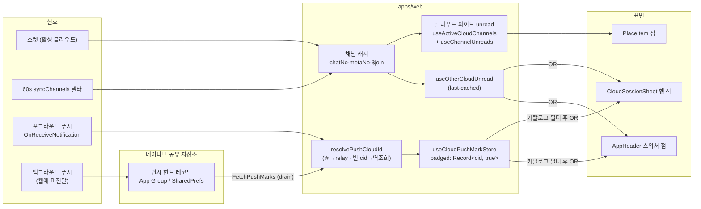
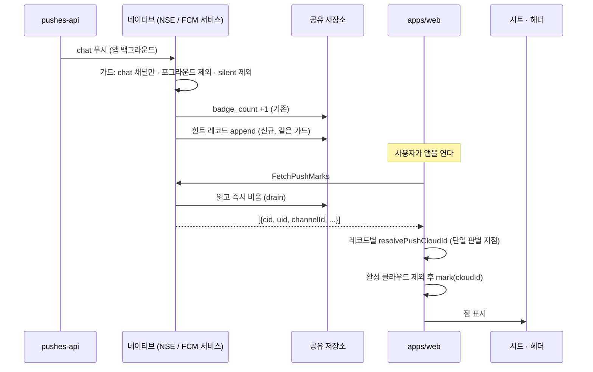

# home — 언리드 점 (비활성 플레이스 · 타 클라우드)

> 상태: Approved · 최종 갱신: 2026-08-14 · 관련 ADR: [ADR-0056](../../../../../docs/adr/0056-place-cloud-unread-dot-from-cache-and-push.md) (본체) · [ADR-0048](../../../../../docs/adr/0048-unread-count-derivation-contract.md) (unread 공식) · [ADR-0045](../../../../../docs/adr/0045-web-emoji-reaction-and-thread.md) (`'#'` relay 센티널)
>
> 대상: `apps/web/src/app/features/home` · `apps/web/src/app/hooks` · `apps/web/src/app/utils/countUnread.ts` · `libs/web-ui-kit/.../AppHeader.tsx` · `libs/app-messages`(브릿지 타입) · `apps/mobile`(iOS NSE · Android FCM 서비스 · 마크 브릿지)
>
> 참조: [cross-cloud-push.md](../../../../../docs/specs/cross-cloud-push.md) (desktop 선행 구현·페이로드) · [badge.md](../../../../../apps/mobile/docs/badge.md) (네이티브 뱃지 카운터) · [push.md](../../../../../apps/mobile/docs/push.md) (백그라운드 푸시가 웹에 닿지 않는 이유)

## 목적

홈에서 **지금 보고 있지 않은 곳**에 새 메시지가 왔음을 점으로 알린다. 두 표면이 있다:

- **비활성 플레이스**(같은 클라우드): `PlaceList`의 플레이스 행 점.
- **타 클라우드**: `CloudSessionSheet`의 클라우드 행 점 + 홈 헤더 클라우드 전환 버튼의 점(시트는 열기 전엔 보이지 않으므로 발견용 표면이 따로 필요하다).

요구사항은 **카운트가 아니라 존재 표시**다. 활성 플레이스의 채널별 읽음 개수는 기존 그대로다.

## 설계 원칙

1. **점은 존재 표시다 — 카운트가 아니다.** 비활성 영역의 데이터는 last-cached라 숫자는 거짓말을 한다. 점은 "여기 새 것이 있(었)다"만 말한다.
2. **오탐 점보다 미탐 점.** 소스 클라우드를 확실히 알 수 없으면(빈 `cid` 역조회 비유일) 마크하지 않는다. 잘못 켜진 점은 지울 방법이 없지만, 놓친 점은 다음 신호가 채운다.
3. **판별은 웹의 단일 지점에서만 한다.** 네이티브(iOS NSE·Android 서비스)는 페이로드의 **원시 판별 힌트**(`cid`·`uid`·`channelId`·`sid`·`channelName`, 빈 값·`'#'` 포함)를 저장만 하고 해석하지 않는다. `'#'`→relay, 빈 값→역조회 같은 정규화 로직을 3개 런타임에 복제하지 않는다.
4. **서버 요청을 늘리지 않는다.** 플레이스 점은 캐시 관찰(`useActiveCloudChannels`)과 기존 60초 클라우드-와이드 델타(`useBackgroundSync`)를 재사용한다. sync 등록 추가 0.
5. **저장은 원시로, 표시는 카탈로그로 필터해서.** 마크 스토어에는 판별된 cloudId를 그대로 두되, 점을 **그릴 때** 현재 카탈로그(소유+초대+relay)에 실재하는 클라우드만 인정한다. 삭제된/이상한 cid 마크가 영구 점으로 고착되는 것을 구조적으로 차단한다(desktop `6580b65c` 교훈).
6. **`apps/desktop-web`은 참조만 한다.** 포트 원본이지만 수정 금지 대상이다.

## 범위

**포함**

- `apps/web`: 홈 `byPlace`의 데이터 소스 교체(활성 사이트 → 활성 클라우드 전체, 캐시-온리) · 푸시 마크 스토어/러너(desktop 포트) · `resolvePushCloudId` 웹판 · 시트/헤더 점 표면 · `countUnread`의 ADR-0048 정합(커서 스케일 변환)
- `apps/mobile`: iOS NSE·Android FCM 서비스의 마크 힌트 기록(뱃지 +1과 같은 자리·같은 가드) · 마크 drain 브릿지(`FetchPushMarks`)와 네이티브 모듈
- `libs/app-messages`: `FetchPushMarks` 메시지 타입
- `libs/web-ui-kit`: `AppHeader`에 스위처 점 prop(additive)

**제외**

- **플레이스(sid) 단위 푸시 마크.** `sid`는 푸시 스펙에 없다(코드가 낙관적으로 읽을 뿐) — 스펙에 오르면 재검토.
- **앱 아이콘 뱃지 공식.** 네이티브 카운터(`badge_count`)와 `UnreadBadgeRunner`의 총합 계산은 그대로다. 마크는 뱃지에 더하지 않는다(desktop과 다른 점 — 모바일 뱃지는 백그라운드에서 이미 네이티브가 +1 한다).
- **Android 포그라운드 `channelId` 클로버 버그**(`useFcmHandler.ts:123-133`). 이번 기능은 `cid`/`uid`만 쓴다. 별도 수정.
- **점 프리미티브 추출**(3곳 인라인 중복) — cosmetic, 후속.
- **서버 크로스-클라우드 요약 API** · **`apps/desktop-web` · `apps/testbed`**.

## 시나리오

### S1. 같은 클라우드, 다른 플레이스에 메시지

소켓(활성 채널) 또는 60초 델타(`useBackgroundSync`의 `channel.syncChannels`)가 캐시의 채널 헤드(`chatNo`/`metaNo`)를 올린다. 홈의 클라우드-와이드 unread 집계가 `byPlace[sid]`를 재계산하고, 비선택 플레이스 행(`PlaceItem`)에 빨간 점이 켜진다. 그 플레이스에 들어가면 선택 행이 되어 점 대신 `VerifiedBadge`가 그려지고, 채널별 카운트는 기존 경로(활성 사이트 채널 + 조인 sync)가 보여준다.

### S2. 타 클라우드 메시지 — 앱 포그라운드

푸시가 네이티브 → `OnReceiveNotification` 브릿지로 웹에 도착한다. `CloudPushMarkRunner`가 페이로드에서 힌트를 꺼내 판별한다: 유효 `cid`면 그대로, `'#'`이면 relay(`'default'`), 빈 값이면 캐시 역조회(유일 매칭만). 활성 클라우드로 판별되면 무시(소켓이 이미 처리), 아니면 `mark(cloudId)`. 헤더 전환 버튼과 시트의 해당 클라우드 행에 점이 켜진다.

### S3. 타 클라우드 메시지 — 앱 백그라운드/종료

백그라운드 푸시는 웹에 전달되지 않는다 — 네이티브가 배너·뱃지만 처리한다. 뱃지 +1이 일어나는 바로 그 분기(iOS NSE `applyBadgeIncrementIfNeeded`, Android FCM 서비스 백그라운드 브랜치)에서 원시 힌트 레코드를 기존 공유 저장소(App Group UserDefaults / SharedPreferences)에 append한다. 웹이 부팅(`WebAppReady` 이후) 또는 포그라운드 복귀(`OnBackgroundStatusChanged`) 시 `FetchPushMarks`로 **drain**(읽는 즉시 네이티브 쪽 비움)하고, 레코드마다 S2와 같은 단일 판별을 거쳐 마크한다.

### S4. 마크된 클라우드로 전환

전환이 **확인된 시점** — 새 클라우드 소켓 핸드셰이크가 verified 되고 그 클라우드가 활성일 때 — 마크를 지운다. 해제 이펙트는 전환 엣지가 아니라 `(isVerified && activeBadged)` 상태에 키를 둔다: 핸드셰이크 **이후에** 도착한 마크도 쓸려나가야 하기 때문(desktop의 확정된 버그픽스).

### S5. 빈 `cid` + 역조회 비유일

`uid`로도 `channelId`로도 후보 클라우드가 하나로 좁혀지지 않으면 마크하지 않는다. 점은 안 뜬다 — 원칙 2의 의도된 미탐.

### S6. relay(`'#'`) 푸시

`'default'`로 마크된다. 시트의 `Home`(relay) 섹션 행에 점이 켜지고, relay로 전환하면 S4 규칙으로 해제된다.

### S7. 구버전 네이티브 셸

`FetchPushMarks`를 모르는 셸에서는 브릿지 호출이 실패/무응답 → 조용히 넘어간다. 포그라운드 마크(S2)와 last-cached 힌트(`useOtherCloudUnread`)만으로 동작하는 우아한 축소. 네이티브 마크는 앱 릴리스가 있어야 효력이 생긴다.

## 다이어그램

### 신호 → 점 표면



### 백그라운드 도착분 복원 (S3)



## 상세 구현

### 1. `countUnread` — 커서를 사용자-메시지 스케일로 (ADR-0048 정합)

현재 [countUnread.ts:23-32](../../../../../apps/web/src/app/utils/countUnread.ts)는 헤드만 `chatNo − metaNo`로 변환하고 커서(`max(join.readNo, join.chatNo)`, 통합 스케일)는 변환하지 않아 `join.metaNo`만큼 **과소 집계**한다(점이 안 뜨는 방향). 정본 공식으로 맞춘다:

```
unread = (channel.chatNo − channel.metaNo) − (cursor − cursorMetaNo)
cursor = max(join.readNo, join.chatNo) · cursorMetaNo = join.metaNo ?? channel.metaNo
```

- `UnreadInputs`에 `readMetaNo?: number` 추가, 부재 시 `headMetaNo` 폴백(ADR-0048 규칙: 서버가 스냅샷을 남기기 전에 쓰인 행). `CacheJoinView.metaNo`는 이미 선언돼 있다([cache.ts:115-130](../../../../../libs/app-messages/src/types/model/cache.ts)).
- 호출부 3곳이 함께 바뀐다: `useChannelUnreads` · `useOtherCloudUnread` · `useSearchContext`. 공식이 한 파일이라 호출부는 `join.metaNo`를 넘기기만 한다.

### 2. 클라우드-와이드 `byPlace` — 홈의 데이터 소스 교체

`UnreadBadgeRunner`([UnreadBadgeRunner.tsx:29-39](../../../../../apps/web/src/app/features/home/UnreadBadgeRunner.tsx))가 이미 정확히 이 계산을 하고 `byPlace`를 버리고 있다:

```ts
const cloudChannels = useActiveCloudChannels(); // 캐시-온리, 활성 클라우드 전 사이트
const { total } = useChannelUnreads(cloudChannels, useMyJoins(cloudChannels, { sync: false }));
```

이 조합을 **`useActiveCloudUnreads()` 훅으로 추출**해 러너와 HomePage가 공유한다. HomePage는:

- `unreadByPlace` ← 신규 훅의 `byPlace` (모든 사이트에 키가 채워져 `PlaceItem` 점이 켜진다)
- `unreadByChannel` ← **기존 그대로** 활성 사이트 채널 + `useMyJoins(channels)`(sync 유지) — 활성 플레이스의 채널별 카운트 신선도를 지키기 위해 두 계산이 공존한다

ADR 결정 1은 "입력을 바꾼다"고 썼지만, 문자 그대로 단일 교체하면 (a) 클라우드 전체 조인 sync 등록(서버 요청 추가 — 금지) 또는 (b) 활성 플레이스 조인 신선도 하락 중 하나를 강요한다. 두 소스 병행이 ADR의 두 제약("서버 요청 0" + "활성 플레이스는 기존대로")을 모두 지키는 형태다. [HomePage.tsx:146-152](../../../../../apps/web/src/app/features/home/pages/HomePage.tsx)의 "later step" 주석은 이 문서를 가리키도록 갱신한다.

### 3. 푸시 마크 — desktop 포트 3종

**`useCloudPushMarkStore`** (`apps/web/src/app/features/home/stores/`): desktop [useCloudPushBadgeStore.ts](../../../../../apps/desktop-web/src/app/shared/stores/useCloudPushBadgeStore.ts) 포트. `badged: Record<cloudId, true>` + `mark`/`clear`, no-op 시 동일 참조 반환 유지. persist 키는 apps/web 컨벤션으로 `'chatic.push.cloud-marks'`.

**`resolvePushCloudId`** (`apps/web/src/app/features/home/utils/`): desktop판과 달리 raw IndexedDB 스캔이 아니라 **`useGlobalCacheSearch().resolveContext`**(코드베이스의 유일한 크로스-파티션 리더, `useOtherCloudUnread`가 쓰는 그것)를 쓴다. 순수 함수 + 컨텍스트 주입 형태로 테스트 가능하게:

- `cid === '#'` → `'default'` (relay, ADR-0045 센티널 — **desktop 원본엔 이 분기가 없다**, 웹 신설)
- `cid` 유효 → 그대로
- `cid` 빈 값 → `joinsByRef`에서 `$join.userId === uid`인 클라우드가 유일하면 채택; 아니면 `channelsByRef`에서 `channel.id === channelId`(있으면 `sid`/`channelName`으로 좁히되 후보가 남을 때만) 유일 매칭; 실패 시 `null`(마크 없음)

**`CloudPushMarkRunner`** (`apps/web/src/app/runtime/`, [AppRuntime.tsx](../../../../../apps/web/src/app/runtime/AppRuntime.tsx)에 마운트): desktop [useCrossCloudPushBadge.ts](../../../../../apps/desktop-web/src/app/shared/hooks/useCrossCloudPushBadge.ts) 포트.

- 수신: `useOnReceiveNotification`([useHandleAppMessage.ts:38](../../../../../apps/web/src/app/bridge/useHandleAppMessage.ts) — handler-ref 패턴이라 desktop의 명령형 세션 조회 우회가 불필요)
- 활성 클라우드 판별 후 제외, `mark(cloudId)`
- 해제: `useSocketState().isVerified && activeBadged` 상태 키 이펙트(S4). `useSocketState`는 `@chatic/app-runtime`이 이미 export한다
- 네이티브 drain: 마운트 시 + `OnBackgroundStatusChanged` 포그라운드 시 `FetchPushMarks` 호출(네이티브 환경에서만), 레코드별 판별 → 마크

### 4. 점 표면 2곳

**시트**: [CloudSessionSheet.tsx:170·255](../../../../../apps/web/src/app/features/home/components/CloudSessionSheet.tsx)의 `hasUnread`를 `(cloudUnread[id] > 0) || badged[id]`로 확장. `Home`(relay) 행에는 `badged['default']`. `useOtherCloudUnread`는 시트 내부에서 **HomePage로 리프트**해 헤더 점과 단일 소스를 공유하고, 시트에는 prop으로 내린다(열림 시 refresh 호출은 유지).

**헤더**: `AppHeader`(libs/web-ui-kit)에 additive optional prop(예: `switcherDot?: boolean`) — 스위처 트리거의 이름 행(chevron 옆)에 기존과 같은 `size-1.5 rounded-full bg-red-500` 점. HomePage가 `otherCloudUnread.total > 0 || (카탈로그-필터된 마크 존재)`로 계산해 내린다. 카탈로그 필터(원칙 5): 소유+초대+`'default'` 집합에 있고 활성이 아닌 마크만 인정.

### 5. 네이티브 마크 기록 + drain 브릿지

**저장 형식** (양 플랫폼 공통 계약): 힌트 레코드 배열 `[{cid, uid, channelId, sid, channelName}]` — 전부 원시 문자열, 부재 필드는 생략. 상한(예: 최근 100건)으로 무한 성장 방지. ADR 결정 3의 "원시 `cid` 저장"을 **원시 힌트 레코드 저장**으로 구체화한다 — 빈 `cid`의 역조회에는 `uid`/`channelId`가 필요하므로 `cid`만으로는 웹의 단일 판별 지점(원칙 3)이 성립하지 않는다.

**iOS** ([NotificationService.swift](../../../../../apps/mobile/ios/ChaticNotificationServiceExtension/NotificationService.swift)): `applyBadgeIncrementIfNeeded` 안(같은 가드: chat 채널만 · `app_active` 제외 · silent은 NSE 미실행으로 구조적 배제)에서 App Group `group.io.chatic.dou`의 새 키(`push_cloud_marks`)에 레코드 append. NSE는 현재 `cid`를 전혀 파싱하지 않으므로 **파서 신설**: `userInfo`의 `payload`/`data` 키를 문자열(JSON)·딕셔너리 양쪽으로 처리(기존 `normalizeArgs`와 JS `extractPushContext`가 같은 이중 형태를 다루는 선례). 프로비저닝 재작업 없음 — App Group은 이미 3개 entitlements에 등록돼 있다.

**Android** ([ChaticFirebaseMessagingService.kt:91](../../../../../apps/mobile/android/app/src/main/java/io/chatic/dou/push/ChaticFirebaseMessagingService.kt)): `BadgeStore.increment` 호출 분기에서 신규 `PushMarkStore.append(...)`. 페이로드 JSON 파싱은 `mergeContextIntoLink`(L114)가 이미 하는 방식을 확장(`uid`/`channelId`/`channelName` 추가). 저장은 `BadgeStore`와 같은 패턴의 SharedPreferences.

**브릿지** (`FetchPushMarks`, drain 시맨틱 — 응답과 동시에 네이티브 저장소 클리어, 원자적):

- 타입: `libs/app-messages`의 web-message 4개 파일(model/notification.ts · web-message.ts · app-message.ts · web-message-response.ts — 마지막이 handshake `supportedWebMessages` 노출 지점)
- RN 핸들러: [useFcmHandler.ts](../../../../../apps/mobile/src/app/webview/hooks/useFcmHandler.ts)에 추가, [useWebMessageRouter.ts](../../../../../apps/mobile/src/app/webview/hooks/useWebMessageRouter.ts) 3곳(초기 ref · 갱신 ref · handlerMap) 등록
- 네이티브 모듈: Android는 신규 `PushMarksModule`(패턴: `BadgeSyncModule`), iOS는 **신규 모듈**(App Group을 읽는 JS 모듈이 현재 없다 — 패턴: `AppIconManager.m`), TS 래퍼는 `src/app/bridge/` 컨벤션

## 검증 방법

- **유닛 (jest, co-located)**: `countUnread.test.ts`(커서 스케일 케이스 추가 — `join.metaNo` 유/무/폴백) · `resolvePushCloudId.test.ts`(센티널·유효·빈 값 유일/비유일·sid 좁히기) · `useCloudPushMarkStore.test.ts`(mark/clear·no-op 참조) · `CloudPushMarkRunner.test.tsx`(`useOnReceiveNotification` jest.mock 캡처 패턴 — [useInAppPushMessage.test.tsx](../../../../../apps/web/src/app/hooks/useInAppPushMessage.test.tsx) 참조; 활성 제외·해제 조건·drain 병합) · `useActiveCloudUnreads` · 시트/헤더 렌더 테스트. `'#'` 처리는 [useHandlePushNavigation.test.ts:177-250](../../../../../apps/web/src/app/bridge/navigation/useHandlePushNavigation.test.ts)의 기존 relay 스위트와 일관되게.
- **타입/빌드**: `apps/web` typecheck(기준선 0건 유지) · `libs/app-messages`는 `tsc -b tsconfig.lib.json`(라이브러리 no-op 함정 주의).
- **수동 (실기 필수)**: 네이티브 코드는 CI 컴파일 검증이 없다 — iOS·Android 실기 빌드로 (1) 백그라운드 푸시 → 뱃지+마크 기록, (2) 앱 열기 → 점 복원, (3) 해당 클라우드 전환 → 점 해제, (4) 구버전 셸 시나리오(브릿지 미지원 → 무해).

---

## 구현 체크리스트 (임시 — Live 전환 시 섹션째 삭제)

1. **`countUnread` 정합** — `readMetaNo` 입력 추가 + 폴백, 호출부 3곳(`useChannelUnreads`·`useOtherCloudUnread`·`useSearchContext`)에서 `join.metaNo` 전달, 테스트. _(독립 — 먼저 커밋 가능)_
2. **`useActiveCloudUnreads` 추출** — `UnreadBadgeRunner` 리팩토링 + HomePage `unreadByPlace` 소스 교체, L146-152 주석 갱신, 테스트.
3. **마크 스토어 + 리졸버** — `useCloudPushMarkStore` · `resolvePushCloudId`(순수 함수) + 테스트.
4. **`CloudPushMarkRunner`** — 수신·판별·마크·해제, AppRuntime 마운트, 테스트.
5. **표면** — `useOtherCloudUnread` HomePage 리프트, 시트 `hasUnread` OR 확장 + relay 행, `AppHeader` 점 prop + HomePage 배선, 테스트.
6. **브릿지 타입** — `libs/app-messages`에 `FetchPushMarks` 4개 파일 + 빌드.
7. **Android 네이티브** — `PushMarkStore.kt` + FCM 서비스 append + `PushMarksModule` drain.
8. **iOS 네이티브** — NSE 페이로드 파서 + App Group append + drain 모듈(+브릿징 헤더 확인).
9. **RN 배선** — `useFcmHandler` 핸들러 + `useWebMessageRouter` 3곳 + TS 래퍼.
10. **웹 drain 연결** — 러너의 부팅/포그라운드 drain 경로 완성, 통합 테스트.
11. **문서 Live 전환** — 본 문서 다듬기 + `badge.md`/`push.md` 마크 언급(dev-4 소관이면 위임).

## 리스크와 미지수 (임시 — Live 전환 시 섹션째 삭제)

- **`uid`가 페이로드에 실제로 오는가.** desktop 리졸버는 `data.uid`를 1차 키로 쓰지만, [cross-cloud-push.md](../../../../../docs/specs/cross-cloud-push.md) §4의 페이로드 예시에는 `ownerId`만 있고 `uid`가 없다. 구현 초기에 실페이로드를 확인하고, 없으면 `channelId` 폴백이 1차가 된다(정확도 하락, 동작은 유지).
- **iOS APNs `payload` 키의 실형태**(dict vs JSON string) — 파서는 양쪽을 다루지만 실기 확인 전까지 미검증.
- **네이티브 컴파일 CI 부재** — Swift/Kotlin은 실기 빌드가 유일한 검증. 릴리스 전 필수.
- **재계산 빈도** — 홈의 unread 입력이 클라우드 전체로 늘어난다(러너와 동일 계산의 두 번째 구독). 채널 수가 큰 클라우드에서 관찰 지점.
- **`countUnread` 변경의 파급** — 홈·타 클라우드·검색 3곳이 같은 공식을 쓴다. 방향은 과소 집계 해소(숫자가 커지는 쪽)라 시각적 회귀 가능성 있음 — 테스트로 고정하고 QA에서 확인.
- **드레인 원자성** — drain 응답 후 웹 persist 전에 웹이 죽으면 그 배치는 유실된다(점 미탐 방향, 원칙 2와 일관). 재전송 프로토콜은 과잉으로 판단.
