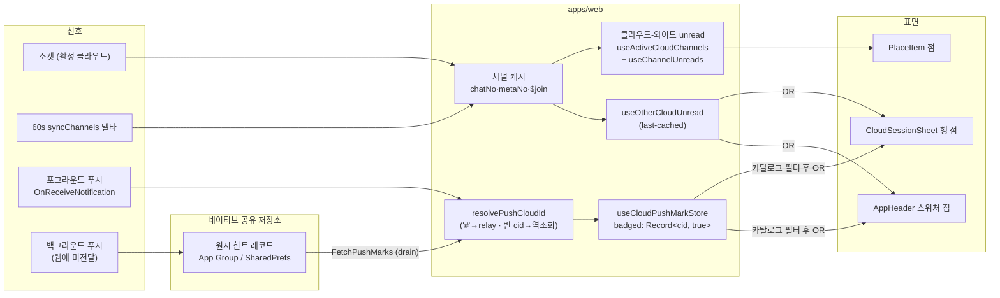
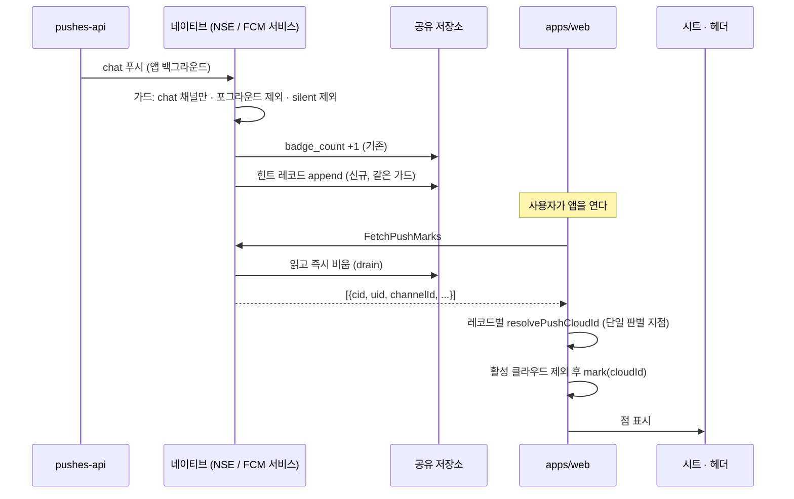

# home — 언리드 점 (비활성 플레이스 · 타 클라우드)

> 상태: Live · 최종 갱신: 2026-08-14 · 관련 ADR: [ADR-0056](../../../../../docs/adr/0056-place-cloud-unread-dot-from-cache-and-push.md) (본체) · [ADR-0048](../../../../../docs/adr/0048-unread-count-derivation-contract.md) (unread 공식) · [ADR-0045](../../../../../docs/adr/0045-web-emoji-reaction-and-thread.md) (`'#'` relay 센티널)
>
> 대상: `apps/web/src/app/features/home` · `apps/web/src/app/hooks` · `apps/web/src/app/utils/countUnread.ts` · `libs/web-ui-kit/.../AppHeader.tsx` · `libs/app-messages`(브릿지 타입) · `apps/mobile`(iOS NSE · Android FCM 서비스 · 마크 브릿지)
>
> 참조: [cross-cloud-push.md](../../../../../docs/specs/cross-cloud-push.md) (desktop 선행 구현·페이로드) · [badge.md](../../../../../apps/mobile/docs/badge.md) (네이티브 뱃지 카운터) · [push.md](../../../../../apps/mobile/docs/push.md) (백그라운드 푸시가 웹에 닿지 않는 이유)

## 목적

홈에서 **지금 보고 있지 않은 곳**에 새 메시지가 왔음을 점으로 알린다. 두 표면이 있다:

- **비활성 플레이스**(같은 클라우드): `PlaceList`의 플레이스 행 점.
- **타 클라우드**: `CloudSessionSheet`의 클라우드 행 점 + 홈 헤더 클라우드 전환 버튼의 점(시트는 열기 전엔 보이지 않으므로 발견용 표면이 따로 필요하다).

요구사항은 **카운트가 아니라 존재 표시**다. 활성 플레이스의 채널별 읽음 개수는 기존 그대로다.

## 설계 원칙

1. **점은 존재 표시다 — 카운트가 아니다.** 비활성 영역의 데이터는 last-cached라 숫자는 거짓말을 한다. 점은 "여기 새 것이 있(었)다"만 말한다.
2. **오탐 점보다 미탐 점.** 소스 클라우드를 확실히 알 수 없으면(빈 `cid` 역조회 비유일) 마크하지 않는다. 잘못 켜진 점은 지울 방법이 없지만, 놓친 점은 다음 신호가 채운다.
3. **판별은 웹의 단일 지점에서만 한다.** 네이티브(iOS NSE·Android 서비스)는 페이로드의 **원시 판별 힌트**(`cid`·`uid`·`channelId`·`sid`·`channelName`, 빈 값·`'#'` 포함)를 저장만 하고 해석하지 않는다. `'#'`→relay, 빈 값→역조회 같은 정규화 로직을 3개 런타임에 복제하지 않는다.
4. **서버 요청을 늘리지 않는다.** 플레이스 점은 캐시 관찰(`useActiveCloudChannels`)과 기존 60초 클라우드-와이드 델타(`useBackgroundSync`)를 재사용한다. sync 등록 추가 0.
5. **저장은 원시로, 표시는 카탈로그로 필터해서.** 마크 스토어에는 판별된 cloudId를 그대로 두되, 점을 **그릴 때** 현재 카탈로그(소유+초대+relay)에 실재하는 클라우드만 인정한다. 삭제된/이상한 cid 마크가 영구 점으로 고착되는 것을 구조적으로 차단한다(desktop `6580b65c` 교훈).
6. **`apps/desktop-web`은 참조만 한다.** 포트 원본이지만 수정 금지 대상이다.

## 범위

**포함**

- `apps/web`: 홈 `byPlace`의 데이터 소스 교체(활성 사이트 → 활성 클라우드 전체, 캐시-온리) · 푸시 마크 스토어/러너(desktop 포트) · `resolvePushCloudId` 웹판 · 시트/헤더 점 표면 · `countUnread`의 ADR-0048 정합(커서 스케일 변환)
- `apps/mobile`: iOS NSE·Android FCM 서비스의 마크 힌트 기록(뱃지 +1과 같은 자리·같은 가드) · 마크 drain 브릿지(`FetchPushMarks`)와 네이티브 모듈
- `libs/app-messages`: `FetchPushMarks` 메시지 타입
- `libs/web-ui-kit`: `AppHeader`에 스위처 점 prop(additive)

**제외**

- **플레이스(sid) 단위 푸시 마크.** `sid`는 푸시 스펙에 없다(코드가 낙관적으로 읽을 뿐) — 스펙에 오르면 재검토.
- **앱 아이콘 뱃지 공식.** 네이티브 카운터(`badge_count`)와 `UnreadBadgeRunner`의 총합 계산은 그대로다. 마크는 뱃지에 더하지 않는다(desktop과 다른 점 — 모바일 뱃지는 백그라운드에서 이미 네이티브가 +1 한다).
- **Android 포그라운드 `channelId` 클로버 버그**(`useFcmHandler.ts:123-133`). 이번 기능은 `cid`/`uid`만 쓴다. 별도 수정.
- **점 프리미티브 추출**(3곳 인라인 중복) — cosmetic, 후속.
- **서버 크로스-클라우드 요약 API** · **`apps/desktop-web` · `apps/testbed`**.

## 시나리오

### S1. 같은 클라우드, 다른 플레이스에 메시지

소켓(활성 채널) 또는 60초 델타(`useBackgroundSync`의 `channel.syncChannels`)가 캐시의 채널 헤드(`chatNo`/`metaNo`)를 올린다. 홈의 클라우드-와이드 unread 집계가 `byPlace[sid]`를 재계산하고, 비선택 플레이스 행(`PlaceItem`)에 빨간 점이 켜진다. 그 플레이스에 들어가면 선택 행이 되어 점 대신 `VerifiedBadge`가 그려지고, 채널별 카운트는 기존 경로(활성 사이트 채널 + 조인 sync)가 보여준다.

### S2. 타 클라우드 메시지 — 앱 포그라운드

푸시가 네이티브 → `OnReceiveNotification` 브릿지로 웹에 도착한다. `CloudPushMarkRunner`가 페이로드에서 힌트를 꺼내 판별한다: 유효 `cid`면 그대로, `'#'`이면 relay(`'default'`), 빈 값이면 캐시 역조회(유일 매칭만). 활성 클라우드로 판별되면 무시(소켓이 이미 처리), 아니면 `mark(cloudId)`. 헤더 전환 버튼과 시트의 해당 클라우드 행에 점이 켜진다.

### S3. 타 클라우드 메시지 — 앱 백그라운드/종료

백그라운드 푸시는 웹에 전달되지 않는다 — 네이티브가 배너·뱃지만 처리한다. 뱃지 +1이 일어나는 바로 그 분기(iOS NSE `applyBadgeIncrementIfNeeded`, Android FCM 서비스 백그라운드 브랜치)에서 원시 힌트 레코드를 기존 공유 저장소(App Group UserDefaults / SharedPreferences)에 append한다. 웹이 부팅(`WebAppReady` 이후) 또는 포그라운드 복귀(`OnBackgroundStatusChanged`) 시 `FetchPushMarks`로 **drain**(읽는 즉시 네이티브 쪽 비움)하고, 레코드마다 S2와 같은 단일 판별을 거쳐 마크한다.

### S4. 마크된 클라우드로 전환

전환이 **확인된 시점** — 새 클라우드 소켓 핸드셰이크가 verified 되고 그 클라우드가 활성일 때 — 마크를 지운다. 해제 이펙트는 전환 엣지가 아니라 `(isVerified && activeBadged)` 상태에 키를 둔다: 핸드셰이크 **이후에** 도착한 마크도 쓸려나가야 하기 때문(desktop의 확정된 버그픽스).

### S5. 빈 `cid` + 역조회 비유일

`uid`로도 `channelId`로도 후보 클라우드가 하나로 좁혀지지 않으면 마크하지 않는다. 점은 안 뜬다 — 원칙 2의 의도된 미탐.

### S6. relay(`'#'`) 푸시

`'default'`로 마크된다. 시트의 `Home`(relay) 섹션 행에 점이 켜지고, relay로 전환하면 S4 규칙으로 해제된다.

### S7. 구버전 네이티브 셸

`FetchPushMarks`를 모르는 셸에서는 브릿지 호출이 실패/무응답 → 조용히 넘어간다. 포그라운드 마크(S2)와 last-cached 힌트(`useOtherCloudUnread`)만으로 동작하는 우아한 축소. 네이티브 마크는 앱 릴리스가 있어야 효력이 생긴다.

## 다이어그램

### 신호 → 점 표면



### 백그라운드 도착분 복원 (S3)



## 상세 구현

### 1. `countUnread` — 커서를 사용자-메시지 스케일로 (ADR-0048 정합)

[countUnread.ts](../../../../../apps/web/src/app/utils/countUnread.ts)는 헤드와 커서 양쪽을 각자의 `metaNo` 스냅샷으로 사용자-메시지 스케일로 변환한 뒤 뺀다:

```
unread = (channel.chatNo − channel.metaNo) − (cursor − cursorMetaNo)
cursor = max(join.readNo, join.chatNo) · cursorMetaNo = join.metaNo ?? channel.metaNo
```

이전에는 헤드만 변환하고 커서(통합 스케일)는 그대로 빼서 `join.metaNo`만큼 과소 집계했다(점이 안 뜨는 방향) — `UnreadInputs.readMetaNo?: number`를 추가하고, 값이 없으면(서버가 스냅샷을 남기기 전에 쓰인 join 행) `headMetaNo`로 폴백해 고쳤다. `CacheJoinView.metaNo`는 이미 선언돼 있었다([cache.ts:115-130](../../../../../libs/app-messages/src/types/model/cache.ts)).

호출부 3곳이 함께 `join.metaNo`를 넘긴다: `useChannelUnreads` · `useOtherCloudUnread` · `useSearchContext`. 공식이 한 파일이라 호출부는 값을 전달만 한다.

### 2. 클라우드-와이드 `byPlace` — 홈의 데이터 소스

캐시-온리 클라우드 전체 관측 하나를 [useActiveCloudUnreads](../../../../../apps/web/src/app/hooks/useActiveCloudUnreads.ts)로 추출해 두 소비자가 공유한다:

```ts
const cloudChannels = useActiveCloudChannels(); // 캐시-온리, 활성 클라우드 전 사이트
return useChannelUnreads(cloudChannels, useMyJoins(cloudChannels, { sync: false }));
```

- `UnreadBadgeRunner`는 여기서 `total`만 가져와 앱 뱃지를 계산한다(기존 그대로).
- `HomePage`는 `byPlace`를 가져와 `unreadByPlace`로 쓴다(모든 사이트에 키가 채워져 `PlaceItem` 점이 켜진다) — `unreadByChannel`은 **별도로** 활성 사이트 채널 + `useMyJoins(channels)`(join sync 유지)로 그대로 계산한다.

두 소스를 병행하는 이유: 단일 교체는 (a) 클라우드 전체 조인 sync 등록(서버 요청 추가) 또는 (b) 활성 플레이스 조인 신선도 하락 중 하나를 강요한다. 병행이 ADR의 두 제약("서버 요청 0" + "활성 플레이스는 기존대로")을 모두 지킨다. [HomePage.tsx](../../../../../apps/web/src/app/features/home/pages/HomePage.tsx)의 unread 소스 주석이 이 문서를 가리킨다.

### 3. 푸시 마크 — desktop 포트 3종

**`useCloudPushMarkStore`** (`apps/web/src/app/features/home/stores/`): desktop [useCloudPushBadgeStore.ts](../../../../../apps/desktop-web/src/app/shared/stores/useCloudPushBadgeStore.ts) 포트. `badged: Record<cloudId, true>` + `mark`/`clear`, no-op 시 동일 참조 반환 유지. persist 키는 apps/web 컨벤션으로 `'chatic.push.cloud-marks'`.

**`resolvePushCloudId`** (`apps/web/src/app/features/home/utils/`): desktop판과 달리 raw IndexedDB 스캔이 아니라 **`useGlobalCacheSearch().resolveContext`**(코드베이스의 유일한 크로스-파티션 리더, `useOtherCloudUnread`가 쓰는 그것)를 쓴다. 순수 함수 + 컨텍스트 주입 형태로 테스트 가능하게:

- `cid === '#'` → `'default'` (relay, ADR-0045 센티널 — **desktop 원본엔 이 분기가 없다**, 웹 신설)
- `cid` 유효 → 그대로
- `cid` 빈 값 → `joinsByRef`에서 `$join.userId === uid`인 클라우드가 유일하면 채택; 아니면 `channelsByRef`에서 `channel.id === channelId`(있으면 `sid`/`channelName`으로 좁히되 후보가 남을 때만) 유일 매칭; 실패 시 `null`(마크 없음)

**`CloudPushMarkRunner`** ([apps/web/.../features/home/CloudPushMarkRunner.tsx](../../../../../apps/web/src/app/features/home/CloudPushMarkRunner.tsx), [AppRuntime.tsx](../../../../../apps/web/src/app/runtime/AppRuntime.tsx)에 `UnreadBadgeRunner` 옆으로 마운트): desktop [useCrossCloudPushBadge.ts](../../../../../apps/desktop-web/src/app/shared/hooks/useCrossCloudPushBadge.ts) 포트.

- 힌트 추출은 `extractPushCloudHint`([resolveInAppPushRoute.ts](../../../../../apps/web/src/app/utils/resolveInAppPushRoute.ts)) — 기존 `extractPushContext`(cid/sid만)와 payload-merge 로직을 공유하되 uid/channelId/channelName까지 뽑는 확장판. 두 함수가 병합 규칙을 두 벌 갖지 않도록 `mergePushPayload`로 추출해 공유한다.
- 수신: `useOnReceiveNotification`([useHandleAppMessage.ts:38](../../../../../apps/web/src/app/bridge/useHandleAppMessage.ts) — handler-ref 패턴이라 desktop의 명령형 세션 조회 우회가 불필요)
- 클라우드 후보 집합(`cids`)은 오너 카탈로그 + 초대 클라우드 + relay를 매 렌더 계산하되 `cidsKey`(join한 문자열)로 안정화 — `useOtherCloudUnread`와 같은 패턴
- 활성 클라우드 판별 후 제외, `mark(cloudId)`
- 해제: `useRuntimeSocketState().isVerified && activeBadged` 상태 키 이펙트(S4)
- 네이티브 drain(`drainNativeMarks`): 마운트 시 1회(부팅) + `useOnBackgroundStatusChanged`로 포그라운드 복귀마다 `appBridge.fetchPushMarks()` 호출 → 레코드마다 같은 `resolvePushCloudId` 경로로 판별 → 마크. 구버전 셸/브라우저에서는 `appBridge.fetchPushMarks()`가 빈 배열로 우아하게 축소된다(S7).

### 4. 점 표면 2곳

**시트**: [CloudSessionSheet.tsx](../../../../../apps/web/src/app/features/home/components/CloudSessionSheet.tsx)의 `hasUnread`를 `(cloudUnread[id] > 0) || isBadged(id)`로 확장 — `isBadged`는 `id !== selectedCloudId && catalogCloudIds.has(id) && badged[id]`(원칙 5의 카탈로그 필터, `catalogCloudIds` = 오너 카탈로그 + 초대 클라우드 + `RELAY_CLOUD_ID`). `DouHomeItem`(relay/`Home` 행)에 `hasUnread` prop을 새로 추가해 `isBadged('default')`를 전달. `useOtherCloudUnread`는 시트 밖 **HomePage로 리프트**해 `cloudUnread`/`refreshCloudUnread`를 prop으로 내리고, 헤더 점과 단일 캐시 읽기를 공유한다(열림 시 refresh 호출은 시트에 그대로 유지).

**헤더**: `AppHeader`(libs/web-ui-kit)에 additive optional prop `switcherDot?: boolean` — `cloud`/`no-cloud` 두 kind 모두, 스위처 트리거의 chevron 옆에 기존과 같은 `size-1.5 rounded-full bg-red-500` 점. HomePage가 `otherCloudUnreadTotal > 0 || hasOtherCloudMark`로 계산해 내린다. `hasOtherCloudMark`는 시트와 같은 카탈로그 필터를 HomePage 레벨에서 다시 적용한 것(중복이지만 두 표면이 각자 자기 스코프의 카탈로그로 필터링 — 시트는 `useCloudSessionCatalog`를 이미 갖고 있고 HomePage도 이미 갖고 있어 별도 훅 추출 없이 인라인).

### 5. 네이티브 마크 기록 + drain 브릿지

**저장 형식** (양 플랫폼 공통 계약): 힌트 레코드 배열 `[{cid, uid, channelId, sid, channelName}]` — 전부 원시 문자열, 부재 필드는 생략. 상한 100건으로 무한 성장 방지. ADR 결정 3의 "원시 `cid` 저장"을 **원시 힌트 레코드 저장**으로 구체화했다 — 빈 `cid`의 역조회에는 `uid`/`channelId`가 필요하므로 `cid`만으로는 웹의 단일 판별 지점(원칙 3)이 성립하지 않는다.

**iOS** ([NotificationService.swift](../../../../../apps/mobile/ios/ChaticNotificationServiceExtension/NotificationService.swift)): `applyBadgeIncrementIfNeeded` 안(같은 가드: chat 채널만 · `app_active` 제외 · silent은 NSE 미실행으로 구조적 배제)에서 App Group `group.io.chatic.dou`의 새 키 `push_marks`에 레코드 append(카운터 `badge_count`와 같은 파일). NSE는 원래 `cid`를 전혀 파싱하지 않았으므로 `parsePushCloudHint`를 신설: `userInfo`의 최상위 필드를 베이스로, `data`/`payload` 필드(문자열 JSON 또는 딕셔너리 — 기존 `normalizeArgs`가 loc-args에서 다루는 것과 같은 이중 형태)를 덮어써 병합한다. 드레인은 신규 **`PushMarksModule.m`**(순수 Objective-C, `AppIconManager.m`과 동일한 `RCT_EXPORT_MODULE`/`RCT_EXPORT_METHOD` + Promise 패턴) — App Group에서 `push_marks` 배열을 읽고 그 자리에서 `removeObjectForKey`. `Bridges/` 폴더가 Xcode의 `PBXFileSystemSynchronizedRootGroup`이라 프로젝트 파일 수동 등록 없이 자동 인식된다. 프로비저닝 재작업 없음 — App Group은 이미 3개 entitlements에 등록돼 있다.

**Android** ([ChaticFirebaseMessagingService.kt](../../../../../apps/mobile/android/app/src/main/java/io/chatic/dou/push/ChaticFirebaseMessagingService.kt)): `BadgeStore.increment` 호출 분기에서 신규 **`PushMarkStore.append(...)`**(`BadgeStore`와 같은 `chatic_badge` SharedPreferences 파일, 새 키 `push_marks`, 상한 100건에 오래된 것부터 제거). 페이로드 파싱은 `mergeContextIntoLink`가 쓰는 것과 같은 `JSONObject.optString` 패턴을 그대로 따르되 별도 함수(`parsePushCloudHint`)로 분리 — cid/sid만 보는 기존 함수와 우려사항이 다르다(마크 힌트는 uid/channelId/channelName까지 필요).

**드레인 브릿지** (`FetchPushMarks`, 응답과 동시에 네이티브 저장소 클리어):

- 타입: `libs/app-messages`의 4개 파일(model/notification.ts에 `PushCloudMarkRecord`/`FetchPushMarksPayload`/`OnFetchPushMarksPayload` · web-message.ts · app-message.ts · web-message-response.ts — 마지막이 handshake `supportedWebMessages` 노출 지점)
- RN 핸들러: [useFcmHandler.ts](../../../../../apps/mobile/src/app/webview/hooks/useFcmHandler.ts)의 `handleFetchPushMarks`(네이티브 drain 결과를 `OnFetchPushMarks` 성공/실패 응답으로 감싼다), [useWebMessageRouter.ts](../../../../../apps/mobile/src/app/webview/hooks/useWebMessageRouter.ts) 3곳(구조분해 · `handlersRef` 초기값/갱신 · `handlerMap`) 등록
- 네이티브 모듈: Android `PushMarksModule`/`PushMarksPackage`(패턴: `BadgeSyncModule`/`BadgeSyncPackage`, `MainApplication.kt`에 등록), iOS `PushMarksModule.m`(패턴: `AppIconManager.m`)
- TS 래퍼: [PushMarksBridge.ts](../../../../../apps/mobile/src/app/bridge/PushMarksBridge.ts) — `NativeModules.PushMarks`가 없으면(구버전 셸) 경고 로그만 남기고 빈 배열
- 웹 쪽 호출: `appBridge.fetchPushMarks()`([appBridge.ts](../../../../../apps/web/src/app/bridge/appBridge.ts)) — `webClient.request`가 실패해도(플레인 브라우저·구버전 셸) `.catch(() => [])`로 빈 배열

## 검증 방법

- **유닛 (jest, co-located)**: `countUnread.test.ts`(커서 스케일 케이스) · `resolvePushCloudId.test.ts`(센티널·유효·빈 값 유일/비유일·sid 좁히기) · `useCloudPushMarkStore.test.ts`(mark/clear·no-op 참조) · `resolveInAppPushRoute.test.ts`(`extractPushCloudHint`) · `CloudPushMarkRunner.test.tsx`(jest.mock 캡처 패턴; 활성 제외·해제 조건·마운트/포그라운드 drain) · `appBridge.test.ts`(`fetchPushMarks`) · `useFcmHandler.test.ts`/`PushMarksBridge.test.ts`(RN 쪽 drain 왕복) · `useActiveCloudUnreads.test.ts` · `CloudSessionSheet.test.tsx`/`AppHeader.test.tsx`(점 렌더). `'#'` 처리는 [useHandlePushNavigation.test.ts](../../../../../apps/web/src/app/bridge/navigation/useHandlePushNavigation.test.ts)의 기존 relay 스위트와 일관되게 유지된다.
- **타입/빌드**: `apps/web`·`apps/mobile` typecheck 클린(무관한 두 건의 동시 작업 이슈 제외) · `libs/app-messages`/`libs/web-ui-kit`은 `tsc -b tsconfig.lib.json`.
- **네이티브 실기 컴파일** (완료): Android `./gradlew :app:compileDevDebugKotlin` BUILD SUCCESSFUL · iOS `xcodebuild`로 `ChaticNotificationServiceExtension` 스킴과 `Chatic Dev`(메인 앱, `PushMarksModule.m` 포함) 스킴 모두 BUILD SUCCEEDED. 남은 것은 시뮬레이터/실기에서의 동작 확인(백그라운드 푸시 → 마크 기록 → 앱 열기 → 점 복원 → 클라우드 전환 → 점 해제) — 코드 경로 자체는 컴파일 검증됐다.
